# 性能监控工具

## 性能监控基础

### 监控指标分类

```mermaid
graph TD
    A[性能监控指标] --> B[加载性能]
    A --> C[运行时性能]
    A --> D[用户体验]
    A --> E[资源使用]
    
    B --> B1[首屏时间]
    B --> B2[页面加载时间]
    B --> B3[资源加载时间]
    B --> B4[网络请求时间]
    
    C --> C1[JavaScript执行时间]
    C --> C2[DOM操作时间]
    C --> C3[渲染时间]
    C --> C4[内存使用]
    
    D --> D1[交互响应时间]
    D --> D2[页面切换时间]
    D --> D3[错误率]
    D --> D4[用户满意度]
    
    E --> E1[CPU使用率]
    E --> E2[内存占用]
    E --> E3[网络带宽]
    E --> E4[存储使用]
    
    F[监控工具] --> G[浏览器工具]
    F --> H[第三方工具]
    F --> I[自定义工具]
    F --> J[APM工具]
    
    G --> G1[DevTools]
    G --> G2[Performance API]
    G --> G3[User Timing API]
    
    H --> H1[Google Analytics]
    H --> H2[New Relic]
    H --> H3[DataDog]
    
    I --> I1[自定义指标]
    I --> I2[业务指标]
    I --> I3[用户行为]
    
    J --> J1[应用性能监控]
    J --> J2[错误追踪]
    J --> J3[日志分析]
```


### 监控工具对比
| 工具类型 | 优势 | 劣势 | 适用场景 |
|----------|------|------|----------|
| 浏览器DevTools | 免费、功能全面 | 需要手动操作 | 开发调试 |
| Performance API | 程序化监控 | 浏览器兼容性 | 自动化监控 |
| 第三方工具 | 功能强大、数据分析 | 成本高、隐私问题 | 生产环境 |
| 自定义工具 | 灵活、可控 | 开发成本高 | 特定需求 |

## 浏览器性能API

### Performance API
```javascript
// 1. 基本性能监控
class PerformanceMonitor {
    constructor() {
        this.metrics = new Map();
        this.observers = new Map();
        this.init();
    }
    
    init() {
        // 监控页面加载性能
        this.observePageLoad();
        
        // 监控资源加载性能
        this.observeResourceTiming();
        
        // 监控用户交互性能
        this.observeUserTiming();
        
        // 监控长任务
        this.observeLongTasks();
        
        // 监控布局偏移
        this.observeLayoutShift();
    }
    
    // 页面加载性能
    observePageLoad() {
        window.addEventListener('load', () => {
            const navigation = performance.getEntriesByType('navigation')[0];
            
            this.metrics.set('pageLoad', {
                domContentLoaded: navigation.domContentLoadedEventEnd - navigation.domContentLoadedEventStart,
                loadComplete: navigation.loadEventEnd - navigation.loadEventStart,
                firstByte: navigation.responseStart - navigation.requestStart,
                domInteractive: navigation.domInteractive - navigation.navigationStart,
                totalLoadTime: navigation.loadEventEnd - navigation.navigationStart
            });
        });
    }
    
    // 资源加载性能
    observeResourceTiming() {
        const observer = new PerformanceObserver((list) => {
            for (const entry of list.getEntries()) {
                if (entry.entryType === 'resource') {
                    this.metrics.set(`resource:${entry.name}`, {
                        duration: entry.duration,
                        transferSize: entry.transferSize,
                        encodedBodySize: entry.encodedBodySize,
                        decodedBodySize: entry.decodedBodySize,
                        startTime: entry.startTime
                    });
                }
            }
        });
        
        observer.observe({ entryTypes: ['resource'] });
        this.observers.set('resource', observer);
    }
    
    // 用户自定义性能标记
    observeUserTiming() {
        const observer = new PerformanceObserver((list) => {
            for (const entry of list.getEntries()) {
                if (entry.entryType === 'measure') {
                    this.metrics.set(`measure:${entry.name}`, {
                        duration: entry.duration,
                        startTime: entry.startTime
                    });
                }
            }
        });
        
        observer.observe({ entryTypes: ['measure'] });
        this.observers.set('measure', observer);
    }
    
    // 长任务监控
    observeLongTasks() {
        if ('PerformanceObserver' in window) {
            const observer = new PerformanceObserver((list) => {
                for (const entry of list.getEntries()) {
                    if (entry.duration > 50) { // 超过50ms的任务
                        this.metrics.set(`longTask:${Date.now()}`, {
                            duration: entry.duration,
                            startTime: entry.startTime,
                            name: entry.name
                        });
                    }
                }
            });
            
            observer.observe({ entryTypes: ['longtask'] });
            this.observers.set('longtask', observer);
        }
    }
    
    // 布局偏移监控
    observeLayoutShift() {
        if ('PerformanceObserver' in window) {
            const observer = new PerformanceObserver((list) => {
                for (const entry of list.getEntries()) {
                    if (!entry.hadRecentInput) {
                        this.metrics.set(`layoutShift:${Date.now()}`, {
                            value: entry.value,
                            startTime: entry.startTime,
                            sources: entry.sources
                        });
                    }
                }
            });
            
            observer.observe({ entryTypes: ['layout-shift'] });
            this.observers.set('layout-shift', observer);
        }
    }
    
    // 手动性能标记
    mark(name) {
        performance.mark(name);
    }
    
    measure(name, startMark, endMark) {
        performance.measure(name, startMark, endMark);
    }
    
    // 获取性能指标
    getMetrics() {
        return Object.fromEntries(this.metrics);
    }
    
    // 获取特定指标
    getMetric(key) {
        return this.metrics.get(key);
    }
    
    // 清理观察器
    disconnect() {
        for (const observer of this.observers.values()) {
            observer.disconnect();
        }
        this.observers.clear();
    }
}

// 使用示例
const monitor = new PerformanceMonitor();

// 手动标记
monitor.mark('operation-start');
// 执行一些操作
setTimeout(() => {
    monitor.mark('operation-end');
    monitor.measure('operation-duration', 'operation-start', 'operation-end');
}, 1000);

// 2. 高级性能监控
class AdvancedPerformanceMonitor extends PerformanceMonitor {
    constructor() {
        super();
        this.thresholds = {
            longTask: 50,
            layoutShift: 0.1,
            resourceSize: 1024 * 1024, // 1MB
            slowResource: 1000 // 1秒
        };
        this.alerts = [];
        this.initAdvancedMonitoring();
    }
    
    initAdvancedMonitoring() {
        // 监控内存使用
        this.observeMemoryUsage();
        
        // 监控网络状态
        this.observeNetworkStatus();
        
        // 监控用户交互
        this.observeUserInteractions();
        
        // 监控错误
        this.observeErrors();
    }
    
    // 内存使用监控
    observeMemoryUsage() {
        if ('memory' in performance) {
            setInterval(() => {
                const memory = performance.memory;
                this.metrics.set('memory', {
                    used: memory.usedJSHeapSize,
                    total: memory.totalJSHeapSize,
                    limit: memory.jsHeapSizeLimit,
                    usage: (memory.usedJSHeapSize / memory.jsHeapSizeLimit) * 100
                });
                
                // 内存使用率过高警告
                if (memory.usedJSHeapSize / memory.jsHeapSizeLimit > 0.8) {
                    this.addAlert('high-memory-usage', {
                        usage: (memory.usedJSHeapSize / memory.jsHeapSizeLimit) * 100,
                        used: memory.usedJSHeapSize,
                        limit: memory.jsHeapSizeLimit
                    });
                }
            }, 5000);
        }
    }
    
    // 网络状态监控
    observeNetworkStatus() {
        if ('connection' in navigator) {
            const connection = navigator.connection;
            
            this.metrics.set('network', {
                effectiveType: connection.effectiveType,
                downlink: connection.downlink,
                rtt: connection.rtt,
                saveData: connection.saveData
            });
            
            connection.addEventListener('change', () => {
                this.metrics.set('network', {
                    effectiveType: connection.effectiveType,
                    downlink: connection.downlink,
                    rtt: connection.rtt,
                    saveData: connection.saveData
                });
            });
        }
    }
    
    // 用户交互监控
    observeUserInteractions() {
        // 监控点击响应时间
        document.addEventListener('click', (e) => {
            const startTime = performance.now();
            
            // 模拟异步操作
            setTimeout(() => {
                const endTime = performance.now();
                const responseTime = endTime - startTime;
                
                this.metrics.set(`click:${Date.now()}`, {
                    responseTime,
                    target: e.target.tagName,
                    coordinates: { x: e.clientX, y: e.clientY }
                });
                
                if (responseTime > 100) {
                    this.addAlert('slow-click-response', {
                        responseTime,
                        target: e.target.tagName
                    });
                }
            }, 0);
        });
        
        // 监控滚动性能
        let scrollTimeout;
        window.addEventListener('scroll', () => {
            clearTimeout(scrollTimeout);
            scrollTimeout = setTimeout(() => {
                const scrollTime = performance.now();
                this.metrics.set(`scroll:${Date.now()}`, {
                    scrollY: window.scrollY,
                    timestamp: scrollTime
                });
            }, 100);
        });
    }
    
    // 错误监控
    observeErrors() {
        window.addEventListener('error', (e) => {
            this.metrics.set(`error:${Date.now()}`, {
                message: e.message,
                filename: e.filename,
                lineno: e.lineno,
                colno: e.colno,
                stack: e.error?.stack
            });
            
            this.addAlert('javascript-error', {
                message: e.message,
                filename: e.filename,
                lineno: e.lineno
            });
        });
        
        window.addEventListener('unhandledrejection', (e) => {
            this.metrics.set(`promise-error:${Date.now()}`, {
                reason: e.reason,
                stack: e.reason?.stack
            });
            
            this.addAlert('promise-error', {
                reason: e.reason
            });
        });
    }
    
    // 添加警告
    addAlert(type, data) {
        const alert = {
            type,
            data,
            timestamp: Date.now(),
            severity: this.getSeverity(type, data)
        };
        
        this.alerts.push(alert);
        
        // 限制警告数量
        if (this.alerts.length > 100) {
            this.alerts.shift();
        }
        
        // 触发警告事件
        this.dispatchEvent(new CustomEvent('performance-alert', { detail: alert }));
    }
    
    // 获取严重程度
    getSeverity(type, data) {
        const severityMap = {
            'high-memory-usage': 'high',
            'slow-click-response': 'medium',
            'javascript-error': 'high',
            'promise-error': 'medium'
        };
        
        return severityMap[type] || 'low';
    }
    
    // 获取警告
    getAlerts(severity = null) {
        if (severity) {
            return this.alerts.filter(alert => alert.severity === severity);
        }
        return this.alerts;
    }
    
    // 性能报告
    generateReport() {
        const metrics = this.getMetrics();
        const alerts = this.getAlerts();
        
        return {
            timestamp: Date.now(),
            metrics,
            alerts,
            summary: {
                totalAlerts: alerts.length,
                highSeverityAlerts: alerts.filter(a => a.severity === 'high').length,
                mediumSeverityAlerts: alerts.filter(a => a.severity === 'medium').length,
                lowSeverityAlerts: alerts.filter(a => a.severity === 'low').length
            }
        };
    }
}

// 使用示例
const advancedMonitor = new AdvancedPerformanceMonitor();

// 监听警告事件
advancedMonitor.addEventListener('performance-alert', (e) => {
    console.log('Performance Alert:', e.detail);
});

// 生成报告
setInterval(() => {
    const report = advancedMonitor.generateReport();
    console.log('Performance Report:', report);
}, 30000);
```

### User Timing API
```javascript
// 1. 用户时间标记
class UserTimingTracker {
    constructor() {
        this.marks = new Map();
        this.measures = new Map();
    }
    
    // 开始标记
    start(name) {
        const markName = `${name}-start`;
        performance.mark(markName);
        this.marks.set(name, { start: markName });
    }
    
    // 结束标记
    end(name) {
        const markName = `${name}-end`;
        performance.mark(markName);
        
        const mark = this.marks.get(name);
        if (mark) {
            mark.end = markName;
            this.measure(name, mark.start, mark.end);
        }
    }
    
    // 测量时间
    measure(name, startMark, endMark) {
        performance.measure(name, startMark, endMark);
        
        const measure = performance.getEntriesByName(name, 'measure')[0];
        this.measures.set(name, {
            duration: measure.duration,
            startTime: measure.startTime
        });
    }
    
    // 获取测量结果
    getMeasure(name) {
        return this.measures.get(name);
    }
    
    // 获取所有测量结果
    getAllMeasures() {
        return Object.fromEntries(this.measures);
    }
    
    // 清除标记和测量
    clear() {
        this.marks.clear();
        this.measures.clear();
        performance.clearMarks();
        performance.clearMeasures();
    }
}

// 使用示例
const tracker = new UserTimingTracker();

// 跟踪函数执行时间
function trackedFunction() {
    tracker.start('myFunction');
    
    // 执行一些操作
    setTimeout(() => {
        tracker.end('myFunction');
        console.log('Function duration:', tracker.getMeasure('myFunction').duration);
    }, 1000);
}

// 2. 异步操作跟踪
class AsyncTimingTracker {
    constructor() {
        this.pendingOperations = new Map();
        this.completedOperations = new Map();
    }
    
    // 开始异步操作
    startAsync(name) {
        const startTime = performance.now();
        this.pendingOperations.set(name, { startTime });
        
        return {
            end: () => this.endAsync(name),
            mark: (subName) => this.markAsync(name, subName)
        };
    }
    
    // 结束异步操作
    endAsync(name) {
        const operation = this.pendingOperations.get(name);
        if (operation) {
            const endTime = performance.now();
            const duration = endTime - operation.startTime;
            
            this.completedOperations.set(name, {
                duration,
                startTime: operation.startTime,
                endTime,
                subMarks: operation.subMarks || []
            });
            
            this.pendingOperations.delete(name);
        }
    }
    
    // 异步操作中的标记
    markAsync(operationName, subName) {
        const operation = this.pendingOperations.get(operationName);
        if (operation) {
            if (!operation.subMarks) {
                operation.subMarks = [];
            }
            
            operation.subMarks.push({
                name: subName,
                time: performance.now() - operation.startTime
            });
        }
    }
    
    // 获取异步操作结果
    getAsyncResult(name) {
        return this.completedOperations.get(name);
    }
    
    // 获取所有异步操作结果
    getAllAsyncResults() {
        return Object.fromEntries(this.completedOperations);
    }
    
    // 清除结果
    clear() {
        this.pendingOperations.clear();
        this.completedOperations.clear();
    }
}

// 使用示例
const asyncTracker = new AsyncTimingTracker();

// 跟踪异步操作
async function trackedAsyncOperation() {
    const timer = asyncTracker.startAsync('apiCall');
    
    try {
        // 模拟API调用
        await new Promise(resolve => setTimeout(resolve, 500));
        timer.mark('requestSent');
        
        await new Promise(resolve => setTimeout(resolve, 300));
        timer.mark('responseReceived');
        
        timer.end();
        
        const result = asyncTracker.getAsyncResult('apiCall');
        console.log('Async operation completed:', result);
    } catch (error) {
        timer.end();
        console.error('Async operation failed:', error);
    }
}
```

## 第三方监控工具

### Google Analytics
```javascript
// 1. Google Analytics 4 集成
class GoogleAnalyticsMonitor {
    constructor(measurementId) {
        this.measurementId = measurementId;
        this.isInitialized = false;
        this.customEvents = new Map();
        this.init();
    }
    
    init() {
        // 加载GA4脚本
        const script = document.createElement('script');
        script.async = true;
        script.src = `https://www.googletagmanager.com/gtag/js?id=${this.measurementId}`;
        document.head.appendChild(script);
        
        script.onload = () => {
            window.dataLayer = window.dataLayer || [];
            function gtag(){dataLayer.push(arguments);}
            gtag('js', new Date());
            gtag('config', this.measurementId);
            
            this.isInitialized = true;
            this.trackPageView();
            this.setupPerformanceTracking();
        };
    }
    
    // 页面浏览跟踪
    trackPageView(pagePath = window.location.pathname) {
        if (this.isInitialized) {
            gtag('config', this.measurementId, {
                page_path: pagePath
            });
        }
    }
    
    // 自定义事件跟踪
    trackEvent(eventName, parameters = {}) {
        if (this.isInitialized) {
            gtag('event', eventName, parameters);
        }
    }
    
    // 性能跟踪设置
    setupPerformanceTracking() {
        // 跟踪页面加载时间
        window.addEventListener('load', () => {
            setTimeout(() => {
                const navigation = performance.getEntriesByType('navigation')[0];
                if (navigation) {
                    this.trackEvent('page_load_time', {
                        load_time: Math.round(navigation.loadEventEnd - navigation.navigationStart),
                        dom_content_loaded: Math.round(navigation.domContentLoadedEventEnd - navigation.domContentLoadedEventStart),
                        first_byte: Math.round(navigation.responseStart - navigation.requestStart)
                    });
                }
            }, 0);
        });
        
        // 跟踪用户交互
        document.addEventListener('click', (e) => {
            this.trackEvent('click', {
                element: e.target.tagName,
                text: e.target.textContent?.substring(0, 100),
                href: e.target.href
            });
        });
        
        // 跟踪表单提交
        document.addEventListener('submit', (e) => {
            this.trackEvent('form_submit', {
                form_id: e.target.id,
                form_class: e.target.className
            });
        });
    }
    
    // 错误跟踪
    trackError(error, fatal = false) {
        this.trackEvent('exception', {
            description: error.message,
            fatal: fatal,
            filename: error.filename,
            lineno: error.lineno,
            colno: error.colno
        });
    }
    
    // 用户属性设置
    setUserProperties(properties) {
        if (this.isInitialized) {
            gtag('config', this.measurementId, {
                custom_map: properties
            });
        }
    }
    
    // 转化跟踪
    trackConversion(conversionId, value = 0, currency = 'USD') {
        this.trackEvent('purchase', {
            transaction_id: conversionId,
            value: value,
            currency: currency
        });
    }
}

// 使用示例
const gaMonitor = new GoogleAnalyticsMonitor('G-XXXXXXXXXX');

// 跟踪自定义事件
gaMonitor.trackEvent('button_click', {
    button_name: 'subscribe',
    page_location: window.location.href
});

// 2. 自定义事件跟踪
class CustomEventTracker {
    constructor() {
        this.events = [];
        this.maxEvents = 1000;
        this.batchSize = 10;
        this.flushInterval = 30000; // 30秒
        this.init();
    }
    
    init() {
        // 定期发送事件
        setInterval(() => {
            this.flushEvents();
        }, this.flushInterval);
        
        // 页面卸载时发送事件
        window.addEventListener('beforeunload', () => {
            this.flushEvents(true);
        });
    }
    
    // 跟踪事件
    track(eventName, properties = {}) {
        const event = {
            name: eventName,
            properties,
            timestamp: Date.now(),
            url: window.location.href,
            userAgent: navigator.userAgent,
            sessionId: this.getSessionId()
        };
        
        this.events.push(event);
        
        // 限制事件数量
        if (this.events.length > this.maxEvents) {
            this.events.shift();
        }
        
        // 批量发送
        if (this.events.length >= this.batchSize) {
            this.flushEvents();
        }
    }
    
    // 发送事件
    async flushEvents(sync = false) {
        if (this.events.length === 0) return;
        
        const eventsToSend = [...this.events];
        this.events = [];
        
        try {
            if (sync) {
                // 同步发送
                navigator.sendBeacon('/api/events', JSON.stringify(eventsToSend));
            } else {
                // 异步发送
                await fetch('/api/events', {
                    method: 'POST',
                    headers: {
                        'Content-Type': 'application/json'
                    },
                    body: JSON.stringify(eventsToSend)
                });
            }
        } catch (error) {
            console.error('Failed to send events:', error);
            // 重新添加事件到队列
            this.events.unshift(...eventsToSend);
        }
    }
    
    // 获取会话ID
    getSessionId() {
        let sessionId = sessionStorage.getItem('sessionId');
        if (!sessionId) {
            sessionId = Date.now().toString(36) + Math.random().toString(36).substr(2);
            sessionStorage.setItem('sessionId', sessionId);
        }
        return sessionId;
    }
    
    // 性能事件跟踪
    trackPerformance(metricName, value, unit = 'ms') {
        this.track('performance', {
            metric: metricName,
            value: value,
            unit: unit
        });
    }
    
    // 用户行为跟踪
    trackUserAction(action, target, properties = {}) {
        this.track('user_action', {
            action,
            target,
            ...properties
        });
    }
    
    // 错误跟踪
    trackError(error, context = {}) {
        this.track('error', {
            message: error.message,
            stack: error.stack,
            filename: error.filename,
            lineno: error.lineno,
            colno: error.colno,
            ...context
        });
    }
}

// 使用示例
const eventTracker = new CustomEventTracker();

// 跟踪用户行为
eventTracker.trackUserAction('click', 'subscribe-button', {
    page: 'homepage',
    section: 'hero'
});

// 跟踪性能指标
eventTracker.trackPerformance('page_load_time', 1500, 'ms');

// 跟踪错误
window.addEventListener('error', (e) => {
    eventTracker.trackError(e.error, {
        url: e.filename,
        line: e.lineno,
        column: e.colno
    });
});
```

### 自定义监控面板
```javascript
// 1. 实时监控面板
class PerformanceDashboard {
    constructor(containerId) {
        this.container = document.getElementById(containerId);
        this.metrics = new Map();
        this.charts = new Map();
        this.updateInterval = 1000;
        this.init();
    }
    
    init() {
        this.createDashboard();
        this.startMonitoring();
    }
    
    createDashboard() {
        this.container.innerHTML = `
            <div class="dashboard">
                <div class="metrics-grid">
                    <div class="metric-card" id="memory-usage">
                        <h3>内存使用</h3>
                        <div class="metric-value" id="memory-value">0 MB</div>
                        <div class="metric-chart" id="memory-chart"></div>
                    </div>
                    <div class="metric-card" id="cpu-usage">
                        <h3>CPU使用</h3>
                        <div class="metric-value" id="cpu-value">0%</div>
                        <div class="metric-chart" id="cpu-chart"></div>
                    </div>
                    <div class="metric-card" id="network-requests">
                        <h3>网络请求</h3>
                        <div class="metric-value" id="network-value">0</div>
                        <div class="metric-chart" id="network-chart"></div>
                    </div>
                    <div class="metric-card" id="error-rate">
                        <h3>错误率</h3>
                        <div class="metric-value" id="error-value">0%</div>
                        <div class="metric-chart" id="error-chart"></div>
                    </div>
                </div>
                <div class="alerts-panel">
                    <h3>性能警告</h3>
                    <div id="alerts-list"></div>
                </div>
            </div>
        `;
        
        this.addStyles();
    }
    
    addStyles() {
        const style = document.createElement('style');
        style.textContent = `
            .dashboard {
                font-family: Arial, sans-serif;
                padding: 20px;
                background: #f5f5f5;
            }
            .metrics-grid {
                display: grid;
                grid-template-columns: repeat(auto-fit, minmax(250px, 1fr));
                gap: 20px;
                margin-bottom: 20px;
            }
            .metric-card {
                background: white;
                padding: 20px;
                border-radius: 8px;
                box-shadow: 0 2px 4px rgba(0,0,0,0.1);
            }
            .metric-card h3 {
                margin: 0 0 10px 0;
                color: #333;
            }
            .metric-value {
                font-size: 24px;
                font-weight: bold;
                color: #007bff;
                margin-bottom: 10px;
            }
            .metric-chart {
                height: 60px;
                background: #f8f9fa;
                border-radius: 4px;
                position: relative;
                overflow: hidden;
            }
            .alerts-panel {
                background: white;
                padding: 20px;
                border-radius: 8px;
                box-shadow: 0 2px 4px rgba(0,0,0,0.1);
            }
            .alert-item {
                padding: 10px;
                margin: 5px 0;
                border-radius: 4px;
                border-left: 4px solid;
            }
            .alert-high {
                background: #f8d7da;
                border-color: #dc3545;
                color: #721c24;
            }
            .alert-medium {
                background: #fff3cd;
                border-color: #ffc107;
                color: #856404;
            }
            .alert-low {
                background: #d1ecf1;
                border-color: #17a2b8;
                color: #0c5460;
            }
        `;
        document.head.appendChild(style);
    }
    
    startMonitoring() {
        setInterval(() => {
            this.updateMetrics();
        }, this.updateInterval);
    }
    
    updateMetrics() {
        // 更新内存使用
        if (performance.memory) {
            const memory = performance.memory;
            const usedMB = Math.round(memory.usedJSHeapSize / 1024 / 1024);
            const limitMB = Math.round(memory.jsHeapSizeLimit / 1024 / 1024);
            const usagePercent = Math.round((memory.usedJSHeapSize / memory.jsHeapSizeLimit) * 100);
            
            document.getElementById('memory-value').textContent = `${usedMB} MB / ${limitMB} MB`;
            this.updateChart('memory-chart', usagePercent);
        }
        
        // 更新网络请求
        const resources = performance.getEntriesByType('resource');
        const recentResources = resources.filter(r => Date.now() - r.startTime < 60000);
        document.getElementById('network-value').textContent = recentResources.length;
        this.updateChart('network-chart', recentResources.length);
        
        // 更新错误率
        const errors = this.getErrorCount();
        const errorRate = this.calculateErrorRate(errors);
        document.getElementById('error-value').textContent = `${errorRate}%`;
        this.updateChart('error-chart', errorRate);
    }
    
    updateChart(chartId, value) {
        const chart = document.getElementById(chartId);
        if (!this.charts.has(chartId)) {
            this.charts.set(chartId, []);
        }
        
        const data = this.charts.get(chartId);
        data.push(value);
        
        // 保持最近20个数据点
        if (data.length > 20) {
            data.shift();
        }
        
        // 绘制简单图表
        this.drawSimpleChart(chart, data);
    }
    
    drawSimpleChart(container, data) {
        if (data.length === 0) return;
        
        const max = Math.max(...data);
        const min = Math.min(...data);
        const range = max - min || 1;
        
        container.innerHTML = '';
        const canvas = document.createElement('canvas');
        canvas.width = container.offsetWidth;
        canvas.height = container.offsetHeight;
        container.appendChild(canvas);
        
        const ctx = canvas.getContext('2d');
        const width = canvas.width;
        const height = canvas.height;
        
        ctx.clearRect(0, 0, width, height);
        ctx.strokeStyle = '#007bff';
        ctx.lineWidth = 2;
        ctx.beginPath();
        
        data.forEach((value, index) => {
            const x = (index / (data.length - 1)) * width;
            const y = height - ((value - min) / range) * height;
            
            if (index === 0) {
                ctx.moveTo(x, y);
            } else {
                ctx.lineTo(x, y);
            }
        });
        
        ctx.stroke();
    }
    
    getErrorCount() {
        // 简化的错误计数
        return 0;
    }
    
    calculateErrorRate(errorCount) {
        // 简化的错误率计算
        return 0;
    }
    
    addAlert(alert) {
        const alertsList = document.getElementById('alerts-list');
        const alertElement = document.createElement('div');
        alertElement.className = `alert-item alert-${alert.severity}`;
        alertElement.innerHTML = `
            <strong>${alert.type}</strong>
            <div>${JSON.stringify(alert.data)}</div>
            <small>${new Date(alert.timestamp).toLocaleTimeString()}</small>
        `;
        
        alertsList.insertBefore(alertElement, alertsList.firstChild);
        
        // 限制警告数量
        while (alertsList.children.length > 10) {
            alertsList.removeChild(alertsList.lastChild);
        }
    }
}

// 使用示例
const dashboard = new PerformanceDashboard('performance-dashboard');

// 2. 性能报告生成器
class PerformanceReportGenerator {
    constructor() {
        this.reports = [];
        this.metrics = new Map();
    }
    
    // 收集性能数据
    collectMetrics() {
        const navigation = performance.getEntriesByType('navigation')[0];
        const resources = performance.getEntriesByType('resource');
        const memory = performance.memory;
        
        const metrics = {
            timestamp: Date.now(),
            page: {
                url: window.location.href,
                title: document.title,
                loadTime: navigation ? navigation.loadEventEnd - navigation.navigationStart : 0,
                domContentLoaded: navigation ? navigation.domContentLoadedEventEnd - navigation.domContentLoadedEventStart : 0,
                firstByte: navigation ? navigation.responseStart - navigation.requestStart : 0
            },
            resources: {
                total: resources.length,
                totalSize: resources.reduce((sum, r) => sum + (r.transferSize || 0), 0),
                slowResources: resources.filter(r => r.duration > 1000).length,
                failedResources: resources.filter(r => r.transferSize === 0).length
            },
            memory: memory ? {
                used: memory.usedJSHeapSize,
                total: memory.totalJSHeapSize,
                limit: memory.jsHeapSizeLimit,
                usage: (memory.usedJSHeapSize / memory.jsHeapSizeLimit) * 100
            } : null,
            user: {
                userAgent: navigator.userAgent,
                viewport: {
                    width: window.innerWidth,
                    height: window.innerHeight
                },
                connection: navigator.connection ? {
                    effectiveType: navigator.connection.effectiveType,
                    downlink: navigator.connection.downlink,
                    rtt: navigator.connection.rtt
                } : null
            }
        };
        
        this.metrics.set(metrics.timestamp, metrics);
        return metrics;
    }
    
    // 生成性能报告
    generateReport(startTime = null, endTime = null) {
        const allMetrics = Array.from(this.metrics.values());
        let filteredMetrics = allMetrics;
        
        if (startTime && endTime) {
            filteredMetrics = allMetrics.filter(m => m.timestamp >= startTime && m.timestamp <= endTime);
        }
        
        if (filteredMetrics.length === 0) {
            return null;
        }
        
        const report = {
            generatedAt: Date.now(),
            period: {
                start: startTime || Math.min(...filteredMetrics.map(m => m.timestamp)),
                end: endTime || Math.max(...filteredMetrics.map(m => m.timestamp))
            },
            summary: this.generateSummary(filteredMetrics),
            details: filteredMetrics,
            recommendations: this.generateRecommendations(filteredMetrics)
        };
        
        this.reports.push(report);
        return report;
    }
    
    // 生成摘要
    generateSummary(metrics) {
        const latest = metrics[metrics.length - 1];
        const pageLoadTimes = metrics.map(m => m.page.loadTime);
        const memoryUsages = metrics.map(m => m.memory?.usage || 0);
        
        return {
            averageLoadTime: pageLoadTimes.reduce((a, b) => a + b, 0) / pageLoadTimes.length,
            maxLoadTime: Math.max(...pageLoadTimes),
            minLoadTime: Math.min(...pageLoadTimes),
            averageMemoryUsage: memoryUsages.reduce((a, b) => a + b, 0) / memoryUsages.length,
            maxMemoryUsage: Math.max(...memoryUsages),
            totalResources: latest.resources.total,
            totalResourceSize: latest.resources.totalSize,
            slowResources: latest.resources.slowResources,
            failedResources: latest.resources.failedResources
        };
    }
    
    // 生成建议
    generateRecommendations(metrics) {
        const recommendations = [];
        const latest = metrics[metrics.length - 1];
        const summary = this.generateSummary(metrics);
        
        if (summary.averageLoadTime > 3000) {
            recommendations.push({
                type: 'performance',
                severity: 'high',
                message: '页面加载时间过长，建议优化资源加载和代码分割'
            });
        }
        
        if (summary.maxMemoryUsage > 80) {
            recommendations.push({
                type: 'memory',
                severity: 'high',
                message: '内存使用率过高，建议检查内存泄漏和优化对象创建'
            });
        }
        
        if (latest.resources.slowResources > 5) {
            recommendations.push({
                type: 'resources',
                severity: 'medium',
                message: '存在多个慢资源，建议优化资源大小和加载策略'
            });
        }
        
        if (latest.resources.failedResources > 0) {
            recommendations.push({
                type: 'resources',
                severity: 'medium',
                message: '存在资源加载失败，建议检查资源路径和网络连接'
            });
        }
        
        return recommendations;
    }
    
    // 导出报告
    exportReport(report, format = 'json') {
        if (format === 'json') {
            return JSON.stringify(report, null, 2);
        } else if (format === 'csv') {
            return this.convertToCSV(report);
        }
        return report;
    }
    
    // 转换为CSV格式
    convertToCSV(report) {
        const headers = ['timestamp', 'loadTime', 'domContentLoaded', 'firstByte', 'memoryUsage', 'totalResources', 'totalSize'];
        const rows = report.details.map(m => [
            new Date(m.timestamp).toISOString(),
            m.page.loadTime,
            m.page.domContentLoaded,
            m.page.firstByte,
            m.memory?.usage || 0,
            m.resources.total,
            m.resources.totalSize
        ]);
        
        return [headers, ...rows].map(row => row.join(',')).join('\n');
    }
}

// 使用示例
const reportGenerator = new PerformanceReportGenerator();

// 定期收集指标
setInterval(() => {
    reportGenerator.collectMetrics();
}, 5000);

// 生成报告
setTimeout(() => {
    const report = reportGenerator.generateReport();
    console.log('Performance Report:', report);
    
    // 导出报告
    const jsonReport = reportGenerator.exportReport(report, 'json');
    const csvReport = reportGenerator.exportReport(report, 'csv');
    
    console.log('JSON Report:', jsonReport);
    console.log('CSV Report:', csvReport);
}, 30000);
```

## 相关链接
- [[04-高级精通层/03-性能优化/01-内存管理]] - 内存管理
- [[04-高级精通层/03-性能优化/02-垃圾回收机制]] - 垃圾回收机制
- [[04-高级精通层/03-性能优化/03-代码分割]] - 代码分割
- [[04-高级精通层/03-性能优化/04-懒加载策略]] - 懒加载策略
- [[04-高级精通层/03-性能优化/05-缓存机制]] - 缓存机制
- [[04-高级精通层/03-性能优化/07-代码示例库-性能优化]] - 代码示例
