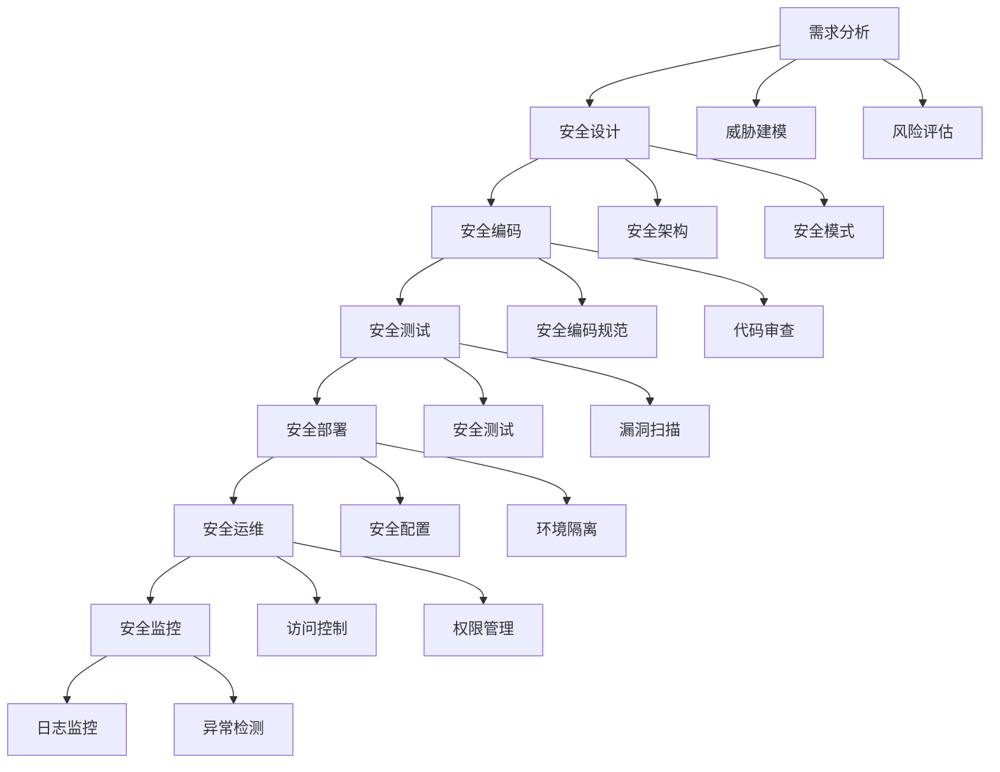

# 代码安全最佳实践

## 安全编码原则

### 安全开发生命周期


### 安全编码原则
| 原则 | 描述 | 实现方式 |
|------|------|----------|
| 最小权限 | 只授予必要的权限 | 角色分离、权限控制 |
| 深度防御 | 多层安全防护 | 输入验证、输出编码、访问控制 |
| 安全默认 | 默认安全配置 | 安全配置、错误处理 |
| 故障安全 | 失败时保持安全 | 异常处理、降级策略 |
| 安全透明 | 安全机制可见 | 日志记录、审计跟踪 |

## 输入验证与输出编码

### 输入验证
```javascript
// 1. 输入验证类
class InputValidator {
  // 邮箱验证
  static validateEmail(email) {
    const emailRegex = /^[^\s@]+@[^\s@]+\.[^\s@]+$/;
    return emailRegex.test(email);
  }
  
  // 手机号验证
  static validatePhone(phone) {
    const phoneRegex = /^1[3-9]\d{9}$/;
    return phoneRegex.test(phone);
  }
  
  // 身份证号验证
  static validateIdCard(idCard) {
    const idCardRegex = /^[1-9]\d{5}(18|19|20)\d{2}((0[1-9])|(1[0-2]))(([0-2][1-9])|10|20|30|31)\d{3}[0-9Xx]$/;
    return idCardRegex.test(idCard);
  }
  
  // 密码强度验证
  static validatePassword(password) {
    const minLength = 8;
    const hasUpperCase = /[A-Z]/.test(password);
    const hasLowerCase = /[a-z]/.test(password);
    const hasNumbers = /\d/.test(password);
    const hasSpecialChar = /[!@#$%^&*(),.?":{}|<>]/.test(password);
    
    return {
      isValid: password.length >= minLength && hasUpperCase && hasLowerCase && hasNumbers && hasSpecialChar,
      errors: [
        password.length < minLength && '密码长度至少8位',
        !hasUpperCase && '密码必须包含大写字母',
        !hasLowerCase && '密码必须包含小写字母',
        !hasNumbers && '密码必须包含数字',
        !hasSpecialChar && '密码必须包含特殊字符'
      ].filter(Boolean)
    };
  }
  
  // 通用输入验证
  static validateInput(input, rules) {
    const errors = [];
    
    if (rules.required && (!input || input.trim() === '')) {
      errors.push('此字段为必填项');
    }
    
    if (input && rules.minLength && input.length < rules.minLength) {
      errors.push(`长度不能少于${rules.minLength}个字符`);
    }
    
    if (input && rules.maxLength && input.length > rules.maxLength) {
      errors.push(`长度不能超过${rules.maxLength}个字符`);
    }
    
    if (input && rules.pattern && !rules.pattern.test(input)) {
      errors.push(rules.message || '格式不正确');
    }
    
    if (input && rules.custom && !rules.custom(input)) {
      errors.push(rules.customMessage || '验证失败');
    }
    
    return {
      isValid: errors.length === 0,
      errors
    };
  }
}

// 2. 使用示例
const emailValidation = InputValidator.validateInput('user@example.com', {
  required: true,
  pattern: /^[^\s@]+@[^\s@]+\.[^\s@]+$/,
  message: '邮箱格式不正确'
});

const passwordValidation = InputValidator.validatePassword('MyPassword123!');
```

### 输出编码
```javascript
// 1. 输出编码类
class OutputEncoder {
  // HTML编码
  static htmlEncode(str) {
    if (typeof str !== 'string') return str;
    
    const div = document.createElement('div');
    div.textContent = str;
    return div.innerHTML;
  }
  
  // HTML属性编码
  static htmlAttributeEncode(str) {
    if (typeof str !== 'string') return str;
    
    return str
      .replace(/&/g, '&amp;')
      .replace(/"/g, '&quot;')
      .replace(/'/g, '&#x27;')
      .replace(/</g, '&lt;')
      .replace(/>/g, '&gt;')
      .replace(/\//g, '&#x2F;');
  }
  
  // URL编码
  static urlEncode(str) {
    return encodeURIComponent(str);
  }
  
  // JavaScript编码
  static jsEncode(str) {
    if (typeof str !== 'string') return str;
    
    return str
      .replace(/\\/g, '\\\\')
      .replace(/'/g, "\\'")
      .replace(/"/g, '\\"')
      .replace(/\n/g, '\\n')
      .replace(/\r/g, '\\r')
      .replace(/\t/g, '\\t');
  }
  
  // CSS编码
  static cssEncode(str) {
    if (typeof str !== 'string') return str;
    
    return str.replace(/[^a-zA-Z0-9]/g, (match) => {
      return '\\' + match.charCodeAt(0).toString(16) + ' ';
    });
  }
}

// 2. 安全的DOM操作
class SafeDOM {
  // 安全的文本设置
  static setText(element, text) {
    element.textContent = text;
  }
  
  // 安全的HTML设置
  static setHTML(element, html) {
    element.innerHTML = OutputEncoder.htmlEncode(html);
  }
  
  // 安全的属性设置
  static setAttribute(element, name, value) {
    const encodedValue = OutputEncoder.htmlAttributeEncode(value);
    element.setAttribute(name, encodedValue);
  }
  
  // 安全的URL设置
  static setURL(element, url) {
    try {
      const urlObj = new URL(url);
      if (['http:', 'https:'].includes(urlObj.protocol)) {
        element.href = url;
      } else {
        throw new Error('Invalid protocol');
      }
    } catch (error) {
      console.error('Invalid URL:', error);
    }
  }
  
  // 安全的样式设置
  static setStyle(element, property, value) {
    const encodedValue = OutputEncoder.cssEncode(value);
    element.style.setProperty(property, encodedValue);
  }
}

// 3. 使用示例
const userInput = '<script>alert("XSS")</script>';
const outputElement = document.getElementById('output');

// 安全的方式
SafeDOM.setText(outputElement, userInput);
SafeDOM.setAttribute(outputElement, 'data-value', userInput);
```

## 身份验证与授权

### 身份验证
```javascript
// 1. 身份验证类
class Authentication {
  constructor() {
    this.sessionTimeout = 30 * 60 * 1000; // 30分钟
    this.maxLoginAttempts = 5;
    this.lockoutDuration = 15 * 60 * 1000; // 15分钟
  }
  
  // 用户登录
  async login(username, password) {
    try {
      // 检查登录尝试次数
      if (this.isAccountLocked(username)) {
        throw new Error('账户已被锁定，请稍后再试');
      }
      
      // 验证用户凭据
      const user = await this.validateCredentials(username, password);
      
      if (user) {
        // 重置登录尝试次数
        this.resetLoginAttempts(username);
        
        // 创建会话
        const session = await this.createSession(user);
        
        // 设置安全Cookie
        this.setSecureCookie('session_id', session.id, {
          'Max-Age': this.sessionTimeout / 1000,
          'SameSite': 'Strict',
          'Secure': true,
          'HttpOnly': true
        });
        
        return { success: true, user };
      } else {
        // 增加登录尝试次数
        this.incrementLoginAttempts(username);
        throw new Error('用户名或密码错误');
      }
    } catch (error) {
      return { success: false, error: error.message };
    }
  }
  
  // 验证用户凭据
  async validateCredentials(username, password) {
    // 密码哈希验证
    const user = await this.getUserByUsername(username);
    if (user && await this.verifyPassword(password, user.passwordHash)) {
      return user;
    }
    return null;
  }
  
  // 密码哈希
  async hashPassword(password) {
    const encoder = new TextEncoder();
    const data = encoder.encode(password);
    const hashBuffer = await crypto.subtle.digest('SHA-256', data);
    const hashArray = Array.from(new Uint8Array(hashBuffer));
    return hashArray.map(b => b.toString(16).padStart(2, '0')).join('');
  }
  
  // 验证密码
  async verifyPassword(password, hash) {
    const passwordHash = await this.hashPassword(password);
    return passwordHash === hash;
  }
  
  // 创建会话
  async createSession(user) {
    const sessionId = this.generateSessionId();
    const session = {
      id: sessionId,
      userId: user.id,
      createdAt: new Date(),
      expiresAt: new Date(Date.now() + this.sessionTimeout)
    };
    
    // 存储会话
    await this.storeSession(session);
    
    return session;
  }
  
  // 生成会话ID
  generateSessionId() {
    const array = new Uint8Array(32);
    crypto.getRandomValues(array);
    return Array.from(array, byte => byte.toString(16).padStart(2, '0')).join('');
  }
  
  // 检查会话有效性
  async validateSession(sessionId) {
    const session = await this.getSession(sessionId);
    
    if (!session) {
      return false;
    }
    
    if (new Date() > session.expiresAt) {
      await this.deleteSession(sessionId);
      return false;
    }
    
    // 更新会话过期时间
    session.expiresAt = new Date(Date.now() + this.sessionTimeout);
    await this.updateSession(session);
    
    return true;
  }
  
  // 用户登出
  async logout(sessionId) {
    await this.deleteSession(sessionId);
    this.deleteCookie('session_id');
  }
  
  // 设置安全Cookie
  setSecureCookie(name, value, options = {}) {
    const defaults = {
      'SameSite': 'Strict',
      'Secure': true,
      'HttpOnly': true,
      'Path': '/'
    };
    
    const config = { ...defaults, ...options };
    const cookieString = Object.entries(config)
      .map(([key, val]) => `${key}=${val}`)
      .join('; ');
    
    document.cookie = `${name}=${value}; ${cookieString}`;
  }
  
  // 删除Cookie
  deleteCookie(name) {
    document.cookie = `${name}=; expires=Thu, 01 Jan 1970 00:00:00 UTC; path=/;`;
  }
  
  // 登录尝试管理
  incrementLoginAttempts(username) {
    const attempts = this.getLoginAttempts(username) + 1;
    localStorage.setItem(`login_attempts_${username}`, attempts.toString());
    
    if (attempts >= this.maxLoginAttempts) {
      const lockoutUntil = Date.now() + this.lockoutDuration;
      localStorage.setItem(`lockout_${username}`, lockoutUntil.toString());
    }
  }
  
  resetLoginAttempts(username) {
    localStorage.removeItem(`login_attempts_${username}`);
    localStorage.removeItem(`lockout_${username}`);
  }
  
  getLoginAttempts(username) {
    return parseInt(localStorage.getItem(`login_attempts_${username}`) || '0');
  }
  
  isAccountLocked(username) {
    const lockoutUntil = localStorage.getItem(`lockout_${username}`);
    if (lockoutUntil && Date.now() < parseInt(lockoutUntil)) {
      return true;
    }
    return false;
  }
}

// 2. 使用示例
const auth = new Authentication();

// 用户登录
const loginResult = await auth.login('username', 'password');
if (loginResult.success) {
  console.log('登录成功');
} else {
  console.error('登录失败:', loginResult.error);
}
```

### 授权控制
```javascript
// 1. 基于角色的访问控制(RBAC)
class RBAC {
  constructor() {
    this.roles = new Map();
    this.permissions = new Map();
    this.userRoles = new Map();
  }
  
  // 定义角色
  defineRole(roleName, permissions = []) {
    this.roles.set(roleName, {
      name: roleName,
      permissions: new Set(permissions)
    });
  }
  
  // 定义权限
  definePermission(permissionName, resource, action) {
    this.permissions.set(permissionName, {
      name: permissionName,
      resource,
      action
    });
  }
  
  // 分配角色给用户
  assignRole(userId, roleName) {
    if (!this.userRoles.has(userId)) {
      this.userRoles.set(userId, new Set());
    }
    this.userRoles.get(userId).add(roleName);
  }
  
  // 检查用户权限
  hasPermission(userId, permissionName) {
    const userRoles = this.userRoles.get(userId);
    if (!userRoles) return false;
    
    for (const roleName of userRoles) {
      const role = this.roles.get(roleName);
      if (role && role.permissions.has(permissionName)) {
        return true;
      }
    }
    
    return false;
  }
  
  // 检查用户角色
  hasRole(userId, roleName) {
    const userRoles = this.userRoles.get(userId);
    return userRoles ? userRoles.has(roleName) : false;
  }
  
  // 获取用户权限
  getUserPermissions(userId) {
    const userRoles = this.userRoles.get(userId);
    if (!userRoles) return [];
    
    const permissions = new Set();
    for (const roleName of userRoles) {
      const role = this.roles.get(roleName);
      if (role) {
        role.permissions.forEach(permission => permissions.add(permission));
      }
    }
    
    return Array.from(permissions);
  }
}

// 2. 权限中间件
class PermissionMiddleware {
  constructor(rbac) {
    this.rbac = rbac;
  }
  
  // 权限检查中间件
  requirePermission(permissionName) {
    return (req, res, next) => {
      const userId = req.user?.id;
      
      if (!userId) {
        return res.status(401).json({ error: '未授权' });
      }
      
      if (!this.rbac.hasPermission(userId, permissionName)) {
        return res.status(403).json({ error: '权限不足' });
      }
      
      next();
    };
  }
  
  // 角色检查中间件
  requireRole(roleName) {
    return (req, res, next) => {
      const userId = req.user?.id;
      
      if (!userId) {
        return res.status(401).json({ error: '未授权' });
      }
      
      if (!this.rbac.hasRole(userId, roleName)) {
        return res.status(403).json({ error: '角色权限不足' });
      }
      
      next();
    };
  }
}

// 3. 使用示例
const rbac = new RBAC();

// 定义权限
rbac.definePermission('read_users', 'users', 'read');
rbac.definePermission('write_users', 'users', 'write');
rbac.definePermission('delete_users', 'users', 'delete');

// 定义角色
rbac.defineRole('admin', ['read_users', 'write_users', 'delete_users']);
rbac.defineRole('user', ['read_users']);

// 分配角色
rbac.assignRole('user1', 'admin');
rbac.assignRole('user2', 'user');

// 检查权限
const canReadUsers = rbac.hasPermission('user1', 'read_users'); // true
const canDeleteUsers = rbac.hasPermission('user2', 'delete_users'); // false
```

## 数据保护与加密

### 数据加密
```javascript
// 1. 数据加密类
class DataEncryption {
  constructor() {
    this.algorithm = 'AES-GCM';
    this.keyLength = 256;
  }
  
  // 生成加密密钥
  async generateKey() {
    return await crypto.subtle.generateKey(
      {
        name: this.algorithm,
        length: this.keyLength
      },
      true,
      ['encrypt', 'decrypt']
    );
  }
  
  // 加密数据
  async encrypt(data, key) {
    const encoder = new TextEncoder();
    const dataBuffer = encoder.encode(JSON.stringify(data));
    
    const iv = crypto.getRandomValues(new Uint8Array(12));
    
    const encryptedData = await crypto.subtle.encrypt(
      {
        name: this.algorithm,
        iv: iv
      },
      key,
      dataBuffer
    );
    
    return {
      data: Array.from(new Uint8Array(encryptedData)),
      iv: Array.from(iv)
    };
  }
  
  // 解密数据
  async decrypt(encryptedData, key) {
    const { data, iv } = encryptedData;
    
    const decryptedData = await crypto.subtle.decrypt(
      {
        name: this.algorithm,
        iv: new Uint8Array(iv)
      },
      key,
      new Uint8Array(data)
    );
    
    const decoder = new TextDecoder();
    return JSON.parse(decoder.decode(decryptedData));
  }
  
  // 哈希数据
  async hash(data) {
    const encoder = new TextEncoder();
    const dataBuffer = encoder.encode(data);
    const hashBuffer = await crypto.subtle.digest('SHA-256', dataBuffer);
    const hashArray = Array.from(new Uint8Array(hashBuffer));
    return hashArray.map(b => b.toString(16).padStart(2, '0')).join('');
  }
  
  // 生成随机盐
  generateSalt() {
    const array = new Uint8Array(16);
    crypto.getRandomValues(array);
    return Array.from(array, byte => byte.toString(16).padStart(2, '0')).join('');
  }
  
  // 带盐的哈希
  async hashWithSalt(data, salt) {
    return await this.hash(data + salt);
  }
}

// 2. 安全存储类
class SecureStorage {
  constructor() {
    this.encryption = new DataEncryption();
    this.key = null;
  }
  
  // 初始化加密密钥
  async initialize() {
    if (!this.key) {
      this.key = await this.encryption.generateKey();
    }
  }
  
  // 存储加密数据
  async setItem(key, value) {
    await this.initialize();
    
    try {
      const encrypted = await this.encryption.encrypt(value, this.key);
      localStorage.setItem(key, JSON.stringify(encrypted));
    } catch (error) {
      console.error('Storage encryption error:', error);
      throw error;
    }
  }
  
  // 获取解密数据
  async getItem(key) {
    await this.initialize();
    
    try {
      const encrypted = localStorage.getItem(key);
      if (!encrypted) return null;
      
      const encryptedData = JSON.parse(encrypted);
      return await this.encryption.decrypt(encryptedData, this.key);
    } catch (error) {
      console.error('Storage decryption error:', error);
      return null;
    }
  }
  
  // 删除数据
  removeItem(key) {
    localStorage.removeItem(key);
  }
  
  // 清空数据
  clear() {
    localStorage.clear();
  }
}

// 3. 使用示例
const secureStorage = new SecureStorage();

// 存储敏感数据
await secureStorage.setItem('user_data', {
  name: 'John Doe',
  email: 'john@example.com',
  creditCard: '1234567890123456'
});

// 获取数据
const userData = await secureStorage.getItem('user_data');
console.log(userData);
```

### 数据脱敏
```javascript
// 1. 数据脱敏类
class DataMasking {
  // 邮箱脱敏
  static maskEmail(email) {
    if (!email || !email.includes('@')) return email;
    
    const [local, domain] = email.split('@');
    if (local.length <= 2) return email;
    
    const maskedLocal = local.charAt(0) + '*'.repeat(local.length - 2) + local.charAt(local.length - 1);
    return `${maskedLocal}@${domain}`;
  }
  
  // 手机号脱敏
  static maskPhone(phone) {
    if (!phone || phone.length < 7) return phone;
    
    return phone.replace(/(\d{3})\d{4}(\d{4})/, '$1****$2');
  }
  
  // 身份证号脱敏
  static maskIdCard(idCard) {
    if (!idCard || idCard.length < 8) return idCard;
    
    return idCard.replace(/(\d{4})\d{10}(\d{4})/, '$1**********$2');
  }
  
  // 银行卡号脱敏
  static maskBankCard(cardNumber) {
    if (!cardNumber || cardNumber.length < 8) return cardNumber;
    
    return cardNumber.replace(/(\d{4})\d{8,12}(\d{4})/, '$1********$2');
  }
  
  // 姓名脱敏
  static maskName(name) {
    if (!name || name.length <= 1) return name;
    
    if (name.length === 2) {
      return name.charAt(0) + '*';
    }
    
    return name.charAt(0) + '*'.repeat(name.length - 2) + name.charAt(name.length - 1);
  }
  
  // 地址脱敏
  static maskAddress(address) {
    if (!address || address.length < 6) return address;
    
    return address.replace(/(.{3}).*(.{3})/, '$1***$2');
  }
  
  // 通用脱敏
  static mask(data, fields) {
    const masked = { ...data };
    
    fields.forEach(field => {
      if (masked[field]) {
        switch (field) {
          case 'email':
            masked[field] = this.maskEmail(masked[field]);
            break;
          case 'phone':
            masked[field] = this.maskPhone(masked[field]);
            break;
          case 'idCard':
            masked[field] = this.maskIdCard(masked[field]);
            break;
          case 'bankCard':
            masked[field] = this.maskBankCard(masked[field]);
            break;
          case 'name':
            masked[field] = this.maskName(masked[field]);
            break;
          case 'address':
            masked[field] = this.maskAddress(masked[field]);
            break;
          default:
            // 默认脱敏规则
            if (typeof masked[field] === 'string' && masked[field].length > 4) {
              masked[field] = masked[field].charAt(0) + '*'.repeat(masked[field].length - 2) + masked[field].charAt(masked[field].length - 1);
            }
        }
      }
    });
    
    return masked;
  }
}

// 2. 使用示例
const userData = {
  name: '张三',
  email: 'zhangsan@example.com',
  phone: '13812345678',
  idCard: '110101199001011234',
  bankCard: '6222021234567890123',
  address: '北京市朝阳区某某街道123号'
};

// 脱敏显示
const maskedData = DataMasking.mask(userData, ['name', 'email', 'phone', 'idCard', 'bankCard', 'address']);
console.log(maskedData);
```

## 安全配置与监控

### 安全配置
```javascript
// 1. 安全配置类
class SecurityConfig {
  constructor() {
    this.config = {
      // CSP配置
      csp: {
        'default-src': ["'self'"],
        'script-src': ["'self'", "'unsafe-inline'"],
        'style-src': ["'self'", "'unsafe-inline'"],
        'img-src': ["'self'", "data:", "https:"],
        'connect-src': ["'self'"],
        'font-src': ["'self'"],
        'object-src': ["'none'"],
        'media-src': ["'self'"],
        'frame-src': ["'none'"]
      },
      
      // 安全头配置
      securityHeaders: {
        'X-Content-Type-Options': 'nosniff',
        'X-Frame-Options': 'DENY',
        'X-XSS-Protection': '1; mode=block',
        'Strict-Transport-Security': 'max-age=31536000; includeSubDomains',
        'Referrer-Policy': 'strict-origin-when-cross-origin'
      },
      
      // 会话配置
      session: {
        timeout: 30 * 60 * 1000, // 30分钟
        maxAge: 24 * 60 * 60 * 1000, // 24小时
        secure: true,
        httpOnly: true,
        sameSite: 'Strict'
      },
      
      // 密码策略
      passwordPolicy: {
        minLength: 8,
        requireUpperCase: true,
        requireLowerCase: true,
        requireNumbers: true,
        requireSpecialChars: true,
        maxAge: 90 * 24 * 60 * 60 * 1000 // 90天
      }
    };
  }
  
  // 应用CSP
  applyCSP() {
    const cspHeader = Object.entries(this.config.csp)
      .map(([directive, sources]) => `${directive} ${sources.join(' ')}`)
      .join('; ');
    
    const meta = document.createElement('meta');
    meta.httpEquiv = 'Content-Security-Policy';
    meta.content = cspHeader;
    document.head.appendChild(meta);
  }
  
  // 应用安全头
  applySecurityHeaders() {
    Object.entries(this.config.securityHeaders).forEach(([name, value]) => {
      const meta = document.createElement('meta');
      meta.httpEquiv = name;
      meta.content = value;
      document.head.appendChild(meta);
    });
  }
  
  // 获取配置
  getConfig(section) {
    return this.config[section] || null;
  }
  
  // 更新配置
  updateConfig(section, newConfig) {
    if (this.config[section]) {
      this.config[section] = { ...this.config[section], ...newConfig };
    }
  }
}

// 2. 使用示例
const securityConfig = new SecurityConfig();
securityConfig.applyCSP();
securityConfig.applySecurityHeaders();
```

### 安全监控
```javascript
// 1. 安全监控类
class SecurityMonitor {
  constructor() {
    this.events = [];
    this.thresholds = {
      maxFailedLogins: 5,
      maxRequestsPerMinute: 100,
      maxSuspiciousActivities: 10
    };
    this.setupMonitoring();
  }
  
  // 设置监控
  setupMonitoring() {
    // 监听页面事件
    this.monitorPageEvents();
    
    // 监听网络请求
    this.monitorNetworkRequests();
    
    // 监听用户行为
    this.monitorUserBehavior();
    
    // 定期检查
    setInterval(() => {
      this.performSecurityCheck();
    }, 60000); // 每分钟检查一次
  }
  
  // 监控页面事件
  monitorPageEvents() {
    // 监听页面可见性变化
    document.addEventListener('visibilitychange', () => {
      this.logEvent('page_visibility_change', {
        hidden: document.hidden,
        timestamp: new Date().toISOString()
      });
    });
    
    // 监听窗口焦点变化
    window.addEventListener('blur', () => {
      this.logEvent('window_blur', {
        timestamp: new Date().toISOString()
      });
    });
    
    // 监听错误事件
    window.addEventListener('error', (event) => {
      this.logEvent('javascript_error', {
        message: event.message,
        filename: event.filename,
        lineno: event.lineno,
        colno: event.colno,
        timestamp: new Date().toISOString()
      });
    });
  }
  
  // 监控网络请求
  monitorNetworkRequests() {
    const originalFetch = window.fetch;
    const self = this;
    
    window.fetch = function(...args) {
      const startTime = Date.now();
      
      return originalFetch.apply(this, args)
        .then(response => {
          const endTime = Date.now();
          const duration = endTime - startTime;
          
          self.logEvent('network_request', {
            url: args[0],
            method: args[1]?.method || 'GET',
            status: response.status,
            duration: duration,
            timestamp: new Date().toISOString()
          });
          
          return response;
        })
        .catch(error => {
          self.logEvent('network_error', {
            url: args[0],
            error: error.message,
            timestamp: new Date().toISOString()
          });
          
          throw error;
        });
    };
  }
  
  // 监控用户行为
  monitorUserBehavior() {
    let mouseMovements = 0;
    let keystrokes = 0;
    let clicks = 0;
    
    // 监听鼠标移动
    document.addEventListener('mousemove', () => {
      mouseMovements++;
    });
    
    // 监听键盘输入
    document.addEventListener('keydown', () => {
      keystrokes++;
    });
    
    // 监听点击事件
    document.addEventListener('click', () => {
      clicks++;
    });
    
    // 定期记录用户行为
    setInterval(() => {
      this.logEvent('user_behavior', {
        mouseMovements,
        keystrokes,
        clicks,
        timestamp: new Date().toISOString()
      });
      
      // 重置计数器
      mouseMovements = 0;
      keystrokes = 0;
      clicks = 0;
    }, 60000);
  }
  
  // 记录安全事件
  logEvent(eventType, data) {
    const event = {
      type: eventType,
      data: data,
      timestamp: new Date().toISOString(),
      userAgent: navigator.userAgent,
      url: window.location.href
    };
    
    this.events.push(event);
    
    // 检查是否超过阈值
    this.checkThresholds(eventType);
    
    // 发送到服务器
    this.sendEventToServer(event);
  }
  
  // 检查安全阈值
  checkThresholds(eventType) {
    const recentEvents = this.getRecentEvents(60000); // 最近1分钟
    
    switch (eventType) {
      case 'failed_login':
        const failedLogins = recentEvents.filter(e => e.type === 'failed_login').length;
        if (failedLogins >= this.thresholds.maxFailedLogins) {
          this.triggerAlert('excessive_failed_logins', { count: failedLogins });
        }
        break;
        
      case 'network_request':
        const requests = recentEvents.filter(e => e.type === 'network_request').length;
        if (requests >= this.thresholds.maxRequestsPerMinute) {
          this.triggerAlert('excessive_requests', { count: requests });
        }
        break;
    }
  }
  
  // 获取最近事件
  getRecentEvents(timeWindow) {
    const now = Date.now();
    return this.events.filter(event => {
      const eventTime = new Date(event.timestamp).getTime();
      return now - eventTime <= timeWindow;
    });
  }
  
  // 触发安全警报
  triggerAlert(alertType, data) {
    const alert = {
      type: alertType,
      data: data,
      timestamp: new Date().toISOString(),
      severity: 'high'
    };
    
    console.warn('Security Alert:', alert);
    
    // 发送警报到服务器
    this.sendAlertToServer(alert);
  }
  
  // 发送事件到服务器
  async sendEventToServer(event) {
    try {
      await fetch('/api/security-events', {
        method: 'POST',
        headers: {
          'Content-Type': 'application/json'
        },
        body: JSON.stringify(event)
      });
    } catch (error) {
      console.error('Failed to send security event:', error);
    }
  }
  
  // 发送警报到服务器
  async sendAlertToServer(alert) {
    try {
      await fetch('/api/security-alerts', {
        method: 'POST',
        headers: {
          'Content-Type': 'application/json'
        },
        body: JSON.stringify(alert)
      });
    } catch (error) {
      console.error('Failed to send security alert:', error);
    }
  }
  
  // 执行安全检查
  performSecurityCheck() {
    // 检查会话有效性
    this.checkSessionValidity();
    
    // 检查异常行为
    this.checkAnomalousBehavior();
    
    // 检查系统完整性
    this.checkSystemIntegrity();
  }
  
  // 检查会话有效性
  checkSessionValidity() {
    const sessionId = this.getCookie('session_id');
    if (sessionId) {
      // 验证会话
      fetch('/api/validate-session', {
        method: 'POST',
        headers: {
          'Content-Type': 'application/json'
        },
        body: JSON.stringify({ sessionId })
      })
      .then(response => {
        if (!response.ok) {
          this.logEvent('session_invalid', {
            sessionId: sessionId,
            timestamp: new Date().toISOString()
          });
        }
      })
      .catch(error => {
        this.logEvent('session_validation_error', {
          error: error.message,
          timestamp: new Date().toISOString()
        });
      });
    }
  }
  
  // 检查异常行为
  checkAnomalousBehavior() {
    const recentEvents = this.getRecentEvents(300000); // 最近5分钟
    
    // 检查异常的网络请求模式
    const networkEvents = recentEvents.filter(e => e.type === 'network_request');
    const uniqueUrls = new Set(networkEvents.map(e => e.data.url));
    
    if (uniqueUrls.size > 50) {
      this.triggerAlert('anomalous_network_behavior', {
        uniqueUrls: uniqueUrls.size,
        totalRequests: networkEvents.length
      });
    }
  }
  
  // 检查系统完整性
  checkSystemIntegrity() {
    // 检查关键文件是否被修改
    // 检查内存使用情况
    // 检查网络连接状态
    
    this.logEvent('integrity_check', {
      timestamp: new Date().toISOString(),
      status: 'completed'
    });
  }
  
  // 获取Cookie
  getCookie(name) {
    const value = `; ${document.cookie}`;
    const parts = value.split(`; ${name}=`);
    if (parts.length === 2) return parts.pop().split(';').shift();
  }
}

// 2. 使用示例
const securityMonitor = new SecurityMonitor();
```

## 相关链接
- [[04-高级精通层/04-安全与测试/01-前端安全(XSS-CSRF)]] - 前端安全
- [[04-高级精通层/04-安全与测试/03-单元测试(Jest)]] - 单元测试
- [[04-高级精通层/04-安全与测试/04-集成测试]] - 集成测试
- [[04-高级精通层/04-安全与测试/05-E2E测试(Cypress)]] - E2E测试
