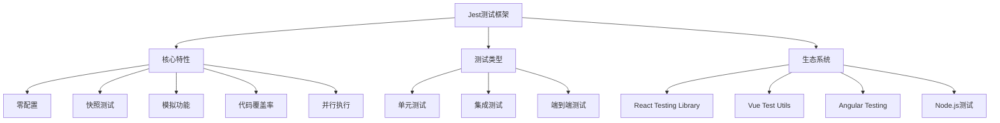

# 单元测试(Jest)

## Jest测试框架基础

### Jest简介与特性


### Jest安装与配置
```javascript
// 1. 安装Jest
// npm install --save-dev jest
// npm install --save-dev @types/jest

// 2. package.json配置
{
  "scripts": {
    "test": "jest",
    "test:watch": "jest --watch",
    "test:coverage": "jest --coverage",
    "test:ci": "jest --ci --coverage --watchAll=false"
  },
  "jest": {
    "testEnvironment": "jsdom",
    "setupFilesAfterEnv": ["<rootDir>/src/setupTests.js"],
    "moduleNameMapping": {
      "^@/(.*)$": "<rootDir>/src/$1"
    },
    "collectCoverageFrom": [
      "src/**/*.{js,jsx}",
      "!src/index.js",
      "!src/**/*.test.{js,jsx}"
    ],
    "coverageThreshold": {
      "global": {
        "branches": 80,
        "functions": 80,
        "lines": 80,
        "statements": 80
      }
    }
  }
}

// 3. setupTests.js配置
import '@testing-library/jest-dom';

// 全局测试配置
beforeEach(() => {
  // 每个测试前的设置
});

afterEach(() => {
  // 每个测试后的清理
});

// 模拟全局对象
global.fetch = jest.fn();
```

## 基础测试语法

### 测试用例结构
```javascript
// 1. 基本测试结构
describe('测试套件名称', () => {
  // 测试前的设置
  beforeEach(() => {
    // 每个测试前的准备工作
  });
  
  // 测试后的清理
  afterEach(() => {
    // 每个测试后的清理工作
  });
  
  // 单个测试用例
  test('测试用例描述', () => {
    // 测试代码
  });
  
  // 使用it别名
  it('应该执行特定功能', () => {
    // 测试代码
  });
});

// 2. 测试分组
describe('用户管理模块', () => {
  describe('用户注册', () => {
    test('应该成功注册新用户', () => {
      // 测试注册功能
    });
    
    test('应该拒绝无效邮箱', () => {
      // 测试邮箱验证
    });
  });
  
  describe('用户登录', () => {
    test('应该成功登录', () => {
      // 测试登录功能
    });
    
    test('应该拒绝错误密码', () => {
      // 测试密码验证
    });
  });
});

// 3. 异步测试
describe('异步操作测试', () => {
  // Promise测试
  test('应该处理Promise', () => {
    return fetchData().then(data => {
      expect(data).toBeDefined();
    });
  });
  
  // async/await测试
  test('应该处理async/await', async () => {
    const data = await fetchData();
    expect(data).toBeDefined();
  });
  
  // 回调函数测试
  test('应该处理回调函数', (done) => {
    fetchDataWithCallback((error, data) => {
      expect(error).toBeNull();
      expect(data).toBeDefined();
      done();
    });
  });
});
```

### 断言方法
```javascript
// 1. 基础断言
describe('基础断言测试', () => {
  test('相等性断言', () => {
    expect(2 + 2).toBe(4);
    expect({ name: 'John' }).toEqual({ name: 'John' });
    expect('hello').toMatch(/hello/);
  });
  
  test('真值断言', () => {
    expect(true).toBeTruthy();
    expect(false).toBeFalsy();
    expect(null).toBeNull();
    expect(undefined).toBeUndefined();
    expect('hello').toBeDefined();
  });
  
  test('数字断言', () => {
    expect(2.5).toBeGreaterThan(2);
    expect(2.5).toBeGreaterThanOrEqual(2.5);
    expect(2.5).toBeLessThan(3);
    expect(2.5).toBeLessThanOrEqual(2.5);
    expect(0.1 + 0.2).toBeCloseTo(0.3);
  });
  
  test('数组和对象断言', () => {
    const arr = [1, 2, 3];
    expect(arr).toContain(2);
    expect(arr).toHaveLength(3);
    
    const obj = { name: 'John', age: 30 };
    expect(obj).toHaveProperty('name');
    expect(obj).toHaveProperty('age', 30);
  });
  
  test('异常断言', () => {
    expect(() => {
      throw new Error('错误信息');
    }).toThrow('错误信息');
    
    expect(() => {
      throw new Error('错误信息');
    }).toThrowError();
  });
});

// 2. 自定义断言
describe('自定义断言', () => {
  // 扩展expect
  expect.extend({
    toBeValidEmail(received) {
      const emailRegex = /^[^\s@]+@[^\s@]+\.[^\s@]+$/;
      const pass = emailRegex.test(received);
      
      if (pass) {
        return {
          message: () => `expected ${received} not to be a valid email`,
          pass: true,
        };
      } else {
        return {
          message: () => `expected ${received} to be a valid email`,
          pass: false,
        };
      }
    },
    
    toBeValidPhone(received) {
      const phoneRegex = /^1[3-9]\d{9}$/;
      const pass = phoneRegex.test(received);
      
      if (pass) {
        return {
          message: () => `expected ${received} not to be a valid phone`,
          pass: true,
        };
      } else {
        return {
          message: () => `expected ${received} to be a valid phone`,
          pass: false,
        };
      }
    }
  });
  
  test('自定义邮箱断言', () => {
    expect('user@example.com').toBeValidEmail();
    expect('invalid-email').not.toBeValidEmail();
  });
  
  test('自定义手机号断言', () => {
    expect('13812345678').toBeValidPhone();
    expect('12345678901').not.toBeValidPhone();
  });
});
```

## 模拟与存根

### Mock函数
```javascript
// 1. 基础Mock
describe('Mock函数测试', () => {
  test('创建Mock函数', () => {
    const mockFn = jest.fn();
    
    mockFn('arg1', 'arg2');
    
    expect(mockFn).toHaveBeenCalled();
    expect(mockFn).toHaveBeenCalledWith('arg1', 'arg2');
    expect(mockFn).toHaveBeenCalledTimes(1);
  });
  
  test('Mock返回值', () => {
    const mockFn = jest.fn();
    
    // 设置返回值
    mockFn.mockReturnValue('mocked value');
    expect(mockFn()).toBe('mocked value');
    
    // 设置多次调用返回值
    mockFn
      .mockReturnValueOnce('first call')
      .mockReturnValueOnce('second call')
      .mockReturnValue('default');
    
    expect(mockFn()).toBe('first call');
    expect(mockFn()).toBe('second call');
    expect(mockFn()).toBe('default');
  });
  
  test('Mock实现', () => {
    const mockFn = jest.fn();
    
    mockFn.mockImplementation((a, b) => a + b);
    expect(mockFn(2, 3)).toBe(5);
    
    // 异步实现
    mockFn.mockImplementation(async (a, b) => {
      return new Promise(resolve => {
        setTimeout(() => resolve(a + b), 100);
      });
    });
  });
});

// 2. 模块Mock
// 模拟整个模块
jest.mock('./api', () => ({
  fetchUser: jest.fn(),
  updateUser: jest.fn(),
  deleteUser: jest.fn()
}));

// 部分模拟
jest.mock('./utils', () => ({
  ...jest.requireActual('./utils'),
  formatDate: jest.fn()
}));

// 3. 使用示例
import { fetchUser, updateUser } from './api';
import { formatDate } from './utils';

describe('模块Mock测试', () => {
  beforeEach(() => {
    jest.clearAllMocks();
  });
  
  test('模拟API调用', async () => {
    const mockUser = { id: 1, name: 'John' };
    fetchUser.mockResolvedValue(mockUser);
    
    const user = await fetchUser(1);
    
    expect(fetchUser).toHaveBeenCalledWith(1);
    expect(user).toEqual(mockUser);
  });
  
  test('模拟工具函数', () => {
    formatDate.mockReturnValue('2023-01-01');
    
    const result = formatDate(new Date());
    
    expect(formatDate).toHaveBeenCalled();
    expect(result).toBe('2023-01-01');
  });
});
```

### 模拟外部依赖
```javascript
// 1. 模拟HTTP请求
describe('HTTP请求Mock', () => {
  beforeEach(() => {
    global.fetch = jest.fn();
  });
  
  afterEach(() => {
    jest.restoreAllMocks();
  });
  
  test('模拟成功请求', async () => {
    const mockResponse = { id: 1, name: 'John' };
    fetch.mockResolvedValueOnce({
      ok: true,
      json: async () => mockResponse
    });
    
    const result = await fetchUser(1);
    
    expect(fetch).toHaveBeenCalledWith('/api/users/1');
    expect(result).toEqual(mockResponse);
  });
  
  test('模拟失败请求', async () => {
    fetch.mockRejectedValueOnce(new Error('Network error'));
    
    await expect(fetchUser(1)).rejects.toThrow('Network error');
  });
});

// 2. 模拟定时器
describe('定时器Mock', () => {
  beforeEach(() => {
    jest.useFakeTimers();
  });
  
  afterEach(() => {
    jest.useRealTimers();
  });
  
  test('模拟setTimeout', () => {
    const callback = jest.fn();
    
    setTimeout(callback, 1000);
    
    expect(callback).not.toHaveBeenCalled();
    
    jest.advanceTimersByTime(1000);
    
    expect(callback).toHaveBeenCalledTimes(1);
  });
  
  test('模拟setInterval', () => {
    const callback = jest.fn();
    
    setInterval(callback, 1000);
    
    jest.advanceTimersByTime(3000);
    
    expect(callback).toHaveBeenCalledTimes(3);
  });
});

// 3. 模拟DOM操作
describe('DOM操作Mock', () => {
  beforeEach(() => {
    document.body.innerHTML = `
      <div id="app">
        <button id="btn">Click me</button>
        <div id="output"></div>
      </div>
    `;
  });
  
  test('模拟点击事件', () => {
    const button = document.getElementById('btn');
    const output = document.getElementById('output');
    const handleClick = jest.fn();
    
    button.addEventListener('click', handleClick);
    button.click();
    
    expect(handleClick).toHaveBeenCalled();
  });
});
```

## 测试工具与技巧

### 测试工具函数
```javascript
// 1. 测试工具类
class TestUtils {
  // 创建测试数据
  static createMockUser(overrides = {}) {
    return {
      id: 1,
      name: 'John Doe',
      email: 'john@example.com',
      age: 30,
      ...overrides
    };
  }
  
  // 创建测试DOM元素
  static createTestElement(tagName, attributes = {}, content = '') {
    const element = document.createElement(tagName);
    
    Object.entries(attributes).forEach(([key, value]) => {
      element.setAttribute(key, value);
    });
    
    if (content) {
      element.textContent = content;
    }
    
    return element;
  }
  
  // 等待异步操作
  static async waitFor(condition, timeout = 5000) {
    const startTime = Date.now();
    
    while (Date.now() - startTime < timeout) {
      if (await condition()) {
        return;
      }
      await new Promise(resolve => setTimeout(resolve, 100));
    }
    
    throw new Error('Timeout waiting for condition');
  }
  
  // 模拟用户输入
  static simulateUserInput(element, value) {
    element.value = value;
    element.dispatchEvent(new Event('input', { bubbles: true }));
    element.dispatchEvent(new Event('change', { bubbles: true }));
  }
  
  // 模拟用户点击
  static simulateClick(element) {
    element.dispatchEvent(new MouseEvent('click', { bubbles: true }));
  }
  
  // 清理DOM
  static cleanupDOM() {
    document.body.innerHTML = '';
  }
}

// 2. 测试辅助函数
describe('测试工具使用', () => {
  beforeEach(() => {
    TestUtils.cleanupDOM();
  });
  
  test('创建测试数据', () => {
    const user = TestUtils.createMockUser({ name: 'Jane' });
    
    expect(user.name).toBe('Jane');
    expect(user.email).toBe('john@example.com');
  });
  
  test('创建测试元素', () => {
    const button = TestUtils.createTestElement('button', {
      id: 'test-btn',
      class: 'btn-primary'
    }, 'Click me');
    
    document.body.appendChild(button);
    
    expect(document.getElementById('test-btn')).toBeTruthy();
  });
  
  test('模拟用户交互', () => {
    const input = TestUtils.createTestElement('input', { type: 'text' });
    document.body.appendChild(input);
    
    TestUtils.simulateUserInput(input, 'test value');
    
    expect(input.value).toBe('test value');
  });
});
```

### 测试覆盖率
```javascript
// 1. 覆盖率配置
// jest.config.js
module.exports = {
  collectCoverage: true,
  collectCoverageFrom: [
    'src/**/*.{js,jsx}',
    '!src/**/*.test.{js,jsx}',
    '!src/index.js'
  ],
  coverageReporters: ['text', 'lcov', 'html'],
  coverageThreshold: {
    global: {
      branches: 80,
      functions: 80,
      lines: 80,
      statements: 80
    },
    './src/utils/': {
      branches: 90,
      functions: 90,
      lines: 90,
      statements: 90
    }
  }
};

// 2. 覆盖率测试示例
// src/utils/calculator.js
export class Calculator {
  add(a, b) {
    return a + b;
  }
  
  subtract(a, b) {
    return a - b;
  }
  
  multiply(a, b) {
    return a * b;
  }
  
  divide(a, b) {
    if (b === 0) {
      throw new Error('Division by zero');
    }
    return a / b;
  }
  
  isEven(number) {
    return number % 2 === 0;
  }
  
  isOdd(number) {
    return number % 2 !== 0;
  }
}

// src/utils/calculator.test.js
import { Calculator } from './calculator';

describe('Calculator', () => {
  let calculator;
  
  beforeEach(() => {
    calculator = new Calculator();
  });
  
  describe('基本运算', () => {
    test('加法', () => {
      expect(calculator.add(2, 3)).toBe(5);
      expect(calculator.add(-1, 1)).toBe(0);
      expect(calculator.add(0, 0)).toBe(0);
    });
    
    test('减法', () => {
      expect(calculator.subtract(5, 3)).toBe(2);
      expect(calculator.subtract(1, 1)).toBe(0);
      expect(calculator.subtract(0, 5)).toBe(-5);
    });
    
    test('乘法', () => {
      expect(calculator.multiply(2, 3)).toBe(6);
      expect(calculator.multiply(-2, 3)).toBe(-6);
      expect(calculator.multiply(0, 5)).toBe(0);
    });
    
    test('除法', () => {
      expect(calculator.divide(6, 2)).toBe(3);
      expect(calculator.divide(5, 2)).toBe(2.5);
      expect(calculator.divide(0, 5)).toBe(0);
    });
    
    test('除零错误', () => {
      expect(() => calculator.divide(5, 0)).toThrow('Division by zero');
    });
  });
  
  describe('数字判断', () => {
    test('偶数判断', () => {
      expect(calculator.isEven(2)).toBe(true);
      expect(calculator.isEven(3)).toBe(false);
      expect(calculator.isEven(0)).toBe(true);
      expect(calculator.isEven(-2)).toBe(true);
    });
    
    test('奇数判断', () => {
      expect(calculator.isOdd(3)).toBe(true);
      expect(calculator.isOdd(2)).toBe(false);
      expect(calculator.isOdd(0)).toBe(false);
      expect(calculator.isOdd(-3)).toBe(true);
    });
  });
});
```

## 高级测试技巧

### 快照测试
```javascript
// 1. 组件快照测试
import React from 'react';
import { render } from '@testing-library/react';
import Button from './Button';

describe('Button组件快照测试', () => {
  test('默认按钮快照', () => {
    const { container } = render(<Button>Click me</Button>);
    expect(container.firstChild).toMatchSnapshot();
  });
  
  test('主要按钮快照', () => {
    const { container } = render(<Button variant="primary">Primary</Button>);
    expect(container.firstChild).toMatchSnapshot();
  });
  
  test('禁用按钮快照', () => {
    const { container } = render(<Button disabled>Disabled</Button>);
    expect(container.firstChild).toMatchSnapshot();
  });
});

// 2. 对象快照测试
describe('对象快照测试', () => {
  test('用户对象快照', () => {
    const user = {
      id: 1,
      name: 'John Doe',
      email: 'john@example.com',
      profile: {
        avatar: 'avatar.jpg',
        bio: 'Software developer'
      }
    };
    
    expect(user).toMatchSnapshot();
  });
  
  test('配置对象快照', () => {
    const config = {
      api: {
        baseUrl: 'https://api.example.com',
        timeout: 5000
      },
      features: {
        darkMode: true,
        notifications: false
      }
    };
    
    expect(config).toMatchSnapshot();
  });
});
```

### 参数化测试
```javascript
// 1. 使用test.each
describe('参数化测试', () => {
  test.each([
    [1, 1, 2],
    [2, 3, 5],
    [0, 0, 0],
    [-1, 1, 0]
  ])('加法测试: %i + %i = %i', (a, b, expected) => {
    expect(a + b).toBe(expected);
  });
  
  test.each([
    ['user@example.com', true],
    ['invalid-email', false],
    ['test@domain.co.uk', true],
    ['@example.com', false]
  ])('邮箱验证: %s 应该是 %s', (email, expected) => {
    const emailRegex = /^[^\s@]+@[^\s@]+\.[^\s@]+$/;
    expect(emailRegex.test(email)).toBe(expected);
  });
});

// 2. 使用describe.each
describe.each([
  ['admin', ['read', 'write', 'delete']],
  ['user', ['read']],
  ['guest', []]
])('角色权限测试: %s', (role, expectedPermissions) => {
  test('应该具有正确权限', () => {
    const permissions = getPermissions(role);
    expect(permissions).toEqual(expectedPermissions);
  });
});
```

### 测试性能
```javascript
// 1. 性能测试
describe('性能测试', () => {
  test('函数执行时间', () => {
    const startTime = performance.now();
    
    // 执行被测试的函数
    heavyComputation();
    
    const endTime = performance.now();
    const executionTime = endTime - startTime;
    
    expect(executionTime).toBeLessThan(100); // 应该在100ms内完成
  });
  
  test('内存使用测试', () => {
    const initialMemory = performance.memory?.usedJSHeapSize || 0;
    
    // 执行可能消耗内存的操作
    createLargeDataStructure();
    
    const finalMemory = performance.memory?.usedJSHeapSize || 0;
    const memoryIncrease = finalMemory - initialMemory;
    
    expect(memoryIncrease).toBeLessThan(1024 * 1024); // 内存增长应该小于1MB
  });
});

// 2. 并发测试
describe('并发测试', () => {
  test('并发请求处理', async () => {
    const promises = Array.from({ length: 10 }, (_, i) => 
      fetchData(i)
    );
    
    const results = await Promise.all(promises);
    
    expect(results).toHaveLength(10);
    results.forEach((result, index) => {
      expect(result.id).toBe(index);
    });
  });
});
```

## 相关链接
- [[04-高级精通层/04-安全与测试/02-代码安全最佳实践]] - 代码安全
- [[04-高级精通层/04-安全与测试/04-集成测试]] - 集成测试
- [[04-高级精通层/04-安全与测试/05-E2E测试(Cypress)]] - E2E测试
- [[04-高级精通层/04-安全与测试/06-测试驱动开发]] - 测试驱动开发
