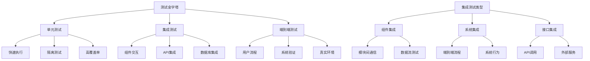

# 集成测试

## 集成测试基础

### 集成测试概念


### 集成测试策略
| 测试策略 | 描述 | 适用场景 | 优缺点 |
|----------|------|----------|--------|
| 大爆炸集成 | 一次性集成所有模块 | 小型项目 | 优点：简单快速<br>缺点：问题定位困难 |
| 增量集成 | 逐步集成模块 | 中大型项目 | 优点：问题定位容易<br>缺点：需要更多测试桩 |
| 自顶向下 | 从顶层模块开始集成 | 分层架构 | 优点：早期验证接口<br>缺点：底层模块延迟测试 |
| 自底向上 | 从底层模块开始集成 | 依赖关系复杂 | 优点：底层功能可靠<br>缺点：顶层接口延迟验证 |
| 混合策略 | 结合多种策略 | 复杂系统 | 优点：平衡各种需求<br>缺点：复杂度较高 |

## API集成测试

### HTTP API测试
```javascript
// 1. API测试工具类
class APITester {
  constructor(baseURL) {
    this.baseURL = baseURL;
    this.defaultHeaders = {
      'Content-Type': 'application/json'
    };
  }
  
  // 设置认证头
  setAuth(token) {
    this.defaultHeaders['Authorization'] = `Bearer ${token}`;
  }
  
  // GET请求测试
  async get(endpoint, options = {}) {
    const url = `${this.baseURL}${endpoint}`;
    const response = await fetch(url, {
      method: 'GET',
      headers: { ...this.defaultHeaders, ...options.headers },
      ...options
    });
    
    return {
      status: response.status,
      headers: response.headers,
      data: await response.json()
    };
  }
  
  // POST请求测试
  async post(endpoint, data, options = {}) {
    const url = `${this.baseURL}${endpoint}`;
    const response = await fetch(url, {
      method: 'POST',
      headers: { ...this.defaultHeaders, ...options.headers },
      body: JSON.stringify(data),
      ...options
    });
    
    return {
      status: response.status,
      headers: response.headers,
      data: await response.json()
    };
  }
  
  // PUT请求测试
  async put(endpoint, data, options = {}) {
    const url = `${this.baseURL}${endpoint}`;
    const response = await fetch(url, {
      method: 'PUT',
      headers: { ...this.defaultHeaders, ...options.headers },
      body: JSON.stringify(data),
      ...options
    });
    
    return {
      status: response.status,
      headers: response.headers,
      data: await response.json()
    };
  }
  
  // DELETE请求测试
  async delete(endpoint, options = {}) {
    const url = `${this.baseURL}${endpoint}`;
    const response = await fetch(url, {
      method: 'DELETE',
      headers: { ...this.defaultHeaders, ...options.headers },
      ...options
    });
    
    return {
      status: response.status,
      headers: response.headers,
      data: response.status === 204 ? null : await response.json()
    };
  }
}

// 2. API测试用例
describe('用户API集成测试', () => {
  let apiTester;
  let authToken;
  
  beforeAll(async () => {
    apiTester = new APITester('http://localhost:3000/api');
    
    // 获取认证token
    const loginResponse = await apiTester.post('/auth/login', {
      username: 'testuser',
      password: 'testpass'
    });
    
    authToken = loginResponse.data.token;
    apiTester.setAuth(authToken);
  });
  
  describe('用户管理', () => {
    let createdUserId;
    
    test('创建用户', async () => {
      const userData = {
        name: 'John Doe',
        email: 'john@example.com',
        age: 30
      };
      
      const response = await apiTester.post('/users', userData);
      
      expect(response.status).toBe(201);
      expect(response.data).toMatchObject({
        id: expect.any(Number),
        name: userData.name,
        email: userData.email,
        age: userData.age
      });
      
      createdUserId = response.data.id;
    });
    
    test('获取用户列表', async () => {
      const response = await apiTester.get('/users');
      
      expect(response.status).toBe(200);
      expect(Array.isArray(response.data)).toBe(true);
      expect(response.data.length).toBeGreaterThan(0);
    });
    
    test('获取单个用户', async () => {
      const response = await apiTester.get(`/users/${createdUserId}`);
      
      expect(response.status).toBe(200);
      expect(response.data.id).toBe(createdUserId);
    });
    
    test('更新用户', async () => {
      const updateData = {
        name: 'Jane Doe',
        age: 31
      };
      
      const response = await apiTester.put(`/users/${createdUserId}`, updateData);
      
      expect(response.status).toBe(200);
      expect(response.data.name).toBe(updateData.name);
      expect(response.data.age).toBe(updateData.age);
    });
    
    test('删除用户', async () => {
      const response = await apiTester.delete(`/users/${createdUserId}`);
      
      expect(response.status).toBe(204);
    });
    
    test('删除不存在的用户', async () => {
      const response = await apiTester.delete('/users/99999');
      
      expect(response.status).toBe(404);
    });
  });
  
  describe('错误处理', () => {
    test('无效的认证token', async () => {
      const invalidApiTester = new APITester('http://localhost:3000/api');
      invalidApiTester.setAuth('invalid-token');
      
      const response = await invalidApiTester.get('/users');
      
      expect(response.status).toBe(401);
    });
    
    test('无效的请求数据', async () => {
      const response = await apiTester.post('/users', {
        name: '', // 无效的空名称
        email: 'invalid-email' // 无效的邮箱格式
      });
      
      expect(response.status).toBe(400);
      expect(response.data.errors).toBeDefined();
    });
  });
});
```

### 数据库集成测试
```javascript
// 1. 数据库测试工具
class DatabaseTester {
  constructor(connection) {
    this.connection = connection;
  }
  
  // 清理测试数据
  async cleanup() {
    await this.connection.query('DELETE FROM users WHERE email LIKE "test_%"');
    await this.connection.query('DELETE FROM posts WHERE title LIKE "Test %"');
  }
  
  // 创建测试数据
  async createTestUser(userData = {}) {
    const defaultData = {
      name: 'Test User',
      email: `test_${Date.now()}@example.com`,
      age: 25
    };
    
    const user = { ...defaultData, ...userData };
    
    const result = await this.connection.query(
      'INSERT INTO users (name, email, age) VALUES (?, ?, ?)',
      [user.name, user.email, user.age]
    );
    
    return { ...user, id: result.insertId };
  }
  
  // 验证数据存在
  async userExists(id) {
    const result = await this.connection.query(
      'SELECT COUNT(*) as count FROM users WHERE id = ?',
      [id]
    );
    
    return result[0].count > 0;
  }
  
  // 获取用户数据
  async getUser(id) {
    const result = await this.connection.query(
      'SELECT * FROM users WHERE id = ?',
      [id]
    );
    
    return result[0] || null;
  }
}

// 2. 数据库集成测试
describe('数据库集成测试', () => {
  let dbTester;
  let connection;
  
  beforeAll(async () => {
    // 建立数据库连接
    connection = await mysql.createConnection({
      host: 'localhost',
      user: 'test_user',
      password: 'test_password',
      database: 'test_db'
    });
    
    dbTester = new DatabaseTester(connection);
  });
  
  afterAll(async () => {
    await connection.end();
  });
  
  beforeEach(async () => {
    await dbTester.cleanup();
  });
  
  describe('用户数据操作', () => {
    test('创建用户记录', async () => {
      const userData = {
        name: 'John Doe',
        email: 'john@example.com',
        age: 30
      };
      
      const user = await dbTester.createTestUser(userData);
      
      expect(user.id).toBeDefined();
      expect(user.name).toBe(userData.name);
      expect(user.email).toBe(userData.email);
      expect(user.age).toBe(userData.age);
      
      // 验证数据已保存到数据库
      const exists = await dbTester.userExists(user.id);
      expect(exists).toBe(true);
    });
    
    test('更新用户记录', async () => {
      const user = await dbTester.createTestUser();
      
      await connection.query(
        'UPDATE users SET name = ?, age = ? WHERE id = ?',
        ['Updated Name', 31, user.id]
      );
      
      const updatedUser = await dbTester.getUser(user.id);
      
      expect(updatedUser.name).toBe('Updated Name');
      expect(updatedUser.age).toBe(31);
    });
    
    test('删除用户记录', async () => {
      const user = await dbTester.createTestUser();
      
      await connection.query('DELETE FROM users WHERE id = ?', [user.id]);
      
      const exists = await dbTester.userExists(user.id);
      expect(exists).toBe(false);
    });
    
    test('查询用户列表', async () => {
      // 创建多个测试用户
      await dbTester.createTestUser({ name: 'User 1' });
      await dbTester.createTestUser({ name: 'User 2' });
      await dbTester.createTestUser({ name: 'User 3' });
      
      const result = await connection.query('SELECT * FROM users ORDER BY name');
      
      expect(result.length).toBe(3);
      expect(result[0].name).toBe('User 1');
      expect(result[1].name).toBe('User 2');
      expect(result[2].name).toBe('User 3');
    });
  });
  
  describe('事务测试', () => {
    test('成功的事务提交', async () => {
      await connection.beginTransaction();
      
      try {
        const user = await dbTester.createTestUser();
        await connection.query(
          'INSERT INTO posts (user_id, title, content) VALUES (?, ?, ?)',
          [user.id, 'Test Post', 'This is a test post']
        );
        
        await connection.commit();
        
        // 验证数据已提交
        const userExists = await dbTester.userExists(user.id);
        const postResult = await connection.query(
          'SELECT * FROM posts WHERE user_id = ?',
          [user.id]
        );
        
        expect(userExists).toBe(true);
        expect(postResult.length).toBe(1);
      } catch (error) {
        await connection.rollback();
        throw error;
      }
    });
    
    test('失败的事务回滚', async () => {
      await connection.beginTransaction();
      
      try {
        const user = await dbTester.createTestUser();
        
        // 故意触发错误
        await connection.query(
          'INSERT INTO posts (user_id, title, content) VALUES (?, ?, ?)',
          [user.id, null, 'This will fail'] // title不能为null
        );
        
        await connection.commit();
      } catch (error) {
        await connection.rollback();
        
        // 验证数据已回滚
        const userExists = await dbTester.userExists(user.id);
        expect(userExists).toBe(false);
      }
    });
  });
});
```

## 组件集成测试

### React组件集成
```javascript
// 1. React组件集成测试
import React from 'react';
import { render, screen, fireEvent, waitFor } from '@testing-library/react';
import { BrowserRouter } from 'react-router-dom';
import { Provider } from 'react-redux';
import { configureStore } from '@reduxjs/toolkit';
import UserManagement from './UserManagement';
import userReducer from './userSlice';

// 创建测试store
const createTestStore = (initialState = {}) => {
  return configureStore({
    reducer: {
      users: userReducer
    },
    preloadedState: initialState
  });
};

// 测试包装器
const TestWrapper = ({ children, store }) => (
  <Provider store={store}>
    <BrowserRouter>
      {children}
    </BrowserRouter>
  </Provider>
);

describe('用户管理组件集成测试', () => {
  let store;
  
  beforeEach(() => {
    store = createTestStore({
      users: {
        list: [],
        loading: false,
        error: null
      }
    });
  });
  
  test('组件渲染和初始状态', () => {
    render(
      <TestWrapper store={store}>
        <UserManagement />
      </TestWrapper>
    );
    
    expect(screen.getByText('用户管理')).toBeInTheDocument();
    expect(screen.getByText('添加用户')).toBeInTheDocument();
    expect(screen.getByText('暂无用户数据')).toBeInTheDocument();
  });
  
  test('添加用户流程', async () => {
    render(
      <TestWrapper store={store}>
        <UserManagement />
      </TestWrapper>
    );
    
    // 点击添加用户按钮
    fireEvent.click(screen.getByText('添加用户'));
    
    // 填写表单
    fireEvent.change(screen.getByLabelText('姓名'), {
      target: { value: 'John Doe' }
    });
    fireEvent.change(screen.getByLabelText('邮箱'), {
      target: { value: 'john@example.com' }
    });
    fireEvent.change(screen.getByLabelText('年龄'), {
      target: { value: '30' }
    });
    
    // 提交表单
    fireEvent.click(screen.getByText('保存'));
    
    // 等待异步操作完成
    await waitFor(() => {
      expect(screen.getByText('John Doe')).toBeInTheDocument();
    });
    
    // 验证用户已添加到列表
    expect(screen.getByText('john@example.com')).toBeInTheDocument();
    expect(screen.getByText('30')).toBeInTheDocument();
  });
  
  test('编辑用户流程', async () => {
    // 预设用户数据
    store = createTestStore({
      users: {
        list: [{
          id: 1,
          name: 'John Doe',
          email: 'john@example.com',
          age: 30
        }],
        loading: false,
        error: null
      }
    });
    
    render(
      <TestWrapper store={store}>
        <UserManagement />
      </TestWrapper>
    );
    
    // 点击编辑按钮
    fireEvent.click(screen.getByText('编辑'));
    
    // 修改数据
    fireEvent.change(screen.getByLabelText('姓名'), {
      target: { value: 'Jane Doe' }
    });
    
    // 保存修改
    fireEvent.click(screen.getByText('保存'));
    
    // 验证修改生效
    await waitFor(() => {
      expect(screen.getByText('Jane Doe')).toBeInTheDocument();
    });
  });
  
  test('删除用户流程', async () => {
    // 预设用户数据
    store = createTestStore({
      users: {
        list: [{
          id: 1,
          name: 'John Doe',
          email: 'john@example.com',
          age: 30
        }],
        loading: false,
        error: null
      }
    });
    
    render(
      <TestWrapper store={store}>
        <UserManagement />
      </TestWrapper>
    );
    
    // 点击删除按钮
    fireEvent.click(screen.getByText('删除'));
    
    // 确认删除
    fireEvent.click(screen.getByText('确认'));
    
    // 验证用户已删除
    await waitFor(() => {
      expect(screen.queryByText('John Doe')).not.toBeInTheDocument();
    });
  });
  
  test('错误处理', async () => {
    // 模拟API错误
    jest.spyOn(global, 'fetch').mockRejectedValueOnce(new Error('Network error'));
    
    render(
      <TestWrapper store={store}>
        <UserManagement />
      </TestWrapper>
    );
    
    // 尝试添加用户
    fireEvent.click(screen.getByText('添加用户'));
    fireEvent.change(screen.getByLabelText('姓名'), {
      target: { value: 'John Doe' }
    });
    fireEvent.click(screen.getByText('保存'));
    
    // 验证错误消息显示
    await waitFor(() => {
      expect(screen.getByText('网络错误，请重试')).toBeInTheDocument();
    });
  });
});
```

### Vue组件集成
```javascript
// 1. Vue组件集成测试
import { mount, createLocalVue } from '@vue/test-utils';
import Vuex from 'vuex';
import UserManagement from './UserManagement.vue';

const localVue = createLocalVue();
localVue.use(Vuex);

describe('用户管理组件集成测试', () => {
  let store;
  let wrapper;
  
  beforeEach(() => {
    store = new Vuex.Store({
      modules: {
        users: {
          namespaced: true,
          state: {
            list: [],
            loading: false,
            error: null
          },
          mutations: {
            SET_USERS(state, users) {
              state.list = users;
            },
            SET_LOADING(state, loading) {
              state.loading = loading;
            },
            SET_ERROR(state, error) {
              state.error = error;
            }
          },
          actions: {
            async fetchUsers({ commit }) {
              commit('SET_LOADING', true);
              try {
                const response = await fetch('/api/users');
                const users = await response.json();
                commit('SET_USERS', users);
              } catch (error) {
                commit('SET_ERROR', error.message);
              } finally {
                commit('SET_LOADING', false);
              }
            },
            async createUser({ commit }, userData) {
              const response = await fetch('/api/users', {
                method: 'POST',
                headers: { 'Content-Type': 'application/json' },
                body: JSON.stringify(userData)
              });
              const user = await response.json();
              commit('SET_USERS', [...store.state.users.list, user]);
            }
          }
        }
      }
    });
  });
  
  afterEach(() => {
    if (wrapper) {
      wrapper.destroy();
    }
  });
  
  test('组件渲染和初始状态', () => {
    wrapper = mount(UserManagement, {
      localVue,
      store
    });
    
    expect(wrapper.find('h1').text()).toBe('用户管理');
    expect(wrapper.find('.add-user-btn').exists()).toBe(true);
    expect(wrapper.find('.no-users').exists()).toBe(true);
  });
  
  test('添加用户流程', async () => {
    wrapper = mount(UserManagement, {
      localVue,
      store
    });
    
    // 点击添加用户按钮
    await wrapper.find('.add-user-btn').trigger('click');
    
    // 填写表单
    await wrapper.find('input[name="name"]').setValue('John Doe');
    await wrapper.find('input[name="email"]').setValue('john@example.com');
    await wrapper.find('input[name="age"]').setValue('30');
    
    // 提交表单
    await wrapper.find('form').trigger('submit');
    
    // 等待异步操作完成
    await wrapper.vm.$nextTick();
    
    // 验证用户已添加到列表
    expect(wrapper.find('.user-list').exists()).toBe(true);
    expect(wrapper.text()).toContain('John Doe');
    expect(wrapper.text()).toContain('john@example.com');
  });
  
  test('数据加载状态', async () => {
    // 模拟加载状态
    store.commit('users/SET_LOADING', true);
    
    wrapper = mount(UserManagement, {
      localVue,
      store
    });
    
    expect(wrapper.find('.loading').exists()).toBe(true);
    expect(wrapper.find('.loading').text()).toBe('加载中...');
  });
  
  test('错误状态处理', async () => {
    // 模拟错误状态
    store.commit('users/SET_ERROR', '网络错误');
    
    wrapper = mount(UserManagement, {
      localVue,
      store
    });
    
    expect(wrapper.find('.error').exists()).toBe(true);
    expect(wrapper.find('.error').text()).toBe('网络错误');
  });
});
```

## 微服务集成测试

### 服务间通信测试
```javascript
// 1. 微服务集成测试工具
class MicroserviceTester {
  constructor(services) {
    this.services = services;
    this.serviceInstances = new Map();
  }
  
  // 启动服务
  async startServices() {
    for (const [name, config] of this.services) {
      const instance = await this.startService(name, config);
      this.serviceInstances.set(name, instance);
    }
  }
  
  // 停止服务
  async stopServices() {
    for (const [name, instance] of this.serviceInstances) {
      await this.stopService(instance);
    }
    this.serviceInstances.clear();
  }
  
  // 服务间调用测试
  async testServiceCall(fromService, toService, endpoint, data) {
    const fromInstance = this.serviceInstances.get(fromService);
    const toInstance = this.serviceInstances.get(toService);
    
    if (!fromInstance || !toInstance) {
      throw new Error(`Service not found: ${fromService} or ${toService}`);
    }
    
    const response = await fetch(`http://localhost:${toInstance.port}${endpoint}`, {
      method: 'POST',
      headers: { 'Content-Type': 'application/json' },
      body: JSON.stringify(data)
    });
    
    return {
      status: response.status,
      data: await response.json()
    };
  }
  
  // 验证服务健康状态
  async checkServiceHealth(serviceName) {
    const instance = this.serviceInstances.get(serviceName);
    if (!instance) return false;
    
    try {
      const response = await fetch(`http://localhost:${instance.port}/health`);
      return response.ok;
    } catch (error) {
      return false;
    }
  }
}

// 2. 微服务集成测试
describe('微服务集成测试', () => {
  let microserviceTester;
  
  beforeAll(async () => {
    microserviceTester = new MicroserviceTester([
      ['user-service', { port: 3001, path: './services/user-service' }],
      ['order-service', { port: 3002, path: './services/order-service' }],
      ['payment-service', { port: 3003, path: './services/payment-service' }]
    ]);
    
    await microserviceTester.startServices();
    
    // 等待服务启动
    await new Promise(resolve => setTimeout(resolve, 5000));
  });
  
  afterAll(async () => {
    await microserviceTester.stopServices();
  });
  
  describe('服务健康检查', () => {
    test('用户服务健康状态', async () => {
      const isHealthy = await microserviceTester.checkServiceHealth('user-service');
      expect(isHealthy).toBe(true);
    });
    
    test('订单服务健康状态', async () => {
      const isHealthy = await microserviceTester.checkServiceHealth('order-service');
      expect(isHealthy).toBe(true);
    });
    
    test('支付服务健康状态', async () => {
      const isHealthy = await microserviceTester.checkServiceHealth('payment-service');
      expect(isHealthy).toBe(true);
    });
  });
  
  describe('用户-订单服务集成', () => {
    test('创建用户后创建订单', async () => {
      // 创建用户
      const userResponse = await microserviceTester.testServiceCall(
        'test-client',
        'user-service',
        '/users',
        {
          name: 'John Doe',
          email: 'john@example.com'
        }
      );
      
      expect(userResponse.status).toBe(201);
      const userId = userResponse.data.id;
      
      // 创建订单
      const orderResponse = await microserviceTester.testServiceCall(
        'user-service',
        'order-service',
        '/orders',
        {
          userId: userId,
          items: [
            { productId: 1, quantity: 2, price: 10.00 }
          ]
        }
      );
      
      expect(orderResponse.status).toBe(201);
      expect(orderResponse.data.userId).toBe(userId);
    });
  });
  
  describe('订单-支付服务集成', () => {
    test('创建订单后处理支付', async () => {
      // 创建订单
      const orderResponse = await microserviceTester.testServiceCall(
        'test-client',
        'order-service',
        '/orders',
        {
          userId: 1,
          items: [
            { productId: 1, quantity: 1, price: 25.00 }
          ]
        }
      );
      
      expect(orderResponse.status).toBe(201);
      const orderId = orderResponse.data.id;
      
      // 处理支付
      const paymentResponse = await microserviceTester.testServiceCall(
        'order-service',
        'payment-service',
        '/payments',
        {
          orderId: orderId,
          amount: 25.00,
          paymentMethod: 'credit_card',
          cardNumber: '4111111111111111'
        }
      );
      
      expect(paymentResponse.status).toBe(201);
      expect(paymentResponse.data.orderId).toBe(orderId);
      expect(paymentResponse.data.status).toBe('completed');
    });
  });
  
  describe('端到端业务流程', () => {
    test('完整的用户购买流程', async () => {
      // 1. 创建用户
      const userResponse = await microserviceTester.testServiceCall(
        'test-client',
        'user-service',
        '/users',
        {
          name: 'Jane Doe',
          email: 'jane@example.com'
        }
      );
      
      const userId = userResponse.data.id;
      
      // 2. 创建订单
      const orderResponse = await microserviceTester.testServiceCall(
        'user-service',
        'order-service',
        '/orders',
        {
          userId: userId,
          items: [
            { productId: 2, quantity: 1, price: 50.00 }
          ]
        }
      );
      
      const orderId = orderResponse.data.id;
      
      // 3. 处理支付
      const paymentResponse = await microserviceTester.testServiceCall(
        'order-service',
        'payment-service',
        '/payments',
        {
          orderId: orderId,
          amount: 50.00,
          paymentMethod: 'credit_card',
          cardNumber: '4111111111111111'
        }
      );
      
      // 4. 验证订单状态更新
      const updatedOrderResponse = await microserviceTester.testServiceCall(
        'payment-service',
        'order-service',
        `/orders/${orderId}`,
        {}
      );
      
      expect(updatedOrderResponse.data.status).toBe('paid');
      
      // 5. 验证用户订单历史
      const userOrdersResponse = await microserviceTester.testServiceCall(
        'order-service',
        'user-service',
        `/users/${userId}/orders`,
        {}
      );
      
      expect(userOrdersResponse.data.length).toBe(1);
      expect(userOrdersResponse.data[0].id).toBe(orderId);
    });
  });
});
```

## 相关链接
- [[04-高级精通层/04-安全与测试/03-单元测试(Jest)]] - 单元测试
- [[04-高级精通层/04-安全与测试/05-E2E测试(Cypress)]] - E2E测试
- [[04-高级精通层/04-安全与测试/06-测试驱动开发]] - 测试驱动开发
- [[04-高级精通层/04-安全与测试/07-代码示例库-安全测试]] - 测试示例
