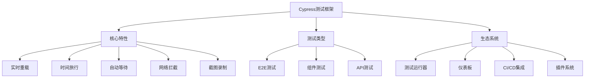

# E2E测试(Cypress)

## Cypress测试框架

### Cypress简介与特性


### Cypress安装与配置
```javascript
// 1. 安装Cypress
// npm install --save-dev cypress

// 2. package.json配置
{
  "scripts": {
    "cypress:open": "cypress open",
    "cypress:run": "cypress run",
    "cypress:run:chrome": "cypress run --browser chrome",
    "cypress:run:firefox": "cypress run --browser firefox",
    "cypress:run:headless": "cypress run --headless"
  }
}

// 3. cypress.config.js配置
const { defineConfig } = require('cypress');

module.exports = defineConfig({
  e2e: {
    baseUrl: 'http://localhost:3000',
    viewportWidth: 1280,
    viewportHeight: 720,
    video: true,
    screenshotOnRunFailure: true,
    defaultCommandTimeout: 10000,
    requestTimeout: 10000,
    responseTimeout: 10000,
    pageLoadTimeout: 30000,
    supportFile: 'cypress/support/e2e.js',
    specPattern: 'cypress/e2e/**/*.cy.{js,jsx,ts,tsx}',
    setupNodeEvents(on, config) {
      // 插件配置
      on('task', {
        log(message) {
          console.log(message);
          return null;
        },
        table(message) {
          console.table(message);
          return null;
        }
      });
      
      // 环境变量
      config.env.apiUrl = process.env.API_URL || 'http://localhost:3001';
      
      return config;
    }
  },
  component: {
    devServer: {
      framework: 'create-react-app',
      bundler: 'webpack'
    }
  }
});

// 4. cypress/support/e2e.js
import './commands';

// 全局配置
Cypress.on('uncaught:exception', (err, runnable) => {
  // 忽略某些错误
  if (err.message.includes('ResizeObserver loop limit exceeded')) {
    return false;
  }
  return true;
});

// 5. cypress/support/commands.js
// 自定义命令
Cypress.Commands.add('login', (username, password) => {
  cy.session([username, password], () => {
    cy.visit('/login');
    cy.get('[data-cy=username]').type(username);
    cy.get('[data-cy=password]').type(password);
    cy.get('[data-cy=login-button]').click();
    cy.url().should('include', '/dashboard');
  });
});

Cypress.Commands.add('createUser', (userData) => {
  cy.request({
    method: 'POST',
    url: '/api/users',
    body: userData
  }).then((response) => {
    expect(response.status).to.eq(201);
    return response.body;
  });
});

Cypress.Commands.add('deleteUser', (userId) => {
  cy.request({
    method: 'DELETE',
    url: `/api/users/${userId}`
  });
});

// 数据属性选择器
Cypress.Commands.add('getByDataCy', (selector) => {
  return cy.get(`[data-cy="${selector}"]`);
});
```

## 基础E2E测试

### 页面导航测试
```javascript
// 1. 页面导航测试
describe('页面导航测试', () => {
  beforeEach(() => {
    cy.visit('/');
  });
  
  test('主页导航', () => {
    cy.url().should('include', '/');
    cy.get('h1').should('contain', '欢迎使用');
  });
  
  test('导航菜单功能', () => {
    // 测试主导航
    cy.getByDataCy('nav-home').click();
    cy.url().should('include', '/');
    
    cy.getByDataCy('nav-about').click();
    cy.url().should('include', '/about');
    
    cy.getByDataCy('nav-contact').click();
    cy.url().should('include', '/contact');
  });
  
  test('面包屑导航', () => {
    cy.visit('/products/category/item');
    
    cy.getByDataCy('breadcrumb-home').should('be.visible');
    cy.getByDataCy('breadcrumb-products').should('be.visible');
    cy.getByDataCy('breadcrumb-category').should('be.visible');
    cy.getByDataCy('breadcrumb-item').should('be.visible');
    
    // 点击面包屑导航
    cy.getByDataCy('breadcrumb-products').click();
    cy.url().should('include', '/products');
  });
  
  test('返回按钮功能', () => {
    cy.visit('/products');
    cy.getByDataCy('product-item').first().click();
    
    cy.getByDataCy('back-button').click();
    cy.url().should('include', '/products');
  });
});

// 2. 响应式导航测试
describe('响应式导航测试', () => {
  test('桌面端导航', () => {
    cy.viewport(1280, 720);
    cy.visit('/');
    
    cy.getByDataCy('desktop-nav').should('be.visible');
    cy.getByDataCy('mobile-menu').should('not.be.visible');
  });
  
  test('移动端导航', () => {
    cy.viewport(375, 667);
    cy.visit('/');
    
    cy.getByDataCy('desktop-nav').should('not.be.visible');
    cy.getByDataCy('mobile-menu').should('be.visible');
    
    // 测试移动端菜单
    cy.getByDataCy('mobile-menu-button').click();
    cy.getByDataCy('mobile-nav').should('be.visible');
    
    cy.getByDataCy('mobile-nav-about').click();
    cy.url().should('include', '/about');
  });
});
```

### 表单交互测试
```javascript
// 1. 用户注册表单测试
describe('用户注册表单测试', () => {
  beforeEach(() => {
    cy.visit('/register');
  });
  
  test('成功注册流程', () => {
    // 填写表单
    cy.getByDataCy('username-input').type('testuser');
    cy.getByDataCy('email-input').type('test@example.com');
    cy.getByDataCy('password-input').type('password123');
    cy.getByDataCy('confirm-password-input').type('password123');
    cy.getByDataCy('terms-checkbox').check();
    
    // 提交表单
    cy.getByDataCy('register-button').click();
    
    // 验证成功消息
    cy.getByDataCy('success-message').should('be.visible');
    cy.getByDataCy('success-message').should('contain', '注册成功');
    
    // 验证重定向
    cy.url().should('include', '/login');
  });
  
  test('表单验证错误', () => {
    // 测试空字段验证
    cy.getByDataCy('register-button').click();
    
    cy.getByDataCy('username-error').should('contain', '用户名不能为空');
    cy.getByDataCy('email-error').should('contain', '邮箱不能为空');
    cy.getByDataCy('password-error').should('contain', '密码不能为空');
    
    // 测试邮箱格式验证
    cy.getByDataCy('email-input').type('invalid-email');
    cy.getByDataCy('register-button').click();
    cy.getByDataCy('email-error').should('contain', '邮箱格式不正确');
    
    // 测试密码确认验证
    cy.getByDataCy('password-input').type('password123');
    cy.getByDataCy('confirm-password-input').type('different123');
    cy.getByDataCy('register-button').click();
    cy.getByDataCy('confirm-password-error').should('contain', '密码不匹配');
  });
  
  test('实时验证反馈', () => {
    // 测试实时验证
    cy.getByDataCy('email-input').type('test');
    cy.getByDataCy('email-error').should('contain', '邮箱格式不正确');
    
    cy.getByDataCy('email-input').clear().type('test@example.com');
    cy.getByDataCy('email-error').should('not.exist');
    
    // 测试密码强度
    cy.getByDataCy('password-input').type('123');
    cy.getByDataCy('password-strength').should('contain', '弱');
    
    cy.getByDataCy('password-input').clear().type('Password123!');
    cy.getByDataCy('password-strength').should('contain', '强');
  });
});

// 2. 搜索表单测试
describe('搜索功能测试', () => {
  beforeEach(() => {
    cy.visit('/products');
  });
  
  test('基本搜索功能', () => {
    cy.getByDataCy('search-input').type('laptop');
    cy.getByDataCy('search-button').click();
    
    cy.url().should('include', 'search=laptop');
    cy.getByDataCy('search-results').should('be.visible');
    cy.getByDataCy('product-item').should('have.length.greaterThan', 0);
  });
  
  test('搜索建议功能', () => {
    cy.getByDataCy('search-input').type('lap');
    
    cy.getByDataCy('search-suggestions').should('be.visible');
    cy.getByDataCy('suggestion-item').should('contain', 'laptop');
    
    cy.getByDataCy('suggestion-item').first().click();
    cy.getByDataCy('search-input').should('have.value', 'laptop');
  });
  
  test('高级搜索功能', () => {
    cy.getByDataCy('advanced-search-toggle').click();
    
    cy.getByDataCy('category-select').select('Electronics');
    cy.getByDataCy('price-min').type('100');
    cy.getByDataCy('price-max').type('500');
    cy.getByDataCy('brand-checkbox').check();
    
    cy.getByDataCy('search-button').click();
    
    cy.url().should('include', 'category=Electronics');
    cy.url().should('include', 'price_min=100');
    cy.url().should('include', 'price_max=500');
  });
});
```

## 用户流程测试

### 完整业务流程
```javascript
// 1. 电商购买流程测试
describe('电商购买流程测试', () => {
  beforeEach(() => {
    // 登录用户
    cy.login('testuser', 'password123');
  });
  
  test('完整购买流程', () => {
    // 1. 浏览商品
    cy.visit('/products');
    cy.getByDataCy('product-item').first().click();
    
    // 2. 查看商品详情
    cy.getByDataCy('product-title').should('be.visible');
    cy.getByDataCy('product-price').should('be.visible');
    cy.getByDataCy('product-description').should('be.visible');
    
    // 3. 添加到购物车
    cy.getByDataCy('add-to-cart-button').click();
    cy.getByDataCy('cart-notification').should('contain', '已添加到购物车');
    
    // 4. 查看购物车
    cy.getByDataCy('cart-icon').click();
    cy.getByDataCy('cart-items').should('have.length', 1);
    
    // 5. 进入结算
    cy.getByDataCy('checkout-button').click();
    cy.url().should('include', '/checkout');
    
    // 6. 填写配送信息
    cy.getByDataCy('shipping-name').type('John Doe');
    cy.getByDataCy('shipping-address').type('123 Main St');
    cy.getByDataCy('shipping-city').type('New York');
    cy.getByDataCy('shipping-zip').type('10001');
    
    // 7. 选择支付方式
    cy.getByDataCy('payment-method-credit').check();
    cy.getByDataCy('card-number').type('4111111111111111');
    cy.getByDataCy('card-expiry').type('12/25');
    cy.getByDataCy('card-cvv').type('123');
    
    // 8. 确认订单
    cy.getByDataCy('order-summary').should('be.visible');
    cy.getByDataCy('place-order-button').click();
    
    // 9. 验证订单成功
    cy.url().should('include', '/order-success');
    cy.getByDataCy('success-message').should('contain', '订单提交成功');
    cy.getByDataCy('order-number').should('be.visible');
  });
  
  test('购物车管理', () => {
    // 添加多个商品到购物车
    cy.visit('/products');
    
    cy.getByDataCy('product-item').eq(0).click();
    cy.getByDataCy('add-to-cart-button').click();
    cy.getByDataCy('back-button').click();
    
    cy.getByDataCy('product-item').eq(1).click();
    cy.getByDataCy('add-to-cart-button').click();
    
    // 查看购物车
    cy.getByDataCy('cart-icon').click();
    cy.getByDataCy('cart-items').should('have.length', 2);
    
    // 修改商品数量
    cy.getByDataCy('quantity-increase').first().click();
    cy.getByDataCy('cart-total').should('contain', '3');
    
    // 删除商品
    cy.getByDataCy('remove-item').first().click();
    cy.getByDataCy('cart-items').should('have.length', 1);
    
    // 清空购物车
    cy.getByDataCy('clear-cart-button').click();
    cy.getByDataCy('empty-cart-message').should('be.visible');
  });
});

// 2. 用户管理流程测试
describe('用户管理流程测试', () => {
  beforeEach(() => {
    cy.login('admin', 'admin123');
  });
  
  test('用户CRUD操作', () => {
    // 1. 查看用户列表
    cy.visit('/admin/users');
    cy.getByDataCy('user-list').should('be.visible');
    
    // 2. 创建新用户
    cy.getByDataCy('create-user-button').click();
    cy.getByDataCy('user-form').should('be.visible');
    
    cy.getByDataCy('username-input').type('newuser');
    cy.getByDataCy('email-input').type('newuser@example.com');
    cy.getByDataCy('role-select').select('user');
    cy.getByDataCy('save-button').click();
    
    // 验证用户创建成功
    cy.getByDataCy('success-message').should('contain', '用户创建成功');
    cy.getByDataCy('user-list').should('contain', 'newuser');
    
    // 3. 编辑用户
    cy.getByDataCy('edit-user-button').first().click();
    cy.getByDataCy('username-input').clear().type('updateduser');
    cy.getByDataCy('save-button').click();
    
    cy.getByDataCy('success-message').should('contain', '用户更新成功');
    cy.getByDataCy('user-list').should('contain', 'updateduser');
    
    // 4. 删除用户
    cy.getByDataCy('delete-user-button').first().click();
    cy.getByDataCy('confirm-delete-button').click();
    
    cy.getByDataCy('success-message').should('contain', '用户删除成功');
  });
  
  test('用户权限管理', () => {
    cy.visit('/admin/users');
    
    // 修改用户角色
    cy.getByDataCy('edit-user-button').first().click();
    cy.getByDataCy('role-select').select('admin');
    cy.getByDataCy('save-button').click();
    
    // 验证权限更新
    cy.getByDataCy('success-message').should('contain', '权限更新成功');
    
    // 测试权限验证
    cy.visit('/admin/settings');
    cy.getByDataCy('admin-settings').should('be.visible');
  });
});
```

### 多步骤表单测试
```javascript
// 1. 多步骤表单测试
describe('多步骤表单测试', () => {
  test('分步注册流程', () => {
    cy.visit('/register');
    
    // 步骤1: 基本信息
    cy.getByDataCy('step-1').should('have.class', 'active');
    cy.getByDataCy('username-input').type('testuser');
    cy.getByDataCy('email-input').type('test@example.com');
    cy.getByDataCy('next-button').click();
    
    // 步骤2: 个人信息
    cy.getByDataCy('step-2').should('have.class', 'active');
    cy.getByDataCy('first-name-input').type('John');
    cy.getByDataCy('last-name-input').type('Doe');
    cy.getByDataCy('phone-input').type('1234567890');
    cy.getByDataCy('next-button').click();
    
    // 步骤3: 安全设置
    cy.getByDataCy('step-3').should('have.class', 'active');
    cy.getByDataCy('password-input').type('password123');
    cy.getByDataCy('confirm-password-input').type('password123');
    cy.getByDataCy('security-question-select').select('What is your pet name?');
    cy.getByDataCy('security-answer-input').type('Fluffy');
    cy.getByDataCy('submit-button').click();
    
    // 验证完成
    cy.getByDataCy('success-message').should('contain', '注册完成');
    cy.url().should('include', '/dashboard');
  });
  
  test('步骤导航功能', () => {
    cy.visit('/register');
    
    // 填写第一步
    cy.getByDataCy('username-input').type('testuser');
    cy.getByDataCy('email-input').type('test@example.com');
    cy.getByDataCy('next-button').click();
    
    // 返回上一步
    cy.getByDataCy('back-button').click();
    cy.getByDataCy('step-1').should('have.class', 'active');
    cy.getByDataCy('username-input').should('have.value', 'testuser');
    
    // 再次前进
    cy.getByDataCy('next-button').click();
    cy.getByDataCy('step-2').should('have.class', 'active');
  });
  
  test('步骤验证', () => {
    cy.visit('/register');
    
    // 尝试跳过必填字段
    cy.getByDataCy('next-button').click();
    cy.getByDataCy('step-1').should('have.class', 'active');
    cy.getByDataCy('username-error').should('be.visible');
    
    // 填写后继续
    cy.getByDataCy('username-input').type('testuser');
    cy.getByDataCy('email-input').type('test@example.com');
    cy.getByDataCy('next-button').click();
    cy.getByDataCy('step-2').should('have.class', 'active');
  });
});
```

## 高级测试技巧

### 网络拦截与模拟
```javascript
// 1. 网络请求拦截
describe('网络请求拦截测试', () => {
  beforeEach(() => {
    // 拦截API请求
    cy.intercept('GET', '/api/users', { fixture: 'users.json' }).as('getUsers');
    cy.intercept('POST', '/api/users', { statusCode: 201, body: { id: 1, name: 'New User' } }).as('createUser');
    cy.intercept('PUT', '/api/users/*', { statusCode: 200, body: { id: 1, name: 'Updated User' } }).as('updateUser');
    cy.intercept('DELETE', '/api/users/*', { statusCode: 204 }).as('deleteUser');
  });
  
  test('用户列表加载', () => {
    cy.visit('/users');
    
    // 等待API请求完成
    cy.wait('@getUsers');
    
    // 验证数据加载
    cy.getByDataCy('user-list').should('be.visible');
    cy.getByDataCy('user-item').should('have.length', 3);
  });
  
  test('创建用户API调用', () => {
    cy.visit('/users');
    
    cy.getByDataCy('create-user-button').click();
    cy.getByDataCy('username-input').type('New User');
    cy.getByDataCy('save-button').click();
    
    // 验证API调用
    cy.wait('@createUser').then((interception) => {
      expect(interception.request.body).to.deep.equal({
        name: 'New User'
      });
    });
    
    cy.getByDataCy('success-message').should('contain', '用户创建成功');
  });
  
  test('网络错误处理', () => {
    // 模拟网络错误
    cy.intercept('GET', '/api/users', { statusCode: 500, body: { error: 'Server Error' } }).as('getUsersError');
    
    cy.visit('/users');
    cy.wait('@getUsersError');
    
    cy.getByDataCy('error-message').should('contain', '服务器错误');
    cy.getByDataCy('retry-button').should('be.visible');
  });
});

// 2. 动态数据模拟
describe('动态数据模拟测试', () => {
  test('动态用户数据', () => {
    // 创建动态响应
    cy.intercept('GET', '/api/users', (req) => {
      req.reply((res) => {
        res.body = [
          { id: 1, name: 'User 1', email: 'user1@example.com' },
          { id: 2, name: 'User 2', email: 'user2@example.com' }
        ];
      });
    }).as('getUsers');
    
    cy.visit('/users');
    cy.wait('@getUsers');
    
    cy.getByDataCy('user-item').should('have.length', 2);
  });
  
  test('条件响应', () => {
    cy.intercept('POST', '/api/login', (req) => {
      const { username, password } = req.body;
      
      if (username === 'admin' && password === 'admin123') {
        req.reply({ statusCode: 200, body: { token: 'admin-token', role: 'admin' } });
      } else {
        req.reply({ statusCode: 401, body: { error: 'Invalid credentials' } });
      }
    }).as('login');
    
    cy.visit('/login');
    
    // 测试成功登录
    cy.getByDataCy('username-input').type('admin');
    cy.getByDataCy('password-input').type('admin123');
    cy.getByDataCy('login-button').click();
    
    cy.wait('@login');
    cy.url().should('include', '/dashboard');
    
    // 测试失败登录
    cy.visit('/login');
    cy.getByDataCy('username-input').type('wrong');
    cy.getByDataCy('password-input').type('wrong');
    cy.getByDataCy('login-button').click();
    
    cy.wait('@login');
    cy.getByDataCy('error-message').should('contain', 'Invalid credentials');
  });
});
```

### 性能测试
```javascript
// 1. 页面加载性能测试
describe('页面性能测试', () => {
  test('页面加载时间', () => {
    const startTime = Date.now();
    
    cy.visit('/');
    
    cy.get('body').should('be.visible').then(() => {
      const loadTime = Date.now() - startTime;
      expect(loadTime).to.be.lessThan(3000); // 3秒内加载完成
    });
  });
  
  test('图片加载性能', () => {
    cy.visit('/products');
    
    // 等待图片加载
    cy.getByDataCy('product-image').should('be.visible');
    cy.getByDataCy('product-image').should('have.attr', 'src').and('not.be.empty');
    
    // 验证图片加载完成
    cy.getByDataCy('product-image').then(($img) => {
      expect($img[0].naturalWidth).to.be.greaterThan(0);
    });
  });
  
  test('API响应时间', () => {
    cy.intercept('GET', '/api/products', (req) => {
      req.reply((res) => {
        // 模拟延迟
        setTimeout(() => {
          res.send({ fixture: 'products.json' });
        }, 100);
      });
    }).as('getProducts');
    
    cy.visit('/products');
    
    cy.wait('@getProducts').then((interception) => {
      expect(interception.response.duration).to.be.lessThan(500); // 500ms内响应
    });
  });
});

// 2. 内存使用测试
describe('内存使用测试', () => {
  test('页面内存泄漏检测', () => {
    cy.visit('/');
    
    // 多次导航测试内存使用
    for (let i = 0; i < 10; i++) {
      cy.visit('/products');
      cy.visit('/about');
      cy.visit('/contact');
    }
    
    // 验证页面仍然正常
    cy.visit('/');
    cy.get('body').should('be.visible');
  });
  
  test('大量数据渲染性能', () => {
    // 模拟大量数据
    const largeDataset = Array.from({ length: 1000 }, (_, i) => ({
      id: i,
      name: `Item ${i}`,
      description: `Description for item ${i}`
    }));
    
    cy.intercept('GET', '/api/items', largeDataset).as('getLargeDataset');
    
    cy.visit('/items');
    cy.wait('@getLargeDataset');
    
    // 验证渲染性能
    cy.getByDataCy('item-list').should('be.visible');
    cy.getByDataCy('item-item').should('have.length', 1000);
  });
});
```

### 跨浏览器测试
```javascript
// 1. 跨浏览器兼容性测试
describe('跨浏览器兼容性测试', () => {
  ['chrome', 'firefox', 'edge'].forEach((browser) => {
    test(`在${browser}中测试基本功能`, () => {
      cy.visit('/');
      
      // 测试基本导航
      cy.getByDataCy('nav-home').click();
      cy.url().should('include', '/');
      
      // 测试表单功能
      cy.visit('/contact');
      cy.getByDataCy('name-input').type('Test User');
      cy.getByDataCy('email-input').type('test@example.com');
      cy.getByDataCy('message-textarea').type('Test message');
      cy.getByDataCy('submit-button').click();
      
      cy.getByDataCy('success-message').should('be.visible');
    });
  });
});

// 2. 响应式设计测试
describe('响应式设计测试', () => {
  const viewports = [
    { device: 'iPhone 12', width: 390, height: 844 },
    { device: 'iPad', width: 768, height: 1024 },
    { device: 'Desktop', width: 1280, height: 720 }
  ];
  
  viewports.forEach(({ device, width, height }) => {
    test(`${device}响应式测试`, () => {
      cy.viewport(width, height);
      cy.visit('/');
      
      // 测试导航菜单
      if (width < 768) {
        cy.getByDataCy('mobile-menu').should('be.visible');
        cy.getByDataCy('desktop-nav').should('not.be.visible');
      } else {
        cy.getByDataCy('desktop-nav').should('be.visible');
        cy.getByDataCy('mobile-menu').should('not.be.visible');
      }
      
      // 测试内容布局
      cy.getByDataCy('main-content').should('be.visible');
      cy.getByDataCy('sidebar').should('be.visible');
      
      // 测试表单布局
      cy.visit('/contact');
      cy.getByDataCy('contact-form').should('be.visible');
    });
  });
});
```

## 相关链接
- [[04-高级精通层/04-安全与测试/03-单元测试(Jest)]] - 单元测试
- [[04-高级精通层/04-安全与测试/04-集成测试]] - 集成测试
- [[04-高级精通层/04-安全与测试/06-测试驱动开发]] - 测试驱动开发
- [[04-高级精通层/04-安全与测试/07-代码示例库-安全测试]] - 测试示例
