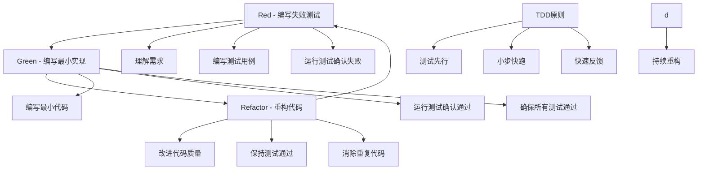

# 测试驱动开发

## TDD基础概念

### TDD开发流程


### TDD优势与挑战
| 方面 | 优势 | 挑战 | 解决方案 |
|------|------|------|----------|
| 代码质量 | 提高代码质量<br>减少bug<br>更好的设计 | 学习曲线陡峭<br>初期开发速度慢 | 团队培训<br>工具支持<br>最佳实践 |
| 维护性 | 易于重构<br>文档化代码<br>回归测试 | 测试维护成本<br>过度测试 | 测试策略<br>测试分层<br>自动化工具 |
| 开发效率 | 快速反馈<br>减少调试时间<br>信心提升 | 编写测试时间<br>测试复杂性 | 测试工具<br>Mock技术<br>测试数据管理 |
| 团队协作 | 共享理解<br>接口定义<br>持续集成 | 测试标准<br>代码审查 | 编码规范<br>代码审查<br>CI/CD流程 |

## TDD实践流程

### Red阶段 - 编写失败测试
```javascript
// 1. 用户管理功能TDD示例
// 第一步：编写失败测试
describe('UserService', () => {
  let userService;
  
  beforeEach(() => {
    userService = new UserService();
  });
  
  // 测试用例1：创建用户
  test('应该能够创建新用户', () => {
    const userData = {
      name: 'John Doe',
      email: 'john@example.com',
      age: 30
    };
    
    const user = userService.createUser(userData);
    
    expect(user).toBeDefined();
    expect(user.id).toBeDefined();
    expect(user.name).toBe(userData.name);
    expect(user.email).toBe(userData.email);
    expect(user.age).toBe(userData.age);
    expect(user.createdAt).toBeDefined();
  });
  
  // 测试用例2：获取用户
  test('应该能够根据ID获取用户', () => {
    const userData = {
      name: 'Jane Doe',
      email: 'jane@example.com',
      age: 25
    };
    
    const createdUser = userService.createUser(userData);
    const retrievedUser = userService.getUser(createdUser.id);
    
    expect(retrievedUser).toBeDefined();
    expect(retrievedUser.id).toBe(createdUser.id);
    expect(retrievedUser.name).toBe(userData.name);
  });
  
  // 测试用例3：更新用户
  test('应该能够更新用户信息', () => {
    const userData = {
      name: 'Bob Smith',
      email: 'bob@example.com',
      age: 35
    };
    
    const user = userService.createUser(userData);
    const updateData = { name: 'Robert Smith', age: 36 };
    
    const updatedUser = userService.updateUser(user.id, updateData);
    
    expect(updatedUser.name).toBe(updateData.name);
    expect(updatedUser.age).toBe(updateData.age);
    expect(updatedUser.email).toBe(userData.email); // 未更新的字段保持不变
  });
  
  // 测试用例4：删除用户
  test('应该能够删除用户', () => {
    const userData = {
      name: 'Alice Johnson',
      email: 'alice@example.com',
      age: 28
    };
    
    const user = userService.createUser(userData);
    const deleteResult = userService.deleteUser(user.id);
    
    expect(deleteResult).toBe(true);
    expect(userService.getUser(user.id)).toBeNull();
  });
  
  // 测试用例5：获取所有用户
  test('应该能够获取所有用户列表', () => {
    const users = [
      { name: 'User 1', email: 'user1@example.com', age: 20 },
      { name: 'User 2', email: 'user2@example.com', age: 25 },
      { name: 'User 3', email: 'user3@example.com', age: 30 }
    ];
    
    users.forEach(userData => userService.createUser(userData));
    
    const allUsers = userService.getAllUsers();
    
    expect(allUsers).toHaveLength(3);
    expect(allUsers.every(user => user.id)).toBe(true);
  });
  
  // 测试用例6：错误处理
  test('获取不存在的用户应该返回null', () => {
    const user = userService.getUser(99999);
    expect(user).toBeNull();
  });
  
  test('更新不存在的用户应该抛出错误', () => {
    expect(() => {
      userService.updateUser(99999, { name: 'New Name' });
    }).toThrow('User not found');
  });
  
  test('删除不存在的用户应该返回false', () => {
    const result = userService.deleteUser(99999);
    expect(result).toBe(false);
  });
});

// 2. 运行测试确认失败
// 此时UserService类还不存在，测试会失败
```

### Green阶段 - 编写最小实现
```javascript
// 第二步：编写最小实现让测试通过
class UserService {
  constructor() {
    this.users = new Map();
    this.nextId = 1;
  }
  
  createUser(userData) {
    const user = {
      id: this.nextId++,
      name: userData.name,
      email: userData.email,
      age: userData.age,
      createdAt: new Date()
    };
    
    this.users.set(user.id, user);
    return user;
  }
  
  getUser(id) {
    return this.users.get(id) || null;
  }
  
  updateUser(id, updateData) {
    const user = this.users.get(id);
    if (!user) {
      throw new Error('User not found');
    }
    
    const updatedUser = { ...user, ...updateData };
    this.users.set(id, updatedUser);
    return updatedUser;
  }
  
  deleteUser(id) {
    if (!this.users.has(id)) {
      return false;
    }
    
    this.users.delete(id);
    return true;
  }
  
  getAllUsers() {
    return Array.from(this.users.values());
  }
}

// 3. 运行测试确认通过
// 所有测试现在应该通过
```

### Refactor阶段 - 重构代码
```javascript
// 第三步：重构代码提高质量
class UserService {
  constructor() {
    this.users = new Map();
    this.nextId = 1;
  }
  
  createUser(userData) {
    this.validateUserData(userData);
    
    const user = {
      id: this.nextId++,
      name: userData.name,
      email: userData.email,
      age: userData.age,
      createdAt: new Date()
    };
    
    this.users.set(user.id, user);
    return user;
  }
  
  getUser(id) {
    this.validateId(id);
    return this.users.get(id) || null;
  }
  
  updateUser(id, updateData) {
    this.validateId(id);
    this.validateUpdateData(updateData);
    
    const user = this.users.get(id);
    if (!user) {
      throw new Error('User not found');
    }
    
    const updatedUser = { ...user, ...updateData };
    this.users.set(id, updatedUser);
    return updatedUser;
  }
  
  deleteUser(id) {
    this.validateId(id);
    
    if (!this.users.has(id)) {
      return false;
    }
    
    this.users.delete(id);
    return true;
  }
  
  getAllUsers() {
    return Array.from(this.users.values());
  }
  
  // 私有方法
  validateUserData(userData) {
    if (!userData || typeof userData !== 'object') {
      throw new Error('Invalid user data');
    }
    
    if (!userData.name || typeof userData.name !== 'string') {
      throw new Error('Name is required and must be a string');
    }
    
    if (!userData.email || typeof userData.email !== 'string') {
      throw new Error('Email is required and must be a string');
    }
    
    if (!userData.age || typeof userData.age !== 'number' || userData.age < 0) {
      throw new Error('Age is required and must be a positive number');
    }
  }
  
  validateId(id) {
    if (!id || typeof id !== 'number' || id <= 0) {
      throw new Error('Invalid user ID');
    }
  }
  
  validateUpdateData(updateData) {
    if (!updateData || typeof updateData !== 'object') {
      throw new Error('Invalid update data');
    }
    
    if (updateData.name !== undefined && typeof updateData.name !== 'string') {
      throw new Error('Name must be a string');
    }
    
    if (updateData.email !== undefined && typeof updateData.email !== 'string') {
      throw new Error('Email must be a string');
    }
    
    if (updateData.age !== undefined && (typeof updateData.age !== 'number' || updateData.age < 0)) {
      throw new Error('Age must be a positive number');
    }
  }
}

// 4. 添加更多测试用例验证重构
describe('UserService重构后测试', () => {
  let userService;
  
  beforeEach(() => {
    userService = new UserService();
  });
  
  test('应该验证用户数据', () => {
    expect(() => {
      userService.createUser(null);
    }).toThrow('Invalid user data');
    
    expect(() => {
      userService.createUser({ name: '', email: 'test@example.com', age: 25 });
    }).toThrow('Name is required and must be a string');
    
    expect(() => {
      userService.createUser({ name: 'John', email: 'invalid-email', age: 25 });
    }).toThrow('Email is required and must be a string');
    
    expect(() => {
      userService.createUser({ name: 'John', email: 'john@example.com', age: -5 });
    }).toThrow('Age is required and must be a positive number');
  });
  
  test('应该验证更新数据', () => {
    const user = userService.createUser({
      name: 'John',
      email: 'john@example.com',
      age: 25
    });
    
    expect(() => {
      userService.updateUser(user.id, { name: 123 });
    }).toThrow('Name must be a string');
    
    expect(() => {
      userService.updateUser(user.id, { age: -10 });
    }).toThrow('Age must be a positive number');
  });
});
```

## 前端TDD实践

### React组件TDD
```javascript
// 1. 用户列表组件TDD
// 第一步：编写失败测试
import React from 'react';
import { render, screen, fireEvent } from '@testing-library/react';
import UserList from './UserList';

describe('UserList组件TDD', () => {
  const mockUsers = [
    { id: 1, name: 'John Doe', email: 'john@example.com', age: 30 },
    { id: 2, name: 'Jane Smith', email: 'jane@example.com', age: 25 },
    { id: 3, name: 'Bob Johnson', email: 'bob@example.com', age: 35 }
  ];
  
  test('应该渲染用户列表', () => {
    render(<UserList users={mockUsers} />);
    
    expect(screen.getByText('用户列表')).toBeInTheDocument();
    expect(screen.getByText('John Doe')).toBeInTheDocument();
    expect(screen.getByText('Jane Smith')).toBeInTheDocument();
    expect(screen.getByText('Bob Johnson')).toBeInTheDocument();
  });
  
  test('应该显示空状态', () => {
    render(<UserList users={[]} />);
    
    expect(screen.getByText('暂无用户数据')).toBeInTheDocument();
  });
  
  test('应该支持用户选择', () => {
    const onUserSelect = jest.fn();
    render(<UserList users={mockUsers} onUserSelect={onUserSelect} />);
    
    fireEvent.click(screen.getByText('John Doe'));
    
    expect(onUserSelect).toHaveBeenCalledWith(mockUsers[0]);
  });
  
  test('应该支持用户删除', () => {
    const onUserDelete = jest.fn();
    render(<UserList users={mockUsers} onUserDelete={onUserDelete} />);
    
    fireEvent.click(screen.getAllByText('删除')[0]);
    
    expect(onUserDelete).toHaveBeenCalledWith(mockUsers[0].id);
  });
  
  test('应该支持搜索功能', () => {
    render(<UserList users={mockUsers} />);
    
    const searchInput = screen.getByPlaceholderText('搜索用户...');
    fireEvent.change(searchInput, { target: { value: 'John' } });
    
    expect(screen.getByText('John Doe')).toBeInTheDocument();
    expect(screen.queryByText('Jane Smith')).not.toBeInTheDocument();
  });
});

// 第二步：编写最小实现
import React, { useState } from 'react';

const UserList = ({ users = [], onUserSelect, onUserDelete }) => {
  const [searchTerm, setSearchTerm] = useState('');
  
  const filteredUsers = users.filter(user =>
    user.name.toLowerCase().includes(searchTerm.toLowerCase())
  );
  
  return (
    <div className="user-list">
      <h2>用户列表</h2>
      
      <input
        type="text"
        placeholder="搜索用户..."
        value={searchTerm}
        onChange={(e) => setSearchTerm(e.target.value)}
      />
      
      {filteredUsers.length === 0 ? (
        <p>暂无用户数据</p>
      ) : (
        <ul>
          {filteredUsers.map(user => (
            <li key={user.id}>
              <span onClick={() => onUserSelect?.(user)}>
                {user.name} - {user.email} - {user.age}岁
              </span>
              <button onClick={() => onUserDelete?.(user.id)}>
                删除
              </button>
            </li>
          ))}
        </ul>
      )}
    </div>
  );
};

export default UserList;

// 第三步：重构优化
import React, { useState, useMemo } from 'react';

const UserList = ({ users = [], onUserSelect, onUserDelete }) => {
  const [searchTerm, setSearchTerm] = useState('');
  
  const filteredUsers = useMemo(() => {
    if (!searchTerm) return users;
    
    return users.filter(user =>
      user.name.toLowerCase().includes(searchTerm.toLowerCase()) ||
      user.email.toLowerCase().includes(searchTerm.toLowerCase())
    );
  }, [users, searchTerm]);
  
  const handleSearchChange = (e) => {
    setSearchTerm(e.target.value);
  };
  
  const handleUserClick = (user) => {
    onUserSelect?.(user);
  };
  
  const handleDeleteClick = (userId, e) => {
    e.stopPropagation();
    onUserDelete?.(userId);
  };
  
  return (
    <div className="user-list">
      <header className="user-list-header">
        <h2>用户列表</h2>
        <div className="search-container">
          <input
            type="text"
            placeholder="搜索用户..."
            value={searchTerm}
            onChange={handleSearchChange}
            className="search-input"
          />
        </div>
      </header>
      
      <main className="user-list-content">
        {filteredUsers.length === 0 ? (
          <div className="empty-state">
            <p>暂无用户数据</p>
          </div>
        ) : (
          <ul className="user-list-items">
            {filteredUsers.map(user => (
              <li key={user.id} className="user-item">
                <div 
                  className="user-info"
                  onClick={() => handleUserClick(user)}
                >
                  <span className="user-name">{user.name}</span>
                  <span className="user-email">{user.email}</span>
                  <span className="user-age">{user.age}岁</span>
                </div>
                <button 
                  className="delete-button"
                  onClick={(e) => handleDeleteClick(user.id, e)}
                >
                  删除
                </button>
              </li>
            ))}
          </ul>
        )}
      </main>
    </div>
  );
};

export default UserList;
```

### Vue组件TDD
```javascript
// 1. Vue组件TDD示例
// 第一步：编写失败测试
import { mount } from '@vue/test-utils';
import UserForm from './UserForm.vue';

describe('UserForm组件TDD', () => {
  test('应该渲染表单字段', () => {
    const wrapper = mount(UserForm);
    
    expect(wrapper.find('input[name="name"]').exists()).toBe(true);
    expect(wrapper.find('input[name="email"]').exists()).toBe(true);
    expect(wrapper.find('input[name="age"]').exists()).toBe(true);
    expect(wrapper.find('button[type="submit"]').exists()).toBe(true);
  });
  
  test('应该支持表单提交', async () => {
    const onSubmit = jest.fn();
    const wrapper = mount(UserForm, {
      props: { onSubmit }
    });
    
    await wrapper.find('input[name="name"]').setValue('John Doe');
    await wrapper.find('input[name="email"]').setValue('john@example.com');
    await wrapper.find('input[name="age"]').setValue('30');
    
    await wrapper.find('form').trigger('submit');
    
    expect(onSubmit).toHaveBeenCalledWith({
      name: 'John Doe',
      email: 'john@example.com',
      age: 30
    });
  });
  
  test('应该显示验证错误', async () => {
    const wrapper = mount(UserForm);
    
    await wrapper.find('form').trigger('submit');
    
    expect(wrapper.find('.error-message').exists()).toBe(true);
    expect(wrapper.text()).toContain('姓名不能为空');
  });
  
  test('应该支持编辑模式', () => {
    const userData = {
      name: 'Jane Doe',
      email: 'jane@example.com',
      age: 25
    };
    
    const wrapper = mount(UserForm, {
      props: { user: userData, mode: 'edit' }
    });
    
    expect(wrapper.find('input[name="name"]').element.value).toBe(userData.name);
    expect(wrapper.find('input[name="email"]').element.value).toBe(userData.email);
    expect(wrapper.find('input[name="age"]').element.value).toBe(userData.age.toString());
  });
});

// 第二步：编写最小实现
<template>
  <form @submit.prevent="handleSubmit" class="user-form">
    <div class="form-group">
      <label for="name">姓名</label>
      <input
        id="name"
        name="name"
        type="text"
        v-model="formData.name"
        required
      />
      <span v-if="errors.name" class="error-message">{{ errors.name }}</span>
    </div>
    
    <div class="form-group">
      <label for="email">邮箱</label>
      <input
        id="email"
        name="email"
        type="email"
        v-model="formData.email"
        required
      />
      <span v-if="errors.email" class="error-message">{{ errors.email }}</span>
    </div>
    
    <div class="form-group">
      <label for="age">年龄</label>
      <input
        id="age"
        name="age"
        type="number"
        v-model.number="formData.age"
        required
      />
      <span v-if="errors.age" class="error-message">{{ errors.age }}</span>
    </div>
    
    <button type="submit" class="submit-button">
      {{ mode === 'edit' ? '更新' : '创建' }}
    </button>
  </form>
</template>

<script>
export default {
  name: 'UserForm',
  props: {
    user: {
      type: Object,
      default: () => ({})
    },
    mode: {
      type: String,
      default: 'create'
    },
    onSubmit: {
      type: Function,
      default: () => {}
    }
  },
  data() {
    return {
      formData: {
        name: this.user.name || '',
        email: this.user.email || '',
        age: this.user.age || ''
      },
      errors: {}
    };
  },
  methods: {
    handleSubmit() {
      if (this.validateForm()) {
        this.onSubmit(this.formData);
      }
    },
    validateForm() {
      this.errors = {};
      
      if (!this.formData.name) {
        this.errors.name = '姓名不能为空';
      }
      
      if (!this.formData.email) {
        this.errors.email = '邮箱不能为空';
      } else if (!this.isValidEmail(this.formData.email)) {
        this.errors.email = '邮箱格式不正确';
      }
      
      if (!this.formData.age) {
        this.errors.age = '年龄不能为空';
      } else if (this.formData.age < 0) {
        this.errors.age = '年龄不能为负数';
      }
      
      return Object.keys(this.errors).length === 0;
    },
    isValidEmail(email) {
      const emailRegex = /^[^\s@]+@[^\s@]+\.[^\s@]+$/;
      return emailRegex.test(email);
    }
  }
};
</script>

// 第三步：重构优化
<template>
  <form @submit.prevent="handleSubmit" class="user-form">
    <div class="form-header">
      <h3>{{ mode === 'edit' ? '编辑用户' : '创建用户' }}</h3>
    </div>
    
    <div class="form-body">
      <div class="form-group">
        <label for="name" class="form-label">姓名</label>
        <input
          id="name"
          name="name"
          type="text"
          v-model="formData.name"
          :class="['form-input', { 'error': errors.name }]"
          placeholder="请输入姓名"
          required
        />
        <span v-if="errors.name" class="error-message">{{ errors.name }}</span>
      </div>
      
      <div class="form-group">
        <label for="email" class="form-label">邮箱</label>
        <input
          id="email"
          name="email"
          type="email"
          v-model="formData.email"
          :class="['form-input', { 'error': errors.email }]"
          placeholder="请输入邮箱"
          required
        />
        <span v-if="errors.email" class="error-message">{{ errors.email }}</span>
      </div>
      
      <div class="form-group">
        <label for="age" class="form-label">年龄</label>
        <input
          id="age"
          name="age"
          type="number"
          v-model.number="formData.age"
          :class="['form-input', { 'error': errors.age }]"
          placeholder="请输入年龄"
          min="0"
          max="120"
          required
        />
        <span v-if="errors.age" class="error-message">{{ errors.age }}</span>
      </div>
    </div>
    
    <div class="form-footer">
      <button type="submit" class="submit-button" :disabled="isSubmitting">
        {{ isSubmitting ? '提交中...' : (mode === 'edit' ? '更新' : '创建') }}
      </button>
      <button type="button" class="cancel-button" @click="handleCancel">
        取消
      </button>
    </div>
  </form>
</template>

<script>
export default {
  name: 'UserForm',
  props: {
    user: {
      type: Object,
      default: () => ({})
    },
    mode: {
      type: String,
      default: 'create'
    },
    onSubmit: {
      type: Function,
      default: () => {}
    },
    onCancel: {
      type: Function,
      default: () => {}
    }
  },
  data() {
    return {
      formData: {
        name: this.user.name || '',
        email: this.user.email || '',
        age: this.user.age || ''
      },
      errors: {},
      isSubmitting: false
    };
  },
  watch: {
    user: {
      handler(newUser) {
        this.formData = {
          name: newUser.name || '',
          email: newUser.email || '',
          age: newUser.age || ''
        };
      },
      deep: true
    }
  },
  methods: {
    async handleSubmit() {
      if (this.validateForm()) {
        this.isSubmitting = true;
        try {
          await this.onSubmit(this.formData);
        } finally {
          this.isSubmitting = false;
        }
      }
    },
    handleCancel() {
      this.onCancel();
    },
    validateForm() {
      this.errors = {};
      
      if (!this.formData.name.trim()) {
        this.errors.name = '姓名不能为空';
      }
      
      if (!this.formData.email.trim()) {
        this.errors.email = '邮箱不能为空';
      } else if (!this.isValidEmail(this.formData.email)) {
        this.errors.email = '邮箱格式不正确';
      }
      
      if (!this.formData.age) {
        this.errors.age = '年龄不能为空';
      } else if (this.formData.age < 0 || this.formData.age > 120) {
        this.errors.age = '年龄必须在0-120之间';
      }
      
      return Object.keys(this.errors).length === 0;
    },
    isValidEmail(email) {
      const emailRegex = /^[^\s@]+@[^\s@]+\.[^\s@]+$/;
      return emailRegex.test(email);
    }
  }
};
</script>
```

## 后端TDD实践

### API接口TDD
```javascript
// 1. API接口TDD示例
// 第一步：编写失败测试
const request = require('supertest');
const app = require('../app');

describe('用户API TDD', () => {
  beforeEach(async () => {
    // 清理测试数据
    await User.deleteMany({});
  });
  
  describe('POST /api/users', () => {
    test('应该能够创建新用户', async () => {
      const userData = {
        name: 'John Doe',
        email: 'john@example.com',
        age: 30
      };
      
      const response = await request(app)
        .post('/api/users')
        .send(userData)
        .expect(201);
      
      expect(response.body).toMatchObject({
        id: expect.any(String),
        name: userData.name,
        email: userData.email,
        age: userData.age,
        createdAt: expect.any(String)
      });
    });
    
    test('应该验证必填字段', async () => {
      const response = await request(app)
        .post('/api/users')
        .send({})
        .expect(400);
      
      expect(response.body.errors).toContain('姓名不能为空');
      expect(response.body.errors).toContain('邮箱不能为空');
      expect(response.body.errors).toContain('年龄不能为空');
    });
    
    test('应该验证邮箱格式', async () => {
      const response = await request(app)
        .post('/api/users')
        .send({
          name: 'John Doe',
          email: 'invalid-email',
          age: 30
        })
        .expect(400);
      
      expect(response.body.errors).toContain('邮箱格式不正确');
    });
  });
  
  describe('GET /api/users', () => {
    test('应该能够获取用户列表', async () => {
      // 创建测试数据
      await User.create([
        { name: 'User 1', email: 'user1@example.com', age: 25 },
        { name: 'User 2', email: 'user2@example.com', age: 30 }
      ]);
      
      const response = await request(app)
        .get('/api/users')
        .expect(200);
      
      expect(response.body).toHaveLength(2);
      expect(response.body[0]).toMatchObject({
        id: expect.any(String),
        name: expect.any(String),
        email: expect.any(String),
        age: expect.any(Number)
      });
    });
    
    test('应该支持分页', async () => {
      // 创建更多测试数据
      const users = Array.from({ length: 15 }, (_, i) => ({
        name: `User ${i + 1}`,
        email: `user${i + 1}@example.com`,
        age: 25 + i
      }));
      await User.create(users);
      
      const response = await request(app)
        .get('/api/users?page=1&limit=10')
        .expect(200);
      
      expect(response.body.data).toHaveLength(10);
      expect(response.body.pagination).toMatchObject({
        page: 1,
        limit: 10,
        total: 15,
        pages: 2
      });
    });
  });
  
  describe('GET /api/users/:id', () => {
    test('应该能够获取单个用户', async () => {
      const user = await User.create({
        name: 'John Doe',
        email: 'john@example.com',
        age: 30
      });
      
      const response = await request(app)
        .get(`/api/users/${user._id}`)
        .expect(200);
      
      expect(response.body).toMatchObject({
        id: user._id.toString(),
        name: user.name,
        email: user.email,
        age: user.age
      });
    });
    
    test('获取不存在的用户应该返回404', async () => {
      const response = await request(app)
        .get('/api/users/507f1f77bcf86cd799439011')
        .expect(404);
      
      expect(response.body.error).toBe('用户不存在');
    });
  });
  
  describe('PUT /api/users/:id', () => {
    test('应该能够更新用户', async () => {
      const user = await User.create({
        name: 'John Doe',
        email: 'john@example.com',
        age: 30
      });
      
      const updateData = {
        name: 'Jane Doe',
        age: 31
      };
      
      const response = await request(app)
        .put(`/api/users/${user._id}`)
        .send(updateData)
        .expect(200);
      
      expect(response.body).toMatchObject({
        id: user._id.toString(),
        name: updateData.name,
        email: user.email, // 未更新的字段保持不变
        age: updateData.age
      });
    });
  });
  
  describe('DELETE /api/users/:id', () => {
    test('应该能够删除用户', async () => {
      const user = await User.create({
        name: 'John Doe',
        email: 'john@example.com',
        age: 30
      });
      
      await request(app)
        .delete(`/api/users/${user._id}`)
        .expect(204);
      
      // 验证用户已删除
      const deletedUser = await User.findById(user._id);
      expect(deletedUser).toBeNull();
    });
  });
});

// 第二步：编写最小实现
const express = require('express');
const mongoose = require('mongoose');

const app = express();
app.use(express.json());

// 用户模型
const userSchema = new mongoose.Schema({
  name: { type: String, required: true },
  email: { type: String, required: true, unique: true },
  age: { type: Number, required: true },
  createdAt: { type: Date, default: Date.now }
});

const User = mongoose.model('User', userSchema);

// 创建用户
app.post('/api/users', async (req, res) => {
  try {
    const user = new User(req.body);
    await user.save();
    
    res.status(201).json({
      id: user._id,
      name: user.name,
      email: user.email,
      age: user.age,
      createdAt: user.createdAt
    });
  } catch (error) {
    res.status(400).json({ error: error.message });
  }
});

// 获取用户列表
app.get('/api/users', async (req, res) => {
  try {
    const users = await User.find();
    res.json(users.map(user => ({
      id: user._id,
      name: user.name,
      email: user.email,
      age: user.age
    })));
  } catch (error) {
    res.status(500).json({ error: error.message });
  }
});

// 获取单个用户
app.get('/api/users/:id', async (req, res) => {
  try {
    const user = await User.findById(req.params.id);
    if (!user) {
      return res.status(404).json({ error: '用户不存在' });
    }
    
    res.json({
      id: user._id,
      name: user.name,
      email: user.email,
      age: user.age
    });
  } catch (error) {
    res.status(500).json({ error: error.message });
  }
});

// 更新用户
app.put('/api/users/:id', async (req, res) => {
  try {
    const user = await User.findByIdAndUpdate(
      req.params.id,
      req.body,
      { new: true }
    );
    
    if (!user) {
      return res.status(404).json({ error: '用户不存在' });
    }
    
    res.json({
      id: user._id,
      name: user.name,
      email: user.email,
      age: user.age
    });
  } catch (error) {
    res.status(500).json({ error: error.message });
  }
});

// 删除用户
app.delete('/api/users/:id', async (req, res) => {
  try {
    const user = await User.findByIdAndDelete(req.params.id);
    if (!user) {
      return res.status(404).json({ error: '用户不存在' });
    }
    
    res.status(204).send();
  } catch (error) {
    res.status(500).json({ error: error.message });
  }
});

module.exports = app;

// 第三步：重构优化
const express = require('express');
const mongoose = require('mongoose');
const Joi = require('joi');

const app = express();
app.use(express.json());

// 用户模型
const userSchema = new mongoose.Schema({
  name: { type: String, required: true, trim: true },
  email: { 
    type: String, 
    required: true, 
    unique: true, 
    lowercase: true,
    match: [/^\w+([.-]?\w+)*@\w+([.-]?\w+)*(\.\w{2,3})+$/, '邮箱格式不正确']
  },
  age: { type: Number, required: true, min: 0, max: 120 },
  createdAt: { type: Date, default: Date.now }
});

const User = mongoose.model('User', userSchema);

// 验证中间件
const validateUser = (req, res, next) => {
  const schema = Joi.object({
    name: Joi.string().required().messages({
      'string.empty': '姓名不能为空',
      'any.required': '姓名不能为空'
    }),
    email: Joi.string().email().required().messages({
      'string.email': '邮箱格式不正确',
      'string.empty': '邮箱不能为空',
      'any.required': '邮箱不能为空'
    }),
    age: Joi.number().integer().min(0).max(120).required().messages({
      'number.base': '年龄必须是数字',
      'number.min': '年龄不能小于0',
      'number.max': '年龄不能大于120',
      'any.required': '年龄不能为空'
    })
  });
  
  const { error } = schema.validate(req.body);
  if (error) {
    return res.status(400).json({ 
      errors: error.details.map(detail => detail.message) 
    });
  }
  
  next();
};

// 错误处理中间件
const errorHandler = (err, req, res, next) => {
  if (err.name === 'ValidationError') {
    const errors = Object.values(err.errors).map(e => e.message);
    return res.status(400).json({ errors });
  }
  
  if (err.code === 11000) {
    return res.status(400).json({ error: '邮箱已存在' });
  }
  
  res.status(500).json({ error: '服务器内部错误' });
};

// 创建用户
app.post('/api/users', validateUser, async (req, res, next) => {
  try {
    const user = new User(req.body);
    await user.save();
    
    res.status(201).json({
      id: user._id,
      name: user.name,
      email: user.email,
      age: user.age,
      createdAt: user.createdAt
    });
  } catch (error) {
    next(error);
  }
});

// 获取用户列表（支持分页）
app.get('/api/users', async (req, res, next) => {
  try {
    const page = parseInt(req.query.page) || 1;
    const limit = parseInt(req.query.limit) || 10;
    const skip = (page - 1) * limit;
    
    const [users, total] = await Promise.all([
      User.find().skip(skip).limit(limit),
      User.countDocuments()
    ]);
    
    res.json({
      data: users.map(user => ({
        id: user._id,
        name: user.name,
        email: user.email,
        age: user.age
      })),
      pagination: {
        page,
        limit,
        total,
        pages: Math.ceil(total / limit)
      }
    });
  } catch (error) {
    next(error);
  }
});

// 获取单个用户
app.get('/api/users/:id', async (req, res, next) => {
  try {
    const user = await User.findById(req.params.id);
    if (!user) {
      return res.status(404).json({ error: '用户不存在' });
    }
    
    res.json({
      id: user._id,
      name: user.name,
      email: user.email,
      age: user.age
    });
  } catch (error) {
    next(error);
  }
});

// 更新用户
app.put('/api/users/:id', validateUser, async (req, res, next) => {
  try {
    const user = await User.findByIdAndUpdate(
      req.params.id,
      req.body,
      { new: true, runValidators: true }
    );
    
    if (!user) {
      return res.status(404).json({ error: '用户不存在' });
    }
    
    res.json({
      id: user._id,
      name: user.name,
      email: user.email,
      age: user.age
    });
  } catch (error) {
    next(error);
  }
});

// 删除用户
app.delete('/api/users/:id', async (req, res, next) => {
  try {
    const user = await User.findByIdAndDelete(req.params.id);
    if (!user) {
      return res.status(404).json({ error: '用户不存在' });
    }
    
    res.status(204).send();
  } catch (error) {
    next(error);
  }
});

app.use(errorHandler);

module.exports = app;
```

## 相关链接
- [[04-高级精通层/04-安全与测试/03-单元测试(Jest)]] - 单元测试
- [[04-高级精通层/04-安全与测试/04-集成测试]] - 集成测试
- [[04-高级精通层/04-安全与测试/05-E2E测试(Cypress)]] - E2E测试
- [[04-高级精通层/04-安全与测试/07-代码示例库-安全测试]] - 测试示例
