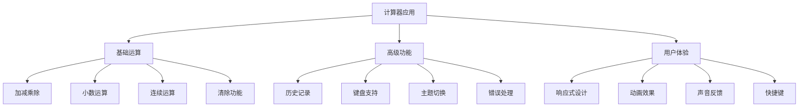

# 计算器应用

## 项目概述

### 功能需求


### 技术栈
| 技术 | 版本 | 用途 |
|------|------|------|
| HTML5 | - | 结构布局 |
| CSS3 | - | 样式设计 |
| JavaScript | ES6+ | 核心逻辑 |
| Web Audio API | - | 声音反馈 |
| Local Storage | - | 历史记录 |

## 项目结构

### 文件组织
```
calculator/
├── index.html          # 主页面
├── css/
│   ├── style.css       # 主样式
│   └── themes.css      # 主题样式
├── js/
│   ├── calculator.js   # 计算器逻辑
│   ├── ui.js          # 界面交互
│   ├── history.js     # 历史记录
│   └── audio.js       # 声音反馈
├── assets/
│   ├── sounds/        # 音效文件
│   └── icons/         # 图标文件
└── README.md          # 项目说明
```

### 核心模块
```javascript
// 1. 计算器核心类
class Calculator {
    constructor() {
        this.display = '0';
        this.previousValue = null;
        this.operator = null;
        this.waitingForOperand = false;
        this.history = [];
        this.maxHistoryLength = 100;
    }
    
    // 输入数字
    inputDigit(digit) {
        if (this.waitingForOperand) {
            this.display = digit;
            this.waitingForOperand = false;
        } else {
            this.display = this.display === '0' ? digit : this.display + digit;
        }
    }
    
    // 输入小数点
    inputDecimal() {
        if (this.waitingForOperand) {
            this.display = '0.';
            this.waitingForOperand = false;
        } else if (this.display.indexOf('.') === -1) {
            this.display += '.';
        }
    }
    
    // 清除
    clear() {
        this.display = '0';
        this.previousValue = null;
        this.operator = null;
        this.waitingForOperand = false;
    }
    
    // 删除最后一位
    backspace() {
        if (this.display.length > 1) {
            this.display = this.display.slice(0, -1);
        } else {
            this.display = '0';
        }
    }
    
    // 执行运算
    performOperation(nextOperator) {
        const inputValue = parseFloat(this.display);
        
        if (this.previousValue === null) {
            this.previousValue = inputValue;
        } else if (this.operator) {
            const currentValue = this.previousValue || 0;
            const newValue = this.calculate(currentValue, inputValue, this.operator);
            
            this.display = String(newValue);
            this.previousValue = newValue;
            
            // 记录历史
            this.addToHistory(currentValue, inputValue, this.operator, newValue);
        }
        
        this.waitingForOperand = true;
        this.operator = nextOperator;
    }
    
    // 计算函数
    calculate(firstValue, secondValue, operator) {
        switch (operator) {
            case '+':
                return firstValue + secondValue;
            case '-':
                return firstValue - secondValue;
            case '×':
                return firstValue * secondValue;
            case '÷':
                if (secondValue === 0) {
                    throw new Error('Division by zero');
                }
                return firstValue / secondValue;
            case '%':
                return firstValue % secondValue;
            case '^':
                return Math.pow(firstValue, secondValue);
            default:
                return secondValue;
        }
    }
    
    // 添加历史记录
    addToHistory(firstValue, secondValue, operator, result) {
        const historyItem = {
            id: Date.now(),
            expression: `${firstValue} ${operator} ${secondValue}`,
            result: result,
            timestamp: new Date().toISOString()
        };
        
        this.history.unshift(historyItem);
        
        // 限制历史记录长度
        if (this.history.length > this.maxHistoryLength) {
            this.history = this.history.slice(0, this.maxHistoryLength);
        }
        
        // 保存到本地存储
        this.saveHistory();
    }
    
    // 保存历史记录
    saveHistory() {
        try {
            localStorage.setItem('calculator-history', JSON.stringify(this.history));
        } catch (error) {
            console.warn('Failed to save history:', error);
        }
    }
    
    // 加载历史记录
    loadHistory() {
        try {
            const saved = localStorage.getItem('calculator-history');
            if (saved) {
                this.history = JSON.parse(saved);
            }
        } catch (error) {
            console.warn('Failed to load history:', error);
        }
    }
    
    // 清除历史记录
    clearHistory() {
        this.history = [];
        localStorage.removeItem('calculator-history');
    }
    
    // 获取显示值
    getDisplay() {
        return this.display;
    }
    
    // 设置显示值
    setDisplay(value) {
        this.display = String(value);
    }
}

// 2. 界面管理类
class CalculatorUI {
    constructor(calculator) {
        this.calculator = calculator;
        this.display = document.getElementById('display');
        this.historyPanel = document.getElementById('history-panel');
        this.themeSelector = document.getElementById('theme-selector');
        this.soundToggle = document.getElementById('sound-toggle');
        
        this.init();
    }
    
    init() {
        this.bindEvents();
        this.loadSettings();
        this.updateDisplay();
        this.loadHistory();
    }
    
    // 绑定事件
    bindEvents() {
        // 数字按钮
        document.querySelectorAll('.number').forEach(button => {
            button.addEventListener('click', (e) => {
                this.handleNumberInput(e.target.textContent);
            });
        });
        
        // 运算符按钮
        document.querySelectorAll('.operator').forEach(button => {
            button.addEventListener('click', (e) => {
                this.handleOperatorInput(e.target.textContent);
            });
        });
        
        // 功能按钮
        document.getElementById('clear').addEventListener('click', () => {
            this.handleClear();
        });
        
        document.getElementById('backspace').addEventListener('click', () => {
            this.handleBackspace();
        });
        
        document.getElementById('equals').addEventListener('click', () => {
            this.handleEquals();
        });
        
        document.getElementById('decimal').addEventListener('click', () => {
            this.handleDecimal();
        });
        
        // 键盘支持
        document.addEventListener('keydown', (e) => {
            this.handleKeyboardInput(e);
        });
        
        // 主题切换
        this.themeSelector.addEventListener('change', (e) => {
            this.changeTheme(e.target.value);
        });
        
        // 声音开关
        this.soundToggle.addEventListener('change', (e) => {
            this.toggleSound(e.target.checked);
        });
        
        // 历史记录
        document.getElementById('history-toggle').addEventListener('click', () => {
            this.toggleHistory();
        });
        
        document.getElementById('clear-history').addEventListener('click', () => {
            this.clearHistory();
        });
    }
    
    // 处理数字输入
    handleNumberInput(digit) {
        try {
            this.calculator.inputDigit(digit);
            this.updateDisplay();
            this.playSound('click');
        } catch (error) {
            this.showError(error.message);
        }
    }
    
    // 处理运算符输入
    handleOperatorInput(operator) {
        try {
            this.calculator.performOperation(operator);
            this.updateDisplay();
            this.playSound('operator');
        } catch (error) {
            this.showError(error.message);
        }
    }
    
    // 处理等号
    handleEquals() {
        try {
            this.calculator.performOperation(null);
            this.updateDisplay();
            this.playSound('equals');
        } catch (error) {
            this.showError(error.message);
        }
    }
    
    // 处理清除
    handleClear() {
        this.calculator.clear();
        this.updateDisplay();
        this.playSound('clear');
    }
    
    // 处理退格
    handleBackspace() {
        this.calculator.backspace();
        this.updateDisplay();
        this.playSound('backspace');
    }
    
    // 处理小数点
    handleDecimal() {
        this.calculator.inputDecimal();
        this.updateDisplay();
        this.playSound('click');
    }
    
    // 处理键盘输入
    handleKeyboardInput(e) {
        e.preventDefault();
        
        const key = e.key;
        
        if (key >= '0' && key <= '9') {
            this.handleNumberInput(key);
        } else if (key === '.') {
            this.handleDecimal();
        } else if (key === '+') {
            this.handleOperatorInput('+');
        } else if (key === '-') {
            this.handleOperatorInput('-');
        } else if (key === '*') {
            this.handleOperatorInput('×');
        } else if (key === '/') {
            this.handleOperatorInput('÷');
        } else if (key === '%') {
            this.handleOperatorInput('%');
        } else if (key === '^') {
            this.handleOperatorInput('^');
        } else if (key === 'Enter' || key === '=') {
            this.handleEquals();
        } else if (key === 'Escape' || key === 'c' || key === 'C') {
            this.handleClear();
        } else if (key === 'Backspace') {
            this.handleBackspace();
        }
    }
    
    // 更新显示
    updateDisplay() {
        const displayValue = this.calculator.getDisplay();
        this.display.textContent = this.formatDisplay(displayValue);
    }
    
    // 格式化显示
    formatDisplay(value) {
        const num = parseFloat(value);
        if (isNaN(num)) return '0';
        
        // 处理大数字
        if (Math.abs(num) > 999999999) {
            return num.toExponential(6);
        }
        
        // 处理小数
        if (num % 1 !== 0) {
            return num.toFixed(8).replace(/\.?0+$/, '');
        }
        
        return num.toString();
    }
    
    // 显示错误
    showError(message) {
        this.display.textContent = 'Error';
        this.display.classList.add('error');
        
        setTimeout(() => {
            this.display.classList.remove('error');
            this.calculator.clear();
            this.updateDisplay();
        }, 2000);
        
        this.playSound('error');
    }
    
    // 播放声音
    playSound(type) {
        if (!this.soundEnabled) return;
        
        const audio = new Audio(`assets/sounds/${type}.mp3`);
        audio.volume = 0.3;
        audio.play().catch(() => {
            // 忽略音频播放错误
        });
    }
    
    // 切换声音
    toggleSound(enabled) {
        this.soundEnabled = enabled;
        this.saveSettings();
    }
    
    // 切换主题
    changeTheme(theme) {
        document.body.className = `theme-${theme}`;
        this.saveSettings();
    }
    
    // 切换历史记录
    toggleHistory() {
        this.historyPanel.classList.toggle('show');
        this.updateHistoryDisplay();
    }
    
    // 更新历史记录显示
    updateHistoryDisplay() {
        const historyList = document.getElementById('history-list');
        historyList.innerHTML = '';
        
        this.calculator.history.forEach(item => {
            const li = document.createElement('li');
            li.innerHTML = `
                <div class="expression">${item.expression}</div>
                <div class="result">= ${item.result}</div>
                <div class="timestamp">${new Date(item.timestamp).toLocaleString()}</div>
            `;
            
            li.addEventListener('click', () => {
                this.calculator.setDisplay(item.result);
                this.updateDisplay();
            });
            
            historyList.appendChild(li);
        });
    }
    
    // 清除历史记录
    clearHistory() {
        this.calculator.clearHistory();
        this.updateHistoryDisplay();
    }
    
    // 保存设置
    saveSettings() {
        const settings = {
            theme: document.body.className,
            soundEnabled: this.soundEnabled
        };
        
        localStorage.setItem('calculator-settings', JSON.stringify(settings));
    }
    
    // 加载设置
    loadSettings() {
        try {
            const saved = localStorage.getItem('calculator-settings');
            if (saved) {
                const settings = JSON.parse(saved);
                this.soundEnabled = settings.soundEnabled !== false;
                this.soundToggle.checked = this.soundEnabled;
                
                if (settings.theme) {
                    document.body.className = settings.theme;
                    this.themeSelector.value = settings.theme.replace('theme-', '');
                }
            } else {
                this.soundEnabled = true;
            }
        } catch (error) {
            console.warn('Failed to load settings:', error);
            this.soundEnabled = true;
        }
    }
    
    // 加载历史记录
    loadHistory() {
        this.calculator.loadHistory();
        this.updateHistoryDisplay();
    }
}

// 3. 音频管理类
class AudioManager {
    constructor() {
        this.sounds = new Map();
        this.enabled = true;
        this.volume = 0.3;
        this.init();
    }
    
    init() {
        this.loadSounds();
    }
    
    // 加载音效
    loadSounds() {
        const soundTypes = ['click', 'operator', 'equals', 'clear', 'backspace', 'error'];
        
        soundTypes.forEach(type => {
            const audio = new Audio(`assets/sounds/${type}.mp3`);
            audio.volume = this.volume;
            this.sounds.set(type, audio);
        });
    }
    
    // 播放音效
    play(type) {
        if (!this.enabled) return;
        
        const audio = this.sounds.get(type);
        if (audio) {
            audio.currentTime = 0;
            audio.play().catch(() => {
                // 忽略音频播放错误
            });
        }
    }
    
    // 设置音量
    setVolume(volume) {
        this.volume = Math.max(0, Math.min(1, volume));
        this.sounds.forEach(audio => {
            audio.volume = this.volume;
        });
    }
    
    // 启用/禁用声音
    setEnabled(enabled) {
        this.enabled = enabled;
    }
}

// 4. 主题管理类
class ThemeManager {
    constructor() {
        this.themes = {
            light: {
                name: 'Light',
                colors: {
                    primary: '#007bff',
                    secondary: '#6c757d',
                    success: '#28a745',
                    danger: '#dc3545',
                    warning: '#ffc107',
                    info: '#17a2b8',
                    background: '#ffffff',
                    surface: '#f8f9fa',
                    text: '#212529',
                    textSecondary: '#6c757d'
                }
            },
            dark: {
                name: 'Dark',
                colors: {
                    primary: '#0d6efd',
                    secondary: '#6c757d',
                    success: '#198754',
                    danger: '#dc3545',
                    warning: '#ffc107',
                    info: '#0dcaf0',
                    background: '#212529',
                    surface: '#343a40',
                    text: '#ffffff',
                    textSecondary: '#adb5bd'
                }
            },
            neon: {
                name: 'Neon',
                colors: {
                    primary: '#00ff00',
                    secondary: '#ff00ff',
                    success: '#00ffff',
                    danger: '#ff0000',
                    warning: '#ffff00',
                    info: '#ff8000',
                    background: '#000000',
                    surface: '#1a1a1a',
                    text: '#00ff00',
                    textSecondary: '#ff00ff'
                }
            }
        };
        
        this.currentTheme = 'light';
        this.init();
    }
    
    init() {
        this.applyTheme(this.currentTheme);
    }
    
    // 应用主题
    applyTheme(themeName) {
        const theme = this.themes[themeName];
        if (!theme) return;
        
        const root = document.documentElement;
        Object.entries(theme.colors).forEach(([key, value]) => {
            root.style.setProperty(`--color-${key}`, value);
        });
        
        this.currentTheme = themeName;
    }
    
    // 获取主题列表
    getThemes() {
        return Object.keys(this.themes).map(key => ({
            key,
            name: this.themes[key].name
        }));
    }
    
    // 获取当前主题
    getCurrentTheme() {
        return this.currentTheme;
    }
}

// 5. 应用初始化
class CalculatorApp {
    constructor() {
        this.calculator = new Calculator();
        this.audioManager = new AudioManager();
        this.themeManager = new ThemeManager();
        this.ui = null;
        this.init();
    }
    
    init() {
        // 等待DOM加载完成
        if (document.readyState === 'loading') {
            document.addEventListener('DOMContentLoaded', () => {
                this.start();
            });
        } else {
            this.start();
        }
    }
    
    start() {
        this.ui = new CalculatorUI(this.calculator);
        this.setupGlobalErrorHandling();
        this.setupServiceWorker();
    }
    
    // 设置全局错误处理
    setupGlobalErrorHandling() {
        window.addEventListener('error', (e) => {
            console.error('Global error:', e.error);
            this.ui.showError('An unexpected error occurred');
        });
        
        window.addEventListener('unhandledrejection', (e) => {
            console.error('Unhandled promise rejection:', e.reason);
            this.ui.showError('An unexpected error occurred');
        });
    }
    
    // 设置Service Worker
    setupServiceWorker() {
        if ('serviceWorker' in navigator) {
            navigator.serviceWorker.register('/sw.js')
                .then(registration => {
                    console.log('Service Worker registered:', registration);
                })
                .catch(error => {
                    console.log('Service Worker registration failed:', error);
                });
        }
    }
}

// 启动应用
const app = new CalculatorApp();
```

## HTML结构

### 主页面
```html
<!DOCTYPE html>
<html lang="zh-CN">
<head>
    <meta charset="UTF-8">
    <meta name="viewport" content="width=device-width, initial-scale=1.0">
    <title>计算器应用</title>
    <link rel="stylesheet" href="css/style.css">
    <link rel="stylesheet" href="css/themes.css">
    <link rel="manifest" href="manifest.json">
    <meta name="theme-color" content="#007bff">
</head>
<body class="theme-light">
    <div class="calculator-container">
        <!-- 头部 -->
        <header class="calculator-header">
            <h1>计算器</h1>
            <div class="controls">
                <button id="history-toggle" class="control-btn" title="历史记录">
                    <span>📊</span>
                </button>
                <button id="theme-toggle" class="control-btn" title="主题">
                    <span>🎨</span>
                </button>
                <button id="sound-toggle" class="control-btn" title="声音">
                    <span>🔊</span>
                </button>
            </div>
        </header>
        
        <!-- 主计算器 -->
        <main class="calculator-main">
            <!-- 显示区域 -->
            <div class="display-container">
                <div id="display" class="display">0</div>
            </div>
            
            <!-- 按钮区域 -->
            <div class="buttons-container">
                <!-- 第一行 -->
                <button class="btn function" id="clear">C</button>
                <button class="btn function" id="backspace">⌫</button>
                <button class="btn operator" data-operator="%">%</button>
                <button class="btn operator" data-operator="÷">÷</button>
                
                <!-- 第二行 -->
                <button class="btn number" data-number="7">7</button>
                <button class="btn number" data-number="8">8</button>
                <button class="btn number" data-number="9">9</button>
                <button class="btn operator" data-operator="×">×</button>
                
                <!-- 第三行 -->
                <button class="btn number" data-number="4">4</button>
                <button class="btn number" data-number="5">5</button>
                <button class="btn number" data-number="6">6</button>
                <button class="btn operator" data-operator="-">-</button>
                
                <!-- 第四行 -->
                <button class="btn number" data-number="1">1</button>
                <button class="btn number" data-number="2">2</button>
                <button class="btn number" data-number="3">3</button>
                <button class="btn operator" data-operator="+">+</button>
                
                <!-- 第五行 -->
                <button class="btn number" data-number="0" id="zero">0</button>
                <button class="btn number" id="decimal">.</button>
                <button class="btn operator" data-operator="^">^</button>
                <button class="btn equals" id="equals">=</button>
            </div>
        </main>
        
        <!-- 历史记录面板 -->
        <aside class="history-panel" id="history-panel">
            <div class="history-header">
                <h3>历史记录</h3>
                <button id="clear-history" class="clear-history-btn">清除</button>
            </div>
            <ul id="history-list" class="history-list"></ul>
        </aside>
        
        <!-- 设置面板 -->
        <div class="settings-panel" id="settings-panel">
            <div class="setting-group">
                <label for="theme-selector">主题:</label>
                <select id="theme-selector">
                    <option value="light">浅色</option>
                    <option value="dark">深色</option>
                    <option value="neon">霓虹</option>
                </select>
            </div>
            <div class="setting-group">
                <label for="sound-toggle">声音:</label>
                <input type="checkbox" id="sound-toggle" checked>
            </div>
        </div>
    </div>
    
    <script src="js/calculator.js"></script>
    <script src="js/ui.js"></script>
    <script src="js/history.js"></script>
    <script src="js/audio.js"></script>
</body>
</html>
```

## CSS样式

### 主样式
```css
/* 基础样式 */
* {
    margin: 0;
    padding: 0;
    box-sizing: border-box;
}

body {
    font-family: 'Segoe UI', Tahoma, Geneva, Verdana, sans-serif;
    background-color: var(--color-background);
    color: var(--color-text);
    transition: all 0.3s ease;
}

.calculator-container {
    max-width: 400px;
    margin: 0 auto;
    padding: 20px;
    min-height: 100vh;
    display: flex;
    flex-direction: column;
}

/* 头部样式 */
.calculator-header {
    display: flex;
    justify-content: space-between;
    align-items: center;
    margin-bottom: 20px;
}

.calculator-header h1 {
    font-size: 1.5rem;
    color: var(--color-primary);
}

.controls {
    display: flex;
    gap: 10px;
}

.control-btn {
    background: var(--color-surface);
    border: none;
    border-radius: 8px;
    padding: 8px;
    cursor: pointer;
    transition: all 0.2s ease;
    font-size: 1.2rem;
}

.control-btn:hover {
    background: var(--color-primary);
    color: white;
    transform: scale(1.05);
}

/* 主计算器样式 */
.calculator-main {
    flex: 1;
    display: flex;
    flex-direction: column;
    gap: 20px;
}

/* 显示区域 */
.display-container {
    background: var(--color-surface);
    border-radius: 12px;
    padding: 20px;
    box-shadow: 0 4px 6px rgba(0, 0, 0, 0.1);
}

.display {
    font-size: 2.5rem;
    font-weight: 300;
    text-align: right;
    min-height: 60px;
    display: flex;
    align-items: center;
    justify-content: flex-end;
    overflow: hidden;
    word-break: break-all;
}

.display.error {
    color: var(--color-danger);
    animation: shake 0.5s ease-in-out;
}

@keyframes shake {
    0%, 100% { transform: translateX(0); }
    25% { transform: translateX(-5px); }
    75% { transform: translateX(5px); }
}

/* 按钮区域 */
.buttons-container {
    display: grid;
    grid-template-columns: repeat(4, 1fr);
    gap: 12px;
}

.btn {
    border: none;
    border-radius: 12px;
    font-size: 1.2rem;
    font-weight: 500;
    cursor: pointer;
    transition: all 0.2s ease;
    min-height: 60px;
    display: flex;
    align-items: center;
    justify-content: center;
    user-select: none;
}

.btn:hover {
    transform: translateY(-2px);
    box-shadow: 0 4px 8px rgba(0, 0, 0, 0.2);
}

.btn:active {
    transform: translateY(0);
    box-shadow: 0 2px 4px rgba(0, 0, 0, 0.2);
}

/* 按钮类型样式 */
.btn.number {
    background: var(--color-surface);
    color: var(--color-text);
}

.btn.number:hover {
    background: var(--color-primary);
    color: white;
}

.btn.operator {
    background: var(--color-primary);
    color: white;
}

.btn.operator:hover {
    background: var(--color-secondary);
}

.btn.function {
    background: var(--color-secondary);
    color: white;
}

.btn.function:hover {
    background: var(--color-danger);
}

.btn.equals {
    background: var(--color-success);
    color: white;
    grid-column: span 2;
}

.btn.equals:hover {
    background: var(--color-info);
}

#zero {
    grid-column: span 2;
}

/* 历史记录面板 */
.history-panel {
    position: fixed;
    top: 0;
    right: -400px;
    width: 400px;
    height: 100vh;
    background: var(--color-surface);
    box-shadow: -4px 0 8px rgba(0, 0, 0, 0.1);
    transition: right 0.3s ease;
    z-index: 1000;
    display: flex;
    flex-direction: column;
}

.history-panel.show {
    right: 0;
}

.history-header {
    padding: 20px;
    border-bottom: 1px solid var(--color-text-secondary);
    display: flex;
    justify-content: space-between;
    align-items: center;
}

.history-header h3 {
    color: var(--color-primary);
}

.clear-history-btn {
    background: var(--color-danger);
    color: white;
    border: none;
    border-radius: 6px;
    padding: 6px 12px;
    cursor: pointer;
    font-size: 0.9rem;
}

.clear-history-btn:hover {
    background: var(--color-warning);
}

.history-list {
    flex: 1;
    overflow-y: auto;
    padding: 20px;
    list-style: none;
}

.history-list li {
    padding: 12px;
    margin-bottom: 8px;
    background: var(--color-background);
    border-radius: 8px;
    cursor: pointer;
    transition: all 0.2s ease;
}

.history-list li:hover {
    background: var(--color-primary);
    color: white;
    transform: translateX(5px);
}

.history-list .expression {
    font-weight: 500;
    margin-bottom: 4px;
}

.history-list .result {
    font-size: 1.1rem;
    color: var(--color-success);
    margin-bottom: 4px;
}

.history-list .timestamp {
    font-size: 0.8rem;
    color: var(--color-text-secondary);
}

/* 设置面板 */
.settings-panel {
    position: fixed;
    top: 0;
    left: -300px;
    width: 300px;
    height: 100vh;
    background: var(--color-surface);
    box-shadow: 4px 0 8px rgba(0, 0, 0, 0.1);
    transition: left 0.3s ease;
    z-index: 1000;
    padding: 20px;
}

.settings-panel.show {
    left: 0;
}

.setting-group {
    margin-bottom: 20px;
}

.setting-group label {
    display: block;
    margin-bottom: 8px;
    font-weight: 500;
    color: var(--color-text);
}

.setting-group select,
.setting-group input {
    width: 100%;
    padding: 8px;
    border: 1px solid var(--color-text-secondary);
    border-radius: 6px;
    background: var(--color-background);
    color: var(--color-text);
}

/* 响应式设计 */
@media (max-width: 480px) {
    .calculator-container {
        padding: 10px;
    }
    
    .display {
        font-size: 2rem;
    }
    
    .btn {
        font-size: 1.1rem;
        min-height: 50px;
    }
    
    .history-panel {
        width: 100%;
        right: -100%;
    }
    
    .settings-panel {
        width: 100%;
        left: -100%;
    }
}

/* 动画效果 */
@keyframes fadeIn {
    from { opacity: 0; transform: translateY(20px); }
    to { opacity: 1; transform: translateY(0); }
}

.calculator-main {
    animation: fadeIn 0.5s ease-out;
}

/* 焦点样式 */
.btn:focus {
    outline: 2px solid var(--color-primary);
    outline-offset: 2px;
}

/* 禁用状态 */
.btn:disabled {
    opacity: 0.6;
    cursor: not-allowed;
    transform: none;
}

.btn:disabled:hover {
    transform: none;
    box-shadow: none;
}
```

## 功能特性

### 核心功能
1. **基础运算**: 加减乘除、百分比、幂运算
2. **连续运算**: 支持连续计算，自动处理运算符优先级
3. **错误处理**: 除零错误、无效输入处理
4. **历史记录**: 保存计算历史，支持点击重用
5. **键盘支持**: 完整的键盘快捷键支持

### 高级功能
1. **主题切换**: 浅色、深色、霓虹三种主题
2. **声音反馈**: 按键音效，可开关控制
3. **响应式设计**: 适配各种屏幕尺寸
4. **本地存储**: 历史记录和设置持久化
5. **PWA支持**: 可安装为桌面应用

### 用户体验
1. **动画效果**: 按钮点击动画、错误提示动画
2. **视觉反馈**: 悬停效果、焦点状态
3. **无障碍支持**: 键盘导航、屏幕阅读器支持
4. **性能优化**: 事件委托、防抖处理

## 相关链接
- [[05-实战项目/01-基础项目/02-待办事项列表]] - 待办事项应用
- [[05-实战项目/01-基础项目/03-图片轮播组件]] - 图片轮播组件
- [[05-实战项目/01-基础项目/04-表单验证工具]] - 表单验证工具
- [[05-实战项目/01-基础项目/05-项目代码库-基础项目]] - 基础项目代码库
