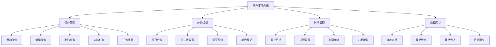

# 待办事项列表

## 项目概述

### 功能需求


### 技术栈
| 技术 | 版本 | 用途 |
|------|------|------|
| HTML5 | - | 结构布局 |
| CSS3 | - | 样式设计 |
| JavaScript | ES6+ | 核心逻辑 |
| IndexedDB | - | 本地数据库 |
| Web Workers | - | 后台处理 |
| Service Worker | - | 离线支持 |

## 项目结构

### 文件组织
```
todo-app/
├── index.html              # 主页面
├── css/
│   ├── style.css          # 主样式
│   ├── components.css     # 组件样式
│   └── themes.css         # 主题样式
├── js/
│   ├── app.js            # 应用入口
│   ├── models/
│   │   ├── Task.js       # 任务模型
│   │   ├── Project.js    # 项目模型
│   │   └── User.js       # 用户模型
│   ├── services/
│   │   ├── StorageService.js    # 存储服务
│   │   ├── NotificationService.js # 通知服务
│   │   └── SyncService.js       # 同步服务
│   ├── components/
│   │   ├── TaskList.js   # 任务列表组件
│   │   ├── TaskForm.js   # 任务表单组件
│   │   ├── ProjectPanel.js # 项目面板组件
│   │   └── Statistics.js # 统计组件
│   └── utils/
│       ├── DateUtils.js  # 日期工具
│       ├── Validation.js # 验证工具
│       └── Helpers.js    # 辅助函数
├── assets/
│   ├── icons/            # 图标文件
│   └── sounds/           # 音效文件
├── manifest.json         # PWA配置
├── sw.js                # Service Worker
└── README.md            # 项目说明
```

### 核心模块
```javascript
// 1. 任务模型
class Task {
    constructor(data = {}) {
        this.id = data.id || this.generateId();
        this.title = data.title || '';
        this.description = data.description || '';
        this.completed = data.completed || false;
        this.priority = data.priority || 'medium';
        this.projectId = data.projectId || null;
        this.tags = data.tags || [];
        this.dueDate = data.dueDate || null;
        this.reminder = data.reminder || null;
        this.createdAt = data.createdAt || new Date().toISOString();
        this.updatedAt = data.updatedAt || new Date().toISOString();
        this.completedAt = data.completedAt || null;
    }
    
    generateId() {
        return 'task_' + Date.now() + '_' + Math.random().toString(36).substr(2, 9);
    }
    
    // 更新任务
    update(updates) {
        Object.assign(this, updates);
        this.updatedAt = new Date().toISOString();
        
        if (updates.completed !== undefined) {
            this.completedAt = updates.completed ? new Date().toISOString() : null;
        }
    }
    
    // 切换完成状态
    toggle() {
        this.completed = !this.completed;
        this.completedAt = this.completed ? new Date().toISOString() : null;
        this.updatedAt = new Date().toISOString();
    }
    
    // 检查是否过期
    isOverdue() {
        if (!this.dueDate || this.completed) return false;
        return new Date(this.dueDate) < new Date();
    }
    
    // 检查是否即将到期
    isDueSoon() {
        if (!this.dueDate || this.completed) return false;
        const dueDate = new Date(this.dueDate);
        const now = new Date();
        const diffHours = (dueDate - now) / (1000 * 60 * 60);
        return diffHours <= 24 && diffHours > 0;
    }
    
    // 获取优先级颜色
    getPriorityColor() {
        const colors = {
            low: '#28a745',
            medium: '#ffc107',
            high: '#dc3545',
            urgent: '#6f42c1'
        };
        return colors[this.priority] || colors.medium;
    }
    
    // 序列化
    toJSON() {
        return {
            id: this.id,
            title: this.title,
            description: this.description,
            completed: this.completed,
            priority: this.priority,
            projectId: this.projectId,
            tags: this.tags,
            dueDate: this.dueDate,
            reminder: this.reminder,
            createdAt: this.createdAt,
            updatedAt: this.updatedAt,
            completedAt: this.completedAt
        };
    }
    
    // 从JSON创建
    static fromJSON(data) {
        return new Task(data);
    }
}

// 2. 项目模型
class Project {
    constructor(data = {}) {
        this.id = data.id || this.generateId();
        this.name = data.name || '';
        this.description = data.description || '';
        this.color = data.color || '#007bff';
        this.icon = data.icon || '📁';
        this.createdAt = data.createdAt || new Date().toISOString();
        this.updatedAt = data.updatedAt || new Date().toISOString();
        this.archived = data.archived || false;
    }
    
    generateId() {
        return 'project_' + Date.now() + '_' + Math.random().toString(36).substr(2, 9);
    }
    
    update(updates) {
        Object.assign(this, updates);
        this.updatedAt = new Date().toISOString();
    }
    
    toJSON() {
        return {
            id: this.id,
            name: this.name,
            description: this.description,
            color: this.color,
            icon: this.icon,
            createdAt: this.createdAt,
            updatedAt: this.updatedAt,
            archived: this.archived
        };
    }
    
    static fromJSON(data) {
        return new Project(data);
    }
}

// 3. 存储服务
class StorageService {
    constructor() {
        this.dbName = 'TodoAppDB';
        this.dbVersion = 1;
        this.db = null;
        this.init();
    }
    
    async init() {
        return new Promise((resolve, reject) => {
            const request = indexedDB.open(this.dbName, this.dbVersion);
            
            request.onerror = () => reject(request.error);
            request.onsuccess = () => {
                this.db = request.result;
                resolve(this.db);
            };
            
            request.onupgradeneeded = (event) => {
                const db = event.target.result;
                
                // 创建任务表
                if (!db.objectStoreNames.contains('tasks')) {
                    const taskStore = db.createObjectStore('tasks', { keyPath: 'id' });
                    taskStore.createIndex('projectId', 'projectId', { unique: false });
                    taskStore.createIndex('completed', 'completed', { unique: false });
                    taskStore.createIndex('dueDate', 'dueDate', { unique: false });
                    taskStore.createIndex('priority', 'priority', { unique: false });
                }
                
                // 创建项目表
                if (!db.objectStoreNames.contains('projects')) {
                    const projectStore = db.createObjectStore('projects', { keyPath: 'id' });
                    projectStore.createIndex('archived', 'archived', { unique: false });
                }
                
                // 创建设置表
                if (!db.objectStoreNames.contains('settings')) {
                    db.createObjectStore('settings', { keyPath: 'key' });
                }
            };
        });
    }
    
    // 保存任务
    async saveTask(task) {
        const transaction = this.db.transaction(['tasks'], 'readwrite');
        const store = transaction.objectStore('tasks');
        return store.put(task.toJSON());
    }
    
    // 获取任务
    async getTask(id) {
        const transaction = this.db.transaction(['tasks'], 'readonly');
        const store = transaction.objectStore('tasks');
        const request = store.get(id);
        
        return new Promise((resolve, reject) => {
            request.onsuccess = () => {
                const data = request.result;
                resolve(data ? Task.fromJSON(data) : null);
            };
            request.onerror = () => reject(request.error);
        });
    }
    
    // 获取所有任务
    async getAllTasks() {
        const transaction = this.db.transaction(['tasks'], 'readonly');
        const store = transaction.objectStore('tasks');
        const request = store.getAll();
        
        return new Promise((resolve, reject) => {
            request.onsuccess = () => {
                const tasks = request.result.map(data => Task.fromJSON(data));
                resolve(tasks);
            };
            request.onerror = () => reject(request.error);
        });
    }
    
    // 删除任务
    async deleteTask(id) {
        const transaction = this.db.transaction(['tasks'], 'readwrite');
        const store = transaction.objectStore('tasks');
        return store.delete(id);
    }
    
    // 保存项目
    async saveProject(project) {
        const transaction = this.db.transaction(['projects'], 'readwrite');
        const store = transaction.objectStore('projects');
        return store.put(project.toJSON());
    }
    
    // 获取所有项目
    async getAllProjects() {
        const transaction = this.db.transaction(['projects'], 'readonly');
        const store = transaction.objectStore('projects');
        const request = store.getAll();
        
        return new Promise((resolve, reject) => {
            request.onsuccess = () => {
                const projects = request.result.map(data => Project.fromJSON(data));
                resolve(projects);
            };
            request.onerror = () => reject(request.error);
        });
    }
    
    // 删除项目
    async deleteProject(id) {
        const transaction = this.db.transaction(['projects'], 'readwrite');
        const store = transaction.objectStore('projects');
        return store.delete(id);
    }
    
    // 保存设置
    async saveSetting(key, value) {
        const transaction = this.db.transaction(['settings'], 'readwrite');
        const store = transaction.objectStore('settings');
        return store.put({ key, value });
    }
    
    // 获取设置
    async getSetting(key) {
        const transaction = this.db.transaction(['settings'], 'readonly');
        const store = transaction.objectStore('settings');
        const request = store.get(key);
        
        return new Promise((resolve, reject) => {
            request.onsuccess = () => {
                const result = request.result;
                resolve(result ? result.value : null);
            };
            request.onerror = () => reject(request.error);
        });
    }
    
    // 导出数据
    async exportData() {
        const [tasks, projects, settings] = await Promise.all([
            this.getAllTasks(),
            this.getAllProjects(),
            this.getAllSettings()
        ]);
        
        return {
            tasks: tasks.map(task => task.toJSON()),
            projects: projects.map(project => project.toJSON()),
            settings: settings,
            exportDate: new Date().toISOString(),
            version: '1.0'
        };
    }
    
    // 导入数据
    async importData(data) {
        const transaction = this.db.transaction(['tasks', 'projects', 'settings'], 'readwrite');
        
        // 清空现有数据
        await transaction.objectStore('tasks').clear();
        await transaction.objectStore('projects').clear();
        await transaction.objectStore('settings').clear();
        
        // 导入新数据
        if (data.tasks) {
            for (const taskData of data.tasks) {
                await transaction.objectStore('tasks').put(taskData);
            }
        }
        
        if (data.projects) {
            for (const projectData of data.projects) {
                await transaction.objectStore('projects').put(projectData);
            }
        }
        
        if (data.settings) {
            for (const [key, value] of Object.entries(data.settings)) {
                await transaction.objectStore('settings').put({ key, value });
            }
        }
        
        return transaction.complete;
    }
    
    // 获取所有设置
    async getAllSettings() {
        const transaction = this.db.transaction(['settings'], 'readonly');
        const store = transaction.objectStore('settings');
        const request = store.getAll();
        
        return new Promise((resolve, reject) => {
            request.onsuccess = () => {
                const settings = {};
                request.result.forEach(item => {
                    settings[item.key] = item.value;
                });
                resolve(settings);
            };
            request.onerror = () => reject(request.error);
        });
    }
}

// 4. 通知服务
class NotificationService {
    constructor() {
        this.permission = 'default';
        this.checkPermission();
    }
    
    async checkPermission() {
        if ('Notification' in window) {
            this.permission = Notification.permission;
        }
    }
    
    async requestPermission() {
        if ('Notification' in window) {
            this.permission = await Notification.requestPermission();
            return this.permission === 'granted';
        }
        return false;
    }
    
    // 显示通知
    showNotification(title, options = {}) {
        if (this.permission !== 'granted') return;
        
        const notification = new Notification(title, {
            icon: '/assets/icons/icon-192x192.png',
            badge: '/assets/icons/badge-72x72.png',
            ...options
        });
        
        notification.onclick = () => {
            window.focus();
            notification.close();
        };
        
        return notification;
    }
    
    // 任务提醒
    showTaskReminder(task) {
        const title = `任务提醒: ${task.title}`;
        const body = task.description || '任务即将到期';
        
        return this.showNotification(title, {
            body,
            tag: `task-${task.id}`,
            requireInteraction: true
        });
    }
    
    // 任务完成通知
    showTaskCompleted(task) {
        const title = `任务完成: ${task.title}`;
        const body = '恭喜！您完成了一个任务';
        
        return this.showNotification(title, {
            body,
            tag: `completed-${task.id}`
        });
    }
    
    // 每日总结
    showDailySummary(completedTasks, pendingTasks) {
        const title = '每日任务总结';
        const body = `今日完成 ${completedTasks} 个任务，还有 ${pendingTasks} 个待完成`;
        
        return this.showNotification(title, {
            body,
            tag: 'daily-summary'
        });
    }
}

// 5. 同步服务
class SyncService {
    constructor(storageService) {
        this.storageService = storageService;
        this.syncEndpoint = 'https://api.todoapp.com/sync';
        this.lastSyncTime = null;
        this.syncInProgress = false;
        this.init();
    }
    
    init() {
        // 定期同步
        setInterval(() => {
            this.sync();
        }, 30000); // 30秒
        
        // 网络状态变化时同步
        window.addEventListener('online', () => {
            this.sync();
        });
    }
    
    // 同步数据
    async sync() {
        if (this.syncInProgress || !navigator.onLine) return;
        
        this.syncInProgress = true;
        
        try {
            const localData = await this.storageService.exportData();
            const response = await fetch(this.syncEndpoint, {
                method: 'POST',
                headers: {
                    'Content-Type': 'application/json'
                },
                body: JSON.stringify({
                    data: localData,
                    lastSync: this.lastSyncTime
                })
            });
            
            if (response.ok) {
                const result = await response.json();
                this.lastSyncTime = new Date().toISOString();
                
                // 处理冲突
                if (result.conflicts && result.conflicts.length > 0) {
                    await this.resolveConflicts(result.conflicts);
                }
                
                // 更新本地数据
                if (result.data) {
                    await this.storageService.importData(result.data);
                }
            }
        } catch (error) {
            console.error('Sync failed:', error);
        } finally {
            this.syncInProgress = false;
        }
    }
    
    // 解决冲突
    async resolveConflicts(conflicts) {
        for (const conflict of conflicts) {
            // 简单的冲突解决策略：使用最新的版本
            const localItem = await this.storageService.getTask(conflict.id);
            const remoteItem = conflict.remote;
            
            if (localItem && new Date(localItem.updatedAt) > new Date(remoteItem.updatedAt)) {
                // 本地版本更新，保持本地
                continue;
            } else {
                // 远程版本更新，使用远程
                await this.storageService.saveTask(Task.fromJSON(remoteItem));
            }
        }
    }
    
    // 手动同步
    async forceSync() {
        await this.sync();
    }
    
    // 获取同步状态
    getSyncStatus() {
        return {
            lastSync: this.lastSyncTime,
            inProgress: this.syncInProgress,
            online: navigator.onLine
        };
    }
}

// 6. 任务列表组件
class TaskList {
    constructor(container, storageService) {
        this.container = container;
        this.storageService = storageService;
        this.tasks = [];
        this.filteredTasks = [];
        this.currentFilter = 'all';
        this.currentProject = null;
        this.sortBy = 'createdAt';
        this.sortOrder = 'desc';
        this.init();
    }
    
    init() {
        this.bindEvents();
        this.loadTasks();
    }
    
    bindEvents() {
        // 筛选按钮
        document.querySelectorAll('.filter-btn').forEach(btn => {
            btn.addEventListener('click', (e) => {
                this.setFilter(e.target.dataset.filter);
            });
        });
        
        // 排序选择
        document.getElementById('sort-select').addEventListener('change', (e) => {
            this.setSort(e.target.value);
        });
        
        // 搜索输入
        document.getElementById('search-input').addEventListener('input', (e) => {
            this.search(e.target.value);
        });
    }
    
    // 加载任务
    async loadTasks() {
        this.tasks = await this.storageService.getAllTasks();
        this.applyFilters();
        this.render();
    }
    
    // 设置筛选
    setFilter(filter) {
        this.currentFilter = filter;
        this.applyFilters();
        this.render();
        
        // 更新按钮状态
        document.querySelectorAll('.filter-btn').forEach(btn => {
            btn.classList.toggle('active', btn.dataset.filter === filter);
        });
    }
    
    // 设置项目筛选
    setProject(projectId) {
        this.currentProject = projectId;
        this.applyFilters();
        this.render();
    }
    
    // 应用筛选
    applyFilters() {
        let filtered = [...this.tasks];
        
        // 项目筛选
        if (this.currentProject) {
            filtered = filtered.filter(task => task.projectId === this.currentProject);
        }
        
        // 状态筛选
        switch (this.currentFilter) {
            case 'active':
                filtered = filtered.filter(task => !task.completed);
                break;
            case 'completed':
                filtered = filtered.filter(task => task.completed);
                break;
            case 'overdue':
                filtered = filtered.filter(task => task.isOverdue());
                break;
            case 'due-soon':
                filtered = filtered.filter(task => task.isDueSoon());
                break;
        }
        
        // 排序
        filtered.sort((a, b) => {
            let aValue = a[this.sortBy];
            let bValue = b[this.sortBy];
            
            if (this.sortBy === 'dueDate') {
                aValue = aValue ? new Date(aValue) : new Date('9999-12-31');
                bValue = bValue ? new Date(bValue) : new Date('9999-12-31');
            }
            
            if (this.sortOrder === 'asc') {
                return aValue > bValue ? 1 : -1;
            } else {
                return aValue < bValue ? 1 : -1;
            }
        });
        
        this.filteredTasks = filtered;
    }
    
    // 搜索
    search(query) {
        if (!query.trim()) {
            this.applyFilters();
        } else {
            this.filteredTasks = this.filteredTasks.filter(task =>
                task.title.toLowerCase().includes(query.toLowerCase()) ||
                task.description.toLowerCase().includes(query.toLowerCase()) ||
                task.tags.some(tag => tag.toLowerCase().includes(query.toLowerCase()))
            );
        }
        this.render();
    }
    
    // 设置排序
    setSort(sortBy) {
        this.sortBy = sortBy;
        this.applyFilters();
        this.render();
    }
    
    // 渲染任务列表
    render() {
        this.container.innerHTML = '';
        
        if (this.filteredTasks.length === 0) {
            this.renderEmptyState();
            return;
        }
        
        this.filteredTasks.forEach(task => {
            const taskElement = this.createTaskElement(task);
            this.container.appendChild(taskElement);
        });
        
        this.updateStats();
    }
    
    // 创建任务元素
    createTaskElement(task) {
        const li = document.createElement('li');
        li.className = `task-item ${task.completed ? 'completed' : ''} ${task.isOverdue() ? 'overdue' : ''} ${task.isDueSoon() ? 'due-soon' : ''}`;
        li.dataset.taskId = task.id;
        
        li.innerHTML = `
            <div class="task-checkbox">
                <input type="checkbox" ${task.completed ? 'checked' : ''}>
            </div>
            <div class="task-content">
                <div class="task-header">
                    <h3 class="task-title">${this.escapeHtml(task.title)}</h3>
                    <div class="task-priority" style="background-color: ${task.getPriorityColor()}"></div>
                </div>
                ${task.description ? `<p class="task-description">${this.escapeHtml(task.description)}</p>` : ''}
                <div class="task-meta">
                    ${task.dueDate ? `<span class="task-due-date">📅 ${this.formatDate(task.dueDate)}</span>` : ''}
                    ${task.tags.length > 0 ? `<div class="task-tags">${task.tags.map(tag => `<span class="tag">${this.escapeHtml(tag)}</span>`).join('')}</div>` : ''}
                </div>
            </div>
            <div class="task-actions">
                <button class="btn-edit" title="编辑">✏️</button>
                <button class="btn-delete" title="删除">🗑️</button>
            </div>
        `;
        
        // 绑定事件
        const checkbox = li.querySelector('input[type="checkbox"]');
        checkbox.addEventListener('change', () => {
            this.toggleTask(task.id);
        });
        
        const editBtn = li.querySelector('.btn-edit');
        editBtn.addEventListener('click', () => {
            this.editTask(task.id);
        });
        
        const deleteBtn = li.querySelector('.btn-delete');
        deleteBtn.addEventListener('click', () => {
            this.deleteTask(task.id);
        });
        
        return li;
    }
    
    // 渲染空状态
    renderEmptyState() {
        const emptyState = document.createElement('div');
        emptyState.className = 'empty-state';
        emptyState.innerHTML = `
            <div class="empty-icon">📝</div>
            <h3>暂无任务</h3>
            <p>点击"添加任务"按钮开始创建您的第一个任务</p>
        `;
        this.container.appendChild(emptyState);
    }
    
    // 更新统计信息
    updateStats() {
        const total = this.tasks.length;
        const completed = this.tasks.filter(task => task.completed).length;
        const active = total - completed;
        const overdue = this.tasks.filter(task => task.isOverdue()).length;
        
        document.getElementById('stats-total').textContent = total;
        document.getElementById('stats-completed').textContent = completed;
        document.getElementById('stats-active').textContent = active;
        document.getElementById('stats-overdue').textContent = overdue;
    }
    
    // 切换任务状态
    async toggleTask(taskId) {
        const task = this.tasks.find(t => t.id === taskId);
        if (task) {
            task.toggle();
            await this.storageService.saveTask(task);
            this.applyFilters();
            this.render();
            
            // 显示通知
            if (task.completed) {
                this.showTaskCompletedNotification(task);
            }
        }
    }
    
    // 编辑任务
    editTask(taskId) {
        const task = this.tasks.find(t => t.id === taskId);
        if (task) {
            // 触发编辑事件
            this.dispatchEvent(new CustomEvent('edit-task', { detail: task }));
        }
    }
    
    // 删除任务
    async deleteTask(taskId) {
        if (confirm('确定要删除这个任务吗？')) {
            await this.storageService.deleteTask(taskId);
            this.tasks = this.tasks.filter(t => t.id !== taskId);
            this.applyFilters();
            this.render();
        }
    }
    
    // 添加任务
    async addTask(taskData) {
        const task = new Task(taskData);
        this.tasks.push(task);
        await this.storageService.saveTask(task);
        this.applyFilters();
        this.render();
        return task;
    }
    
    // 更新任务
    async updateTask(taskId, updates) {
        const task = this.tasks.find(t => t.id === taskId);
        if (task) {
            task.update(updates);
            await this.storageService.saveTask(task);
            this.applyFilters();
            this.render();
            return task;
        }
    }
    
    // 显示任务完成通知
    showTaskCompletedNotification(task) {
        if ('Notification' in window && Notification.permission === 'granted') {
            new Notification(`任务完成: ${task.title}`, {
                body: '恭喜！您完成了一个任务',
                icon: '/assets/icons/icon-192x192.png'
            });
        }
    }
    
    // 工具方法
    escapeHtml(text) {
        const div = document.createElement('div');
        div.textContent = text;
        return div.innerHTML;
    }
    
    formatDate(dateString) {
        const date = new Date(dateString);
        const now = new Date();
        const diffTime = date - now;
        const diffDays = Math.ceil(diffTime / (1000 * 60 * 60 * 24));
        
        if (diffDays === 0) return '今天';
        if (diffDays === 1) return '明天';
        if (diffDays === -1) return '昨天';
        if (diffDays > 0) return `${diffDays}天后`;
        if (diffDays < 0) return `${Math.abs(diffDays)}天前`;
        
        return date.toLocaleDateString();
    }
}

// 7. 应用主类
class TodoApp {
    constructor() {
        this.storageService = new StorageService();
        this.notificationService = new NotificationService();
        this.syncService = new SyncService(this.storageService);
        this.taskList = null;
        this.projects = [];
        this.currentProject = null;
        this.init();
    }
    
    async init() {
        // 等待存储服务初始化
        await this.storageService.init();
        
        // 请求通知权限
        await this.notificationService.requestPermission();
        
        // 初始化组件
        this.initComponents();
        
        // 绑定事件
        this.bindEvents();
        
        // 加载数据
        await this.loadData();
        
        // 设置提醒
        this.setupReminders();
    }
    
    initComponents() {
        const taskListContainer = document.getElementById('task-list');
        this.taskList = new TaskList(taskListContainer, this.storageService);
    }
    
    bindEvents() {
        // 添加任务按钮
        document.getElementById('add-task-btn').addEventListener('click', () => {
            this.showTaskForm();
        });
        
        // 任务列表事件
        this.taskList.addEventListener('edit-task', (e) => {
            this.showTaskForm(e.detail);
        });
        
        // 项目选择
        document.getElementById('project-select').addEventListener('change', (e) => {
            this.setCurrentProject(e.target.value);
        });
        
        // 数据导出
        document.getElementById('export-btn').addEventListener('click', () => {
            this.exportData();
        });
        
        // 数据导入
        document.getElementById('import-btn').addEventListener('click', () => {
            this.importData();
        });
    }
    
    async loadData() {
        // 加载项目
        this.projects = await this.storageService.getAllProjects();
        this.renderProjects();
        
        // 加载任务
        await this.taskList.loadTasks();
    }
    
    renderProjects() {
        const select = document.getElementById('project-select');
        select.innerHTML = '<option value="">所有项目</option>';
        
        this.projects.forEach(project => {
            const option = document.createElement('option');
            option.value = project.id;
            option.textContent = project.name;
            select.appendChild(option);
        });
    }
    
    setCurrentProject(projectId) {
        this.currentProject = projectId;
        this.taskList.setProject(projectId);
    }
    
    showTaskForm(task = null) {
        // 创建任务表单模态框
        const modal = document.createElement('div');
        modal.className = 'modal';
        modal.innerHTML = `
            <div class="modal-content">
                <div class="modal-header">
                    <h2>${task ? '编辑任务' : '添加任务'}</h2>
                    <button class="modal-close">&times;</button>
                </div>
                <form class="task-form">
                    <div class="form-group">
                        <label for="task-title">标题 *</label>
                        <input type="text" id="task-title" required value="${task ? task.title : ''}">
                    </div>
                    <div class="form-group">
                        <label for="task-description">描述</label>
                        <textarea id="task-description">${task ? task.description : ''}</textarea>
                    </div>
                    <div class="form-group">
                        <label for="task-priority">优先级</label>
                        <select id="task-priority">
                            <option value="low" ${task && task.priority === 'low' ? 'selected' : ''}>低</option>
                            <option value="medium" ${task && task.priority === 'medium' ? 'selected' : ''}>中</option>
                            <option value="high" ${task && task.priority === 'high' ? 'selected' : ''}>高</option>
                            <option value="urgent" ${task && task.priority === 'urgent' ? 'selected' : ''}>紧急</option>
                        </select>
                    </div>
                    <div class="form-group">
                        <label for="task-project">项目</label>
                        <select id="task-project">
                            <option value="">无项目</option>
                            ${this.projects.map(project => 
                                `<option value="${project.id}" ${task && task.projectId === project.id ? 'selected' : ''}>${project.name}</option>`
                            ).join('')}
                        </select>
                    </div>
                    <div class="form-group">
                        <label for="task-due-date">截止日期</label>
                        <input type="datetime-local" id="task-due-date" value="${task && task.dueDate ? new Date(task.dueDate).toISOString().slice(0, 16) : ''}">
                    </div>
                    <div class="form-group">
                        <label for="task-tags">标签 (用逗号分隔)</label>
                        <input type="text" id="task-tags" value="${task ? task.tags.join(', ') : ''}">
                    </div>
                    <div class="form-actions">
                        <button type="button" class="btn-cancel">取消</button>
                        <button type="submit" class="btn-save">保存</button>
                    </div>
                </form>
            </div>
        `;
        
        document.body.appendChild(modal);
        
        // 绑定事件
        const form = modal.querySelector('.task-form');
        form.addEventListener('submit', (e) => {
            e.preventDefault();
            this.saveTask(task, form);
            modal.remove();
        });
        
        modal.querySelector('.modal-close').addEventListener('click', () => {
            modal.remove();
        });
        
        modal.querySelector('.btn-cancel').addEventListener('click', () => {
            modal.remove();
        });
        
        // 点击背景关闭
        modal.addEventListener('click', (e) => {
            if (e.target === modal) {
                modal.remove();
            }
        });
    }
    
    async saveTask(task, form) {
        const formData = new FormData(form);
        const taskData = {
            title: form.querySelector('#task-title').value,
            description: form.querySelector('#task-description').value,
            priority: form.querySelector('#task-priority').value,
            projectId: form.querySelector('#task-project').value || null,
            dueDate: form.querySelector('#task-due-date').value || null,
            tags: form.querySelector('#task-tags').value.split(',').map(tag => tag.trim()).filter(tag => tag)
        };
        
        if (task) {
            await this.taskList.updateTask(task.id, taskData);
        } else {
            await this.taskList.addTask(taskData);
        }
    }
    
    setupReminders() {
        // 检查即将到期的任务
        setInterval(() => {
            this.checkReminders();
        }, 60000); // 每分钟检查一次
    }
    
    async checkReminders() {
        const tasks = await this.storageService.getAllTasks();
        const now = new Date();
        
        tasks.forEach(task => {
            if (task.reminder && !task.completed) {
                const reminderTime = new Date(task.reminder);
                if (reminderTime <= now) {
                    this.notificationService.showTaskReminder(task);
                }
            }
        });
    }
    
    async exportData() {
        try {
            const data = await this.storageService.exportData();
            const blob = new Blob([JSON.stringify(data, null, 2)], { type: 'application/json' });
            const url = URL.createObjectURL(blob);
            
            const a = document.createElement('a');
            a.href = url;
            a.download = `todo-backup-${new Date().toISOString().split('T')[0]}.json`;
            a.click();
            
            URL.revokeObjectURL(url);
        } catch (error) {
            alert('导出失败: ' + error.message);
        }
    }
    
    importData() {
        const input = document.createElement('input');
        input.type = 'file';
        input.accept = '.json';
        
        input.addEventListener('change', async (e) => {
            const file = e.target.files[0];
            if (file) {
                try {
                    const text = await file.text();
                    const data = JSON.parse(text);
                    
                    if (confirm('导入数据将覆盖现有数据，确定继续吗？')) {
                        await this.storageService.importData(data);
                        await this.loadData();
                        alert('数据导入成功！');
                    }
                } catch (error) {
                    alert('导入失败: ' + error.message);
                }
            }
        });
        
        input.click();
    }
}

// 启动应用
const app = new TodoApp();
```

## HTML结构

### 主页面
```html
<!DOCTYPE html>
<html lang="zh-CN">
<head>
    <meta charset="UTF-8">
    <meta name="viewport" content="width=device-width, initial-scale=1.0">
    <title>待办事项列表</title>
    <link rel="stylesheet" href="css/style.css">
    <link rel="stylesheet" href="css/components.css">
    <link rel="manifest" href="manifest.json">
    <meta name="theme-color" content="#007bff">
</head>
<body>
    <div class="app-container">
        <!-- 头部 -->
        <header class="app-header">
            <div class="header-content">
                <h1>📝 待办事项</h1>
                <div class="header-actions">
                    <button id="add-task-btn" class="btn-primary">+ 添加任务</button>
                    <button id="export-btn" class="btn-secondary">导出</button>
                    <button id="import-btn" class="btn-secondary">导入</button>
                </div>
            </div>
        </header>
        
        <!-- 主内容 -->
        <main class="app-main">
            <!-- 侧边栏 -->
            <aside class="sidebar">
                <!-- 统计信息 -->
                <div class="stats-panel">
                    <h3>统计信息</h3>
                    <div class="stats-grid">
                        <div class="stat-item">
                            <span class="stat-number" id="stats-total">0</span>
                            <span class="stat-label">总任务</span>
                        </div>
                        <div class="stat-item">
                            <span class="stat-number" id="stats-active">0</span>
                            <span class="stat-label">进行中</span>
                        </div>
                        <div class="stat-item">
                            <span class="stat-number" id="stats-completed">0</span>
                            <span class="stat-label">已完成</span>
                        </div>
                        <div class="stat-item">
                            <span class="stat-number" id="stats-overdue">0</span>
                            <span class="stat-label">已过期</span>
                        </div>
                    </div>
                </div>
                
                <!-- 项目筛选 -->
                <div class="project-panel">
                    <h3>项目</h3>
                    <select id="project-select" class="project-select">
                        <option value="">所有项目</option>
                    </select>
                </div>
                
                <!-- 筛选器 -->
                <div class="filter-panel">
                    <h3>筛选</h3>
                    <div class="filter-buttons">
                        <button class="filter-btn active" data-filter="all">全部</button>
                        <button class="filter-btn" data-filter="active">进行中</button>
                        <button class="filter-btn" data-filter="completed">已完成</button>
                        <button class="filter-btn" data-filter="overdue">已过期</button>
                        <button class="filter-btn" data-filter="due-soon">即将到期</button>
                    </div>
                </div>
                
                <!-- 排序 -->
                <div class="sort-panel">
                    <h3>排序</h3>
                    <select id="sort-select" class="sort-select">
                        <option value="createdAt">创建时间</option>
                        <option value="dueDate">截止日期</option>
                        <option value="priority">优先级</option>
                        <option value="title">标题</option>
                    </select>
                </div>
            </aside>
            
            <!-- 任务列表 -->
            <section class="task-section">
                <!-- 搜索栏 -->
                <div class="search-bar">
                    <input type="text" id="search-input" placeholder="搜索任务..." class="search-input">
                </div>
                
                <!-- 任务列表 -->
                <ul id="task-list" class="task-list"></ul>
            </section>
        </main>
    </div>
    
    <script src="js/app.js"></script>
</body>
</html>
```

## 功能特性

### 核心功能
1. **任务管理**: 添加、编辑、删除、完成任务
2. **项目分类**: 按项目组织任务
3. **优先级设置**: 低、中、高、紧急四个级别
4. **标签系统**: 为任务添加标签便于分类
5. **截止日期**: 设置任务截止时间和提醒

### 高级功能
1. **智能筛选**: 按状态、项目、优先级筛选
2. **搜索功能**: 全文搜索任务标题、描述、标签
3. **排序选项**: 多种排序方式
4. **统计信息**: 任务完成情况统计
5. **数据同步**: 云端同步和冲突解决

### 用户体验
1. **响应式设计**: 适配各种设备
2. **离线支持**: Service Worker提供离线功能
3. **通知提醒**: 任务到期提醒
4. **数据备份**: 导入导出功能
5. **主题切换**: 多种视觉主题

## 相关链接
- [[05-实战项目/01-基础项目/01-计算器应用]] - 计算器应用
- [[05-实战项目/01-基础项目/03-图片轮播组件]] - 图片轮播组件
- [[05-实战项目/01-基础项目/04-表单验证工具]] - 表单验证工具
- [[05-实战项目/01-基础项目/05-项目代码库-基础项目]] - 基础项目代码库
