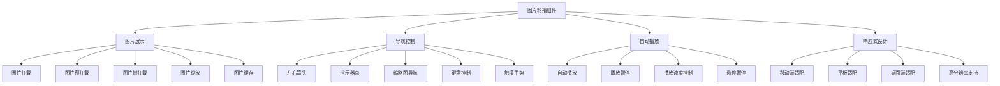

# 图片轮播组件

## 项目概述

### 功能需求


### 技术栈
| 技术 | 版本 | 用途 |
|------|------|------|
| HTML5 | - | 结构布局 |
| CSS3 | - | 样式动画 |
| JavaScript | ES6+ | 核心逻辑 |
| Touch Events | - | 触摸支持 |
| Intersection Observer | - | 懒加载 |
| Web Animations API | - | 动画控制 |

## 项目结构

### 文件组织
```
image-carousel/
├── index.html              # 演示页面
├── css/
│   ├── carousel.css       # 轮播组件样式
│   ├── themes.css         # 主题样式
│   └── responsive.css     # 响应式样式
├── js/
│   ├── carousel.js        # 轮播组件主类
│   ├── touch-handler.js   # 触摸事件处理
│   ├── lazy-loader.js     # 懒加载处理
│   ├── animation-controller.js # 动画控制
│   └── utils.js           # 工具函数
├── assets/
│   ├── images/            # 示例图片
│   └── icons/             # 图标文件
└── README.md              # 项目说明
```

### 核心模块
```javascript
// 1. 轮播组件主类
class ImageCarousel {
    constructor(container, options = {}) {
        this.container = container;
        this.options = {
            autoplay: true,
            autoplayDelay: 3000,
            loop: true,
            showArrows: true,
            showDots: true,
            showThumbnails: false,
            transition: 'slide', // slide, fade, zoom
            transitionDuration: 500,
            pauseOnHover: true,
            keyboardNavigation: true,
            touchNavigation: true,
            lazyLoading: true,
            preloadImages: 2,
            ...options
        };
        
        this.images = [];
        this.currentIndex = 0;
        this.isPlaying = false;
        this.isTransitioning = false;
        this.autoplayTimer = null;
        this.touchStartX = 0;
        this.touchStartY = 0;
        this.touchEndX = 0;
        this.touchEndY = 0;
        
        this.init();
    }
    
    init() {
        this.createStructure();
        this.bindEvents();
        this.loadImages();
        this.startAutoplay();
    }
    
    // 创建DOM结构
    createStructure() {
        this.container.innerHTML = `
            <div class="carousel-wrapper">
                <div class="carousel-container">
                    <div class="carousel-track"></div>
                </div>
                
                ${this.options.showArrows ? `
                    <button class="carousel-arrow carousel-arrow-prev" aria-label="上一张">
                        <svg viewBox="0 0 24 24" fill="currentColor">
                            <path d="M15.41 7.41L14 6l-6 6 6 6 1.41-1.41L10.83 12z"/>
                        </svg>
                    </button>
                    <button class="carousel-arrow carousel-arrow-next" aria-label="下一张">
                        <svg viewBox="0 0 24 24" fill="currentColor">
                            <path d="M8.59 16.59L10 18l6-6-6-6-1.41 1.41L13.17 12z"/>
                        </svg>
                    </button>
                ` : ''}
                
                ${this.options.showDots ? '<div class="carousel-dots"></div>' : ''}
                
                ${this.options.showThumbnails ? '<div class="carousel-thumbnails"></div>' : ''}
            </div>
        `;
        
        this.wrapper = this.container.querySelector('.carousel-wrapper');
        this.track = this.container.querySelector('.carousel-track');
        this.dotsContainer = this.container.querySelector('.carousel-dots');
        this.thumbnailsContainer = this.container.querySelector('.carousel-thumbnails');
        this.prevArrow = this.container.querySelector('.carousel-arrow-prev');
        this.nextArrow = this.container.querySelector('.carousel-arrow-next');
    }
    
    // 绑定事件
    bindEvents() {
        // 箭头按钮
        if (this.prevArrow) {
            this.prevArrow.addEventListener('click', () => this.prev());
        }
        if (this.nextArrow) {
            this.nextArrow.addEventListener('click', () => this.next());
        }
        
        // 键盘导航
        if (this.options.keyboardNavigation) {
            document.addEventListener('keydown', (e) => {
                if (this.container.contains(document.activeElement) || 
                    this.container.matches(':hover')) {
                    if (e.key === 'ArrowLeft') {
                        e.preventDefault();
                        this.prev();
                    } else if (e.key === 'ArrowRight') {
                        e.preventDefault();
                        this.next();
                    } else if (e.key === ' ') {
                        e.preventDefault();
                        this.toggleAutoplay();
                    }
                }
            });
        }
        
        // 触摸事件
        if (this.options.touchNavigation) {
            this.bindTouchEvents();
        }
        
        // 悬停暂停
        if (this.options.pauseOnHover) {
            this.wrapper.addEventListener('mouseenter', () => this.pauseAutoplay());
            this.wrapper.addEventListener('mouseleave', () => this.resumeAutoplay());
        }
        
        // 窗口大小变化
        window.addEventListener('resize', () => this.handleResize());
    }
    
    // 绑定触摸事件
    bindTouchEvents() {
        this.wrapper.addEventListener('touchstart', (e) => {
            this.touchStartX = e.touches[0].clientX;
            this.touchStartY = e.touches[0].clientY;
        }, { passive: true });
        
        this.wrapper.addEventListener('touchend', (e) => {
            this.touchEndX = e.changedTouches[0].clientX;
            this.touchEndY = e.changedTouches[0].clientY;
            this.handleSwipe();
        }, { passive: true });
    }
    
    // 处理滑动手势
    handleSwipe() {
        const deltaX = this.touchEndX - this.touchStartX;
        const deltaY = this.touchEndY - this.touchStartY;
        const minSwipeDistance = 50;
        
        // 检查是否为水平滑动
        if (Math.abs(deltaX) > Math.abs(deltaY) && Math.abs(deltaX) > minSwipeDistance) {
            if (deltaX > 0) {
                this.prev();
            } else {
                this.next();
            }
        }
    }
    
    // 加载图片
    loadImages() {
        this.images = Array.from(this.container.querySelectorAll('img[data-carousel-image]'));
        
        if (this.images.length === 0) {
            console.warn('No images found with data-carousel-image attribute');
            return;
        }
        
        this.createSlides();
        this.createDots();
        if (this.options.showThumbnails) {
            this.createThumbnails();
        }
        this.updateDisplay();
    }
    
    // 创建幻灯片
    createSlides() {
        this.track.innerHTML = '';
        
        this.images.forEach((img, index) => {
            const slide = document.createElement('div');
            slide.className = 'carousel-slide';
            slide.dataset.index = index;
            
            const slideContent = document.createElement('div');
            slideContent.className = 'slide-content';
            
            if (this.options.lazyLoading) {
                slideContent.innerHTML = `
                    <div class="slide-placeholder" data-src="${img.src}">
                        <div class="loading-spinner"></div>
                    </div>
                `;
            } else {
                slideContent.innerHTML = ``;
            }
            
            slide.appendChild(slideContent);
            this.track.appendChild(slide);
        });
        
        this.slides = Array.from(this.track.querySelectorAll('.carousel-slide'));
    }
    
    // 创建指示器点
    createDots() {
        if (!this.dotsContainer) return;
        
        this.dotsContainer.innerHTML = '';
        
        this.images.forEach((_, index) => {
            const dot = document.createElement('button');
            dot.className = 'carousel-dot';
            dot.dataset.index = index;
            dot.setAttribute('aria-label', `跳转到第 ${index + 1} 张图片`);
            
            dot.addEventListener('click', () => this.goToSlide(index));
            this.dotsContainer.appendChild(dot);
        });
        
        this.dots = Array.from(this.dotsContainer.querySelectorAll('.carousel-dot'));
    }
    
    // 创建缩略图
    createThumbnails() {
        if (!this.thumbnailsContainer) return;
        
        this.thumbnailsContainer.innerHTML = '';
        
        this.images.forEach((img, index) => {
            const thumbnail = document.createElement('button');
            thumbnail.className = 'carousel-thumbnail';
            thumbnail.dataset.index = index;
            thumbnail.innerHTML = ``;
            
            thumbnail.addEventListener('click', () => this.goToSlide(index));
            this.thumbnailsContainer.appendChild(thumbnail);
        });
        
        this.thumbnails = Array.from(this.thumbnailsContainer.querySelectorAll('.carousel-thumbnail'));
    }
    
    // 更新显示
    updateDisplay() {
        this.updateSlides();
        this.updateDots();
        if (this.options.showThumbnails) {
            this.updateThumbnails();
        }
        this.updateArrows();
    }
    
    // 更新幻灯片
    updateSlides() {
        this.slides.forEach((slide, index) => {
            slide.classList.toggle('active', index === this.currentIndex);
            slide.classList.toggle('prev', index === this.getPrevIndex());
            slide.classList.toggle('next', index === this.getNextIndex());
        });
        
        // 更新轨道位置
        const translateX = -this.currentIndex * 100;
        this.track.style.transform = `translateX(${translateX}%)`;
    }
    
    // 更新指示器点
    updateDots() {
        if (!this.dots) return;
        
        this.dots.forEach((dot, index) => {
            dot.classList.toggle('active', index === this.currentIndex);
        });
    }
    
    // 更新缩略图
    updateThumbnails() {
        if (!this.thumbnails) return;
        
        this.thumbnails.forEach((thumbnail, index) => {
            thumbnail.classList.toggle('active', index === this.currentIndex);
        });
    }
    
    // 更新箭头状态
    updateArrows() {
        if (!this.options.loop) {
            if (this.prevArrow) {
                this.prevArrow.disabled = this.currentIndex === 0;
            }
            if (this.nextArrow) {
                this.nextArrow.disabled = this.currentIndex === this.images.length - 1;
            }
        }
    }
    
    // 下一张
    next() {
        if (this.isTransitioning) return;
        
        const nextIndex = this.getNextIndex();
        this.goToSlide(nextIndex);
    }
    
    // 上一张
    prev() {
        if (this.isTransitioning) return;
        
        const prevIndex = this.getPrevIndex();
        this.goToSlide(prevIndex);
    }
    
    // 跳转到指定幻灯片
    goToSlide(index) {
        if (this.isTransitioning || index === this.currentIndex) return;
        
        this.isTransitioning = true;
        this.currentIndex = index;
        
        this.updateDisplay();
        
        // 触发自定义事件
        this.dispatchEvent(new CustomEvent('slideChange', {
            detail: {
                currentIndex: this.currentIndex,
                currentImage: this.images[this.currentIndex]
            }
        }));
        
        // 重置过渡状态
        setTimeout(() => {
            this.isTransitioning = false;
        }, this.options.transitionDuration);
    }
    
    // 获取下一张索引
    getNextIndex() {
        if (this.options.loop) {
            return (this.currentIndex + 1) % this.images.length;
        } else {
            return Math.min(this.currentIndex + 1, this.images.length - 1);
        }
    }
    
    // 获取上一张索引
    getPrevIndex() {
        if (this.options.loop) {
            return this.currentIndex === 0 ? this.images.length - 1 : this.currentIndex - 1;
        } else {
            return Math.max(this.currentIndex - 1, 0);
        }
    }
    
    // 开始自动播放
    startAutoplay() {
        if (!this.options.autoplay || this.isPlaying) return;
        
        this.isPlaying = true;
        this.autoplayTimer = setInterval(() => {
            this.next();
        }, this.options.autoplayDelay);
    }
    
    // 暂停自动播放
    pauseAutoplay() {
        if (this.autoplayTimer) {
            clearInterval(this.autoplayTimer);
            this.autoplayTimer = null;
        }
        this.isPlaying = false;
    }
    
    // 恢复自动播放
    resumeAutoplay() {
        if (this.options.autoplay && !this.isPlaying) {
            this.startAutoplay();
        }
    }
    
    // 切换自动播放
    toggleAutoplay() {
        if (this.isPlaying) {
            this.pauseAutoplay();
        } else {
            this.startAutoplay();
        }
    }
    
    // 处理窗口大小变化
    handleResize() {
        // 重新计算布局
        this.updateDisplay();
    }
    
    // 添加图片
    addImage(src, alt = '') {
        const img = document.createElement('img');
        img.src = src;
        img.alt = alt;
        img.setAttribute('data-carousel-image', '');
        
        this.container.appendChild(img);
        this.loadImages();
    }
    
    // 移除图片
    removeImage(index) {
        if (index >= 0 && index < this.images.length) {
            this.images[index].remove();
            this.loadImages();
            
            // 调整当前索引
            if (this.currentIndex >= this.images.length) {
                this.currentIndex = Math.max(0, this.images.length - 1);
            }
            
            this.updateDisplay();
        }
    }
    
    // 销毁组件
    destroy() {
        this.pauseAutoplay();
        this.container.innerHTML = '';
        this.images = [];
        this.slides = [];
        this.dots = [];
        this.thumbnails = [];
    }
    
    // 触发自定义事件
    dispatchEvent(event) {
        this.container.dispatchEvent(event);
    }
}

// 2. 触摸事件处理器
class TouchHandler {
    constructor(carousel) {
        this.carousel = carousel;
        this.touchStartX = 0;
        this.touchStartY = 0;
        this.touchEndX = 0;
        this.touchEndY = 0;
        this.minSwipeDistance = 50;
        this.maxSwipeTime = 300;
        this.touchStartTime = 0;
        
        this.bindEvents();
    }
    
    bindEvents() {
        const wrapper = this.carousel.wrapper;
        
        wrapper.addEventListener('touchstart', this.handleTouchStart.bind(this), { passive: true });
        wrapper.addEventListener('touchmove', this.handleTouchMove.bind(this), { passive: true });
        wrapper.addEventListener('touchend', this.handleTouchEnd.bind(this), { passive: true });
    }
    
    handleTouchStart(e) {
        this.touchStartX = e.touches[0].clientX;
        this.touchStartY = e.touches[0].clientY;
        this.touchStartTime = Date.now();
    }
    
    handleTouchMove(e) {
        // 可以在这里添加触摸移动时的视觉反馈
    }
    
    handleTouchEnd(e) {
        this.touchEndX = e.changedTouches[0].clientX;
        this.touchEndY = e.changedTouches[0].clientY;
        
        const deltaX = this.touchEndX - this.touchStartX;
        const deltaY = this.touchEndY - this.touchStartY;
        const deltaTime = Date.now() - this.touchStartTime;
        
        // 检查是否为有效的水平滑动
        if (Math.abs(deltaX) > Math.abs(deltaY) && 
            Math.abs(deltaX) > this.minSwipeDistance && 
            deltaTime < this.maxSwipeTime) {
            
            if (deltaX > 0) {
                this.carousel.prev();
            } else {
                this.carousel.next();
            }
        }
    }
}

// 3. 懒加载处理器
class LazyLoader {
    constructor(carousel) {
        this.carousel = carousel;
        this.observer = null;
        this.init();
    }
    
    init() {
        if ('IntersectionObserver' in window) {
            this.observer = new IntersectionObserver(
                this.handleIntersection.bind(this),
                {
                    root: this.carousel.container,
                    rootMargin: '50px',
                    threshold: 0.1
                }
            );
        }
    }
    
    handleIntersection(entries) {
        entries.forEach(entry => {
            if (entry.isIntersecting) {
                this.loadImage(entry.target);
                this.observer.unobserve(entry.target);
            }
        });
    }
    
    loadImage(placeholder) {
        const src = placeholder.dataset.src;
        if (!src) return;
        
        const img = new Image();
        img.onload = () => {
            placeholder.innerHTML = ``;
            placeholder.classList.add('loaded');
        };
        img.onerror = () => {
            placeholder.innerHTML = '<div class="error-message">图片加载失败</div>';
            placeholder.classList.add('error');
        };
        img.src = src;
    }
    
    observe(placeholder) {
        if (this.observer) {
            this.observer.observe(placeholder);
        } else {
            // 降级处理
            this.loadImage(placeholder);
        }
    }
}

// 4. 动画控制器
class AnimationController {
    constructor(carousel) {
        this.carousel = carousel;
        this.animations = new Map();
        this.init();
    }
    
    init() {
        // 预定义动画效果
        this.animations.set('slide', this.slideAnimation.bind(this));
        this.animations.set('fade', this.fadeAnimation.bind(this));
        this.animations.set('zoom', this.zoomAnimation.bind(this));
    }
    
    slideAnimation(fromIndex, toIndex) {
        const track = this.carousel.track;
        const translateX = -toIndex * 100;
        
        track.style.transition = `transform ${this.carousel.options.transitionDuration}ms ease-in-out`;
        track.style.transform = `translateX(${translateX}%)`;
    }
    
    fadeAnimation(fromIndex, toIndex) {
        const slides = this.carousel.slides;
        const fromSlide = slides[fromIndex];
        const toSlide = slides[toIndex];
        
        if (fromSlide && toSlide) {
            fromSlide.style.transition = `opacity ${this.carousel.options.transitionDuration}ms ease-in-out`;
            toSlide.style.transition = `opacity ${this.carousel.options.transitionDuration}ms ease-in-out`;
            
            fromSlide.style.opacity = '0';
            toSlide.style.opacity = '1';
        }
    }
    
    zoomAnimation(fromIndex, toIndex) {
        const slides = this.carousel.slides;
        const fromSlide = slides[fromIndex];
        const toSlide = slides[toIndex];
        
        if (fromSlide && toSlide) {
            fromSlide.style.transition = `transform ${this.carousel.options.transitionDuration}ms ease-in-out`;
            toSlide.style.transition = `transform ${this.carousel.options.transitionDuration}ms ease-in-out`;
            
            fromSlide.style.transform = 'scale(0.8)';
            toSlide.style.transform = 'scale(1)';
        }
    }
    
    animate(fromIndex, toIndex) {
        const animation = this.animations.get(this.carousel.options.transition);
        if (animation) {
            animation(fromIndex, toIndex);
        }
    }
}

// 5. 工具函数
class CarouselUtils {
    static debounce(func, wait) {
        let timeout;
        return function executedFunction(...args) {
            const later = () => {
                clearTimeout(timeout);
                func(...args);
            };
            clearTimeout(timeout);
            timeout = setTimeout(later, wait);
        };
    }
    
    static throttle(func, limit) {
        let inThrottle;
        return function() {
            const args = arguments;
            const context = this;
            if (!inThrottle) {
                func.apply(context, args);
                inThrottle = true;
                setTimeout(() => inThrottle = false, limit);
            }
        };
    }
    
    static preloadImages(urls) {
        return Promise.all(urls.map(url => {
            return new Promise((resolve, reject) => {
                const img = new Image();
                img.onload = resolve;
                img.onerror = reject;
                img.src = url;
            });
        }));
    }
    
    static getImageDimensions(src) {
        return new Promise((resolve, reject) => {
            const img = new Image();
            img.onload = () => {
                resolve({
                    width: img.naturalWidth,
                    height: img.naturalHeight
                });
            };
            img.onerror = reject;
            img.src = src;
        });
    }
}
```

## CSS样式

### 主样式文件
```css
/* 轮播组件基础样式 */
.carousel-wrapper {
    position: relative;
    width: 100%;
    height: 400px;
    overflow: hidden;
    border-radius: 8px;
    box-shadow: 0 4px 20px rgba(0, 0, 0, 0.1);
}

.carousel-container {
    position: relative;
    width: 100%;
    height: 100%;
    overflow: hidden;
}

.carousel-track {
    display: flex;
    width: 100%;
    height: 100%;
    transition: transform 0.5s ease-in-out;
}

.carousel-slide {
    flex: 0 0 100%;
    position: relative;
    opacity: 0;
    transition: opacity 0.5s ease-in-out;
}

.carousel-slide.active {
    opacity: 1;
}

.slide-content {
    width: 100%;
    height: 100%;
    display: flex;
    align-items: center;
    justify-content: center;
}

.slide-content img {
    width: 100%;
    height: 100%;
    object-fit: cover;
}

.slide-placeholder {
    width: 100%;
    height: 100%;
    display: flex;
    align-items: center;
    justify-content: center;
    background: #f5f5f5;
    color: #666;
}

.loading-spinner {
    width: 40px;
    height: 40px;
    border: 4px solid #f3f3f3;
    border-top: 4px solid #007bff;
    border-radius: 50%;
    animation: spin 1s linear infinite;
}

@keyframes spin {
    0% { transform: rotate(0deg); }
    100% { transform: rotate(360deg); }
}

/* 箭头按钮 */
.carousel-arrow {
    position: absolute;
    top: 50%;
    transform: translateY(-50%);
    background: rgba(0, 0, 0, 0.5);
    color: white;
    border: none;
    width: 50px;
    height: 50px;
    border-radius: 50%;
    cursor: pointer;
    display: flex;
    align-items: center;
    justify-content: center;
    transition: all 0.3s ease;
    z-index: 10;
}

.carousel-arrow:hover {
    background: rgba(0, 0, 0, 0.7);
    transform: translateY(-50%) scale(1.1);
}

.carousel-arrow:disabled {
    opacity: 0.5;
    cursor: not-allowed;
}

.carousel-arrow-prev {
    left: 20px;
}

.carousel-arrow-next {
    right: 20px;
}

.carousel-arrow svg {
    width: 24px;
    height: 24px;
}

/* 指示器点 */
.carousel-dots {
    position: absolute;
    bottom: 20px;
    left: 50%;
    transform: translateX(-50%);
    display: flex;
    gap: 8px;
    z-index: 10;
}

.carousel-dot {
    width: 12px;
    height: 12px;
    border-radius: 50%;
    border: none;
    background: rgba(255, 255, 255, 0.5);
    cursor: pointer;
    transition: all 0.3s ease;
}

.carousel-dot:hover {
    background: rgba(255, 255, 255, 0.8);
    transform: scale(1.2);
}

.carousel-dot.active {
    background: white;
    transform: scale(1.3);
}

/* 缩略图导航 */
.carousel-thumbnails {
    position: absolute;
    bottom: 60px;
    left: 50%;
    transform: translateX(-50%);
    display: flex;
    gap: 8px;
    z-index: 10;
}

.carousel-thumbnail {
    width: 60px;
    height: 40px;
    border: 2px solid transparent;
    border-radius: 4px;
    overflow: hidden;
    cursor: pointer;
    transition: all 0.3s ease;
    background: none;
    padding: 0;
}

.carousel-thumbnail:hover {
    border-color: rgba(255, 255, 255, 0.8);
    transform: scale(1.1);
}

.carousel-thumbnail.active {
    border-color: white;
    transform: scale(1.15);
}

.carousel-thumbnail img {
    width: 100%;
    height: 100%;
    object-fit: cover;
}

/* 响应式设计 */
@media (max-width: 768px) {
    .carousel-wrapper {
        height: 300px;
    }
    
    .carousel-arrow {
        width: 40px;
        height: 40px;
    }
    
    .carousel-arrow-prev {
        left: 10px;
    }
    
    .carousel-arrow-next {
        right: 10px;
    }
    
    .carousel-arrow svg {
        width: 20px;
        height: 20px;
    }
    
    .carousel-dots {
        bottom: 15px;
    }
    
    .carousel-dot {
        width: 10px;
        height: 10px;
    }
    
    .carousel-thumbnails {
        bottom: 50px;
    }
    
    .carousel-thumbnail {
        width: 50px;
        height: 35px;
    }
}

@media (max-width: 480px) {
    .carousel-wrapper {
        height: 250px;
    }
    
    .carousel-arrow {
        width: 35px;
        height: 35px;
    }
    
    .carousel-arrow-prev {
        left: 5px;
    }
    
    .carousel-arrow-next {
        right: 5px;
    }
    
    .carousel-arrow svg {
        width: 18px;
        height: 18px;
    }
    
    .carousel-dots {
        bottom: 10px;
    }
    
    .carousel-dot {
        width: 8px;
        height: 8px;
    }
    
    .carousel-thumbnails {
        bottom: 40px;
    }
    
    .carousel-thumbnail {
        width: 40px;
        height: 30px;
    }
}

/* 主题样式 */
.carousel-theme-dark .carousel-arrow {
    background: rgba(255, 255, 255, 0.2);
    color: white;
}

.carousel-theme-dark .carousel-arrow:hover {
    background: rgba(255, 255, 255, 0.3);
}

.carousel-theme-dark .carousel-dot {
    background: rgba(255, 255, 255, 0.3);
}

.carousel-theme-dark .carousel-dot:hover {
    background: rgba(255, 255, 255, 0.6);
}

.carousel-theme-dark .carousel-dot.active {
    background: white;
}

.carousel-theme-light .carousel-arrow {
    background: rgba(0, 0, 0, 0.3);
    color: black;
}

.carousel-theme-light .carousel-arrow:hover {
    background: rgba(0, 0, 0, 0.5);
}

.carousel-theme-light .carousel-dot {
    background: rgba(0, 0, 0, 0.3);
}

.carousel-theme-light .carousel-dot:hover {
    background: rgba(0, 0, 0, 0.6);
}

.carousel-theme-light .carousel-dot.active {
    background: black;
}

/* 动画效果 */
.carousel-fade .carousel-track {
    position: relative;
}

.carousel-fade .carousel-slide {
    position: absolute;
    top: 0;
    left: 0;
    width: 100%;
    height: 100%;
    opacity: 0;
    transition: opacity 0.5s ease-in-out;
}

.carousel-fade .carousel-slide.active {
    opacity: 1;
}

.carousel-zoom .carousel-slide {
    transform: scale(0.8);
    transition: transform 0.5s ease-in-out;
}

.carousel-zoom .carousel-slide.active {
    transform: scale(1);
}

/* 加载状态 */
.carousel-loading {
    position: relative;
}

.carousel-loading::after {
    content: '';
    position: absolute;
    top: 0;
    left: 0;
    width: 100%;
    height: 100%;
    background: rgba(255, 255, 255, 0.8);
    display: flex;
    align-items: center;
    justify-content: center;
    z-index: 100;
}

/* 错误状态 */
.error-message {
    color: #dc3545;
    font-size: 14px;
    text-align: center;
}

.slide-placeholder.error {
    background: #f8d7da;
    color: #721c24;
}
```

## HTML结构

### 演示页面
```html
<!DOCTYPE html>
<html lang="zh-CN">
<head>
    <meta charset="UTF-8">
    <meta name="viewport" content="width=device-width, initial-scale=1.0">
    <title>图片轮播组件</title>
    <link rel="stylesheet" href="css/carousel.css">
    <link rel="stylesheet" href="css/themes.css">
    <link rel="stylesheet" href="css/responsive.css">
</head>
<body>
    <div class="container">
        <h1>图片轮播组件演示</h1>
        
        <!-- 基础轮播 -->
        <section class="demo-section">
            <h2>基础轮播</h2>
            <div id="basic-carousel" class="carousel-container">
                
                
                
                
                
            </div>
        </section>
        
        <!-- 带缩略图的轮播 -->
        <section class="demo-section">
            <h2>带缩略图轮播</h2>
            <div id="thumbnail-carousel" class="carousel-container">
                
                
                
                
                
            </div>
        </section>
        
        <!-- 淡入淡出效果 -->
        <section class="demo-section">
            <h2>淡入淡出效果</h2>
            <div id="fade-carousel" class="carousel-container carousel-fade">
                
                
                
                
                
            </div>
        </section>
        
        <!-- 控制面板 -->
        <section class="demo-section">
            <h2>控制面板</h2>
            <div class="controls">
                <button id="play-pause-btn">暂停</button>
                <button id="prev-btn">上一张</button>
                <button id="next-btn">下一张</button>
                <button id="theme-btn">切换主题</button>
            </div>
        </section>
    </div>
    
    <script src="js/carousel.js"></script>
    <script src="js/touch-handler.js"></script>
    <script src="js/lazy-loader.js"></script>
    <script src="js/animation-controller.js"></script>
    <script src="js/utils.js"></script>
    <script>
        // 初始化轮播组件
        const basicCarousel = new ImageCarousel(document.getElementById('basic-carousel'), {
            autoplay: true,
            autoplayDelay: 3000,
            showArrows: true,
            showDots: true,
            transition: 'slide'
        });
        
        const thumbnailCarousel = new ImageCarousel(document.getElementById('thumbnail-carousel'), {
            autoplay: true,
            autoplayDelay: 4000,
            showArrows: true,
            showDots: true,
            showThumbnails: true,
            transition: 'slide'
        });
        
        const fadeCarousel = new ImageCarousel(document.getElementById('fade-carousel'), {
            autoplay: true,
            autoplayDelay: 5000,
            showArrows: true,
            showDots: true,
            transition: 'fade'
        });
        
        // 控制面板事件
        document.getElementById('play-pause-btn').addEventListener('click', () => {
            basicCarousel.toggleAutoplay();
            const btn = document.getElementById('play-pause-btn');
            btn.textContent = basicCarousel.isPlaying ? '暂停' : '播放';
        });
        
        document.getElementById('prev-btn').addEventListener('click', () => {
            basicCarousel.prev();
        });
        
        document.getElementById('next-btn').addEventListener('click', () => {
            basicCarousel.next();
        });
        
        document.getElementById('theme-btn').addEventListener('click', () => {
            const container = document.getElementById('basic-carousel');
            container.classList.toggle('carousel-theme-dark');
        });
        
        // 监听轮播事件
        basicCarousel.addEventListener('slideChange', (e) => {
            console.log('当前图片索引:', e.detail.currentIndex);
        });
    </script>
</body>
</html>
```

## 功能特性

### 核心功能
1. **图片展示**: 支持多种图片格式和尺寸
2. **导航控制**: 箭头、指示器、缩略图导航
3. **自动播放**: 可配置的自动播放功能
4. **触摸支持**: 移动端触摸滑动
5. **键盘控制**: 方向键和空格键控制

### 高级功能
1. **懒加载**: 图片懒加载优化性能
2. **预加载**: 预加载相邻图片
3. **动画效果**: 滑动、淡入淡出、缩放效果
4. **响应式设计**: 适配各种设备尺寸
5. **主题支持**: 多种视觉主题

### 用户体验
1. **流畅动画**: 平滑的过渡效果
2. **加载状态**: 图片加载时的视觉反馈
3. **错误处理**: 图片加载失败的处理
4. **无障碍支持**: 键盘导航和屏幕阅读器支持
5. **性能优化**: 内存管理和事件优化

## 相关链接
- [[05-实战项目/01-基础项目/01-计算器应用]] - 计算器应用
- [[05-实战项目/01-基础项目/02-待办事项列表]] - 待办事项列表
- [[05-实战项目/01-基础项目/04-表单验证工具]] - 表单验证工具
- [[05-实战项目/01-基础项目/05-项目代码库-基础项目]] - 基础项目代码库
