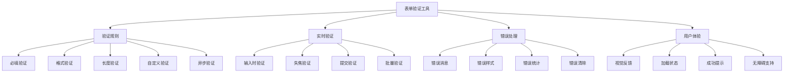

# 表单验证工具

## 项目概述

### 功能需求


### 技术栈
| 技术 | 版本 | 用途 |
|------|------|------|
| HTML5 | - | 表单结构 |
| CSS3 | - | 样式设计 |
| JavaScript | ES6+ | 核心逻辑 |
| RegExp | - | 正则验证 |
| Fetch API | - | 异步验证 |
| Web Components | - | 组件化 |

## 项目结构

### 文件组织
```
form-validator/
├── index.html              # 演示页面
├── css/
│   ├── validator.css      # 验证器样式
│   ├── themes.css         # 主题样式
│   └── animations.css     # 动画效果
├── js/
│   ├── validator.js       # 验证器主类
│   ├── rules.js           # 验证规则
│   ├── messages.js        # 错误消息
│   ├── async-validator.js # 异步验证
│   └── utils.js           # 工具函数
├── assets/
│   ├── icons/             # 图标文件
│   └── examples/          # 示例文件
└── README.md              # 项目说明
```

### 核心模块
```javascript
// 1. 验证器主类
class FormValidator {
    constructor(form, options = {}) {
        this.form = form;
        this.options = {
            validateOnInput: true,
            validateOnBlur: true,
            validateOnSubmit: true,
            showErrors: true,
            errorClass: 'error',
            successClass: 'success',
            errorContainer: 'after',
            debounceTime: 300,
            ...options
        };
        
        this.rules = new Map();
        this.errors = new Map();
        this.validators = new Map();
        this.asyncValidators = new Map();
        this.isValidating = false;
        
        this.init();
    }
    
    init() {
        this.bindEvents();
        this.loadDefaultRules();
        this.setupForm();
    }
    
    // 绑定事件
    bindEvents() {
        if (this.options.validateOnInput) {
            this.form.addEventListener('input', this.debounce(this.handleInput.bind(this), this.options.debounceTime));
        }
        
        if (this.options.validateOnBlur) {
            this.form.addEventListener('blur', this.handleBlur.bind(this), true);
        }
        
        if (this.options.validateOnSubmit) {
            this.form.addEventListener('submit', this.handleSubmit.bind(this));
        }
    }
    
    // 设置表单
    setupForm() {
        const fields = this.form.querySelectorAll('input, textarea, select');
        fields.forEach(field => {
            this.setupField(field);
        });
    }
    
    // 设置字段
    setupField(field) {
        const name = field.name;
        if (!name) return;
        
        // 创建错误容器
        if (this.options.showErrors) {
            this.createErrorContainer(field);
        }
        
        // 添加验证类
        field.classList.add('validator-field');
    }
    
    // 创建错误容器
    createErrorContainer(field) {
        const container = document.createElement('div');
        container.className = 'validator-error-container';
        container.setAttribute('aria-live', 'polite');
        
        if (this.options.errorContainer === 'after') {
            field.parentNode.insertBefore(container, field.nextSibling);
        } else if (this.options.errorContainer === 'before') {
            field.parentNode.insertBefore(container, field);
        }
        
        field.errorContainer = container;
    }
    
    // 添加验证规则
    addRule(fieldName, rule, message) {
        if (!this.rules.has(fieldName)) {
            this.rules.set(fieldName, []);
        }
        
        this.rules.get(fieldName).push({
            rule,
            message
        });
    }
    
    // 添加自定义验证器
    addValidator(name, validator) {
        this.validators.set(name, validator);
    }
    
    // 添加异步验证器
    addAsyncValidator(name, validator) {
        this.asyncValidators.set(name, validator);
    }
    
    // 验证字段
    async validateField(fieldName) {
        const field = this.form.querySelector(`[name="${fieldName}"]`);
        if (!field) return true;
        
        const value = field.value.trim();
        const fieldRules = this.rules.get(fieldName) || [];
        
        for (const { rule, message } of fieldRules) {
            const isValid = await this.executeRule(rule, value, field);
            if (!isValid) {
                this.setFieldError(fieldName, message);
                return false;
            }
        }
        
        this.clearFieldError(fieldName);
        return true;
    }
    
    // 执行验证规则
    async executeRule(rule, value, field) {
        if (typeof rule === 'function') {
            return await rule(value, field);
        }
        
        if (typeof rule === 'string') {
            const validator = this.validators.get(rule);
            if (validator) {
                return await validator(value, field);
            }
        }
        
        if (rule instanceof RegExp) {
            return rule.test(value);
        }
        
        return true;
    }
    
    // 设置字段错误
    setFieldError(fieldName, message) {
        const field = this.form.querySelector(`[name="${fieldName}"]`);
        if (!field) return;
        
        this.errors.set(fieldName, message);
        
        // 添加错误样式
        field.classList.add(this.options.errorClass);
        field.classList.remove(this.options.successClass);
        
        // 显示错误消息
        if (this.options.showErrors && field.errorContainer) {
            field.errorContainer.innerHTML = `<span class="error-message">${message}</span>`;
        }
        
        // 设置aria属性
        field.setAttribute('aria-invalid', 'true');
        field.setAttribute('aria-describedby', field.errorContainer?.id || '');
    }
    
    // 清除字段错误
    clearFieldError(fieldName) {
        const field = this.form.querySelector(`[name="${fieldName}"]`);
        if (!field) return;
        
        this.errors.delete(fieldName);
        
        // 移除错误样式
        field.classList.remove(this.options.errorClass);
        field.classList.add(this.options.successClass);
        
        // 清除错误消息
        if (field.errorContainer) {
            field.errorContainer.innerHTML = '';
        }
        
        // 清除aria属性
        field.removeAttribute('aria-invalid');
        field.removeAttribute('aria-describedby');
    }
    
    // 验证整个表单
    async validateForm() {
        this.isValidating = true;
        const fieldNames = Array.from(this.rules.keys());
        const results = await Promise.all(
            fieldNames.map(name => this.validateField(name))
        );
        
        this.isValidating = false;
        return results.every(result => result);
    }
    
    // 处理输入事件
    handleInput(e) {
        const field = e.target;
        if (field.name) {
            this.validateField(field.name);
        }
    }
    
    // 处理失焦事件
    handleBlur(e) {
        const field = e.target;
        if (field.name) {
            this.validateField(field.name);
        }
    }
    
    // 处理提交事件
    async handleSubmit(e) {
        e.preventDefault();
        
        const isValid = await this.validateForm();
        if (isValid) {
            this.form.dispatchEvent(new CustomEvent('form-valid', {
                detail: { form: this.form }
            }));
        } else {
            this.form.dispatchEvent(new CustomEvent('form-invalid', {
                detail: { 
                    form: this.form,
                    errors: Array.from(this.errors.entries())
                }
            }));
        }
    }
    
    // 获取错误信息
    getErrors() {
        return Array.from(this.errors.entries());
    }
    
    // 清除所有错误
    clearAllErrors() {
        this.errors.clear();
        const fields = this.form.querySelectorAll('.validator-field');
        fields.forEach(field => {
            field.classList.remove(this.options.errorClass);
            if (field.errorContainer) {
                field.errorContainer.innerHTML = '';
            }
        });
    }
    
    // 工具方法
    debounce(func, wait) {
        let timeout;
        return function executedFunction(...args) {
            const later = () => {
                clearTimeout(timeout);
                func(...args);
            };
            clearTimeout(timeout);
            timeout = setTimeout(later, wait);
        };
    }
    
    // 加载默认规则
    loadDefaultRules() {
        // 必填验证
        this.addValidator('required', (value) => value.length > 0);
        
        // 邮箱验证
        this.addValidator('email', (value) => {
            const emailRegex = /^[^\s@]+@[^\s@]+\.[^\s@]+$/;
            return emailRegex.test(value);
        });
        
        // 手机号验证
        this.addValidator('phone', (value) => {
            const phoneRegex = /^1[3-9]\d{9}$/;
            return phoneRegex.test(value);
        });
        
        // 长度验证
        this.addValidator('minLength', (value, field, min) => {
            return value.length >= min;
        });
        
        this.addValidator('maxLength', (value, field, max) => {
            return value.length <= max;
        });
        
        // 数字验证
        this.addValidator('number', (value) => !isNaN(value) && !isNaN(parseFloat(value)));
        
        // 整数验证
        this.addValidator('integer', (value) => Number.isInteger(Number(value)));
        
        // URL验证
        this.addValidator('url', (value) => {
            try {
                new URL(value);
                return true;
            } catch {
                return false;
            }
        });
    }
}

// 2. 验证规则
class ValidationRules {
    static required(value) {
        return value.trim().length > 0;
    }
    
    static email(value) {
        const emailRegex = /^[^\s@]+@[^\s@]+\.[^\s@]+$/;
        return emailRegex.test(value);
    }
    
    static phone(value) {
        const phoneRegex = /^1[3-9]\d{9}$/;
        return phoneRegex.test(value);
    }
    
    static minLength(value, min) {
        return value.length >= min;
    }
    
    static maxLength(value, max) {
        return value.length <= max;
    }
    
    static number(value) {
        return !isNaN(value) && !isNaN(parseFloat(value));
    }
    
    static integer(value) {
        return Number.isInteger(Number(value));
    }
    
    static url(value) {
        try {
            new URL(value);
            return true;
        } catch {
            return false;
        }
    }
    
    static password(value) {
        // 至少8位，包含大小写字母、数字和特殊字符
        const passwordRegex = /^(?=.*[a-z])(?=.*[A-Z])(?=.*\d)(?=.*[@$!%*?&])[A-Za-z\d@$!%*?&]{8,}$/;
        return passwordRegex.test(value);
    }
    
    static confirmPassword(value, field, originalField) {
        const originalValue = document.querySelector(`[name="${originalField}"]`).value;
        return value === originalValue;
    }
    
    static date(value) {
        const date = new Date(value);
        return date instanceof Date && !isNaN(date);
    }
    
    static age(value, min, max) {
        const age = parseInt(value);
        return age >= min && age <= max;
    }
}

// 3. 错误消息
class ErrorMessages {
    static messages = {
        required: '此字段为必填项',
        email: '请输入有效的邮箱地址',
        phone: '请输入有效的手机号码',
        minLength: '长度不能少于{min}个字符',
        maxLength: '长度不能超过{max}个字符',
        number: '请输入有效的数字',
        integer: '请输入整数',
        url: '请输入有效的URL地址',
        password: '密码必须包含大小写字母、数字和特殊字符，至少8位',
        confirmPassword: '两次输入的密码不一致',
        date: '请输入有效的日期',
        age: '年龄必须在{min}到{max}岁之间'
    };
    
    static getMessage(rule, params = {}) {
        let message = this.messages[rule] || '验证失败';
        
        // 替换参数
        Object.keys(params).forEach(key => {
            message = message.replace(`{${key}}`, params[key]);
        });
        
        return message;
    }
}

// 4. 异步验证器
class AsyncValidator {
    constructor(validator) {
        this.validator = validator;
    }
    
    // 用户名唯一性验证
    static async uniqueUsername(value) {
        try {
            const response = await fetch('/api/check-username', {
                method: 'POST',
                headers: {
                    'Content-Type': 'application/json'
                },
                body: JSON.stringify({ username: value })
            });
            
            const result = await response.json();
            return result.available;
        } catch (error) {
            console.error('Username validation error:', error);
            return true; // 网络错误时允许通过
        }
    }
    
    // 邮箱唯一性验证
    static async uniqueEmail(value) {
        try {
            const response = await fetch('/api/check-email', {
                method: 'POST',
                headers: {
                    'Content-Type': 'application/json'
                },
                body: JSON.stringify({ email: value })
            });
            
            const result = await response.json();
            return result.available;
        } catch (error) {
            console.error('Email validation error:', error);
            return true;
        }
    }
    
    // 手机号唯一性验证
    static async uniquePhone(value) {
        try {
            const response = await fetch('/api/check-phone', {
                method: 'POST',
                headers: {
                    'Content-Type': 'application/json'
                },
                body: JSON.stringify({ phone: value })
            });
            
            const result = await response.json();
            return result.available;
        } catch (error) {
            console.error('Phone validation error:', error);
            return true;
        }
    }
}
```

## CSS样式

### 验证器样式
```css
/* 基础样式 */
.validator-field {
    transition: all 0.3s ease;
}

.validator-field.error {
    border-color: #dc3545;
    box-shadow: 0 0 0 0.2rem rgba(220, 53, 69, 0.25);
}

.validator-field.success {
    border-color: #28a745;
    box-shadow: 0 0 0 0.2rem rgba(40, 167, 69, 0.25);
}

.validator-error-container {
    margin-top: 0.25rem;
    min-height: 1.25rem;
}

.error-message {
    color: #dc3545;
    font-size: 0.875rem;
    display: flex;
    align-items: center;
    gap: 0.25rem;
}

.error-message::before {
    content: '⚠️';
    font-size: 0.75rem;
}

.success-message {
    color: #28a745;
    font-size: 0.875rem;
    display: flex;
    align-items: center;
    gap: 0.25rem;
}

.success-message::before {
    content: '✅';
    font-size: 0.75rem;
}

/* 加载状态 */
.validator-field.validating {
    position: relative;
}

.validator-field.validating::after {
    content: '';
    position: absolute;
    right: 0.5rem;
    top: 50%;
    transform: translateY(-50%);
    width: 1rem;
    height: 1rem;
    border: 2px solid #f3f3f3;
    border-top: 2px solid #007bff;
    border-radius: 50%;
    animation: spin 1s linear infinite;
}

@keyframes spin {
    0% { transform: translateY(-50%) rotate(0deg); }
    100% { transform: translateY(-50%) rotate(360deg); }
}

/* 主题样式 */
.validator-theme-dark .validator-field.error {
    border-color: #ff6b6b;
    background-color: rgba(255, 107, 107, 0.1);
}

.validator-theme-dark .validator-field.success {
    border-color: #51cf66;
    background-color: rgba(81, 207, 102, 0.1);
}

.validator-theme-dark .error-message {
    color: #ff6b6b;
}

.validator-theme-dark .success-message {
    color: #51cf66;
}

/* 动画效果 */
.validator-field {
    transition: all 0.3s cubic-bezier(0.4, 0, 0.2, 1);
}

.error-message {
    animation: slideIn 0.3s ease-out;
}

@keyframes slideIn {
    from {
        opacity: 0;
        transform: translateY(-10px);
    }
    to {
        opacity: 1;
        transform: translateY(0);
    }
}

/* 响应式设计 */
@media (max-width: 768px) {
    .error-message {
        font-size: 0.8rem;
    }
    
    .success-message {
        font-size: 0.8rem;
    }
}
```

## HTML结构

### 演示页面
```html
<!DOCTYPE html>
<html lang="zh-CN">
<head>
    <meta charset="UTF-8">
    <meta name="viewport" content="width=device-width, initial-scale=1.0">
    <title>表单验证工具</title>
    <link rel="stylesheet" href="css/validator.css">
    <link rel="stylesheet" href="css/themes.css">
    <link rel="stylesheet" href="css/animations.css">
</head>
<body>
    <div class="container">
        <h1>表单验证工具演示</h1>
        
        <form id="demo-form" class="demo-form">
            <!-- 用户名 -->
            <div class="form-group">
                <label for="username">用户名 *</label>
                <input type="text" id="username" name="username" required>
            </div>
            
            <!-- 邮箱 -->
            <div class="form-group">
                <label for="email">邮箱 *</label>
                <input type="email" id="email" name="email" required>
            </div>
            
            <!-- 手机号 -->
            <div class="form-group">
                <label for="phone">手机号 *</label>
                <input type="tel" id="phone" name="phone" required>
            </div>
            
            <!-- 密码 -->
            <div class="form-group">
                <label for="password">密码 *</label>
                <input type="password" id="password" name="password" required>
            </div>
            
            <!-- 确认密码 -->
            <div class="form-group">
                <label for="confirmPassword">确认密码 *</label>
                <input type="password" id="confirmPassword" name="confirmPassword" required>
            </div>
            
            <!-- 年龄 -->
            <div class="form-group">
                <label for="age">年龄</label>
                <input type="number" id="age" name="age" min="18" max="100">
            </div>
            
            <!-- 网站 -->
            <div class="form-group">
                <label for="website">个人网站</label>
                <input type="url" id="website" name="website">
            </div>
            
            <!-- 提交按钮 -->
            <div class="form-actions">
                <button type="submit" class="btn-primary">提交</button>
                <button type="button" class="btn-secondary" id="clear-btn">清除</button>
            </div>
        </form>
        
        <!-- 验证结果 -->
        <div id="validation-result" class="validation-result"></div>
    </div>
    
    <script src="js/validator.js"></script>
    <script src="js/rules.js"></script>
    <script src="js/messages.js"></script>
    <script src="js/async-validator.js"></script>
    <script src="js/utils.js"></script>
    <script>
        // 初始化验证器
        const validator = new FormValidator(document.getElementById('demo-form'), {
            validateOnInput: true,
            validateOnBlur: true,
            validateOnSubmit: true,
            showErrors: true,
            debounceTime: 300
        });
        
        // 添加验证规则
        validator.addRule('username', 'required', '用户名不能为空');
        validator.addRule('username', 'minLength', '用户名至少3个字符');
        validator.addRule('username', 'maxLength', '用户名不能超过20个字符');
        
        validator.addRule('email', 'required', '邮箱不能为空');
        validator.addRule('email', 'email', '请输入有效的邮箱地址');
        
        validator.addRule('phone', 'required', '手机号不能为空');
        validator.addRule('phone', 'phone', '请输入有效的手机号码');
        
        validator.addRule('password', 'required', '密码不能为空');
        validator.addRule('password', 'password', '密码必须包含大小写字母、数字和特殊字符，至少8位');
        
        validator.addRule('confirmPassword', 'required', '确认密码不能为空');
        validator.addRule('confirmPassword', 'confirmPassword', '两次输入的密码不一致');
        
        validator.addRule('age', 'age', '年龄必须在18到100岁之间');
        validator.addRule('website', 'url', '请输入有效的URL地址');
        
        // 添加异步验证
        validator.addAsyncValidator('uniqueUsername', AsyncValidator.uniqueUsername);
        validator.addAsyncValidator('uniqueEmail', AsyncValidator.uniqueEmail);
        validator.addAsyncValidator('uniquePhone', AsyncValidator.uniquePhone);
        
        // 监听表单事件
        document.getElementById('demo-form').addEventListener('form-valid', (e) => {
            document.getElementById('validation-result').innerHTML = 
                '<div class="success-message">表单验证通过！</div>';
        });
        
        document.getElementById('demo-form').addEventListener('form-invalid', (e) => {
            const errors = e.detail.errors;
            const errorHtml = errors.map(([field, message]) => 
                `<div class="error-message">${field}: ${message}</div>`
            ).join('');
            
            document.getElementById('validation-result').innerHTML = 
                `<div class="error-message">表单验证失败：</div>${errorHtml}`;
        });
        
        // 清除按钮
        document.getElementById('clear-btn').addEventListener('click', () => {
            validator.clearAllErrors();
            document.getElementById('demo-form').reset();
            document.getElementById('validation-result').innerHTML = '';
        });
    </script>
</body>
</html>
```

## 功能特性

### 核心功能
1. **实时验证**: 输入时、失焦时、提交时验证
2. **多种规则**: 必填、格式、长度、自定义验证
3. **异步验证**: 支持服务器端验证
4. **错误处理**: 清晰的错误消息和样式
5. **批量验证**: 一次性验证整个表单

### 高级功能
1. **防抖处理**: 避免频繁验证
2. **无障碍支持**: 屏幕阅读器友好
3. **主题支持**: 多种视觉主题
4. **动画效果**: 平滑的过渡动画
5. **响应式设计**: 适配各种设备

### 用户体验
1. **视觉反馈**: 实时显示验证状态
2. **加载状态**: 异步验证时的加载指示
3. **成功提示**: 验证通过时的反馈
4. **错误统计**: 显示错误数量和详情
5. **一键清除**: 快速清除所有错误

## 相关链接
- [[05-实战项目/01-基础项目/01-计算器应用]] - 计算器应用
- [[05-实战项目/01-基础项目/02-待办事项列表]] - 待办事项列表
- [[05-实战项目/01-基础项目/03-图片轮播组件]] - 图片轮播组件
- [[05-实战项目/01-基础项目/05-项目代码库-基础项目]] - 基础项目代码库
