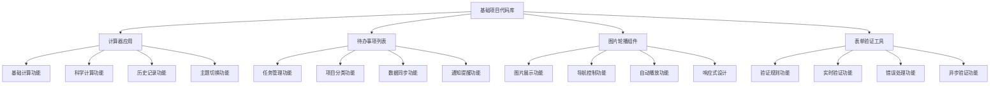

# 项目代码库-基础项目

## 项目概述

### 代码库结构


### 技术栈
| 技术 | 版本 | 用途 |
|------|------|------|
| HTML5 | - | 结构布局 |
| CSS3 | - | 样式设计 |
| JavaScript | ES6+ | 核心逻辑 |
| IndexedDB | - | 本地存储 |
| Web Workers | - | 后台处理 |
| Service Worker | - | 离线支持 |
| Touch Events | - | 触摸支持 |
| Intersection Observer | - | 懒加载 |
| Web Animations API | - | 动画控制 |
| RegExp | - | 正则验证 |
| Fetch API | - | 异步验证 |
| Web Components | - | 组件化 |

## 项目结构

### 文件组织
```
basic-projects/
├── 01-calculator/              # 计算器应用
│   ├── index.html
│   ├── css/
│   │   ├── style.css
│   │   ├── themes.css
│   │   └── responsive.css
│   ├── js/
│   │   ├── app.js
│   │   ├── calculator.js
│   │   ├── history.js
│   │   └── theme.js
│   ├── assets/
│   │   └── icons/
│   └── README.md
│
├── 02-todo-app/                # 待办事项列表
│   ├── index.html
│   ├── css/
│   │   ├── style.css
│   │   ├── components.css
│   │   └── themes.css
│   ├── js/
│   │   ├── app.js
│   │   ├── models/
│   │   │   ├── Task.js
│   │   │   ├── Project.js
│   │   │   └── User.js
│   │   ├── services/
│   │   │   ├── StorageService.js
│   │   │   ├── NotificationService.js
│   │   │   └── SyncService.js
│   │   ├── components/
│   │   │   ├── TaskList.js
│   │   │   ├── TaskForm.js
│   │   │   ├── ProjectPanel.js
│   │   │   └── Statistics.js
│   │   └── utils/
│   │       ├── DateUtils.js
│   │       ├── Validation.js
│   │       └── Helpers.js
│   ├── assets/
│   │   ├── icons/
│   │   └── sounds/
│   ├── manifest.json
│   ├── sw.js
│   └── README.md
│
├── 03-image-carousel/          # 图片轮播组件
│   ├── index.html
│   ├── css/
│   │   ├── carousel.css
│   │   ├── themes.css
│   │   └── responsive.css
│   ├── js/
│   │   ├── carousel.js
│   │   ├── touch-handler.js
│   │   ├── lazy-loader.js
│   │   ├── animation-controller.js
│   │   └── utils.js
│   ├── assets/
│   │   ├── images/
│   │   └── icons/
│   └── README.md
│
├── 04-form-validator/          # 表单验证工具
│   ├── index.html
│   ├── css/
│   │   ├── validator.css
│   │   ├── themes.css
│   │   └── animations.css
│   ├── js/
│   │   ├── validator.js
│   │   ├── rules.js
│   │   ├── messages.js
│   │   ├── async-validator.js
│   │   └── utils.js
│   ├── assets/
│   │   ├── icons/
│   │   └── examples/
│   └── README.md
│
├── shared/                     # 共享资源
│   ├── css/
│   │   ├── common.css
│   │   ├── reset.css
│   │   └── variables.css
│   ├── js/
│   │   ├── utils.js
│   │   ├── constants.js
│   │   └── helpers.js
│   └── assets/
│       ├── fonts/
│       ├── icons/
│       └── images/
│
├── docs/                       # 文档
│   ├── api/
│   ├── guides/
│   └── examples/
│
├── tests/                      # 测试
│   ├── unit/
│   ├── integration/
│   └── e2e/
│
├── build/                      # 构建脚本
│   ├── webpack.config.js
│   ├── rollup.config.js
│   └── gulpfile.js
│
├── package.json
├── README.md
└── LICENSE
```

### 共享工具类
```javascript
// 1. 通用工具函数
class CommonUtils {
    // 防抖函数
    static debounce(func, wait) {
        let timeout;
        return function executedFunction(...args) {
            const later = () => {
                clearTimeout(timeout);
                func(...args);
            };
            clearTimeout(timeout);
            timeout = setTimeout(later, wait);
        };
    }
    
    // 节流函数
    static throttle(func, limit) {
        let inThrottle;
        return function() {
            const args = arguments;
            const context = this;
            if (!inThrottle) {
                func.apply(context, args);
                inThrottle = true;
                setTimeout(() => inThrottle = false, limit);
            }
        };
    }
    
    // 深拷贝
    static deepClone(obj) {
        if (obj === null || typeof obj !== 'object') return obj;
        if (obj instanceof Date) return new Date(obj.getTime());
        if (obj instanceof Array) return obj.map(item => this.deepClone(item));
        if (typeof obj === 'object') {
            const clonedObj = {};
            for (const key in obj) {
                if (obj.hasOwnProperty(key)) {
                    clonedObj[key] = this.deepClone(obj[key]);
                }
            }
            return clonedObj;
        }
    }
    
    // 生成唯一ID
    static generateId() {
        return Date.now().toString(36) + Math.random().toString(36).substr(2);
    }
    
    // 格式化日期
    static formatDate(date, format = 'YYYY-MM-DD') {
        const d = new Date(date);
        const year = d.getFullYear();
        const month = String(d.getMonth() + 1).padStart(2, '0');
        const day = String(d.getDate()).padStart(2, '0');
        const hours = String(d.getHours()).padStart(2, '0');
        const minutes = String(d.getMinutes()).padStart(2, '0');
        const seconds = String(d.getSeconds()).padStart(2, '0');
        
        return format
            .replace('YYYY', year)
            .replace('MM', month)
            .replace('DD', day)
            .replace('HH', hours)
            .replace('mm', minutes)
            .replace('ss', seconds);
    }
    
    // 本地存储封装
    static storage = {
        set(key, value) {
            try {
                localStorage.setItem(key, JSON.stringify(value));
                return true;
            } catch (error) {
                console.error('Storage set error:', error);
                return false;
            }
        },
        
        get(key, defaultValue = null) {
            try {
                const item = localStorage.getItem(key);
                return item ? JSON.parse(item) : defaultValue;
            } catch (error) {
                console.error('Storage get error:', error);
                return defaultValue;
            }
        },
        
        remove(key) {
            try {
                localStorage.removeItem(key);
                return true;
            } catch (error) {
                console.error('Storage remove error:', error);
                return false;
            }
        },
        
        clear() {
            try {
                localStorage.clear();
                return true;
            } catch (error) {
                console.error('Storage clear error:', error);
                return false;
            }
        }
    };
    
    // 事件总线
    static eventBus = {
        events: new Map(),
        
        on(event, callback) {
            if (!this.events.has(event)) {
                this.events.set(event, []);
            }
            this.events.get(event).push(callback);
        },
        
        off(event, callback) {
            if (this.events.has(event)) {
                const callbacks = this.events.get(event);
                const index = callbacks.indexOf(callback);
                if (index > -1) {
                    callbacks.splice(index, 1);
                }
            }
        },
        
        emit(event, data) {
            if (this.events.has(event)) {
                this.events.get(event).forEach(callback => {
                    try {
                        callback(data);
                    } catch (error) {
                        console.error('Event callback error:', error);
                    }
                });
            }
        }
    };
}

// 2. 常量定义
class Constants {
    // 主题常量
    static THEMES = {
        LIGHT: 'light',
        DARK: 'dark',
        AUTO: 'auto'
    };
    
    // 存储键名
    static STORAGE_KEYS = {
        THEME: 'app_theme',
        SETTINGS: 'app_settings',
        USER_PREFERENCES: 'user_preferences'
    };
    
    // 事件名称
    static EVENTS = {
        THEME_CHANGED: 'theme_changed',
        SETTINGS_UPDATED: 'settings_updated',
        USER_ACTION: 'user_action'
    };
    
    // API端点
    static API_ENDPOINTS = {
        BASE_URL: 'https://api.example.com',
        AUTH: '/auth',
        USERS: '/users',
        DATA: '/data'
    };
    
    // 错误代码
    static ERROR_CODES = {
        NETWORK_ERROR: 'NETWORK_ERROR',
        VALIDATION_ERROR: 'VALIDATION_ERROR',
        AUTH_ERROR: 'AUTH_ERROR',
        UNKNOWN_ERROR: 'UNKNOWN_ERROR'
    };
}

// 3. 错误处理类
class ErrorHandler {
    static handle(error, context = '') {
        console.error(`Error in ${context}:`, error);
        
        // 根据错误类型进行不同处理
        if (error instanceof TypeError) {
            this.handleTypeError(error, context);
        } else if (error instanceof ReferenceError) {
            this.handleReferenceError(error, context);
        } else if (error instanceof NetworkError) {
            this.handleNetworkError(error, context);
        } else {
            this.handleGenericError(error, context);
        }
    }
    
    static handleTypeError(error, context) {
        console.error('Type Error:', error.message);
        // 可以发送错误报告到服务器
    }
    
    static handleReferenceError(error, context) {
        console.error('Reference Error:', error.message);
        // 可以发送错误报告到服务器
    }
    
    static handleNetworkError(error, context) {
        console.error('Network Error:', error.message);
        // 显示网络错误提示
    }
    
    static handleGenericError(error, context) {
        console.error('Generic Error:', error.message);
        // 显示通用错误提示
    }
}

// 4. 性能监控类
class PerformanceMonitor {
    static marks = new Map();
    
    static startMark(name) {
        this.marks.set(name, performance.now());
    }
    
    static endMark(name) {
        const startTime = this.marks.get(name);
        if (startTime) {
            const duration = performance.now() - startTime;
            console.log(`${name} took ${duration.toFixed(2)}ms`);
            this.marks.delete(name);
            return duration;
        }
        return 0;
    }
    
    static measure(name, func) {
        this.startMark(name);
        const result = func();
        this.endMark(name);
        return result;
    }
    
    static async measureAsync(name, asyncFunc) {
        this.startMark(name);
        const result = await asyncFunc();
        this.endMark(name);
        return result;
    }
}

// 5. 配置管理类
class ConfigManager {
    static config = {
        // 默认配置
        theme: Constants.THEMES.LIGHT,
        language: 'zh-CN',
        autoSave: true,
        notifications: true,
        animations: true
    };
    
    static load() {
        const saved = CommonUtils.storage.get(Constants.STORAGE_KEYS.SETTINGS);
        if (saved) {
            this.config = { ...this.config, ...saved };
        }
        return this.config;
    }
    
    static save() {
        return CommonUtils.storage.set(Constants.STORAGE_KEYS.SETTINGS, this.config);
    }
    
    static get(key) {
        return this.config[key];
    }
    
    static set(key, value) {
        this.config[key] = value;
        this.save();
        CommonUtils.eventBus.emit(Constants.EVENTS.SETTINGS_UPDATED, { key, value });
    }
    
    static reset() {
        this.config = {
            theme: Constants.THEMES.LIGHT,
            language: 'zh-CN',
            autoSave: true,
            notifications: true,
            animations: true
        };
        this.save();
    }
}
```

## 构建配置

### Webpack配置
```javascript
// webpack.config.js
const path = require('path');
const HtmlWebpackPlugin = require('html-webpack-plugin');
const MiniCssExtractPlugin = require('mini-css-extract-plugin');
const { CleanWebpackPlugin } = require('clean-webpack-plugin');

module.exports = {
    entry: {
        calculator: './01-calculator/js/app.js',
        todo: './02-todo-app/js/app.js',
        carousel: './03-image-carousel/js/carousel.js',
        validator: './04-form-validator/js/validator.js'
    },
    
    output: {
        path: path.resolve(__dirname, 'dist'),
        filename: '[name]/js/[name].bundle.js',
        clean: true
    },
    
    module: {
        rules: [
            {
                test: /\.js$/,
                exclude: /node_modules/,
                use: {
                    loader: 'babel-loader',
                    options: {
                        presets: ['@babel/preset-env']
                    }
                }
            },
            {
                test: /\.css$/,
                use: [MiniCssExtractPlugin.loader, 'css-loader']
            },
            {
                test: /\.(png|svg|jpg|jpeg|gif)$/i,
                type: 'asset/resource'
            }
        ]
    },
    
    plugins: [
        new CleanWebpackPlugin(),
        new MiniCssExtractPlugin({
            filename: '[name]/css/[name].bundle.css'
        }),
        new HtmlWebpackPlugin({
            template: './01-calculator/index.html',
            filename: 'calculator/index.html',
            chunks: ['calculator']
        }),
        new HtmlWebpackPlugin({
            template: './02-todo-app/index.html',
            filename: 'todo/index.html',
            chunks: ['todo']
        }),
        new HtmlWebpackPlugin({
            template: './03-image-carousel/index.html',
            filename: 'carousel/index.html',
            chunks: ['carousel']
        }),
        new HtmlWebpackPlugin({
            template: './04-form-validator/index.html',
            filename: 'validator/index.html',
            chunks: ['validator']
        })
    ],
    
    devServer: {
        static: {
            directory: path.join(__dirname, 'dist')
        },
        compress: true,
        port: 9000,
        open: true
    }
};
```

### Package.json
```json
{
    "name": "basic-projects",
    "version": "1.0.0",
    "description": "基础项目代码库",
    "main": "index.js",
    "scripts": {
        "dev": "webpack serve --mode development",
        "build": "webpack --mode production",
        "test": "jest",
        "lint": "eslint .",
        "format": "prettier --write ."
    },
    "keywords": [
        "javascript",
        "calculator",
        "todo",
        "carousel",
        "validator"
    ],
    "author": "Your Name",
    "license": "MIT",
    "devDependencies": {
        "@babel/core": "^7.22.0",
        "@babel/preset-env": "^7.22.0",
        "babel-loader": "^9.1.0",
        "clean-webpack-plugin": "^4.0.0",
        "css-loader": "^6.8.0",
        "eslint": "^8.42.0",
        "html-webpack-plugin": "^5.5.0",
        "jest": "^29.5.0",
        "mini-css-extract-plugin": "^2.7.0",
        "prettier": "^2.8.0",
        "webpack": "^5.88.0",
        "webpack-cli": "^5.1.0",
        "webpack-dev-server": "^4.15.0"
    },
    "dependencies": {
        "lodash": "^4.17.21"
    }
}
```

## 测试配置

### Jest配置
```javascript
// jest.config.js
module.exports = {
    testEnvironment: 'jsdom',
    setupFilesAfterEnv: ['<rootDir>/tests/setup.js'],
    testMatch: [
        '<rootDir>/tests/**/*.test.js'
    ],
    collectCoverageFrom: [
        '**/*.js',
        '!**/node_modules/**',
        '!**/dist/**',
        '!**/tests/**'
    ],
    coverageDirectory: 'coverage',
    coverageReporters: ['text', 'lcov', 'html']
};
```

### 测试示例
```javascript
// tests/unit/calculator.test.js
import { Calculator } from '../../01-calculator/js/calculator.js';

describe('Calculator', () => {
    let calculator;
    
    beforeEach(() => {
        calculator = new Calculator();
    });
    
    test('should add two numbers correctly', () => {
        expect(calculator.add(2, 3)).toBe(5);
    });
    
    test('should subtract two numbers correctly', () => {
        expect(calculator.subtract(5, 3)).toBe(2);
    });
    
    test('should multiply two numbers correctly', () => {
        expect(calculator.multiply(4, 3)).toBe(12);
    });
    
    test('should divide two numbers correctly', () => {
        expect(calculator.divide(10, 2)).toBe(5);
    });
    
    test('should handle division by zero', () => {
        expect(() => calculator.divide(10, 0)).toThrow('Division by zero');
    });
});
```

## 部署配置

### GitHub Actions
```yaml
# .github/workflows/deploy.yml
name: Deploy to GitHub Pages

on:
    push:
        branches: [main]
    pull_request:
        branches: [main]

jobs:
    build-and-deploy:
        runs-on: ubuntu-latest
        
        steps:
            - name: Checkout
              uses: actions/checkout@v3
              
            - name: Setup Node.js
              uses: actions/setup-node@v3
              with:
                  node-version: '18'
                  cache: 'npm'
                  
            - name: Install dependencies
              run: npm ci
              
            - name: Run tests
              run: npm test
              
            - name: Build
              run: npm run build
              
            - name: Deploy to GitHub Pages
              uses: peaceiris/actions-gh-pages@v3
              if: github.ref == 'refs/heads/main'
              with:
                  github_token: ${{ secrets.GITHUB_TOKEN }}
                  publish_dir: ./dist
```

## 文档结构

### API文档
```markdown
# API文档

## 计算器应用

### Calculator类
- `add(a, b)`: 加法运算
- `subtract(a, b)`: 减法运算
- `multiply(a, b)`: 乘法运算
- `divide(a, b)`: 除法运算

## 待办事项应用

### Task类
- `constructor(data)`: 创建任务实例
- `update(updates)`: 更新任务
- `toggle()`: 切换完成状态

### StorageService类
- `saveTask(task)`: 保存任务
- `getTask(id)`: 获取任务
- `getAllTasks()`: 获取所有任务
```

## 相关链接
- [[05-实战项目/01-基础项目/01-计算器应用]] - 计算器应用
- [[05-实战项目/01-基础项目/02-待办事项列表]] - 待办事项列表
- [[05-实战项目/01-基础项目/03-图片轮播组件]] - 图片轮播组件
- [[05-实战项目/01-基础项目/04-表单验证工具]] - 表单验证工具
