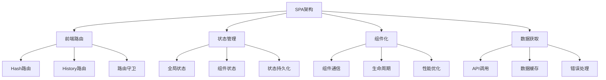

# 单页应用(SPA)

## SPA基础概念

### SPA架构原理


### SPA vs 传统多页应用
| 特性 | SPA | 传统多页应用 |
|------|-----|-------------|
| 页面加载 | 首次加载后快速切换 | 每次页面切换都重新加载 |
| 用户体验 | 流畅，无页面刷新 | 页面刷新，体验中断 |
| SEO优化 | 需要特殊处理 | 天然支持 |
| 开发复杂度 | 较高 | 较低 |
| 性能优化 | 需要代码分割 | 天然分离 |
| 浏览器兼容 | 需要现代浏览器 | 兼容性更好 |

## 路由系统实现

### 基础路由实现
```javascript
// 1. 简单路由系统
class SimpleRouter {
  constructor() {
    this.routes = new Map();
    this.currentRoute = null;
    this.init();
  }
  
  // 初始化路由
  init() {
    // 监听浏览器前进后退
    window.addEventListener('popstate', (e) => {
      this.handleRouteChange();
    });
    
    // 监听hash变化
    window.addEventListener('hashchange', (e) => {
      this.handleRouteChange();
    });
    
    // 初始路由处理
    this.handleRouteChange();
  }
  
  // 注册路由
  route(path, handler) {
    this.routes.set(path, handler);
    return this;
  }
  
  // 处理路由变化
  handleRouteChange() {
    const path = this.getCurrentPath();
    const handler = this.routes.get(path);
    
    if (handler) {
      this.currentRoute = path;
      handler();
    } else {
      // 404处理
      this.handle404();
    }
  }
  
  // 获取当前路径
  getCurrentPath() {
    return window.location.hash.slice(1) || '/';
  }
  
  // 导航到指定路径
  navigate(path) {
    window.location.hash = path;
  }
  
  // 404处理
  handle404() {
    console.log('页面未找到');
    document.body.innerHTML = '<h1>404 - 页面未找到</h1>';
  }
}

// 2. 使用示例
const router = new SimpleRouter();

// 注册路由
router
  .route('/', () => {
    document.body.innerHTML = '<h1>首页</h1><p>欢迎来到SPA应用</p>';
  })
  .route('/about', () => {
    document.body.innerHTML = '<h1>关于我们</h1><p>这是一个SPA应用示例</p>';
  })
  .route('/contact', () => {
    document.body.innerHTML = '<h1>联系我们</h1><p>邮箱: contact@example.com</p>';
  });

// 导航
document.addEventListener('click', (e) => {
  if (e.target.matches('[data-route]')) {
    e.preventDefault();
    const path = e.target.getAttribute('data-route');
    router.navigate(path);
  }
});
```

### 高级路由系统
```javascript
// 1. 高级路由系统
class AdvancedRouter {
  constructor() {
    this.routes = [];
    this.currentRoute = null;
    this.beforeEachHooks = [];
    this.afterEachHooks = [];
    this.init();
  }
  
  // 初始化
  init() {
    window.addEventListener('popstate', () => this.handleRouteChange());
    window.addEventListener('hashchange', () => this.handleRouteChange());
    this.handleRouteChange();
  }
  
  // 注册路由
  addRoute(path, component, meta = {}) {
    const route = {
      path,
      component,
      meta,
      regex: this.pathToRegex(path),
      params: this.extractParams(path)
    };
    
    this.routes.push(route);
    return this;
  }
  
  // 路径转正则
  pathToRegex(path) {
    const paramNames = [];
    const regexPath = path.replace(/:([^/]+)/g, (match, paramName) => {
      paramNames.push(paramName);
      return '([^/]+)';
    });
    
    return new RegExp(`^${regexPath}$`);
  }
  
  // 提取参数名
  extractParams(path) {
    const params = [];
    path.replace(/:([^/]+)/g, (match, paramName) => {
      params.push(paramName);
    });
    return params;
  }
  
  // 路由守卫
  beforeEach(guard) {
    this.beforeEachHooks.push(guard);
    return this;
  }
  
  afterEach(guard) {
    this.afterEachHooks.push(guard);
    return this;
  }
  
  // 处理路由变化
  async handleRouteChange() {
    const path = this.getCurrentPath();
    const route = this.matchRoute(path);
    
    if (route) {
      // 执行前置守卫
      for (const guard of this.beforeEachHooks) {
        const result = await guard(route, this.currentRoute);
        if (result === false) {
          return;
        }
      }
      
      // 更新当前路由
      this.currentRoute = route;
      
      // 渲染组件
      await this.renderComponent(route);
      
      // 执行后置守卫
      for (const guard of this.afterEachHooks) {
        await guard(route, this.currentRoute);
      }
    } else {
      this.handle404();
    }
  }
  
  // 匹配路由
  matchRoute(path) {
    for (const route of this.routes) {
      const match = path.match(route.regex);
      if (match) {
        const params = {};
        route.params.forEach((paramName, index) => {
          params[paramName] = match[index + 1];
        });
        
        return {
          ...route,
          params,
          query: this.parseQuery(window.location.search)
        };
      }
    }
    return null;
  }
  
  // 解析查询参数
  parseQuery(search) {
    const params = {};
    if (search) {
      search.slice(1).split('&').forEach(param => {
        const [key, value] = param.split('=');
        params[decodeURIComponent(key)] = decodeURIComponent(value || '');
      });
    }
    return params;
  }
  
  // 渲染组件
  async renderComponent(route) {
    const container = document.getElementById('app');
    if (container && route.component) {
      if (typeof route.component === 'function') {
        container.innerHTML = await route.component(route);
      } else {
        container.innerHTML = route.component;
      }
    }
  }
  
  // 导航
  push(path) {
    window.history.pushState(null, '', `#${path}`);
    this.handleRouteChange();
  }
  
  replace(path) {
    window.history.replaceState(null, '', `#${path}`);
    this.handleRouteChange();
  }
  
  // 获取当前路径
  getCurrentPath() {
    return window.location.hash.slice(1) || '/';
  }
  
  // 404处理
  handle404() {
    const container = document.getElementById('app');
    if (container) {
      container.innerHTML = '<h1>404 - 页面未找到</h1>';
    }
  }
}

// 2. 使用示例
const router = new AdvancedRouter();

// 路由守卫
router.beforeEach((to, from) => {
  console.log(`从 ${from?.path} 导航到 ${to.path}`);
  return true;
});

router.afterEach((to, from) => {
  console.log(`导航完成: ${to.path}`);
});

// 注册路由
router
  .addRoute('/', () => '<h1>首页</h1><p>欢迎来到SPA应用</p>')
  .addRoute('/about', () => '<h1>关于我们</h1><p>这是一个SPA应用示例</p>')
  .addRoute('/user/:id', (route) => `<h1>用户详情</h1><p>用户ID: ${route.params.id}</p>`)
  .addRoute('/posts/:id/comments/:commentId', (route) => 
    `<h1>评论详情</h1><p>文章ID: ${route.params.id}, 评论ID: ${route.params.commentId}</p>`
  );

// 导航
document.addEventListener('click', (e) => {
  if (e.target.matches('[data-route]')) {
    e.preventDefault();
    const path = e.target.getAttribute('data-route');
    router.push(path);
  }
});
```

## 状态管理

### 简单状态管理
```javascript
// 1. 简单状态管理器
class SimpleStore {
  constructor(initialState = {}) {
    this.state = { ...initialState };
    this.listeners = [];
  }
  
  // 获取状态
  getState() {
    return { ...this.state };
  }
  
  // 设置状态
  setState(newState) {
    const prevState = { ...this.state };
    this.state = { ...this.state, ...newState };
    
    // 通知监听器
    this.listeners.forEach(listener => {
      listener(this.state, prevState);
    });
  }
  
  // 订阅状态变化
  subscribe(listener) {
    this.listeners.push(listener);
    
    // 返回取消订阅函数
    return () => {
      const index = this.listeners.indexOf(listener);
      if (index > -1) {
        this.listeners.splice(index, 1);
      }
    };
  }
  
  // 重置状态
  reset() {
    this.setState({});
  }
}

// 2. 使用示例
const store = new SimpleStore({
  user: null,
  posts: [],
  loading: false
});

// 订阅状态变化
const unsubscribe = store.subscribe((newState, prevState) => {
  console.log('状态变化:', newState);
  
  // 更新UI
  updateUI(newState);
});

// 更新状态
store.setState({ user: { name: 'John', email: 'john@example.com' } });
store.setState({ loading: true });

// 取消订阅
unsubscribe();
```

### 高级状态管理
```javascript
// 1. 高级状态管理器
class AdvancedStore {
  constructor(initialState = {}) {
    this.state = { ...initialState };
    this.listeners = [];
    this.middlewares = [];
    this.reducers = new Map();
  }
  
  // 添加中间件
  use(middleware) {
    this.middlewares.push(middleware);
    return this;
  }
  
  // 注册reducer
  registerReducer(actionType, reducer) {
    this.reducers.set(actionType, reducer);
    return this;
  }
  
  // 分发动作
  dispatch(action) {
    let newState = this.state;
    
    // 应用中间件
    for (const middleware of this.middlewares) {
      newState = middleware(newState, action) || newState;
    }
    
    // 应用reducer
    const reducer = this.reducers.get(action.type);
    if (reducer) {
      newState = reducer(newState, action);
    }
    
    // 更新状态
    if (newState !== this.state) {
      const prevState = this.state;
      this.state = newState;
      
      // 通知监听器
      this.listeners.forEach(listener => {
        listener(this.state, prevState, action);
      });
    }
  }
  
  // 获取状态
  getState() {
    return { ...this.state };
  }
  
  // 订阅状态变化
  subscribe(listener) {
    this.listeners.push(listener);
    
    return () => {
      const index = this.listeners.indexOf(listener);
      if (index > -1) {
        this.listeners.splice(index, 1);
      }
    };
  }
  
  // 选择器
  select(selector) {
    return selector(this.state);
  }
}

// 2. 中间件示例
const loggerMiddleware = (state, action) => {
  console.log('动作:', action);
  console.log('当前状态:', state);
  return null; // 不修改状态
};

const thunkMiddleware = (state, action) => {
  if (typeof action === 'function') {
    return action(store.dispatch, store.getState);
  }
  return null;
};

// 3. Reducer示例
const userReducer = (state, action) => {
  switch (action.type) {
    case 'SET_USER':
      return { ...state, user: action.payload };
    case 'CLEAR_USER':
      return { ...state, user: null };
    default:
      return state;
  }
};

const postsReducer = (state, action) => {
  switch (action.type) {
    case 'SET_POSTS':
      return { ...state, posts: action.payload };
    case 'ADD_POST':
      return { ...state, posts: [...state.posts, action.payload] };
    case 'UPDATE_POST':
      return {
        ...state,
        posts: state.posts.map(post =>
          post.id === action.payload.id ? action.payload : post
        )
      };
    case 'DELETE_POST':
      return {
        ...state,
        posts: state.posts.filter(post => post.id !== action.payload)
      };
    default:
      return state;
  }
};

// 4. 使用示例
const store = new AdvancedStore({
  user: null,
  posts: [],
  loading: false
});

// 添加中间件
store.use(loggerMiddleware);
store.use(thunkMiddleware);

// 注册reducer
store.registerReducer('SET_USER', userReducer);
store.registerReducer('CLEAR_USER', userReducer);
store.registerReducer('SET_POSTS', postsReducer);
store.registerReducer('ADD_POST', postsReducer);
store.registerReducer('UPDATE_POST', postsReducer);
store.registerReducer('DELETE_POST', postsReducer);

// 订阅状态变化
store.subscribe((newState, prevState, action) => {
  console.log(`状态更新: ${action.type}`, newState);
  updateUI(newState);
});

// 分发动作
store.dispatch({ type: 'SET_USER', payload: { name: 'John', email: 'john@example.com' } });
store.dispatch({ type: 'SET_POSTS', payload: [
  { id: 1, title: '文章1', content: '内容1' },
  { id: 2, title: '文章2', content: '内容2' }
]});

// 异步动作
const fetchPosts = () => (dispatch, getState) => {
  dispatch({ type: 'SET_LOADING', payload: true });
  
  fetch('/api/posts')
    .then(response => response.json())
    .then(posts => {
      dispatch({ type: 'SET_POSTS', payload: posts });
      dispatch({ type: 'SET_LOADING', payload: false });
    })
    .catch(error => {
      console.error('获取文章失败:', error);
      dispatch({ type: 'SET_LOADING', payload: false });
    });
};

store.dispatch(fetchPosts());
```

## 组件系统

### 基础组件系统
```javascript
// 1. 基础组件类
class Component {
  constructor(props = {}) {
    this.props = props;
    this.state = {};
    this.element = null;
    this.children = [];
  }
  
  // 设置状态
  setState(newState) {
    const prevState = { ...this.state };
    this.state = { ...this.state, ...newState };
    this.render();
  }
  
  // 渲染方法
  render() {
    // 子类实现
    return '';
  }
  
  // 挂载到DOM
  mount(container) {
    this.element = document.createElement('div');
    this.element.innerHTML = this.render();
    container.appendChild(this.element);
    
    // 绑定事件
    this.bindEvents();
    
    // 调用生命周期方法
    this.componentDidMount();
  }
  
  // 卸载组件
  unmount() {
    if (this.element && this.element.parentNode) {
      this.element.parentNode.removeChild(this.element);
    }
    
    // 调用生命周期方法
    this.componentWillUnmount();
  }
  
  // 绑定事件
  bindEvents() {
    // 子类实现
  }
  
  // 生命周期方法
  componentDidMount() {
    // 子类实现
  }
  
  componentWillUnmount() {
    // 子类实现
  }
}

// 2. 使用示例
class Counter extends Component {
  constructor(props) {
    super(props);
    this.state = { count: 0 };
  }
  
  render() {
    return `
      <div class="counter">
        <h2>计数器</h2>
        <p>当前计数: ${this.state.count}</p>
        <button id="increment">增加</button>
        <button id="decrement">减少</button>
        <button id="reset">重置</button>
      </div>
    `;
  }
  
  bindEvents() {
    const incrementBtn = this.element.querySelector('#increment');
    const decrementBtn = this.element.querySelector('#decrement');
    const resetBtn = this.element.querySelector('#reset');
    
    incrementBtn.addEventListener('click', () => {
      this.setState({ count: this.state.count + 1 });
    });
    
    decrementBtn.addEventListener('click', () => {
      this.setState({ count: this.state.count - 1 });
    });
    
    resetBtn.addEventListener('click', () => {
      this.setState({ count: 0 });
    });
  }
}

// 3. 使用组件
const counter = new Counter();
counter.mount(document.body);
```

### 高级组件系统
```javascript
// 1. 高级组件系统
class AdvancedComponent {
  constructor(props = {}) {
    this.props = props;
    this.state = {};
    this.element = null;
    this.children = [];
    this.eventListeners = [];
    this.observers = [];
  }
  
  // 设置状态
  setState(newState, callback) {
    const prevState = { ...this.state };
    this.state = { ...this.state, ...newState };
    
    // 异步更新
    Promise.resolve().then(() => {
      this.render();
      if (callback) callback();
    });
  }
  
  // 渲染方法
  render() {
    // 子类实现
    return '';
  }
  
  // 挂载到DOM
  mount(container) {
    this.element = document.createElement('div');
    this.element.innerHTML = this.render();
    container.appendChild(this.element);
    
    // 绑定事件
    this.bindEvents();
    
    // 调用生命周期方法
    this.componentDidMount();
  }
  
  // 更新组件
  update() {
    if (this.element) {
      this.element.innerHTML = this.render();
      this.bindEvents();
    }
  }
  
  // 绑定事件
  bindEvents() {
    // 清理旧事件监听器
    this.eventListeners.forEach(({ element, event, handler }) => {
      element.removeEventListener(event, handler);
    });
    this.eventListeners = [];
    
    // 绑定新事件
    this.bindComponentEvents();
  }
  
  // 绑定组件事件
  bindComponentEvents() {
    // 子类实现
  }
  
  // 添加事件监听器
  addEventListener(element, event, handler) {
    element.addEventListener(event, handler);
    this.eventListeners.push({ element, event, handler });
  }
  
  // 观察数据变化
  observe(target, callback) {
    const observer = new MutationObserver(callback);
    observer.observe(target, { childList: true, subtree: true });
    this.observers.push(observer);
  }
  
  // 卸载组件
  unmount() {
    // 清理事件监听器
    this.eventListeners.forEach(({ element, event, handler }) => {
      element.removeEventListener(event, handler);
    });
    
    // 清理观察器
    this.observers.forEach(observer => observer.disconnect());
    
    // 卸载子组件
    this.children.forEach(child => child.unmount());
    
    // 从DOM中移除
    if (this.element && this.element.parentNode) {
      this.element.parentNode.removeChild(this.element);
    }
    
    // 调用生命周期方法
    this.componentWillUnmount();
  }
  
  // 生命周期方法
  componentDidMount() {
    // 子类实现
  }
  
  componentWillUnmount() {
    // 子类实现
  }
  
  componentDidUpdate() {
    // 子类实现
  }
}

// 2. 使用示例
class TodoList extends AdvancedComponent {
  constructor(props) {
    super(props);
    this.state = {
      todos: [],
      newTodo: '',
      filter: 'all'
    };
  }
  
  render() {
    const filteredTodos = this.getFilteredTodos();
    
    return `
      <div class="todo-list">
        <h2>待办事项</h2>
        
        <div class="todo-input">
          <input type="text" id="new-todo" placeholder="添加新任务" value="${this.state.newTodo}">
          <button id="add-todo">添加</button>
        </div>
        
        <div class="todo-filters">
          <button class="filter-btn ${this.state.filter === 'all' ? 'active' : ''}" data-filter="all">全部</button>
          <button class="filter-btn ${this.state.filter === 'active' ? 'active' : ''}" data-filter="active">未完成</button>
          <button class="filter-btn ${this.state.filter === 'completed' ? 'active' : ''}" data-filter="completed">已完成</button>
        </div>
        
        <ul class="todo-items">
          ${filteredTodos.map(todo => `
            <li class="todo-item ${todo.completed ? 'completed' : ''}" data-id="${todo.id}">
              <input type="checkbox" ${todo.completed ? 'checked' : ''} class="todo-checkbox">
              <span class="todo-text">${todo.text}</span>
              <button class="todo-delete">删除</button>
            </li>
          `).join('')}
        </ul>
        
        <div class="todo-stats">
          总计: ${this.state.todos.length} | 
          未完成: ${this.state.todos.filter(t => !t.completed).length} | 
          已完成: ${this.state.todos.filter(t => t.completed).length}
        </div>
      </div>
    `;
  }
  
  bindComponentEvents() {
    // 添加新任务
    const newTodoInput = this.element.querySelector('#new-todo');
    const addTodoBtn = this.element.querySelector('#add-todo');
    
    this.addEventListener(newTodoInput, 'input', (e) => {
      this.setState({ newTodo: e.target.value });
    });
    
    this.addEventListener(newTodoInput, 'keypress', (e) => {
      if (e.key === 'Enter') {
        this.addTodo();
      }
    });
    
    this.addEventListener(addTodoBtn, 'click', () => {
      this.addTodo();
    });
    
    // 过滤器
    const filterBtns = this.element.querySelectorAll('.filter-btn');
    filterBtns.forEach(btn => {
      this.addEventListener(btn, 'click', (e) => {
        const filter = e.target.getAttribute('data-filter');
        this.setState({ filter });
      });
    });
    
    // 任务操作
    const todoItems = this.element.querySelectorAll('.todo-item');
    todoItems.forEach(item => {
      const checkbox = item.querySelector('.todo-checkbox');
      const deleteBtn = item.querySelector('.todo-delete');
      const todoId = parseInt(item.getAttribute('data-id'));
      
      this.addEventListener(checkbox, 'change', () => {
        this.toggleTodo(todoId);
      });
      
      this.addEventListener(deleteBtn, 'click', () => {
        this.deleteTodo(todoId);
      });
    });
  }
  
  addTodo() {
    if (this.state.newTodo.trim()) {
      const newTodo = {
        id: Date.now(),
        text: this.state.newTodo.trim(),
        completed: false,
        createdAt: new Date()
      };
      
      this.setState({
        todos: [...this.state.todos, newTodo],
        newTodo: ''
      });
    }
  }
  
  toggleTodo(id) {
    this.setState({
      todos: this.state.todos.map(todo =>
        todo.id === id ? { ...todo, completed: !todo.completed } : todo
      )
    });
  }
  
  deleteTodo(id) {
    this.setState({
      todos: this.state.todos.filter(todo => todo.id !== id)
    });
  }
  
  getFilteredTodos() {
    switch (this.state.filter) {
      case 'active':
        return this.state.todos.filter(todo => !todo.completed);
      case 'completed':
        return this.state.todos.filter(todo => todo.completed);
      default:
        return this.state.todos;
    }
  }
  
  componentDidMount() {
    console.log('TodoList组件已挂载');
  }
  
  componentWillUnmount() {
    console.log('TodoList组件即将卸载');
  }
}

// 3. 使用组件
const todoList = new TodoList();
todoList.mount(document.body);
```

## 性能优化

### 代码分割
```javascript
// 1. 动态导入
class CodeSplitter {
  constructor() {
    this.modules = new Map();
    this.loading = new Set();
  }
  
  // 动态加载模块
  async loadModule(moduleName) {
    if (this.modules.has(moduleName)) {
      return this.modules.get(moduleName);
    }
    
    if (this.loading.has(moduleName)) {
      // 等待正在加载的模块
      return new Promise((resolve) => {
        const checkLoaded = () => {
          if (this.modules.has(moduleName)) {
            resolve(this.modules.get(moduleName));
          } else {
            setTimeout(checkLoaded, 100);
          }
        };
        checkLoaded();
      });
    }
    
    this.loading.add(moduleName);
    
    try {
      const module = await import(`./modules/${moduleName}.js`);
      this.modules.set(moduleName, module);
      this.loading.delete(moduleName);
      return module;
    } catch (error) {
      this.loading.delete(moduleName);
      throw error;
    }
  }
  
  // 预加载模块
  preloadModule(moduleName) {
    if (!this.modules.has(moduleName) && !this.loading.has(moduleName)) {
      this.loadModule(moduleName);
    }
  }
}

// 2. 路由级别的代码分割
class RouteCodeSplitter {
  constructor() {
    this.routeModules = new Map();
  }
  
  // 注册路由模块
  registerRoute(path, moduleLoader) {
    this.routeModules.set(path, moduleLoader);
  }
  
  // 加载路由模块
  async loadRouteModule(path) {
    const moduleLoader = this.routeModules.get(path);
    if (moduleLoader) {
      return await moduleLoader();
    }
    throw new Error(`Route module not found: ${path}`);
  }
}

// 3. 使用示例
const codeSplitter = new CodeSplitter();
const routeSplitter = new RouteCodeSplitter();

// 注册路由模块
routeSplitter.registerRoute('/dashboard', () => import('./pages/Dashboard.js'));
routeSplitter.registerRoute('/profile', () => import('./pages/Profile.js'));
routeSplitter.registerRoute('/settings', () => import('./pages/Settings.js'));

// 路由变化时加载模块
router.beforeEach(async (to, from) => {
  try {
    const module = await routeSplitter.loadRouteModule(to.path);
    // 渲染组件
    await renderComponent(module.default);
  } catch (error) {
    console.error('模块加载失败:', error);
  }
});
```

### 虚拟滚动
```javascript
// 1. 虚拟滚动组件
class VirtualScroll {
  constructor(container, options = {}) {
    this.container = container;
    this.options = {
      itemHeight: 50,
      buffer: 5,
      ...options
    };
    
    this.items = [];
    this.scrollTop = 0;
    this.containerHeight = 0;
    this.visibleStart = 0;
    this.visibleEnd = 0;
    
    this.init();
  }
  
  // 初始化
  init() {
    this.container.style.overflow = 'auto';
    this.container.style.position = 'relative';
    
    // 创建虚拟内容容器
    this.virtualContent = document.createElement('div');
    this.virtualContent.style.position = 'absolute';
    this.virtualContent.style.top = '0';
    this.virtualContent.style.left = '0';
    this.virtualContent.style.width = '100%';
    this.container.appendChild(this.virtualContent);
    
    // 监听滚动事件
    this.container.addEventListener('scroll', () => {
      this.handleScroll();
    });
    
    // 监听窗口大小变化
    window.addEventListener('resize', () => {
      this.handleResize();
    });
    
    this.handleResize();
  }
  
  // 设置数据
  setItems(items) {
    this.items = items;
    this.updateVirtualContent();
  }
  
  // 处理滚动
  handleScroll() {
    this.scrollTop = this.container.scrollTop;
    this.updateVisibleRange();
    this.updateVirtualContent();
  }
  
  // 处理窗口大小变化
  handleResize() {
    this.containerHeight = this.container.clientHeight;
    this.updateVisibleRange();
    this.updateVirtualContent();
  }
  
  // 更新可见范围
  updateVisibleRange() {
    const { itemHeight, buffer } = this.options;
    
    this.visibleStart = Math.max(0, Math.floor(this.scrollTop / itemHeight) - buffer);
    this.visibleEnd = Math.min(
      this.items.length - 1,
      Math.ceil((this.scrollTop + this.containerHeight) / itemHeight) + buffer
    );
  }
  
  // 更新虚拟内容
  updateVirtualContent() {
    const { itemHeight } = this.options;
    const totalHeight = this.items.length * itemHeight;
    
    // 设置总高度
    this.virtualContent.style.height = `${totalHeight}px`;
    
    // 清空内容
    this.virtualContent.innerHTML = '';
    
    // 渲染可见项目
    for (let i = this.visibleStart; i <= this.visibleEnd; i++) {
      if (this.items[i]) {
        const itemElement = this.renderItem(this.items[i], i);
        itemElement.style.position = 'absolute';
        itemElement.style.top = `${i * itemHeight}px`;
        itemElement.style.height = `${itemHeight}px`;
        itemElement.style.width = '100%';
        this.virtualContent.appendChild(itemElement);
      }
    }
  }
  
  // 渲染单个项目
  renderItem(item, index) {
    const element = document.createElement('div');
    element.className = 'virtual-item';
    element.textContent = item.text || `Item ${index}`;
    return element;
  }
  
  // 滚动到指定项目
  scrollToItem(index) {
    const { itemHeight } = this.options;
    this.container.scrollTop = index * itemHeight;
  }
}

// 2. 使用示例
const container = document.getElementById('virtual-scroll-container');
const virtualScroll = new VirtualScroll(container, {
  itemHeight: 60,
  buffer: 10
});

// 设置大量数据
const largeDataSet = Array.from({ length: 10000 }, (_, i) => ({
  id: i,
  text: `项目 ${i + 1}`,
  data: `这是第 ${i + 1} 个项目的数据`
}));

virtualScroll.setItems(largeDataSet);
```

## 相关链接
- [[03-应用实践层/03-框架生态/01-React核心概念]] - React框架
- [[03-应用实践层/03-框架生态/02-Vue.js基础]] - Vue框架
- [[03-应用实践层/04-工程化/01-构建工具(Webpack-Vite)]] - 构建工具
- [[04-高级精通层/03-性能优化/01-内存管理]] - 性能优化
- [[05-实战项目/03-综合项目/01-电商网站前端]] - 综合项目
