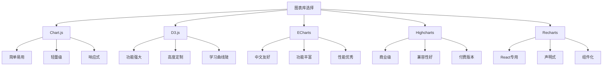

# 数据可视化图表

## 图表库选择

### 主流图表库对比


### 图表库特性对比
| 特性 | Chart.js | D3.js | ECharts | Highcharts | Recharts |
|------|----------|-------|---------|------------|----------|
| 学习难度 | 低 | 高 | 中 | 低 | 中 |
| 定制能力 | 中 | 高 | 高 | 高 | 中 |
| 性能 | 好 | 优秀 | 优秀 | 优秀 | 好 |
| 文档质量 | 优秀 | 优秀 | 优秀 | 优秀 | 好 |
| 社区支持 | 活跃 | 活跃 | 活跃 | 活跃 | 活跃 |
| 许可证 | MIT | BSD | Apache | 商业 | MIT |

## Chart.js 基础应用

### 基础图表实现
```javascript
// 1. 基础图表配置
class ChartConfig {
  constructor() {
    this.defaultOptions = {
      responsive: true,
      maintainAspectRatio: false,
      plugins: {
        legend: {
          position: 'top',
        },
        title: {
          display: true,
          text: '图表标题'
        }
      },
      scales: {
        y: {
          beginAtZero: true
        }
      }
    };
  }
  
  // 折线图配置
  getLineChartConfig(data, options = {}) {
    return {
      type: 'line',
      data: {
        labels: data.labels,
        datasets: data.datasets.map(dataset => ({
          label: dataset.label,
          data: dataset.data,
          borderColor: dataset.color || this.getRandomColor(),
          backgroundColor: dataset.backgroundColor || this.getRandomColor(0.1),
          borderWidth: 2,
          fill: false,
          tension: 0.4
        }))
      },
      options: { ...this.defaultOptions, ...options }
    };
  }
  
  // 柱状图配置
  getBarChartConfig(data, options = {}) {
    return {
      type: 'bar',
      data: {
        labels: data.labels,
        datasets: data.datasets.map(dataset => ({
          label: dataset.label,
          data: dataset.data,
          backgroundColor: dataset.colors || this.getRandomColors(dataset.data.length),
          borderColor: dataset.borderColors || this.getRandomColors(dataset.data.length),
          borderWidth: 1
        }))
      },
      options: { ...this.defaultOptions, ...options }
    };
  }
  
  // 饼图配置
  getPieChartConfig(data, options = {}) {
    return {
      type: 'pie',
      data: {
        labels: data.labels,
        datasets: [{
          data: data.data,
          backgroundColor: data.colors || this.getRandomColors(data.data.length),
          borderColor: '#fff',
          borderWidth: 2
        }]
      },
      options: {
        responsive: true,
        plugins: {
          legend: {
            position: 'right',
          },
          tooltip: {
            callbacks: {
              label: function(context) {
                const label = context.label || '';
                const value = context.parsed;
                const total = context.dataset.data.reduce((a, b) => a + b, 0);
                const percentage = ((value / total) * 100).toFixed(1);
                return `${label}: ${value} (${percentage}%)`;
              }
            }
          }
        },
        ...options
      }
    };
  }
  
  // 散点图配置
  getScatterChartConfig(data, options = {}) {
    return {
      type: 'scatter',
      data: {
        datasets: data.datasets.map(dataset => ({
          label: dataset.label,
          data: dataset.data,
          backgroundColor: dataset.color || this.getRandomColor(),
          borderColor: dataset.color || this.getRandomColor(),
          pointRadius: 6,
          pointHoverRadius: 8
        }))
      },
      options: {
        responsive: true,
        scales: {
          x: {
            type: 'linear',
            position: 'bottom'
          },
          y: {
            beginAtZero: true
          }
        },
        ...options
      }
    };
  }
  
  // 获取随机颜色
  getRandomColor(alpha = 1) {
    const r = Math.floor(Math.random() * 256);
    const g = Math.floor(Math.random() * 256);
    const b = Math.floor(Math.random() * 256);
    return `rgba(${r}, ${g}, ${b}, ${alpha})`;
  }
  
  // 获取随机颜色数组
  getRandomColors(count) {
    return Array.from({ length: count }, () => this.getRandomColor());
  }
}

// 2. 图表管理器
class ChartManager {
  constructor() {
    this.charts = new Map();
    this.config = new ChartConfig();
  }
  
  // 创建图表
  createChart(canvasId, type, data, options = {}) {
    const canvas = document.getElementById(canvasId);
    if (!canvas) {
      throw new Error(`Canvas element not found: ${canvasId}`);
    }
    
    let config;
    switch (type) {
      case 'line':
        config = this.config.getLineChartConfig(data, options);
        break;
      case 'bar':
        config = this.config.getBarChartConfig(data, options);
        break;
      case 'pie':
        config = this.config.getPieChartConfig(data, options);
        break;
      case 'scatter':
        config = this.config.getScatterChartConfig(data, options);
        break;
      default:
        throw new Error(`Unsupported chart type: ${type}`);
    }
    
    const chart = new Chart(canvas, config);
    this.charts.set(canvasId, chart);
    return chart;
  }
  
  // 更新图表数据
  updateChart(canvasId, newData) {
    const chart = this.charts.get(canvasId);
    if (chart) {
      chart.data = newData;
      chart.update();
    }
  }
  
  // 销毁图表
  destroyChart(canvasId) {
    const chart = this.charts.get(canvasId);
    if (chart) {
      chart.destroy();
      this.charts.delete(canvasId);
    }
  }
  
  // 获取图表
  getChart(canvasId) {
    return this.charts.get(canvasId);
  }
}

// 3. 使用示例
const chartManager = new ChartManager();

// 创建折线图
const lineData = {
  labels: ['1月', '2月', '3月', '4月', '5月', '6月'],
  datasets: [{
    label: '销售额',
    data: [12, 19, 3, 5, 2, 3],
    color: 'rgb(75, 192, 192)'
  }, {
    label: '利润',
    data: [2, 3, 20, 5, 1, 4],
    color: 'rgb(255, 99, 132)'
  }]
};

chartManager.createChart('lineChart', 'line', lineData, {
  plugins: {
    title: {
      text: '月度销售数据'
    }
  }
});

// 创建柱状图
const barData = {
  labels: ['产品A', '产品B', '产品C', '产品D', '产品E'],
  datasets: [{
    label: '销量',
    data: [65, 59, 80, 81, 56]
  }]
};

chartManager.createChart('barChart', 'bar', barData);

// 创建饼图
const pieData = {
  labels: ['桌面端', '移动端', '平板端'],
  data: [45, 35, 20],
  colors: ['#FF6384', '#36A2EB', '#FFCE56']
};

chartManager.createChart('pieChart', 'pie', pieData);
```

### 高级图表功能
```javascript
// 1. 交互式图表
class InteractiveChart {
  constructor(canvasId, type, data, options = {}) {
    this.canvasId = canvasId;
    this.type = type;
    this.data = data;
    this.options = options;
    this.chart = null;
    this.eventHandlers = new Map();
    
    this.init();
  }
  
  // 初始化
  init() {
    this.chart = new Chart(document.getElementById(this.canvasId), {
      type: this.type,
      data: this.data,
      options: {
        ...this.options,
        onClick: (event, elements) => {
          this.handleClick(event, elements);
        },
        onHover: (event, elements) => {
          this.handleHover(event, elements);
        }
      }
    });
  }
  
  // 处理点击事件
  handleClick(event, elements) {
    if (elements.length > 0) {
      const element = elements[0];
      const datasetIndex = element.datasetIndex;
      const index = element.index;
      
      this.triggerEvent('click', {
        datasetIndex,
        index,
        data: this.getDataAt(datasetIndex, index),
        element
      });
    }
  }
  
  // 处理悬停事件
  handleHover(event, elements) {
    if (elements.length > 0) {
      const element = elements[0];
      const datasetIndex = element.datasetIndex;
      const index = element.index;
      
      this.triggerEvent('hover', {
        datasetIndex,
        index,
        data: this.getDataAt(datasetIndex, index),
        element
      });
    }
  }
  
  // 获取指定位置的数据
  getDataAt(datasetIndex, index) {
    if (this.type === 'pie') {
      return {
        label: this.data.labels[index],
        value: this.data.datasets[0].data[index]
      };
    } else {
      return {
        label: this.data.labels[index],
        value: this.data.datasets[datasetIndex].data[index]
      };
    }
  }
  
  // 添加事件监听器
  addEventListener(event, handler) {
    if (!this.eventHandlers.has(event)) {
      this.eventHandlers.set(event, []);
    }
    this.eventHandlers.get(event).push(handler);
  }
  
  // 触发事件
  triggerEvent(event, data) {
    const handlers = this.eventHandlers.get(event) || [];
    handlers.forEach(handler => handler(data));
  }
  
  // 更新数据
  updateData(newData) {
    this.data = newData;
    this.chart.data = newData;
    this.chart.update();
  }
  
  // 添加数据点
  addDataPoint(label, value, datasetIndex = 0) {
    if (this.type === 'pie') {
      this.data.labels.push(label);
      this.data.datasets[0].data.push(value);
    } else {
      this.data.labels.push(label);
      this.data.datasets[datasetIndex].data.push(value);
    }
    this.chart.update();
  }
  
  // 移除数据点
  removeDataPoint(index) {
    if (this.type === 'pie') {
      this.data.labels.splice(index, 1);
      this.data.datasets[0].data.splice(index, 1);
    } else {
      this.data.labels.splice(index, 1);
      this.data.datasets.forEach(dataset => {
        dataset.data.splice(index, 1);
      });
    }
    this.chart.update();
  }
  
  // 销毁图表
  destroy() {
    this.chart.destroy();
    this.eventHandlers.clear();
  }
}

// 2. 使用示例
const interactiveChart = new InteractiveChart('interactiveChart', 'line', {
  labels: ['1月', '2月', '3月', '4月', '5月'],
  datasets: [{
    label: '数据',
    data: [10, 20, 15, 25, 30],
    borderColor: 'rgb(75, 192, 192)',
    backgroundColor: 'rgba(75, 192, 192, 0.2)'
  }]
});

// 添加事件监听器
interactiveChart.addEventListener('click', (data) => {
  console.log('点击了数据点:', data);
  alert(`点击了: ${data.data.label} - ${data.data.value}`);
});

interactiveChart.addEventListener('hover', (data) => {
  console.log('悬停在数据点:', data);
});
```

## D3.js 高级可视化

### D3.js 基础应用
```javascript
// 1. D3.js 基础图表类
class D3Chart {
  constructor(container, width = 800, height = 400) {
    this.container = container;
    this.width = width;
    this.height = height;
    this.margin = { top: 20, right: 20, bottom: 40, left: 40 };
    this.svg = null;
    this.data = [];
    
    this.init();
  }
  
  // 初始化SVG
  init() {
    this.svg = d3.select(this.container)
      .append('svg')
      .attr('width', this.width)
      .attr('height', this.height);
  }
  
  // 设置数据
  setData(data) {
    this.data = data;
    return this;
  }
  
  // 设置尺寸
  setSize(width, height) {
    this.width = width;
    this.height = height;
    this.svg
      .attr('width', width)
      .attr('height', height);
    return this;
  }
  
  // 设置边距
  setMargin(margin) {
    this.margin = { ...this.margin, ...margin };
    return this;
  }
  
  // 获取绘图区域尺寸
  getPlotArea() {
    return {
      width: this.width - this.margin.left - this.margin.right,
      height: this.height - this.margin.top - this.margin.bottom
    };
  }
  
  // 清空图表
  clear() {
    this.svg.selectAll('*').remove();
    return this;
  }
}

// 2. 柱状图实现
class D3BarChart extends D3Chart {
  constructor(container, width, height) {
    super(container, width, height);
  }
  
  // 渲染柱状图
  render() {
    const plotArea = this.getPlotArea();
    
    // 创建比例尺
    const xScale = d3.scaleBand()
      .domain(this.data.map(d => d.label))
      .range([0, plotArea.width])
      .padding(0.1);
    
    const yScale = d3.scaleLinear()
      .domain([0, d3.max(this.data, d => d.value)])
      .range([plotArea.height, 0]);
    
    // 创建颜色比例尺
    const colorScale = d3.scaleOrdinal()
      .domain(this.data.map(d => d.label))
      .range(d3.schemeCategory10);
    
    // 创建主绘图区域
    const g = this.svg.append('g')
      .attr('transform', `translate(${this.margin.left}, ${this.margin.top})`);
    
    // 绘制柱状图
    g.selectAll('.bar')
      .data(this.data)
      .enter()
      .append('rect')
      .attr('class', 'bar')
      .attr('x', d => xScale(d.label))
      .attr('y', d => yScale(d.value))
      .attr('width', xScale.bandwidth())
      .attr('height', d => plotArea.height - yScale(d.value))
      .attr('fill', d => colorScale(d.label))
      .attr('stroke', '#fff')
      .attr('stroke-width', 1);
    
    // 添加数值标签
    g.selectAll('.label')
      .data(this.data)
      .enter()
      .append('text')
      .attr('class', 'label')
      .attr('x', d => xScale(d.label) + xScale.bandwidth() / 2)
      .attr('y', d => yScale(d.value) - 5)
      .attr('text-anchor', 'middle')
      .attr('font-size', '12px')
      .attr('fill', '#333')
      .text(d => d.value);
    
    // 添加X轴
    g.append('g')
      .attr('transform', `translate(0, ${plotArea.height})`)
      .call(d3.axisBottom(xScale))
      .selectAll('text')
      .attr('font-size', '12px');
    
    // 添加Y轴
    g.append('g')
      .call(d3.axisLeft(yScale))
      .selectAll('text')
      .attr('font-size', '12px');
    
    // 添加标题
    this.svg.append('text')
      .attr('x', this.width / 2)
      .attr('y', 15)
      .attr('text-anchor', 'middle')
      .attr('font-size', '16px')
      .attr('font-weight', 'bold')
      .text('柱状图');
    
    return this;
  }
  
  // 添加动画
  animate() {
    const plotArea = this.getPlotArea();
    const yScale = d3.scaleLinear()
      .domain([0, d3.max(this.data, d => d.value)])
      .range([plotArea.height, 0]);
    
    this.svg.selectAll('.bar')
      .attr('y', plotArea.height)
      .attr('height', 0)
      .transition()
      .duration(1000)
      .attr('y', d => yScale(d.value))
      .attr('height', d => plotArea.height - yScale(d.value));
    
    return this;
  }
}

// 3. 折线图实现
class D3LineChart extends D3Chart {
  constructor(container, width, height) {
    super(container, width, height);
  }
  
  // 渲染折线图
  render() {
    const plotArea = this.getPlotArea();
    
    // 创建比例尺
    const xScale = d3.scaleLinear()
      .domain(d3.extent(this.data, d => d.x))
      .range([0, plotArea.width]);
    
    const yScale = d3.scaleLinear()
      .domain(d3.extent(this.data, d => d.y))
      .range([plotArea.height, 0]);
    
    // 创建线条生成器
    const line = d3.line()
      .x(d => xScale(d.x))
      .y(d => yScale(d.y))
      .curve(d3.curveMonotoneX);
    
    // 创建主绘图区域
    const g = this.svg.append('g')
      .attr('transform', `translate(${this.margin.left}, ${this.margin.top})`);
    
    // 绘制折线
    g.append('path')
      .datum(this.data)
      .attr('class', 'line')
      .attr('d', line)
      .attr('fill', 'none')
      .attr('stroke', 'steelblue')
      .attr('stroke-width', 2);
    
    // 绘制数据点
    g.selectAll('.dot')
      .data(this.data)
      .enter()
      .append('circle')
      .attr('class', 'dot')
      .attr('cx', d => xScale(d.x))
      .attr('cy', d => yScale(d.y))
      .attr('r', 4)
      .attr('fill', 'steelblue')
      .attr('stroke', '#fff')
      .attr('stroke-width', 2);
    
    // 添加X轴
    g.append('g')
      .attr('transform', `translate(0, ${plotArea.height})`)
      .call(d3.axisBottom(xScale));
    
    // 添加Y轴
    g.append('g')
      .call(d3.axisLeft(yScale));
    
    return this;
  }
}

// 4. 使用示例
const barData = [
  { label: 'A', value: 20 },
  { label: 'B', value: 35 },
  { label: 'C', value: 15 },
  { label: 'D', value: 40 },
  { label: 'E', value: 25 }
];

const barChart = new D3BarChart('#barChart', 800, 400);
barChart.setData(barData).render().animate();

const lineData = [
  { x: 1, y: 5 },
  { x: 2, y: 8 },
  { x: 3, y: 12 },
  { x: 4, y: 6 },
  { x: 5, y: 15 },
  { x: 6, y: 18 },
  { x: 7, y: 22 }
];

const lineChart = new D3LineChart('#lineChart', 800, 400);
lineChart.setData(lineData).render();
```

### 复杂可视化图表
```javascript
// 1. 力导向图
class ForceDirectedGraph {
  constructor(container, width = 800, height = 600) {
    this.container = container;
    this.width = width;
    this.height = height;
    this.svg = null;
    this.simulation = null;
    this.nodes = [];
    this.links = [];
    
    this.init();
  }
  
  // 初始化
  init() {
    this.svg = d3.select(this.container)
      .append('svg')
      .attr('width', this.width)
      .attr('height', this.height);
    
    // 创建力导向模拟
    this.simulation = d3.forceSimulation()
      .force('link', d3.forceLink().id(d => d.id))
      .force('charge', d3.forceManyBody().strength(-300))
      .force('center', d3.forceCenter(this.width / 2, this.height / 2));
  }
  
  // 设置数据
  setData(nodes, links) {
    this.nodes = nodes;
    this.links = links;
    return this;
  }
  
  // 渲染
  render() {
    // 创建连线
    const link = this.svg.append('g')
      .selectAll('line')
      .data(this.links)
      .enter()
      .append('line')
      .attr('stroke', '#999')
      .attr('stroke-opacity', 0.6)
      .attr('stroke-width', d => Math.sqrt(d.value));
    
    // 创建节点
    const node = this.svg.append('g')
      .selectAll('circle')
      .data(this.nodes)
      .enter()
      .append('circle')
      .attr('r', 8)
      .attr('fill', d => this.getNodeColor(d.group))
      .attr('stroke', '#fff')
      .attr('stroke-width', 2)
      .call(d3.drag()
        .on('start', this.dragstarted.bind(this))
        .on('drag', this.dragged.bind(this))
        .on('end', this.dragended.bind(this)));
    
    // 添加标签
    const label = this.svg.append('g')
      .selectAll('text')
      .data(this.nodes)
      .enter()
      .append('text')
      .text(d => d.name)
      .attr('font-size', '12px')
      .attr('text-anchor', 'middle')
      .attr('dy', 20);
    
    // 更新模拟
    this.simulation
      .nodes(this.nodes)
      .on('tick', () => {
        link
          .attr('x1', d => d.source.x)
          .attr('y1', d => d.source.y)
          .attr('x2', d => d.target.x)
          .attr('y2', d => d.target.y);
        
        node
          .attr('cx', d => d.x)
          .attr('cy', d => d.y);
        
        label
          .attr('x', d => d.x)
          .attr('y', d => d.y);
      });
    
    this.simulation.force('link').links(this.links);
    
    return this;
  }
  
  // 获取节点颜色
  getNodeColor(group) {
    const colors = ['#FF6384', '#36A2EB', '#FFCE56', '#4BC0C0', '#9966FF'];
    return colors[group % colors.length];
  }
  
  // 拖拽开始
  dragstarted(event, d) {
    if (!event.active) this.simulation.alphaTarget(0.3).restart();
    d.fx = d.x;
    d.fy = d.y;
  }
  
  // 拖拽中
  dragged(event, d) {
    d.fx = event.x;
    d.fy = event.y;
  }
  
  // 拖拽结束
  dragended(event, d) {
    if (!event.active) this.simulation.alphaTarget(0);
    d.fx = null;
    d.fy = null;
  }
}

// 2. 树状图
class TreeMap {
  constructor(container, width = 800, height = 600) {
    this.container = container;
    this.width = width;
    this.height = height;
    this.svg = null;
    this.data = null;
    
    this.init();
  }
  
  // 初始化
  init() {
    this.svg = d3.select(this.container)
      .append('svg')
      .attr('width', this.width)
      .attr('height', this.height);
  }
  
  // 设置数据
  setData(data) {
    this.data = data;
    return this;
  }
  
  // 渲染
  render() {
    // 创建树状图布局
    const treemap = d3.treemap()
      .size([this.width, this.height])
      .padding(2);
    
    // 处理数据
    const root = d3.hierarchy(this.data)
      .sum(d => d.value)
      .sort((a, b) => b.value - a.value);
    
    treemap(root);
    
    // 创建颜色比例尺
    const color = d3.scaleOrdinal()
      .domain(root.children.map(d => d.data.name))
      .range(d3.schemeCategory10);
    
    // 绘制矩形
    const cell = this.svg.selectAll('g')
      .data(root.leaves())
      .enter()
      .append('g')
      .attr('transform', d => `translate(${d.x0},${d.y0})`);
    
    cell.append('rect')
      .attr('width', d => d.x1 - d.x0)
      .attr('height', d => d.y1 - d.y0)
      .attr('fill', d => color(d.parent.data.name))
      .attr('stroke', '#fff')
      .attr('stroke-width', 2);
    
    // 添加标签
    cell.append('text')
      .attr('x', d => (d.x1 - d.x0) / 2)
      .attr('y', d => (d.y1 - d.y0) / 2)
      .attr('text-anchor', 'middle')
      .attr('dominant-baseline', 'middle')
      .attr('font-size', '12px')
      .attr('fill', '#fff')
      .text(d => d.data.name);
    
    return this;
  }
}

// 3. 使用示例
const graphData = {
  nodes: [
    { id: 'A', name: '节点A', group: 0 },
    { id: 'B', name: '节点B', group: 1 },
    { id: 'C', name: '节点C', group: 0 },
    { id: 'D', name: '节点D', group: 2 },
    { id: 'E', name: '节点E', group: 1 }
  ],
  links: [
    { source: 'A', target: 'B', value: 1 },
    { source: 'A', target: 'C', value: 2 },
    { source: 'B', target: 'D', value: 1 },
    { source: 'C', target: 'E', value: 1 },
    { source: 'D', target: 'E', value: 2 }
  ]
};

const forceGraph = new ForceDirectedGraph('#forceGraph', 800, 600);
forceGraph.setData(graphData.nodes, graphData.links).render();

const treeData = {
  name: '根节点',
  value: 100,
  children: [
    { name: '子节点1', value: 40 },
    { name: '子节点2', value: 30 },
    { name: '子节点3', value: 20 },
    { name: '子节点4', value: 10 }
  ]
};

const treeMap = new TreeMap('#treeMap', 800, 600);
treeMap.setData(treeData).render();
```

## 实时数据可视化

### WebSocket 实时图表
```javascript
// 1. 实时数据管理器
class RealTimeDataManager {
  constructor(url) {
    this.url = url;
    this.ws = null;
    this.isConnected = false;
    this.reconnectAttempts = 0;
    this.maxReconnectAttempts = 5;
    this.reconnectInterval = 1000;
    this.dataBuffer = [];
    this.maxBufferSize = 100;
    this.listeners = new Map();
  }
  
  // 连接WebSocket
  connect() {
    try {
      this.ws = new WebSocket(this.url);
      
      this.ws.onopen = () => {
        console.log('WebSocket连接已建立');
        this.isConnected = true;
        this.reconnectAttempts = 0;
        this.triggerEvent('connected');
      };
      
      this.ws.onmessage = (event) => {
        try {
          const data = JSON.parse(event.data);
          this.handleMessage(data);
        } catch (error) {
          console.error('解析消息失败:', error);
        }
      };
      
      this.ws.onclose = () => {
        console.log('WebSocket连接已关闭');
        this.isConnected = false;
        this.triggerEvent('disconnected');
        this.attemptReconnect();
      };
      
      this.ws.onerror = (error) => {
        console.error('WebSocket错误:', error);
        this.triggerEvent('error', error);
      };
    } catch (error) {
      console.error('创建WebSocket连接失败:', error);
    }
  }
  
  // 处理消息
  handleMessage(data) {
    // 添加到缓冲区
    this.dataBuffer.push({
      ...data,
      timestamp: Date.now()
    });
    
    // 限制缓冲区大小
    if (this.dataBuffer.length > this.maxBufferSize) {
      this.dataBuffer.shift();
    }
    
    // 触发数据更新事件
    this.triggerEvent('data', data);
  }
  
  // 尝试重连
  attemptReconnect() {
    if (this.reconnectAttempts < this.maxReconnectAttempts) {
      this.reconnectAttempts++;
      console.log(`尝试重连 (${this.reconnectAttempts}/${this.maxReconnectAttempts})`);
      
      setTimeout(() => {
        this.connect();
      }, this.reconnectInterval * this.reconnectAttempts);
    } else {
      console.log('达到最大重连次数，停止重连');
      this.triggerEvent('reconnectFailed');
    }
  }
  
  // 发送消息
  send(message) {
    if (this.isConnected && this.ws) {
      this.ws.send(JSON.stringify(message));
    } else {
      console.warn('WebSocket未连接，无法发送消息');
    }
  }
  
  // 添加事件监听器
  addEventListener(event, handler) {
    if (!this.listeners.has(event)) {
      this.listeners.set(event, []);
    }
    this.listeners.get(event).push(handler);
  }
  
  // 触发事件
  triggerEvent(event, data) {
    const handlers = this.listeners.get(event) || [];
    handlers.forEach(handler => handler(data));
  }
  
  // 断开连接
  disconnect() {
    if (this.ws) {
      this.ws.close();
    }
  }
  
  // 获取历史数据
  getHistoryData() {
    return [...this.dataBuffer];
  }
}

// 2. 实时图表组件
class RealTimeChart {
  constructor(canvasId, options = {}) {
    this.canvasId = canvasId;
    this.options = {
      maxDataPoints: 50,
      updateInterval: 1000,
      ...options
    };
    
    this.chart = null;
    this.data = [];
    this.isRunning = false;
    this.updateTimer = null;
    
    this.init();
  }
  
  // 初始化
  init() {
    this.chart = new Chart(document.getElementById(this.canvasId), {
      type: 'line',
      data: {
        labels: [],
        datasets: [{
          label: '实时数据',
          data: [],
          borderColor: 'rgb(75, 192, 192)',
          backgroundColor: 'rgba(75, 192, 192, 0.2)',
          borderWidth: 2,
          fill: false
        }]
      },
      options: {
        responsive: true,
        maintainAspectRatio: false,
        scales: {
          x: {
            type: 'time',
            time: {
              unit: 'second'
            }
          },
          y: {
            beginAtZero: true
          }
        },
        plugins: {
          legend: {
            display: true
          }
        }
      }
    });
  }
  
  // 添加数据点
  addDataPoint(value, timestamp = Date.now()) {
    this.data.push({ value, timestamp });
    
    // 限制数据点数量
    if (this.data.length > this.options.maxDataPoints) {
      this.data.shift();
    }
    
    this.updateChart();
  }
  
  // 更新图表
  updateChart() {
    const labels = this.data.map(d => new Date(d.timestamp));
    const values = this.data.map(d => d.value);
    
    this.chart.data.labels = labels;
    this.chart.data.datasets[0].data = values;
    this.chart.update('none');
  }
  
  // 开始实时更新
  start() {
    if (!this.isRunning) {
      this.isRunning = true;
      this.updateTimer = setInterval(() => {
        // 这里可以添加新的数据点
        // 实际应用中，数据会从WebSocket或其他数据源获取
      }, this.options.updateInterval);
    }
  }
  
  // 停止实时更新
  stop() {
    if (this.isRunning) {
      this.isRunning = false;
      if (this.updateTimer) {
        clearInterval(this.updateTimer);
        this.updateTimer = null;
      }
    }
  }
  
  // 清空数据
  clear() {
    this.data = [];
    this.updateChart();
  }
  
  // 销毁图表
  destroy() {
    this.stop();
    if (this.chart) {
      this.chart.destroy();
    }
  }
}

// 3. 使用示例
const dataManager = new RealTimeDataManager('ws://localhost:8080/ws');

// 创建实时图表
const realTimeChart = new RealTimeChart('realTimeChart', {
  maxDataPoints: 30,
  updateInterval: 500
});

// 监听数据更新
dataManager.addEventListener('data', (data) => {
  realTimeChart.addDataPoint(data.value, data.timestamp);
});

// 监听连接状态
dataManager.addEventListener('connected', () => {
  console.log('开始接收实时数据');
  realTimeChart.start();
});

dataManager.addEventListener('disconnected', () => {
  console.log('停止接收实时数据');
  realTimeChart.stop();
});

// 连接WebSocket
dataManager.connect();
```

## 相关链接
- [[03-应用实践层/03-框架生态/01-React核心概念]] - React框架
- [[03-应用实践层/03-框架生态/02-Vue.js基础]] - Vue框架
- [[04-高级精通层/03-性能优化/01-内存管理]] - 性能优化
- [[05-实战项目/03-综合项目/01-电商网站前端]] - 综合项目
- [[05-实战项目/02-进阶项目/03-实时聊天应用]] - 实时应用
