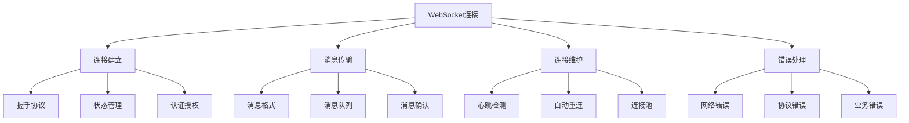

# 实时聊天应用

## WebSocket 基础

### WebSocket 连接管理


### WebSocket 客户端实现
```javascript
// 1. WebSocket客户端类
class WebSocketClient {
  constructor(url, options = {}) {
    this.url = url;
    this.options = {
      reconnectInterval: 3000,
      maxReconnectAttempts: 5,
      heartbeatInterval: 30000,
      ...options
    };
    
    this.ws = null;
    this.isConnected = false;
    this.reconnectAttempts = 0;
    this.heartbeatTimer = null;
    this.messageQueue = [];
    this.listeners = new Map();
    this.messageId = 0;
    
    this.connect();
  }
  
  // 建立连接
  connect() {
    try {
      this.ws = new WebSocket(this.url);
      
      this.ws.onopen = () => {
        console.log('WebSocket连接已建立');
        this.isConnected = true;
        this.reconnectAttempts = 0;
        this.startHeartbeat();
        this.processMessageQueue();
        this.triggerEvent('connected');
      };
      
      this.ws.onmessage = (event) => {
        try {
          const message = JSON.parse(event.data);
          this.handleMessage(message);
        } catch (error) {
          console.error('解析消息失败:', error);
        }
      };
      
      this.ws.onclose = (event) => {
        console.log('WebSocket连接已关闭:', event.code, event.reason);
        this.isConnected = false;
        this.stopHeartbeat();
        this.triggerEvent('disconnected', { code: event.code, reason: event.reason });
        this.attemptReconnect();
      };
      
      this.ws.onerror = (error) => {
        console.error('WebSocket错误:', error);
        this.triggerEvent('error', error);
      };
    } catch (error) {
      console.error('创建WebSocket连接失败:', error);
    }
  }
  
  // 处理消息
  handleMessage(message) {
    // 处理心跳响应
    if (message.type === 'pong') {
      return;
    }
    
    // 处理消息确认
    if (message.type === 'ack' && message.messageId) {
      this.triggerEvent('messageAck', message);
      return;
    }
    
    // 触发消息事件
    this.triggerEvent('message', message);
    
    // 发送确认
    if (message.messageId) {
      this.send({
        type: 'ack',
        messageId: message.messageId
      });
    }
  }
  
  // 发送消息
  send(data) {
    const message = {
      ...data,
      messageId: ++this.messageId,
      timestamp: Date.now()
    };
    
    if (this.isConnected) {
      this.ws.send(JSON.stringify(message));
    } else {
      // 连接断开时，将消息加入队列
      this.messageQueue.push(message);
    }
  }
  
  // 处理消息队列
  processMessageQueue() {
    while (this.messageQueue.length > 0) {
      const message = this.messageQueue.shift();
      this.ws.send(JSON.stringify(message));
    }
  }
  
  // 开始心跳
  startHeartbeat() {
    this.heartbeatTimer = setInterval(() => {
      if (this.isConnected) {
        this.send({ type: 'ping' });
      }
    }, this.options.heartbeatInterval);
  }
  
  // 停止心跳
  stopHeartbeat() {
    if (this.heartbeatTimer) {
      clearInterval(this.heartbeatTimer);
      this.heartbeatTimer = null;
    }
  }
  
  // 尝试重连
  attemptReconnect() {
    if (this.reconnectAttempts < this.options.maxReconnectAttempts) {
      this.reconnectAttempts++;
      console.log(`尝试重连 (${this.reconnectAttempts}/${this.options.maxReconnectAttempts})`);
      
      setTimeout(() => {
        this.connect();
      }, this.options.reconnectInterval);
    } else {
      console.log('达到最大重连次数，停止重连');
      this.triggerEvent('reconnectFailed');
    }
  }
  
  // 添加事件监听器
  addEventListener(event, handler) {
    if (!this.listeners.has(event)) {
      this.listeners.set(event, []);
    }
    this.listeners.get(event).push(handler);
  }
  
  // 移除事件监听器
  removeEventListener(event, handler) {
    const handlers = this.listeners.get(event);
    if (handlers) {
      const index = handlers.indexOf(handler);
      if (index > -1) {
        handlers.splice(index, 1);
      }
    }
  }
  
  // 触发事件
  triggerEvent(event, data) {
    const handlers = this.listeners.get(event) || [];
    handlers.forEach(handler => handler(data));
  }
  
  // 断开连接
  disconnect() {
    this.stopHeartbeat();
    if (this.ws) {
      this.ws.close();
    }
  }
}

// 2. 使用示例
const wsClient = new WebSocketClient('ws://localhost:8080/chat');

// 监听连接事件
wsClient.addEventListener('connected', () => {
  console.log('已连接到聊天服务器');
});

wsClient.addEventListener('disconnected', (event) => {
  console.log('与聊天服务器断开连接:', event.reason);
});

wsClient.addEventListener('message', (message) => {
  console.log('收到消息:', message);
});

// 发送消息
wsClient.send({
  type: 'chat',
  content: '你好，世界！',
  roomId: 'general'
});
```

## 聊天应用架构

### 聊天室管理
```javascript
// 1. 聊天室管理器
class ChatRoomManager {
  constructor(wsClient) {
    this.wsClient = wsClient;
    this.currentRoom = null;
    this.rooms = new Map();
    this.users = new Map();
    this.messages = new Map();
    
    this.init();
  }
  
  // 初始化
  init() {
    // 监听WebSocket消息
    this.wsClient.addEventListener('message', (message) => {
      this.handleMessage(message);
    });
  }
  
  // 处理消息
  handleMessage(message) {
    switch (message.type) {
      case 'roomList':
        this.handleRoomList(message.rooms);
        break;
      case 'userList':
        this.handleUserList(message.users);
        break;
      case 'chat':
        this.handleChatMessage(message);
        break;
      case 'userJoined':
        this.handleUserJoined(message);
        break;
      case 'userLeft':
        this.handleUserLeft(message);
        break;
      case 'roomCreated':
        this.handleRoomCreated(message);
        break;
      case 'roomDeleted':
        this.handleRoomDeleted(message);
        break;
    }
  }
  
  // 处理房间列表
  handleRoomList(rooms) {
    this.rooms.clear();
    rooms.forEach(room => {
      this.rooms.set(room.id, room);
    });
    this.triggerEvent('roomListUpdated', Array.from(this.rooms.values()));
  }
  
  // 处理用户列表
  handleUserList(users) {
    this.users.clear();
    users.forEach(user => {
      this.users.set(user.id, user);
    });
    this.triggerEvent('userListUpdated', Array.from(this.users.values()));
  }
  
  // 处理聊天消息
  handleChatMessage(message) {
    const roomId = message.roomId;
    if (!this.messages.has(roomId)) {
      this.messages.set(roomId, []);
    }
    
    this.messages.get(roomId).push(message);
    this.triggerEvent('messageReceived', message);
  }
  
  // 处理用户加入
  handleUserJoined(message) {
    this.users.set(message.user.id, message.user);
    this.triggerEvent('userJoined', message.user);
  }
  
  // 处理用户离开
  handleUserLeft(message) {
    this.users.delete(message.userId);
    this.triggerEvent('userLeft', message.userId);
  }
  
  // 处理房间创建
  handleRoomCreated(message) {
    this.rooms.set(message.room.id, message.room);
    this.triggerEvent('roomCreated', message.room);
  }
  
  // 处理房间删除
  handleRoomDeleted(message) {
    this.rooms.delete(message.roomId);
    this.messages.delete(message.roomId);
    this.triggerEvent('roomDeleted', message.roomId);
  }
  
  // 加入房间
  joinRoom(roomId) {
    this.wsClient.send({
      type: 'joinRoom',
      roomId: roomId
    });
    this.currentRoom = roomId;
  }
  
  // 离开房间
  leaveRoom() {
    if (this.currentRoom) {
      this.wsClient.send({
        type: 'leaveRoom',
        roomId: this.currentRoom
      });
      this.currentRoom = null;
    }
  }
  
  // 发送消息
  sendMessage(content, type = 'text') {
    if (this.currentRoom) {
      this.wsClient.send({
        type: 'chat',
        roomId: this.currentRoom,
        content: content,
        messageType: type
      });
    }
  }
  
  // 创建房间
  createRoom(name, description = '') {
    this.wsClient.send({
      type: 'createRoom',
      name: name,
      description: description
    });
  }
  
  // 删除房间
  deleteRoom(roomId) {
    this.wsClient.send({
      type: 'deleteRoom',
      roomId: roomId
    });
  }
  
  // 获取房间列表
  getRooms() {
    return Array.from(this.rooms.values());
  }
  
  // 获取用户列表
  getUsers() {
    return Array.from(this.users.values());
  }
  
  // 获取消息历史
  getMessages(roomId) {
    return this.messages.get(roomId) || [];
  }
  
  // 添加事件监听器
  addEventListener(event, handler) {
    if (!this.listeners) {
      this.listeners = new Map();
    }
    if (!this.listeners.has(event)) {
      this.listeners.set(event, []);
    }
    this.listeners.get(event).push(handler);
  }
  
  // 触发事件
  triggerEvent(event, data) {
    if (this.listeners && this.listeners.has(event)) {
      this.listeners.get(event).forEach(handler => handler(data));
    }
  }
}

// 2. 使用示例
const chatRoomManager = new ChatRoomManager(wsClient);

// 监听房间列表更新
chatRoomManager.addEventListener('roomListUpdated', (rooms) => {
  console.log('房间列表更新:', rooms);
  updateRoomList(rooms);
});

// 监听用户列表更新
chatRoomManager.addEventListener('userListUpdated', (users) => {
  console.log('用户列表更新:', users);
  updateUserList(users);
});

// 监听消息接收
chatRoomManager.addEventListener('messageReceived', (message) => {
  console.log('收到消息:', message);
  displayMessage(message);
});

// 加入房间
chatRoomManager.joinRoom('general');

// 发送消息
chatRoomManager.sendMessage('大家好！');
```

### 消息处理系统
```javascript
// 1. 消息处理器
class MessageHandler {
  constructor() {
    this.handlers = new Map();
    this.middlewares = [];
  }
  
  // 注册消息处理器
  register(type, handler) {
    if (!this.handlers.has(type)) {
      this.handlers.set(type, []);
    }
    this.handlers.get(type).push(handler);
  }
  
  // 添加中间件
  use(middleware) {
    this.middlewares.push(middleware);
  }
  
  // 处理消息
  async handle(message) {
    // 执行中间件
    for (const middleware of this.middlewares) {
      const result = await middleware(message);
      if (result === false) {
        return; // 中间件阻止了消息处理
      }
    }
    
    // 执行处理器
    const handlers = this.handlers.get(message.type) || [];
    for (const handler of handlers) {
      try {
        await handler(message);
      } catch (error) {
        console.error(`处理消息失败 (${message.type}):`, error);
      }
    }
  }
}

// 2. 消息类型定义
const MessageTypes = {
  TEXT: 'text',
  IMAGE: 'image',
  FILE: 'file',
  SYSTEM: 'system',
  TYPING: 'typing',
  READ: 'read'
};

// 3. 消息处理器实现
class TextMessageHandler {
  constructor(chatRoomManager) {
    this.chatRoomManager = chatRoomManager;
  }
  
  // 处理文本消息
  handle(message) {
    // 内容过滤
    const filteredContent = this.filterContent(message.content);
    
    // 表情转换
    const processedContent = this.processEmojis(filteredContent);
    
    // 链接检测
    const contentWithLinks = this.processLinks(processedContent);
    
    // 更新消息内容
    message.content = contentWithLinks;
    message.processed = true;
    
    return message;
  }
  
  // 内容过滤
  filterContent(content) {
    // 移除HTML标签
    content = content.replace(/<[^>]*>/g, '');
    
    // 过滤敏感词
    const sensitiveWords = ['敏感词1', '敏感词2'];
    sensitiveWords.forEach(word => {
      content = content.replace(new RegExp(word, 'gi'), '*'.repeat(word.length));
    });
    
    return content;
  }
  
  // 表情处理
  processEmojis(content) {
    const emojiMap = {
      ':)': '😊',
      ':(': '😢',
      ':D': '😄',
      ':P': '😛',
      ';)': '😉'
    };
    
    Object.entries(emojiMap).forEach(([key, emoji]) => {
      content = content.replace(new RegExp(key.replace(/[.*+?^${}()|[\]\\]/g, '\\$&'), 'g'), emoji);
    });
    
    return content;
  }
  
  // 链接处理
  processLinks(content) {
    const urlRegex = /(https?:\/\/[^\s]+)/g;
    return content.replace(urlRegex, '<a href="$1" target="_blank">$1</a>');
  }
}

// 4. 文件消息处理器
class FileMessageHandler {
  constructor(chatRoomManager) {
    this.chatRoomManager = chatRoomManager;
    this.maxFileSize = 10 * 1024 * 1024; // 10MB
    this.allowedTypes = ['image/jpeg', 'image/png', 'image/gif', 'application/pdf'];
  }
  
  // 处理文件消息
  async handle(message) {
    if (message.messageType === MessageTypes.FILE) {
      // 验证文件
      if (!this.validateFile(message.file)) {
        throw new Error('文件验证失败');
      }
      
      // 上传文件
      const fileUrl = await this.uploadFile(message.file);
      message.fileUrl = fileUrl;
      
      // 生成预览
      if (this.isImage(message.file)) {
        message.preview = await this.generateImagePreview(message.file);
      }
    }
    
    return message;
  }
  
  // 验证文件
  validateFile(file) {
    if (file.size > this.maxFileSize) {
      return false;
    }
    
    if (!this.allowedTypes.includes(file.type)) {
      return false;
    }
    
    return true;
  }
  
  // 上传文件
  async uploadFile(file) {
    const formData = new FormData();
    formData.append('file', file);
    
    const response = await fetch('/api/upload', {
      method: 'POST',
      body: formData
    });
    
    if (!response.ok) {
      throw new Error('文件上传失败');
    }
    
    const result = await response.json();
    return result.url;
  }
  
  // 检查是否为图片
  isImage(file) {
    return file.type.startsWith('image/');
  }
  
  // 生成图片预览
  generateImagePreview(file) {
    return new Promise((resolve) => {
      const reader = new FileReader();
      reader.onload = (e) => {
        resolve(e.target.result);
      };
      reader.readAsDataURL(file);
    });
  }
}

// 5. 使用示例
const messageHandler = new MessageHandler();

// 添加中间件
messageHandler.use(async (message) => {
  // 记录消息
  console.log('处理消息:', message);
  return true;
});

// 注册处理器
const textHandler = new TextMessageHandler(chatRoomManager);
const fileHandler = new FileMessageHandler(chatRoomManager);

messageHandler.register(MessageTypes.TEXT, textHandler.handle.bind(textHandler));
messageHandler.register(MessageTypes.FILE, fileHandler.handle.bind(fileHandler));

// 处理消息
messageHandler.handle({
  type: 'chat',
  messageType: MessageTypes.TEXT,
  content: '你好 :) 这是一个链接: https://example.com',
  roomId: 'general',
  userId: 'user1'
});
```

## 用户界面实现

### 聊天界面组件
```javascript
// 1. 聊天界面类
class ChatInterface {
  constructor(container, chatRoomManager) {
    this.container = container;
    this.chatRoomManager = chatRoomManager;
    this.currentRoom = null;
    this.isTyping = false;
    this.typingTimer = null;
    this.messageContainer = null;
    this.inputElement = null;
    this.userListElement = null;
    this.roomListElement = null;
    
    this.init();
  }
  
  // 初始化
  init() {
    this.render();
    this.bindEvents();
    this.setupChatRoomManager();
  }
  
  // 渲染界面
  render() {
    this.container.innerHTML = `
      <div class="chat-container">
        <div class="chat-sidebar">
          <div class="room-list">
            <h3>房间列表</h3>
            <div id="roomList"></div>
            <button id="createRoomBtn">创建房间</button>
          </div>
          <div class="user-list">
            <h3>在线用户</h3>
            <div id="userList"></div>
          </div>
        </div>
        <div class="chat-main">
          <div class="chat-header">
            <h2 id="roomTitle">选择房间</h2>
            <div class="typing-indicator" id="typingIndicator"></div>
          </div>
          <div class="chat-messages" id="messageContainer"></div>
          <div class="chat-input">
            <input type="text" id="messageInput" placeholder="输入消息..." />
            <button id="sendBtn">发送</button>
            <input type="file" id="fileInput" accept="image/*,application/pdf" />
            <button id="fileBtn">文件</button>
          </div>
        </div>
      </div>
    `;
    
    // 获取DOM元素
    this.messageContainer = document.getElementById('messageContainer');
    this.inputElement = document.getElementById('messageInput');
    this.userListElement = document.getElementById('userList');
    this.roomListElement = document.getElementById('roomList');
  }
  
  // 绑定事件
  bindEvents() {
    // 发送消息
    document.getElementById('sendBtn').addEventListener('click', () => {
      this.sendMessage();
    });
    
    // 回车发送
    this.inputElement.addEventListener('keypress', (e) => {
      if (e.key === 'Enter') {
        this.sendMessage();
      }
    });
    
    // 输入状态
    this.inputElement.addEventListener('input', () => {
      this.handleTyping();
    });
    
    // 文件上传
    document.getElementById('fileBtn').addEventListener('click', () => {
      document.getElementById('fileInput').click();
    });
    
    document.getElementById('fileInput').addEventListener('change', (e) => {
      this.handleFileUpload(e.target.files[0]);
    });
    
    // 创建房间
    document.getElementById('createRoomBtn').addEventListener('click', () => {
      this.showCreateRoomDialog();
    });
  }
  
  // 设置聊天室管理器
  setupChatRoomManager() {
    // 监听房间列表更新
    this.chatRoomManager.addEventListener('roomListUpdated', (rooms) => {
      this.updateRoomList(rooms);
    });
    
    // 监听用户列表更新
    this.chatRoomManager.addEventListener('userListUpdated', (users) => {
      this.updateUserList(users);
    });
    
    // 监听消息接收
    this.chatRoomManager.addEventListener('messageReceived', (message) => {
      this.displayMessage(message);
    });
    
    // 监听用户加入
    this.chatRoomManager.addEventListener('userJoined', (user) => {
      this.showSystemMessage(`${user.name} 加入了房间`);
    });
    
    // 监听用户离开
    this.chatRoomManager.addEventListener('userLeft', (userId) => {
      this.showSystemMessage(`用户离开了房间`);
    });
  }
  
  // 更新房间列表
  updateRoomList(rooms) {
    this.roomListElement.innerHTML = rooms.map(room => `
      <div class="room-item ${room.id === this.currentRoom ? 'active' : ''}" 
           data-room-id="${room.id}">
        <div class="room-name">${room.name}</div>
        <div class="room-description">${room.description}</div>
        <div class="room-count">${room.userCount || 0} 人</div>
      </div>
    `).join('');
    
    // 绑定房间点击事件
    this.roomListElement.querySelectorAll('.room-item').forEach(item => {
      item.addEventListener('click', () => {
        const roomId = item.getAttribute('data-room-id');
        this.joinRoom(roomId);
      });
    });
  }
  
  // 更新用户列表
  updateUserList(users) {
    this.userListElement.innerHTML = users.map(user => `
      <div class="user-item">
        <div class="user-avatar">${user.name.charAt(0)}</div>
        <div class="user-name">${user.name}</div>
        <div class="user-status ${user.status || 'online'}"></div>
      </div>
    `).join('');
  }
  
  // 加入房间
  joinRoom(roomId) {
    if (this.currentRoom !== roomId) {
      this.currentRoom = roomId;
      this.chatRoomManager.joinRoom(roomId);
      
      // 更新界面
      const room = this.chatRoomManager.getRooms().find(r => r.id === roomId);
      document.getElementById('roomTitle').textContent = room ? room.name : '未知房间';
      
      // 清空消息
      this.messageContainer.innerHTML = '';
      
      // 加载历史消息
      const messages = this.chatRoomManager.getMessages(roomId);
      messages.forEach(message => this.displayMessage(message));
    }
  }
  
  // 发送消息
  sendMessage() {
    const content = this.inputElement.value.trim();
    if (content && this.currentRoom) {
      this.chatRoomManager.sendMessage(content);
      this.inputElement.value = '';
      this.stopTyping();
    }
  }
  
  // 处理文件上传
  handleFileUpload(file) {
    if (file && this.currentRoom) {
      this.chatRoomManager.sendMessage(file, MessageTypes.FILE);
    }
  }
  
  // 显示消息
  displayMessage(message) {
    const messageElement = document.createElement('div');
    messageElement.className = `message ${message.userId === 'current' ? 'own' : 'other'}`;
    
    if (message.messageType === MessageTypes.TEXT) {
      messageElement.innerHTML = `
        <div class="message-header">
          <span class="user-name">${message.userName || '未知用户'}</span>
          <span class="message-time">${this.formatTime(message.timestamp)}</span>
        </div>
        <div class="message-content">${message.content}</div>
      `;
    } else if (message.messageType === MessageTypes.FILE) {
      messageElement.innerHTML = `
        <div class="message-header">
          <span class="user-name">${message.userName || '未知用户'}</span>
          <span class="message-time">${this.formatTime(message.timestamp)}</span>
        </div>
        <div class="message-content">
          <div class="file-message">
            <div class="file-name">${message.fileName}</div>
            <div class="file-size">${this.formatFileSize(message.fileSize)}</div>
            ${message.preview ? `` : ''}
            <a href="${message.fileUrl}" target="_blank" class="file-download">下载</a>
          </div>
        </div>
      `;
    } else if (message.messageType === MessageTypes.SYSTEM) {
      messageElement.className = 'message system';
      messageElement.innerHTML = `
        <div class="system-message">${message.content}</div>
      `;
    }
    
    this.messageContainer.appendChild(messageElement);
    this.scrollToBottom();
  }
  
  // 显示系统消息
  showSystemMessage(content) {
    this.displayMessage({
      type: 'system',
      messageType: MessageTypes.SYSTEM,
      content: content,
      timestamp: Date.now()
    });
  }
  
  // 处理输入状态
  handleTyping() {
    if (!this.isTyping) {
      this.isTyping = true;
      this.chatRoomManager.sendMessage('', MessageTypes.TYPING);
    }
    
    // 重置定时器
    clearTimeout(this.typingTimer);
    this.typingTimer = setTimeout(() => {
      this.stopTyping();
    }, 1000);
  }
  
  // 停止输入状态
  stopTyping() {
    if (this.isTyping) {
      this.isTyping = false;
      this.chatRoomManager.sendMessage('', MessageTypes.TYPING);
    }
  }
  
  // 显示创建房间对话框
  showCreateRoomDialog() {
    const name = prompt('房间名称:');
    if (name) {
      const description = prompt('房间描述:') || '';
      this.chatRoomManager.createRoom(name, description);
    }
  }
  
  // 格式化时间
  formatTime(timestamp) {
    const date = new Date(timestamp);
    return date.toLocaleTimeString();
  }
  
  // 格式化文件大小
  formatFileSize(bytes) {
    if (bytes === 0) return '0 Bytes';
    const k = 1024;
    const sizes = ['Bytes', 'KB', 'MB', 'GB'];
    const i = Math.floor(Math.log(bytes) / Math.log(k));
    return parseFloat((bytes / Math.pow(k, i)).toFixed(2)) + ' ' + sizes[i];
  }
  
  // 滚动到底部
  scrollToBottom() {
    this.messageContainer.scrollTop = this.messageContainer.scrollHeight;
  }
}

// 2. 使用示例
const chatInterface = new ChatInterface(
  document.getElementById('chatContainer'),
  chatRoomManager
);
```

## 相关链接
- [[05-实战项目/02-进阶项目/01-单页应用(SPA)]] - SPA应用
- [[05-实战项目/02-进阶项目/02-数据可视化图表]] - 数据可视化
- [[03-应用实践层/03-框架生态/01-React核心概念]] - React框架
- [[03-应用实践层/03-框架生态/02-Vue.js基础]] - Vue框架
- [[04-高级精通层/03-性能优化/01-内存管理]] - 性能优化
