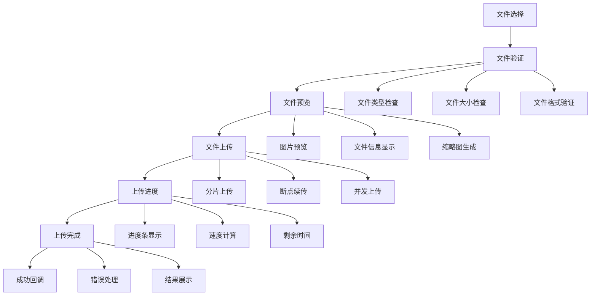

# 文件上传组件

## 文件上传基础

### 文件上传流程


### 文件上传特性对比
| 特性 | 基础上传 | 分片上传 | 断点续传 | 拖拽上传 |
|------|----------|----------|----------|----------|
| 实现难度 | 低 | 中 | 高 | 中 |
| 大文件支持 | 差 | 好 | 优秀 | 好 |
| 网络中断恢复 | 否 | 否 | 是 | 否 |
| 用户体验 | 一般 | 好 | 优秀 | 优秀 |
| 服务器压力 | 高 | 中 | 低 | 中 |
| 浏览器兼容 | 好 | 好 | 中 | 中 |

## 基础文件上传

### 简单文件上传组件
```javascript
// 1. 基础文件上传类
class BasicFileUpload {
  constructor(options = {}) {
    this.options = {
      maxFileSize: 10 * 1024 * 1024, // 10MB
      allowedTypes: ['image/jpeg', 'image/png', 'image/gif', 'application/pdf'],
      multiple: false,
      ...options
    };
    
    this.files = [];
    this.uploadQueue = [];
    this.isUploading = false;
    this.listeners = new Map();
  }
  
  // 创建上传界面
  createUploadArea(container) {
    const uploadArea = document.createElement('div');
    uploadArea.className = 'upload-area';
    uploadArea.innerHTML = `
      <div class="upload-dropzone">
        <input type="file" class="file-input" ${this.options.multiple ? 'multiple' : ''} 
               accept="${this.options.allowedTypes.join(',')}" />
        <div class="upload-text">
          <p>点击选择文件或拖拽文件到此处</p>
          <p class="upload-hint">支持 ${this.options.allowedTypes.join(', ')} 格式</p>
        </div>
      </div>
      <div class="upload-progress" style="display: none;">
        <div class="progress-bar">
          <div class="progress-fill"></div>
        </div>
        <div class="progress-text">0%</div>
      </div>
      <div class="upload-list"></div>
    `;
    
    container.appendChild(uploadArea);
    this.setupEventListeners(uploadArea);
    return uploadArea;
  }
  
  // 设置事件监听器
  setupEventListeners(uploadArea) {
    const fileInput = uploadArea.querySelector('.file-input');
    const dropzone = uploadArea.querySelector('.upload-dropzone');
    const uploadList = uploadArea.querySelector('.upload-list');
    
    // 文件选择
    fileInput.addEventListener('change', (e) => {
      this.handleFiles(e.target.files);
    });
    
    // 拖拽事件
    dropzone.addEventListener('dragover', (e) => {
      e.preventDefault();
      dropzone.classList.add('drag-over');
    });
    
    dropzone.addEventListener('dragleave', (e) => {
      e.preventDefault();
      dropzone.classList.remove('drag-over');
    });
    
    dropzone.addEventListener('drop', (e) => {
      e.preventDefault();
      dropzone.classList.remove('drag-over');
      this.handleFiles(e.dataTransfer.files);
    });
    
    // 点击上传区域
    dropzone.addEventListener('click', () => {
      fileInput.click();
    });
  }
  
  // 处理文件
  handleFiles(fileList) {
    const files = Array.from(fileList);
    
    files.forEach(file => {
      if (this.validateFile(file)) {
        this.addFile(file);
      }
    });
  }
  
  // 验证文件
  validateFile(file) {
    // 检查文件大小
    if (file.size > this.options.maxFileSize) {
      this.triggerEvent('error', {
        type: 'size',
        message: `文件 ${file.name} 超过最大大小限制`,
        file: file
      });
      return false;
    }
    
    // 检查文件类型
    if (!this.options.allowedTypes.includes(file.type)) {
      this.triggerEvent('error', {
        type: 'type',
        message: `文件 ${file.name} 类型不支持`,
        file: file
      });
      return false;
    }
    
    return true;
  }
  
  // 添加文件
  addFile(file) {
    const fileItem = {
      id: Date.now() + Math.random(),
      file: file,
      status: 'pending',
      progress: 0,
      error: null
    };
    
    this.files.push(fileItem);
    this.triggerEvent('fileAdded', fileItem);
    this.renderFileItem(fileItem);
  }
  
  // 渲染文件项
  renderFileItem(fileItem) {
    const uploadList = document.querySelector('.upload-list');
    const fileElement = document.createElement('div');
    fileElement.className = 'file-item';
    fileElement.dataset.fileId = fileItem.id;
    
    fileElement.innerHTML = `
      <div class="file-info">
        <div class="file-name">${fileItem.file.name}</div>
        <div class="file-size">${this.formatFileSize(fileItem.file.size)}</div>
        <div class="file-type">${fileItem.file.type}</div>
      </div>
      <div class="file-preview">
        ${this.generatePreview(fileItem.file)}
      </div>
      <div class="file-actions">
        <button class="upload-btn" data-action="upload">上传</button>
        <button class="remove-btn" data-action="remove">删除</button>
      </div>
      <div class="file-progress" style="display: none;">
        <div class="progress-bar">
          <div class="progress-fill"></div>
        </div>
        <div class="progress-text">0%</div>
      </div>
    `;
    
    uploadList.appendChild(fileElement);
    
    // 绑定事件
    fileElement.querySelector('.upload-btn').addEventListener('click', () => {
      this.uploadFile(fileItem.id);
    });
    
    fileElement.querySelector('.remove-btn').addEventListener('click', () => {
      this.removeFile(fileItem.id);
    });
  }
  
  // 生成预览
  generatePreview(file) {
    if (file.type.startsWith('image/')) {
      return ``;
    } else if (file.type === 'application/pdf') {
      return `<div class="preview-pdf">PDF文件</div>`;
    } else {
      return `<div class="preview-file">${file.name}</div>`;
    }
  }
  
  // 上传文件
  async uploadFile(fileId) {
    const fileItem = this.files.find(f => f.id === fileId);
    if (!fileItem || fileItem.status === 'uploading') {
      return;
    }
    
    fileItem.status = 'uploading';
    this.updateFileStatus(fileId, 'uploading');
    
    try {
      const formData = new FormData();
      formData.append('file', fileItem.file);
      
      const xhr = new XMLHttpRequest();
      
      // 上传进度
      xhr.upload.addEventListener('progress', (e) => {
        if (e.lengthComputable) {
          const progress = (e.loaded / e.total) * 100;
          fileItem.progress = progress;
          this.updateFileProgress(fileId, progress);
        }
      });
      
      // 上传完成
      xhr.addEventListener('load', () => {
        if (xhr.status === 200) {
          fileItem.status = 'completed';
          this.updateFileStatus(fileId, 'completed');
          this.triggerEvent('uploadComplete', {
            fileItem: fileItem,
            response: JSON.parse(xhr.responseText)
          });
        } else {
          throw new Error(`上传失败: ${xhr.status}`);
        }
      });
      
      // 上传错误
      xhr.addEventListener('error', () => {
        fileItem.status = 'error';
        fileItem.error = '网络错误';
        this.updateFileStatus(fileId, 'error');
        this.triggerEvent('uploadError', {
          fileItem: fileItem,
          error: '网络错误'
        });
      });
      
      xhr.open('POST', '/api/upload');
      xhr.send(formData);
      
    } catch (error) {
      fileItem.status = 'error';
      fileItem.error = error.message;
      this.updateFileStatus(fileId, 'error');
      this.triggerEvent('uploadError', {
        fileItem: fileItem,
        error: error.message
      });
    }
  }
  
  // 更新文件状态
  updateFileStatus(fileId, status) {
    const fileElement = document.querySelector(`[data-file-id="${fileId}"]`);
    if (fileElement) {
      fileElement.className = `file-item ${status}`;
      
      const progressElement = fileElement.querySelector('.file-progress');
      if (status === 'uploading') {
        progressElement.style.display = 'block';
      } else {
        progressElement.style.display = 'none';
      }
    }
  }
  
  // 更新文件进度
  updateFileProgress(fileId, progress) {
    const fileElement = document.querySelector(`[data-file-id="${fileId}"]`);
    if (fileElement) {
      const progressFill = fileElement.querySelector('.progress-fill');
      const progressText = fileElement.querySelector('.progress-text');
      
      progressFill.style.width = `${progress}%`;
      progressText.textContent = `${Math.round(progress)}%`;
    }
  }
  
  // 删除文件
  removeFile(fileId) {
    const index = this.files.findIndex(f => f.id === fileId);
    if (index > -1) {
      this.files.splice(index, 1);
      const fileElement = document.querySelector(`[data-file-id="${fileId}"]`);
      if (fileElement) {
        fileElement.remove();
      }
      this.triggerEvent('fileRemoved', fileId);
    }
  }
  
  // 格式化文件大小
  formatFileSize(bytes) {
    if (bytes === 0) return '0 Bytes';
    const k = 1024;
    const sizes = ['Bytes', 'KB', 'MB', 'GB'];
    const i = Math.floor(Math.log(bytes) / Math.log(k));
    return parseFloat((bytes / Math.pow(k, i)).toFixed(2)) + ' ' + sizes[i];
  }
  
  // 添加事件监听器
  addEventListener(event, handler) {
    if (!this.listeners.has(event)) {
      this.listeners.set(event, []);
    }
    this.listeners.get(event).push(handler);
  }
  
  // 触发事件
  triggerEvent(event, data) {
    const handlers = this.listeners.get(event) || [];
    handlers.forEach(handler => handler(data));
  }
}

// 2. 使用示例
const fileUpload = new BasicFileUpload({
  maxFileSize: 5 * 1024 * 1024, // 5MB
  allowedTypes: ['image/jpeg', 'image/png', 'image/gif'],
  multiple: true
});

// 创建上传界面
fileUpload.createUploadArea(document.getElementById('uploadContainer'));

// 监听事件
fileUpload.addEventListener('fileAdded', (fileItem) => {
  console.log('文件已添加:', fileItem.file.name);
});

fileUpload.addEventListener('uploadComplete', (data) => {
  console.log('上传完成:', data);
});

fileUpload.addEventListener('uploadError', (data) => {
  console.error('上传失败:', data.error);
});
```

## 高级文件上传

### 分片上传组件
```javascript
// 1. 分片上传类
class ChunkedFileUpload {
  constructor(options = {}) {
    this.options = {
      chunkSize: 1024 * 1024, // 1MB
      maxConcurrent: 3,
      retryAttempts: 3,
      ...options
    };
    
    this.files = [];
    this.uploadQueue = [];
    this.activeUploads = new Map();
    this.listeners = new Map();
  }
  
  // 添加文件
  addFile(file) {
    const fileItem = {
      id: Date.now() + Math.random(),
      file: file,
      status: 'pending',
      progress: 0,
      chunks: [],
      uploadedChunks: 0,
      totalChunks: Math.ceil(file.size / this.options.chunkSize),
      error: null
    };
    
    // 创建分片
    this.createChunks(fileItem);
    
    this.files.push(fileItem);
    this.triggerEvent('fileAdded', fileItem);
    
    return fileItem;
  }
  
  // 创建分片
  createChunks(fileItem) {
    const { file, totalChunks } = fileItem;
    
    for (let i = 0; i < totalChunks; i++) {
      const start = i * this.options.chunkSize;
      const end = Math.min(start + this.options.chunkSize, file.size);
      
      const chunk = {
        index: i,
        start: start,
        end: end,
        size: end - start,
        blob: file.slice(start, end),
        status: 'pending',
        retryCount: 0
      };
      
      fileItem.chunks.push(chunk);
    }
  }
  
  // 上传文件
  async uploadFile(fileId) {
    const fileItem = this.files.find(f => f.id === fileId);
    if (!fileItem || fileItem.status === 'uploading') {
      return;
    }
    
    fileItem.status = 'uploading';
    this.triggerEvent('uploadStart', fileItem);
    
    try {
      // 获取已上传的分片
      const uploadedChunks = await this.getUploadedChunks(fileItem);
      
      // 过滤已上传的分片
      fileItem.chunks.forEach(chunk => {
        if (uploadedChunks.includes(chunk.index)) {
          chunk.status = 'completed';
          fileItem.uploadedChunks++;
        }
      });
      
      // 开始上传剩余分片
      await this.uploadChunks(fileItem);
      
      // 合并分片
      await this.mergeChunks(fileItem);
      
      fileItem.status = 'completed';
      this.triggerEvent('uploadComplete', fileItem);
      
    } catch (error) {
      fileItem.status = 'error';
      fileItem.error = error.message;
      this.triggerEvent('uploadError', { fileItem, error: error.message });
    }
  }
  
  // 上传分片
  async uploadChunks(fileItem) {
    const pendingChunks = fileItem.chunks.filter(chunk => chunk.status === 'pending');
    const uploadPromises = [];
    
    // 控制并发数
    for (let i = 0; i < pendingChunks.length; i += this.options.maxConcurrent) {
      const batch = pendingChunks.slice(i, i + this.options.maxConcurrent);
      const batchPromises = batch.map(chunk => this.uploadChunk(fileItem, chunk));
      uploadPromises.push(...batchPromises);
    }
    
    await Promise.all(uploadPromises);
  }
  
  // 上传单个分片
  async uploadChunk(fileItem, chunk) {
    const maxRetries = this.options.retryAttempts;
    
    for (let attempt = 0; attempt <= maxRetries; attempt++) {
      try {
        chunk.status = 'uploading';
        
        const formData = new FormData();
        formData.append('file', chunk.blob);
        formData.append('chunkIndex', chunk.index);
        formData.append('totalChunks', fileItem.totalChunks);
        formData.append('fileName', fileItem.file.name);
        formData.append('fileSize', fileItem.file.size);
        
        const response = await fetch('/api/upload-chunk', {
          method: 'POST',
          body: formData
        });
        
        if (!response.ok) {
          throw new Error(`上传失败: ${response.status}`);
        }
        
        chunk.status = 'completed';
        fileItem.uploadedChunks++;
        
        // 更新进度
        const progress = (fileItem.uploadedChunks / fileItem.totalChunks) * 100;
        fileItem.progress = progress;
        this.triggerEvent('progress', { fileItem, progress });
        
        return;
        
      } catch (error) {
        chunk.retryCount++;
        
        if (attempt === maxRetries) {
          chunk.status = 'error';
          throw new Error(`分片 ${chunk.index} 上传失败: ${error.message}`);
        }
        
        // 等待后重试
        await new Promise(resolve => setTimeout(resolve, 1000 * attempt));
      }
    }
  }
  
  // 获取已上传的分片
  async getUploadedChunks(fileItem) {
    try {
      const response = await fetch('/api/uploaded-chunks', {
        method: 'POST',
        headers: {
          'Content-Type': 'application/json'
        },
        body: JSON.stringify({
          fileName: fileItem.file.name,
          fileSize: fileItem.file.size,
          totalChunks: fileItem.totalChunks
        })
      });
      
      if (response.ok) {
        const data = await response.json();
        return data.uploadedChunks || [];
      }
      
      return [];
    } catch (error) {
      console.warn('获取已上传分片失败:', error);
      return [];
    }
  }
  
  // 合并分片
  async mergeChunks(fileItem) {
    try {
      const response = await fetch('/api/merge-chunks', {
        method: 'POST',
        headers: {
          'Content-Type': 'application/json'
        },
        body: JSON.stringify({
          fileName: fileItem.file.name,
          fileSize: fileItem.file.size,
          totalChunks: fileItem.totalChunks
        })
      });
      
      if (!response.ok) {
        throw new Error(`合并分片失败: ${response.status}`);
      }
      
      const result = await response.json();
      fileItem.url = result.url;
      
    } catch (error) {
      throw new Error(`合并分片失败: ${error.message}`);
    }
  }
  
  // 暂停上传
  pauseUpload(fileId) {
    const fileItem = this.files.find(f => f.id === fileId);
    if (fileItem && fileItem.status === 'uploading') {
      fileItem.status = 'paused';
      this.triggerEvent('uploadPaused', fileItem);
    }
  }
  
  // 恢复上传
  resumeUpload(fileId) {
    const fileItem = this.files.find(f => f.id === fileId);
    if (fileItem && fileItem.status === 'paused') {
      this.uploadFile(fileId);
    }
  }
  
  // 取消上传
  cancelUpload(fileId) {
    const fileItem = this.files.find(f => f.id === fileId);
    if (fileItem) {
      fileItem.status = 'cancelled';
      this.triggerEvent('uploadCancelled', fileItem);
    }
  }
  
  // 添加事件监听器
  addEventListener(event, handler) {
    if (!this.listeners.has(event)) {
      this.listeners.set(event, []);
    }
    this.listeners.get(event).push(handler);
  }
  
  // 触发事件
  triggerEvent(event, data) {
    const handlers = this.listeners.get(event) || [];
    handlers.forEach(handler => handler(data));
  }
}

// 2. 使用示例
const chunkedUpload = new ChunkedFileUpload({
  chunkSize: 512 * 1024, // 512KB
  maxConcurrent: 2,
  retryAttempts: 3
});

// 监听事件
chunkedUpload.addEventListener('uploadStart', (fileItem) => {
  console.log('开始上传:', fileItem.file.name);
});

chunkedUpload.addEventListener('progress', (data) => {
  console.log('上传进度:', data.progress.toFixed(2) + '%');
});

chunkedUpload.addEventListener('uploadComplete', (fileItem) => {
  console.log('上传完成:', fileItem.url);
});

// 添加文件并上传
const file = document.getElementById('fileInput').files[0];
const fileItem = chunkedUpload.addFile(file);
chunkedUpload.uploadFile(fileItem.id);
```

### 拖拽上传组件
```javascript
// 1. 拖拽上传类
class DragDropUpload {
  constructor(container, options = {}) {
    this.container = container;
    this.options = {
      maxFiles: 10,
      maxFileSize: 50 * 1024 * 1024, // 50MB
      allowedTypes: ['image/*', 'application/pdf'],
      ...options
    };
    
    this.files = [];
    this.isDragOver = false;
    this.listeners = new Map();
    
    this.init();
  }
  
  // 初始化
  init() {
    this.render();
    this.bindEvents();
  }
  
  // 渲染界面
  render() {
    this.container.innerHTML = `
      <div class="drag-drop-area">
        <div class="drop-zone">
          <div class="drop-icon">📁</div>
          <div class="drop-text">
            <h3>拖拽文件到此处</h3>
            <p>或点击选择文件</p>
          </div>
          <input type="file" class="file-input" multiple 
                 accept="${this.options.allowedTypes.join(',')}" />
        </div>
        <div class="file-list"></div>
      </div>
    `;
  }
  
  // 绑定事件
  bindEvents() {
    const dropZone = this.container.querySelector('.drop-zone');
    const fileInput = this.container.querySelector('.file-input');
    const fileList = this.container.querySelector('.file-list');
    
    // 文件选择
    fileInput.addEventListener('change', (e) => {
      this.handleFiles(e.target.files);
    });
    
    // 拖拽事件
    dropZone.addEventListener('dragover', (e) => {
      e.preventDefault();
      e.stopPropagation();
      this.handleDragOver(e);
    });
    
    dropZone.addEventListener('dragenter', (e) => {
      e.preventDefault();
      e.stopPropagation();
      this.handleDragEnter(e);
    });
    
    dropZone.addEventListener('dragleave', (e) => {
      e.preventDefault();
      e.stopPropagation();
      this.handleDragLeave(e);
    });
    
    dropZone.addEventListener('drop', (e) => {
      e.preventDefault();
      e.stopPropagation();
      this.handleDrop(e);
    });
    
    // 点击选择文件
    dropZone.addEventListener('click', () => {
      fileInput.click();
    });
    
    // 阻止默认行为
    document.addEventListener('dragover', (e) => {
      e.preventDefault();
    });
    
    document.addEventListener('drop', (e) => {
      e.preventDefault();
    });
  }
  
  // 处理拖拽进入
  handleDragEnter(e) {
    if (!this.isDragOver) {
      this.isDragOver = true;
      this.container.querySelector('.drop-zone').classList.add('drag-over');
    }
  }
  
  // 处理拖拽悬停
  handleDragOver(e) {
    e.preventDefault();
  }
  
  // 处理拖拽离开
  handleDragLeave(e) {
    if (this.isDragOver) {
      this.isDragOver = false;
      this.container.querySelector('.drop-zone').classList.remove('drag-over');
    }
  }
  
  // 处理文件放置
  handleDrop(e) {
    this.isDragOver = false;
    this.container.querySelector('.drop-zone').classList.remove('drag-over');
    
    const files = Array.from(e.dataTransfer.files);
    this.handleFiles(files);
  }
  
  // 处理文件
  handleFiles(fileList) {
    const validFiles = [];
    const invalidFiles = [];
    
    fileList.forEach(file => {
      if (this.validateFile(file)) {
        validFiles.push(file);
      } else {
        invalidFiles.push(file);
      }
    });
    
    // 处理有效文件
    validFiles.forEach(file => {
      this.addFile(file);
    });
    
    // 处理无效文件
    if (invalidFiles.length > 0) {
      this.triggerEvent('invalidFiles', invalidFiles);
    }
  }
  
  // 验证文件
  validateFile(file) {
    // 检查文件数量
    if (this.files.length >= this.options.maxFiles) {
      this.triggerEvent('error', {
        type: 'maxFiles',
        message: `最多只能上传 ${this.options.maxFiles} 个文件`
      });
      return false;
    }
    
    // 检查文件大小
    if (file.size > this.options.maxFileSize) {
      this.triggerEvent('error', {
        type: 'maxSize',
        message: `文件 ${file.name} 超过最大大小限制`
      });
      return false;
    }
    
    // 检查文件类型
    const isValidType = this.options.allowedTypes.some(type => {
      if (type.endsWith('/*')) {
        return file.type.startsWith(type.slice(0, -1));
      }
      return file.type === type;
    });
    
    if (!isValidType) {
      this.triggerEvent('error', {
        type: 'invalidType',
        message: `文件 ${file.name} 类型不支持`
      });
      return false;
    }
    
    return true;
  }
  
  // 添加文件
  addFile(file) {
    const fileItem = {
      id: Date.now() + Math.random(),
      file: file,
      status: 'pending',
      progress: 0,
      preview: null
    };
    
    // 生成预览
    this.generatePreview(fileItem);
    
    this.files.push(fileItem);
    this.renderFileItem(fileItem);
    this.triggerEvent('fileAdded', fileItem);
  }
  
  // 生成预览
  generatePreview(fileItem) {
    const file = fileItem.file;
    
    if (file.type.startsWith('image/')) {
      const reader = new FileReader();
      reader.onload = (e) => {
        fileItem.preview = e.target.result;
        this.updateFilePreview(fileItem.id);
      };
      reader.readAsDataURL(file);
    }
  }
  
  // 渲染文件项
  renderFileItem(fileItem) {
    const fileList = this.container.querySelector('.file-list');
    const fileElement = document.createElement('div');
    fileElement.className = 'file-item';
    fileElement.dataset.fileId = fileItem.id;
    
    fileElement.innerHTML = `
      <div class="file-preview">
        ${fileItem.preview ? `` : '<div class="file-icon">📄</div>'}
      </div>
      <div class="file-info">
        <div class="file-name">${fileItem.file.name}</div>
        <div class="file-size">${this.formatFileSize(fileItem.file.size)}</div>
        <div class="file-status">${fileItem.status}</div>
      </div>
      <div class="file-actions">
        <button class="upload-btn" data-action="upload">上传</button>
        <button class="remove-btn" data-action="remove">删除</button>
      </div>
      <div class="file-progress" style="display: none;">
        <div class="progress-bar">
          <div class="progress-fill"></div>
        </div>
        <div class="progress-text">0%</div>
      </div>
    `;
    
    fileList.appendChild(fileElement);
    
    // 绑定事件
    fileElement.querySelector('.upload-btn').addEventListener('click', () => {
      this.uploadFile(fileItem.id);
    });
    
    fileElement.querySelector('.remove-btn').addEventListener('click', () => {
      this.removeFile(fileItem.id);
    });
  }
  
  // 更新文件预览
  updateFilePreview(fileId) {
    const fileItem = this.files.find(f => f.id === fileId);
    const fileElement = document.querySelector(`[data-file-id="${fileId}"]`);
    
    if (fileItem && fileElement && fileItem.preview) {
      const previewElement = fileElement.querySelector('.file-preview');
      previewElement.innerHTML = ``;
    }
  }
  
  // 上传文件
  async uploadFile(fileId) {
    const fileItem = this.files.find(f => f.id === fileId);
    if (!fileItem || fileItem.status === 'uploading') {
      return;
    }
    
    fileItem.status = 'uploading';
    this.updateFileStatus(fileId, 'uploading');
    
    try {
      const formData = new FormData();
      formData.append('file', fileItem.file);
      
      const xhr = new XMLHttpRequest();
      
      // 上传进度
      xhr.upload.addEventListener('progress', (e) => {
        if (e.lengthComputable) {
          const progress = (e.loaded / e.total) * 100;
          fileItem.progress = progress;
          this.updateFileProgress(fileId, progress);
        }
      });
      
      // 上传完成
      xhr.addEventListener('load', () => {
        if (xhr.status === 200) {
          fileItem.status = 'completed';
          this.updateFileStatus(fileId, 'completed');
          this.triggerEvent('uploadComplete', {
            fileItem: fileItem,
            response: JSON.parse(xhr.responseText)
          });
        } else {
          throw new Error(`上传失败: ${xhr.status}`);
        }
      });
      
      // 上传错误
      xhr.addEventListener('error', () => {
        fileItem.status = 'error';
        this.updateFileStatus(fileId, 'error');
        this.triggerEvent('uploadError', {
          fileItem: fileItem,
          error: '网络错误'
        });
      });
      
      xhr.open('POST', '/api/upload');
      xhr.send(formData);
      
    } catch (error) {
      fileItem.status = 'error';
      this.updateFileStatus(fileId, 'error');
      this.triggerEvent('uploadError', {
        fileItem: fileItem,
        error: error.message
      });
    }
  }
  
  // 更新文件状态
  updateFileStatus(fileId, status) {
    const fileElement = document.querySelector(`[data-file-id="${fileId}"]`);
    if (fileElement) {
      fileElement.className = `file-item ${status}`;
      fileElement.querySelector('.file-status').textContent = status;
      
      const progressElement = fileElement.querySelector('.file-progress');
      if (status === 'uploading') {
        progressElement.style.display = 'block';
      } else {
        progressElement.style.display = 'none';
      }
    }
  }
  
  // 更新文件进度
  updateFileProgress(fileId, progress) {
    const fileElement = document.querySelector(`[data-file-id="${fileId}"]`);
    if (fileElement) {
      const progressFill = fileElement.querySelector('.progress-fill');
      const progressText = fileElement.querySelector('.progress-text');
      
      progressFill.style.width = `${progress}%`;
      progressText.textContent = `${Math.round(progress)}%`;
    }
  }
  
  // 删除文件
  removeFile(fileId) {
    const index = this.files.findIndex(f => f.id === fileId);
    if (index > -1) {
      this.files.splice(index, 1);
      const fileElement = document.querySelector(`[data-file-id="${fileId}"]`);
      if (fileElement) {
        fileElement.remove();
      }
      this.triggerEvent('fileRemoved', fileId);
    }
  }
  
  // 清空文件
  clearFiles() {
    this.files = [];
    this.container.querySelector('.file-list').innerHTML = '';
    this.triggerEvent('filesCleared');
  }
  
  // 格式化文件大小
  formatFileSize(bytes) {
    if (bytes === 0) return '0 Bytes';
    const k = 1024;
    const sizes = ['Bytes', 'KB', 'MB', 'GB'];
    const i = Math.floor(Math.log(bytes) / Math.log(k));
    return parseFloat((bytes / Math.pow(k, i)).toFixed(2)) + ' ' + sizes[i];
  }
  
  // 添加事件监听器
  addEventListener(event, handler) {
    if (!this.listeners.has(event)) {
      this.listeners.set(event, []);
    }
    this.listeners.get(event).push(handler);
  }
  
  // 触发事件
  triggerEvent(event, data) {
    const handlers = this.listeners.get(event) || [];
    handlers.forEach(handler => handler(data));
  }
}

// 2. 使用示例
const dragDropUpload = new DragDropUpload(
  document.getElementById('dragDropContainer'),
  {
    maxFiles: 5,
    maxFileSize: 10 * 1024 * 1024, // 10MB
    allowedTypes: ['image/*', 'application/pdf']
  }
);

// 监听事件
dragDropUpload.addEventListener('fileAdded', (fileItem) => {
  console.log('文件已添加:', fileItem.file.name);
});

dragDropUpload.addEventListener('uploadComplete', (data) => {
  console.log('上传完成:', data);
});

dragDropUpload.addEventListener('error', (error) => {
  console.error('错误:', error.message);
});
```

## 相关链接
- [[05-实战项目/02-进阶项目/01-单页应用(SPA)]] - SPA应用
- [[05-实战项目/02-进阶项目/02-数据可视化图表]] - 数据可视化
- [[05-实战项目/02-进阶项目/03-实时聊天应用]] - 实时应用
- [[03-应用实践层/04-工程化/01-构建工具(Webpack-Vite)]] - 构建工具
- [[04-高级精通层/03-性能优化/01-内存管理]] - 性能优化
