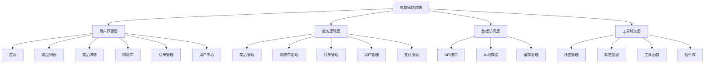

# 电商网站前端

## 项目架构设计

### 整体架构


### 技术栈选择
| 层级 | 技术选择 | 说明 |
|------|----------|------|
| 框架 | React/Vue.js | 组件化开发 |
| 状态管理 | Redux/Vuex | 全局状态管理 |
| 路由 | React Router/Vue Router | 单页应用路由 |
| UI组件 | Ant Design/Element UI | 快速开发 |
| 构建工具 | Webpack/Vite | 模块打包 |
| 样式 | CSS Modules/Styled Components | 样式隔离 |
| 测试 | Jest/Cypress | 单元测试和E2E测试 |

## 核心功能模块

### 商品管理模块
```javascript
// 1. 商品数据模型
class Product {
  constructor(data) {
    this.id = data.id;
    this.name = data.name;
    this.description = data.description;
    this.price = data.price;
    this.originalPrice = data.originalPrice;
    this.images = data.images;
    this.category = data.category;
    this.brand = data.brand;
    this.stock = data.stock;
    this.sales = data.sales;
    this.rating = data.rating;
    this.reviews = data.reviews;
    this.specifications = data.specifications;
    this.tags = data.tags;
    this.status = data.status;
    this.createdAt = data.createdAt;
    this.updatedAt = data.updatedAt;
  }
  
  // 计算折扣
  getDiscount() {
    if (this.originalPrice > this.price) {
      return Math.round((1 - this.price / this.originalPrice) * 100);
    }
    return 0;
  }
  
  // 检查库存
  isInStock() {
    return this.stock > 0;
  }
  
  // 获取主图
  getMainImage() {
    return this.images[0] || '/images/no-image.png';
  }
  
  // 获取所有图片
  getAllImages() {
    return this.images;
  }
  
  // 格式化价格
  getFormattedPrice() {
    return `¥${this.price.toFixed(2)}`;
  }
  
  // 获取原价
  getFormattedOriginalPrice() {
    return this.originalPrice ? `¥${this.originalPrice.toFixed(2)}` : null;
  }
}

// 2. 商品服务类
class ProductService {
  constructor() {
    this.baseURL = '/api/products';
    this.cache = new Map();
    this.cacheTimeout = 5 * 60 * 1000; // 5分钟
  }
  
  // 获取商品列表
  async getProducts(params = {}) {
    const cacheKey = `products_${JSON.stringify(params)}`;
    
    if (this.cache.has(cacheKey)) {
      const cached = this.cache.get(cacheKey);
      if (Date.now() - cached.timestamp < this.cacheTimeout) {
        return cached.data;
      }
    }
    
    try {
      const queryString = new URLSearchParams(params).toString();
      const response = await fetch(`${this.baseURL}?${queryString}`);
      
      if (!response.ok) {
        throw new Error(`获取商品列表失败: ${response.status}`);
      }
      
      const data = await response.json();
      const products = data.products.map(item => new Product(item));
      
      // 缓存数据
      this.cache.set(cacheKey, {
        data: products,
        timestamp: Date.now()
      });
      
      return products;
    } catch (error) {
      console.error('获取商品列表失败:', error);
      throw error;
    }
  }
  
  // 获取商品详情
  async getProduct(id) {
    const cacheKey = `product_${id}`;
    
    if (this.cache.has(cacheKey)) {
      const cached = this.cache.get(cacheKey);
      if (Date.now() - cached.timestamp < this.cacheTimeout) {
        return cached.data;
      }
    }
    
    try {
      const response = await fetch(`${this.baseURL}/${id}`);
      
      if (!response.ok) {
        throw new Error(`获取商品详情失败: ${response.status}`);
      }
      
      const data = await response.json();
      const product = new Product(data);
      
      // 缓存数据
      this.cache.set(cacheKey, {
        data: product,
        timestamp: Date.now()
      });
      
      return product;
    } catch (error) {
      console.error('获取商品详情失败:', error);
      throw error;
    }
  }
  
  // 搜索商品
  async searchProducts(keyword, filters = {}) {
    try {
      const params = {
        keyword: keyword,
        ...filters
      };
      
      const queryString = new URLSearchParams(params).toString();
      const response = await fetch(`${this.baseURL}/search?${queryString}`);
      
      if (!response.ok) {
        throw new Error(`搜索商品失败: ${response.status}`);
      }
      
      const data = await response.json();
      return data.products.map(item => new Product(item));
    } catch (error) {
      console.error('搜索商品失败:', error);
      throw error;
    }
  }
  
  // 获取商品分类
  async getCategories() {
    const cacheKey = 'categories';
    
    if (this.cache.has(cacheKey)) {
      const cached = this.cache.get(cacheKey);
      if (Date.now() - cached.timestamp < this.cacheTimeout) {
        return cached.data;
      }
    }
    
    try {
      const response = await fetch('/api/categories');
      
      if (!response.ok) {
        throw new Error(`获取分类失败: ${response.status}`);
      }
      
      const data = await response.json();
      
      // 缓存数据
      this.cache.set(cacheKey, {
        data: data,
        timestamp: Date.now()
      });
      
      return data;
    } catch (error) {
      console.error('获取分类失败:', error);
      throw error;
    }
  }
  
  // 获取热门商品
  async getHotProducts(limit = 10) {
    try {
      const response = await fetch(`${this.baseURL}/hot?limit=${limit}`);
      
      if (!response.ok) {
        throw new Error(`获取热门商品失败: ${response.status}`);
      }
      
      const data = await response.json();
      return data.products.map(item => new Product(item));
    } catch (error) {
      console.error('获取热门商品失败:', error);
      throw error;
    }
  }
  
  // 获取推荐商品
  async getRecommendedProducts(productId, limit = 5) {
    try {
      const response = await fetch(`${this.baseURL}/${productId}/recommendations?limit=${limit}`);
      
      if (!response.ok) {
        throw new Error(`获取推荐商品失败: ${response.status}`);
      }
      
      const data = await response.json();
      return data.products.map(item => new Product(item));
    } catch (error) {
      console.error('获取推荐商品失败:', error);
      throw error;
    }
  }
  
  // 清除缓存
  clearCache() {
    this.cache.clear();
  }
}

// 3. 商品组件
class ProductCard {
  constructor(product, options = {}) {
    this.product = product;
    this.options = {
      showDiscount: true,
      showRating: true,
      showSales: true,
      ...options
    };
  }
  
  render() {
    const discount = this.product.getDiscount();
    
    return `
      <div class="product-card" data-product-id="${this.product.id}">
        <div class="product-image">
          
          ${discount > 0 ? `<div class="discount-badge">-${discount}%</div>` : ''}
          ${!this.product.isInStock() ? '<div class="out-of-stock">缺货</div>' : ''}
        </div>
        <div class="product-info">
          <h3 class="product-name">${this.product.name}</h3>
          <div class="product-price">
            <span class="current-price">${this.product.getFormattedPrice()}</span>
            ${this.product.getFormattedOriginalPrice() ? 
              `<span class="original-price">${this.product.getFormattedOriginalPrice()}</span>` : ''}
          </div>
          ${this.options.showRating ? `
            <div class="product-rating">
              <div class="stars">
                ${this.renderStars(this.product.rating)}
              </div>
              <span class="rating-text">${this.product.rating.toFixed(1)}</span>
            </div>
          ` : ''}
          ${this.options.showSales ? `
            <div class="product-sales">已售 ${this.product.sales} 件</div>
          ` : ''}
        </div>
        <div class="product-actions">
          <button class="add-to-cart-btn" ${!this.product.isInStock() ? 'disabled' : ''}>
            加入购物车
          </button>
          <button class="favorite-btn" data-product-id="${this.product.id}">
            <span class="heart-icon">♡</span>
          </button>
        </div>
      </div>
    `;
  }
  
  renderStars(rating) {
    const fullStars = Math.floor(rating);
    const hasHalfStar = rating % 1 >= 0.5;
    const emptyStars = 5 - fullStars - (hasHalfStar ? 1 : 0);
    
    let stars = '';
    
    // 实心星
    for (let i = 0; i < fullStars; i++) {
      stars += '<span class="star full">★</span>';
    }
    
    // 半星
    if (hasHalfStar) {
      stars += '<span class="star half">★</span>';
    }
    
    // 空心星
    for (let i = 0; i < emptyStars; i++) {
      stars += '<span class="star empty">☆</span>';
    }
    
    return stars;
  }
}

// 4. 商品列表组件
class ProductList {
  constructor(container, options = {}) {
    this.container = container;
    this.options = {
      itemsPerPage: 20,
      showPagination: true,
      showFilters: true,
      ...options
    };
    
    this.products = [];
    this.currentPage = 1;
    this.totalPages = 1;
    this.filters = {};
    this.sortBy = 'default';
    this.productService = new ProductService();
    
    this.init();
  }
  
  async init() {
    await this.loadProducts();
    this.render();
    this.bindEvents();
  }
  
  async loadProducts() {
    try {
      const params = {
        page: this.currentPage,
        limit: this.options.itemsPerPage,
        sort: this.sortBy,
        ...this.filters
      };
      
      const response = await this.productService.getProducts(params);
      this.products = response.products;
      this.totalPages = response.totalPages;
    } catch (error) {
      console.error('加载商品失败:', error);
      this.showError('加载商品失败，请稍后重试');
    }
  }
  
  render() {
    this.container.innerHTML = `
      <div class="product-list">
        ${this.options.showFilters ? this.renderFilters() : ''}
        <div class="product-grid" id="productGrid">
          ${this.products.map(product => {
            const card = new ProductCard(product);
            return card.render();
          }).join('')}
        </div>
        ${this.options.showPagination ? this.renderPagination() : ''}
      </div>
    `;
  }
  
  renderFilters() {
    return `
      <div class="product-filters">
        <div class="filter-group">
          <label>排序方式:</label>
          <select id="sortSelect">
            <option value="default">默认排序</option>
            <option value="price_asc">价格从低到高</option>
            <option value="price_desc">价格从高到低</option>
            <option value="sales_desc">销量从高到低</option>
            <option value="rating_desc">评分从高到低</option>
          </select>
        </div>
        <div class="filter-group">
          <label>价格范围:</label>
          <input type="range" id="priceRange" min="0" max="10000" step="100" />
          <span id="priceValue">0 - 10000</span>
        </div>
        <div class="filter-group">
          <label>品牌:</label>
          <select id="brandSelect">
            <option value="">全部品牌</option>
            <option value="brand1">品牌1</option>
            <option value="brand2">品牌2</option>
          </select>
        </div>
      </div>
    `;
  }
  
  renderPagination() {
    if (this.totalPages <= 1) return '';
    
    let pagination = '<div class="pagination">';
    
    // 上一页
    if (this.currentPage > 1) {
      pagination += `<button class="page-btn" data-page="${this.currentPage - 1}">上一页</button>`;
    }
    
    // 页码
    const startPage = Math.max(1, this.currentPage - 2);
    const endPage = Math.min(this.totalPages, this.currentPage + 2);
    
    for (let i = startPage; i <= endPage; i++) {
      const activeClass = i === this.currentPage ? 'active' : '';
      pagination += `<button class="page-btn ${activeClass}" data-page="${i}">${i}</button>`;
    }
    
    // 下一页
    if (this.currentPage < this.totalPages) {
      pagination += `<button class="page-btn" data-page="${this.currentPage + 1}">下一页</button>`;
    }
    
    pagination += '</div>';
    return pagination;
  }
  
  bindEvents() {
    // 排序
    const sortSelect = this.container.querySelector('#sortSelect');
    if (sortSelect) {
      sortSelect.addEventListener('change', (e) => {
        this.sortBy = e.target.value;
        this.currentPage = 1;
        this.loadProducts().then(() => this.render());
      });
    }
    
    // 价格范围
    const priceRange = this.container.querySelector('#priceRange');
    if (priceRange) {
      priceRange.addEventListener('input', (e) => {
        const value = e.target.value;
        this.filters.maxPrice = value;
        this.currentPage = 1;
        this.loadProducts().then(() => this.render());
      });
    }
    
    // 品牌筛选
    const brandSelect = this.container.querySelector('#brandSelect');
    if (brandSelect) {
      brandSelect.addEventListener('change', (e) => {
        this.filters.brand = e.target.value;
        this.currentPage = 1;
        this.loadProducts().then(() => this.render());
      });
    }
    
    // 分页
    this.container.addEventListener('click', (e) => {
      if (e.target.classList.contains('page-btn')) {
        const page = parseInt(e.target.dataset.page);
        if (page !== this.currentPage) {
          this.currentPage = page;
          this.loadProducts().then(() => this.render());
        }
      }
    });
    
    // 商品卡片事件
    this.container.addEventListener('click', (e) => {
      if (e.target.classList.contains('add-to-cart-btn')) {
        const productId = e.target.closest('.product-card').dataset.productId;
        this.addToCart(productId);
      }
      
      if (e.target.classList.contains('favorite-btn')) {
        const productId = e.target.dataset.productId;
        this.toggleFavorite(productId);
      }
    });
  }
  
  async addToCart(productId) {
    try {
      const response = await fetch('/api/cart/add', {
        method: 'POST',
        headers: {
          'Content-Type': 'application/json'
        },
        body: JSON.stringify({ productId: productId, quantity: 1 })
      });
      
      if (response.ok) {
        this.showSuccess('商品已加入购物车');
      } else {
        throw new Error('加入购物车失败');
      }
    } catch (error) {
      console.error('加入购物车失败:', error);
      this.showError('加入购物车失败，请稍后重试');
    }
  }
  
  async toggleFavorite(productId) {
    try {
      const response = await fetch('/api/favorites/toggle', {
        method: 'POST',
        headers: {
          'Content-Type': 'application/json'
        },
        body: JSON.stringify({ productId: productId })
      });
      
      if (response.ok) {
        const heartIcon = document.querySelector(`[data-product-id="${productId}"] .heart-icon`);
        heartIcon.textContent = heartIcon.textContent === '♡' ? '♥' : '♡';
      }
    } catch (error) {
      console.error('收藏操作失败:', error);
    }
  }
  
  showSuccess(message) {
    // 显示成功提示
    console.log('成功:', message);
  }
  
  showError(message) {
    // 显示错误提示
    console.error('错误:', message);
  }
}
```

### 购物车管理模块
```javascript
// 1. 购物车数据模型
class CartItem {
  constructor(data) {
    this.id = data.id;
    this.productId = data.productId;
    this.product = data.product;
    this.quantity = data.quantity;
    this.selected = data.selected || true;
    this.addedAt = data.addedAt || new Date();
  }
  
  // 计算小计
  getSubtotal() {
    return this.product.price * this.quantity;
  }
  
  // 格式化小计
  getFormattedSubtotal() {
    return `¥${this.getSubtotal().toFixed(2)}`;
  }
  
  // 更新数量
  updateQuantity(quantity) {
    if (quantity > 0) {
      this.quantity = quantity;
    }
  }
  
  // 增加数量
  increaseQuantity(amount = 1) {
    this.quantity += amount;
  }
  
  // 减少数量
  decreaseQuantity(amount = 1) {
    this.quantity = Math.max(1, this.quantity - amount);
  }
}

// 2. 购物车服务类
class CartService {
  constructor() {
    this.items = new Map();
    this.storageKey = 'shopping_cart';
    this.loadFromStorage();
  }
  
  // 从本地存储加载
  loadFromStorage() {
    try {
      const stored = localStorage.getItem(this.storageKey);
      if (stored) {
        const data = JSON.parse(stored);
        data.forEach(item => {
          this.items.set(item.id, new CartItem(item));
        });
      }
    } catch (error) {
      console.error('加载购物车失败:', error);
    }
  }
  
  // 保存到本地存储
  saveToStorage() {
    try {
      const data = Array.from(this.items.values());
      localStorage.setItem(this.storageKey, JSON.stringify(data));
    } catch (error) {
      console.error('保存购物车失败:', error);
    }
  }
  
  // 添加商品
  async addItem(productId, quantity = 1) {
    try {
      // 检查商品是否已存在
      const existingItem = Array.from(this.items.values())
        .find(item => item.productId === productId);
      
      if (existingItem) {
        existingItem.increaseQuantity(quantity);
      } else {
        // 获取商品信息
        const productService = new ProductService();
        const product = await productService.getProduct(productId);
        
        const cartItem = new CartItem({
          id: Date.now() + Math.random(),
          productId: productId,
          product: product,
          quantity: quantity
        });
        
        this.items.set(cartItem.id, cartItem);
      }
      
      this.saveToStorage();
      this.triggerEvent('cartUpdated', this.getCartData());
      
      return true;
    } catch (error) {
      console.error('添加商品到购物车失败:', error);
      return false;
    }
  }
  
  // 移除商品
  removeItem(itemId) {
    if (this.items.has(itemId)) {
      this.items.delete(itemId);
      this.saveToStorage();
      this.triggerEvent('cartUpdated', this.getCartData());
      return true;
    }
    return false;
  }
  
  // 更新商品数量
  updateQuantity(itemId, quantity) {
    const item = this.items.get(itemId);
    if (item) {
      item.updateQuantity(quantity);
      this.saveToStorage();
      this.triggerEvent('cartUpdated', this.getCartData());
      return true;
    }
    return false;
  }
  
  // 选择/取消选择商品
  toggleSelection(itemId) {
    const item = this.items.get(itemId);
    if (item) {
      item.selected = !item.selected;
      this.saveToStorage();
      this.triggerEvent('cartUpdated', this.getCartData());
      return true;
    }
    return false;
  }
  
  // 全选/取消全选
  toggleSelectAll() {
    const items = Array.from(this.items.values());
    const allSelected = items.every(item => item.selected);
    
    items.forEach(item => {
      item.selected = !allSelected;
    });
    
    this.saveToStorage();
    this.triggerEvent('cartUpdated', this.getCartData());
  }
  
  // 清空购物车
  clear() {
    this.items.clear();
    this.saveToStorage();
    this.triggerEvent('cartUpdated', this.getCartData());
  }
  
  // 获取购物车数据
  getCartData() {
    return {
      items: Array.from(this.items.values()),
      totalItems: this.getTotalItems(),
      totalAmount: this.getTotalAmount(),
      selectedItems: this.getSelectedItems(),
      selectedAmount: this.getSelectedAmount()
    };
  }
  
  // 获取商品总数
  getTotalItems() {
    return Array.from(this.items.values())
      .reduce((total, item) => total + item.quantity, 0);
  }
  
  // 获取总金额
  getTotalAmount() {
    return Array.from(this.items.values())
      .reduce((total, item) => total + item.getSubtotal(), 0);
  }
  
  // 获取选中的商品
  getSelectedItems() {
    return Array.from(this.items.values())
      .filter(item => item.selected);
  }
  
  // 获取选中商品的总金额
  getSelectedAmount() {
    return this.getSelectedItems()
      .reduce((total, item) => total + item.getSubtotal(), 0);
  }
  
  // 同步到服务器
  async syncToServer() {
    try {
      const response = await fetch('/api/cart/sync', {
        method: 'POST',
        headers: {
          'Content-Type': 'application/json'
        },
        body: JSON.stringify(this.getCartData())
      });
      
      if (!response.ok) {
        throw new Error('同步购物车失败');
      }
      
      return true;
    } catch (error) {
      console.error('同步购物车失败:', error);
      return false;
    }
  }
  
  // 事件系统
  addEventListener(event, handler) {
    if (!this.listeners) {
      this.listeners = new Map();
    }
    if (!this.listeners.has(event)) {
      this.listeners.set(event, []);
    }
    this.listeners.get(event).push(handler);
  }
  
  triggerEvent(event, data) {
    if (this.listeners && this.listeners.has(event)) {
      this.listeners.get(event).forEach(handler => handler(data));
    }
  }
}

// 3. 购物车组件
class CartComponent {
  constructor(container, options = {}) {
    this.container = container;
    this.options = {
      showCheckout: true,
      showRecommendations: true,
      ...options
    };
    
    this.cartService = new CartService();
    this.init();
  }
  
  init() {
    this.render();
    this.bindEvents();
    
    // 监听购物车更新
    this.cartService.addEventListener('cartUpdated', (data) => {
      this.updateCart(data);
    });
  }
  
  render() {
    const cartData = this.cartService.getCartData();
    
    this.container.innerHTML = `
      <div class="cart-container">
        <div class="cart-header">
          <h2>购物车</h2>
          <div class="cart-actions">
            <button class="select-all-btn">全选</button>
            <button class="clear-cart-btn">清空购物车</button>
          </div>
        </div>
        
        <div class="cart-items" id="cartItems">
          ${this.renderCartItems(cartData.items)}
        </div>
        
        <div class="cart-summary">
          <div class="summary-info">
            <div class="total-items">共 ${cartData.totalItems} 件商品</div>
            <div class="total-amount">总计: ¥${cartData.totalAmount.toFixed(2)}</div>
          </div>
          ${this.options.showCheckout ? `
            <button class="checkout-btn" ${cartData.selectedItems.length === 0 ? 'disabled' : ''}>
              结算 (${cartData.selectedItems.length})
            </button>
          ` : ''}
        </div>
        
        ${this.options.showRecommendations ? this.renderRecommendations() : ''}
      </div>
    `;
  }
  
  renderCartItems(items) {
    if (items.length === 0) {
      return `
        <div class="empty-cart">
          <div class="empty-icon">🛒</div>
          <div class="empty-text">购物车是空的</div>
          <button class="go-shopping-btn">去购物</button>
        </div>
      `;
    }
    
    return items.map(item => `
      <div class="cart-item" data-item-id="${item.id}">
        <div class="item-checkbox">
          <input type="checkbox" ${item.selected ? 'checked' : ''} />
        </div>
        <div class="item-image">
          
        </div>
        <div class="item-info">
          <h3 class="item-name">${item.product.name}</h3>
          <div class="item-specs">
            ${item.product.specifications ? 
              Object.entries(item.product.specifications)
                .map(([key, value]) => `${key}: ${value}`)
                .join(', ') : ''}
          </div>
          <div class="item-price">${item.product.getFormattedPrice()}</div>
        </div>
        <div class="item-quantity">
          <button class="quantity-btn decrease">-</button>
          <input type="number" value="${item.quantity}" min="1" max="${item.product.stock}" />
          <button class="quantity-btn increase">+</button>
        </div>
        <div class="item-subtotal">${item.getFormattedSubtotal()}</div>
        <div class="item-actions">
          <button class="remove-btn">删除</button>
        </div>
      </div>
    `).join('');
  }
  
  renderRecommendations() {
    return `
      <div class="cart-recommendations">
        <h3>推荐商品</h3>
        <div class="recommendation-list" id="recommendationList">
          <!-- 推荐商品将在这里动态加载 -->
        </div>
      </div>
    `;
  }
  
  bindEvents() {
    // 全选/取消全选
    this.container.addEventListener('click', (e) => {
      if (e.target.classList.contains('select-all-btn')) {
        this.cartService.toggleSelectAll();
      }
    });
    
    // 清空购物车
    this.container.addEventListener('click', (e) => {
      if (e.target.classList.contains('clear-cart-btn')) {
        if (confirm('确定要清空购物车吗？')) {
          this.cartService.clear();
        }
      }
    });
    
    // 商品选择
    this.container.addEventListener('change', (e) => {
      if (e.target.type === 'checkbox') {
        const itemId = e.target.closest('.cart-item').dataset.itemId;
        this.cartService.toggleSelection(itemId);
      }
    });
    
    // 数量调整
    this.container.addEventListener('click', (e) => {
      if (e.target.classList.contains('quantity-btn')) {
        const itemId = e.target.closest('.cart-item').dataset.itemId;
        const isIncrease = e.target.classList.contains('increase');
        
        if (isIncrease) {
          this.cartService.updateQuantity(itemId, 
            this.cartService.items.get(itemId).quantity + 1);
        } else {
          this.cartService.updateQuantity(itemId, 
            Math.max(1, this.cartService.items.get(itemId).quantity - 1));
        }
      }
    });
    
    // 数量输入
    this.container.addEventListener('change', (e) => {
      if (e.target.type === 'number') {
        const itemId = e.target.closest('.cart-item').dataset.itemId;
        const quantity = parseInt(e.target.value);
        this.cartService.updateQuantity(itemId, quantity);
      }
    });
    
    // 删除商品
    this.container.addEventListener('click', (e) => {
      if (e.target.classList.contains('remove-btn')) {
        const itemId = e.target.closest('.cart-item').dataset.itemId;
        if (confirm('确定要删除这个商品吗？')) {
          this.cartService.removeItem(itemId);
        }
      }
    });
    
    // 结算
    this.container.addEventListener('click', (e) => {
      if (e.target.classList.contains('checkout-btn')) {
        this.checkout();
      }
    });
    
    // 去购物
    this.container.addEventListener('click', (e) => {
      if (e.target.classList.contains('go-shopping-btn')) {
        window.location.href = '/products';
      }
    });
  }
  
  updateCart(cartData) {
    // 更新商品列表
    const cartItems = this.container.querySelector('#cartItems');
    cartItems.innerHTML = this.renderCartItems(cartData.items);
    
    // 更新摘要信息
    const totalItems = this.container.querySelector('.total-items');
    const totalAmount = this.container.querySelector('.total-amount');
    const checkoutBtn = this.container.querySelector('.checkout-btn');
    
    if (totalItems) totalItems.textContent = `共 ${cartData.totalItems} 件商品`;
    if (totalAmount) totalAmount.textContent = `总计: ¥${cartData.totalAmount.toFixed(2)}`;
    if (checkoutBtn) {
      checkoutBtn.disabled = cartData.selectedItems.length === 0;
      checkoutBtn.textContent = `结算 (${cartData.selectedItems.length})`;
    }
  }
  
  async checkout() {
    const selectedItems = this.cartService.getSelectedItems();
    
    if (selectedItems.length === 0) {
      alert('请选择要结算的商品');
      return;
    }
    
    try {
      // 跳转到结算页面
      const orderData = {
        items: selectedItems,
        totalAmount: this.cartService.getSelectedAmount()
      };
      
      sessionStorage.setItem('orderData', JSON.stringify(orderData));
      window.location.href = '/checkout';
      
    } catch (error) {
      console.error('结算失败:', error);
      alert('结算失败，请稍后重试');
    }
  }
  
  async loadRecommendations() {
    try {
      const response = await fetch('/api/recommendations/cart');
      const data = await response.json();
      
      const recommendationList = this.container.querySelector('#recommendationList');
      if (recommendationList) {
        recommendationList.innerHTML = data.products.map(product => {
          const card = new ProductCard(product);
          return card.render();
        }).join('');
      }
    } catch (error) {
      console.error('加载推荐商品失败:', error);
    }
  }
}
```

## 相关链接
- [[05-实战项目/03-综合项目/02-博客管理系统]] - 博客系统
- [[05-实战项目/03-综合项目/03-在线教育平台]] - 教育平台
- [[05-实战项目/03-综合项目/04-企业级应用架构]] - 企业架构
- [[03-应用实践层/04-工程化/01-构建工具(Webpack-Vite)]] - 构建工具
- [[04-高级精通层/03-性能优化/01-内存管理]] - 性能优化
