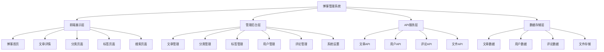

# 博客管理系统

## 系统架构设计

### 整体架构


### 技术栈选择
| 层级 | 技术选择 | 说明 |
|------|----------|------|
| 前端框架 | React/Vue.js | 组件化开发 |
| 状态管理 | Redux/Vuex | 全局状态管理 |
| 路由 | React Router/Vue Router | 单页应用路由 |
| UI组件 | Ant Design/Element UI | 管理后台UI |
| 编辑器 | Quill.js/TinyMCE | 富文本编辑器 |
| 构建工具 | Webpack/Vite | 模块打包 |
| 后端框架 | Node.js/Express | API服务 |
| 数据库 | MongoDB/MySQL | 数据存储 |
| 文件存储 | 本地存储/云存储 | 文件管理 |

## 核心功能模块

### 文章管理模块
```javascript
// 1. 文章数据模型
class Article {
  constructor(data) {
    this.id = data.id;
    this.title = data.title;
    this.content = data.content;
    this.excerpt = data.excerpt;
    this.slug = data.slug;
    this.status = data.status; // draft, published, archived
    this.author = data.author;
    this.categories = data.categories || [];
    this.tags = data.tags || [];
    this.featuredImage = data.featuredImage;
    this.views = data.views || 0;
    this.likes = data.likes || 0;
    this.comments = data.comments || [];
    this.createdAt = data.createdAt;
    this.updatedAt = data.updatedAt;
    this.publishedAt = data.publishedAt;
  }
  
  // 生成摘要
  generateExcerpt(length = 200) {
    if (this.excerpt) {
      return this.excerpt;
    }
    
    // 从内容中提取纯文本
    const textContent = this.content.replace(/<[^>]*>/g, '');
    return textContent.length > length ? 
      textContent.substring(0, length) + '...' : 
      textContent;
  }
  
  // 生成URL友好的slug
  generateSlug() {
    if (this.slug) {
      return this.slug;
    }
    
    return this.title
      .toLowerCase()
      .replace(/[^\w\s-]/g, '')
      .replace(/\s+/g, '-')
      .trim();
  }
  
  // 检查是否已发布
  isPublished() {
    return this.status === 'published';
  }
  
  // 检查是否为草稿
  isDraft() {
    return this.status === 'draft';
  }
  
  // 格式化创建时间
  getFormattedCreatedAt() {
    return new Date(this.createdAt).toLocaleDateString('zh-CN');
  }
  
  // 获取阅读时间估算
  getReadingTime() {
    const wordsPerMinute = 200;
    const wordCount = this.content.replace(/<[^>]*>/g, '').split(/\s+/).length;
    return Math.ceil(wordCount / wordsPerMinute);
  }
  
  // 增加浏览量
  incrementViews() {
    this.views++;
  }
  
  // 增加点赞数
  incrementLikes() {
    this.likes++;
  }
  
  // 添加评论
  addComment(comment) {
    this.comments.push(comment);
  }
  
  // 获取评论数
  getCommentCount() {
    return this.comments.length;
  }
}

// 2. 文章服务类
class ArticleService {
  constructor() {
    this.baseURL = '/api/articles';
    this.cache = new Map();
    this.cacheTimeout = 5 * 60 * 1000; // 5分钟
  }
  
  // 获取文章列表
  async getArticles(params = {}) {
    const cacheKey = `articles_${JSON.stringify(params)}`;
    
    if (this.cache.has(cacheKey)) {
      const cached = this.cache.get(cacheKey);
      if (Date.now() - cached.timestamp < this.cacheTimeout) {
        return cached.data;
      }
    }
    
    try {
      const queryString = new URLSearchParams(params).toString();
      const response = await fetch(`${this.baseURL}?${queryString}`);
      
      if (!response.ok) {
        throw new Error(`获取文章列表失败: ${response.status}`);
      }
      
      const data = await response.json();
      const articles = data.articles.map(item => new Article(item));
      
      // 缓存数据
      this.cache.set(cacheKey, {
        data: { articles, total: data.total, pages: data.pages },
        timestamp: Date.now()
      });
      
      return { articles, total: data.total, pages: data.pages };
    } catch (error) {
      console.error('获取文章列表失败:', error);
      throw error;
    }
  }
  
  // 获取文章详情
  async getArticle(id) {
    const cacheKey = `article_${id}`;
    
    if (this.cache.has(cacheKey)) {
      const cached = this.cache.get(cacheKey);
      if (Date.now() - cached.timestamp < this.cacheTimeout) {
        return cached.data;
      }
    }
    
    try {
      const response = await fetch(`${this.baseURL}/${id}`);
      
      if (!response.ok) {
        throw new Error(`获取文章详情失败: ${response.status}`);
      }
      
      const data = await response.json();
      const article = new Article(data);
      
      // 缓存数据
      this.cache.set(cacheKey, {
        data: article,
        timestamp: Date.now()
      });
      
      return article;
    } catch (error) {
      console.error('获取文章详情失败:', error);
      throw error;
    }
  }
  
  // 根据slug获取文章
  async getArticleBySlug(slug) {
    try {
      const response = await fetch(`${this.baseURL}/slug/${slug}`);
      
      if (!response.ok) {
        throw new Error(`获取文章失败: ${response.status}`);
      }
      
      const data = await response.json();
      return new Article(data);
    } catch (error) {
      console.error('获取文章失败:', error);
      throw error;
    }
  }
  
  // 创建文章
  async createArticle(articleData) {
    try {
      const response = await fetch(this.baseURL, {
        method: 'POST',
        headers: {
          'Content-Type': 'application/json'
        },
        body: JSON.stringify(articleData)
      });
      
      if (!response.ok) {
        throw new Error(`创建文章失败: ${response.status}`);
      }
      
      const data = await response.json();
      const article = new Article(data);
      
      // 清除相关缓存
      this.clearCache();
      
      return article;
    } catch (error) {
      console.error('创建文章失败:', error);
      throw error;
    }
  }
  
  // 更新文章
  async updateArticle(id, articleData) {
    try {
      const response = await fetch(`${this.baseURL}/${id}`, {
        method: 'PUT',
        headers: {
          'Content-Type': 'application/json'
        },
        body: JSON.stringify(articleData)
      });
      
      if (!response.ok) {
        throw new Error(`更新文章失败: ${response.status}`);
      }
      
      const data = await response.json();
      const article = new Article(data);
      
      // 清除相关缓存
      this.clearCache();
      
      return article;
    } catch (error) {
      console.error('更新文章失败:', error);
      throw error;
    }
  }
  
  // 删除文章
  async deleteArticle(id) {
    try {
      const response = await fetch(`${this.baseURL}/${id}`, {
        method: 'DELETE'
      });
      
      if (!response.ok) {
        throw new Error(`删除文章失败: ${response.status}`);
      }
      
      // 清除相关缓存
      this.clearCache();
      
      return true;
    } catch (error) {
      console.error('删除文章失败:', error);
      throw error;
    }
  }
  
  // 发布文章
  async publishArticle(id) {
    try {
      const response = await fetch(`${this.baseURL}/${id}/publish`, {
        method: 'POST'
      });
      
      if (!response.ok) {
        throw new Error(`发布文章失败: ${response.status}`);
      }
      
      const data = await response.json();
      const article = new Article(data);
      
      // 清除相关缓存
      this.clearCache();
      
      return article;
    } catch (error) {
      console.error('发布文章失败:', error);
      throw error;
    }
  }
  
  // 搜索文章
  async searchArticles(keyword, filters = {}) {
    try {
      const params = {
        keyword: keyword,
        ...filters
      };
      
      const queryString = new URLSearchParams(params).toString();
      const response = await fetch(`${this.baseURL}/search?${queryString}`);
      
      if (!response.ok) {
        throw new Error(`搜索文章失败: ${response.status}`);
      }
      
      const data = await response.json();
      return {
        articles: data.articles.map(item => new Article(item)),
        total: data.total,
        pages: data.pages
      };
    } catch (error) {
      console.error('搜索文章失败:', error);
      throw error;
    }
  }
  
  // 获取热门文章
  async getPopularArticles(limit = 10) {
    try {
      const response = await fetch(`${this.baseURL}/popular?limit=${limit}`);
      
      if (!response.ok) {
        throw new Error(`获取热门文章失败: ${response.status}`);
      }
      
      const data = await response.json();
      return data.articles.map(item => new Article(item));
    } catch (error) {
      console.error('获取热门文章失败:', error);
      throw error;
    }
  }
  
  // 获取相关文章
  async getRelatedArticles(articleId, limit = 5) {
    try {
      const response = await fetch(`${this.baseURL}/${articleId}/related?limit=${limit}`);
      
      if (!response.ok) {
        throw new Error(`获取相关文章失败: ${response.status}`);
      }
      
      const data = await response.json();
      return data.articles.map(item => new Article(item));
    } catch (error) {
      console.error('获取相关文章失败:', error);
      throw error;
    }
  }
  
  // 增加浏览量
  async incrementViews(id) {
    try {
      const response = await fetch(`${this.baseURL}/${id}/views`, {
        method: 'POST'
      });
      
      if (!response.ok) {
        throw new Error(`更新浏览量失败: ${response.status}`);
      }
      
      return true;
    } catch (error) {
      console.error('更新浏览量失败:', error);
      return false;
    }
  }
  
  // 清除缓存
  clearCache() {
    this.cache.clear();
  }
}

// 3. 文章编辑器组件
class ArticleEditor {
  constructor(container, options = {}) {
    this.container = container;
    this.options = {
      autoSave: true,
      autoSaveInterval: 30000, // 30秒
      ...options
    };
    
    this.article = null;
    this.isDirty = false;
    this.autoSaveTimer = null;
    this.editor = null;
    
    this.init();
  }
  
  init() {
    this.render();
    this.initEditor();
    this.bindEvents();
    
    if (this.options.autoSave) {
      this.startAutoSave();
    }
  }
  
  render() {
    this.container.innerHTML = `
      <div class="article-editor">
        <div class="editor-header">
          <div class="editor-actions">
            <button class="save-btn">保存</button>
            <button class="publish-btn">发布</button>
            <button class="preview-btn">预览</button>
          </div>
          <div class="editor-status">
            <span class="status-text">已保存</span>
            <span class="word-count">0 字</span>
          </div>
        </div>
        
        <div class="editor-form">
          <div class="form-group">
            <label>文章标题</label>
            <input type="text" id="articleTitle" placeholder="输入文章标题" />
          </div>
          
          <div class="form-group">
            <label>文章摘要</label>
            <textarea id="articleExcerpt" placeholder="输入文章摘要（可选）"></textarea>
          </div>
          
          <div class="form-group">
            <label>分类</label>
            <select id="articleCategories" multiple>
              <!-- 分类选项将动态加载 -->
            </select>
          </div>
          
          <div class="form-group">
            <label>标签</label>
            <input type="text" id="articleTags" placeholder="输入标签，用逗号分隔" />
          </div>
          
          <div class="form-group">
            <label>特色图片</label>
            <div class="featured-image-upload">
              <input type="file" id="featuredImageInput" accept="image/*" />
              <div class="image-preview" id="imagePreview"></div>
              <button class="upload-btn">选择图片</button>
            </div>
          </div>
        </div>
        
        <div class="editor-content">
          <div id="editor" class="quill-editor"></div>
        </div>
      </div>
    `;
  }
  
  initEditor() {
    // 初始化Quill编辑器
    this.editor = new Quill('#editor', {
      theme: 'snow',
      modules: {
        toolbar: [
          [{ 'header': [1, 2, 3, 4, 5, 6, false] }],
          ['bold', 'italic', 'underline', 'strike'],
          [{ 'color': [] }, { 'background': [] }],
          [{ 'list': 'ordered'}, { 'list': 'bullet' }],
          [{ 'indent': '-1'}, { 'indent': '+1' }],
          ['blockquote', 'code-block'],
          ['link', 'image', 'video'],
          ['clean']
        ]
      },
      placeholder: '开始写作...'
    });
    
    // 监听内容变化
    this.editor.on('text-change', () => {
      this.isDirty = true;
      this.updateWordCount();
      this.updateStatus('未保存');
    });
  }
  
  bindEvents() {
    // 标题输入
    const titleInput = this.container.querySelector('#articleTitle');
    titleInput.addEventListener('input', () => {
      this.isDirty = true;
      this.updateStatus('未保存');
    });
    
    // 摘要输入
    const excerptInput = this.container.querySelector('#articleExcerpt');
    excerptInput.addEventListener('input', () => {
      this.isDirty = true;
      this.updateStatus('未保存');
    });
    
    // 标签输入
    const tagsInput = this.container.querySelector('#articleTags');
    tagsInput.addEventListener('input', () => {
      this.isDirty = true;
      this.updateStatus('未保存');
    });
    
    // 分类选择
    const categoriesSelect = this.container.querySelector('#articleCategories');
    categoriesSelect.addEventListener('change', () => {
      this.isDirty = true;
      this.updateStatus('未保存');
    });
    
    // 特色图片上传
    const imageInput = this.container.querySelector('#featuredImageInput');
    imageInput.addEventListener('change', (e) => {
      this.handleImageUpload(e.target.files[0]);
    });
    
    // 保存按钮
    this.container.querySelector('.save-btn').addEventListener('click', () => {
      this.save();
    });
    
    // 发布按钮
    this.container.querySelector('.publish-btn').addEventListener('click', () => {
      this.publish();
    });
    
    // 预览按钮
    this.container.querySelector('.preview-btn').addEventListener('click', () => {
      this.preview();
    });
    
    // 键盘快捷键
    document.addEventListener('keydown', (e) => {
      if (e.ctrlKey || e.metaKey) {
        switch (e.key) {
          case 's':
            e.preventDefault();
            this.save();
            break;
          case 'p':
            e.preventDefault();
            this.publish();
            break;
        }
      }
    });
  }
  
  // 加载文章数据
  loadArticle(article) {
    this.article = article;
    
    // 填充表单
    this.container.querySelector('#articleTitle').value = article.title || '';
    this.container.querySelector('#articleExcerpt').value = article.excerpt || '';
    this.container.querySelector('#articleTags').value = article.tags ? article.tags.join(', ') : '';
    
    // 设置编辑器内容
    this.editor.setContents(article.content || '');
    
    // 设置分类
    this.setCategories(article.categories || []);
    
    // 设置特色图片
    if (article.featuredImage) {
      this.setFeaturedImage(article.featuredImage);
    }
    
    this.isDirty = false;
    this.updateStatus('已加载');
  }
  
  // 获取文章数据
  getArticleData() {
    return {
      title: this.container.querySelector('#articleTitle').value,
      excerpt: this.container.querySelector('#articleExcerpt').value,
      content: this.editor.getContents(),
      tags: this.getTags(),
      categories: this.getCategories(),
      featuredImage: this.getFeaturedImage(),
      status: 'draft'
    };
  }
  
  // 保存文章
  async save() {
    try {
      const articleData = this.getArticleData();
      
      if (this.article && this.article.id) {
        // 更新现有文章
        const updatedArticle = await this.articleService.updateArticle(this.article.id, articleData);
        this.article = updatedArticle;
      } else {
        // 创建新文章
        const newArticle = await this.articleService.createArticle(articleData);
        this.article = newArticle;
      }
      
      this.isDirty = false;
      this.updateStatus('已保存');
      
      return true;
    } catch (error) {
      console.error('保存文章失败:', error);
      this.updateStatus('保存失败');
      return false;
    }
  }
  
  // 发布文章
  async publish() {
    try {
      // 先保存
      const saved = await this.save();
      if (!saved) {
        return false;
      }
      
      // 发布
      const publishedArticle = await this.articleService.publishArticle(this.article.id);
      this.article = publishedArticle;
      
      this.updateStatus('已发布');
      return true;
    } catch (error) {
      console.error('发布文章失败:', error);
      this.updateStatus('发布失败');
      return false;
    }
  }
  
  // 预览文章
  preview() {
    const articleData = this.getArticleData();
    
    // 打开预览窗口
    const previewWindow = window.open('', '_blank');
    previewWindow.document.write(`
      <html>
        <head>
          <title>${articleData.title} - 预览</title>
          <style>
            body { font-family: Arial, sans-serif; max-width: 800px; margin: 0 auto; padding: 20px; }
            h1 { color: #333; border-bottom: 2px solid #eee; padding-bottom: 10px; }
            .meta { color: #666; font-size: 14px; margin-bottom: 20px; }
            .content { line-height: 1.6; }
          </style>
        </head>
        <body>
          <h1>${articleData.title}</h1>
          <div class="meta">
            ${articleData.excerpt ? `<p>${articleData.excerpt}</p>` : ''}
            <p>标签: ${articleData.tags.join(', ')}</p>
          </div>
          <div class="content">
            ${this.editor.root.innerHTML}
          </div>
        </body>
      </html>
    `);
  }
  
  // 处理图片上传
  async handleImageUpload(file) {
    if (!file) return;
    
    try {
      const formData = new FormData();
      formData.append('image', file);
      
      const response = await fetch('/api/upload/image', {
        method: 'POST',
        body: formData
      });
      
      if (!response.ok) {
        throw new Error('图片上传失败');
      }
      
      const data = await response.json();
      this.setFeaturedImage(data.url);
      
    } catch (error) {
      console.error('图片上传失败:', error);
      alert('图片上传失败，请重试');
    }
  }
  
  // 设置特色图片
  setFeaturedImage(imageUrl) {
    const preview = this.container.querySelector('#imagePreview');
    preview.innerHTML = ``;
    this.isDirty = true;
  }
  
  // 获取特色图片
  getFeaturedImage() {
    const preview = this.container.querySelector('#imagePreview img');
    return preview ? preview.src : null;
  }
  
  // 获取标签
  getTags() {
    const tagsInput = this.container.querySelector('#articleTags');
    return tagsInput.value.split(',').map(tag => tag.trim()).filter(tag => tag);
  }
  
  // 获取分类
  getCategories() {
    const categoriesSelect = this.container.querySelector('#articleCategories');
    return Array.from(categoriesSelect.selectedOptions).map(option => option.value);
  }
  
  // 设置分类
  setCategories(categories) {
    const categoriesSelect = this.container.querySelector('#articleCategories');
    Array.from(categoriesSelect.options).forEach(option => {
      option.selected = categories.includes(option.value);
    });
  }
  
  // 更新状态
  updateStatus(status) {
    const statusText = this.container.querySelector('.status-text');
    if (statusText) {
      statusText.textContent = status;
    }
  }
  
  // 更新字数统计
  updateWordCount() {
    const content = this.editor.getText();
    const wordCount = content.length;
    const wordCountElement = this.container.querySelector('.word-count');
    if (wordCountElement) {
      wordCountElement.textContent = `${wordCount} 字`;
    }
  }
  
  // 开始自动保存
  startAutoSave() {
    this.autoSaveTimer = setInterval(() => {
      if (this.isDirty) {
        this.save();
      }
    }, this.options.autoSaveInterval);
  }
  
  // 停止自动保存
  stopAutoSave() {
    if (this.autoSaveTimer) {
      clearInterval(this.autoSaveTimer);
      this.autoSaveTimer = null;
    }
  }
  
  // 销毁编辑器
  destroy() {
    this.stopAutoSave();
    if (this.editor) {
      this.editor = null;
    }
  }
}
```

## 相关链接
- [[05-实战项目/03-综合项目/01-电商网站前端]] - 电商系统
- [[05-实战项目/03-综合项目/03-在线教育平台]] - 教育平台
- [[05-实战项目/03-综合项目/04-企业级应用架构]] - 企业架构
- [[03-应用实践层/04-工程化/01-构建工具(Webpack-Vite)]] - 构建工具
- [[04-高级精通层/03-性能优化/01-内存管理]] - 性能优化
