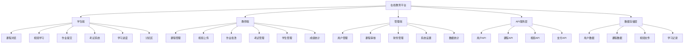

# 在线教育平台

## 平台架构设计

### 整体架构


### 技术栈选择
| 层级 | 技术选择 | 说明 |
|------|----------|------|
| 前端框架 | React/Vue.js | 组件化开发 |
| 状态管理 | Redux/Vuex | 全局状态管理 |
| 路由 | React Router/Vue Router | 单页应用路由 |
| UI组件 | Ant Design/Element UI | 快速开发 |
| 视频播放 | Video.js/HLS.js | 视频流播放 |
| 实时通信 | WebSocket/Socket.io | 直播和聊天 |
| 文件存储 | 云存储/CDN | 视频和文件存储 |
| 支付集成 | 支付宝/微信支付 | 在线支付 |

## 核心功能模块

### 课程管理模块
```javascript
// 1. 课程数据模型
class Course {
  constructor(data) {
    this.id = data.id;
    this.title = data.title;
    this.description = data.description;
    this.thumbnail = data.thumbnail;
    this.instructor = data.instructor;
    this.category = data.category;
    this.level = data.level; // beginner, intermediate, advanced
    this.duration = data.duration; // 总时长（分钟）
    this.price = data.price;
    this.originalPrice = data.originalPrice;
    this.status = data.status; // draft, published, archived
    this.rating = data.rating;
    this.studentCount = data.studentCount;
    this.lessons = data.lessons || [];
    this.requirements = data.requirements || [];
    this.learningOutcomes = data.learningOutcomes || [];
    this.createdAt = data.createdAt;
    this.updatedAt = data.updatedAt;
  }
  
  // 计算折扣
  getDiscount() {
    if (this.originalPrice > this.price) {
      return Math.round((1 - this.price / this.originalPrice) * 100);
    }
    return 0;
  }
  
  // 格式化价格
  getFormattedPrice() {
    return this.price > 0 ? `¥${this.price.toFixed(2)}` : '免费';
  }
  
  // 获取原价
  getFormattedOriginalPrice() {
    return this.originalPrice ? `¥${this.originalPrice.toFixed(2)}` : null;
  }
  
  // 格式化时长
  getFormattedDuration() {
    const hours = Math.floor(this.duration / 60);
    const minutes = this.duration % 60;
    return `${hours}小时${minutes}分钟`;
  }
  
  // 获取课程进度
  getProgress(studentId) {
    // 这里需要根据学生的学习记录计算进度
    return 0;
  }
  
  // 检查是否已购买
  isPurchased(studentId) {
    // 这里需要检查学生的购买记录
    return false;
  }
  
  // 获取课程评分
  getRating() {
    return this.rating.toFixed(1);
  }
  
  // 获取学生数量
  getStudentCount() {
    return this.studentCount;
  }
  
  // 获取课程状态
  getStatus() {
    const statusMap = {
      draft: '草稿',
      published: '已发布',
      archived: '已归档'
    };
    return statusMap[this.status] || '未知';
  }
  
  // 获取难度等级
  getLevel() {
    const levelMap = {
      beginner: '初级',
      intermediate: '中级',
      advanced: '高级'
    };
    return levelMap[this.level] || '未知';
  }
}

// 2. 课程服务类
class CourseService {
  constructor() {
    this.baseURL = '/api/courses';
    this.cache = new Map();
    this.cacheTimeout = 5 * 60 * 1000; // 5分钟
  }
  
  // 获取课程列表
  async getCourses(params = {}) {
    const cacheKey = `courses_${JSON.stringify(params)}`;
    
    if (this.cache.has(cacheKey)) {
      const cached = this.cache.get(cacheKey);
      if (Date.now() - cached.timestamp < this.cacheTimeout) {
        return cached.data;
      }
    }
    
    try {
      const queryString = new URLSearchParams(params).toString();
      const response = await fetch(`${this.baseURL}?${queryString}`);
      
      if (!response.ok) {
        throw new Error(`获取课程列表失败: ${response.status}`);
      }
      
      const data = await response.json();
      const courses = data.courses.map(item => new Course(item));
      
      // 缓存数据
      this.cache.set(cacheKey, {
        data: { courses, total: data.total, pages: data.pages },
        timestamp: Date.now()
      });
      
      return { courses, total: data.total, pages: data.pages };
    } catch (error) {
      console.error('获取课程列表失败:', error);
      throw error;
    }
  }
  
  // 获取课程详情
  async getCourse(id) {
    const cacheKey = `course_${id}`;
    
    if (this.cache.has(cacheKey)) {
      const cached = this.cache.get(cacheKey);
      if (Date.now() - cached.timestamp < this.cacheTimeout) {
        return cached.data;
      }
    }
    
    try {
      const response = await fetch(`${this.baseURL}/${id}`);
      
      if (!response.ok) {
        throw new Error(`获取课程详情失败: ${response.status}`);
      }
      
      const data = await response.json();
      const course = new Course(data);
      
      // 缓存数据
      this.cache.set(cacheKey, {
        data: course,
        timestamp: Date.now()
      });
      
      return course;
    } catch (error) {
      console.error('获取课程详情失败:', error);
      throw error;
    }
  }
  
  // 创建课程
  async createCourse(courseData) {
    try {
      const response = await fetch(this.baseURL, {
        method: 'POST',
        headers: {
          'Content-Type': 'application/json'
        },
        body: JSON.stringify(courseData)
      });
      
      if (!response.ok) {
        throw new Error(`创建课程失败: ${response.status}`);
      }
      
      const data = await response.json();
      const course = new Course(data);
      
      // 清除相关缓存
      this.clearCache();
      
      return course;
    } catch (error) {
      console.error('创建课程失败:', error);
      throw error;
    }
  }
  
  // 更新课程
  async updateCourse(id, courseData) {
    try {
      const response = await fetch(`${this.baseURL}/${id}`, {
        method: 'PUT',
        headers: {
          'Content-Type': 'application/json'
        },
        body: JSON.stringify(courseData)
      });
      
      if (!response.ok) {
        throw new Error(`更新课程失败: ${response.status}`);
      }
      
      const data = await response.json();
      const course = new Course(data);
      
      // 清除相关缓存
      this.clearCache();
      
      return course;
    } catch (error) {
      console.error('更新课程失败:', error);
      throw error;
    }
  }
  
  // 删除课程
  async deleteCourse(id) {
    try {
      const response = await fetch(`${this.baseURL}/${id}`, {
        method: 'DELETE'
      });
      
      if (!response.ok) {
        throw new Error(`删除课程失败: ${response.status}`);
      }
      
      // 清除相关缓存
      this.clearCache();
      
      return true;
    } catch (error) {
      console.error('删除课程失败:', error);
      throw error;
    }
  }
  
  // 发布课程
  async publishCourse(id) {
    try {
      const response = await fetch(`${this.baseURL}/${id}/publish`, {
        method: 'POST'
      });
      
      if (!response.ok) {
        throw new Error(`发布课程失败: ${response.status}`);
      }
      
      const data = await response.json();
      const course = new Course(data);
      
      // 清除相关缓存
      this.clearCache();
      
      return course;
    } catch (error) {
      console.error('发布课程失败:', error);
      throw error;
    }
  }
  
  // 搜索课程
  async searchCourses(keyword, filters = {}) {
    try {
      const params = {
        keyword: keyword,
        ...filters
      };
      
      const queryString = new URLSearchParams(params).toString();
      const response = await fetch(`${this.baseURL}/search?${queryString}`);
      
      if (!response.ok) {
        throw new Error(`搜索课程失败: ${response.status}`);
      }
      
      const data = await response.json();
      return {
        courses: data.courses.map(item => new Course(item)),
        total: data.total,
        pages: data.pages
      };
    } catch (error) {
      console.error('搜索课程失败:', error);
      throw error;
    }
  }
  
  // 获取热门课程
  async getPopularCourses(limit = 10) {
    try {
      const response = await fetch(`${this.baseURL}/popular?limit=${limit}`);
      
      if (!response.ok) {
        throw new Error(`获取热门课程失败: ${response.status}`);
      }
      
      const data = await response.json();
      return data.courses.map(item => new Course(item));
    } catch (error) {
      console.error('获取热门课程失败:', error);
      throw error;
    }
  }
  
  // 获取推荐课程
  async getRecommendedCourses(studentId, limit = 5) {
    try {
      const response = await fetch(`${this.baseURL}/recommendations?studentId=${studentId}&limit=${limit}`);
      
      if (!response.ok) {
        throw new Error(`获取推荐课程失败: ${response.status}`);
      }
      
      const data = await response.json();
      return data.courses.map(item => new Course(item));
    } catch (error) {
      console.error('获取推荐课程失败:', error);
      throw error;
    }
  }
  
  // 购买课程
  async purchaseCourse(courseId, paymentMethod) {
    try {
      const response = await fetch(`${this.baseURL}/${courseId}/purchase`, {
        method: 'POST',
        headers: {
          'Content-Type': 'application/json'
        },
        body: JSON.stringify({ paymentMethod })
      });
      
      if (!response.ok) {
        throw new Error(`购买课程失败: ${response.status}`);
      }
      
      const data = await response.json();
      return data;
    } catch (error) {
      console.error('购买课程失败:', error);
      throw error;
    }
  }
  
  // 清除缓存
  clearCache() {
    this.cache.clear();
  }
}

// 3. 课程卡片组件
class CourseCard {
  constructor(course, options = {}) {
    this.course = course;
    this.options = {
      showInstructor: true,
      showRating: true,
      showStudentCount: true,
      showPrice: true,
      ...options
    };
  }
  
  render() {
    const discount = this.course.getDiscount();
    
    return `
      <div class="course-card" data-course-id="${this.course.id}">
        <div class="course-thumbnail">
          
          ${discount > 0 ? `<div class="discount-badge">-${discount}%</div>` : ''}
          <div class="course-duration">${this.course.getFormattedDuration()}</div>
        </div>
        
        <div class="course-info">
          <h3 class="course-title">${this.course.title}</h3>
          
          ${this.options.showInstructor ? `
            <div class="course-instructor">
              <span class="instructor-name">${this.course.instructor.name}</span>
            </div>
          ` : ''}
          
          <div class="course-meta">
            ${this.options.showRating ? `
              <div class="course-rating">
                <div class="stars">
                  ${this.renderStars(this.course.rating)}
                </div>
                <span class="rating-text">${this.course.getRating()}</span>
              </div>
            ` : ''}
            
            ${this.options.showStudentCount ? `
              <div class="course-students">
                <span class="student-count">${this.course.getStudentCount()} 人学习</span>
              </div>
            ` : ''}
          </div>
          
          <div class="course-description">
            ${this.course.description.substring(0, 100)}...
          </div>
          
          <div class="course-tags">
            <span class="course-level">${this.course.getLevel()}</span>
            <span class="course-category">${this.course.category}</span>
          </div>
        </div>
        
        <div class="course-footer">
          ${this.options.showPrice ? `
            <div class="course-price">
              <span class="current-price">${this.course.getFormattedPrice()}</span>
              ${this.course.getFormattedOriginalPrice() ? 
                `<span class="original-price">${this.course.getFormattedOriginalPrice()}</span>` : ''}
            </div>
          ` : ''}
          
          <div class="course-actions">
            <button class="view-course-btn">查看课程</button>
            <button class="favorite-btn" data-course-id="${this.course.id}">
              <span class="heart-icon">♡</span>
            </button>
          </div>
        </div>
      </div>
    `;
  }
  
  renderStars(rating) {
    const fullStars = Math.floor(rating);
    const hasHalfStar = rating % 1 >= 0.5;
    const emptyStars = 5 - fullStars - (hasHalfStar ? 1 : 0);
    
    let stars = '';
    
    // 实心星
    for (let i = 0; i < fullStars; i++) {
      stars += '<span class="star full">★</span>';
    }
    
    // 半星
    if (hasHalfStar) {
      stars += '<span class="star half">★</span>';
    }
    
    // 空心星
    for (let i = 0; i < emptyStars; i++) {
      stars += '<span class="star empty">☆</span>';
    }
    
    return stars;
  }
}

// 4. 课程列表组件
class CourseList {
  constructor(container, options = {}) {
    this.container = container;
    this.options = {
      itemsPerPage: 12,
      showPagination: true,
      showFilters: true,
      ...options
    };
    
    this.courses = [];
    this.currentPage = 1;
    this.totalPages = 1;
    this.filters = {};
    this.sortBy = 'default';
    this.courseService = new CourseService();
    
    this.init();
  }
  
  async init() {
    await this.loadCourses();
    this.render();
    this.bindEvents();
  }
  
  async loadCourses() {
    try {
      const params = {
        page: this.currentPage,
        limit: this.options.itemsPerPage,
        sort: this.sortBy,
        ...this.filters
      };
      
      const response = await this.courseService.getCourses(params);
      this.courses = response.courses;
      this.totalPages = response.pages;
    } catch (error) {
      console.error('加载课程失败:', error);
      this.showError('加载课程失败，请稍后重试');
    }
  }
  
  render() {
    this.container.innerHTML = `
      <div class="course-list">
        ${this.options.showFilters ? this.renderFilters() : ''}
        <div class="course-grid" id="courseGrid">
          ${this.courses.map(course => {
            const card = new CourseCard(course);
            return card.render();
          }).join('')}
        </div>
        ${this.options.showPagination ? this.renderPagination() : ''}
      </div>
    `;
  }
  
  renderFilters() {
    return `
      <div class="course-filters">
        <div class="filter-group">
          <label>排序方式:</label>
          <select id="sortSelect">
            <option value="default">默认排序</option>
            <option value="price_asc">价格从低到高</option>
            <option value="price_desc">价格从高到低</option>
            <option value="rating_desc">评分从高到低</option>
            <option value="student_count_desc">学习人数从多到少</option>
            <option value="created_at_desc">最新发布</option>
          </select>
        </div>
        
        <div class="filter-group">
          <label>价格范围:</label>
          <input type="range" id="priceRange" min="0" max="1000" step="50" />
          <span id="priceValue">0 - 1000</span>
        </div>
        
        <div class="filter-group">
          <label>难度等级:</label>
          <select id="levelSelect">
            <option value="">全部等级</option>
            <option value="beginner">初级</option>
            <option value="intermediate">中级</option>
            <option value="advanced">高级</option>
          </select>
        </div>
        
        <div class="filter-group">
          <label>课程分类:</label>
          <select id="categorySelect">
            <option value="">全部分类</option>
            <option value="programming">编程开发</option>
            <option value="design">设计创意</option>
            <option value="business">商业管理</option>
            <option value="marketing">营销推广</option>
          </select>
        </div>
        
        <div class="filter-group">
          <label>价格类型:</label>
          <select id="priceTypeSelect">
            <option value="">全部</option>
            <option value="free">免费</option>
            <option value="paid">付费</option>
          </select>
        </div>
      </div>
    `;
  }
  
  renderPagination() {
    if (this.totalPages <= 1) return '';
    
    let pagination = '<div class="pagination">';
    
    // 上一页
    if (this.currentPage > 1) {
      pagination += `<button class="page-btn" data-page="${this.currentPage - 1}">上一页</button>`;
    }
    
    // 页码
    const startPage = Math.max(1, this.currentPage - 2);
    const endPage = Math.min(this.totalPages, this.currentPage + 2);
    
    for (let i = startPage; i <= endPage; i++) {
      const activeClass = i === this.currentPage ? 'active' : '';
      pagination += `<button class="page-btn ${activeClass}" data-page="${i}">${i}</button>`;
    }
    
    // 下一页
    if (this.currentPage < this.totalPages) {
      pagination += `<button class="page-btn" data-page="${this.currentPage + 1}">下一页</button>`;
    }
    
    pagination += '</div>';
    return pagination;
  }
  
  bindEvents() {
    // 排序
    const sortSelect = this.container.querySelector('#sortSelect');
    if (sortSelect) {
      sortSelect.addEventListener('change', (e) => {
        this.sortBy = e.target.value;
        this.currentPage = 1;
        this.loadCourses().then(() => this.render());
      });
    }
    
    // 价格范围
    const priceRange = this.container.querySelector('#priceRange');
    if (priceRange) {
      priceRange.addEventListener('input', (e) => {
        const value = e.target.value;
        this.filters.maxPrice = value;
        this.currentPage = 1;
        this.loadCourses().then(() => this.render());
      });
    }
    
    // 难度等级
    const levelSelect = this.container.querySelector('#levelSelect');
    if (levelSelect) {
      levelSelect.addEventListener('change', (e) => {
        this.filters.level = e.target.value;
        this.currentPage = 1;
        this.loadCourses().then(() => this.render());
      });
    }
    
    // 课程分类
    const categorySelect = this.container.querySelector('#categorySelect');
    if (categorySelect) {
      categorySelect.addEventListener('change', (e) => {
        this.filters.category = e.target.value;
        this.currentPage = 1;
        this.loadCourses().then(() => this.render());
      });
    }
    
    // 价格类型
    const priceTypeSelect = this.container.querySelector('#priceTypeSelect');
    if (priceTypeSelect) {
      priceTypeSelect.addEventListener('change', (e) => {
        this.filters.priceType = e.target.value;
        this.currentPage = 1;
        this.loadCourses().then(() => this.render());
      });
    }
    
    // 分页
    this.container.addEventListener('click', (e) => {
      if (e.target.classList.contains('page-btn')) {
        const page = parseInt(e.target.dataset.page);
        if (page !== this.currentPage) {
          this.currentPage = page;
          this.loadCourses().then(() => this.render());
        }
      }
    });
    
    // 课程卡片事件
    this.container.addEventListener('click', (e) => {
      if (e.target.classList.contains('view-course-btn')) {
        const courseId = e.target.closest('.course-card').dataset.courseId;
        this.viewCourse(courseId);
      }
      
      if (e.target.classList.contains('favorite-btn')) {
        const courseId = e.target.dataset.courseId;
        this.toggleFavorite(courseId);
      }
    });
  }
  
  viewCourse(courseId) {
    window.location.href = `/courses/${courseId}`;
  }
  
  async toggleFavorite(courseId) {
    try {
      const response = await fetch('/api/favorites/toggle', {
        method: 'POST',
        headers: {
          'Content-Type': 'application/json'
        },
        body: JSON.stringify({ courseId: courseId })
      });
      
      if (response.ok) {
        const heartIcon = document.querySelector(`[data-course-id="${courseId}"] .heart-icon`);
        heartIcon.textContent = heartIcon.textContent === '♡' ? '♥' : '♡';
      }
    } catch (error) {
      console.error('收藏操作失败:', error);
    }
  }
  
  showError(message) {
    console.error('错误:', message);
  }
}
```

## 相关链接
- [[05-实战项目/03-综合项目/01-电商网站前端]] - 电商系统
- [[05-实战项目/03-综合项目/02-博客管理系统]] - 博客系统
- [[05-实战项目/03-综合项目/04-企业级应用架构]] - 企业架构
- [[03-应用实践层/04-工程化/01-构建工具(Webpack-Vite)]] - 构建工具
- [[04-高级精通层/03-性能优化/01-内存管理]] - 性能优化
