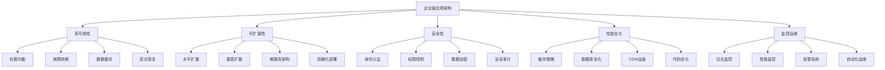

# 企业级应用架构

## 架构设计原则

### 企业级架构特点


### 架构设计原则
| 原则 | 描述 | 实现方式 |
|------|------|----------|
| 单一职责 | 每个模块只负责一个功能 | 模块化设计、微服务架构 |
| 开闭原则 | 对扩展开放，对修改关闭 | 接口抽象、插件化架构 |
| 里氏替换 | 子类可以替换父类 | 继承设计、多态实现 |
| 接口隔离 | 客户端不应依赖不需要的接口 | 接口拆分、依赖注入 |
| 依赖倒置 | 依赖抽象而非具体实现 | 依赖注入、控制反转 |
| 高内聚低耦合 | 模块内部紧密相关，模块间松散耦合 | 分层架构、事件驱动 |

## 微服务架构

### 服务拆分策略
```javascript
// 1. 用户服务
class UserService {
  constructor() {
    this.baseURL = '/api/users';
    this.cache = new Map();
  }
  
  // 用户注册
  async register(userData) {
    try {
      const response = await fetch(`${this.baseURL}/register`, {
        method: 'POST',
        headers: {
          'Content-Type': 'application/json'
        },
        body: JSON.stringify(userData)
      });
      
      if (!response.ok) {
        throw new Error(`注册失败: ${response.status}`);
      }
      
      return await response.json();
    } catch (error) {
      console.error('用户注册失败:', error);
      throw error;
    }
  }
  
  // 用户登录
  async login(credentials) {
    try {
      const response = await fetch(`${this.baseURL}/login`, {
        method: 'POST',
        headers: {
          'Content-Type': 'application/json'
        },
        body: JSON.stringify(credentials)
      });
      
      if (!response.ok) {
        throw new Error(`登录失败: ${response.status}`);
      }
      
      const data = await response.json();
      
      // 存储token
      localStorage.setItem('authToken', data.token);
      
      return data;
    } catch (error) {
      console.error('用户登录失败:', error);
      throw error;
    }
  }
  
  // 获取用户信息
  async getUserInfo(userId) {
    const cacheKey = `user_${userId}`;
    
    if (this.cache.has(cacheKey)) {
      return this.cache.get(cacheKey);
    }
    
    try {
      const response = await fetch(`${this.baseURL}/${userId}`, {
        headers: {
          'Authorization': `Bearer ${localStorage.getItem('authToken')}`
        }
      });
      
      if (!response.ok) {
        throw new Error(`获取用户信息失败: ${response.status}`);
      }
      
      const userInfo = await response.json();
      this.cache.set(cacheKey, userInfo);
      
      return userInfo;
    } catch (error) {
      console.error('获取用户信息失败:', error);
      throw error;
    }
  }
  
  // 更新用户信息
  async updateUser(userId, userData) {
    try {
      const response = await fetch(`${this.baseURL}/${userId}`, {
        method: 'PUT',
        headers: {
          'Content-Type': 'application/json',
          'Authorization': `Bearer ${localStorage.getItem('authToken')}`
        },
        body: JSON.stringify(userData)
      });
      
      if (!response.ok) {
        throw new Error(`更新用户信息失败: ${response.status}`);
      }
      
      const updatedUser = await response.json();
      
      // 更新缓存
      this.cache.set(`user_${userId}`, updatedUser);
      
      return updatedUser;
    } catch (error) {
      console.error('更新用户信息失败:', error);
      throw error;
    }
  }
  
  // 用户登出
  async logout() {
    try {
      await fetch(`${this.baseURL}/logout`, {
        method: 'POST',
        headers: {
          'Authorization': `Bearer ${localStorage.getItem('authToken')}`
        }
      });
      
      // 清除本地存储
      localStorage.removeItem('authToken');
      this.cache.clear();
      
      return true;
    } catch (error) {
      console.error('用户登出失败:', error);
      return false;
    }
  }
}

// 2. 订单服务
class OrderService {
  constructor() {
    this.baseURL = '/api/orders';
  }
  
  // 创建订单
  async createOrder(orderData) {
    try {
      const response = await fetch(this.baseURL, {
        method: 'POST',
        headers: {
          'Content-Type': 'application/json',
          'Authorization': `Bearer ${localStorage.getItem('authToken')}`
        },
        body: JSON.stringify(orderData)
      });
      
      if (!response.ok) {
        throw new Error(`创建订单失败: ${response.status}`);
      }
      
      return await response.json();
    } catch (error) {
      console.error('创建订单失败:', error);
      throw error;
    }
  }
  
  // 获取订单列表
  async getOrders(params = {}) {
    try {
      const queryString = new URLSearchParams(params).toString();
      const response = await fetch(`${this.baseURL}?${queryString}`, {
        headers: {
          'Authorization': `Bearer ${localStorage.getItem('authToken')}`
        }
      });
      
      if (!response.ok) {
        throw new Error(`获取订单列表失败: ${response.status}`);
      }
      
      return await response.json();
    } catch (error) {
      console.error('获取订单列表失败:', error);
      throw error;
    }
  }
  
  // 获取订单详情
  async getOrder(orderId) {
    try {
      const response = await fetch(`${this.baseURL}/${orderId}`, {
        headers: {
          'Authorization': `Bearer ${localStorage.getItem('authToken')}`
        }
      });
      
      if (!response.ok) {
        throw new Error(`获取订单详情失败: ${response.status}`);
      }
      
      return await response.json();
    } catch (error) {
      console.error('获取订单详情失败:', error);
      throw error;
    }
  }
  
  // 更新订单状态
  async updateOrderStatus(orderId, status) {
    try {
      const response = await fetch(`${this.baseURL}/${orderId}/status`, {
        method: 'PUT',
        headers: {
          'Content-Type': 'application/json',
          'Authorization': `Bearer ${localStorage.getItem('authToken')}`
        },
        body: JSON.stringify({ status })
      });
      
      if (!response.ok) {
        throw new Error(`更新订单状态失败: ${response.status}`);
      }
      
      return await response.json();
    } catch (error) {
      console.error('更新订单状态失败:', error);
      throw error;
    }
  }
  
  // 取消订单
  async cancelOrder(orderId) {
    try {
      const response = await fetch(`${this.baseURL}/${orderId}/cancel`, {
        method: 'POST',
        headers: {
          'Authorization': `Bearer ${localStorage.getItem('authToken')}`
        }
      });
      
      if (!response.ok) {
        throw new Error(`取消订单失败: ${response.status}`);
      }
      
      return await response.json();
    } catch (error) {
      console.error('取消订单失败:', error);
      throw error;
    }
  }
}

// 3. 支付服务
class PaymentService {
  constructor() {
    this.baseURL = '/api/payments';
  }
  
  // 创建支付
  async createPayment(paymentData) {
    try {
      const response = await fetch(this.baseURL, {
        method: 'POST',
        headers: {
          'Content-Type': 'application/json',
          'Authorization': `Bearer ${localStorage.getItem('authToken')}`
        },
        body: JSON.stringify(paymentData)
      });
      
      if (!response.ok) {
        throw new Error(`创建支付失败: ${response.status}`);
      }
      
      return await response.json();
    } catch (error) {
      console.error('创建支付失败:', error);
      throw error;
    }
  }
  
  // 处理支付回调
  async handlePaymentCallback(callbackData) {
    try {
      const response = await fetch(`${this.baseURL}/callback`, {
        method: 'POST',
        headers: {
          'Content-Type': 'application/json'
        },
        body: JSON.stringify(callbackData)
      });
      
      if (!response.ok) {
        throw new Error(`处理支付回调失败: ${response.status}`);
      }
      
      return await response.json();
    } catch (error) {
      console.error('处理支付回调失败:', error);
      throw error;
    }
  }
  
  // 查询支付状态
  async getPaymentStatus(paymentId) {
    try {
      const response = await fetch(`${this.baseURL}/${paymentId}/status`, {
        headers: {
          'Authorization': `Bearer ${localStorage.getItem('authToken')}`
        }
      });
      
      if (!response.ok) {
        throw new Error(`查询支付状态失败: ${response.status}`);
      }
      
      return await response.json();
    } catch (error) {
      console.error('查询支付状态失败:', error);
      throw error;
    }
  }
}

// 4. 通知服务
class NotificationService {
  constructor() {
    this.baseURL = '/api/notifications';
    this.ws = null;
    this.listeners = new Map();
  }
  
  // 建立WebSocket连接
  connect() {
    this.ws = new WebSocket('ws://localhost:8080/notifications');
    
    this.ws.onopen = () => {
      console.log('通知服务连接已建立');
    };
    
    this.ws.onmessage = (event) => {
      try {
        const notification = JSON.parse(event.data);
        this.handleNotification(notification);
      } catch (error) {
        console.error('解析通知失败:', error);
      }
    };
    
    this.ws.onclose = () => {
      console.log('通知服务连接已关闭');
      // 自动重连
      setTimeout(() => this.connect(), 3000);
    };
    
    this.ws.onerror = (error) => {
      console.error('通知服务连接错误:', error);
    };
  }
  
  // 处理通知
  handleNotification(notification) {
    const handlers = this.listeners.get(notification.type) || [];
    handlers.forEach(handler => handler(notification));
  }
  
  // 订阅通知
  subscribe(type, handler) {
    if (!this.listeners.has(type)) {
      this.listeners.set(type, []);
    }
    this.listeners.get(type).push(handler);
  }
  
  // 取消订阅
  unsubscribe(type, handler) {
    const handlers = this.listeners.get(type);
    if (handlers) {
      const index = handlers.indexOf(handler);
      if (index > -1) {
        handlers.splice(index, 1);
      }
    }
  }
  
  // 发送通知
  async sendNotification(notificationData) {
    try {
      const response = await fetch(this.baseURL, {
        method: 'POST',
        headers: {
          'Content-Type': 'application/json',
          'Authorization': `Bearer ${localStorage.getItem('authToken')}`
        },
        body: JSON.stringify(notificationData)
      });
      
      if (!response.ok) {
        throw new Error(`发送通知失败: ${response.status}`);
      }
      
      return await response.json();
    } catch (error) {
      console.error('发送通知失败:', error);
      throw error;
    }
  }
  
  // 获取通知列表
  async getNotifications(params = {}) {
    try {
      const queryString = new URLSearchParams(params).toString();
      const response = await fetch(`${this.baseURL}?${queryString}`, {
        headers: {
          'Authorization': `Bearer ${localStorage.getItem('authToken')}`
        }
      });
      
      if (!response.ok) {
        throw new Error(`获取通知列表失败: ${response.status}`);
      }
      
      return await response.json();
    } catch (error) {
      console.error('获取通知列表失败:', error);
      throw error;
    }
  }
  
  // 标记通知为已读
  async markAsRead(notificationId) {
    try {
      const response = await fetch(`${this.baseURL}/${notificationId}/read`, {
        method: 'PUT',
        headers: {
          'Authorization': `Bearer ${localStorage.getItem('authToken')}`
        }
      });
      
      if (!response.ok) {
        throw new Error(`标记通知为已读失败: ${response.status}`);
      }
      
      return await response.json();
    } catch (error) {
      console.error('标记通知为已读失败:', error);
      throw error;
    }
  }
}
```

### 服务间通信
```javascript
// 1. API网关
class APIGateway {
  constructor() {
    this.services = new Map();
    this.middlewares = [];
    this.init();
  }
  
  // 初始化
  init() {
    this.registerServices();
    this.setupMiddlewares();
  }
  
  // 注册服务
  registerServices() {
    this.services.set('user', new UserService());
    this.services.set('order', new OrderService());
    this.services.set('payment', new PaymentService());
    this.services.set('notification', new NotificationService());
  }
  
  // 设置中间件
  setupMiddlewares() {
    this.middlewares.push(this.authMiddleware.bind(this));
    this.middlewares.push(this.loggingMiddleware.bind(this));
    this.middlewares.push(this.rateLimitMiddleware.bind(this));
  }
  
  // 认证中间件
  async authMiddleware(request, response, next) {
    const token = request.headers.authorization?.replace('Bearer ', '');
    
    if (!token) {
      return response.status(401).json({ error: '未授权访问' });
    }
    
    try {
      // 验证token
      const user = await this.verifyToken(token);
      request.user = user;
      next();
    } catch (error) {
      return response.status(401).json({ error: '无效的token' });
    }
  }
  
  // 日志中间件
  async loggingMiddleware(request, response, next) {
    const startTime = Date.now();
    
    response.on('finish', () => {
      const duration = Date.now() - startTime;
      console.log(`${request.method} ${request.url} - ${response.statusCode} - ${duration}ms`);
    });
    
    next();
  }
  
  // 限流中间件
  async rateLimitMiddleware(request, response, next) {
    const clientId = request.ip;
    const key = `rate_limit_${clientId}`;
    
    // 检查请求频率
    const requests = await this.getRequestCount(key);
    
    if (requests > 100) { // 每分钟最多100次请求
      return response.status(429).json({ error: '请求过于频繁' });
    }
    
    await this.incrementRequestCount(key);
    next();
  }
  
  // 路由请求
  async route(request, response) {
    try {
      // 执行中间件
      for (const middleware of this.middlewares) {
        await middleware(request, response, () => {});
      }
      
      // 路由到具体服务
      const serviceName = this.extractServiceName(request.url);
      const service = this.services.get(serviceName);
      
      if (!service) {
        return response.status(404).json({ error: '服务不存在' });
      }
      
      // 调用服务方法
      const result = await service.handle(request);
      response.json(result);
      
    } catch (error) {
      console.error('API网关错误:', error);
      response.status(500).json({ error: '服务器内部错误' });
    }
  }
  
  // 提取服务名称
  extractServiceName(url) {
    const parts = url.split('/');
    return parts[2]; // /api/{service}/...
  }
  
  // 验证token
  async verifyToken(token) {
    // 实现token验证逻辑
    return { id: 1, name: 'test' };
  }
  
  // 获取请求计数
  async getRequestCount(key) {
    // 实现请求计数逻辑
    return 0;
  }
  
  // 增加请求计数
  async incrementRequestCount(key) {
    // 实现请求计数增加逻辑
  }
}

// 2. 服务发现
class ServiceDiscovery {
  constructor() {
    this.services = new Map();
    this.healthCheckInterval = 30000; // 30秒
    this.init();
  }
  
  // 初始化
  init() {
    this.startHealthCheck();
  }
  
  // 注册服务
  register(serviceName, serviceInfo) {
    this.services.set(serviceName, {
      ...serviceInfo,
      lastHealthCheck: Date.now(),
      status: 'healthy'
    });
  }
  
  // 注销服务
  unregister(serviceName) {
    this.services.delete(serviceName);
  }
  
  // 发现服务
  discover(serviceName) {
    const service = this.services.get(serviceName);
    
    if (!service || service.status !== 'healthy') {
      throw new Error(`服务 ${serviceName} 不可用`);
    }
    
    return service;
  }
  
  // 获取服务列表
  getServices() {
    return Array.from(this.services.entries()).map(([name, info]) => ({
      name,
      ...info
    }));
  }
  
  // 健康检查
  async healthCheck(serviceName, serviceInfo) {
    try {
      const response = await fetch(`${serviceInfo.url}/health`, {
        timeout: 5000
      });
      
      if (response.ok) {
        this.updateServiceStatus(serviceName, 'healthy');
      } else {
        this.updateServiceStatus(serviceName, 'unhealthy');
      }
    } catch (error) {
      console.error(`服务 ${serviceName} 健康检查失败:`, error);
      this.updateServiceStatus(serviceName, 'unhealthy');
    }
  }
  
  // 更新服务状态
  updateServiceStatus(serviceName, status) {
    const service = this.services.get(serviceName);
    if (service) {
      service.status = status;
      service.lastHealthCheck = Date.now();
    }
  }
  
  // 开始健康检查
  startHealthCheck() {
    setInterval(() => {
      for (const [name, info] of this.services) {
        this.healthCheck(name, info);
      }
    }, this.healthCheckInterval);
  }
}

// 3. 配置管理
class ConfigManager {
  constructor() {
    this.config = new Map();
    this.watchers = new Map();
    this.init();
  }
  
  // 初始化
  init() {
    this.loadDefaultConfig();
    this.loadEnvironmentConfig();
  }
  
  // 加载默认配置
  loadDefaultConfig() {
    this.config.set('database.host', 'localhost');
    this.config.set('database.port', 5432);
    this.config.set('redis.host', 'localhost');
    this.config.set('redis.port', 6379);
    this.config.set('jwt.secret', 'default-secret');
    this.config.set('jwt.expiresIn', '24h');
  }
  
  // 加载环境配置
  loadEnvironmentConfig() {
    // 从环境变量加载配置
    Object.keys(process.env).forEach(key => {
      if (key.startsWith('APP_')) {
        const configKey = key.replace('APP_', '').toLowerCase().replace(/_/g, '.');
        this.config.set(configKey, process.env[key]);
      }
    });
  }
  
  // 获取配置
  get(key, defaultValue = null) {
    return this.config.get(key) || defaultValue;
  }
  
  // 设置配置
  set(key, value) {
    this.config.set(key, value);
    this.notifyWatchers(key, value);
  }
  
  // 监听配置变化
  watch(key, callback) {
    if (!this.watchers.has(key)) {
      this.watchers.set(key, []);
    }
    this.watchers.get(key).push(callback);
  }
  
  // 通知监听器
  notifyWatchers(key, value) {
    const watchers = this.watchers.get(key) || [];
    watchers.forEach(callback => callback(value));
  }
  
  // 获取所有配置
  getAll() {
    const config = {};
    for (const [key, value] of this.config) {
      this.setNestedProperty(config, key, value);
    }
    return config;
  }
  
  // 设置嵌套属性
  setNestedProperty(obj, path, value) {
    const keys = path.split('.');
    let current = obj;
    
    for (let i = 0; i < keys.length - 1; i++) {
      const key = keys[i];
      if (!(key in current)) {
        current[key] = {};
      }
      current = current[key];
    }
    
    current[keys[keys.length - 1]] = value;
  }
}
```

## 相关链接
- [[05-实战项目/03-综合项目/01-电商网站前端]] - 电商系统
- [[05-实战项目/03-综合项目/02-博客管理系统]] - 博客系统
- [[05-实战项目/03-综合项目/03-在线教育平台]] - 教育平台
- [[03-应用实践层/04-工程化/01-构建工具(Webpack-Vite)]] - 构建工具
- [[04-高级精通层/03-性能优化/01-内存管理]] - 性能优化
