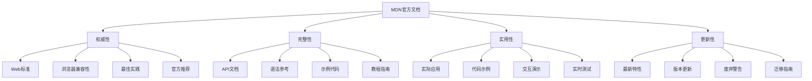

# MDN官方文档

## 文档概述

### 核心价值


### 文档分类
| 分类 | 内容 | 用途 |
|------|------|------|
| Web APIs | DOM、Fetch、Web Workers等 | 浏览器API参考 |
| JavaScript | 语言特性、内置对象 | 语言学习参考 |
| CSS | 样式属性、布局、动画 | 样式开发参考 |
| HTML | 标签、属性、语义化 | 结构开发参考 |
| Web技术 | HTTP、安全、性能 | 技术深度理解 |

## 核心文档

### JavaScript文档
```javascript
// 1. 语言基础
// 变量声明
let message = "Hello World";
const PI = 3.14159;
var oldStyle = "不推荐";

// 数据类型
const types = {
    string: "文本",
    number: 42,
    boolean: true,
    null: null,
    undefined: undefined,
    object: { key: "value" },
    array: [1, 2, 3],
    function: () => "函数"
};

// 2. 函数
// 函数声明
function greet(name) {
    return `Hello, ${name}!`;
}

// 箭头函数
const add = (a, b) => a + b;

// 异步函数
async function fetchData(url) {
    try {
        const response = await fetch(url);
        return await response.json();
    } catch (error) {
        console.error('Error:', error);
    }
}

// 3. 对象和数组
// 对象解构
const { name, age } = person;

// 数组方法
const numbers = [1, 2, 3, 4, 5];
const doubled = numbers.map(n => n * 2);
const evens = numbers.filter(n => n % 2 === 0);
const sum = numbers.reduce((acc, n) => acc + n, 0);

// 4. 类和继承
class Animal {
    constructor(name) {
        this.name = name;
    }
    
    speak() {
        console.log(`${this.name} makes a sound`);
    }
}

class Dog extends Animal {
    speak() {
        console.log(`${this.name} barks`);
    }
}

// 5. 模块系统
// 导出
export const utils = {
    formatDate: (date) => date.toLocaleDateString(),
    debounce: (func, wait) => {
        let timeout;
        return function executedFunction(...args) {
            const later = () => {
                clearTimeout(timeout);
                func(...args);
            };
            clearTimeout(timeout);
            timeout = setTimeout(later, wait);
        };
    }
};

// 导入
import { utils } from './utils.js';
import * as allUtils from './utils.js';
import utilsDefault from './utils.js';
```

### DOM API文档
```javascript
// 1. 元素选择
// 基础选择器
const element = document.getElementById('myId');
const elements = document.querySelectorAll('.myClass');
const firstElement = document.querySelector('.myClass');

// 2. 元素操作
// 创建元素
const div = document.createElement('div');
div.textContent = 'Hello World';
div.className = 'my-class';
div.setAttribute('data-id', '123');

// 插入元素
document.body.appendChild(div);
element.insertBefore(newElement, referenceElement);
element.replaceChild(newElement, oldElement);

// 3. 事件处理
// 事件监听
element.addEventListener('click', (event) => {
    console.log('Clicked!', event.target);
});

// 事件委托
document.addEventListener('click', (event) => {
    if (event.target.matches('.button')) {
        handleButtonClick(event);
    }
});

// 4. 样式操作
// 内联样式
element.style.color = 'red';
element.style.backgroundColor = 'blue';

// 类名操作
element.classList.add('active');
element.classList.remove('inactive');
element.classList.toggle('visible');

// 5. 属性操作
// 获取属性
const value = element.getAttribute('data-value');
const hasClass = element.hasAttribute('class');

// 设置属性
element.setAttribute('data-value', 'new-value');
element.removeAttribute('data-value');

// 6. 内容操作
// 文本内容
element.textContent = 'New text';
const text = element.textContent;

// HTML内容
element.innerHTML = '<strong>Bold text</strong>';
const html = element.innerHTML;

// 7. 位置和尺寸
// 获取位置
const rect = element.getBoundingClientRect();
const offsetTop = element.offsetTop;
const scrollTop = element.scrollTop;

// 滚动操作
element.scrollIntoView({ behavior: 'smooth' });
window.scrollTo({ top: 0, behavior: 'smooth' });
```

### Fetch API文档
```javascript
// 1. 基础请求
// GET请求
fetch('/api/users')
    .then(response => response.json())
    .then(data => console.log(data))
    .catch(error => console.error('Error:', error));

// POST请求
fetch('/api/users', {
    method: 'POST',
    headers: {
        'Content-Type': 'application/json',
    },
    body: JSON.stringify({
        name: 'John Doe',
        email: 'john@example.com'
    })
})
.then(response => response.json())
.then(data => console.log(data));

// 2. 请求配置
const requestOptions = {
    method: 'PUT',
    headers: {
        'Content-Type': 'application/json',
        'Authorization': 'Bearer ' + token
    },
    body: JSON.stringify(data),
    mode: 'cors',
    cache: 'no-cache',
    credentials: 'include'
};

// 3. 响应处理
fetch('/api/data')
    .then(response => {
        if (!response.ok) {
            throw new Error(`HTTP error! status: ${response.status}`);
        }
        return response.json();
    })
    .then(data => {
        // 处理数据
        console.log(data);
    })
    .catch(error => {
        // 错误处理
        console.error('Fetch error:', error);
    });

// 4. 文件上传
const formData = new FormData();
formData.append('file', fileInput.files[0]);
formData.append('description', 'File description');

fetch('/api/upload', {
    method: 'POST',
    body: formData
})
.then(response => response.json())
.then(result => console.log(result));

// 5. 下载文件
fetch('/api/download/file.pdf')
    .then(response => response.blob())
    .then(blob => {
        const url = window.URL.createObjectURL(blob);
        const a = document.createElement('a');
        a.href = url;
        a.download = 'file.pdf';
        a.click();
        window.URL.revokeObjectURL(url);
    });
```

### Web Workers文档
```javascript
// 1. 主线程
// 创建Worker
const worker = new Worker('worker.js');

// 发送消息
worker.postMessage({ type: 'CALCULATE', data: [1, 2, 3, 4, 5] });

// 接收消息
worker.onmessage = function(event) {
    console.log('Result:', event.data);
};

// 错误处理
worker.onerror = function(error) {
    console.error('Worker error:', error);
};

// 终止Worker
worker.terminate();

// 2. Worker线程 (worker.js)
// 接收消息
self.onmessage = function(event) {
    const { type, data } = event.data;
    
    switch (type) {
        case 'CALCULATE':
            const result = data.reduce((sum, num) => sum + num, 0);
            self.postMessage({ type: 'RESULT', data: result });
            break;
            
        case 'PROCESS_DATA':
            // 处理大量数据
            const processed = data.map(item => item * 2);
            self.postMessage({ type: 'PROCESSED', data: processed });
            break;
    }
};

// 3. SharedArrayBuffer (共享内存)
// 主线程
const sharedBuffer = new SharedArrayBuffer(1024);
const sharedArray = new Int32Array(sharedBuffer);

// 传递给Worker
worker.postMessage({ buffer: sharedBuffer });

// 4. Service Worker
// 注册Service Worker
if ('serviceWorker' in navigator) {
    navigator.serviceWorker.register('/sw.js')
        .then(registration => {
            console.log('SW registered:', registration);
        })
        .catch(error => {
            console.log('SW registration failed:', error);
        });
}

// Service Worker文件 (sw.js)
self.addEventListener('install', event => {
    console.log('Service Worker installing');
    event.waitUntil(
        caches.open('v1').then(cache => {
            return cache.addAll([
                '/',
                '/index.html',
                '/styles.css',
                '/script.js'
            ]);
        })
    );
});

self.addEventListener('fetch', event => {
    event.respondWith(
        caches.match(event.request)
            .then(response => {
                return response || fetch(event.request);
            })
    );
});
```

## 实用工具

### 浏览器兼容性检查
```javascript
// 1. 特性检测
function supportsWebGL() {
    try {
        const canvas = document.createElement('canvas');
        return !!(window.WebGLRenderingContext && 
                 canvas.getContext('webgl'));
    } catch (e) {
        return false;
    }
}

// 2. 浏览器检测
function getBrowserInfo() {
    const ua = navigator.userAgent;
    const browsers = {
        chrome: /Chrome/.test(ua),
        firefox: /Firefox/.test(ua),
        safari: /Safari/.test(ua) && !/Chrome/.test(ua),
        edge: /Edg/.test(ua),
        ie: /MSIE|Trident/.test(ua)
    };
    
    return Object.keys(browsers).find(key => browsers[key]) || 'unknown';
}

// 3. 版本检测
function getBrowserVersion() {
    const ua = navigator.userAgent;
    const match = ua.match(/(Chrome|Firefox|Safari|Edg)\/(\d+)/);
    return match ? { name: match[1], version: parseInt(match[2]) } : null;
}

// 4. 兼容性检查工具
class CompatibilityChecker {
    static checkFeature(feature) {
        const features = {
            'fetch': () => 'fetch' in window,
            'promises': () => 'Promise' in window,
            'async-await': () => {
                try {
                    new Function('async () => {}');
                    return true;
                } catch (e) {
                    return false;
                }
            },
            'web-workers': () => 'Worker' in window,
            'service-workers': () => 'serviceWorker' in navigator,
            'local-storage': () => 'localStorage' in window,
            'session-storage': () => 'sessionStorage' in window,
            'indexed-db': () => 'indexedDB' in window,
            'web-sockets': () => 'WebSocket' in window,
            'geolocation': () => 'geolocation' in navigator
        };
        
        return features[feature] ? features[feature]() : false;
    }
    
    static getCompatibilityReport() {
        const features = [
            'fetch', 'promises', 'async-await', 'web-workers',
            'service-workers', 'local-storage', 'session-storage',
            'indexed-db', 'web-sockets', 'geolocation'
        ];
        
        return features.reduce((report, feature) => {
            report[feature] = this.checkFeature(feature);
            return report;
        }, {});
    }
}
```

### 性能监控工具
```javascript
// 1. 性能测量
class PerformanceMonitor {
    static measure(name, fn) {
        const start = performance.now();
        const result = fn();
        const end = performance.now();
        
        console.log(`${name} took ${end - start} milliseconds`);
        return result;
    }
    
    static async measureAsync(name, asyncFn) {
        const start = performance.now();
        const result = await asyncFn();
        const end = performance.now();
        
        console.log(`${name} took ${end - start} milliseconds`);
        return result;
    }
    
    static getNavigationTiming() {
        const timing = performance.timing;
        return {
            pageLoad: timing.loadEventEnd - timing.navigationStart,
            domReady: timing.domContentLoadedEventEnd - timing.navigationStart,
            firstPaint: performance.getEntriesByType('paint')[0]?.startTime || 0,
            firstContentfulPaint: performance.getEntriesByType('paint')[1]?.startTime || 0
        };
    }
    
    static getResourceTiming() {
        return performance.getEntriesByType('resource').map(resource => ({
            name: resource.name,
            duration: resource.duration,
            size: resource.transferSize,
            type: resource.initiatorType
        }));
    }
}

// 2. 内存监控
class MemoryMonitor {
    static getMemoryInfo() {
        if ('memory' in performance) {
            return {
                used: performance.memory.usedJSHeapSize,
                total: performance.memory.totalJSHeapSize,
                limit: performance.memory.jsHeapSizeLimit
            };
        }
        return null;
    }
    
    static logMemoryUsage() {
        const memory = this.getMemoryInfo();
        if (memory) {
            console.log(`Memory usage: ${(memory.used / 1024 / 1024).toFixed(2)} MB`);
            console.log(`Total heap: ${(memory.total / 1024 / 1024).toFixed(2)} MB`);
            console.log(`Heap limit: ${(memory.limit / 1024 / 1024).toFixed(2)} MB`);
        }
    }
}
```

## 学习资源

### 官方教程
1. **JavaScript基础教程**
   - 变量和数据类型
   - 函数和作用域
   - 对象和数组
   - 异步编程

2. **DOM操作教程**
   - 元素选择
   - 事件处理
   - 样式操作
   - 动画效果

3. **Web API教程**
   - Fetch API
   - Web Workers
   - Service Workers
   - Web Storage

### 最佳实践
1. **代码质量**
   - 使用ESLint
   - 遵循编码规范
   - 编写可读代码
   - 添加注释

2. **性能优化**
   - 减少DOM操作
   - 使用事件委托
   - 懒加载资源
   - 代码分割

3. **安全考虑**
   - 输入验证
   - XSS防护
   - CSRF防护
   - 内容安全策略

### 社区资源
1. **MDN社区**
   - 文档贡献
   - 问题讨论
   - 示例分享
   - 翻译项目

2. **相关链接**
   - [MDN Web Docs](https://developer.mozilla.org/)
   - [Web标准](https://web.dev/)
   - [浏览器兼容性](https://caniuse.com/)
   - [Web平台测试](https://wpt.fyi/)

## 相关链接
- [[06-资源工具/01-参考文档/02-ECMAScript规范]] - ECMAScript规范
- [[06-资源工具/01-参考文档/03-框架官方文档]] - 框架官方文档
- [[06-资源工具/01-参考文档/04-社区资源链接]] - 社区资源链接
- [[06-资源工具/02-在线工具/01-代码编辑器推荐]] - 代码编辑器推荐
