# ECMAScript规范

## 规范概述

### 版本演进

```mermaid
graph TD
    A[ECMAScript规范] --> B[ES5 - 2009]
    A --> C[ES6/ES2015 - 2015]
    A --> D[ES2016 - 2016]
    A --> E[ES2017 - 2017]
    A --> F[ES2018 - 2018]
    A --> G[ES2019 - 2019]
    A --> H[ES2020 - 2020]
    A --> I[ES2021 - 2021]
    A --> J[ES2022 - 2022]
    A --> K[ES2023 - 2023]
    
    B --> B1[严格模式]
    B --> B2[JSON支持]
    B --> B3[数组方法]
    
    C --> C1[let/const]
    C --> C2[箭头函数]
    C --> C3[类语法]
    C --> C4[模块系统]
    C --> C5[Promise]
    
    D --> D1[指数运算符]
    D --> D2[Array.includes]
    
    E --> E1[async/await]
    E --> E2[Object.values/entries]
    E --> E3[字符串填充]
    
    F --> F1[对象展开]
    F --> F2[异步迭代]
    F --> F3[正则表达式改进]
    
    G --> G1[Array.flat/flatMap]
    G --> G2[Object.fromEntries]
    G --> G3[String.trimStart/End]
    
    H --> H1[可选链操作符]
    H --> H2[空值合并操作符]
    H --> H3[BigInt]
    H --> H4[动态导入]
    
    I --> I1[逻辑赋值操作符]
    I --> I2[数字分隔符]
    I --> I3[Promise.any]
    
    J --> J1[顶层await]
    J --> J2[私有字段]
    J --> J3[静态块]
    
    K --> K1[Array.findLast]
    K --> K2[Hashbang语法]
    K --> K3[Symbol作为WeakMap键]
```


### 规范分类
| 版本 | 年份 | 主要特性 | 兼容性 |
|------|------|----------|--------|
| ES5 | 2009 | 严格模式、JSON、数组方法 | 广泛支持 |
| ES6/ES2015 | 2015 | let/const、箭头函数、类、模块 | 现代浏览器 |
| ES2016 | 2016 | 指数运算符、Array.includes | 现代浏览器 |
| ES2017 | 2017 | async/await、Object.values | 现代浏览器 |
| ES2018 | 2018 | 对象展开、异步迭代 | 现代浏览器 |
| ES2019 | 2019 | Array.flat、Object.fromEntries | 现代浏览器 |
| ES2020 | 2020 | 可选链、空值合并、BigInt | 现代浏览器 |
| ES2021 | 2021 | 逻辑赋值、数字分隔符 | 现代浏览器 |
| ES2022 | 2022 | 顶层await、私有字段 | 现代浏览器 |
| ES2023 | 2023 | Array.findLast、Hashbang | 现代浏览器 |

## 核心特性

### ES6/ES2015 特性
```javascript
// 1. let 和 const
// let - 块级作用域变量
function example() {
    if (true) {
        let x = 1;
        var y = 2;
    }
    // console.log(x); // ReferenceError
    console.log(y); // 2
}

// const - 常量声明
const PI = 3.14159;
const person = { name: 'John' };
person.name = 'Jane'; // 允许
// person = {}; // TypeError

// 2. 箭头函数
// 传统函数
function add(a, b) {
    return a + b;
}

// 箭头函数
const add = (a, b) => a + b;
const square = x => x * x;
const greet = () => 'Hello World';

// this绑定
class Timer {
    constructor() {
        this.seconds = 0;
    }
    
    start() {
        setInterval(() => {
            this.seconds++; // this指向Timer实例
        }, 1000);
    }
}

// 3. 模板字符串
const name = 'World';
const message = `Hello, ${name}!`;
const multiLine = `
    This is a
    multi-line
    string
`;

// 4. 解构赋值
// 数组解构
const [first, second, ...rest] = [1, 2, 3, 4, 5];

// 对象解构
const { name, age, ...other } = { name: 'John', age: 30, city: 'NYC' };

// 函数参数解构
function greet({ name, age }) {
    return `Hello, ${name}! You are ${age} years old.`;
}

// 5. 默认参数
function greet(name = 'World', greeting = 'Hello') {
    return `${greeting}, ${name}!`;
}

// 6. 剩余参数
function sum(...numbers) {
    return numbers.reduce((total, num) => total + num, 0);
}

// 7. 展开操作符
const arr1 = [1, 2, 3];
const arr2 = [4, 5, 6];
const combined = [...arr1, ...arr2];

const obj1 = { a: 1, b: 2 };
const obj2 = { c: 3, d: 4 };
const merged = { ...obj1, ...obj2 };

// 8. 类语法
class Animal {
    constructor(name) {
        this.name = name;
    }
    
    speak() {
        console.log(`${this.name} makes a sound`);
    }
}

class Dog extends Animal {
    constructor(name, breed) {
        super(name);
        this.breed = breed;
    }
    
    speak() {
        console.log(`${this.name} barks`);
    }
    
    static getSpecies() {
        return 'Canis lupus';
    }
}

// 9. 模块系统
// 导出 (math.js)
export const PI = 3.14159;
export function add(a, b) {
    return a + b;
}
export default class Calculator {
    // ...
}

// 导入 (main.js)
import Calculator, { PI, add } from './math.js';
import * as math from './math.js';

// 10. Promise
const promise = new Promise((resolve, reject) => {
    setTimeout(() => {
        resolve('Success!');
    }, 1000);
});

promise
    .then(result => console.log(result))
    .catch(error => console.error(error));

// Promise.all
Promise.all([
    fetch('/api/users'),
    fetch('/api/posts'),
    fetch('/api/comments')
])
.then(responses => Promise.all(responses.map(r => r.json())))
.then(data => console.log(data));

// 11. 生成器
function* numberGenerator() {
    yield 1;
    yield 2;
    yield 3;
}

const gen = numberGenerator();
console.log(gen.next().value); // 1
console.log(gen.next().value); // 2

// 12. Symbol
const sym1 = Symbol('description');
const sym2 = Symbol('description');
console.log(sym1 === sym2); // false

const obj = {
    [sym1]: 'value1',
    [sym2]: 'value2'
};
```

### ES2017 特性
```javascript
// 1. async/await
async function fetchData() {
    try {
        const response = await fetch('/api/data');
        const data = await response.json();
        return data;
    } catch (error) {
        console.error('Error:', error);
        throw error;
    }
}

// 2. Object.values 和 Object.entries
const obj = { a: 1, b: 2, c: 3 };

Object.values(obj); // [1, 2, 3]
Object.entries(obj); // [['a', 1], ['b', 2], ['c', 3]]

// 3. 字符串填充
'hello'.padStart(10, '0'); // '00000hello'
'hello'.padEnd(10, '0');   // 'hello00000'

// 4. 函数参数列表和调用中的尾随逗号
function greet(
    name,
    age,
    city, // 尾随逗号
) {
    return `Hello, ${name}!`;
}
```

### ES2018 特性
```javascript
// 1. 对象展开操作符
const obj1 = { a: 1, b: 2 };
const obj2 = { c: 3, d: 4 };
const merged = { ...obj1, ...obj2 }; // { a: 1, b: 2, c: 3, d: 4 }

// 2. 异步迭代
async function* asyncGenerator() {
    yield 1;
    yield 2;
    yield 3;
}

for await (const value of asyncGenerator()) {
    console.log(value);
}

// 3. Promise.finally
fetch('/api/data')
    .then(response => response.json())
    .then(data => console.log(data))
    .catch(error => console.error(error))
    .finally(() => console.log('Request completed'));

// 4. 正则表达式改进
// 命名捕获组
const regex = /(?<year>\d{4})-(?<month>\d{2})-(?<day>\d{2})/;
const match = '2023-12-25'.match(regex);
console.log(match.groups.year); // '2023'

// 反向断言
const positiveLookbehind = /(?<=\$)\d+/;
const negativeLookbehind = /(?<!\$)\d+/;
```

### ES2019 特性
```javascript
// 1. Array.flat 和 Array.flatMap
const nested = [1, [2, 3], [4, [5, 6]]];
nested.flat(); // [1, 2, 3, 4, [5, 6]]
nested.flat(2); // [1, 2, 3, 4, 5, 6]

const numbers = [1, 2, 3, 4];
numbers.flatMap(x => [x, x * 2]); // [1, 2, 2, 4, 3, 6, 4, 8]

// 2. Object.fromEntries
const entries = [['a', 1], ['b', 2], ['c', 3]];
const obj = Object.fromEntries(entries); // { a: 1, b: 2, c: 3 }

// 3. String.trimStart 和 String.trimEnd
'  hello  '.trimStart(); // 'hello  '
'  hello  '.trimEnd();   // '  hello'

// 4. 可选的 catch 绑定
try {
    // 可能抛出错误的代码
} catch {
    // 不需要错误参数
    console.log('An error occurred');
}
```

### ES2020 特性
```javascript
// 1. 可选链操作符
const user = {
    name: 'John',
    address: {
        street: '123 Main St',
        city: 'NYC'
    }
};

// 安全访问嵌套属性
const street = user?.address?.street; // '123 Main St'
const zipCode = user?.address?.zipCode; // undefined

// 安全调用方法
user?.getName?.(); // 如果getName存在则调用

// 2. 空值合并操作符
const name = user.name ?? 'Anonymous';
const age = user.age ?? 0;
const city = user.address?.city ?? 'Unknown';

// 3. BigInt
const bigNumber = 123456789012345678901234567890n;
const anotherBig = BigInt('123456789012345678901234567890');

// 4. 动态导入
async function loadModule() {
    const module = await import('./module.js');
    return module.default;
}

// 5. globalThis
// 跨环境全局对象访问
const global = globalThis;
```

### ES2021 特性
```javascript
// 1. 逻辑赋值操作符
let x = 1;
let y = null;
let z = 0;

x ||= 2; // x = x || 2 (x保持1)
y ||= 2; // y = y || 2 (y变成2)
z &&= 2; // z = z && 2 (z变成2)

// 2. 数字分隔符
const million = 1_000_000;
const binary = 0b1010_0001;
const hex = 0xFF_EC_DE_5E;

// 3. Promise.any
const promises = [
    fetch('/api/slow'),
    fetch('/api/fast'),
    fetch('/api/medium')
];

Promise.any(promises)
    .then(result => console.log('First resolved:', result))
    .catch(errors => console.log('All failed:', errors));
```

### ES2022 特性
```javascript
// 1. 顶层 await
// 在模块顶层直接使用await
const data = await fetch('/api/data').then(r => r.json());
console.log(data);

// 2. 私有字段
class Counter {
    #count = 0; // 私有字段
    
    increment() {
        this.#count++;
    }
    
    getCount() {
        return this.#count;
    }
}

// 3. 静态块
class Database {
    static #connection;
    
    static {
        // 静态初始化块
        this.#connection = this.connect();
    }
    
    static connect() {
        // 连接数据库
        return 'connected';
    }
}

// 4. 正则表达式匹配索引
const regex = /(\d{4})-(\d{2})-(\d{2})/d;
const match = regex.exec('2023-12-25');
console.log(match.indices); // [[0, 10], [0, 4], [5, 7], [8, 10]]
```

### ES2023 特性
```javascript
// 1. Array.findLast 和 Array.findLastIndex
const numbers = [1, 2, 3, 4, 5, 4, 3, 2, 1];
const lastEven = numbers.findLast(n => n % 2 === 0); // 2
const lastEvenIndex = numbers.findLastIndex(n => n % 2 === 0); // 7

// 2. Hashbang 语法
#!/usr/bin/env node
console.log('This is a Node.js script');

// 3. Symbol 作为 WeakMap 键
const weakMap = new WeakMap();
const symbol = Symbol('key');
weakMap.set(symbol, 'value');
```

## 兼容性检查

### 特性检测工具
```javascript
// 1. 特性检测函数
function supportsES6() {
    try {
        // 检测let
        eval('let x = 1;');
        
        // 检测箭头函数
        eval('() => {}');
        
        // 检测模板字符串
        eval('`template`');
        
        // 检测解构
        eval('const {a} = {};');
        
        return true;
    } catch (e) {
        return false;
    }
}

// 2. 版本检测
function getESVersion() {
    const features = {
        'ES5': () => true,
        'ES6': () => {
            try {
                eval('let x = 1; () => {}; `template`; const {a} = {};');
                return true;
            } catch (e) {
                return false;
            }
        },
        'ES2017': () => {
            try {
                eval('async () => {}; Object.values({}); "".padStart(1);');
                return true;
            } catch (e) {
                return false;
            }
        },
        'ES2020': () => {
            try {
                eval('const a = {}?.b; const c = null ?? "default";');
                return true;
            } catch (e) {
                return false;
            }
        }
    };
    
    const supported = [];
    for (const [version, test] of Object.entries(features)) {
        if (test()) {
            supported.push(version);
        }
    }
    
    return supported;
}

// 3. 兼容性报告
function getCompatibilityReport() {
    return {
        esVersion: getESVersion(),
        features: {
            letConst: (() => {
                try { eval('let x = 1; const y = 2;'); return true; } catch (e) { return false; }
            })(),
            arrowFunctions: (() => {
                try { eval('() => {}'); return true; } catch (e) { return false; }
            })(),
            templateLiterals: (() => {
                try { eval('`template`'); return true; } catch (e) { return false; }
            })(),
            destructuring: (() => {
                try { eval('const {a} = {};'); return true; } catch (e) { return false; }
            })(),
            classes: (() => {
                try { eval('class A {}'); return true; } catch (e) { return false; }
            })(),
            modules: (() => {
                try { eval('import("");'); return true; } catch (e) { return false; }
            })(),
            asyncAwait: (() => {
                try { eval('async () => {}'); return true; } catch (e) { return false; }
            })(),
            optionalChaining: (() => {
                try { eval('const a = {}?.b;'); return true; } catch (e) { return false; }
            })(),
            nullishCoalescing: (() => {
                try { eval('const a = null ?? "default";'); return true; } catch (e) { return false; }
            })()
        }
    };
}
```

## 学习资源

### 官方文档
1. **ECMAScript规范**
   - [ECMAScript 2023 Language Specification](https://tc39.es/ecma262/)
   - [TC39提案](https://github.com/tc39/proposals)
   - [兼容性表](https://kangax.github.io/compat-table/es6/)

2. **学习指南**
   - [ES6入门教程](https://es6.ruanyifeng.com/)
   - [现代JavaScript教程](https://zh.javascript.info/)
   - [MDN JavaScript指南](https://developer.mozilla.org/zh-CN/docs/Web/JavaScript/Guide)

### 实践建议
1. **渐进式学习**
   - 从ES5基础开始
   - 逐步学习ES6+特性
   - 实践项目应用

2. **兼容性考虑**
   - 使用Babel转译
   - 检查浏览器支持
   - 提供polyfill

3. **最佳实践**
   - 使用现代语法
   - 保持代码简洁
   - 注重可读性

## 相关链接
- [[06-资源工具/01-参考文档/01-MDN官方文档]] - MDN官方文档
- [[06-资源工具/01-参考文档/03-框架官方文档]] - 框架官方文档
- [[06-资源工具/01-参考文档/04-社区资源链接]] - 社区资源链接
- [[06-资源工具/02-在线工具/01-代码编辑器推荐]] - 代码编辑器推荐
