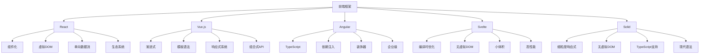

# 框架官方文档

## 文档概述

### 主流框架


### 框架对比
| 框架 | 类型 | 学习曲线 | 性能 | 生态系统 | 适用场景 |
|------|------|----------|------|----------|----------|
| React | 库 | 中等 | 高 | 丰富 | 大型应用 |
| Vue.js | 框架 | 简单 | 高 | 丰富 | 中小型应用 |
| Angular | 框架 | 陡峭 | 高 | 丰富 | 企业级应用 |
| Svelte | 编译器 | 简单 | 很高 | 中等 | 性能敏感应用 |
| Solid | 库 | 中等 | 很高 | 新兴 | 高性能应用 |

## React文档

### 核心概念
```javascript
// 1. 组件定义
// 函数组件
function Welcome(props) {
    return <h1>Hello, {props.name}!</h1>;
}

// 类组件
class Welcome extends React.Component {
    render() {
        return <h1>Hello, {this.props.name}!</h1>;
    }
}

// 2. JSX语法
const element = (
    <div>
        <h1>Hello, World!</h1>
        <p>This is a paragraph.</p>
    </div>
);

// 3. 状态管理
function Counter() {
    const [count, setCount] = useState(0);
    
    return (
        <div>
            <p>You clicked {count} times</p>
            <button onClick={() => setCount(count + 1)}>
                Click me
            </button>
        </div>
    );
}

// 4. 生命周期
class Clock extends React.Component {
    constructor(props) {
        super(props);
        this.state = { date: new Date() };
    }
    
    componentDidMount() {
        this.timerID = setInterval(
            () => this.tick(),
            1000
        );
    }
    
    componentWillUnmount() {
        clearInterval(this.timerID);
    }
    
    tick() {
        this.setState({
            date: new Date()
        });
    }
    
    render() {
        return (
            <div>
                <h2>It is {this.state.date.toLocaleTimeString()}.</h2>
            </div>
        );
    }
}

// 5. 事件处理
function Button() {
    const handleClick = (e) => {
        e.preventDefault();
        console.log('Button clicked');
    };
    
    return (
        <button onClick={handleClick}>
            Click me
        </button>
    );
}

// 6. 条件渲染
function Greeting({ isLoggedIn }) {
    if (isLoggedIn) {
        return <UserGreeting />;
    }
    return <GuestGreeting />;
}

// 7. 列表渲染
function NumberList({ numbers }) {
    return (
        <ul>
            {numbers.map(number => (
                <li key={number.toString()}>
                    {number}
                </li>
            ))}
        </ul>
    );
}

// 8. 表单处理
function NameForm() {
    const [value, setValue] = useState('');
    
    const handleSubmit = (e) => {
        e.preventDefault();
        alert('A name was submitted: ' + value);
    };
    
    return (
        <form onSubmit={handleSubmit}>
            <label>
                Name:
                <input
                    type="text"
                    value={value}
                    onChange={(e) => setValue(e.target.value)}
                />
            </label>
            <input type="submit" value="Submit" />
        </form>
    );
}
```

### Hooks API
```javascript
// 1. useState
function Counter() {
    const [count, setCount] = useState(0);
    const [name, setName] = useState('');
    
    return (
        <div>
            <p>Count: {count}</p>
            <button onClick={() => setCount(count + 1)}>+</button>
            <input
                value={name}
                onChange={(e) => setName(e.target.value)}
                placeholder="Enter name"
            />
        </div>
    );
}

// 2. useEffect
function DataFetcher({ url }) {
    const [data, setData] = useState(null);
    const [loading, setLoading] = useState(true);
    
    useEffect(() => {
        fetch(url)
            .then(response => response.json())
            .then(data => {
                setData(data);
                setLoading(false);
            });
    }, [url]); // 依赖数组
    
    if (loading) return <div>Loading...</div>;
    return <div>{JSON.stringify(data)}</div>;
}

// 3. useContext
const ThemeContext = React.createContext('light');

function ThemedButton() {
    const theme = useContext(ThemeContext);
    return (
        <button style={{ background: theme === 'dark' ? 'black' : 'white' }}>
            Themed Button
        </button>
    );
}

// 4. useReducer
function reducer(state, action) {
    switch (action.type) {
        case 'increment':
            return { count: state.count + 1 };
        case 'decrement':
            return { count: state.count - 1 };
        default:
            throw new Error();
    }
}

function Counter() {
    const [state, dispatch] = useReducer(reducer, { count: 0 });
    
    return (
        <div>
            Count: {state.count}
            <button onClick={() => dispatch({ type: 'increment' })}>+</button>
            <button onClick={() => dispatch({ type: 'decrement' })}>-</button>
        </div>
    );
}

// 5. useMemo
function ExpensiveComponent({ items }) {
    const expensiveValue = useMemo(() => {
        return items.reduce((sum, item) => sum + item.value, 0);
    }, [items]);
    
    return <div>Total: {expensiveValue}</div>;
}

// 6. useCallback
function Parent({ items }) {
    const [count, setCount] = useState(0);
    
    const handleClick = useCallback(() => {
        console.log('Button clicked');
    }, []);
    
    return (
        <div>
            <button onClick={() => setCount(count + 1)}>Count: {count}</button>
            <Child onClick={handleClick} />
        </div>
    );
}

// 7. 自定义Hook
function useCounter(initialValue = 0) {
    const [count, setCount] = useState(initialValue);
    
    const increment = useCallback(() => setCount(c => c + 1), []);
    const decrement = useCallback(() => setCount(c => c - 1), []);
    const reset = useCallback(() => setCount(initialValue), [initialValue]);
    
    return { count, increment, decrement, reset };
}

function Counter() {
    const { count, increment, decrement, reset } = useCounter(0);
    
    return (
        <div>
            <p>Count: {count}</p>
            <button onClick={increment}>+</button>
            <button onClick={decrement}>-</button>
            <button onClick={reset}>Reset</button>
        </div>
    );
}
```

## Vue.js文档

### 核心概念
```javascript
// 1. 组件定义
// 选项式API
export default {
    data() {
        return {
            message: 'Hello Vue!',
            count: 0
        };
    },
    methods: {
        increment() {
            this.count++;
        }
    },
    template: `
        <div>
            <h1>{{ message }}</h1>
            <p>Count: {{ count }}</p>
            <button @click="increment">+</button>
        </div>
    `
};

// 组合式API
import { ref, computed, onMounted } from 'vue';

export default {
    setup() {
        const message = ref('Hello Vue!');
        const count = ref(0);
        
        const doubleCount = computed(() => count.value * 2);
        
        const increment = () => {
            count.value++;
        };
        
        onMounted(() => {
            console.log('Component mounted');
        });
        
        return {
            message,
            count,
            doubleCount,
            increment
        };
    }
};

// 2. 模板语法
<template>
    <div>
        <!-- 插值 -->
        <h1>{{ message }}</h1>
        
        <!-- 指令 -->
        <p v-if="show">This is shown conditionally</p>
        <ul>
            <li v-for="item in items" :key="item.id">
                {{ item.name }}
            </li>
        </ul>
        
        <!-- 事件处理 -->
        <button @click="handleClick">Click me</button>
        
        <!-- 双向绑定 -->
        <input v-model="inputValue" placeholder="Enter text">
        
        <!-- 属性绑定 -->
        
        
        <!-- 样式绑定 -->
        <div :class="{ active: isActive }" :style="{ color: textColor }">
            Styled content
        </div>
    </div>
</template>

// 3. 响应式系统
import { reactive, ref, computed, watch } from 'vue';

export default {
    setup() {
        // 响应式对象
        const state = reactive({
            count: 0,
            name: 'Vue'
        });
        
        // 响应式引用
        const message = ref('Hello');
        
        // 计算属性
        const doubleCount = computed(() => state.count * 2);
        
        // 侦听器
        watch(
            () => state.count,
            (newCount, oldCount) => {
                console.log(`Count changed from ${oldCount} to ${newCount}`);
            }
        );
        
        return {
            state,
            message,
            doubleCount
        };
    }
};

// 4. 组件通信
// 父组件
<template>
    <ChildComponent
        :message="parentMessage"
        @update="handleUpdate"
    />
</template>

// 子组件
export default {
    props: {
        message: {
            type: String,
            required: true
        }
    },
    emits: ['update'],
    setup(props, { emit }) {
        const handleClick = () => {
            emit('update', 'New message');
        };
        
        return { handleClick };
    }
};

// 5. 生命周期
import { onMounted, onUpdated, onUnmounted } from 'vue';

export default {
    setup() {
        onMounted(() => {
            console.log('Component mounted');
        });
        
        onUpdated(() => {
            console.log('Component updated');
        });
        
        onUnmounted(() => {
            console.log('Component unmounted');
        });
    }
};
```

### 组合式API
```javascript
// 1. 响应式API
import { ref, reactive, computed, watch, watchEffect } from 'vue';

export default {
    setup() {
        // ref - 基本类型
        const count = ref(0);
        const name = ref('Vue');
        
        // reactive - 对象类型
        const state = reactive({
            items: [],
            loading: false
        });
        
        // computed - 计算属性
        const filteredItems = computed(() => {
            return state.items.filter(item => item.active);
        });
        
        // watch - 侦听器
        watch(count, (newValue, oldValue) => {
            console.log(`Count: ${oldValue} -> ${newValue}`);
        });
        
        // watchEffect - 自动侦听
        watchEffect(() => {
            console.log(`Count is: ${count.value}`);
        });
        
        return {
            count,
            name,
            state,
            filteredItems
        };
    }
};

// 2. 生命周期钩子
import {
    onBeforeMount,
    onMounted,
    onBeforeUpdate,
    onUpdated,
    onBeforeUnmount,
    onUnmounted
} from 'vue';

export default {
    setup() {
        onBeforeMount(() => {
            console.log('Before mount');
        });
        
        onMounted(() => {
            console.log('Mounted');
        });
        
        onBeforeUpdate(() => {
            console.log('Before update');
        });
        
        onUpdated(() => {
            console.log('Updated');
        });
        
        onBeforeUnmount(() => {
            console.log('Before unmount');
        });
        
        onUnmounted(() => {
            console.log('Unmounted');
        });
    }
};

// 3. 依赖注入
// 提供者
import { provide, ref } from 'vue';

export default {
    setup() {
        const theme = ref('dark');
        
        provide('theme', theme);
        
        return { theme };
    }
};

// 消费者
import { inject } from 'vue';

export default {
    setup() {
        const theme = inject('theme', 'light'); // 默认值
        
        return { theme };
    }
};
```

## Angular文档

### 核心概念
```typescript
// 1. 组件定义
import { Component, Input, Output, EventEmitter } from '@angular/core';

@Component({
    selector: 'app-hero',
    template: `
        <div>
            <h2>{{ hero.name }}</h2>
            <p>{{ hero.description }}</p>
            <button (click)="onSelect()">Select</button>
        </div>
    `,
    styleUrls: ['./hero.component.css']
})
export class HeroComponent {
    @Input() hero: Hero;
    @Output() selected = new EventEmitter<Hero>();
    
    onSelect() {
        this.selected.emit(this.hero);
    }
}

// 2. 服务
import { Injectable } from '@angular/core';
import { HttpClient } from '@angular/common/http';
import { Observable } from 'rxjs';

@Injectable({
    providedIn: 'root'
})
export class HeroService {
    private apiUrl = 'api/heroes';
    
    constructor(private http: HttpClient) {}
    
    getHeroes(): Observable<Hero[]> {
        return this.http.get<Hero[]>(this.apiUrl);
    }
    
    getHero(id: number): Observable<Hero> {
        return this.http.get<Hero>(`${this.apiUrl}/${id}`);
    }
    
    addHero(hero: Hero): Observable<Hero> {
        return this.http.post<Hero>(this.apiUrl, hero);
    }
}

// 3. 路由
import { NgModule } from '@angular/core';
import { RouterModule, Routes } from '@angular/router';
import { HeroesComponent } from './heroes/heroes.component';
import { HeroDetailComponent } from './hero-detail/hero-detail.component';

const routes: Routes = [
    { path: 'heroes', component: HeroesComponent },
    { path: 'hero/:id', component: HeroDetailComponent },
    { path: '', redirectTo: '/heroes', pathMatch: 'full' }
];

@NgModule({
    imports: [RouterModule.forRoot(routes)],
    exports: [RouterModule]
})
export class AppRoutingModule {}

// 4. 表单
import { Component } from '@angular/core';
import { FormBuilder, FormGroup, Validators } from '@angular/forms';

@Component({
    selector: 'app-hero-form',
    template: `
        <form [formGroup]="heroForm" (ngSubmit)="onSubmit()">
            <div>
                <label>Name:</label>
                <input formControlName="name" placeholder="Hero name">
                <div *ngIf="heroForm.get('name')?.invalid && heroForm.get('name')?.touched">
                    Name is required
                </div>
            </div>
            <div>
                <label>Power:</label>
                <input formControlName="power" placeholder="Hero power">
            </div>
            <button type="submit" [disabled]="heroForm.invalid">Submit</button>
        </form>
    `
})
export class HeroFormComponent {
    heroForm: FormGroup;
    
    constructor(private fb: FormBuilder) {
        this.heroForm = this.fb.group({
            name: ['', Validators.required],
            power: ['']
        });
    }
    
    onSubmit() {
        if (this.heroForm.valid) {
            console.log(this.heroForm.value);
        }
    }
}

// 5. HTTP客户端
import { Component, OnInit } from '@angular/core';
import { HttpClient } from '@angular/common/http';

@Component({
    selector: 'app-heroes',
    template: `
        <div>
            <h2>Heroes</h2>
            <ul>
                <li *ngFor="let hero of heroes">
                    {{ hero.name }}
                </li>
            </ul>
        </div>
    `
})
export class HeroesComponent implements OnInit {
    heroes: Hero[] = [];
    
    constructor(private http: HttpClient) {}
    
    ngOnInit() {
        this.http.get<Hero[]>('api/heroes')
            .subscribe(heroes => this.heroes = heroes);
    }
}
```

## Svelte文档

### 核心概念
```javascript
// 1. 组件定义
<script>
    let name = 'world';
    let count = 0;
    
    function handleClick() {
        count += 1;
    }
</script>

<h1>Hello {name}!</h1>
<p>Count: {count}</p>
<button on:click={handleClick}>Click me</button>

<style>
    h1 {
        color: purple;
    }
</style>

// 2. 响应式
<script>
    let count = 0;
    let doubled = count * 2; // 自动响应式
    
    $: quadrupled = count * 4; // 响应式语句
    
    function increment() {
        count += 1;
    }
</script>

<p>Count: {count}</p>
<p>Doubled: {doubled}</p>
<p>Quadrupled: {quadrupled}</p>
<button on:click={increment}>Increment</button>

// 3. 组件通信
// 父组件
<script>
    import Child from './Child.svelte';
    
    let message = 'Hello from parent';
    
    function handleMessage(event) {
        console.log(event.detail);
    }
</script>

<Child {message} on:message={handleMessage} />

// 子组件
<script>
    import { createEventDispatcher } from 'svelte';
    
    export let message;
    
    const dispatch = createEventDispatcher();
    
    function sendMessage() {
        dispatch('message', 'Hello from child');
    }
</script>

<p>{message}</p>
<button on:click={sendMessage}>Send Message</button>

// 4. 状态管理
// store.js
import { writable } from 'svelte/store';

export const count = writable(0);

// 组件中使用
<script>
    import { count } from './store.js';
    
    function increment() {
        count.update(n => n + 1);
    }
</script>

<h1>The count is {$count}</h1>
<button on:click={increment}>Increment</button>

// 5. 生命周期
<script>
    import { onMount, onDestroy } from 'svelte';
    
    let interval;
    
    onMount(() => {
        interval = setInterval(() => {
            console.log('Tick');
        }, 1000);
    });
    
    onDestroy(() => {
        clearInterval(interval);
    });
</script>
```

## 学习资源

### 官方文档
1. **React**
   - [React官方文档](https://react.dev/)
   - [React中文文档](https://zh-hans.react.dev/)
   - [React Native文档](https://reactnative.dev/)

2. **Vue.js**
   - [Vue.js官方文档](https://vuejs.org/)
   - [Vue.js中文文档](https://cn.vuejs.org/)
   - [Vue Router文档](https://router.vuejs.org/)

3. **Angular**
   - [Angular官方文档](https://angular.io/)
   - [Angular中文文档](https://angular.cn/)
   - [Angular CLI文档](https://cli.angular.io/)

4. **Svelte**
   - [Svelte官方文档](https://svelte.dev/)
   - [SvelteKit文档](https://kit.svelte.dev/)

### 学习建议
1. **选择框架**
   - 根据项目需求选择
   - 考虑团队技术栈
   - 评估学习成本

2. **学习路径**
   - 从基础概念开始
   - 实践小项目
   - 深入高级特性

3. **最佳实践**
   - 遵循官方规范
   - 使用TypeScript
   - 注重性能优化

## 相关链接
- [[06-资源工具/01-参考文档/01-MDN官方文档]] - MDN官方文档
- [[06-资源工具/01-参考文档/02-ECMAScript规范]] - ECMAScript规范
- [[06-资源工具/01-参考文档/04-社区资源链接]] - 社区资源链接
- [[06-资源工具/02-在线工具/01-代码编辑器推荐]] - 代码编辑器推荐
