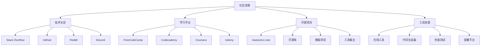

# 社区资源链接

## 资源概述

### 社区生态


### 资源分类
| 类型 | 平台 | 特点 | 适用场景 |
|------|------|------|----------|
| 问答社区 | Stack Overflow | 技术问答 | 问题解决 |
| 代码托管 | GitHub | 开源项目 | 代码学习 |
| 学习平台 | FreeCodeCamp | 免费课程 | 系统学习 |
| 在线工具 | CodePen | 代码演示 | 快速原型 |
| 文档资源 | MDN | 权威文档 | 技术参考 |

## 技术社区

### Stack Overflow
```javascript
// 1. 常见问题类型
// JavaScript基础问题
const questions = {
    "变量声明": "let vs var vs const的区别",
    "异步编程": "Promise vs async/await",
    "DOM操作": "如何选择元素",
    "事件处理": "事件委托的使用",
    "数组操作": "map, filter, reduce的区别"
};

// 2. 高质量答案示例
// 问题：如何深拷贝一个对象？
function deepClone(obj) {
    if (obj === null || typeof obj !== 'object') return obj;
    if (obj instanceof Date) return new Date(obj.getTime());
    if (obj instanceof Array) return obj.map(item => deepClone(item));
    if (typeof obj === 'object') {
        const clonedObj = {};
        for (const key in obj) {
            if (obj.hasOwnProperty(key)) {
                clonedObj[key] = deepClone(obj[key]);
            }
        }
        return clonedObj;
    }
}

// 3. 标签使用
const tags = [
    'javascript',
    'react',
    'vue.js',
    'angular',
    'node.js',
    'html',
    'css',
    'dom',
    'ajax',
    'json'
];

// 4. 搜索技巧
const searchTips = {
    "精确搜索": "使用引号包围短语",
    "排除词汇": "使用减号排除不需要的结果",
    "标签过滤": "使用[tag]语法过滤标签",
    "用户过滤": "使用user:username搜索特定用户"
};
```

### GitHub
```javascript
// 1. 开源项目学习
const popularProjects = {
    "React": "facebook/react",
    "Vue.js": "vuejs/vue",
    "Angular": "angular/angular",
    "Node.js": "nodejs/node",
    "Express": "expressjs/express",
    "Lodash": "lodash/lodash",
    "Moment.js": "moment/moment",
    "Axios": "axios/axios"
};

// 2. 项目结构分析
const projectStructure = {
    "package.json": "项目配置和依赖",
    "README.md": "项目说明文档",
    "src/": "源代码目录",
    "tests/": "测试文件",
    "docs/": "文档目录",
    ".github/": "GitHub配置",
    "LICENSE": "开源许可证"
};

// 3. 贡献指南
const contributionGuide = {
    "Fork项目": "复制项目到自己的账户",
    "创建分支": "为功能或修复创建新分支",
    "提交更改": "提交代码并添加描述",
    "创建PR": "向原项目提交拉取请求",
    "代码审查": "等待维护者审查代码"
};

// 4. 学习资源
const learningResources = {
    "Awesome Lists": "精选资源列表",
    "GitHub Pages": "静态网站托管",
    "GitHub Actions": "CI/CD自动化",
    "GitHub Discussions": "项目讨论区",
    "GitHub Wiki": "项目维基百科"
};
```

### Reddit
```javascript
// 1. 相关子版块
const subreddits = {
    "r/javascript": "JavaScript讨论",
    "r/webdev": "Web开发",
    "r/reactjs": "React相关",
    "r/vuejs": "Vue.js相关",
    "r/angular": "Angular相关",
    "r/node": "Node.js相关",
    "r/learnprogramming": "编程学习",
    "r/programming": "编程新闻"
};

// 2. 内容类型
const contentTypes = {
    "技术讨论": "新技术和趋势讨论",
    "项目展示": "个人项目分享",
    "学习资源": "教程和资源分享",
    "求职信息": "工作机会和面试经验",
    "工具推荐": "开发工具和库推荐"
};

// 3. 社区规则
const communityRules = {
    "尊重他人": "保持礼貌和尊重",
    "相关主题": "发布与版块相关的内容",
    "避免重复": "搜索后再发布问题",
    "提供上下文": "详细描述问题和背景",
    "分享知识": "积极帮助其他开发者"
};
```

## 学习平台

### FreeCodeCamp
```javascript
// 1. 课程结构
const curriculum = {
    "响应式Web设计": {
        "HTML基础": "标签、属性、语义化",
        "CSS基础": "选择器、布局、样式",
        "响应式设计": "媒体查询、弹性布局",
        "项目实践": "5个实际项目"
    },
    "JavaScript算法和数据结构": {
        "基础语法": "变量、函数、对象",
        "数据结构": "数组、对象、字符串",
        "算法": "排序、搜索、递归",
        "项目实践": "5个算法项目"
    },
    "前端库": {
        "React": "组件、状态、生命周期",
        "Redux": "状态管理",
        "项目实践": "5个React项目"
    }
};

// 2. 学习路径
const learningPath = [
    "HTML/CSS基础",
    "JavaScript基础",
    "响应式设计",
    "前端框架",
    "后端开发",
    "数据可视化",
    "API和微服务",
    "质量保证",
    "科学计算",
    "信息安全"
];

// 3. 项目示例
const projects = {
    "个人作品集": "展示个人技能的项目",
    "随机引用生成器": "JavaScript基础项目",
    "本地天气应用": "API集成项目",
    "计算器": "React组件项目",
    "待办事项应用": "状态管理项目"
};
```

### Codecademy
```javascript
// 1. 课程特色
const features = {
    "交互式学习": "在线代码编辑器",
    "即时反馈": "实时错误检查",
    "项目导向": "实际项目练习",
    "社区支持": "学习社区和论坛",
    "移动学习": "移动端应用支持"
};

// 2. JavaScript课程
const jsCourse = {
    "基础语法": "变量、数据类型、操作符",
    "控制流": "条件语句、循环",
    "函数": "函数定义、参数、返回值",
    "作用域": "全局作用域、局部作用域",
    "数组": "数组方法、迭代",
    "对象": "对象创建、属性、方法",
    "类": "ES6类语法、继承",
    "模块": "导入、导出、模块系统"
};

// 3. 学习工具
const tools = {
    "代码编辑器": "语法高亮、自动补全",
    "控制台": "代码执行和调试",
    "提示系统": "学习提示和帮助",
    "进度跟踪": "学习进度和成就",
    "证书系统": "完成证书和徽章"
};
```

## 开源项目

### Awesome Lists
```javascript
// 1. 前端资源
const frontendResources = {
    "Awesome JavaScript": "JavaScript资源集合",
    "Awesome React": "React相关资源",
    "Awesome Vue": "Vue.js资源集合",
    "Awesome CSS": "CSS资源和工具",
    "Awesome HTML5": "HTML5相关资源",
    "Awesome Web Components": "Web组件资源",
    "Awesome PWA": "渐进式Web应用资源",
    "Awesome Web Performance": "Web性能优化资源"
};

// 2. 工具资源
const toolResources = {
    "Awesome Node.js": "Node.js资源和工具",
    "Awesome NPM": "NPM包和工具",
    "Awesome Webpack": "Webpack相关资源",
    "Awesome Babel": "Babel转译器资源",
    "Awesome ESLint": "代码检查工具",
    "Awesome Testing": "测试工具和框架",
    "Awesome Git": "Git工具和资源",
    "Awesome VS Code": "VS Code扩展和主题"
};

// 3. 学习资源
const learningResources = {
    "Awesome Learning": "编程学习资源",
    "Awesome Courses": "免费编程课程",
    "Awesome Books": "编程书籍推荐",
    "Awesome Blogs": "技术博客和文章",
    "Awesome Podcasts": "技术播客推荐",
    "Awesome YouTube": "技术视频频道",
    "Awesome Cheatsheets": "编程速查表",
    "Awesome Design": "设计资源和工具"
};
```

### 模板项目
```javascript
// 1. React模板
const reactTemplates = {
    "Create React App": "官方React脚手架",
    "Next.js": "React全栈框架",
    "Gatsby": "静态站点生成器",
    "React Boilerplate": "企业级React模板",
    "React Redux Starter": "Redux状态管理模板",
    "React TypeScript": "TypeScript React模板",
    "React Native": "移动应用开发模板",
    "Electron React": "桌面应用开发模板"
};

// 2. Vue.js模板
const vueTemplates = {
    "Vue CLI": "官方Vue脚手架",
    "Nuxt.js": "Vue全栈框架",
    "VuePress": "静态站点生成器",
    "Vue Element Admin": "后台管理系统模板",
    "Vue TypeScript": "TypeScript Vue模板",
    "Vue Native": "移动应用开发模板",
    "Quasar": "跨平台开发框架",
    "Vue Vite": "Vite构建工具模板"
};

// 3. 全栈模板
const fullstackTemplates = {
    "MEAN Stack": "MongoDB + Express + Angular + Node.js",
    "MERN Stack": "MongoDB + Express + React + Node.js",
    "MEVN Stack": "MongoDB + Express + Vue + Node.js",
    "JAMstack": "JavaScript + APIs + Markup",
    "Serverless": "无服务器架构模板",
    "Microservices": "微服务架构模板",
    "GraphQL": "GraphQL API模板",
    "REST API": "RESTful API模板"
};
```

## 在线工具

### 代码编辑器
```javascript
// 1. 在线IDE
const onlineIDEs = {
    "CodePen": "前端代码演示平台",
    "JSFiddle": "JavaScript代码测试",
    "CodeSandbox": "React/Vue在线编辑器",
    "StackBlitz": "Angular在线开发环境",
    "Repl.it": "多语言在线编程环境",
    "Glitch": "全栈应用开发平台",
    "Codeanywhere": "云端开发环境",
    "Gitpod": "GitHub集成开发环境"
};

// 2. 代码格式化
const formatters = {
    "Prettier": "代码格式化工具",
    "ESLint": "JavaScript代码检查",
    "Stylelint": "CSS代码检查",
    "HTMLHint": "HTML代码检查",
    "Beautify": "多语言代码美化",
    "JS Beautifier": "JavaScript美化工具",
    "CSS Beautifier": "CSS美化工具",
    "HTML Beautifier": "HTML美化工具"
};

// 3. 代码生成器
const generators = {
    "Yeoman": "项目脚手架生成器",
    "Plop": "代码模板生成器",
    "Hygen": "代码生成工具",
    "Angular CLI": "Angular项目生成器",
    "Vue CLI": "Vue项目生成器",
    "Create React App": "React项目生成器",
    "Express Generator": "Express项目生成器",
    "Nest CLI": "NestJS项目生成器"
};
```

### 性能测试
```javascript
// 1. 性能分析工具
const performanceTools = {
    "Lighthouse": "Web性能审计工具",
    "PageSpeed Insights": "页面速度分析",
    "WebPageTest": "网站性能测试",
    "GTmetrix": "网站性能监控",
    "Pingdom": "网站速度测试",
    "YSlow": "Yahoo性能分析工具",
    "Chrome DevTools": "浏览器开发工具",
    "Firefox DevTools": "Firefox开发工具"
};

// 2. 代码分析
const codeAnalysis = {
    "Bundle Analyzer": "打包文件分析",
    "Source Map Explorer": "源码映射分析",
    "Webpack Bundle Analyzer": "Webpack打包分析",
    "Rollup Visualizer": "Rollup打包可视化",
    "Parcel Analyzer": "Parcel打包分析",
    "Vite Bundle Analyzer": "Vite打包分析",
    "ESLint": "代码质量检查",
    "SonarQube": "代码质量分析"
};

// 3. 监控工具
const monitoringTools = {
    "Google Analytics": "网站流量分析",
    "Hotjar": "用户行为分析",
    "Mixpanel": "用户行为跟踪",
    "Sentry": "错误监控和性能分析",
    "LogRocket": "用户会话重放",
    "New Relic": "应用性能监控",
    "DataDog": "基础设施监控",
    "Grafana": "数据可视化监控"
};
```

## 部署平台

### 静态托管
```javascript
// 1. 免费托管平台
const freeHosting = {
    "GitHub Pages": "GitHub静态网站托管",
    "Netlify": "现代Web项目托管",
    "Vercel": "前端项目部署平台",
    "Firebase Hosting": "Google云托管服务",
    "Surge.sh": "简单静态网站托管",
    "GitLab Pages": "GitLab静态网站托管",
    "Bitbucket Pages": "Bitbucket静态托管",
    "Cloudflare Pages": "Cloudflare边缘托管"
};

// 2. 部署配置
const deploymentConfig = {
    "Netlify": {
        "配置文件": "netlify.toml",
        "构建命令": "npm run build",
        "发布目录": "dist",
        "环境变量": "环境变量配置",
        "重定向规则": "URL重写规则",
        "表单处理": "静态表单提交",
        "函数支持": "无服务器函数"
    },
    "Vercel": {
        "配置文件": "vercel.json",
        "构建命令": "自动检测",
        "发布目录": "自动检测",
        "环境变量": "环境变量配置",
        "重定向规则": "重写规则",
        "边缘函数": "边缘计算支持",
        "分析工具": "性能分析"
    }
};

// 3. CI/CD集成
const cicdIntegration = {
    "GitHub Actions": "GitHub集成CI/CD",
    "GitLab CI": "GitLab持续集成",
    "Bitbucket Pipelines": "Bitbucket CI/CD",
    "Travis CI": "开源项目CI/CD",
    "CircleCI": "企业级CI/CD",
    "Jenkins": "自托管CI/CD",
    "Azure DevOps": "微软CI/CD平台",
    "AWS CodePipeline": "AWS CI/CD服务"
};
```

## 学习建议

### 资源利用
1. **系统学习**
   - 选择合适的学习平台
   - 制定学习计划
   - 坚持每日练习

2. **实践项目**
   - 从简单项目开始
   - 逐步增加复杂度
   - 分享项目成果

3. **社区参与**
   - 积极参与讨论
   - 帮助其他开发者
   - 分享学习经验

### 最佳实践
1. **代码质量**
   - 使用代码检查工具
   - 遵循编码规范
   - 编写测试代码

2. **版本控制**
   - 使用Git管理代码
   - 编写清晰的提交信息
   - 使用分支管理功能

3. **文档维护**
   - 编写项目文档
   - 更新README文件
   - 记录学习笔记

## 相关链接
- [[06-资源工具/01-参考文档/01-MDN官方文档]] - MDN官方文档
- [[06-资源工具/01-参考文档/02-ECMAScript规范]] - ECMAScript规范
- [[06-资源工具/01-参考文档/03-框架官方文档]] - 框架官方文档
- [[06-资源工具/02-在线工具/01-代码编辑器推荐]] - 代码编辑器推荐
