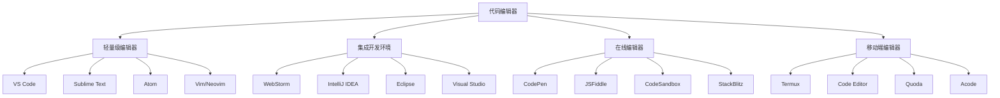

# 代码编辑器推荐

## 编辑器概述

### 编辑器分类


### 编辑器对比
| 编辑器 | 类型 | 特点 | 适用场景 | 价格 |
|--------|------|------|----------|------|
| VS Code | 轻量级 | 免费、插件丰富 | 通用开发 | 免费 |
| WebStorm | IDE | 功能强大、智能提示 | 专业开发 | 付费 |
| Sublime Text | 轻量级 | 快速、简洁 | 快速编辑 | 付费 |
| Vim | 轻量级 | 键盘操作、高效 | 服务器开发 | 免费 |
| CodePen | 在线 | 实时预览、分享 | 前端演示 | 免费/付费 |

## 主流编辑器

### Visual Studio Code
```javascript
// 1. 核心特性
const vscodeFeatures = {
    "智能提示": "IntelliSense自动补全",
    "调试功能": "内置调试器支持",
    "Git集成": "版本控制集成",
    "插件系统": "丰富的扩展生态",
    "多语言支持": "支持多种编程语言",
    "主题定制": "丰富的主题和图标",
    "终端集成": "内置终端支持",
    "代码片段": "自定义代码片段"
};

// 2. 推荐插件
const recommendedExtensions = {
    "JavaScript": [
        "ES7+ React/Redux/React-Native snippets",
        "JavaScript (ES6) code snippets",
        "Auto Rename Tag",
        "Bracket Pair Colorizer",
        "Prettier - Code formatter",
        "ESLint",
        "Live Server",
        "Thunder Client"
    ],
    "React": [
        "ES7+ React/Redux/React-Native snippets",
        "Auto Rename Tag",
        "React Native Tools",
        "React Developer Tools",
        "React Hooks Snippets"
    ],
    "Vue": [
        "Vetur",
        "Vue 3 Snippets",
        "Vue Language Features (Volar)",
        "Vue VSCode Snippets"
    ],
    "通用工具": [
        "GitLens",
        "Path Intellisense",
        "Auto Close Tag",
        "Color Highlight",
        "Material Icon Theme",
        "One Dark Pro",
        "Indent Rainbow"
    ]
};

// 3. 配置文件
// settings.json
const vscodeSettings = {
    "editor.fontSize": 14,
    "editor.tabSize": 2,
    "editor.insertSpaces": true,
    "editor.wordWrap": "on",
    "editor.minimap.enabled": true,
    "editor.formatOnSave": true,
    "editor.codeActionsOnSave": {
        "source.fixAll.eslint": true
    },
    "emmet.includeLanguages": {
        "javascript": "javascriptreact"
    },
    "files.autoSave": "afterDelay",
    "files.autoSaveDelay": 1000,
    "terminal.integrated.fontSize": 14,
    "workbench.colorTheme": "One Dark Pro",
    "workbench.iconTheme": "material-icon-theme"
};

// keybindings.json
const keybindings = [
    {
        "key": "ctrl+shift+p",
        "command": "workbench.action.showCommands"
    },
    {
        "key": "ctrl+`",
        "command": "workbench.action.terminal.toggleTerminal"
    },
    {
        "key": "ctrl+shift+`",
        "command": "workbench.action.terminal.new"
    },
    {
        "key": "ctrl+d",
        "command": "editor.action.addSelectionToNextFindMatch"
    },
    {
        "key": "alt+up",
        "command": "editor.action.moveLinesUpAction"
    },
    {
        "key": "alt+down",
        "command": "editor.action.moveLinesDownAction"
    }
];

// 4. 代码片段
// javascript.json
const javascriptSnippets = {
    "Console log": {
        "prefix": "cl",
        "body": [
            "console.log('$1');"
        ],
        "description": "Console log"
    },
    "Function": {
        "prefix": "fn",
        "body": [
            "function ${1:functionName}(${2:params}) {",
            "    $3",
            "}"
        ],
        "description": "Function declaration"
    },
    "Arrow function": {
        "prefix": "af",
        "body": [
            "const ${1:functionName} = (${2:params}) => {",
            "    $3",
            "};"
        ],
        "description": "Arrow function"
    },
    "Async function": {
        "prefix": "async",
        "body": [
            "async function ${1:functionName}(${2:params}) {",
            "    $3",
            "}"
        ],
        "description": "Async function"
    }
};
```

### WebStorm
```javascript
// 1. 核心特性
const webstormFeatures = {
    "智能代码补全": "基于上下文的代码补全",
    "重构工具": "强大的重构功能",
    "调试器": "内置调试器支持",
    "版本控制": "Git集成和可视化",
    "代码检查": "实时代码质量检查",
    "测试集成": "单元测试和覆盖率",
    "数据库工具": "数据库连接和查询",
    "终端集成": "内置终端支持"
};

// 2. 快捷键
const webstormShortcuts = {
    "代码导航": {
        "Ctrl+Click": "跳转到定义",
        "Ctrl+B": "跳转到定义",
        "Ctrl+Alt+B": "跳转到实现",
        "Alt+F7": "查找使用位置",
        "Ctrl+F12": "查看文件结构"
    },
    "代码编辑": {
        "Ctrl+D": "复制行",
        "Ctrl+Y": "删除行",
        "Ctrl+Shift+Up/Down": "移动行",
        "Ctrl+Alt+L": "格式化代码",
        "Ctrl+/": "行注释",
        "Ctrl+Shift+/": "块注释"
    },
    "重构": {
        "Shift+F6": "重命名",
        "Ctrl+Alt+M": "提取方法",
        "Ctrl+Alt+V": "提取变量",
        "Ctrl+Alt+F": "提取字段",
        "Ctrl+Alt+C": "提取常量"
    },
    "运行调试": {
        "Shift+F10": "运行",
        "Shift+F9": "调试",
        "Ctrl+F2": "停止",
        "F8": "单步跳过",
        "F7": "单步进入"
    }
};

// 3. 配置优化
const webstormConfig = {
    "编辑器设置": {
        "字体大小": "14px",
        "行高": "1.2",
        "制表符大小": "2",
        "自动换行": "开启",
        "显示行号": "开启",
        "显示空白字符": "开启"
    },
    "代码风格": {
        "JavaScript": "使用ESLint规则",
        "缩进": "2个空格",
        "引号": "单引号",
        "分号": "自动插入",
        "尾随逗号": "ES5"
    },
    "插件推荐": [
        "Vue.js",
        "React",
        "Angular",
        "Node.js",
        "Database Tools",
        "Git Integration",
        "Terminal"
    ]
};
```

### Sublime Text
```javascript
// 1. 核心特性
const sublimeFeatures = {
    "快速启动": "启动速度快",
    "多光标编辑": "同时编辑多个位置",
    "命令面板": "快速执行命令",
    "插件系统": "丰富的插件生态",
    "主题定制": "可定制界面",
    "跨平台": "支持多操作系统",
    "正则表达式": "强大的搜索替换",
    "代码折叠": "代码块折叠"
};

// 2. 推荐插件
const sublimePackages = {
    "包管理器": "Package Control",
    "主题": [
        "Material Theme",
        "One Dark",
        "Dracula",
        "Monokai"
    ],
    "功能增强": [
        "Emmet",
        "SublimeLinter",
        "SublimeCodeIntel",
        "AutoFileName",
        "BracketHighlighter",
        "ColorPicker",
        "GitGutter",
        "SideBarEnhancements"
    ],
    "语言支持": [
        "JavaScript Completions",
        "Vue Syntax Highlight",
        "ReactJS",
        "TypeScript",
        "Node.js"
    ]
};

// 3. 配置文件
// Preferences.sublime-settings
const sublimeSettings = {
    "font_size": 14,
    "tab_size": 2,
    "translate_tabs_to_spaces": true,
    "word_wrap": true,
    "line_numbers": true,
    "gutter": true,
    "rulers": [80, 120],
    "draw_white_space": "all",
    "trim_trailing_white_space_on_save": true,
    "ensure_newline_at_eof_on_save": true,
    "auto_complete": true,
    "auto_complete_delay": 50,
    "auto_complete_commit_on_tab": true,
    "highlight_line": true,
    "highlight_modified_tabs": true,
    "show_encoding": true,
    "show_line_endings": true
};

// Key Bindings
const sublimeKeyBindings = [
    {
        "keys": ["ctrl+shift+p"],
        "command": "show_overlay",
        "args": {"overlay": "command_palette"}
    },
    {
        "keys": ["ctrl+p"],
        "command": "show_overlay",
        "args": {"overlay": "goto"}
    },
    {
        "keys": ["ctrl+shift+f"],
        "command": "show_panel",
        "args": {"panel": "find_in_files"}
    },
    {
        "keys": ["ctrl+`"],
        "command": "show_panel",
        "args": {"panel": "console", "toggle": true}
    }
];
```

### Vim/Neovim
```javascript
// 1. 核心特性
const vimFeatures = {
    "模态编辑": "插入、命令、可视模式",
    "键盘操作": "完全键盘操作",
    "高效编辑": "快速文本编辑",
    "可定制性": "高度可定制",
    "轻量级": "资源占用少",
    "跨平台": "支持多操作系统",
    "插件系统": "丰富的插件生态",
    "脚本支持": "VimScript支持"
};

// 2. 基本操作
const vimCommands = {
    "移动": {
        "h": "左移",
        "j": "下移",
        "k": "上移",
        "l": "右移",
        "w": "下一个单词",
        "b": "上一个单词",
        "0": "行首",
        "$": "行尾",
        "gg": "文件开头",
        "G": "文件结尾"
    },
    "编辑": {
        "i": "插入模式",
        "a": "在光标后插入",
        "o": "新行插入",
        "O": "上一行插入",
        "x": "删除字符",
        "dd": "删除行",
        "yy": "复制行",
        "p": "粘贴",
        "u": "撤销",
        "Ctrl+r": "重做"
    },
    "搜索": {
        "/": "向下搜索",
        "?": "向上搜索",
        "n": "下一个匹配",
        "N": "上一个匹配",
        "*": "搜索当前单词",
        "#": "向上搜索当前单词"
    }
};

// 3. 配置文件
// .vimrc
const vimConfig = `
" 基本设置
set number
set relativenumber
set tabstop=2
set shiftwidth=2
set expandtab
set autoindent
set smartindent
set wrap
set linebreak
set showmatch
set hlsearch
set incsearch
set ignorecase
set smartcase

" 插件管理
call plug#begin('~/.vim/plugged')
Plug 'preservim/nerdtree'
Plug 'vim-airline/vim-airline'
Plug 'vim-airline/vim-airline-themes'
Plug 'tpope/vim-fugitive'
Plug 'airblade/vim-gitgutter'
Plug 'junegunn/fzf', { 'do': { -> fzf#install() } }
Plug 'junegunn/fzf.vim'
Plug 'neoclide/coc.nvim', {'branch': 'release'}
call plug#end()

" 快捷键
nnoremap <C-n> :NERDTreeToggle<CR>
nnoremap <C-p> :Files<CR>
nnoremap <C-f> :Rg<CR>
nnoremap <leader>gs :Git<CR>
nnoremap <leader>gc :Git commit<CR>
nnoremap <leader>gp :Git push<CR>
`;

// 4. 插件推荐
const vimPlugins = {
    "文件管理": [
        "NERDTree - 文件树",
        "fzf.vim - 模糊搜索",
        "vim-vinegar - 文件浏览器"
    ],
    "代码补全": [
        "coc.nvim - 语言服务器",
        "YouCompleteMe - 代码补全",
        "deoplete.nvim - 异步补全"
    ],
    "Git集成": [
        "vim-fugitive - Git命令",
        "vim-gitgutter - Git状态",
        "gv.vim - Git提交历史"
    ],
    "主题美化": [
        "vim-airline - 状态栏",
        "onedark.vim - 主题",
        "vim-devicons - 图标"
    ]
};
```

## 在线编辑器

### CodePen
```javascript
// 1. 核心特性
const codepenFeatures = {
    "实时预览": "代码修改即时生效",
    "多语言支持": "HTML、CSS、JavaScript",
    "框架支持": "React、Vue、Angular等",
    "分享功能": "代码分享和展示",
    "社区功能": "发现和收藏作品",
    "模板库": "丰富的代码模板",
    "协作功能": "多人协作编辑",
    "导出功能": "代码导出和部署"
};

// 2. 使用技巧
const codepenTips = {
    "HTML设置": {
        "DOCTYPE": "自动添加HTML5文档类型",
        "外部资源": "支持CDN链接",
        "模板引擎": "支持Pug、Haml等"
    },
    "CSS设置": {
        "预处理器": "支持Sass、Less、Stylus",
        "自动前缀": "自动添加浏览器前缀",
        "重置样式": "可选择CSS重置"
    },
    "JavaScript设置": {
        "ES6+": "支持现代JavaScript特性",
        "外部库": "支持jQuery、Lodash等",
        "框架": "支持React、Vue等框架"
    }
};

// 3. 实用功能
const codepenUtils = {
    "代码格式化": "自动格式化代码",
    "语法高亮": "支持多种语言高亮",
    "错误检查": "实时错误提示",
    "控制台": "内置浏览器控制台",
    "全屏模式": "全屏编辑和预览",
    "移动端预览": "移动设备预览",
    "版本控制": "代码版本历史",
    "收藏功能": "收藏喜欢的作品"
};
```

### CodeSandbox
```javascript
// 1. 核心特性
const codesandboxFeatures = {
    "项目模板": "React、Vue、Angular等模板",
    "NPM支持": "完整的NPM包支持",
    "实时协作": "多人实时协作",
    "Git集成": "GitHub集成和同步",
    "部署功能": "一键部署到Vercel",
    "TypeScript": "完整的TypeScript支持",
    "测试支持": "Jest、Cypress等测试框架",
    "代码分割": "支持代码分割和懒加载"
};

// 2. 项目模板
const projectTemplates = {
    "React": [
        "React",
        "React + TypeScript",
        "Create React App",
        "Next.js",
        "Gatsby"
    ],
    "Vue": [
        "Vue 3",
        "Vue 2",
        "Nuxt.js",
        "Vue + TypeScript"
    ],
    "Angular": [
        "Angular",
        "Angular + TypeScript",
        "Ionic"
    ],
    "其他": [
        "Vanilla JavaScript",
        "Node.js",
        "Static HTML",
        "Svelte"
    ]
};

// 3. 高级功能
const advancedFeatures = {
    "环境变量": "支持环境变量配置",
    "自定义配置": "支持各种配置文件",
    "插件系统": "支持VS Code插件",
    "终端访问": "完整的终端访问",
    "文件系统": "完整的文件系统支持",
    "热重载": "支持热重载开发",
    "错误边界": "React错误边界支持",
    "性能分析": "内置性能分析工具"
};
```

### StackBlitz
```javascript
// 1. 核心特性
const stackblitzFeatures = {
    "WebContainer": "浏览器中运行Node.js",
    "VS Code集成": "完整的VS Code体验",
    "NPM支持": "完整的NPM生态系统",
    "TypeScript": "原生TypeScript支持",
    "热重载": "极快的热重载速度",
    "Git集成": "GitHub集成和同步",
    "部署功能": "一键部署到各种平台",
    "协作功能": "实时协作编辑"
};

// 2. 技术栈支持
const techStackSupport = {
    "前端框架": [
        "React",
        "Vue",
        "Angular",
        "Svelte",
        "Solid"
    ],
    "构建工具": [
        "Vite",
        "Webpack",
        "Rollup",
        "Parcel",
        "esbuild"
    ],
    "CSS框架": [
        "Tailwind CSS",
        "Bootstrap",
        "Material-UI",
        "Ant Design",
        "Chakra UI"
    ],
    "后端框架": [
        "Express",
        "Fastify",
        "Koa",
        "NestJS",
        "Next.js API"
    ]
};

// 3. 开发体验
const developmentExperience = {
    "启动速度": "极快的项目启动速度",
    "编辑体验": "完整的VS Code功能",
    "调试支持": "内置调试器支持",
    "扩展支持": "支持VS Code扩展",
    "主题支持": "支持各种主题",
    "快捷键": "完整的快捷键支持",
    "智能提示": "智能代码补全",
    "错误检查": "实时错误检查"
};
```

## 移动端编辑器

### Termux
```javascript
// 1. 核心特性
const termuxFeatures = {
    "Linux环境": "完整的Linux环境",
    "包管理": "APT包管理器",
    "开发工具": "支持各种开发工具",
    "Git支持": "完整的Git支持",
    "Node.js": "支持Node.js开发",
    "Python": "支持Python开发",
    "SSH": "SSH客户端功能",
    "文件管理": "完整的文件系统"
};

// 2. 安装配置
const termuxSetup = `
# 更新包
pkg update && pkg upgrade

# 安装开发工具
pkg install git nodejs python

# 安装编辑器
pkg install vim nano

# 安装Git配置
git config --global user.name "Your Name"
git config --global user.email "your.email@example.com"

# 安装Node.js包
npm install -g yarn pnpm

# 安装Python包
pip install requests beautifulsoup4
`;

// 3. 实用工具
const termuxTools = {
    "文本编辑": [
        "vim - 强大的文本编辑器",
        "nano - 简单的文本编辑器",
        "emacs - 功能丰富的编辑器"
    ],
    "开发工具": [
        "git - 版本控制",
        "node - JavaScript运行时",
        "python - Python解释器",
        "gcc - C编译器"
    ],
    "系统工具": [
        "htop - 系统监控",
        "tree - 目录树显示",
        "wget - 文件下载",
        "curl - HTTP客户端"
    ]
};
```

## 编辑器选择建议

### 选择标准
1. **项目类型**
   - 前端开发：VS Code、WebStorm
   - 后端开发：VS Code、IntelliJ IDEA
   - 移动开发：VS Code、Android Studio
   - 数据科学：VS Code、PyCharm

2. **团队协作**
   - 统一编辑器：提高协作效率
   - 配置同步：共享编辑器配置
   - 插件标准：统一插件和扩展

3. **个人偏好**
   - 学习曲线：选择适合的编辑器
   - 定制需求：根据需求定制
   - 性能要求：考虑性能需求

### 最佳实践
1. **配置管理**
   - 使用版本控制管理配置
   - 定期备份配置文件
   - 分享有用的配置

2. **插件管理**
   - 定期更新插件
   - 移除不用的插件
   - 使用插件管理器

3. **快捷键**
   - 学习常用快捷键
   - 自定义快捷键
   - 保持一致性

## 相关链接
- [[06-资源工具/02-在线工具/02-在线调试工具]] - 在线调试工具
- [[06-资源工具/02-在线工具/03-性能分析工具]] - 性能分析工具
- [[06-资源工具/02-在线工具/04-代码质量检查]] - 代码质量检查
- [[06-资源工具/03-学习资源/01-推荐书籍]] - 推荐书籍
