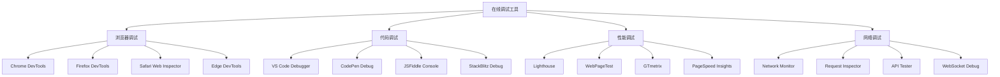

# 在线调试工具

## 调试工具概述

### 工具分类


### 工具对比
| 工具 | 类型 | 特点 | 适用场景 | 价格 |
|------|------|------|----------|------|
| Chrome DevTools | 浏览器工具 | 功能全面、性能分析 | 前端调试 | 免费 |
| VS Code Debugger | 编辑器工具 | 集成度高、断点调试 | 代码调试 | 免费 |
| Lighthouse | 性能分析 | 自动化测试、报告详细 | 性能优化 | 免费 |
| WebPageTest | 性能测试 | 多地点测试、视频录制 | 性能分析 | 免费 |

## 浏览器调试工具

### Chrome DevTools
```javascript
// 1. 控制台调试
// 基础输出
console.log('普通信息');
console.info('信息提示');
console.warn('警告信息');
console.error('错误信息');
console.debug('调试信息');

// 格式化输出
const user = { name: 'John', age: 30 };
console.log('User:', user);
console.log('User: %o', user); // 对象格式化
console.table(user); // 表格显示

// 分组显示
console.group('用户信息');
console.log('姓名:', user.name);
console.log('年龄:', user.age);
console.groupEnd();

// 计时和计数
console.time('操作耗时');
// 执行操作
setTimeout(() => {
    console.timeEnd('操作耗时');
}, 1000);

console.count('点击次数');
console.count('点击次数'); // 2
console.countReset('点击次数');

// 2. 断点调试
function calculateTotal(items) {
    let total = 0;
    debugger; // 设置断点
    
    for (let item of items) {
        total += item.price;
    }
    
    return total;
}

// 3. 性能分析
// 性能测量
performance.mark('start');
// 执行操作
performance.mark('end');
performance.measure('操作耗时', 'start', 'end');

// 内存分析
if (performance.memory) {
    console.log('内存使用:', {
        used: `${(performance.memory.usedJSHeapSize / 1024 / 1024).toFixed(2)} MB`,
        total: `${(performance.memory.totalJSHeapSize / 1024 / 1024).toFixed(2)} MB`,
        limit: `${(performance.memory.jsHeapSizeLimit / 1024 / 1024).toFixed(2)} MB`
    });
}

// 4. 网络监控
// 拦截fetch请求
const originalFetch = window.fetch;
window.fetch = (...args) => {
    console.log('Fetch请求:', args[0]);
    return originalFetch(...args)
        .then(response => {
            console.log('Fetch响应:', response.status, response.url);
            return response;
        })
        .catch(error => {
            console.error('Fetch错误:', error);
            throw error;
        });
};
```

### Firefox DevTools
```javascript
// 1. 控制台特性
// 多行输入
// 在控制台中按Shift+Enter可以换行
function complexFunction() {
    const data = fetch('/api/data')
        .then(response => response.json())
        .then(data => {
            console.log('数据:', data);
            return data;
        });
    return data;
}

// 2. 调试器特性
// 条件断点
function processUsers(users) {
    for (let user of users) {
        // 在Firefox中设置条件: user.age > 30
        console.log('处理用户:', user.name);
    }
}

// 3. 网络监控
// 请求拦截
const originalXHR = window.XMLHttpRequest;
window.XMLHttpRequest = function() {
    const xhr = new originalXHR();
    const originalOpen = xhr.open;
    
    xhr.open = function(method, url) {
        console.log('XHR请求:', method, url);
        return originalOpen.apply(this, arguments);
    };
    
    return xhr;
};

// 4. 性能分析
// 性能观察器
const observer = new PerformanceObserver((list) => {
    for (const entry of list.getEntries()) {
        if (entry.entryType === 'measure') {
            console.log('性能测量:', entry.name, entry.duration);
        }
    }
});

observer.observe({ entryTypes: ['measure'] });
```

### Safari Web Inspector
```javascript
// 1. 移动端调试
// 远程调试
// 在Safari中启用"开发"菜单
// 连接iOS设备进行远程调试

// 2. 响应式设计
// 设备模拟
function checkViewport() {
    console.log('视口尺寸:', {
        width: window.innerWidth,
        height: window.innerHeight,
        devicePixelRatio: window.devicePixelRatio
    });
}

// 3. 存储调试
// LocalStorage检查
function checkStorage() {
    const storage = {
        localStorage: Object.keys(localStorage),
        sessionStorage: Object.keys(sessionStorage),
        cookies: document.cookie
    };
    console.table(storage);
}

// 4. 网络调试
// 资源加载分析
function analyzeResources() {
    const resources = performance.getEntriesByType('resource');
    const summary = resources.reduce((acc, resource) => {
        const type = resource.name.split('.').pop();
        acc[type] = (acc[type] || 0) + 1;
        return acc;
    }, {});
    console.table(summary);
}
```

## 代码调试工具

### VS Code Debugger
```javascript
// 1. 调试配置
// launch.json
const debugConfig = {
    "version": "0.2.0",
    "configurations": [
        {
            "name": "Launch Chrome",
            "type": "chrome",
            "request": "launch",
            "url": "http://localhost:3000",
            "webRoot": "${workspaceFolder}/src",
            "sourceMaps": true
        },
        {
            "name": "Attach to Chrome",
            "type": "chrome",
            "request": "attach",
            "port": 9222,
            "webRoot": "${workspaceFolder}/src"
        },
        {
            "name": "Launch Node.js",
            "type": "node",
            "request": "launch",
            "program": "${workspaceFolder}/app.js",
            "console": "integratedTerminal"
        }
    ]
};

// 2. 断点调试
function processData(data) {
    const result = [];
    
    for (let item of data) {
        // 设置断点
        const processed = transformItem(item);
        result.push(processed);
    }
    
    return result;
}

function transformItem(item) {
    // 条件断点: item.id === 5
    return {
        ...item,
        processed: true,
        timestamp: Date.now()
    };
}

// 3. 调试技巧
// 条件断点
function filterUsers(users, minAge) {
    return users.filter(user => {
        // 条件断点: user.age > minAge
        return user.age >= minAge;
    });
}

// 日志断点
function calculateTotal(items) {
    let total = 0;
    // 日志断点: "计算总数: " + items.length
    for (let item of items) {
        total += item.price;
    }
    return total;
}

// 4. 调试表达式
// 在调试时可以使用表达式
// 例如：user.name, items.length, total * 1.1
```

### CodePen Debug
```javascript
// 1. 控制台调试
// CodePen内置控制台
console.log('CodePen调试信息');

// 2. 实时预览
// 代码修改即时生效
function updateDisplay() {
    const element = document.getElementById('display');
    element.textContent = '实时更新: ' + new Date().toLocaleTimeString();
}

// 每秒钟更新
setInterval(updateDisplay, 1000);

// 3. 错误处理
try {
    // 可能出错的代码
    const result = riskyOperation();
    console.log('操作成功:', result);
} catch (error) {
    console.error('操作失败:', error);
    // 在CodePen中错误会显示在控制台
}

// 4. 性能监控
function measurePerformance() {
    const start = performance.now();
    
    // 执行操作
    for (let i = 0; i < 1000000; i++) {
        Math.random();
    }
    
    const end = performance.now();
    console.log('操作耗时:', end - start, 'ms');
}

measurePerformance();
```

### StackBlitz Debug
```javascript
// 1. 集成调试
// StackBlitz集成了VS Code调试功能
function debugFunction() {
    const data = { name: 'Test', value: 42 };
    
    // 设置断点
    debugger;
    
    const result = processData(data);
    return result;
}

// 2. 热重载调试
// 代码修改后自动重新加载
function hotReloadTest() {
    console.log('热重载测试 - 修改这行代码');
    return '热重载工作正常';
}

// 3. 网络请求调试
async function fetchData() {
    try {
        const response = await fetch('/api/data');
        const data = await response.json();
        console.log('数据获取成功:', data);
        return data;
    } catch (error) {
        console.error('数据获取失败:', error);
        throw error;
    }
}

// 4. 组件调试
// React组件调试
import React, { useState, useEffect } from 'react';

function DebugComponent() {
    const [count, setCount] = useState(0);
    
    useEffect(() => {
        console.log('组件挂载或更新');
        return () => {
            console.log('组件卸载');
        };
    });
    
    const handleClick = () => {
        setCount(prev => {
            console.log('计数更新:', prev + 1);
            return prev + 1;
        });
    };
    
    return (
        <div>
            <p>计数: {count}</p>
            <button onClick={handleClick}>增加</button>
        </div>
    );
}
```

## 性能调试工具

### Lighthouse
```javascript
// 1. 性能审计
// 自动化性能测试
const lighthouseConfig = {
    "extends": "lighthouse:default",
    "settings": {
        "onlyAudits": [
            "first-contentful-paint",
            "largest-contentful-paint",
            "first-meaningful-paint",
            "speed-index",
            "interactive",
            "cumulative-layout-shift"
        ]
    }
};

// 2. 自定义审计
// 创建自定义性能指标
function customPerformanceAudit() {
    const metrics = {
        fcp: performance.getEntriesByName('first-contentful-paint')[0]?.startTime,
        lcp: performance.getEntriesByType('largest-contentful-paint')[0]?.startTime,
        fid: performance.getEntriesByType('first-input')[0]?.processingStart,
        cls: performance.getEntriesByType('layout-shift').reduce((sum, entry) => sum + entry.value, 0)
    };
    
    console.log('性能指标:', metrics);
    return metrics;
}

// 3. 性能预算
const performanceBudget = {
    fcp: 1800, // 1.8s
    lcp: 2500, // 2.5s
    fid: 100,  // 100ms
    cls: 0.1   // 0.1
};

function checkPerformanceBudget(metrics) {
    const violations = [];
    
    if (metrics.fcp > performanceBudget.fcp) {
        violations.push(`FCP超出预算: ${metrics.fcp}ms > ${performanceBudget.fcp}ms`);
    }
    
    if (metrics.lcp > performanceBudget.lcp) {
        violations.push(`LCP超出预算: ${metrics.lcp}ms > ${performanceBudget.lcp}ms`);
    }
    
    if (violations.length > 0) {
        console.warn('性能预算违规:', violations);
    }
    
    return violations;
}

// 4. 性能报告
function generatePerformanceReport() {
    const metrics = customPerformanceAudit();
    const violations = checkPerformanceBudget(metrics);
    
    return {
        timestamp: new Date().toISOString(),
        metrics: metrics,
        violations: violations,
        score: calculatePerformanceScore(metrics)
    };
}

function calculatePerformanceScore(metrics) {
    // 简化的性能评分算法
    let score = 100;
    
    if (metrics.fcp > 1800) score -= 20;
    if (metrics.lcp > 2500) score -= 25;
    if (metrics.fid > 100) score -= 15;
    if (metrics.cls > 0.1) score -= 10;
    
    return Math.max(0, score);
}
```

### WebPageTest
```javascript
// 1. 性能测试配置
const webPageTestConfig = {
    url: 'https://example.com',
    location: 'Dulles:Chrome',
    runs: 3,
    firstViewOnly: false,
    video: true,
    breakdown: true,
    domains: true,
    pagespeed: true,
    timeline: true
};

// 2. 性能指标分析
function analyzeWebPageTestResults(results) {
    const analysis = {
        loadTime: results.firstView.loadTime,
        firstByte: results.firstView.TTFB,
        startRender: results.firstView.render,
        speedIndex: results.firstView.SpeedIndex,
        visualComplete: results.firstView.visualComplete,
        fullyLoaded: results.firstView.fullyLoaded
    };
    
    console.log('WebPageTest分析:', analysis);
    return analysis;
}

// 3. 资源分析
function analyzeResources(results) {
    const resources = results.firstView.breakdown;
    const summary = {
        html: resources.html.bytes,
        css: resources.css.bytes,
        js: resources.js.bytes,
        images: resources.image.bytes,
        fonts: resources.font.bytes,
        other: resources.other.bytes
    };
    
    console.log('资源分析:', summary);
    return summary;
}

// 4. 性能建议
function generatePerformanceRecommendations(analysis) {
    const recommendations = [];
    
    if (analysis.loadTime > 3000) {
        recommendations.push('页面加载时间过长，建议优化资源加载');
    }
    
    if (analysis.firstByte > 600) {
        recommendations.push('首字节时间过长，建议优化服务器响应');
    }
    
    if (analysis.speedIndex > 3000) {
        recommendations.push('速度指数过高，建议优化关键渲染路径');
    }
    
    return recommendations;
}
```

## 网络调试工具

### Network Monitor
```javascript
// 1. 请求监控
class NetworkMonitor {
    constructor() {
        this.requests = [];
        this.setupInterceptors();
    }
    
    setupInterceptors() {
        // 拦截fetch请求
        const originalFetch = window.fetch;
        window.fetch = (...args) => {
            const requestId = this.generateId();
            const startTime = performance.now();
            
            this.requests.push({
                id: requestId,
                url: args[0],
                method: 'GET',
                startTime,
                status: 'pending'
            });
            
            return originalFetch(...args)
                .then(response => {
                    this.updateRequest(requestId, {
                        status: response.status,
                        endTime: performance.now(),
                        success: response.ok
                    });
                    return response;
                })
                .catch(error => {
                    this.updateRequest(requestId, {
                        status: 'error',
                        endTime: performance.now(),
                        error: error.message
                    });
                    throw error;
                });
        };
    }
    
    generateId() {
        return Math.random().toString(36).substr(2, 9);
    }
    
    updateRequest(id, updates) {
        const request = this.requests.find(r => r.id === id);
        if (request) {
            Object.assign(request, updates);
        }
    }
    
    getSlowRequests(threshold = 1000) {
        return this.requests.filter(r => 
            r.endTime && (r.endTime - r.startTime) > threshold
        );
    }
    
    getFailedRequests() {
        return this.requests.filter(r => 
            r.status === 'error' || (r.status >= 400 && r.status < 600)
        );
    }
}

const networkMonitor = new NetworkMonitor();

// 2. API测试工具
class APITester {
    constructor() {
        this.tests = [];
    }
    
    async testEndpoint(url, options = {}) {
        const test = {
            url,
            options,
            startTime: Date.now(),
            status: 'running'
        };
        
        try {
            const response = await fetch(url, options);
            const data = await response.json();
            
            test.endTime = Date.now();
            test.status = 'success';
            test.response = {
                status: response.status,
                headers: Object.fromEntries(response.headers),
                data: data
            };
            
        } catch (error) {
            test.endTime = Date.now();
            test.status = 'error';
            test.error = error.message;
        }
        
        this.tests.push(test);
        return test;
    }
    
    getTestResults() {
        return this.tests;
    }
    
    getAverageResponseTime() {
        const successfulTests = this.tests.filter(t => t.status === 'success');
        if (successfulTests.length === 0) return 0;
        
        const totalTime = successfulTests.reduce((sum, test) => 
            sum + (test.endTime - test.startTime), 0);
        
        return totalTime / successfulTests.length;
    }
}

const apiTester = new APITester();

// 3. WebSocket调试
class WebSocketDebugger {
    constructor(url) {
        this.url = url;
        this.socket = null;
        this.messages = [];
        this.connect();
    }
    
    connect() {
        this.socket = new WebSocket(this.url);
        
        this.socket.onopen = (event) => {
            console.log('WebSocket连接已建立');
            this.logMessage('connection', 'open', event);
        };
        
        this.socket.onmessage = (event) => {
            console.log('收到消息:', event.data);
            this.logMessage('incoming', 'message', event.data);
        };
        
        this.socket.onclose = (event) => {
            console.log('WebSocket连接已关闭');
            this.logMessage('connection', 'close', event);
        };
        
        this.socket.onerror = (error) => {
            console.error('WebSocket错误:', error);
            this.logMessage('connection', 'error', error);
        };
    }
    
    send(message) {
        if (this.socket && this.socket.readyState === WebSocket.OPEN) {
            this.socket.send(message);
            this.logMessage('outgoing', 'message', message);
        } else {
            console.error('WebSocket未连接');
        }
    }
    
    logMessage(direction, type, data) {
        this.messages.push({
            timestamp: Date.now(),
            direction,
            type,
            data
        });
    }
    
    getMessages() {
        return this.messages;
    }
    
    disconnect() {
        if (this.socket) {
            this.socket.close();
        }
    }
}
```

## 调试最佳实践

### 调试策略
1. **系统性调试**
   - 从简单到复杂
   - 逐步缩小问题范围
   - 记录调试过程

2. **工具选择**
   - 根据问题类型选择工具
   - 组合使用多种工具
   - 掌握工具的高级功能

3. **预防性调试**
   - 添加错误处理
   - 使用类型检查
   - 编写测试用例

### 调试技巧
1. **断点设置**
   - 条件断点
   - 日志断点
   - 异常断点

2. **变量监控**
   - 监视表达式
   - 调用堆栈
   - 作用域变量

3. **性能分析**
   - 性能测量
   - 内存分析
   - 网络监控

## 相关链接
- [[06-资源工具/02-在线工具/01-代码编辑器推荐]] - 代码编辑器推荐
- [[06-资源工具/02-在线工具/03-性能分析工具]] - 性能分析工具
- [[06-资源工具/02-在线工具/04-代码质量检查]] - 代码质量检查
- [[07-问题解决/02-调试技巧大全]] - 调试技巧大全
