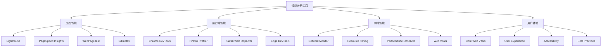

# 性能分析工具

## 工具概述

### 性能分析分类


### 工具对比
| 工具 | 类型 | 特点 | 适用场景 | 价格 |
|------|------|------|----------|------|
| Lighthouse | 自动化测试 | 全面分析、详细报告 | 性能审计 | 免费 |
| Chrome DevTools | 浏览器工具 | 实时分析、深度调试 | 开发调试 | 免费 |
| WebPageTest | 在线测试 | 多地点测试、视频录制 | 性能对比 | 免费 |
| GTmetrix | 在线分析 | 简单易用、历史记录 | 持续监控 | 免费/付费 |

## 页面性能分析

### Lighthouse
```javascript
// 1. 自动化性能审计
class LighthouseAuditor {
    constructor() {
        this.config = {
            extends: 'lighthouse:default',
            settings: {
                onlyAudits: [
                    'first-contentful-paint',
                    'largest-contentful-paint',
                    'first-meaningful-paint',
                    'speed-index',
                    'interactive',
                    'cumulative-layout-shift'
                ]
            }
        };
    }
    
    async auditPage(url) {
        try {
            // 模拟Lighthouse审计
            const metrics = await this.collectMetrics();
            const score = this.calculateScore(metrics);
            
            return {
                url,
                timestamp: new Date().toISOString(),
                metrics,
                score,
                recommendations: this.generateRecommendations(metrics)
            };
        } catch (error) {
            console.error('审计失败:', error);
            throw error;
        }
    }
    
    async collectMetrics() {
        // 等待页面加载完成
        await this.waitForLoad();
        
        const metrics = {
            fcp: this.getFCP(),
            lcp: this.getLCP(),
            fid: this.getFID(),
            cls: this.getCLS(),
            tti: this.getTTI(),
            speedIndex: this.getSpeedIndex()
        };
        
        return metrics;
    }
    
    getFCP() {
        const fcpEntry = performance.getEntriesByName('first-contentful-paint')[0];
        return fcpEntry ? fcpEntry.startTime : null;
    }
    
    getLCP() {
        const lcpEntries = performance.getEntriesByType('largest-contentful-paint');
        const lastEntry = lcpEntries[lcpEntries.length - 1];
        return lastEntry ? lastEntry.startTime : null;
    }
    
    getFID() {
        const fidEntries = performance.getEntriesByType('first-input');
        if (fidEntries.length > 0) {
            const entry = fidEntries[0];
            return entry.processingStart - entry.startTime;
        }
        return null;
    }
    
    getCLS() {
        const clsEntries = performance.getEntriesByType('layout-shift');
        return clsEntries.reduce((sum, entry) => {
            if (!entry.hadRecentInput) {
                sum += entry.value;
            }
            return sum;
        }, 0);
    }
    
    getTTI() {
        // 简化的TTI计算
        return performance.now();
    }
    
    getSpeedIndex() {
        // 简化的Speed Index计算
        return performance.now() * 0.8;
    }
    
    calculateScore(metrics) {
        let score = 100;
        
        // FCP评分
        if (metrics.fcp > 1800) score -= 20;
        else if (metrics.fcp > 3000) score -= 40;
        
        // LCP评分
        if (metrics.lcp > 2500) score -= 25;
        else if (metrics.lcp > 4000) score -= 50;
        
        // FID评分
        if (metrics.fid > 100) score -= 15;
        else if (metrics.fid > 300) score -= 30;
        
        // CLS评分
        if (metrics.cls > 0.1) score -= 10;
        else if (metrics.cls > 0.25) score -= 20;
        
        return Math.max(0, score);
    }
    
    generateRecommendations(metrics) {
        const recommendations = [];
        
        if (metrics.fcp > 1800) {
            recommendations.push('优化首屏内容绘制，减少阻塞资源');
        }
        
        if (metrics.lcp > 2500) {
            recommendations.push('优化最大内容绘制，预加载关键资源');
        }
        
        if (metrics.fid > 100) {
            recommendations.push('减少主线程阻塞，优化JavaScript执行');
        }
        
        if (metrics.cls > 0.1) {
            recommendations.push('减少布局偏移，为图片和广告预留空间');
        }
        
        return recommendations;
    }
    
    waitForLoad() {
        return new Promise(resolve => {
            if (document.readyState === 'complete') {
                resolve();
            } else {
                window.addEventListener('load', resolve);
            }
        });
    }
}

const lighthouseAuditor = new LighthouseAuditor();

// 2. 性能预算检查
class PerformanceBudget {
    constructor() {
        this.budget = {
            fcp: 1800,    // 1.8s
            lcp: 2500,    // 2.5s
            fid: 100,     // 100ms
            cls: 0.1,     // 0.1
            tti: 3800,    // 3.8s
            speedIndex: 3400 // 3.4s
        };
    }
    
    checkBudget(metrics) {
        const violations = [];
        
        Object.keys(this.budget).forEach(metric => {
            if (metrics[metric] && metrics[metric] > this.budget[metric]) {
                violations.push({
                    metric,
                    actual: metrics[metric],
                    budget: this.budget[metric],
                    overage: metrics[metric] - this.budget[metric]
                });
            }
        });
        
        return violations;
    }
    
    updateBudget(metric, value) {
        this.budget[metric] = value;
    }
    
    getBudget() {
        return { ...this.budget };
    }
}

const performanceBudget = new PerformanceBudget();
```

### WebPageTest
```javascript
// 1. 性能测试配置
class WebPageTestRunner {
    constructor() {
        this.config = {
            url: window.location.href,
            location: 'Dulles:Chrome',
            runs: 3,
            firstViewOnly: false,
            video: true,
            breakdown: true,
            domains: true,
            pagespeed: true,
            timeline: true
        };
    }
    
    async runTest() {
        try {
            // 模拟WebPageTest测试
            const results = await this.simulateTest();
            return this.analyzeResults(results);
        } catch (error) {
            console.error('测试失败:', error);
            throw error;
        }
    }
    
    async simulateTest() {
        // 等待页面完全加载
        await this.waitForCompleteLoad();
        
        const results = {
            firstView: {
                loadTime: this.getLoadTime(),
                TTFB: this.getTTFB(),
                render: this.getStartRender(),
                SpeedIndex: this.getSpeedIndex(),
                visualComplete: this.getVisualComplete(),
                fullyLoaded: this.getFullyLoaded()
            },
            breakdown: this.getResourceBreakdown(),
            domains: this.getDomainBreakdown()
        };
        
        return results;
    }
    
    getLoadTime() {
        const navigation = performance.getEntriesByType('navigation')[0];
        return navigation ? navigation.loadEventEnd - navigation.navigationStart : 0;
    }
    
    getTTFB() {
        const navigation = performance.getEntriesByType('navigation')[0];
        return navigation ? navigation.responseStart - navigation.navigationStart : 0;
    }
    
    getStartRender() {
        const paintEntries = performance.getEntriesByType('paint');
        const fcp = paintEntries.find(entry => entry.name === 'first-contentful-paint');
        return fcp ? fcp.startTime : 0;
    }
    
    getSpeedIndex() {
        // 简化的Speed Index计算
        return this.getStartRender() * 1.5;
    }
    
    getVisualComplete() {
        const paintEntries = performance.getEntriesByType('paint');
        const lcp = paintEntries.find(entry => entry.name === 'largest-contentful-paint');
        return lcp ? lcp.startTime : 0;
    }
    
    getFullyLoaded() {
        return performance.now();
    }
    
    getResourceBreakdown() {
        const resources = performance.getEntriesByType('resource');
        const breakdown = {
            html: { bytes: 0, requests: 0 },
            css: { bytes: 0, requests: 0 },
            js: { bytes: 0, requests: 0 },
            image: { bytes: 0, requests: 0 },
            font: { bytes: 0, requests: 0 },
            other: { bytes: 0, requests: 0 }
        };
        
        resources.forEach(resource => {
            const type = this.getResourceType(resource.name);
            breakdown[type].bytes += resource.transferSize || 0;
            breakdown[type].requests += 1;
        });
        
        return breakdown;
    }
    
    getResourceType(url) {
        if (url.includes('.html')) return 'html';
        if (url.includes('.css')) return 'css';
        if (url.includes('.js')) return 'js';
        if (url.match(/\.(jpg|jpeg|png|gif|webp|svg)$/)) return 'image';
        if (url.match(/\.(woff|woff2|ttf|eot)$/)) return 'font';
        return 'other';
    }
    
    getDomainBreakdown() {
        const resources = performance.getEntriesByType('resource');
        const domains = {};
        
        resources.forEach(resource => {
            try {
                const domain = new URL(resource.name).hostname;
                if (!domains[domain]) {
                    domains[domain] = { bytes: 0, requests: 0 };
                }
                domains[domain].bytes += resource.transferSize || 0;
                domains[domain].requests += 1;
            } catch (e) {
                // 忽略无效URL
            }
        });
        
        return domains;
    }
    
    analyzeResults(results) {
        const analysis = {
            performance: {
                loadTime: results.firstView.loadTime,
                speedIndex: results.firstView.SpeedIndex,
                firstByte: results.firstView.TTFB,
                startRender: results.firstView.render
            },
            resources: results.breakdown,
            domains: results.domains,
            recommendations: this.generateRecommendations(results)
        };
        
        return analysis;
    }
    
    generateRecommendations(results) {
        const recommendations = [];
        
        if (results.firstView.loadTime > 3000) {
            recommendations.push('页面加载时间过长，建议优化资源加载');
        }
        
        if (results.firstView.TTFB > 600) {
            recommendations.push('首字节时间过长，建议优化服务器响应');
        }
        
        if (results.breakdown.js.bytes > 500 * 1024) {
            recommendations.push('JavaScript文件过大，建议代码分割和压缩');
        }
        
        if (results.breakdown.image.bytes > 1024 * 1024) {
            recommendations.push('图片文件过大，建议优化图片格式和大小');
        }
        
        return recommendations;
    }
    
    waitForCompleteLoad() {
        return new Promise(resolve => {
            if (document.readyState === 'complete') {
                setTimeout(resolve, 1000); // 等待1秒确保完全加载
            } else {
                window.addEventListener('load', () => {
                    setTimeout(resolve, 1000);
                });
            }
        });
    }
}

const webPageTestRunner = new WebPageTestRunner();
```

## 运行时性能分析

### Chrome DevTools Performance
```javascript
// 1. 性能分析器
class PerformanceProfiler {
    constructor() {
        this.profiles = new Map();
        this.observers = [];
        this.init();
    }
    
    init() {
        // 监听性能条目
        this.observePerformanceEntries();
        
        // 监听内存使用
        this.observeMemoryUsage();
        
        // 监听用户交互
        this.observeUserInteractions();
    }
    
    observePerformanceEntries() {
        const observer = new PerformanceObserver((list) => {
            for (const entry of list.getEntries()) {
                this.recordPerformanceEntry(entry);
            }
        });
        
        observer.observe({ entryTypes: ['measure', 'navigation', 'resource'] });
        this.observers.push(observer);
    }
    
    observeMemoryUsage() {
        if (performance.memory) {
            setInterval(() => {
                this.recordMemoryUsage();
            }, 5000);
        }
    }
    
    observeUserInteractions() {
        const events = ['click', 'keydown', 'scroll', 'resize'];
        events.forEach(eventType => {
            document.addEventListener(eventType, (event) => {
                this.recordUserInteraction(event);
            }, { passive: true });
        });
    }
    
    recordPerformanceEntry(entry) {
        const profile = {
            name: entry.name,
            type: entry.entryType,
            startTime: entry.startTime,
            duration: entry.duration,
            timestamp: Date.now()
        };
        
        if (!this.profiles.has(entry.entryType)) {
            this.profiles.set(entry.entryType, []);
        }
        
        this.profiles.get(entry.entryType).push(profile);
    }
    
    recordMemoryUsage() {
        const memory = {
            used: performance.memory.usedJSHeapSize,
            total: performance.memory.totalJSHeapSize,
            limit: performance.memory.jsHeapSizeLimit,
            timestamp: Date.now()
        };
        
        if (!this.profiles.has('memory')) {
            this.profiles.set('memory', []);
        }
        
        this.profiles.get('memory').push(memory);
    }
    
    recordUserInteraction(event) {
        const interaction = {
            type: event.type,
            target: event.target.tagName,
            timestamp: Date.now(),
            duration: 0
        };
        
        // 测量交互响应时间
        requestAnimationFrame(() => {
            interaction.duration = performance.now() - interaction.timestamp;
            
            if (!this.profiles.has('interaction')) {
                this.profiles.set('interaction', []);
            }
            
            this.profiles.get('interaction').push(interaction);
        });
    }
    
    getProfileSummary() {
        const summary = {};
        
        for (const [type, entries] of this.profiles) {
            if (entries.length === 0) continue;
            
            summary[type] = {
                count: entries.length,
                averageDuration: this.calculateAverage(entries, 'duration'),
                totalDuration: entries.reduce((sum, entry) => sum + (entry.duration || 0), 0)
            };
        }
        
        return summary;
    }
    
    calculateAverage(entries, property) {
        const values = entries.map(entry => entry[property] || 0);
        return values.reduce((sum, value) => sum + value, 0) / values.length;
    }
    
    cleanup() {
        this.observers.forEach(observer => observer.disconnect());
    }
}

const performanceProfiler = new PerformanceProfiler();

// 2. 内存分析器
class MemoryAnalyzer {
    constructor() {
        this.snapshots = [];
        this.leakDetector = null;
        this.init();
    }
    
    init() {
        this.leakDetector = new MemoryLeakDetector();
        this.startMonitoring();
    }
    
    startMonitoring() {
        // 定期收集内存快照
        setInterval(() => {
            this.takeSnapshot();
        }, 10000); // 每10秒
    }
    
    takeSnapshot() {
        if (performance.memory) {
            const snapshot = {
                timestamp: Date.now(),
                used: performance.memory.usedJSHeapSize,
                total: performance.memory.totalJSHeapSize,
                limit: performance.memory.jsHeapSizeLimit
            };
            
            this.snapshots.push(snapshot);
            
            // 保持最近50个快照
            if (this.snapshots.length > 50) {
                this.snapshots.shift();
            }
            
            // 检测内存泄漏
            this.leakDetector.analyze(snapshot);
        }
    }
    
    getMemoryTrend() {
        if (this.snapshots.length < 2) return null;
        
        const first = this.snapshots[0];
        const last = this.snapshots[this.snapshots.length - 1];
        
        return {
            start: first.used,
            end: last.used,
            change: last.used - first.used,
            trend: last.used > first.used ? 'increasing' : 'decreasing'
        };
    }
    
    getMemoryReport() {
        const trend = this.getMemoryTrend();
        const current = this.snapshots[this.snapshots.length - 1];
        
        return {
            current: current,
            trend: trend,
            snapshots: this.snapshots.length,
            leakDetected: this.leakDetector.hasLeak()
        };
    }
}

class MemoryLeakDetector {
    constructor() {
        this.threshold = 1024 * 1024; // 1MB
        this.leakDetected = false;
    }
    
    analyze(snapshot) {
        if (this.snapshots.length < 3) return;
        
        const recent = this.snapshots.slice(-3);
        const trend = this.calculateTrend(recent);
        
        if (trend > this.threshold) {
            this.leakDetected = true;
            console.warn('检测到内存泄漏趋势:', {
                trend: `${(trend / 1024 / 1024).toFixed(2)} MB`,
                current: `${(snapshot.used / 1024 / 1024).toFixed(2)} MB`
            });
        }
    }
    
    calculateTrend(snapshots) {
        if (snapshots.length < 2) return 0;
        
        const first = snapshots[0];
        const last = snapshots[snapshots.length - 1];
        
        return last.used - first.used;
    }
    
    hasLeak() {
        return this.leakDetected;
    }
}

const memoryAnalyzer = new MemoryAnalyzer();
```

## 网络性能分析

### Network Monitor
```javascript
// 1. 网络监控器
class NetworkMonitor {
    constructor() {
        this.requests = [];
        this.resources = [];
        this.setupInterceptors();
        this.observeResources();
    }
    
    setupInterceptors() {
        // 拦截fetch请求
        const originalFetch = window.fetch;
        window.fetch = (...args) => {
            const requestId = this.generateId();
            const startTime = performance.now();
            
            const request = {
                id: requestId,
                url: args[0],
                method: 'GET',
                startTime,
                status: 'pending'
            };
            
            this.requests.push(request);
            
            return originalFetch(...args)
                .then(response => {
                    this.updateRequest(requestId, {
                        status: response.status,
                        endTime: performance.now(),
                        success: response.ok,
                        size: response.headers.get('content-length')
                    });
                    return response;
                })
                .catch(error => {
                    this.updateRequest(requestId, {
                        status: 'error',
                        endTime: performance.now(),
                        error: error.message
                    });
                    throw error;
                });
        };
    }
    
    observeResources() {
        const observer = new PerformanceObserver((list) => {
            for (const entry of list.getEntries()) {
                if (entry.entryType === 'resource') {
                    this.analyzeResource(entry);
                }
            }
        });
        
        observer.observe({ entryTypes: ['resource'] });
    }
    
    analyzeResource(entry) {
        const resource = {
            name: entry.name,
            type: this.getResourceType(entry),
            duration: entry.duration,
            size: entry.transferSize,
            startTime: entry.startTime,
            endTime: entry.startTime + entry.duration,
            cached: entry.transferSize === 0
        };
        
        this.resources.push(resource);
        
        // 分析慢资源
        if (resource.duration > 1000) {
            console.warn('慢资源:', resource);
        }
        
        // 分析大资源
        if (resource.size > 1024 * 1024) {
            console.warn('大资源:', resource);
        }
    }
    
    getResourceType(entry) {
        if (entry.name.includes('.js')) return 'script';
        if (entry.name.includes('.css')) return 'stylesheet';
        if (entry.name.match(/\.(png|jpg|jpeg|gif|webp|svg)$/)) return 'image';
        if (entry.name.match(/\.(woff|woff2|ttf|eot)$/)) return 'font';
        return 'other';
    }
    
    updateRequest(id, updates) {
        const request = this.requests.find(r => r.id === id);
        if (request) {
            Object.assign(request, updates);
        }
    }
    
    generateId() {
        return Math.random().toString(36).substr(2, 9);
    }
    
    getSlowRequests(threshold = 1000) {
        return this.requests.filter(r => 
            r.endTime && (r.endTime - r.startTime) > threshold
        );
    }
    
    getFailedRequests() {
        return this.requests.filter(r => 
            r.status === 'error' || (r.status >= 400 && r.status < 600)
        );
    }
    
    getResourceSummary() {
        const summary = {
            total: this.resources.length,
            totalSize: this.resources.reduce((sum, r) => sum + r.size, 0),
            totalDuration: this.resources.reduce((sum, r) => sum + r.duration, 0),
            byType: {}
        };
        
        this.resources.forEach(resource => {
            if (!summary.byType[resource.type]) {
                summary.byType[resource.type] = {
                    count: 0,
                    size: 0,
                    duration: 0
                };
            }
            summary.byType[resource.type].count++;
            summary.byType[resource.type].size += resource.size;
            summary.byType[resource.type].duration += resource.duration;
        });
        
        return summary;
    }
    
    getNetworkReport() {
        return {
            requests: {
                total: this.requests.length,
                slow: this.getSlowRequests().length,
                failed: this.getFailedRequests().length
            },
            resources: this.getResourceSummary(),
            recommendations: this.generateRecommendations()
        };
    }
    
    generateRecommendations() {
        const recommendations = [];
        const summary = this.getResourceSummary();
        
        if (summary.totalSize > 5 * 1024 * 1024) {
            recommendations.push('总资源大小超过5MB，建议优化资源');
        }
        
        if (summary.byType.js && summary.byType.js.size > 500 * 1024) {
            recommendations.push('JavaScript文件过大，建议代码分割');
        }
        
        if (summary.byType.image && summary.byType.image.size > 2 * 1024 * 1024) {
            recommendations.push('图片文件过大，建议优化图片格式');
        }
        
        return recommendations;
    }
}

const networkMonitor = new NetworkMonitor();

// 2. 缓存分析器
class CacheAnalyzer {
    constructor() {
        this.cacheStats = new Map();
        this.init();
    }
    
    init() {
        if ('caches' in window) {
            this.analyzeCaches();
        }
    }
    
    async analyzeCaches() {
        try {
            const cacheNames = await caches.keys();
            
            for (const cacheName of cacheNames) {
                const cache = await caches.open(cacheName);
                const keys = await cache.keys();
                
                this.cacheStats.set(cacheName, {
                    size: keys.length,
                    keys: keys.map(key => ({
                        url: key.url,
                        method: key.method
                    }))
                });
            }
        } catch (error) {
            console.error('缓存分析失败:', error);
        }
    }
    
    getCacheStats() {
        return Object.fromEntries(this.cacheStats);
    }
    
    async getCacheHitRate() {
        // 这里需要实现缓存命中率统计
        // 通常需要服务端支持
        return 0;
    }
    
    async clearCache(cacheName) {
        if ('caches' in window) {
            return await caches.delete(cacheName);
        }
        return false;
    }
}

const cacheAnalyzer = new CacheAnalyzer();
```

## 用户体验分析

### Core Web Vitals
```javascript
// 1. Web Vitals测量器
class WebVitalsMeasurer {
    constructor() {
        this.metrics = {};
        this.observers = [];
        this.init();
    }
    
    init() {
        this.measureFCP();
        this.measureLCP();
        this.measureFID();
        this.measureCLS();
        this.measureTTI();
    }
    
    measureFCP() {
        const observer = new PerformanceObserver((list) => {
            for (const entry of list.getEntries()) {
                if (entry.entryType === 'paint' && entry.name === 'first-contentful-paint') {
                    this.metrics.fcp = entry.startTime;
                    console.log('FCP:', entry.startTime + 'ms');
                }
            }
        });
        
        observer.observe({ entryTypes: ['paint'] });
        this.observers.push(observer);
    }
    
    measureLCP() {
        const observer = new PerformanceObserver((list) => {
            const entries = list.getEntries();
            const lastEntry = entries[entries.length - 1];
            this.metrics.lcp = lastEntry.startTime;
            console.log('LCP:', lastEntry.startTime + 'ms');
        });
        
        observer.observe({ entryTypes: ['largest-contentful-paint'] });
        this.observers.push(observer);
    }
    
    measureFID() {
        const observer = new PerformanceObserver((list) => {
            for (const entry of list.getEntries()) {
                this.metrics.fid = entry.processingStart - entry.startTime;
                console.log('FID:', this.metrics.fid + 'ms');
            }
        });
        
        observer.observe({ entryTypes: ['first-input'] });
        this.observers.push(observer);
    }
    
    measureCLS() {
        let clsValue = 0;
        const observer = new PerformanceObserver((list) => {
            for (const entry of list.getEntries()) {
                if (!entry.hadRecentInput) {
                    clsValue += entry.value;
                }
            }
            this.metrics.cls = clsValue;
            console.log('CLS:', clsValue);
        });
        
        observer.observe({ entryTypes: ['layout-shift'] });
        this.observers.push(observer);
    }
    
    measureTTI() {
        // TTI需要更复杂的计算
        window.addEventListener('load', () => {
            setTimeout(() => {
                this.metrics.tti = performance.now();
                console.log('TTI:', this.metrics.tti + 'ms');
            }, 0);
        });
    }
    
    getMetrics() {
        return this.metrics;
    }
    
    getScore() {
        let score = 100;
        
        // FCP评分
        if (this.metrics.fcp > 1800) score -= 20;
        else if (this.metrics.fcp > 3000) score -= 40;
        
        // LCP评分
        if (this.metrics.lcp > 2500) score -= 25;
        else if (this.metrics.lcp > 4000) score -= 50;
        
        // FID评分
        if (this.metrics.fid > 100) score -= 15;
        else if (this.metrics.fid > 300) score -= 30;
        
        // CLS评分
        if (this.metrics.cls > 0.1) score -= 10;
        else if (this.metrics.cls > 0.25) score -= 20;
        
        return Math.max(0, score);
    }
    
    cleanup() {
        this.observers.forEach(observer => observer.disconnect());
    }
}

const webVitalsMeasurer = new WebVitalsMeasurer();

// 2. 用户体验分析器
class UserExperienceAnalyzer {
    constructor() {
        this.interactions = [];
        this.errors = [];
        this.init();
    }
    
    init() {
        this.trackInteractions();
        this.trackErrors();
        this.trackAccessibility();
    }
    
    trackInteractions() {
        const events = ['click', 'keydown', 'scroll', 'resize'];
        events.forEach(eventType => {
            document.addEventListener(eventType, (event) => {
                this.recordInteraction(event);
            }, { passive: true });
        });
    }
    
    trackErrors() {
        window.addEventListener('error', (event) => {
            this.recordError('JavaScript Error', event.error);
        });
        
        window.addEventListener('unhandledrejection', (event) => {
            this.recordError('Unhandled Promise Rejection', event.reason);
        });
    }
    
    trackAccessibility() {
        // 检查键盘导航
        document.addEventListener('keydown', (event) => {
            if (event.key === 'Tab') {
                this.recordInteraction({
                    type: 'keyboard_navigation',
                    target: event.target.tagName,
                    timestamp: Date.now()
                });
            }
        });
    }
    
    recordInteraction(event) {
        const interaction = {
            type: event.type,
            target: event.target.tagName,
            timestamp: Date.now(),
            duration: 0
        };
        
        // 测量交互响应时间
        requestAnimationFrame(() => {
            interaction.duration = performance.now() - interaction.timestamp;
            this.interactions.push(interaction);
        });
    }
    
    recordError(type, error) {
        const errorRecord = {
            type,
            message: error.message,
            stack: error.stack,
            timestamp: Date.now(),
            url: window.location.href
        };
        
        this.errors.push(errorRecord);
    }
    
    getUXReport() {
        return {
            interactions: {
                total: this.interactions.length,
                averageResponseTime: this.calculateAverageResponseTime(),
                slowInteractions: this.getSlowInteractions()
            },
            errors: {
                total: this.errors.length,
                byType: this.getErrorsByType()
            },
            accessibility: this.getAccessibilityScore()
        };
    }
    
    calculateAverageResponseTime() {
        if (this.interactions.length === 0) return 0;
        
        const totalTime = this.interactions.reduce((sum, interaction) => 
            sum + interaction.duration, 0);
        
        return totalTime / this.interactions.length;
    }
    
    getSlowInteractions(threshold = 100) {
        return this.interactions.filter(interaction => 
            interaction.duration > threshold
        );
    }
    
    getErrorsByType() {
        const errorsByType = {};
        
        this.errors.forEach(error => {
            if (!errorsByType[error.type]) {
                errorsByType[error.type] = 0;
            }
            errorsByType[error.type]++;
        });
        
        return errorsByType;
    }
    
    getAccessibilityScore() {
        // 简化的可访问性评分
        let score = 100;
        
        // 检查图片alt属性
        const images = document.querySelectorAll('img');
        const imagesWithoutAlt = Array.from(images).filter(img => !img.alt);
        score -= imagesWithoutAlt.length * 5;
        
        // 检查表单标签
        const inputs = document.querySelectorAll('input');
        const inputsWithoutLabel = Array.from(inputs).filter(input => 
            !input.labels || input.labels.length === 0
        );
        score -= inputsWithoutLabel.length * 10;
        
        return Math.max(0, score);
    }
}

const uxAnalyzer = new UserExperienceAnalyzer();
```

## 性能分析最佳实践

### 分析策略
1. **全面分析**
   - 页面性能
   - 运行时性能
   - 网络性能
   - 用户体验

2. **持续监控**
   - 定期性能测试
   - 性能预算检查
   - 趋势分析
   - 告警机制

3. **优化循环**
   - 测量 → 分析 → 优化 → 验证
   - 持续改进
   - 性能回归测试

### 工具选择
1. **开发阶段**
   - Chrome DevTools
   - Lighthouse
   - 自定义性能监控

2. **测试阶段**
   - WebPageTest
   - GTmetrix
   - 自动化测试

3. **生产阶段**
   - Real User Monitoring
   - 性能监控服务
   - 错误跟踪

## 相关链接
- [[06-资源工具/02-在线工具/01-代码编辑器推荐]] - 代码编辑器推荐
- [[06-资源工具/02-在线工具/02-在线调试工具]] - 在线调试工具
- [[06-资源工具/02-在线工具/04-代码质量检查]] - 代码质量检查
- [[07-问题解决/04-性能问题诊断]] - 性能问题诊断
