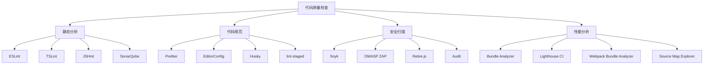

# 代码质量检查

## 工具概述

### 代码质量分类


### 工具对比
| 工具 | 类型 | 特点 | 适用场景 | 价格 |
|------|------|------|----------|------|
| ESLint | 静态分析 | 可配置、插件丰富 | JavaScript/TypeScript | 免费 |
| Prettier | 代码格式化 | 自动格式化、一致性 | 代码风格统一 | 免费 |
| SonarQube | 质量平台 | 全面分析、报告详细 | 企业级质量管控 | 免费/付费 |
| Snyk | 安全扫描 | 漏洞检测、依赖分析 | 安全审计 | 免费/付费 |

## 静态分析工具

### ESLint
```javascript
// 1. 配置文件
// .eslintrc.js
module.exports = {
    env: {
        browser: true,
        es2021: true,
        node: true
    },
    extends: [
        'eslint:recommended',
        '@typescript-eslint/recommended',
        'plugin:react/recommended',
        'plugin:react-hooks/recommended'
    ],
    parser: '@typescript-eslint/parser',
    parserOptions: {
        ecmaVersion: 12,
        sourceType: 'module',
        ecmaFeatures: {
            jsx: true
        }
    },
    plugins: [
        'react',
        '@typescript-eslint',
        'react-hooks'
    ],
    rules: {
        // 代码质量规则
        'no-unused-vars': 'error',
        'no-console': 'warn',
        'no-debugger': 'error',
        'no-alert': 'error',
        
        // 代码风格规则
        'indent': ['error', 2],
        'quotes': ['error', 'single'],
        'semi': ['error', 'always'],
        'comma-dangle': ['error', 'never'],
        
        // 最佳实践规则
        'eqeqeq': ['error', 'always'],
        'curly': ['error', 'all'],
        'no-eval': 'error',
        'no-implied-eval': 'error',
        
        // React规则
        'react/prop-types': 'off',
        'react/react-in-jsx-scope': 'off',
        'react-hooks/rules-of-hooks': 'error',
        'react-hooks/exhaustive-deps': 'warn'
    },
    settings: {
        react: {
            version: 'detect'
        }
    }
};

// 2. 自定义规则
// custom-rules/no-hardcoded-strings.js
module.exports = {
    meta: {
        type: 'suggestion',
        docs: {
            description: '禁止硬编码字符串',
            category: 'Best Practices',
            recommended: true
        },
        fixable: null,
        schema: []
    },
    create(context) {
        return {
            Literal(node) {
                if (typeof node.value === 'string' && 
                    node.value.length > 10 && 
                    !node.value.includes('http')) {
                    context.report({
                        node,
                        message: '避免使用硬编码字符串，考虑使用常量或国际化'
                    });
                }
            }
        };
    }
};

// 3. 插件配置
// eslint-plugin-import
const importRules = {
    'import/order': ['error', {
        'groups': [
            'builtin',
            'external',
            'internal',
            'parent',
            'sibling',
            'index'
        ],
        'newlines-between': 'always'
    }],
    'import/no-unresolved': 'error',
    'import/no-cycle': 'error',
    'import/no-unused-modules': 'error'
};

// 4. 忽略文件
// .eslintignore
const eslintIgnore = `
node_modules/
dist/
build/
coverage/
*.min.js
*.bundle.js
`;

// 5. 命令行使用
const eslintCommands = {
    "检查文件": "eslint src/**/*.js",
    "自动修复": "eslint --fix src/**/*.js",
    "检查特定规则": "eslint --rule 'no-console: error' src/**/*.js",
    "生成报告": "eslint --format json src/**/*.js > eslint-report.json"
};
```

### TypeScript ESLint
```javascript
// 1. TypeScript配置
// .eslintrc.js for TypeScript
module.exports = {
    parser: '@typescript-eslint/parser',
    plugins: ['@typescript-eslint'],
    extends: [
        'eslint:recommended',
        '@typescript-eslint/recommended',
        '@typescript-eslint/recommended-requiring-type-checking'
    ],
    parserOptions: {
        ecmaVersion: 2020,
        sourceType: 'module',
        project: './tsconfig.json'
    },
    rules: {
        // TypeScript特定规则
        '@typescript-eslint/no-unused-vars': 'error',
        '@typescript-eslint/no-explicit-any': 'warn',
        '@typescript-eslint/explicit-function-return-type': 'off',
        '@typescript-eslint/explicit-module-boundary-types': 'off',
        '@typescript-eslint/no-non-null-assertion': 'warn',
        '@typescript-eslint/prefer-const': 'error',
        '@typescript-eslint/no-var-requires': 'error',
        
        // 类型安全规则
        '@typescript-eslint/strict-boolean-expressions': 'error',
        '@typescript-eslint/prefer-nullish-coalescing': 'error',
        '@typescript-eslint/prefer-optional-chain': 'error',
        
        // 代码质量规则
        '@typescript-eslint/no-floating-promises': 'error',
        '@typescript-eslint/await-thenable': 'error',
        '@typescript-eslint/no-misused-promises': 'error'
    }
};

// 2. TypeScript项目配置
// tsconfig.json
const tsConfig = {
    "compilerOptions": {
        "target": "ES2020",
        "lib": ["ES2020", "DOM"],
        "module": "ESNext",
        "moduleResolution": "node",
        "strict": true,
        "esModuleInterop": true,
        "skipLibCheck": true,
        "forceConsistentCasingInFileNames": true,
        "resolveJsonModule": true,
        "isolatedModules": true,
        "noEmit": true,
        "jsx": "react-jsx"
    },
    "include": [
        "src/**/*"
    ],
    "exclude": [
        "node_modules",
        "dist",
        "build"
    ]
};

// 3. 类型检查规则
const typeCheckRules = {
    // 严格类型检查
    '@typescript-eslint/strict-boolean-expressions': 'error',
    '@typescript-eslint/prefer-nullish-coalescing': 'error',
    '@typescript-eslint/prefer-optional-chain': 'error',
    
    // Promise处理
    '@typescript-eslint/no-floating-promises': 'error',
    '@typescript-eslint/await-thenable': 'error',
    '@typescript-eslint/no-misused-promises': 'error',
    
    // 数组和对象
    '@typescript-eslint/prefer-readonly': 'error',
    '@typescript-eslint/prefer-readonly-parameter-types': 'off',
    
    // 函数
    '@typescript-eslint/prefer-function-type': 'error',
    '@typescript-eslint/method-signature-style': 'error'
};
```

### SonarQube
```javascript
// 1. 配置文件
// sonar-project.properties
const sonarConfig = `
sonar.projectKey=my-project
sonar.projectName=My Project
sonar.projectVersion=1.0
sonar.sources=src
sonar.tests=tests
sonar.exclusions=**/node_modules/**,**/dist/**,**/build/**
sonar.javascript.lcov.reportPaths=coverage/lcov.info
sonar.typescript.lcov.reportPaths=coverage/lcov.info
`;

// 2. 质量门配置
const qualityGate = {
    "conditions": [
        {
            "metric": "coverage",
            "op": "LT",
            "error": "80"
        },
        {
            "metric": "duplicated_lines_density",
            "op": "GT",
            "error": "3"
        },
        {
            "metric": "maintainability_rating",
            "op": "GT",
            "error": "1"
        },
        {
            "metric": "reliability_rating",
            "op": "GT",
            "error": "1"
        },
        {
            "metric": "security_rating",
            "op": "GT",
            "error": "1"
        }
    ]
};

// 3. 自定义规则
const customRules = {
    "javascript:S1234": {
        "name": "避免使用eval",
        "description": "eval函数可能导致代码注入攻击",
        "severity": "BLOCKER",
        "type": "VULNERABILITY"
    },
    "javascript:S1854": {
        "name": "未使用的变量",
        "description": "未使用的变量应该被移除",
        "severity": "MAJOR",
        "type": "CODE_SMELL"
    }
};

// 4. 质量配置文件
const qualityProfile = {
    "name": "JavaScript Quality Profile",
    "language": "js",
    "rules": [
        {
            "key": "javascript:S1234",
            "severity": "BLOCKER",
            "params": []
        },
        {
            "key": "javascript:S1854",
            "severity": "MAJOR",
            "params": []
        }
    ]
};
```

## 代码格式化工具

### Prettier
```javascript
// 1. 配置文件
// .prettierrc
const prettierConfig = {
    "semi": true,
    "trailingComma": "es5",
    "singleQuote": true,
    "printWidth": 80,
    "tabWidth": 2,
    "useTabs": false,
    "bracketSpacing": true,
    "bracketSameLine": false,
    "arrowParens": "avoid",
    "endOfLine": "lf"
};

// 2. 忽略文件
// .prettierignore
const prettierIgnore = `
node_modules/
dist/
build/
coverage/
*.min.js
*.bundle.js
package-lock.json
yarn.lock
`;

// 3. 编辑器配置
// VS Code settings.json
const vscodeSettings = {
    "editor.formatOnSave": true,
    "editor.defaultFormatter": "esbenp.prettier-vscode",
    "editor.codeActionsOnSave": {
        "source.fixAll.eslint": true
    },
    "[javascript]": {
        "editor.defaultFormatter": "esbenp.prettier-vscode"
    },
    "[typescript]": {
        "editor.defaultFormatter": "esbenp.prettier-vscode"
    },
    "[json]": {
        "editor.defaultFormatter": "esbenp.prettier-vscode"
    }
};

// 4. 命令行使用
const prettierCommands = {
    "格式化文件": "prettier --write src/**/*.js",
    "检查格式": "prettier --check src/**/*.js",
    "格式化特定文件": "prettier --write src/index.js",
    "生成配置": "prettier --config .prettierrc --write src/**/*.js"
};

// 5. 与ESLint集成
// eslint-config-prettier
const eslintPrettierConfig = {
    extends: [
        'eslint:recommended',
        'prettier' // 禁用与Prettier冲突的规则
    ],
    plugins: ['prettier'],
    rules: {
        'prettier/prettier': 'error'
    }
};
```

### EditorConfig
```javascript
// 1. 配置文件
// .editorconfig
const editorConfig = `
root = true

[*]
charset = utf-8
end_of_line = lf
insert_final_newline = true
trim_trailing_whitespace = true
indent_style = space
indent_size = 2

[*.md]
trim_trailing_whitespace = false

[*.{yml,yaml}]
indent_size = 2

[*.json]
indent_size = 2
`;

// 2. 编辑器支持
const supportedEditors = [
    "Visual Studio Code",
    "Sublime Text",
    "Atom",
    "WebStorm",
    "Vim",
    "Emacs"
];

// 3. 团队协作
const teamConfig = {
    "统一配置": "所有开发者使用相同的编辑器配置",
    "自动应用": "编辑器自动应用配置",
    "版本控制": "配置文件纳入版本控制",
    "新成员": "新成员自动获得正确配置"
};
```

## 安全扫描工具

### Snyk
```javascript
// 1. 配置文件
// .snyk
const snykConfig = `
# Snyk (https://snyk.io) policy file
version: v1.0.0
ignore: {}
`;

// 2. 漏洞扫描
const snykCommands = {
    "扫描项目": "snyk test",
    "监控项目": "snyk monitor",
    "修复漏洞": "snyk wizard",
    "忽略漏洞": "snyk ignore --id=SNYK-JS-LODASH-567746"
};

// 3. 集成配置
// package.json scripts
const packageScripts = {
    "scripts": {
        "snyk:test": "snyk test",
        "snyk:monitor": "snyk monitor",
        "snyk:fix": "snyk wizard",
        "security:audit": "npm audit && snyk test"
    }
};

// 4. CI/CD集成
// GitHub Actions
const githubActions = `
name: Security Scan
on: [push, pull_request]
jobs:
  security:
    runs-on: ubuntu-latest
    steps:
      - uses: actions/checkout@v2
      - name: Run Snyk to check for vulnerabilities
        uses: snyk/actions/node@master
        env:
          SNYK_TOKEN: ${{ secrets.SNYK_TOKEN }}
        with:
          args: --severity-threshold=high
`;
```

### npm audit
```javascript
// 1. 安全审计
const auditCommands = {
    "检查漏洞": "npm audit",
    "自动修复": "npm audit fix",
    "强制修复": "npm audit fix --force",
    "生成报告": "npm audit --json > audit-report.json"
};

// 2. 漏洞修复
const vulnerabilityFix = {
    "自动修复": "npm audit fix",
    "手动修复": "npm update package-name",
    "忽略漏洞": "npm audit --audit-level=moderate",
    "强制修复": "npm audit fix --force"
};

// 3. 安全配置
// .npmrc
const npmrcConfig = `
audit-level=moderate
fund=false
save-exact=true
`;

// 4. 依赖管理
const dependencyManagement = {
    "定期更新": "npm update",
    "安全检查": "npm audit",
    "依赖分析": "npm ls",
    "清理缓存": "npm cache clean --force"
};
```

## 性能分析工具

### Bundle Analyzer
```javascript
// 1. Webpack Bundle Analyzer
// webpack.config.js
const BundleAnalyzerPlugin = require('webpack-bundle-analyzer').BundleAnalyzerPlugin;

module.exports = {
    plugins: [
        new BundleAnalyzerPlugin({
            analyzerMode: 'static',
            openAnalyzer: false,
            reportFilename: 'bundle-report.html'
        })
    ]
};

// 2. 命令行使用
const bundleAnalyzerCommands = {
    "分析构建": "webpack-bundle-analyzer dist/static/js/*.js",
    "生成报告": "npm run build -- --analyze",
    "比较构建": "webpack-bundle-analyzer dist/static/js/*.js dist-old/static/js/*.js"
};

// 3. 性能优化建议
const optimizationSuggestions = {
    "代码分割": "使用动态导入分割代码",
    "Tree Shaking": "移除未使用的代码",
    "压缩优化": "使用压缩插件减少文件大小",
    "缓存策略": "合理配置缓存策略"
};

// 4. 自定义分析器
class CustomBundleAnalyzer {
    constructor() {
        this.modules = new Map();
        this.chunks = new Map();
    }
    
    analyze(compilation) {
        compilation.modules.forEach(module => {
            this.analyzeModule(module);
        });
        
        compilation.chunks.forEach(chunk => {
            this.analyzeChunk(chunk);
        });
        
        return this.generateReport();
    }
    
    analyzeModule(module) {
        const moduleInfo = {
            name: module.name,
            size: module.size(),
            dependencies: module.dependencies.length,
            reasons: module.reasons.length
        };
        
        this.modules.set(module.name, moduleInfo);
    }
    
    analyzeChunk(chunk) {
        const chunkInfo = {
            name: chunk.name,
            size: chunk.size(),
            modules: chunk.modules.length,
            entry: chunk.hasEntryModule()
        };
        
        this.chunks.set(chunk.name, chunkInfo);
    }
    
    generateReport() {
        return {
            modules: Object.fromEntries(this.modules),
            chunks: Object.fromEntries(this.chunks),
            totalSize: Array.from(this.modules.values()).reduce((sum, module) => sum + module.size, 0)
        };
    }
}
```

### Source Map Explorer
```javascript
// 1. 配置使用
const sourceMapExplorer = {
    "安装": "npm install --save-dev source-map-explorer",
    "分析": "source-map-explorer dist/static/js/*.js",
    "生成报告": "source-map-explorer dist/static/js/*.js --html bundle-report.html"
};

// 2. 分析配置
// package.json
const packageConfig = {
    "scripts": {
        "analyze": "source-map-explorer dist/static/js/*.js",
        "analyze:html": "source-map-explorer dist/static/js/*.js --html",
        "analyze:tsv": "source-map-explorer dist/static/js/*.js --tsv"
    }
};

// 3. 自定义分析器
class SourceMapAnalyzer {
    constructor() {
        this.sources = new Map();
        this.packages = new Map();
    }
    
    analyze(sourceMap) {
        sourceMap.sources.forEach((source, index) => {
            const size = this.calculateSourceSize(sourceMap, index);
            this.sources.set(source, size);
            
            const packageName = this.extractPackageName(source);
            if (packageName) {
                this.packages.set(packageName, (this.packages.get(packageName) || 0) + size);
            }
        });
        
        return this.generateReport();
    }
    
    calculateSourceSize(sourceMap, sourceIndex) {
        // 计算源码大小
        let size = 0;
        sourceMap.mappings.split(';').forEach(line => {
            const segments = line.split(',');
            segments.forEach(segment => {
                if (segment) {
                    const fields = this.decodeSegment(segment);
                    if (fields[1] === sourceIndex) {
                        size += fields[4] || 1;
                    }
                }
            });
        });
        return size;
    }
    
    extractPackageName(source) {
        const match = source.match(/node_modules\/([^/]+)/);
        return match ? match[1] : null;
    }
    
    generateReport() {
        return {
            sources: Object.fromEntries(this.sources),
            packages: Object.fromEntries(this.packages),
            totalSize: Array.from(this.sources.values()).reduce((sum, size) => sum + size, 0)
        };
    }
    
    decodeSegment(segment) {
        // 解码source map段
        const fields = [];
        let value = 0;
        let shift = 0;
        
        for (let i = 0; i < segment.length; i++) {
            const c = segment.charCodeAt(i);
            if (c >= 64) {
                fields.push(value);
                value = 0;
                shift = 0;
            } else {
                value += (c - 32) << shift;
                shift += 5;
            }
        }
        
        fields.push(value);
        return fields;
    }
}
```

## 质量检查最佳实践

### 检查流程
1. **开发阶段**
   - 实时检查
   - 自动修复
   - 提交前检查

2. **构建阶段**
   - 静态分析
   - 安全扫描
   - 性能分析

3. **部署阶段**
   - 质量门检查
   - 安全审计
   - 性能监控

### 工具集成
1. **编辑器集成**
   - 实时提示
   - 自动修复
   - 格式化保存

2. **CI/CD集成**
   - 自动化检查
   - 质量门
   - 报告生成

3. **团队协作**
   - 统一配置
   - 代码审查
   - 质量标准

### 质量指标
1. **代码质量**
   - 复杂度
   - 重复率
   - 可维护性

2. **安全质量**
   - 漏洞数量
   - 依赖安全
   - 代码安全

3. **性能质量**
   - 构建大小
   - 加载时间
   - 运行时性能

## 相关链接
- [[06-资源工具/02-在线工具/01-代码编辑器推荐]] - 代码编辑器推荐
- [[06-资源工具/02-在线工具/02-在线调试工具]] - 在线调试工具
- [[06-资源工具/02-在线工具/03-性能分析工具]] - 性能分析工具
- [[07-问题解决/01-常见问题与解决方案]] - 常见问题与解决方案
