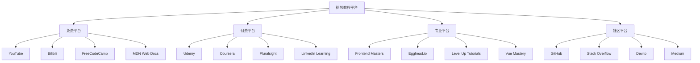

# 视频教程

## 教程分类

### 学习平台


### 平台对比
| 平台 | 类型 | 特点 | 适用人群 | 价格 |
|------|------|------|----------|------|
| YouTube | 免费 | 内容丰富、更新及时 | 所有学习者 | 免费 |
| Bilibili | 免费 | 中文内容、互动性强 | 中文学习者 | 免费 |
| Udemy | 付费 | 课程质量高、系统性强 | 有预算的学习者 | 付费 |
| Frontend Masters | 付费 | 专业深度、实战导向 | 专业开发者 | 付费 |

## 免费平台

### YouTube
```javascript
// 1. 推荐频道
const youtubeChannels = {
    "JavaScript基础": {
        "Traversy Media": "Brad Traversy的Web开发教程",
        "The Net Ninja": "Shaun的现代Web技术教程",
        "Programming with Mosh": "Mosh的编程入门教程",
        "Academind": "Maximilian的深度技术教程"
    },
    "前端框架": {
        "Code with Harry": "React和Vue教程",
        "Dev Ed": "创意编程和设计教程",
        "Kevin Powell": "CSS和响应式设计",
        "Web Dev Simplified": "简化的Web开发概念"
    },
    "高级主题": {
        "Fun Fun Function": "函数式编程和高级概念",
        "Joma Tech": "编程职业和面试技巧",
        "Fireship": "快速技术概览",
        "The Coding Train": "创意编程和算法"
    }
};

// 2. 推荐视频系列
const videoSeries = {
    "JavaScript基础": [
        "JavaScript Crash Course - Traversy Media",
        "JavaScript ES6+ Tutorial - The Net Ninja",
        "JavaScript Fundamentals - Programming with Mosh",
        "Modern JavaScript - Academind"
    ],
    "React开发": [
        "React Crash Course - Traversy Media",
        "React Tutorial - The Net Ninja",
        "React Complete Guide - Academind",
        "React Hooks - Web Dev Simplified"
    ],
    "Vue.js开发": [
        "Vue.js Crash Course - Traversy Media",
        "Vue 3 Tutorial - The Net Ninja",
        "Vue.js Complete Guide - Academind",
        "Vue.js Fundamentals - Code with Harry"
    ],
    "Node.js开发": [
        "Node.js Crash Course - Traversy Media",
        "Node.js Tutorial - The Net Ninja",
        "Node.js Complete Guide - Academind",
        "Express.js Tutorial - Web Dev Simplified"
    ]
};

// 3. 学习建议
const learningTips = {
    "选择合适的内容": "根据自己的水平选择教程",
    "跟随练习": "边看边练习，不要只看不练",
    "做笔记": "记录重要概念和代码示例",
    "重复观看": "复杂概念可以多次观看",
    "实践项目": "完成教程中的项目练习"
};
```

### Bilibili
```javascript
// 1. 推荐UP主
const bilibiliUp主 = {
    "技术教学": {
        "技术蛋老师": "前端技术深度解析",
        "尚硅谷": "系统性的技术课程",
        "黑马程序员": "实战项目教程",
        "千锋教育": "职业培训课程"
    },
    "实战项目": {
        "程序员鱼皮": "项目实战和职业规划",
        "技术胖": "Vue和React项目教程",
        "coderwhy": "前端技术深度讲解",
        "coderwhy": "JavaScript高级编程"
    },
    "技术分享": {
        "前端小智": "技术文章和教程",
        "前端森林": "前端技术分享",
        "前端早读课": "技术资讯和教程",
        "前端大全": "技术资源整理"
    }
};

// 2. 推荐课程
const bilibiliCourses = {
    "JavaScript基础": [
        "JavaScript从入门到精通 - 尚硅谷",
        "JavaScript高级编程 - coderwhy",
        "ES6+新特性详解 - 技术蛋老师",
        "JavaScript设计模式 - 黑马程序员"
    ],
    "前端框架": [
        "Vue.js从入门到实战 - 技术胖",
        "React全家桶 - 尚硅谷",
        "Angular框架教程 - 千锋教育",
        "前端框架对比分析 - coderwhy"
    ],
    "项目实战": [
        "电商项目实战 - 程序员鱼皮",
        "管理系统开发 - 技术胖",
        "移动端项目开发 - 黑马程序员",
        "全栈项目开发 - 尚硅谷"
    ]
};

// 3. 学习资源
const learningResources = {
    "免费课程": "大部分课程都是免费的",
    "实战项目": "包含完整的项目开发过程",
    "代码资源": "提供完整的源代码",
    "学习群组": "可以加入学习群组交流",
    "就业指导": "提供就业和面试指导"
};
```

### FreeCodeCamp
```javascript
// 1. 课程结构
const freeCodeCampCourses = {
    "响应式Web设计": {
        "HTML基础": "HTML标签、属性、语义化",
        "CSS基础": "选择器、布局、样式",
        "响应式设计": "媒体查询、弹性布局",
        "项目实践": "5个实际项目"
    },
    "JavaScript算法和数据结构": {
        "基础语法": "变量、函数、对象",
        "数据结构": "数组、对象、字符串",
        "算法": "排序、搜索、递归",
        "项目实践": "5个算法项目"
    },
    "前端库": {
        "React": "组件、状态、生命周期",
        "Redux": "状态管理",
        "项目实践": "5个React项目"
    },
    "数据可视化": {
        "D3.js": "数据可视化库",
        "JSON API": "数据获取和处理",
        "项目实践": "5个可视化项目"
    }
};

// 2. 学习特点
const learningFeatures = {
    "免费学习": "所有课程完全免费",
    "实践导向": "每个概念都有实践练习",
    "项目驱动": "通过项目巩固知识",
    "社区支持": "活跃的学习社区",
    "证书认证": "完成课程获得证书"
};

// 3. 学习建议
const studySuggestions = {
    "按顺序学习": "按照课程顺序系统学习",
    "完成练习": "认真完成每个练习",
    "参与项目": "积极参与项目实践",
    "社区交流": "加入社区讨论学习",
    "持续学习": "保持学习的连续性"
};
```

## 付费平台

### Udemy
```javascript
// 1. 推荐课程
const udemyCourses = {
    "JavaScript基础": {
        "The Complete JavaScript Course 2023": "Jonas Schmedtmann的完整JavaScript课程",
        "JavaScript: The Advanced Concepts": "Andrei Neagoie的高级JavaScript概念",
        "Modern JavaScript From The Beginning": "Brad Traversy的现代JavaScript教程",
        "JavaScript Algorithms and Data Structures": "Colt Steele的算法和数据结构"
    },
    "React开发": {
        "React - The Complete Guide": "Maximilian Schwarzmüller的React完整指南",
        "Modern React with Redux": "Stephen Grider的React和Redux教程",
        "Complete React Developer": "Andrei Neagoie的React开发者课程",
        "React Front To Back": "Brad Traversy的React全栈教程"
    },
    "Vue.js开发": {
        "Vue - The Complete Guide": "Maximilian Schwarzmüller的Vue完整指南",
        "Vue.js 3 - The Complete Guide": "Maximilian Schwarzmüller的Vue 3教程",
        "Vue.js 2 - The Complete Guide": "Maximilian Schwarzmüller的Vue 2教程",
        "Nuxt.js - Vue.js on Steroids": "Maximilian Schwarzmüller的Nuxt.js教程"
    },
    "Node.js开发": {
        "The Complete Node.js Developer Course": "Andrew Mead的Node.js完整课程",
        "Node.js, Express, MongoDB & More": "Jonas Schmedtmann的Node.js全栈教程",
        "Advanced Node.js": "Andrei Neagoie的高级Node.js课程",
        "Node.js API Masterclass": "Brad Traversy的Node.js API教程"
    }
};

// 2. 课程特点
const courseFeatures = {
    "高质量内容": "专业讲师制作的优质内容",
    "系统性强": "从基础到高级的完整体系",
    "实战项目": "包含实际项目开发",
    "终身访问": "购买后可以终身访问",
    "移动端支持": "支持手机和平板学习",
    "证书认证": "完成课程获得证书"
};

// 3. 学习建议
const udemyTips = {
    "选择评分高的课程": "查看课程评分和评价",
    "预览课程内容": "观看免费预览视频",
    "关注讲师背景": "了解讲师的资历和经验",
    "制定学习计划": "合理安排学习时间",
    "积极参与讨论": "在课程讨论区提问和交流"
};
```

### Frontend Masters
```javascript
// 1. 课程分类
const frontendMastersCourses = {
    "JavaScript深度": {
        "Deep JavaScript Foundations": "Kyle Simpson的JavaScript深度课程",
        "Hardcore Functional Programming": "Brian Lonsdorf的函数式编程",
        "JavaScript: The Hard Parts": "Will Sentance的JavaScript难点解析",
        "Advanced JavaScript Patterns": "Kyle Simpson的高级JavaScript模式"
    },
    "React生态": {
        "Complete Intro to React": "Brian Holt的React入门",
        "Advanced React Patterns": "Kent C. Dodds的高级React模式",
        "React Performance": "Ryan Florence的React性能优化",
        "Testing JavaScript": "Kent C. Dodds的JavaScript测试"
    },
    "Vue.js生态": {
        "Vue.js 3 Fundamentals": "Sarah Drasner的Vue 3基础",
        "Advanced Vue.js Features": "Sarah Drasner的Vue高级特性",
        "Vue.js Performance": "Sarah Drasner的Vue性能优化",
        "Vue.js Testing": "Sarah Drasner的Vue测试"
    },
    "工程化工具": {
        "Webpack Fundamentals": "Sean Larkin的Webpack基础",
        "Advanced Webpack": "Sean Larkin的Webpack高级",
        "TypeScript Fundamentals": "Mike North的TypeScript基础",
        "Advanced TypeScript": "Mike North的TypeScript高级"
    }
};

// 2. 平台特点
const platformFeatures = {
    "专业深度": "课程内容深入专业",
    "实战导向": "注重实际应用和项目",
    "讲师权威": "业界知名专家授课",
    "更新及时": "紧跟技术发展趋势",
    "社区活跃": "活跃的学习社区",
    "职业发展": "提供职业发展指导"
};

// 3. 学习建议
const frontendMastersTips = {
    "选择适合的课程": "根据自己的水平选择课程",
    "跟随项目实践": "完成课程中的项目练习",
    "参与社区讨论": "积极参与社区交流",
    "持续学习": "保持学习的连续性",
    "实践应用": "将所学知识应用到实际项目中"
};
```

## 专业平台

### Egghead.io
```javascript
// 1. 课程特点
const eggheadFeatures = {
    "短小精悍": "每个视频都很短，重点突出",
    "实战导向": "注重实际应用和代码实践",
    "高质量": "内容质量高，制作精良",
    "更新及时": "紧跟技术发展趋势",
    "社区支持": "活跃的学习社区"
};

// 2. 推荐课程
const eggheadCourses = {
    "JavaScript基础": [
        "JavaScript Fundamentals",
        "ES6+ Features",
        "Async JavaScript",
        "Functional Programming"
    ],
    "React开发": [
        "React Fundamentals",
        "React Hooks",
        "React Performance",
        "React Testing"
    ],
    "Vue.js开发": [
        "Vue.js Fundamentals",
        "Vue 3 Composition API",
        "Vue.js Testing",
        "Vue.js Performance"
    ],
    "工具和工程化": [
        "Webpack Fundamentals",
        "TypeScript Basics",
        "Testing JavaScript",
        "Git Workflow"
    ]
};

// 3. 学习建议
const eggheadTips = {
    "快速学习": "利用短视频快速学习概念",
    "实践练习": "跟随视频中的代码练习",
    "深入理解": "不要只看表面，要深入理解",
    "持续学习": "保持学习的连续性",
    "应用实践": "将所学知识应用到实际项目中"
};
```

### Vue Mastery
```javascript
// 1. 课程体系
const vueMasteryCourses = {
    "Vue基础": {
        "Vue 3 Fundamentals": "Vue 3基础概念和语法",
        "Vue 3 Composition API": "组合式API深入讲解",
        "Vue 3 Reactivity": "响应式系统原理",
        "Vue 3 Components": "组件设计和开发"
    },
    "Vue生态": {
        "Vue Router": "路由管理和导航",
        "Vuex State Management": "状态管理解决方案",
        "Vue Testing": "Vue应用测试",
        "Vue Performance": "Vue性能优化"
    },
    "实战项目": {
        "Real World Vue": "真实项目开发",
        "Vue 3 + TypeScript": "TypeScript集成",
        "Vue 3 + Nuxt": "Nuxt.js全栈开发",
        "Vue 3 + Vite": "Vite构建工具使用"
    }
};

// 2. 学习特点
const vueMasteryFeatures = {
    "专业专注": "专注于Vue.js技术栈",
    "深度讲解": "深入讲解Vue.js原理",
    "实战项目": "包含完整的项目开发",
    "社区支持": "活跃的Vue.js社区",
    "持续更新": "紧跟Vue.js发展"
};

// 3. 学习建议
const vueMasteryTips = {
    "系统学习": "按照课程体系系统学习",
    "实践项目": "完成课程中的项目练习",
    "深入理解": "理解Vue.js的设计原理",
    "社区交流": "参与Vue.js社区讨论",
    "持续跟进": "关注Vue.js的最新发展"
};
```

## 学习建议

### 选择策略
1. **根据水平选择**
   - 初学者：选择基础入门课程
   - 有经验者：选择进阶和高级课程
   - 专业人士：选择专业深度课程

2. **根据目标选择**
   - 学习新技术：选择系统性课程
   - 解决特定问题：选择专题课程
   - 提升技能：选择实战项目课程

3. **根据时间选择**
   - 时间充裕：选择完整系统课程
   - 时间有限：选择短小精悍课程
   - 碎片时间：选择移动端友好课程

### 学习方法
1. **主动学习**
   - 边看边练习
   - 做笔记和总结
   - 提问和讨论

2. **实践应用**
   - 完成课程项目
   - 应用到实际工作
   - 分享学习成果

3. **持续学习**
   - 制定学习计划
   - 保持学习习惯
   - 关注技术发展

### 学习资源
1. **免费资源**
   - YouTube、Bilibili
   - FreeCodeCamp、MDN
   - 技术博客、文档

2. **付费资源**
   - Udemy、Coursera
   - Frontend Masters、Egghead
   - 专业培训课程

3. **社区资源**
   - GitHub、Stack Overflow
   - 技术论坛、微信群
   - 线下meetup、会议

## 相关链接
- [[06-资源工具/03-学习资源/01-推荐书籍]] - 推荐书籍
- [[06-资源工具/03-学习资源/03-技术博客]] - 技术博客
- [[06-资源工具/03-学习资源/04-开源项目]] - 开源项目
- [[00-学习指南/03-学习建议]] - 学习建议
