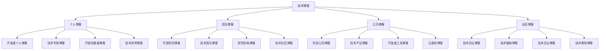

# 技术博客

## 博客分类

### 博客类型


### 博客平台
| 平台 | 类型 | 特点 | 适用人群 | 价格 |
|------|------|------|----------|------|
| Medium | 通用 | 界面简洁、社区活跃 | 所有技术写作者 | 免费/付费 |
| Dev.to | 技术 | 技术社区、互动性强 | 技术开发者 | 免费 |
| 掘金 | 中文 | 中文技术社区、内容丰富 | 中文技术开发者 | 免费 |
| 思否 | 中文 | 技术问答、博客平台 | 中文技术社区 | 免费 |

## 个人博客

### 知名开发者博客
```javascript
// 1. 国际知名开发者
const internationalBlogs = {
    "JavaScript专家": {
        "Dan Abramov": "React核心开发者，Redux作者",
        "Kent C. Dodds": "React测试专家，Remix开发者",
        "Ryan Florence": "React Router作者，Remix开发者",
        "Sebastian Markbåge": "React核心开发者，Fiber架构"
    },
    "Vue.js专家": {
        "Evan You": "Vue.js作者，Vite作者",
        "Sarah Drasner": "Vue.js核心团队成员",
        "Guillaume Chau": "Vue.js核心团队成员",
        "Anthony Fu": "Vue.js生态贡献者"
    },
    "Node.js专家": {
        "TJ Holowaychuk": "Express.js作者，Koa作者",
        "Isaac Schlueter": "npm作者，Node.js核心开发者",
        "Ryan Dahl": "Node.js作者，Deno作者",
        "Guillermo Rauch": "Socket.io作者，Vercel CEO"
    },
    "前端架构专家": {
        "Addy Osmani": "Chrome团队，Web性能专家",
        "Jake Archibald": "Chrome团队，Service Worker专家",
        "Alex Russell": "Chrome团队，Web标准专家",
        "Surma": "Chrome团队，Web性能专家"
    }
};

// 2. 中文知名开发者
const chineseBlogs = {
    "前端专家": {
        "阮一峰": "ES6教程作者，技术翻译家",
        "张鑫旭": "CSS专家，前端技术博主",
        "廖雪峰": "Python教程作者，技术教育者",
        "冴羽": "JavaScript深入系列作者"
    },
    "Vue.js专家": {
        "尤雨溪": "Vue.js作者，Vite作者",
        "黄轶": "Vue.js生态贡献者",
        "Anthony Fu": "Vue.js生态贡献者",
        "HcySunYang": "Vue.js源码解析作者"
    },
    "React专家": {
        "程墨": "React技术专家",
        "黄子毅": "React生态贡献者",
        "卡颂": "React技术专家",
        "神三元": "React技术专家"
    },
    "Node.js专家": {
        "朴灵": "Node.js专家，阿里技术专家",
        "死月": "Node.js专家，开源贡献者",
        "狼叔": "Node.js专家，开源贡献者",
        "天猪": "Node.js专家，开源贡献者"
    }
};

// 3. 博客特点
const blogFeatures = {
    "技术深度": "深入解析技术原理和实现",
    "实践经验": "分享实际项目开发经验",
    "源码分析": "分析开源项目源码",
    "最佳实践": "总结技术最佳实践",
    "趋势分析": "分析技术发展趋势"
};
```

### 技术专家博客
```javascript
// 1. 技术领域专家
const domainExperts = {
    "性能优化": {
        "Web性能": "Addy Osmani, Jake Archibald",
        "移动端性能": "Paul Lewis, Surma",
        "Node.js性能": "Ryan Dahl, TJ Holowaychuk",
        "数据库性能": "各种数据库专家"
    },
    "安全专家": {
        "Web安全": "OWASP专家，安全研究员",
        "前端安全": "XSS、CSRF防护专家",
        "Node.js安全": "安全漏洞研究专家",
        "密码学": "密码学专家，安全算法"
    },
    "架构设计": {
        "微服务架构": "Martin Fowler, Sam Newman",
        "前端架构": "各种前端架构专家",
        "系统设计": "系统架构师，技术专家",
        "分布式系统": "分布式系统专家"
    },
    "测试专家": {
        "单元测试": "Kent C. Dodds, Jest团队",
        "集成测试": "各种测试框架专家",
        "E2E测试": "Cypress, Playwright团队",
        "性能测试": "性能测试专家"
    }
};

// 2. 博客内容类型
const contentTypes = {
    "技术教程": {
        "入门教程": "从零开始的技术教程",
        "进阶教程": "深入的技术进阶教程",
        "实战教程": "实际项目开发教程",
        "源码解析": "开源项目源码分析"
    },
    "技术分享": {
        "经验分享": "项目开发经验分享",
        "踩坑记录": "开发过程中遇到的问题",
        "最佳实践": "技术最佳实践总结",
        "工具推荐": "开发工具和资源推荐"
    },
    "技术分析": {
        "技术趋势": "技术发展趋势分析",
        "框架对比": "不同技术框架对比",
        "性能分析": "性能优化分析",
        "安全分析": "安全漏洞和防护分析"
    }
};

// 3. 学习价值
const learningValue = {
    "深度理解": "深入理解技术原理和实现",
    "实践经验": "获得实际项目开发经验",
    "问题解决": "学习解决技术问题的方法",
    "技术视野": "拓宽技术视野和认知",
    "职业发展": "了解技术职业发展路径"
};
```

## 团队博客

### 开源项目博客
```javascript
// 1. 知名开源项目
const openSourceBlogs = {
    "React生态": {
        "React官方博客": "React团队官方技术博客",
        "Next.js博客": "Next.js框架开发博客",
        "Gatsby博客": "Gatsby静态站点生成器博客",
        "Remix博客": "Remix全栈框架博客"
    },
    "Vue.js生态": {
        "Vue官方博客": "Vue.js团队官方博客",
        "Nuxt.js博客": "Nuxt.js框架开发博客",
        "Vite博客": "Vite构建工具博客",
        "Pinia博客": "Pinia状态管理博客"
    },
    "Node.js生态": {
        "Node.js官方博客": "Node.js官方技术博客",
        "Express博客": "Express.js框架博客",
        "Koa博客": "Koa.js框架博客",
        "NestJS博客": "NestJS框架博客"
    },
    "构建工具": {
        "Webpack博客": "Webpack打包工具博客",
        "Rollup博客": "Rollup模块打包器博客",
        "Parcel博客": "Parcel零配置构建工具博客",
        "Vite博客": "Vite快速构建工具博客"
    }
};

// 2. 博客内容
const blogContent = {
    "版本发布": {
        "新特性介绍": "新版本功能特性介绍",
        "破坏性变更": "版本升级注意事项",
        "迁移指南": "版本迁移指导文档",
        "性能改进": "性能优化和改进说明"
    },
    "技术分享": {
        "架构设计": "项目架构设计思路",
        "开发经验": "开发过程中的经验分享",
        "最佳实践": "使用框架的最佳实践",
        "问题解决": "常见问题解决方案"
    },
    "社区动态": {
        "社区活动": "社区活动和会议信息",
        "贡献者介绍": "开源贡献者介绍",
        "项目规划": "项目未来发展规划",
        "生态建设": "生态系统建设情况"
    }
};

// 3. 学习价值
const openSourceValue = {
    "技术前沿": "了解最新技术发展趋势",
    "最佳实践": "学习框架使用最佳实践",
    "问题解决": "获得技术问题解决方案",
    "社区参与": "了解开源社区动态",
    "贡献指导": "学习如何参与开源项目"
};
```

### 技术团队博客
```javascript
// 1. 知名技术团队
const techTeamBlogs = {
    "大厂技术团队": {
        "阿里技术": "阿里巴巴技术团队博客",
        "腾讯技术": "腾讯技术团队博客",
        "字节跳动技术": "字节跳动技术团队博客",
        "美团技术": "美团技术团队博客"
    },
    "国外科技公司": {
        "Google Developers": "Google开发者博客",
        "Facebook Engineering": "Facebook工程团队博客",
        "Netflix Tech Blog": "Netflix技术博客",
        "Airbnb Engineering": "Airbnb工程团队博客"
    },
    "开源组织": {
        "Mozilla Hacks": "Mozilla技术博客",
        "WebKit Blog": "WebKit引擎博客",
        "Chromium Blog": "Chromium项目博客",
        "Node.js Blog": "Node.js项目博客"
    }
};

// 2. 博客特点
const teamBlogFeatures = {
    "技术深度": "深入的技术分析和研究",
    "实践经验": "大规模项目实践经验",
    "架构设计": "复杂系统架构设计",
    "性能优化": "大规模系统性能优化",
    "技术创新": "技术创新和突破"
};

// 3. 学习价值
const teamBlogValue = {
    "技术视野": "了解大厂技术视野和方向",
    "实践经验": "学习大规模项目实践经验",
    "架构思维": "培养系统架构设计思维",
    "技术趋势": "了解技术发展趋势",
    "职业发展": "了解技术职业发展路径"
};
```

## 公司博客

### 科技公司博客
```javascript
// 1. 知名科技公司
const techCompanyBlogs = {
    "前端框架公司": {
        "Vercel Blog": "Vercel公司技术博客",
        "Netlify Blog": "Netlify公司技术博客",
        "Cloudflare Blog": "Cloudflare公司技术博客",
        "Fastly Blog": "Fastly公司技术博客"
    },
    "开发工具公司": {
        "GitHub Blog": "GitHub公司技术博客",
        "GitLab Blog": "GitLab公司技术博客",
        "Atlassian Blog": "Atlassian公司技术博客",
        "JetBrains Blog": "JetBrains公司技术博客"
    },
    "云服务公司": {
        "AWS Blog": "亚马逊云服务技术博客",
        "Google Cloud Blog": "谷歌云服务技术博客",
        "Microsoft Azure Blog": "微软云服务技术博客",
        "DigitalOcean Blog": "DigitalOcean技术博客"
    },
    "开发平台": {
        "Heroku Blog": "Heroku平台技术博客",
        "Railway Blog": "Railway平台技术博客",
        "Render Blog": "Render平台技术博客",
        "Vercel Blog": "Vercel平台技术博客"
    }
};

// 2. 博客内容
const companyBlogContent = {
    "产品更新": {
        "新功能发布": "产品新功能发布介绍",
        "性能改进": "产品性能优化改进",
        "安全更新": "产品安全更新说明",
        "用户体验": "用户体验改进说明"
    },
    "技术分享": {
        "技术架构": "产品技术架构分享",
        "开发经验": "产品开发经验分享",
        "最佳实践": "产品使用最佳实践",
        "案例分析": "客户使用案例分析"
    },
    "行业洞察": {
        "技术趋势": "行业技术趋势分析",
        "市场分析": "技术市场分析",
        "竞争分析": "技术竞争分析",
        "未来规划": "技术未来发展规划"
    }
};

// 3. 学习价值
const companyBlogValue = {
    "产品了解": "了解最新产品功能和技术",
    "技术实践": "学习产品技术实践经验",
    "行业趋势": "了解行业技术发展趋势",
    "商业思维": "培养技术商业思维",
    "职业机会": "了解技术职业机会"
};
```

### 开发者工具博客
```javascript
// 1. 开发工具公司
const devToolBlogs = {
    "代码编辑器": {
        "VS Code Blog": "Visual Studio Code技术博客",
        "Sublime Text Blog": "Sublime Text技术博客",
        "Atom Blog": "Atom编辑器技术博客",
        "Vim Blog": "Vim编辑器技术博客"
    },
    "构建工具": {
        "Webpack Blog": "Webpack构建工具博客",
        "Rollup Blog": "Rollup模块打包器博客",
        "Parcel Blog": "Parcel零配置构建工具博客",
        "Vite Blog": "Vite快速构建工具博客"
    },
    "测试工具": {
        "Jest Blog": "Jest测试框架博客",
        "Cypress Blog": "Cypress E2E测试工具博客",
        "Playwright Blog": "Playwright测试工具博客",
        "Testing Library Blog": "Testing Library测试工具博客"
    },
    "代码质量": {
        "ESLint Blog": "ESLint代码检查工具博客",
        "Prettier Blog": "Prettier代码格式化工具博客",
        "SonarQube Blog": "SonarQube代码质量平台博客",
        "CodeClimate Blog": "CodeClimate代码质量平台博客"
    }
};

// 2. 博客特点
const devToolFeatures = {
    "工具介绍": "详细介绍工具功能和使用方法",
    "最佳实践": "工具使用最佳实践分享",
    "性能优化": "工具性能优化技巧",
    "插件开发": "工具插件开发指导",
    "社区动态": "工具社区动态和更新"
};

// 3. 学习价值
const devToolValue = {
    "工具掌握": "掌握各种开发工具的使用",
    "效率提升": "提升开发效率和代码质量",
    "最佳实践": "学习工具使用最佳实践",
    "插件开发": "学习工具插件开发",
    "社区参与": "参与工具社区建设"
};
```

## 社区博客

### 技术论坛博客
```javascript
// 1. 知名技术论坛
const techForumBlogs = {
    "国际论坛": {
        "Stack Overflow Blog": "Stack Overflow技术博客",
        "Reddit r/javascript": "Reddit JavaScript社区",
        "Hacker News": "Hacker News技术社区",
        "Dev.to": "Dev.to技术社区博客"
    },
    "中文论坛": {
        "掘金": "掘金技术社区博客",
        "思否": "思否技术社区博客",
        "CSDN": "CSDN技术社区博客",
        "博客园": "博客园技术社区博客"
    },
    "专业论坛": {
        "React社区": "React技术社区博客",
        "Vue.js社区": "Vue.js技术社区博客",
        "Node.js社区": "Node.js技术社区博客",
        "前端社区": "前端技术社区博客"
    }
};

// 2. 博客特点
const forumBlogFeatures = {
    "社区驱动": "由社区成员共同维护",
    "内容丰富": "涵盖各种技术话题",
    "互动性强": "支持评论和讨论",
    "更新及时": "内容更新及时",
    "质量参差": "内容质量参差不齐"
};

// 3. 学习价值
const forumBlogValue = {
    "技术交流": "与其他开发者交流技术",
    "问题解决": "获得技术问题解决方案",
    "知识分享": "分享自己的技术知识",
    "社区参与": "参与技术社区建设",
    "职业网络": "建立技术职业网络"
};
```

### 技术媒体博客
```javascript
// 1. 知名技术媒体
const techMediaBlogs = {
    "国际媒体": {
        "TechCrunch": "科技新闻和趋势分析",
        "The Verge": "科技产品和技术新闻",
        "Ars Technica": "深度技术分析和新闻",
        "Wired": "科技文化和趋势分析"
    },
    "中文媒体": {
        "36氪": "科技创业和投资新闻",
        "虎嗅": "科技商业和趋势分析",
        "极客公园": "科技产品和技术新闻",
        "爱范儿": "科技生活方式和产品"
    },
    "技术媒体": {
        "InfoQ": "企业软件开发技术媒体",
        "DZone": "软件开发技术社区",
        "Smashing Magazine": "Web设计和开发技术媒体",
        "A List Apart": "Web标准和技术媒体"
    }
};

// 2. 博客特点
const mediaBlogFeatures = {
    "新闻及时": "及时报道技术新闻和趋势",
    "分析深入": "深入分析技术发展趋势",
    "观点独特": "提供独特的技术观点",
    "影响广泛": "在技术社区有广泛影响",
    "商业导向": "关注技术商业价值"
};

// 3. 学习价值
const mediaBlogValue = {
    "趋势了解": "了解技术发展趋势",
    "行业洞察": "获得行业技术洞察",
    "商业思维": "培养技术商业思维",
    "职业规划": "了解技术职业发展",
    "投资机会": "了解技术投资机会"
};
```

## 学习建议

### 阅读策略
1. **选择优质博客**
   - 关注知名技术专家
   - 选择高质量技术团队
   - 关注权威技术媒体

2. **系统化阅读**
   - 按技术领域分类阅读
   - 建立个人知识体系
   - 定期回顾和总结

3. **实践应用**
   - 将学到的知识应用到实践
   - 分享自己的学习心得
   - 参与技术讨论

### 学习方法
1. **主动学习**
   - 主动寻找优质内容
   - 深入理解技术原理
   - 思考技术应用场景

2. **批判性思维**
   - 批判性分析技术观点
   - 验证技术方案的可行性
   - 形成自己的技术判断

3. **持续学习**
   - 保持技术学习的连续性
   - 关注技术发展趋势
   - 不断更新知识体系

### 推荐阅读
1. **每日阅读**
   - 技术新闻和趋势
   - 技术教程和分享
   - 开源项目动态

2. **深度阅读**
   - 技术原理分析
   - 架构设计文章
   - 最佳实践总结

3. **专题阅读**
   - 特定技术领域
   - 技术问题解决方案
   - 技术职业发展

## 相关链接
- [[06-资源工具/03-学习资源/01-推荐书籍]] - 推荐书籍
- [[06-资源工具/03-学习资源/02-视频教程]] - 视频教程
- [[06-资源工具/03-学习资源/04-开源项目]] - 开源项目
- [[00-学习指南/03-学习建议]] - 学习建议
