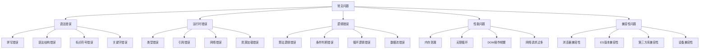

# 常见问题与解决方案

## 问题分类

### 问题类型


### 问题优先级
| 优先级 | 问题类型 | 影响程度 | 解决难度 | 示例 |
|--------|----------|----------|----------|------|
| 高 | 语法错误 | 无法运行 | 低 | 拼写错误、语法错误 |
| 高 | 运行时错误 | 程序崩溃 | 中 | 类型错误、引用错误 |
| 中 | 逻辑错误 | 功能异常 | 高 | 算法错误、条件错误 |
| 中 | 性能问题 | 用户体验差 | 高 | 内存泄漏、响应慢 |
| 低 | 兼容性问题 | 部分用户受影响 | 中 | 浏览器差异、版本差异 |

## 语法错误

### 常见语法错误
```javascript
// 1. 拼写错误
// 错误示例
const messsage = "Hello World"; // message拼写错误
console.log(messsage); // ReferenceError

// 正确写法
const message = "Hello World";
console.log(message);

// 2. 语法结构错误
// 错误示例
function greet(name {
    return `Hello, ${name}!`;
} // 缺少右括号

// 正确写法
function greet(name) {
    return `Hello, ${name}!`;
}

// 3. 标点符号错误
// 错误示例
const obj = {
    name: "John",
    age: 30, // 多余的逗号
};

// 正确写法
const obj = {
    name: "John",
    age: 30
};

// 4. 关键字错误
// 错误示例
let const = "variable"; // const是关键字
let function = "test"; // function是关键字

// 正确写法
let variable = "variable";
let testFunction = "test";
```

### 语法错误解决方案
```javascript
// 1. 使用代码检查工具
// ESLint配置
module.exports = {
    env: {
        browser: true,
        es2021: true,
        node: true
    },
    extends: [
        'eslint:recommended'
    ],
    parserOptions: {
        ecmaVersion: 12,
        sourceType: 'module'
    },
    rules: {
        'no-unused-vars': 'error',
        'no-undef': 'error',
        'semi': ['error', 'always'],
        'quotes': ['error', 'single']
    }
};

// 2. 使用TypeScript
// TypeScript可以捕获许多语法错误
interface User {
    name: string;
    age: number;
}

function greetUser(user: User): string {
    return `Hello, ${user.name}!`;
}

// 3. 使用Prettier格式化
// .prettierrc配置
{
    "semi": true,
    "trailingComma": "es5",
    "singleQuote": true,
    "printWidth": 80,
    "tabWidth": 2
}

// 4. 编辑器配置
// VS Code设置
{
    "editor.formatOnSave": true,
    "editor.codeActionsOnSave": {
        "source.fixAll.eslint": true
    },
    "javascript.validate.enable": true,
    "typescript.validate.enable": true
}
```

## 运行时错误

### 类型错误
```javascript
// 1. 类型转换错误
// 错误示例
const num = "123";
const result = num + 5; // "1235" 而不是 128

// 正确写法
const num = "123";
const result = parseInt(num) + 5; // 128

// 2. 未定义变量
// 错误示例
function calculate() {
    return x + y; // x和y未定义
}

// 正确写法
function calculate(x, y) {
    return x + y;
}

// 3. 属性访问错误
// 错误示例
const user = null;
console.log(user.name); // TypeError: Cannot read property 'name' of null

// 正确写法
const user = null;
console.log(user?.name); // 使用可选链操作符
// 或者
if (user && user.name) {
    console.log(user.name);
}

// 4. 数组越界
// 错误示例
const arr = [1, 2, 3];
console.log(arr[10]); // undefined

// 正确写法
const arr = [1, 2, 3];
if (arr.length > 10) {
    console.log(arr[10]);
} else {
    console.log('Index out of bounds');
}
```

### 引用错误
```javascript
// 1. 变量提升问题
// 错误示例
console.log(x); // ReferenceError
let x = 5;

// 正确写法
let x = 5;
console.log(x); // 5

// 2. 作用域问题
// 错误示例
function outer() {
    let x = 1;
    function inner() {
        console.log(x); // 可以访问
        let y = 2;
    }
    console.log(y); // ReferenceError
}

// 正确写法
function outer() {
    let x = 1;
    function inner() {
        console.log(x); // 1
        let y = 2;
        return y;
    }
    return inner();
}

// 3. 模块导入错误
// 错误示例
import { nonExistentFunction } from './module.js'; // 函数不存在

// 正确写法
import { existingFunction } from './module.js';
// 或者
import * as module from './module.js';
```

### 网络错误
```javascript
// 1. 请求失败处理
// 错误示例
fetch('/api/data')
    .then(response => response.json())
    .then(data => console.log(data)); // 没有错误处理

// 正确写法
fetch('/api/data')
    .then(response => {
        if (!response.ok) {
            throw new Error(`HTTP error! status: ${response.status}`);
        }
        return response.json();
    })
    .then(data => console.log(data))
    .catch(error => {
        console.error('Fetch error:', error);
        // 显示用户友好的错误消息
    });

// 2. 超时处理
// 错误示例
fetch('/api/slow-endpoint'); // 可能永远等待

// 正确写法
const controller = new AbortController();
const timeoutId = setTimeout(() => controller.abort(), 5000);

fetch('/api/slow-endpoint', {
    signal: controller.signal
})
.then(response => response.json())
.then(data => {
    clearTimeout(timeoutId);
    console.log(data);
})
.catch(error => {
    if (error.name === 'AbortError') {
        console.log('Request timed out');
    } else {
        console.error('Request failed:', error);
    }
});

// 3. 重试机制
async function fetchWithRetry(url, maxRetries = 3) {
    for (let i = 0; i < maxRetries; i++) {
        try {
            const response = await fetch(url);
            if (response.ok) {
                return await response.json();
            }
            throw new Error(`HTTP ${response.status}`);
        } catch (error) {
            if (i === maxRetries - 1) throw error;
            await new Promise(resolve => setTimeout(resolve, 1000 * (i + 1)));
        }
    }
}
```

## 逻辑错误

### 算法逻辑错误
```javascript
// 1. 排序算法错误
// 错误示例
function bubbleSort(arr) {
    for (let i = 0; i < arr.length; i++) {
        for (let j = 0; j < arr.length; j++) { // 应该是 arr.length - 1 - i
            if (arr[j] > arr[j + 1]) {
                [arr[j], arr[j + 1]] = [arr[j + 1], arr[j]];
            }
        }
    }
    return arr;
}

// 正确写法
function bubbleSort(arr) {
    for (let i = 0; i < arr.length - 1; i++) {
        for (let j = 0; j < arr.length - 1 - i; j++) {
            if (arr[j] > arr[j + 1]) {
                [arr[j], arr[j + 1]] = [arr[j + 1], arr[j]];
            }
        }
    }
    return arr;
}

// 2. 递归逻辑错误
// 错误示例
function factorial(n) {
    if (n === 0) return 1;
    return n * factorial(n - 1); // 没有处理负数
}

// 正确写法
function factorial(n) {
    if (n < 0) throw new Error('Factorial is not defined for negative numbers');
    if (n === 0) return 1;
    return n * factorial(n - 1);
}

// 3. 数组操作错误
// 错误示例
function removeDuplicates(arr) {
    const result = [];
    for (let i = 0; i < arr.length; i++) {
        if (result.indexOf(arr[i]) === -1) {
            result.push(arr[i]);
        }
    }
    return result;
}

// 正确写法
function removeDuplicates(arr) {
    return [...new Set(arr)];
}
```

### 条件判断错误
```javascript
// 1. 比较操作符错误
// 错误示例
if (x = 5) { // 应该是 ===
    console.log('x is 5');
}

// 正确写法
if (x === 5) {
    console.log('x is 5');
}

// 2. 逻辑操作符错误
// 错误示例
if (age >= 18 && age <= 65) { // 应该是 ||
    console.log('Valid age');
}

// 正确写法
if (age >= 18 || age <= 65) {
    console.log('Valid age');
}

// 3. 类型检查错误
// 错误示例
if (typeof x === 'string' && x.length > 0) {
    console.log(x.toUpperCase());
}

// 正确写法
if (typeof x === 'string' && x.length > 0) {
    console.log(x.toUpperCase());
} else {
    console.log('Invalid string');
}
```

## 性能问题

### 内存泄漏
```javascript
// 1. 事件监听器泄漏
// 错误示例
class Component {
    constructor() {
        this.handleClick = this.handleClick.bind(this);
        window.addEventListener('click', this.handleClick);
    }
    
    handleClick() {
        console.log('Clicked');
    }
    
    // 没有移除事件监听器
}

// 正确写法
class Component {
    constructor() {
        this.handleClick = this.handleClick.bind(this);
        window.addEventListener('click', this.handleClick);
    }
    
    handleClick() {
        console.log('Clicked');
    }
    
    destroy() {
        window.removeEventListener('click', this.handleClick);
    }
}

// 2. 定时器泄漏
// 错误示例
function startTimer() {
    setInterval(() => {
        console.log('Timer tick');
    }, 1000);
    // 没有保存定时器ID
}

// 正确写法
function startTimer() {
    const timerId = setInterval(() => {
        console.log('Timer tick');
    }, 1000);
    
    return () => clearInterval(timerId);
}

// 3. 闭包泄漏
// 错误示例
function createHandler() {
    const largeData = new Array(1000000).fill('data');
    return function() {
        console.log('Handler called');
        // largeData被闭包引用，无法释放
    };
}

// 正确写法
function createHandler() {
    return function() {
        console.log('Handler called');
        // 不引用大对象
    };
}
```

### DOM操作优化
```javascript
// 1. 频繁DOM操作
// 错误示例
function updateList(items) {
    const list = document.getElementById('list');
    list.innerHTML = ''; // 清空列表
    items.forEach(item => {
        const li = document.createElement('li');
        li.textContent = item;
        list.appendChild(li); // 频繁DOM操作
    });
}

// 正确写法
function updateList(items) {
    const list = document.getElementById('list');
    const fragment = document.createDocumentFragment();
    
    items.forEach(item => {
        const li = document.createElement('li');
        li.textContent = item;
        fragment.appendChild(li);
    });
    
    list.innerHTML = '';
    list.appendChild(fragment); // 一次性DOM操作
}

// 2. 事件委托
// 错误示例
document.querySelectorAll('.button').forEach(button => {
    button.addEventListener('click', handleClick); // 为每个按钮添加监听器
});

// 正确写法
document.addEventListener('click', (event) => {
    if (event.target.matches('.button')) {
        handleClick(event);
    }
}); // 使用事件委托

// 3. 防抖和节流
// 防抖
function debounce(func, wait) {
    let timeout;
    return function executedFunction(...args) {
        const later = () => {
            clearTimeout(timeout);
            func(...args);
        };
        clearTimeout(timeout);
        timeout = setTimeout(later, wait);
    };
}

// 节流
function throttle(func, limit) {
    let inThrottle;
    return function() {
        const args = arguments;
        const context = this;
        if (!inThrottle) {
            func.apply(context, args);
            inThrottle = true;
            setTimeout(() => inThrottle = false, limit);
        }
    };
}
```

## 兼容性问题

### 浏览器兼容性
```javascript
// 1. 特性检测
// 错误示例
// 直接使用可能不存在的API
localStorage.setItem('key', 'value');

// 正确写法
if (typeof Storage !== 'undefined') {
    localStorage.setItem('key', 'value');
} else {
    // 降级处理
    console.log('LocalStorage not supported');
}

// 2. Polyfill
// 错误示例
// 直接使用ES6+特性
const result = [1, 2, 3].includes(2);

// 正确写法
if (!Array.prototype.includes) {
    Array.prototype.includes = function(searchElement, fromIndex) {
        return this.indexOf(searchElement, fromIndex) !== -1;
    };
}

// 3. 条件加载
// 错误示例
// 直接导入可能不支持的模块
import { fetch } from 'node-fetch';

// 正确写法
if (typeof fetch === 'undefined') {
    const { fetch } = await import('node-fetch');
}
```

### ES版本兼容性
```javascript
// 1. Babel转译
// .babelrc配置
{
    "presets": [
        ["@babel/preset-env", {
            "targets": {
                "browsers": ["last 2 versions", "ie >= 11"]
            }
        }]
    ],
    "plugins": [
        "@babel/plugin-proposal-class-properties",
        "@babel/plugin-proposal-object-rest-spread"
    ]
}

// 2. 条件编译
// 错误示例
// 直接使用ES2020特性
const result = obj?.property ?? 'default';

// 正确写法
const result = obj && obj.property ? obj.property : 'default';

// 3. 特性检测
function supportsOptionalChaining() {
    try {
        eval('const obj = {}; obj?.property;');
        return true;
    } catch (e) {
        return false;
    }
}
```

## 调试工具

### 浏览器开发工具
```javascript
// 1. Console调试
console.log('Debug message');
console.error('Error message');
console.warn('Warning message');
console.info('Info message');
console.table(data); // 表格显示
console.group('Group name');
console.groupEnd();

// 2. 断点调试
function debugFunction() {
    debugger; // 设置断点
    const result = calculate();
    return result;
}

// 3. 性能分析
console.time('Operation');
// 执行操作
console.timeEnd('Operation');

// 4. 内存分析
// 在Chrome DevTools中
// 1. 打开Performance面板
// 2. 开始录制
// 3. 执行操作
// 4. 停止录制
// 5. 分析结果
```

### 错误监控
```javascript
// 1. 全局错误处理
window.addEventListener('error', (event) => {
    console.error('Global error:', event.error);
    // 发送错误报告到服务器
    sendErrorReport(event.error);
});

window.addEventListener('unhandledrejection', (event) => {
    console.error('Unhandled promise rejection:', event.reason);
    // 发送错误报告到服务器
    sendErrorReport(event.reason);
});

// 2. 错误报告函数
async function sendErrorReport(error) {
    try {
        await fetch('/api/error-report', {
            method: 'POST',
            headers: {
                'Content-Type': 'application/json'
            },
            body: JSON.stringify({
                message: error.message,
                stack: error.stack,
                url: window.location.href,
                userAgent: navigator.userAgent,
                timestamp: new Date().toISOString()
            })
        });
    } catch (e) {
        console.error('Failed to send error report:', e);
    }
}

// 3. 自定义错误类
class CustomError extends Error {
    constructor(message, code, details) {
        super(message);
        this.name = 'CustomError';
        this.code = code;
        this.details = details;
    }
}

// 使用自定义错误
try {
    throw new CustomError('Something went wrong', 'ERR_001', { userId: 123 });
} catch (error) {
    if (error instanceof CustomError) {
        console.error(`Error ${error.code}: ${error.message}`, error.details);
    }
}
```

## 问题解决流程

### 调试步骤
1. **重现问题**
   - 确定问题发生的条件
   - 记录复现步骤
   - 收集错误信息

2. **分析问题**
   - 查看错误消息
   - 检查控制台输出
   - 分析代码逻辑

3. **定位问题**
   - 使用断点调试
   - 添加日志输出
   - 逐步排查

4. **解决问题**
   - 修复代码错误
   - 测试修复效果
   - 验证功能正常

5. **预防问题**
   - 添加错误处理
   - 编写测试用例
   - 代码审查

### 最佳实践
1. **代码质量**
   - 使用代码检查工具
   - 遵循编码规范
   - 编写清晰注释

2. **错误处理**
   - 添加try-catch块
   - 提供用户友好错误消息
   - 记录错误日志

3. **测试驱动**
   - 编写单元测试
   - 集成测试
   - 端到端测试

4. **持续改进**
   - 代码重构
   - 性能优化
   - 安全加固

## 相关链接
- [[07-问题解决/02-调试技巧大全]] - 调试技巧大全
- [[07-问题解决/03-错误代码对照表]] - 错误代码对照表
- [[07-问题解决/04-性能问题诊断]] - 性能问题诊断
- [[06-资源工具/02-在线工具/03-性能分析工具]] - 性能分析工具
