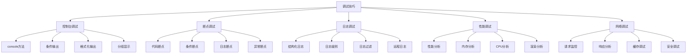

# 调试技巧大全

## 调试概述

### 调试方法


### 调试工具
| 工具 | 类型 | 用途 | 特点 |
|------|------|------|------|
| Chrome DevTools | 浏览器工具 | 全面调试 | 功能强大 |
| VS Code Debugger | 编辑器工具 | 代码调试 | 集成度高 |
| Node.js Inspector | 运行时工具 | Node.js调试 | 命令行友好 |
| React DevTools | 框架工具 | React调试 | 组件分析 |
| Vue DevTools | 框架工具 | Vue调试 | 状态跟踪 |

## 控制台调试

### Console方法
```javascript
// 1. 基础输出方法
console.log('普通信息');
console.info('信息提示');
console.warn('警告信息');
console.error('错误信息');
console.debug('调试信息');

// 2. 格式化输出
const user = { name: 'John', age: 30 };
const items = ['apple', 'banana', 'orange'];

// 对象格式化
console.log('User:', user);
console.log('User: %o', user); // 对象格式化
console.log('User: %O', user); // 对象详细信息

// 字符串格式化
console.log('Hello %s, you are %d years old', user.name, user.age);

// 3. 表格显示
console.table(user);
console.table(items);
console.table([
    { name: 'John', age: 30, city: 'NYC' },
    { name: 'Jane', age: 25, city: 'LA' }
]);

// 4. 分组显示
console.group('用户信息');
console.log('姓名:', user.name);
console.log('年龄:', user.age);
console.groupEnd();

console.groupCollapsed('详细信息');
console.log('详细信息...');
console.groupEnd();

// 5. 计数和计时
console.count('点击次数');
console.count('点击次数'); // 2
console.countReset('点击次数');

console.time('操作耗时');
// 执行操作
setTimeout(() => {
    console.timeEnd('操作耗时');
}, 1000);

// 6. 断言
console.assert(1 === 1, '这个不会显示');
console.assert(1 === 2, '这个会显示错误');

// 7. 堆栈跟踪
function functionA() {
    functionB();
}

function functionB() {
    functionC();
}

function functionC() {
    console.trace('调用堆栈');
}

functionA();
```

### 高级控制台技巧
```javascript
// 1. 条件输出
const DEBUG = true;
const log = DEBUG ? console.log : () => {};

log('调试信息'); // 只在DEBUG为true时输出

// 2. 自定义日志函数
class Logger {
    constructor(level = 'info') {
        this.level = level;
        this.levels = { error: 0, warn: 1, info: 2, debug: 3 };
    }
    
    log(level, ...args) {
        if (this.levels[level] <= this.levels[this.level]) {
            console[level](...args);
        }
    }
    
    error(...args) { this.log('error', ...args); }
    warn(...args) { this.log('warn', ...args); }
    info(...args) { this.log('info', ...args); }
    debug(...args) { this.log('debug', ...args); }
}

const logger = new Logger('debug');
logger.info('信息');
logger.debug('调试');

// 3. 性能监控
function performanceLog(func, name) {
    return function(...args) {
        console.time(name);
        const result = func.apply(this, args);
        console.timeEnd(name);
        return result;
    };
}

const slowFunction = performanceLog(function(n) {
    let sum = 0;
    for (let i = 0; i < n; i++) {
        sum += i;
    }
    return sum;
}, 'slowFunction');

// 4. 内存使用监控
function logMemoryUsage(label) {
    if (performance.memory) {
        const memory = performance.memory;
        console.log(`${label} - 内存使用:`, {
            used: `${(memory.usedJSHeapSize / 1024 / 1024).toFixed(2)} MB`,
            total: `${(memory.totalJSHeapSize / 1024 / 1024).toFixed(2)} MB`,
            limit: `${(memory.jsHeapSizeLimit / 1024 / 1024).toFixed(2)} MB`
        });
    }
}

// 5. 网络请求监控
const originalFetch = window.fetch;
window.fetch = function(...args) {
    console.log('Fetch请求:', args[0]);
    return originalFetch.apply(this, args)
        .then(response => {
            console.log('Fetch响应:', response.status, response.url);
            return response;
        })
        .catch(error => {
            console.error('Fetch错误:', error);
            throw error;
        });
};
```

## 断点调试

### 代码断点
```javascript
// 1. 基本断点
function calculateTotal(items) {
    let total = 0;
    debugger; // 设置断点
    
    for (let item of items) {
        total += item.price;
    }
    
    return total;
}

// 2. 条件断点
function processUsers(users) {
    for (let user of users) {
        // 在Chrome DevTools中设置条件: user.age > 30
        console.log('处理用户:', user.name);
    }
}

// 3. 日志断点
function validateData(data) {
    // 在Chrome DevTools中设置日志断点
    // 日志: "数据验证: " + data
    if (!data || data.length === 0) {
        return false;
    }
    return true;
}

// 4. 异常断点
try {
    riskyOperation();
} catch (error) {
    // 在Chrome DevTools中启用"Pause on exceptions"
    console.error('操作失败:', error);
}
```

### 高级断点技巧
```javascript
// 1. 动态断点
function dynamicBreakpoint(condition) {
    if (condition) {
        debugger;
    }
}

// 使用
dynamicBreakpoint(user.age > 18);

// 2. 函数断点
// 在Chrome DevTools的Sources面板中
// 1. 打开文件
// 2. 在函数名上右键
// 3. 选择"Add breakpoint"

// 3. 事件断点
// 在Chrome DevTools的Sources面板中
// 1. 展开"Event Listener Breakpoints"
// 2. 选择要监听的事件类型
// 3. 当事件触发时会自动暂停

// 4. DOM断点
// 在Chrome DevTools的Elements面板中
// 1. 选择DOM元素
// 2. 右键选择"Break on"
// 3. 选择断点类型（subtree modifications, attribute modifications, node removal）

// 5. XHR断点
// 在Chrome DevTools的Sources面板中
// 1. 展开"XHR/fetch Breakpoints"
// 2. 添加URL模式
// 3. 当匹配的请求发送时会自动暂停
```

## 日志调试

### 结构化日志
```javascript
// 1. 日志级别
const LOG_LEVELS = {
    ERROR: 0,
    WARN: 1,
    INFO: 2,
    DEBUG: 3
};

class StructuredLogger {
    constructor(level = 'INFO') {
        this.level = LOG_LEVELS[level];
    }
    
    log(level, message, data = {}) {
        if (LOG_LEVELS[level] <= this.level) {
            const logEntry = {
                timestamp: new Date().toISOString(),
                level,
                message,
                data,
                url: window.location.href,
                userAgent: navigator.userAgent
            };
            
            console.log(JSON.stringify(logEntry, null, 2));
        }
    }
    
    error(message, data) { this.log('ERROR', message, data); }
    warn(message, data) { this.log('WARN', message, data); }
    info(message, data) { this.log('INFO', message, data); }
    debug(message, data) { this.log('DEBUG', message, data); }
}

const logger = new StructuredLogger('DEBUG');

// 使用示例
logger.info('用户登录', { userId: 123, username: 'john' });
logger.error('数据库连接失败', { error: 'Connection timeout' });

// 2. 性能日志
class PerformanceLogger {
    constructor() {
        this.marks = new Map();
    }
    
    mark(name) {
        this.marks.set(name, performance.now());
    }
    
    measure(name, startMark) {
        const endTime = performance.now();
        const startTime = this.marks.get(startMark) || 0;
        const duration = endTime - startTime;
        
        console.log(`性能测量 - ${name}: ${duration.toFixed(2)}ms`);
        return duration;
    }
    
    logMemory(label) {
        if (performance.memory) {
            const memory = performance.memory;
            console.log(`${label} - 内存:`, {
                used: `${(memory.usedJSHeapSize / 1024 / 1024).toFixed(2)} MB`,
                total: `${(memory.totalJSHeapSize / 1024 / 1024).toFixed(2)} MB`
            });
        }
    }
}

const perfLogger = new PerformanceLogger();

// 使用示例
perfLogger.mark('start');
// 执行操作
perfLogger.measure('操作完成', 'start');
perfLogger.logMemory('操作后');
```

### 远程日志
```javascript
// 1. 日志发送器
class RemoteLogger {
    constructor(endpoint, options = {}) {
        this.endpoint = endpoint;
        this.batchSize = options.batchSize || 10;
        this.flushInterval = options.flushInterval || 5000;
        this.logs = [];
        this.startFlushTimer();
    }
    
    log(level, message, data = {}) {
        const logEntry = {
            timestamp: new Date().toISOString(),
            level,
            message,
            data,
            url: window.location.href,
            userAgent: navigator.userAgent,
            sessionId: this.getSessionId()
        };
        
        this.logs.push(logEntry);
        
        if (this.logs.length >= this.batchSize) {
            this.flush();
        }
    }
    
    flush() {
        if (this.logs.length === 0) return;
        
        const logsToSend = [...this.logs];
        this.logs = [];
        
        fetch(this.endpoint, {
            method: 'POST',
            headers: {
                'Content-Type': 'application/json'
            },
            body: JSON.stringify({ logs: logsToSend })
        }).catch(error => {
            console.error('日志发送失败:', error);
            // 重新加入队列
            this.logs.unshift(...logsToSend);
        });
    }
    
    startFlushTimer() {
        setInterval(() => {
            this.flush();
        }, this.flushInterval);
    }
    
    getSessionId() {
        let sessionId = sessionStorage.getItem('sessionId');
        if (!sessionId) {
            sessionId = Math.random().toString(36).substr(2, 9);
            sessionStorage.setItem('sessionId', sessionId);
        }
        return sessionId;
    }
}

// 使用示例
const remoteLogger = new RemoteLogger('/api/logs');

// 2. 错误日志收集
class ErrorLogger {
    constructor(remoteLogger) {
        this.remoteLogger = remoteLogger;
        this.setupErrorHandling();
    }
    
    setupErrorHandling() {
        // 全局错误处理
        window.addEventListener('error', (event) => {
            this.logError('JavaScript Error', {
                message: event.message,
                filename: event.filename,
                lineno: event.lineno,
                colno: event.colno,
                stack: event.error?.stack
            });
        });
        
        // Promise rejection处理
        window.addEventListener('unhandledrejection', (event) => {
            this.logError('Unhandled Promise Rejection', {
                reason: event.reason,
                stack: event.reason?.stack
            });
        });
    }
    
    logError(type, details) {
        this.remoteLogger.log('ERROR', type, details);
    }
}

const errorLogger = new ErrorLogger(remoteLogger);
```

## 性能调试

### 性能分析
```javascript
// 1. 性能测量
class PerformanceProfiler {
    constructor() {
        this.profiles = new Map();
    }
    
    start(name) {
        this.profiles.set(name, {
            startTime: performance.now(),
            startMemory: this.getMemoryUsage()
        });
    }
    
    end(name) {
        const profile = this.profiles.get(name);
        if (!profile) return null;
        
        const endTime = performance.now();
        const endMemory = this.getMemoryUsage();
        
        const result = {
            name,
            duration: endTime - profile.startTime,
            memoryDelta: endMemory - profile.startMemory,
            startMemory: profile.startMemory,
            endMemory: endMemory
        };
        
        console.log(`性能分析 - ${name}:`, result);
        this.profiles.delete(name);
        
        return result;
    }
    
    getMemoryUsage() {
        if (performance.memory) {
            return performance.memory.usedJSHeapSize;
        }
        return 0;
    }
    
    measure(name, fn) {
        this.start(name);
        const result = fn();
        this.end(name);
        return result;
    }
    
    async measureAsync(name, asyncFn) {
        this.start(name);
        const result = await asyncFn();
        this.end(name);
        return result;
    }
}

const profiler = new PerformanceProfiler();

// 使用示例
profiler.measure('数组操作', () => {
    const arr = new Array(1000000).fill(0);
    return arr.map(x => x * 2);
});

// 2. 内存泄漏检测
class MemoryLeakDetector {
    constructor() {
        this.snapshots = [];
        this.interval = null;
    }
    
    start(interval = 5000) {
        this.interval = setInterval(() => {
            this.takeSnapshot();
        }, interval);
    }
    
    stop() {
        if (this.interval) {
            clearInterval(this.interval);
            this.interval = null;
        }
    }
    
    takeSnapshot() {
        if (performance.memory) {
            const snapshot = {
                timestamp: Date.now(),
                used: performance.memory.usedJSHeapSize,
                total: performance.memory.totalJSHeapSize,
                limit: performance.memory.jsHeapSizeLimit
            };
            
            this.snapshots.push(snapshot);
            
            // 保持最近10个快照
            if (this.snapshots.length > 10) {
                this.snapshots.shift();
            }
            
            this.analyzeTrend();
        }
    }
    
    analyzeTrend() {
        if (this.snapshots.length < 2) return;
        
        const recent = this.snapshots.slice(-2);
        const memoryIncrease = recent[1].used - recent[0].used;
        const timeIncrease = recent[1].timestamp - recent[0].timestamp;
        
        if (memoryIncrease > 1024 * 1024) { // 1MB
            console.warn('内存使用显著增加:', {
                increase: `${(memoryIncrease / 1024 / 1024).toFixed(2)} MB`,
                time: `${timeIncrease}ms`
            });
        }
    }
    
    getReport() {
        return {
            snapshots: this.snapshots,
            average: this.snapshots.reduce((sum, s) => sum + s.used, 0) / this.snapshots.length,
            trend: this.snapshots.length > 1 ? 
                this.snapshots[this.snapshots.length - 1].used - this.snapshots[0].used : 0
        };
    }
}

const leakDetector = new MemoryLeakDetector();
leakDetector.start();

// 3. 渲染性能分析
class RenderProfiler {
    constructor() {
        this.observers = new Map();
    }
    
    observeElement(element, callback) {
        const observer = new PerformanceObserver((list) => {
            for (const entry of list.getEntries()) {
                if (entry.entryType === 'measure') {
                    callback(entry);
                }
            }
        });
        
        observer.observe({ entryTypes: ['measure'] });
        this.observers.set(element, observer);
    }
    
    measureRender(element, name) {
        performance.mark(`${name}-start`);
        
        // 触发渲染
        element.style.display = 'none';
        element.offsetHeight; // 强制重排
        element.style.display = 'block';
        
        requestAnimationFrame(() => {
            performance.mark(`${name}-end`);
            performance.measure(name, `${name}-start`, `${name}-end`);
        });
    }
    
    cleanup() {
        this.observers.forEach(observer => observer.disconnect());
        this.observers.clear();
    }
}

const renderProfiler = new RenderProfiler();
```

## 网络调试

### 请求监控
```javascript
// 1. 网络请求拦截器
class NetworkMonitor {
    constructor() {
        this.requests = [];
        this.setupInterceptors();
    }
    
    setupInterceptors() {
        // 拦截fetch请求
        const originalFetch = window.fetch;
        window.fetch = (...args) => {
            const requestId = this.generateRequestId();
            const startTime = performance.now();
            
            this.requests.push({
                id: requestId,
                url: args[0],
                method: 'GET',
                startTime,
                status: 'pending'
            });
            
            return originalFetch(...args)
                .then(response => {
                    this.updateRequest(requestId, {
                        status: response.status,
                        endTime: performance.now(),
                        success: response.ok
                    });
                    return response;
                })
                .catch(error => {
                    this.updateRequest(requestId, {
                        status: 'error',
                        endTime: performance.now(),
                        error: error.message
                    });
                    throw error;
                });
        };
        
        // 拦截XMLHttpRequest
        const originalXHR = window.XMLHttpRequest;
        window.XMLHttpRequest = function() {
            const xhr = new originalXHR();
            const requestId = this.generateRequestId();
            const startTime = performance.now();
            
            this.requests.push({
                id: requestId,
                url: '',
                method: '',
                startTime,
                status: 'pending'
            });
            
            const originalOpen = xhr.open;
            xhr.open = function(method, url) {
                this.updateRequest(requestId, { method, url });
                return originalOpen.apply(this, arguments);
            }.bind(this);
            
            const originalSend = xhr.send;
            xhr.send = function() {
                xhr.addEventListener('loadend', () => {
                    this.updateRequest(requestId, {
                        status: xhr.status,
                        endTime: performance.now(),
                        success: xhr.status >= 200 && xhr.status < 300
                    });
                });
                return originalSend.apply(this, arguments);
            };
            
            return xhr;
        }.bind(this);
    }
    
    generateRequestId() {
        return Math.random().toString(36).substr(2, 9);
    }
    
    updateRequest(id, updates) {
        const request = this.requests.find(r => r.id === id);
        if (request) {
            Object.assign(request, updates);
        }
    }
    
    getRequests() {
        return this.requests;
    }
    
    getSlowRequests(threshold = 1000) {
        return this.requests.filter(r => 
            r.endTime && (r.endTime - r.startTime) > threshold
        );
    }
    
    getFailedRequests() {
        return this.requests.filter(r => 
            r.status === 'error' || (r.status >= 400 && r.status < 600)
        );
    }
    
    clear() {
        this.requests = [];
    }
}

const networkMonitor = new NetworkMonitor();

// 2. 缓存调试
class CacheDebugger {
    constructor() {
        this.cacheStats = new Map();
    }
    
    monitorCache(cacheName) {
        if ('caches' in window) {
            caches.open(cacheName).then(cache => {
                cache.keys().then(keys => {
                    this.cacheStats.set(cacheName, {
                        size: keys.length,
                        keys: keys.map(key => key.url)
                    });
                });
            });
        }
    }
    
    getCacheStats() {
        return Object.fromEntries(this.cacheStats);
    }
    
    clearCache(cacheName) {
        if ('caches' in window) {
            return caches.delete(cacheName);
        }
        return Promise.resolve(false);
    }
    
    logCacheUsage() {
        console.table(this.getCacheStats());
    }
}

const cacheDebugger = new CacheDebugger();

// 3. 安全调试
class SecurityDebugger {
    constructor() {
        this.securityIssues = [];
    }
    
    checkHTTPS() {
        if (location.protocol !== 'https:' && location.hostname !== 'localhost') {
            this.securityIssues.push({
                type: 'HTTPS',
                message: '网站未使用HTTPS',
                severity: 'high'
            });
        }
    }
    
    checkContentSecurityPolicy() {
        const meta = document.querySelector('meta[http-equiv="Content-Security-Policy"]');
        if (!meta) {
            this.securityIssues.push({
                type: 'CSP',
                message: '未设置Content Security Policy',
                severity: 'medium'
            });
        }
    }
    
    checkMixedContent() {
        const images = document.querySelectorAll('img[src^="http:"]');
        const scripts = document.querySelectorAll('script[src^="http:"]');
        
        if (images.length > 0 || scripts.length > 0) {
            this.securityIssues.push({
                type: 'Mixed Content',
                message: '发现混合内容',
                severity: 'high'
            });
        }
    }
    
    runSecurityCheck() {
        this.securityIssues = [];
        this.checkHTTPS();
        this.checkContentSecurityPolicy();
        this.checkMixedContent();
        
        if (this.securityIssues.length > 0) {
            console.warn('安全检查发现问题:', this.securityIssues);
        } else {
            console.log('安全检查通过');
        }
        
        return this.securityIssues;
    }
}

const securityDebugger = new SecurityDebugger();
```

## 调试最佳实践

### 调试策略
1. **系统性调试**
   - 从简单到复杂
   - 逐步缩小问题范围
   - 记录调试过程

2. **工具选择**
   - 根据问题类型选择工具
   - 组合使用多种工具
   - 掌握工具的高级功能

3. **预防性调试**
   - 添加错误处理
   - 使用类型检查
   - 编写测试用例

### 调试技巧
1. **代码审查**
   - 定期代码审查
   - 使用代码检查工具
   - 遵循编码规范

2. **测试驱动**
   - 编写单元测试
   - 集成测试
   - 端到端测试

3. **监控和日志**
   - 添加性能监控
   - 记录关键操作
   - 设置告警机制

## 相关链接
- [[07-问题解决/01-常见问题与解决方案]] - 常见问题与解决方案
- [[07-问题解决/03-错误代码对照表]] - 错误代码对照表
- [[07-问题解决/04-性能问题诊断]] - 性能问题诊断
- [[06-资源工具/02-在线工具/03-性能分析工具]] - 性能分析工具
