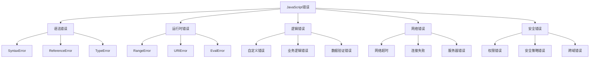

# 错误代码对照表

## 错误分类

### 错误类型


### 错误严重程度
| 级别 | 错误类型 | 影响 | 处理方式 |
|------|----------|------|----------|
| 致命 | SyntaxError, ReferenceError | 程序无法运行 | 立即修复 |
| 严重 | TypeError, RangeError | 功能异常 | 优先修复 |
| 警告 | 业务逻辑错误 | 部分功能受影响 | 计划修复 |
| 信息 | 性能问题 | 用户体验下降 | 优化处理 |

## 语法错误

### SyntaxError
```javascript
// 1. 缺少括号
// 错误代码
function greet(name {
    return `Hello, ${name}!`;
}
// 错误信息: SyntaxError: Unexpected token '{'

// 正确代码
function greet(name) {
    return `Hello, ${name}!`;
}

// 2. 缺少引号
// 错误代码
const message = Hello World;
// 错误信息: SyntaxError: Unexpected identifier

// 正确代码
const message = "Hello World";

// 3. 关键字错误
// 错误代码
const const = "variable";
// 错误信息: SyntaxError: Unexpected token 'const'

// 正确代码
const variable = "variable";

// 4. 模板字符串错误
// 错误代码
const template = `Hello ${name!`;
// 错误信息: SyntaxError: Unexpected token '!'

// 正确代码
const template = `Hello ${name}!`;

// 5. 对象字面量错误
// 错误代码
const obj = {
    name: "John",
    age: 30,
    // 错误: 尾随逗号
};
// 错误信息: SyntaxError: Unexpected token '}'

// 正确代码
const obj = {
    name: "John",
    age: 30
};
```

### 常见语法错误代码
| 错误代码 | 错误信息 | 原因 | 解决方案 |
|----------|----------|------|----------|
| ERR_SYNTAX_001 | Unexpected token '{' | 缺少括号 | 检查括号匹配 |
| ERR_SYNTAX_002 | Unexpected identifier | 缺少引号 | 添加引号 |
| ERR_SYNTAX_003 | Unexpected token 'const' | 关键字冲突 | 重命名变量 |
| ERR_SYNTAX_004 | Unexpected token '!' | 模板字符串错误 | 检查模板语法 |
| ERR_SYNTAX_005 | Unexpected token '}' | 对象语法错误 | 检查对象结构 |

## 运行时错误

### ReferenceError
```javascript
// 1. 未定义变量
// 错误代码
console.log(undefinedVariable);
// 错误信息: ReferenceError: undefinedVariable is not defined

// 正确代码
const undefinedVariable = "Hello";
console.log(undefinedVariable);

// 2. 变量提升问题
// 错误代码
console.log(x);
let x = 5;
// 错误信息: ReferenceError: Cannot access 'x' before initialization

// 正确代码
let x = 5;
console.log(x);

// 3. 作用域问题
// 错误代码
function outer() {
    let x = 1;
    function inner() {
        console.log(y); // y未定义
    }
    inner();
}
// 错误信息: ReferenceError: y is not defined

// 正确代码
function outer() {
    let x = 1;
    function inner() {
        console.log(x); // 可以访问外部变量
    }
    inner();
}

// 4. 模块导入错误
// 错误代码
import { nonExistentFunction } from './module.js';
// 错误信息: ReferenceError: nonExistentFunction is not defined

// 正确代码
import { existingFunction } from './module.js';
```

### TypeError
```javascript
// 1. 类型不匹配
// 错误代码
const num = "123";
const result = num.toUpperCase(); // 数字没有toUpperCase方法
// 错误信息: TypeError: num.toUpperCase is not a function

// 正确代码
const str = "123";
const result = str.toUpperCase();

// 2. 空值访问
// 错误代码
const obj = null;
console.log(obj.property);
// 错误信息: TypeError: Cannot read property 'property' of null

// 正确代码
const obj = null;
console.log(obj?.property); // 使用可选链

// 3. 函数调用错误
// 错误代码
const notAFunction = "hello";
notAFunction();
// 错误信息: TypeError: notAFunction is not a function

// 正确代码
const isAFunction = () => "hello";
isAFunction();

// 4. 数组方法错误
// 错误代码
const notAnArray = "hello";
notAnArray.push("world");
// 错误信息: TypeError: notAnArray.push is not a function

// 正确代码
const isAnArray = ["hello"];
isAnArray.push("world");
```

### RangeError
```javascript
// 1. 数组长度错误
// 错误代码
const arr = new Array(-1);
// 错误信息: RangeError: Invalid array length

// 正确代码
const arr = new Array(5);

// 2. 数字精度错误
// 错误代码
const num = 123.456.toFixed(-1);
// 错误信息: RangeError: toFixed() digits argument must be between 0 and 100

// 正确代码
const num = 123.456.toFixed(2);

// 3. 递归深度错误
// 错误代码
function infiniteRecursion() {
    return infiniteRecursion();
}
infiniteRecursion();
// 错误信息: RangeError: Maximum call stack size exceeded

// 正确代码
function finiteRecursion(n) {
    if (n <= 0) return 0;
    return n + finiteRecursion(n - 1);
}
```

### 常见运行时错误代码
| 错误代码 | 错误类型 | 错误信息 | 解决方案 |
|----------|----------|----------|----------|
| ERR_REF_001 | ReferenceError | is not defined | 检查变量声明 |
| ERR_REF_002 | ReferenceError | Cannot access before initialization | 调整变量声明顺序 |
| ERR_TYPE_001 | TypeError | is not a function | 检查函数定义 |
| ERR_TYPE_002 | TypeError | Cannot read property of null | 使用空值检查 |
| ERR_RANGE_001 | RangeError | Invalid array length | 检查数组长度参数 |
| ERR_RANGE_002 | RangeError | Maximum call stack size exceeded | 检查递归终止条件 |

## 网络错误

### 网络错误类型
```javascript
// 1. 网络超时
// 错误代码
fetch('/api/slow-endpoint')
    .then(response => response.json())
    .catch(error => {
        if (error.name === 'AbortError') {
            console.error('ERR_NET_001: 请求超时');
        }
    });

// 解决方案
const controller = new AbortController();
setTimeout(() => controller.abort(), 5000);

fetch('/api/slow-endpoint', {
    signal: controller.signal
})
.then(response => response.json())
.catch(error => {
    if (error.name === 'AbortError') {
        console.error('请求超时，请稍后重试');
    }
});

// 2. 连接失败
// 错误代码
fetch('/api/endpoint')
    .catch(error => {
        if (error.message.includes('Failed to fetch')) {
            console.error('ERR_NET_002: 网络连接失败');
        }
    });

// 解决方案
fetch('/api/endpoint')
    .catch(error => {
        if (error.message.includes('Failed to fetch')) {
            console.error('网络连接失败，请检查网络设置');
            // 显示离线提示
        }
    });

// 3. 服务器错误
// 错误代码
fetch('/api/endpoint')
    .then(response => {
        if (!response.ok) {
            throw new Error(`ERR_NET_003: 服务器错误 ${response.status}`);
        }
        return response.json();
    });

// 解决方案
fetch('/api/endpoint')
    .then(response => {
        if (!response.ok) {
            const errorMessages = {
                400: '请求参数错误',
                401: '未授权访问',
                403: '禁止访问',
                404: '资源不存在',
                500: '服务器内部错误',
                502: '网关错误',
                503: '服务不可用'
            };
            const message = errorMessages[response.status] || '未知错误';
            throw new Error(`ERR_NET_003: ${message} (${response.status})`);
        }
        return response.json();
    });
```

### 网络错误代码表
| 错误代码 | 错误类型 | 描述 | 解决方案 |
|----------|----------|------|----------|
| ERR_NET_001 | 网络超时 | 请求超时 | 增加超时时间或重试 |
| ERR_NET_002 | 连接失败 | 网络连接失败 | 检查网络连接 |
| ERR_NET_003 | 服务器错误 | HTTP状态码错误 | 根据状态码处理 |
| ERR_NET_004 | 跨域错误 | CORS策略阻止 | 配置CORS或使用代理 |
| ERR_NET_005 | SSL错误 | 证书验证失败 | 检查SSL证书 |

## 安全错误

### 安全错误类型
```javascript
// 1. 跨域错误
// 错误代码
fetch('https://other-domain.com/api')
    .catch(error => {
        if (error.message.includes('CORS')) {
            console.error('ERR_SEC_001: 跨域请求被阻止');
        }
    });

// 解决方案
// 服务器端配置CORS
app.use(cors({
    origin: 'https://your-domain.com',
    methods: ['GET', 'POST'],
    credentials: true
}));

// 2. 内容安全策略错误
// 错误代码
// 当CSP阻止内联脚本时
// 错误信息: ERR_SEC_002: Content Security Policy violation

// 解决方案
// 在HTML中添加nonce
<script nonce="random-value">
    // 内联脚本
</script>

// 3. 权限错误
// 错误代码
navigator.geolocation.getCurrentPosition(
    position => console.log(position),
    error => {
        if (error.code === error.PERMISSION_DENIED) {
            console.error('ERR_SEC_003: 地理位置权限被拒绝');
        }
    }
);

// 解决方案
navigator.geolocation.getCurrentPosition(
    position => console.log(position),
    error => {
        const errorMessages = {
            [error.PERMISSION_DENIED]: '用户拒绝了地理位置请求',
            [error.POSITION_UNAVAILABLE]: '位置信息不可用',
            [error.TIMEOUT]: '请求超时'
        };
        console.error('ERR_SEC_003:', errorMessages[error.code]);
    }
);
```

### 安全错误代码表
| 错误代码 | 错误类型 | 描述 | 解决方案 |
|----------|----------|------|----------|
| ERR_SEC_001 | 跨域错误 | CORS策略阻止 | 配置CORS或使用代理 |
| ERR_SEC_002 | CSP错误 | 内容安全策略违规 | 配置CSP或使用nonce |
| ERR_SEC_003 | 权限错误 | 用户权限被拒绝 | 请求权限或提供替代方案 |
| ERR_SEC_004 | 混合内容 | HTTPS页面加载HTTP资源 | 使用HTTPS资源 |
| ERR_SEC_005 | 证书错误 | SSL证书验证失败 | 检查证书配置 |

## 自定义错误

### 错误类定义
```javascript
// 1. 基础错误类
class AppError extends Error {
    constructor(message, code, details = {}) {
        super(message);
        this.name = 'AppError';
        this.code = code;
        this.details = details;
        this.timestamp = new Date().toISOString();
        
        // 保持堆栈跟踪
        if (Error.captureStackTrace) {
            Error.captureStackTrace(this, AppError);
        }
    }
    
    toJSON() {
        return {
            name: this.name,
            message: this.message,
            code: this.code,
            details: this.details,
            timestamp: this.timestamp,
            stack: this.stack
        };
    }
}

// 2. 业务逻辑错误
class BusinessError extends AppError {
    constructor(message, code, details) {
        super(message, code, details);
        this.name = 'BusinessError';
    }
}

// 3. 数据验证错误
class ValidationError extends AppError {
    constructor(message, field, value) {
        super(message, 'ERR_VAL_001', { field, value });
        this.name = 'ValidationError';
    }
}

// 4. 使用示例
function validateUser(user) {
    if (!user.name) {
        throw new ValidationError('用户名不能为空', 'name', user.name);
    }
    
    if (user.age < 0) {
        throw new ValidationError('年龄不能为负数', 'age', user.age);
    }
    
    if (user.email && !user.email.includes('@')) {
        throw new ValidationError('邮箱格式不正确', 'email', user.email);
    }
}

// 5. 错误处理
try {
    validateUser({ name: '', age: -1, email: 'invalid' });
} catch (error) {
    if (error instanceof ValidationError) {
        console.error('验证错误:', error.message);
        console.error('字段:', error.details.field);
        console.error('值:', error.details.value);
    } else {
        console.error('未知错误:', error);
    }
}
```

### 错误代码管理系统
```javascript
// 1. 错误代码定义
const ERROR_CODES = {
    // 通用错误
    GENERIC: {
        UNKNOWN: 'ERR_GEN_001',
        INTERNAL: 'ERR_GEN_002',
        NOT_IMPLEMENTED: 'ERR_GEN_003'
    },
    
    // 验证错误
    VALIDATION: {
        REQUIRED: 'ERR_VAL_001',
        FORMAT: 'ERR_VAL_002',
        RANGE: 'ERR_VAL_003',
        UNIQUE: 'ERR_VAL_004'
    },
    
    // 业务错误
    BUSINESS: {
        NOT_FOUND: 'ERR_BUS_001',
        ALREADY_EXISTS: 'ERR_BUS_002',
        INSUFFICIENT_PERMISSIONS: 'ERR_BUS_003',
        QUOTA_EXCEEDED: 'ERR_BUS_004'
    },
    
    // 网络错误
    NETWORK: {
        TIMEOUT: 'ERR_NET_001',
        CONNECTION_FAILED: 'ERR_NET_002',
        SERVER_ERROR: 'ERR_NET_003',
        CORS_ERROR: 'ERR_NET_004'
    },
    
    // 安全错误
    SECURITY: {
        UNAUTHORIZED: 'ERR_SEC_001',
        FORBIDDEN: 'ERR_SEC_002',
        TOKEN_EXPIRED: 'ERR_SEC_003',
        INVALID_SIGNATURE: 'ERR_SEC_004'
    }
};

// 2. 错误消息映射
const ERROR_MESSAGES = {
    [ERROR_CODES.GENERIC.UNKNOWN]: '未知错误',
    [ERROR_CODES.GENERIC.INTERNAL]: '内部服务器错误',
    [ERROR_CODES.VALIDATION.REQUIRED]: '此字段为必填项',
    [ERROR_CODES.VALIDATION.FORMAT]: '格式不正确',
    [ERROR_CODES.BUSINESS.NOT_FOUND]: '资源不存在',
    [ERROR_CODES.NETWORK.TIMEOUT]: '请求超时',
    [ERROR_CODES.SECURITY.UNAUTHORIZED]: '未授权访问'
};

// 3. 错误工厂
class ErrorFactory {
    static create(code, details = {}) {
        const message = ERROR_MESSAGES[code] || '未知错误';
        return new AppError(message, code, details);
    }
    
    static validation(field, message, value) {
        return new ValidationError(message, field, value);
    }
    
    static business(message, code = ERROR_CODES.BUSINESS.NOT_FOUND) {
        return new BusinessError(message, code);
    }
}

// 4. 使用示例
try {
    // 业务逻辑
    if (!user) {
        throw ErrorFactory.create(ERROR_CODES.BUSINESS.NOT_FOUND, { userId });
    }
    
    if (!user.email) {
        throw ErrorFactory.validation('email', '邮箱不能为空', user.email);
    }
    
} catch (error) {
    console.error('错误详情:', error.toJSON());
}
```

## 错误处理最佳实践

### 错误处理策略
1. **错误分类**
   - 按严重程度分类
   - 按错误类型分类
   - 按影响范围分类

2. **错误记录**
   - 记录错误详情
   - 记录用户操作
   - 记录环境信息

3. **错误恢复**
   - 提供降级方案
   - 自动重试机制
   - 用户友好提示

### 错误监控
```javascript
// 1. 全局错误处理
window.addEventListener('error', (event) => {
    const errorInfo = {
        message: event.message,
        filename: event.filename,
        lineno: event.lineno,
        colno: event.colno,
        stack: event.error?.stack,
        timestamp: new Date().toISOString(),
        userAgent: navigator.userAgent,
        url: window.location.href
    };
    
    // 发送错误报告
    sendErrorReport(errorInfo);
});

// 2. Promise rejection处理
window.addEventListener('unhandledrejection', (event) => {
    const errorInfo = {
        reason: event.reason,
        stack: event.reason?.stack,
        timestamp: new Date().toISOString(),
        userAgent: navigator.userAgent,
        url: window.location.href
    };
    
    // 发送错误报告
    sendErrorReport(errorInfo);
});

// 3. 错误报告发送
async function sendErrorReport(errorInfo) {
    try {
        await fetch('/api/error-reports', {
            method: 'POST',
            headers: {
                'Content-Type': 'application/json'
            },
            body: JSON.stringify(errorInfo)
        });
    } catch (error) {
        console.error('发送错误报告失败:', error);
    }
}
```

## 相关链接
- [[07-问题解决/01-常见问题与解决方案]] - 常见问题与解决方案
- [[07-问题解决/02-调试技巧大全]] - 调试技巧大全
- [[07-问题解决/04-性能问题诊断]] - 性能问题诊断
- [[06-资源工具/02-在线工具/04-代码质量检查]] - 代码质量检查
