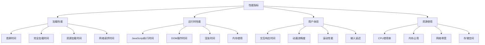

# 性能问题诊断

## 性能诊断概述

### 性能指标


### 性能问题分类
| 类型 | 指标 | 影响 | 诊断方法 |
|------|------|------|----------|
| 加载性能 | FCP, LCP, TTI | 用户体验 | 网络分析、资源优化 |
| 运行时性能 | FPS, 响应时间 | 交互体验 | 代码分析、内存监控 |
| 内存问题 | 内存泄漏、GC | 稳定性 | 内存分析、堆快照 |
| 网络性能 | 请求时间、带宽 | 加载速度 | 网络监控、缓存优化 |

## 加载性能诊断

### 核心Web指标
```javascript
// 1. 性能指标测量
class PerformanceMetrics {
    constructor() {
        this.metrics = {};
        this.observers = [];
        this.init();
    }
    
    init() {
        // 测量FCP (First Contentful Paint)
        this.measureFCP();
        
        // 测量LCP (Largest Contentful Paint)
        this.measureLCP();
        
        // 测量FID (First Input Delay)
        this.measureFID();
        
        // 测量CLS (Cumulative Layout Shift)
        this.measureCLS();
        
        // 测量TTI (Time to Interactive)
        this.measureTTI();
    }
    
    measureFCP() {
        const observer = new PerformanceObserver((list) => {
            for (const entry of list.getEntries()) {
                if (entry.entryType === 'paint' && entry.name === 'first-contentful-paint') {
                    this.metrics.fcp = entry.startTime;
                    console.log('FCP:', entry.startTime + 'ms');
                }
            }
        });
        
        observer.observe({ entryTypes: ['paint'] });
        this.observers.push(observer);
    }
    
    measureLCP() {
        const observer = new PerformanceObserver((list) => {
            const entries = list.getEntries();
            const lastEntry = entries[entries.length - 1];
            this.metrics.lcp = lastEntry.startTime;
            console.log('LCP:', lastEntry.startTime + 'ms');
        });
        
        observer.observe({ entryTypes: ['largest-contentful-paint'] });
        this.observers.push(observer);
    }
    
    measureFID() {
        const observer = new PerformanceObserver((list) => {
            for (const entry of list.getEntries()) {
                this.metrics.fid = entry.processingStart - entry.startTime;
                console.log('FID:', this.metrics.fid + 'ms');
            }
        });
        
        observer.observe({ entryTypes: ['first-input'] });
        this.observers.push(observer);
    }
    
    measureCLS() {
        let clsValue = 0;
        const observer = new PerformanceObserver((list) => {
            for (const entry of list.getEntries()) {
                if (!entry.hadRecentInput) {
                    clsValue += entry.value;
                }
            }
            this.metrics.cls = clsValue;
            console.log('CLS:', clsValue);
        });
        
        observer.observe({ entryTypes: ['layout-shift'] });
        this.observers.push(observer);
    }
    
    measureTTI() {
        // TTI需要更复杂的计算
        // 这里使用简化版本
        window.addEventListener('load', () => {
            setTimeout(() => {
                this.metrics.tti = performance.now();
                console.log('TTI:', this.metrics.tti + 'ms');
            }, 0);
        });
    }
    
    getMetrics() {
        return this.metrics;
    }
    
    cleanup() {
        this.observers.forEach(observer => observer.disconnect());
    }
}

const performanceMetrics = new PerformanceMetrics();

// 2. 资源加载分析
class ResourceAnalyzer {
    constructor() {
        this.resources = [];
        this.init();
    }
    
    init() {
        // 监听资源加载
        const observer = new PerformanceObserver((list) => {
            for (const entry of list.getEntries()) {
                if (entry.entryType === 'resource') {
                    this.analyzeResource(entry);
                }
            }
        });
        
        observer.observe({ entryTypes: ['resource'] });
    }
    
    analyzeResource(entry) {
        const resource = {
            name: entry.name,
            type: this.getResourceType(entry),
            duration: entry.duration,
            size: entry.transferSize,
            startTime: entry.startTime,
            endTime: entry.startTime + entry.duration
        };
        
        this.resources.push(resource);
        
        // 分析慢资源
        if (resource.duration > 1000) {
            console.warn('慢资源:', resource);
        }
        
        // 分析大资源
        if (resource.size > 1024 * 1024) { // 1MB
            console.warn('大资源:', resource);
        }
    }
    
    getResourceType(entry) {
        if (entry.name.includes('.js')) return 'script';
        if (entry.name.includes('.css')) return 'stylesheet';
        if (entry.name.includes('.png') || entry.name.includes('.jpg')) return 'image';
        if (entry.name.includes('.woff') || entry.name.includes('.ttf')) return 'font';
        return 'other';
    }
    
    getSlowResources(threshold = 1000) {
        return this.resources.filter(r => r.duration > threshold);
    }
    
    getLargeResources(threshold = 1024 * 1024) {
        return this.resources.filter(r => r.size > threshold);
    }
    
    getResourceSummary() {
        const summary = {
            total: this.resources.length,
            totalSize: this.resources.reduce((sum, r) => sum + r.size, 0),
            totalDuration: this.resources.reduce((sum, r) => sum + r.duration, 0),
            byType: {}
        };
        
        this.resources.forEach(resource => {
            if (!summary.byType[resource.type]) {
                summary.byType[resource.type] = {
                    count: 0,
                    size: 0,
                    duration: 0
                };
            }
            summary.byType[resource.type].count++;
            summary.byType[resource.type].size += resource.size;
            summary.byType[resource.type].duration += resource.duration;
        });
        
        return summary;
    }
}

const resourceAnalyzer = new ResourceAnalyzer();
```

### 网络性能分析
```javascript
// 1. 网络请求监控
class NetworkMonitor {
    constructor() {
        this.requests = [];
        this.setupInterceptors();
    }
    
    setupInterceptors() {
        // 拦截fetch请求
        const originalFetch = window.fetch;
        window.fetch = (...args) => {
            const requestId = this.generateId();
            const startTime = performance.now();
            
            this.requests.push({
                id: requestId,
                url: args[0],
                method: 'GET',
                startTime,
                status: 'pending'
            });
            
            return originalFetch(...args)
                .then(response => {
                    this.updateRequest(requestId, {
                        status: response.status,
                        endTime: performance.now(),
                        success: response.ok,
                        size: response.headers.get('content-length')
                    });
                    return response;
                })
                .catch(error => {
                    this.updateRequest(requestId, {
                        status: 'error',
                        endTime: performance.now(),
                        error: error.message
                    });
                    throw error;
                });
        };
    }
    
    generateId() {
        return Math.random().toString(36).substr(2, 9);
    }
    
    updateRequest(id, updates) {
        const request = this.requests.find(r => r.id === id);
        if (request) {
            Object.assign(request, updates);
        }
    }
    
    getSlowRequests(threshold = 1000) {
        return this.requests.filter(r => 
            r.endTime && (r.endTime - r.startTime) > threshold
        );
    }
    
    getFailedRequests() {
        return this.requests.filter(r => 
            r.status === 'error' || (r.status >= 400 && r.status < 600)
        );
    }
    
    getNetworkSummary() {
        const completed = this.requests.filter(r => r.endTime);
        const totalTime = completed.reduce((sum, r) => sum + (r.endTime - r.startTime), 0);
        const totalSize = completed.reduce((sum, r) => sum + (r.size || 0), 0);
        
        return {
            total: this.requests.length,
            completed: completed.length,
            failed: this.getFailedRequests().length,
            slow: this.getSlowRequests().length,
            averageTime: completed.length > 0 ? totalTime / completed.length : 0,
            totalSize: totalSize
        };
    }
}

const networkMonitor = new NetworkMonitor();

// 2. 缓存分析
class CacheAnalyzer {
    constructor() {
        this.cacheStats = new Map();
        this.init();
    }
    
    init() {
        if ('caches' in window) {
            this.analyzeCaches();
        }
    }
    
    async analyzeCaches() {
        const cacheNames = await caches.keys();
        
        for (const cacheName of cacheNames) {
            const cache = await caches.open(cacheName);
            const keys = await cache.keys();
            
            this.cacheStats.set(cacheName, {
                size: keys.length,
                keys: keys.map(key => ({
                    url: key.url,
                    method: key.method
                }))
            });
        }
    }
    
    getCacheStats() {
        return Object.fromEntries(this.cacheStats);
    }
    
    async getCacheHitRate() {
        // 这里需要实现缓存命中率统计
        // 通常需要服务端支持
        return 0;
    }
}

const cacheAnalyzer = new CacheAnalyzer();
```

## 运行时性能诊断

### JavaScript性能分析
```javascript
// 1. 函数性能分析
class FunctionProfiler {
    constructor() {
        this.profiles = new Map();
    }
    
    profile(fn, name) {
        return (...args) => {
            const startTime = performance.now();
            const startMemory = this.getMemoryUsage();
            
            try {
                const result = fn.apply(this, args);
                
                // 处理异步函数
                if (result instanceof Promise) {
                    return result.then(value => {
                        this.recordProfile(name, startTime, startMemory);
                        return value;
                    }).catch(error => {
                        this.recordProfile(name, startTime, startMemory, error);
                        throw error;
                    });
                } else {
                    this.recordProfile(name, startTime, startMemory);
                    return result;
                }
            } catch (error) {
                this.recordProfile(name, startTime, startMemory, error);
                throw error;
            }
        };
    }
    
    recordProfile(name, startTime, startMemory, error = null) {
        const endTime = performance.now();
        const endMemory = this.getMemoryUsage();
        
        const profile = {
            name,
            duration: endTime - startTime,
            memoryDelta: endMemory - startMemory,
            startMemory,
            endMemory,
            error: error?.message,
            timestamp: new Date().toISOString()
        };
        
        if (!this.profiles.has(name)) {
            this.profiles.set(name, []);
        }
        
        this.profiles.get(name).push(profile);
        
        // 记录慢函数
        if (profile.duration > 100) {
            console.warn('慢函数:', profile);
        }
    }
    
    getMemoryUsage() {
        if (performance.memory) {
            return performance.memory.usedJSHeapSize;
        }
        return 0;
    }
    
    getFunctionStats(name) {
        const profiles = this.profiles.get(name) || [];
        if (profiles.length === 0) return null;
        
        const durations = profiles.map(p => p.duration);
        const memoryDeltas = profiles.map(p => p.memoryDelta);
        
        return {
            name,
            count: profiles.length,
            averageDuration: durations.reduce((sum, d) => sum + d, 0) / durations.length,
            minDuration: Math.min(...durations),
            maxDuration: Math.max(...durations),
            averageMemoryDelta: memoryDeltas.reduce((sum, d) => sum + d, 0) / memoryDeltas.length,
            errors: profiles.filter(p => p.error).length
        };
    }
    
    getAllStats() {
        const stats = [];
        for (const name of this.profiles.keys()) {
            stats.push(this.getFunctionStats(name));
        }
        return stats.sort((a, b) => b.averageDuration - a.averageDuration);
    }
}

const functionProfiler = new FunctionProfiler();

// 2. DOM操作性能分析
class DOMPerformanceAnalyzer {
    constructor() {
        this.operations = [];
        this.observers = [];
        this.init();
    }
    
    init() {
        // 监听DOM变化
        const observer = new MutationObserver((mutations) => {
            mutations.forEach(mutation => {
                this.recordMutation(mutation);
            });
        });
        
        observer.observe(document.body, {
            childList: true,
            subtree: true,
            attributes: true,
            attributeOldValue: true
        });
        
        this.observers.push(observer);
    }
    
    recordMutation(mutation) {
        const operation = {
            type: mutation.type,
            target: mutation.target.tagName,
            addedNodes: mutation.addedNodes.length,
            removedNodes: mutation.removedNodes.length,
            attributeName: mutation.attributeName,
            timestamp: performance.now()
        };
        
        this.operations.push(operation);
        
        // 检测频繁DOM操作
        this.detectFrequentOperations();
    }
    
    detectFrequentOperations() {
        const recent = this.operations.slice(-10);
        const now = performance.now();
        const recentOperations = recent.filter(op => now - op.timestamp < 1000);
        
        if (recentOperations.length > 50) {
            console.warn('检测到频繁DOM操作:', recentOperations.length);
        }
    }
    
    getDOMStats() {
        const stats = {
            total: this.operations.length,
            byType: {},
            recent: this.operations.slice(-100)
        };
        
        this.operations.forEach(op => {
            if (!stats.byType[op.type]) {
                stats.byType[op.type] = 0;
            }
            stats.byType[op.type]++;
        });
        
        return stats;
    }
    
    cleanup() {
        this.observers.forEach(observer => observer.disconnect());
    }
}

const domAnalyzer = new DOMPerformanceAnalyzer();
```

### 内存性能分析
```javascript
// 1. 内存泄漏检测
class MemoryLeakDetector {
    constructor() {
        this.snapshots = [];
        this.interval = null;
        this.threshold = 1024 * 1024; // 1MB
    }
    
    start(interval = 5000) {
        this.interval = setInterval(() => {
            this.takeSnapshot();
        }, interval);
    }
    
    stop() {
        if (this.interval) {
            clearInterval(this.interval);
            this.interval = null;
        }
    }
    
    takeSnapshot() {
        if (performance.memory) {
            const snapshot = {
                timestamp: Date.now(),
                used: performance.memory.usedJSHeapSize,
                total: performance.memory.totalJSHeapSize,
                limit: performance.memory.jsHeapSizeLimit
            };
            
            this.snapshots.push(snapshot);
            
            // 保持最近20个快照
            if (this.snapshots.length > 20) {
                this.snapshots.shift();
            }
            
            this.analyzeTrend();
        }
    }
    
    analyzeTrend() {
        if (this.snapshots.length < 3) return;
        
        const recent = this.snapshots.slice(-3);
        const trend = this.calculateTrend(recent);
        
        if (trend > this.threshold) {
            console.warn('检测到内存泄漏趋势:', {
                trend: `${(trend / 1024 / 1024).toFixed(2)} MB`,
                current: `${(recent[recent.length - 1].used / 1024 / 1024).toFixed(2)} MB`
            });
        }
    }
    
    calculateTrend(snapshots) {
        if (snapshots.length < 2) return 0;
        
        const first = snapshots[0];
        const last = snapshots[snapshots.length - 1];
        
        return last.used - first.used;
    }
    
    getMemoryReport() {
        if (this.snapshots.length === 0) return null;
        
        const latest = this.snapshots[this.snapshots.length - 1];
        const trend = this.calculateTrend(this.snapshots);
        
        return {
            current: {
                used: latest.used,
                total: latest.total,
                limit: latest.limit,
                percentage: (latest.used / latest.limit) * 100
            },
            trend: {
                value: trend,
                direction: trend > 0 ? 'increasing' : 'decreasing',
                rate: trend / (this.snapshots.length * 5) // MB per second
            },
            snapshots: this.snapshots.length
        };
    }
}

const memoryLeakDetector = new MemoryLeakDetector();

// 2. 垃圾回收分析
class GCAnalyzer {
    constructor() {
        this.gcEvents = [];
        this.init();
    }
    
    init() {
        // 监听垃圾回收事件
        if (performance.memory) {
            this.monitorGC();
        }
    }
    
    monitorGC() {
        let lastUsed = performance.memory.usedJSHeapSize;
        
        setInterval(() => {
            const currentUsed = performance.memory.usedJSHeapSize;
            
            // 检测垃圾回收（内存使用量突然下降）
            if (currentUsed < lastUsed * 0.9) {
                this.recordGCEvent(lastUsed - currentUsed);
            }
            
            lastUsed = currentUsed;
        }, 1000);
    }
    
    recordGCEvent(freed) {
        const event = {
            timestamp: Date.now(),
            freed: freed,
            current: performance.memory.usedJSHeapSize,
            total: performance.memory.totalJSHeapSize
        };
        
        this.gcEvents.push(event);
        
        // 保持最近50个事件
        if (this.gcEvents.length > 50) {
            this.gcEvents.shift();
        }
        
        console.log('垃圾回收事件:', {
            freed: `${(freed / 1024 / 1024).toFixed(2)} MB`,
            current: `${(event.current / 1024 / 1024).toFixed(2)} MB`
        });
    }
    
    getGCStats() {
        if (this.gcEvents.length === 0) return null;
        
        const totalFreed = this.gcEvents.reduce((sum, event) => sum + event.freed, 0);
        const averageFreed = totalFreed / this.gcEvents.length;
        
        return {
            totalEvents: this.gcEvents.length,
            totalFreed: totalFreed,
            averageFreed: averageFreed,
            frequency: this.gcEvents.length / (this.gcEvents[this.gcEvents.length - 1].timestamp - this.gcEvents[0].timestamp) * 1000
        };
    }
}

const gcAnalyzer = new GCAnalyzer();
```

## 用户体验性能诊断

### 交互性能分析
```javascript
// 1. 输入延迟分析
class InputLatencyAnalyzer {
    constructor() {
        this.latencies = [];
        this.init();
    }
    
    init() {
        // 监听各种输入事件
        const events = ['click', 'keydown', 'touchstart', 'mousedown'];
        
        events.forEach(eventType => {
            document.addEventListener(eventType, (event) => {
                this.measureLatency(event, eventType);
            }, { passive: true });
        });
    }
    
    measureLatency(event, eventType) {
        const startTime = performance.now();
        
        // 使用requestAnimationFrame测量渲染延迟
        requestAnimationFrame(() => {
            const endTime = performance.now();
            const latency = endTime - startTime;
            
            this.latencies.push({
                type: eventType,
                latency: latency,
                timestamp: startTime
            });
            
            // 检测高延迟
            if (latency > 16) { // 60fps = 16.67ms per frame
                console.warn('高输入延迟:', {
                    type: eventType,
                    latency: `${latency.toFixed(2)}ms`
                });
            }
        });
    }
    
    getLatencyStats() {
        if (this.latencies.length === 0) return null;
        
        const latencies = this.latencies.map(l => l.latency);
        const average = latencies.reduce((sum, l) => sum + l, 0) / latencies.length;
        const max = Math.max(...latencies);
        const min = Math.min(...latencies);
        
        return {
            total: this.latencies.length,
            average: average,
            min: min,
            max: max,
            highLatency: this.latencies.filter(l => l.latency > 16).length
        };
    }
}

const inputLatencyAnalyzer = new InputLatencyAnalyzer();

// 2. 滚动性能分析
class ScrollPerformanceAnalyzer {
    constructor() {
        this.scrollEvents = [];
        this.init();
    }
    
    init() {
        let lastScrollTime = 0;
        let frameCount = 0;
        
        const measureScroll = () => {
            const now = performance.now();
            frameCount++;
            
            if (now - lastScrollTime >= 1000) {
                const fps = frameCount / ((now - lastScrollTime) / 1000);
                
                this.scrollEvents.push({
                    fps: fps,
                    timestamp: now
                });
                
                // 检测低FPS
                if (fps < 30) {
                    console.warn('低滚动FPS:', `${fps.toFixed(1)}fps`);
                }
                
                frameCount = 0;
                lastScrollTime = now;
            }
            
            requestAnimationFrame(measureScroll);
        };
        
        requestAnimationFrame(measureScroll);
    }
    
    getScrollStats() {
        if (this.scrollEvents.length === 0) return null;
        
        const fpsValues = this.scrollEvents.map(e => e.fps);
        const average = fpsValues.reduce((sum, f) => sum + f, 0) / fpsValues.length;
        const min = Math.min(...fpsValues);
        
        return {
            average: average,
            min: min,
            lowFPS: this.scrollEvents.filter(e => e.fps < 30).length,
            total: this.scrollEvents.length
        };
    }
}

const scrollAnalyzer = new ScrollPerformanceAnalyzer();
```

## 性能诊断工具

### 综合性能分析器
```javascript
// 1. 性能分析器主类
class PerformanceAnalyzer {
    constructor() {
        this.metrics = new PerformanceMetrics();
        this.resourceAnalyzer = new ResourceAnalyzer();
        this.networkMonitor = new NetworkMonitor();
        this.functionProfiler = new FunctionProfiler();
        this.memoryLeakDetector = new MemoryLeakDetector();
        this.inputLatencyAnalyzer = new InputLatencyAnalyzer();
        this.scrollAnalyzer = new ScrollPerformanceAnalyzer();
        
        this.startTime = performance.now();
    }
    
    start() {
        this.memoryLeakDetector.start();
        console.log('性能分析器已启动');
    }
    
    stop() {
        this.memoryLeakDetector.stop();
        console.log('性能分析器已停止');
    }
    
    getComprehensiveReport() {
        const report = {
            timestamp: new Date().toISOString(),
            duration: performance.now() - this.startTime,
            
            // 核心Web指标
            webVitals: this.metrics.getMetrics(),
            
            // 资源加载
            resources: this.resourceAnalyzer.getResourceSummary(),
            
            // 网络性能
            network: this.networkMonitor.getNetworkSummary(),
            
            // 函数性能
            functions: this.functionProfiler.getAllStats(),
            
            // 内存使用
            memory: this.memoryLeakDetector.getMemoryReport(),
            
            // 垃圾回收
            garbageCollection: this.gcAnalyzer.getGCStats(),
            
            // 输入延迟
            inputLatency: this.inputLatencyAnalyzer.getLatencyStats(),
            
            // 滚动性能
            scroll: this.scrollAnalyzer.getScrollStats()
        };
        
        return report;
    }
    
    exportReport() {
        const report = this.getComprehensiveReport();
        const blob = new Blob([JSON.stringify(report, null, 2)], {
            type: 'application/json'
        });
        
        const url = URL.createObjectURL(blob);
        const a = document.createElement('a');
        a.href = url;
        a.download = `performance-report-${Date.now()}.json`;
        a.click();
        
        URL.revokeObjectURL(url);
    }
    
    printReport() {
        const report = this.getComprehensiveReport();
        console.table(report.webVitals);
        console.table(report.resources.byType);
        console.table(report.functions);
    }
}

// 2. 使用示例
const analyzer = new PerformanceAnalyzer();
analyzer.start();

// 运行一段时间后
setTimeout(() => {
    analyzer.printReport();
    analyzer.exportReport();
    analyzer.stop();
}, 30000); // 运行30秒
```

### 性能监控面板
```javascript
// 1. 性能监控UI
class PerformanceMonitorUI {
    constructor(analyzer) {
        this.analyzer = analyzer;
        this.panel = null;
        this.updateInterval = null;
        this.createPanel();
    }
    
    createPanel() {
        this.panel = document.createElement('div');
        this.panel.id = 'performance-monitor';
        this.panel.style.cssText = `
            position: fixed;
            top: 10px;
            right: 10px;
            width: 300px;
            background: rgba(0, 0, 0, 0.8);
            color: white;
            padding: 10px;
            border-radius: 5px;
            font-family: monospace;
            font-size: 12px;
            z-index: 10000;
            max-height: 400px;
            overflow-y: auto;
        `;
        
        document.body.appendChild(this.panel);
        this.startUpdates();
    }
    
    startUpdates() {
        this.updateInterval = setInterval(() => {
            this.updateDisplay();
        }, 1000);
    }
    
    updateDisplay() {
        const report = this.analyzer.getComprehensiveReport();
        
        this.panel.innerHTML = `
            <h3>性能监控</h3>
            <div>FCP: ${report.webVitals.fcp?.toFixed(2) || 'N/A'}ms</div>
            <div>LCP: ${report.webVitals.lcp?.toFixed(2) || 'N/A'}ms</div>
            <div>FID: ${report.webVitals.fid?.toFixed(2) || 'N/A'}ms</div>
            <div>CLS: ${report.webVitals.cls?.toFixed(4) || 'N/A'}</div>
            <div>内存: ${(report.memory?.current.used / 1024 / 1024).toFixed(2) || 'N/A'}MB</div>
            <div>网络请求: ${report.network.total || 0}</div>
            <div>慢请求: ${report.network.slow || 0}</div>
            <div>输入延迟: ${report.inputLatency?.average?.toFixed(2) || 'N/A'}ms</div>
            <div>滚动FPS: ${report.scroll?.average?.toFixed(1) || 'N/A'}</div>
        `;
    }
    
    destroy() {
        if (this.updateInterval) {
            clearInterval(this.updateInterval);
        }
        if (this.panel) {
            this.panel.remove();
        }
    }
}

// 使用示例
const analyzer = new PerformanceAnalyzer();
const monitorUI = new PerformanceMonitorUI(analyzer);
analyzer.start();
```

## 性能优化建议

### 优化策略
1. **加载优化**
   - 代码分割
   - 懒加载
   - 预加载
   - 压缩资源

2. **运行时优化**
   - 减少DOM操作
   - 使用事件委托
   - 防抖和节流
   - 虚拟滚动

3. **内存优化**
   - 及时清理事件监听器
   - 避免内存泄漏
   - 使用对象池
   - 优化数据结构

4. **网络优化**
   - 启用缓存
   - 使用CDN
   - 压缩传输
   - 减少请求数量

### 性能预算
```javascript
// 性能预算配置
const PERFORMANCE_BUDGET = {
    // 核心Web指标
    fcp: 1800, // 1.8s
    lcp: 2500, // 2.5s
    fid: 100,  // 100ms
    cls: 0.1,  // 0.1
    
    // 资源大小
    js: 250 * 1024,    // 250KB
    css: 50 * 1024,    // 50KB
    images: 1024 * 1024, // 1MB
    
    // 网络请求
    requests: 50,
    slowRequests: 5,
    
    // 内存使用
    memory: 50 * 1024 * 1024, // 50MB
    
    // 交互性能
    inputLatency: 16, // 16ms
    scrollFPS: 30     // 30fps
};

// 性能预算检查
function checkPerformanceBudget(report) {
    const violations = [];
    
    // 检查核心Web指标
    if (report.webVitals.fcp > PERFORMANCE_BUDGET.fcp) {
        violations.push(`FCP超出预算: ${report.webVitals.fcp}ms > ${PERFORMANCE_BUDGET.fcp}ms`);
    }
    
    if (report.webVitals.lcp > PERFORMANCE_BUDGET.lcp) {
        violations.push(`LCP超出预算: ${report.webVitals.lcp}ms > ${PERFORMANCE_BUDGET.lcp}ms`);
    }
    
    // 检查内存使用
    if (report.memory?.current.used > PERFORMANCE_BUDGET.memory) {
        violations.push(`内存使用超出预算: ${report.memory.current.used} > ${PERFORMANCE_BUDGET.memory}`);
    }
    
    // 检查网络请求
    if (report.network.slow > PERFORMANCE_BUDGET.slowRequests) {
        violations.push(`慢请求超出预算: ${report.network.slow} > ${PERFORMANCE_BUDGET.slowRequests}`);
    }
    
    if (violations.length > 0) {
        console.warn('性能预算违规:', violations);
    } else {
        console.log('性能预算检查通过');
    }
    
    return violations;
}
```

## 相关链接
- [[07-问题解决/01-常见问题与解决方案]] - 常见问题与解决方案
- [[07-问题解决/02-调试技巧大全]] - 调试技巧大全
- [[07-问题解决/03-错误代码对照表]] - 错误代码对照表
- [[06-资源工具/02-在线工具/03-性能分析工具]] - 性能分析工具
