# 概念关系图

## 知识体系概述

### 核心概念关系
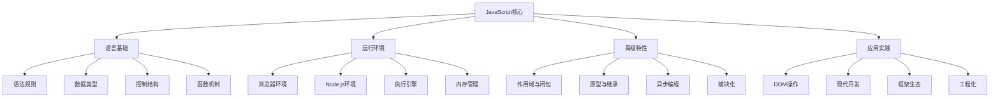

### 学习路径关系
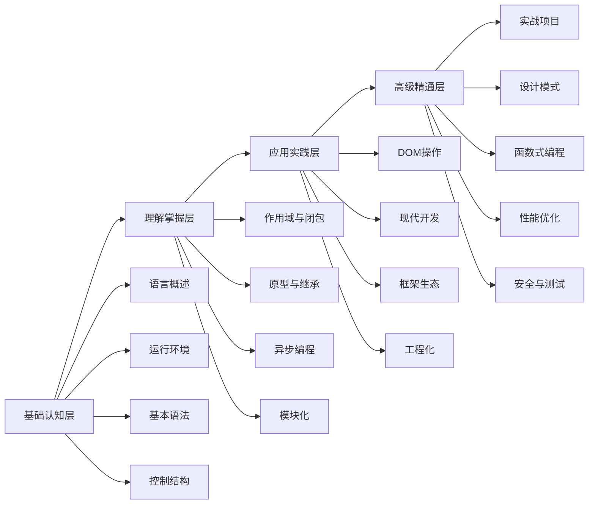

## 基础概念关系

### 语言基础关系
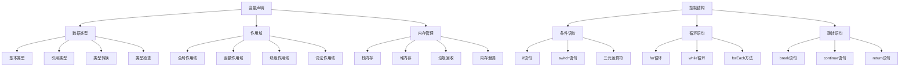

### 函数机制关系
```mermaid
graph TD
    A[函数定义] --> B[函数调用]
    A --> C[参数传递]
    A --> D[返回值]
    
    B --> B1[直接调用]
    B --> B2[方法调用]
    B --> B3[构造函数调用]
    B --> B4[间接调用]
    
    C --> C1[值传递]
    C --> C2[引用传递]
    C --> C3[默认参数]
    C --> C4[剩余参数]
    
    D --> D1[显式返回]
    D --> D2[隐式返回]
    D --> D3[返回对象]
    D --> D4[返回函数]
    
    E[函数类型] --> F[普通函数]
    E --> G[箭头函数]
    E --> H[生成器函数]
    E --> I[异步函数]
    
    F --> F1[函数声明]
    F --> F2[函数表达式]
    F --> F3[立即执行函数]
    
    G --> G1[语法简洁]
    G --> G2[this绑定]
    G --> G3[不能作为构造函数]
    
    H --> H1[yield关键字]
    H --> H2[迭代器协议]
    H --> H3[惰性求值]
    
    I --> I1[async关键字]
    I --> I2[await关键字]
    I --> I3[Promise处理]
```

## 高级特性关系

### 作用域与闭包关系
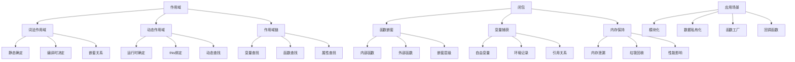

### 原型与继承关系
```mermaid
graph TD
    A[对象] --> B[原型对象]
    A --> C[构造函数]
    A --> D[实例对象]
    
    B --> B1[prototype属性]
    B --> B2[__proto__属性]
    B --> B3[原型链]
    
    C --> C1[new操作符]
    C --> C2[this绑定]
    C --> C3[实例创建]
    
    D --> D1[属性访问]
    D --> D2[方法调用]
    D --> D3[继承关系]
    
    E[继承模式] --> F[原型链继承]
    E --> G[构造函数继承]
    E --> H[组合继承]
    E --> I[寄生继承]
    
    F --> F1[原型对象共享]
    F --> F2[属性查找]
    F --> F3[方法重写]
    
    G --> G1[属性复制]
    G --> G2[实例独立]
    G --> G3[方法共享问题]
    
    H --> H1[属性继承]
    H --> H2[方法继承]
    H --> H3[最佳实践]
    
    I --> I1[对象增强]
    I --> I2[功能扩展]
    I --> I3[性能优化]
    
    J[ES6类] --> K[class关键字]
    J --> L[extends关键字]
    J --> M[super关键字]
    J --> N[静态方法]
```

### 异步编程关系
```mermaid
graph TD
    A[异步编程] --> B[回调函数]
    A --> C[Promise]
    A --> D[async/await]
    A --> E[事件循环]
    
    B --> B1[回调地狱]
    B --> B2[错误处理]
    B --> B3[控制流]
    
    C --> C1[状态管理]
    C --> C2[链式调用]
    C --> C3[错误传播]
    C --> C4[并发控制]
    
    D --> D1[同步语法]
    D --> D2[错误处理]
    D --> D3[并发执行]
    D --> D4[性能优化]
    
    E --> E1[调用栈]
    E --> E2[任务队列]
    E --> E3[微任务队列]
    E --> E4[宏任务队列]
    
    F[异步模式] --> G[串行执行]
    F --> H[并行执行]
    F --> I[竞态条件]
    F --> J[超时控制]
    
    G --> G1[顺序执行]
    G --> G2[依赖关系]
    G --> G3[错误处理]
    
    H --> H1[并发执行]
    H --> H2[资源竞争]
    H --> H3[结果聚合]
    
    I --> I1[竞态检测]
    I --> I2[状态同步]
    I --> I3[数据一致性]
    
    J --> J1[超时设置]
    J --> J2[取消操作]
    J --> J3[资源清理]
```

## 应用实践关系

### DOM操作关系
```mermaid
graph TD
    A[DOM操作] --> B[元素选择]
    A --> C[元素操作]
    A --> D[事件处理]
    A --> E[样式操作]
    
    B --> B1[getElementById]
    B --> B2[querySelector]
    B --> B3[querySelectorAll]
    B --> B4[getElementsByTagName]
    
    C --> C1[创建元素]
    C --> C2[插入元素]
    C --> C3[删除元素]
    C --> C4[替换元素]
    
    D --> D1[事件监听]
    D --> D2[事件委托]
    D --> D3[事件对象]
    D --> D4[事件传播]
    
    E --> E1[内联样式]
    E --> E2[类名操作]
    E --> E3[计算样式]
    E --> E4[动画效果]
    
    F[性能优化] --> G[批量操作]
    F --> H[事件委托]
    F --> I[虚拟DOM]
    F --> J[防抖节流]
    
    G --> G1[DocumentFragment]
    G --> G2[innerHTML]
    G --> G3[批量更新]
    
    H --> H1[事件冒泡]
    H --> H2[目标元素]
    H --> H3[性能提升]
    
    I --> I1[差异算法]
    I --> I2[批量更新]
    I --> I3[性能优化]
    
    J --> J1[防抖函数]
    J --> J2[节流函数]
    J --> J3[性能优化]
```

### 现代开发关系
```mermaid
graph TD
    A[现代开发] --> B[ES6+特性]
    A --> C[TypeScript]
    A --> D[函数式编程]
    A --> E[响应式编程]
    
    B --> B1[let/const]
    B --> B2[箭头函数]
    B --> B3[解构赋值]
    B --> B4[模板字符串]
    B --> B5[模块系统]
    
    C --> C1[类型系统]
    C --> C2[接口定义]
    C --> C3[泛型编程]
    C --> C4[装饰器]
    
    D --> D1[纯函数]
    D --> D2[不可变数据]
    D --> D3[函数组合]
    D --> D4[高阶函数]
    
    E --> E1[数据流]
    E --> E2[状态管理]
    E --> E3[副作用处理]
    E --> E4[时间处理]
    
    F[开发模式] --> G[组件化开发]
    F --> H[模块化开发]
    F --> I[微前端架构]
    F --> J[服务端渲染]
    
    G --> G1[组件设计]
    G --> G2[状态管理]
    G --> G3[组件通信]
    G --> G4[生命周期]
    
    H --> H1[模块定义]
    H --> H2[模块加载]
    H --> H3[依赖管理]
    H --> H4[代码分割]
    
    I --> I1[应用拆分]
    I --> I2[独立部署]
    I --> I3[技术栈选择]
    I --> I4[通信机制]
    
    J --> J1[首屏渲染]
    J --> J2[SEO优化]
    J --> J3[性能提升]
    J --> J4[用户体验]
```

### 框架生态关系
```mermaid
graph TD
    A[前端框架] --> B[React]
    A --> C[Vue.js]
    A --> D[Angular]
    A --> E[Svelte]
    
    B --> B1[组件化]
    B --> B2[虚拟DOM]
    B --> B3[单向数据流]
    B --> B4[Hooks]
    B --> B5[生态系统]
    
    C --> C1[渐进式]
    C --> C2[模板语法]
    C --> C3[响应式系统]
    C --> C4[组合式API]
    C --> C5[生态系统]
    
    D --> D1[TypeScript]
    D --> D2[依赖注入]
    D --> D3[装饰器]
    D --> D4[企业级]
    D --> D5[生态系统]
    
    E --> E1[编译时优化]
    E --> E2[无虚拟DOM]
    E --> E3[小体积]
    E --> E4[高性能]
    E --> E5[生态系统]
    
    F[状态管理] --> G[Redux]
    F --> H[Vuex/Pinia]
    F --> I[NgRx]
    F --> J[Zustand]
    
    G --> G1[单一数据源]
    G --> G2[不可变更新]
    G --> G3[时间旅行]
    G --> G4[中间件]
    
    H --> H1[集中式状态]
    H --> H2[模块化]
    H --> H3[响应式]
    H --> H4[开发工具]
    
    I --> I1[RxJS集成]
    I --> I2[副作用管理]
    I --> I3[不可变更新]
    I --> I4[类型安全]
    
    J --> J1[轻量级]
    J --> J2[TypeScript支持]
    J --> J3[简单API]
    J --> J4[性能优化]
```

## 高级精通关系

### 设计模式关系
```mermaid
graph TD
    A[设计模式] --> B[创建型模式]
    A --> C[结构型模式]
    A --> D[行为型模式]
    A --> E[JavaScript特有模式]
    
    B --> B1[单例模式]
    B --> B2[工厂模式]
    B --> B3[建造者模式]
    B --> B4[原型模式]
    
    C --> C1[适配器模式]
    C --> C2[装饰器模式]
    C --> C3[外观模式]
    C --> C4[代理模式]
    
    D --> D1[观察者模式]
    D --> D2[策略模式]
    D --> D3[命令模式]
    D --> D4[迭代器模式]
    
    E --> E1[模块模式]
    E --> E2[命名空间模式]
    E --> E3[混入模式]
    E --> E4[发布订阅模式]
    
    F[应用场景] --> G[框架设计]
    F --> H[库开发]
    F --> I[应用架构]
    F --> J[代码重构]
    
    G --> G1[组件系统]
    G --> G2[状态管理]
    G --> G3[路由系统]
    G --> G4[插件系统]
    
    H --> H1[API设计]
    H --> H2[扩展机制]
    H --> H3[配置管理]
    H --> H4[错误处理]
    
    I --> I1[模块划分]
    I --> I2[数据流设计]
    I --> I3[通信机制]
    I --> I4[性能优化]
    
    J --> J1[代码复用]
    R --> R2[可维护性]
    R --> R3[可扩展性]
    R --> R4[可测试性]
```

### 函数式编程关系
```mermaid
graph TD
    A[函数式编程] --> B[纯函数]
    A --> C[不可变数据]
    A --> D[函数组合]
    A --> E[高阶函数]
    
    B --> B1[无副作用]
    B --> B2[相同输入相同输出]
    B --> B3[可预测性]
    B --> B4[可测试性]
    
    C --> C1[不可变对象]
    C --> C2[不可变数组]
    C --> C3[结构共享]
    C --> C4[性能优化]
    
    D --> D1[函数管道]
    D --> D2[数据流处理]
    D --> D3[代码复用]
    D --> D4[可读性提升]
    
    E --> E1[函数作为参数]
    E --> E2[函数作为返回值]
    E --> E3[闭包应用]
    E --> E4[柯里化]
    
    F[函数式库] --> G[Lodash]
    F --> H[Ramda]
    F --> I[Immutable.js]
    F --> J[RxJS]
    
    G --> G1[工具函数]
    G --> G2[数组操作]
    G --> G3[对象操作]
    G --> G4[函数操作]
    
    H --> H1[函数优先]
    H --> H2[不可变数据]
    H --> H3[自动柯里化]
    H --> H4[函数组合]
    
    I --> I1[不可变数据结构]
    I --> I2[结构共享]
    I --> I3[性能优化]
    I --> I4[类型安全]
    
    J --> J1[响应式编程]
    J --> J2[流处理]
    J --> J3[异步处理]
    J --> J4[事件处理]
```

### 性能优化关系
```mermaid
graph TD
    A[性能优化] --> B[加载性能]
    A --> C[运行时性能]
    A --> D[内存优化]
    A --> E[网络优化]
    
    B --> B1[代码分割]
    B --> B2[懒加载]
    B --> B3[预加载]
    B --> B4[资源压缩]
    
    C --> C1[算法优化]
    C --> C2[数据结构优化]
    C --> C3[缓存策略]
    C --> C4[并发优化]
    
    D --> D1[内存泄漏检测]
    D --> D2[垃圾回收优化]
    D --> D3[对象池模式]
    D --> D4[弱引用使用]
    
    E --> E1[请求优化]
    E --> E2[缓存策略]
    E --> E3[CDN使用]
    E --> E4[压缩传输"]
    
    F[监控工具] --> G[性能分析]
    F --> H[内存分析]
    F --> I[网络分析]
    F --> J[用户体验分析"]
    
    G --> G1[Chrome DevTools]
    G --> G2[Lighthouse]
    G --> G3[WebPageTest]
    G --> G4[自定义监控"]
    
    H --> H1[堆快照分析]
    H --> H2[内存泄漏检测"]
    H --> H3[垃圾回收分析"]
    H --> H4[内存使用优化"]
    
    I --> I1[请求监控"]
    I --> I2[响应时间分析"]
    I --> I3[带宽使用优化"]
    I --> I4[缓存命中率"]
    
    J --> J1[Core Web Vitals"]
    J --> J2[用户交互分析"]
    J --> J3[页面加载分析"]
    J --> J4[错误率监控"]
```

## 知识关联建议

### 学习路径关联
1. **基础到高级**
   - 从基础语法开始
   - 逐步深入高级特性
   - 理解概念之间的关联

2. **理论与实践**
   - 学习理论概念
   - 通过实践验证
   - 建立知识体系

3. **点线面结合**
   - 掌握核心概念点
   - 理解概念间的线
   - 构建完整的知识面

### 概念理解策略
1. **类比理解**
   - 用生活中的例子类比
   - 用已知概念理解新概念
   - 建立概念间的联系

2. **实践验证**
   - 通过代码验证概念
   - 观察实际运行效果
   - 加深理解印象

3. **系统总结**
   - 定期总结学习内容
   - 绘制知识关系图
   - 建立个人知识体系

### 应用实践关联
1. **项目驱动**
   - 通过项目应用知识
   - 解决实际问题
   - 积累实践经验

2. **技术栈整合**
   - 理解技术栈关系
   - 掌握技术选型
   - 建立技术视野

3. **持续学习**
   - 关注技术发展
   - 更新知识体系
   - 保持技术敏感度

## 相关链接
- [[08-知识关联/02-知识点交叉引用]] - 知识点交叉引用
- [[08-知识关联/03-学习路径推荐]] - 学习路径推荐
- [[08-知识关联/04-知识巩固练习]] - 知识巩固练习
- [[00-学习指南/02-知识体系总览]] - 知识体系总览
