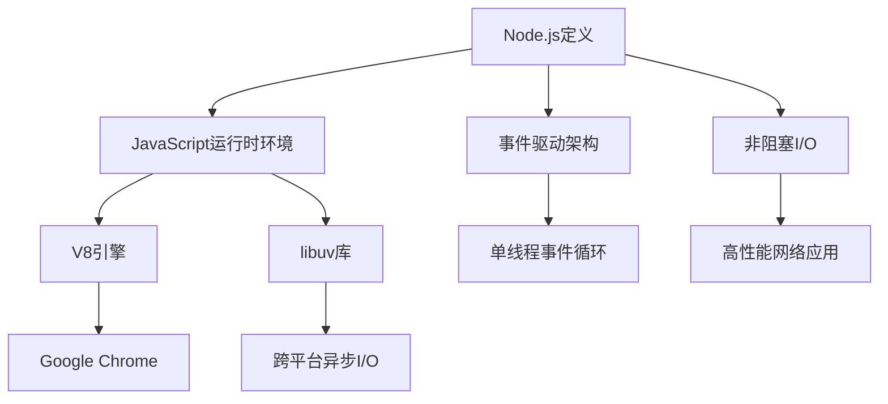
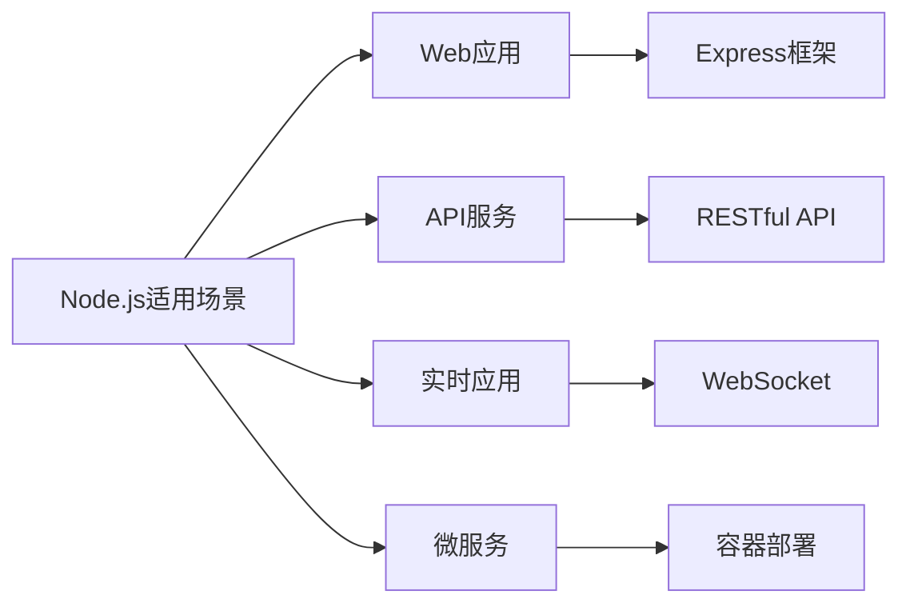

# Node.js概述

## 📋 知识结构（金字塔模型）

### 🏗️ 基础层：认知（What）
**Node.js是什么？**
- JavaScript运行时的服务器端环境
- 基于Chrome V8引擎构建
- 使用事件驱动、非阻塞I/O模型

### 🔍 理解层：机制（Why & How）
**核心特性：**
| 特性 | 描述 | 优势 |
|------|------|------|
| **事件驱动** | 基于事件回调的编程模式 | 高并发处理能力 |
| **非阻塞I/O** | 异步处理所有I/O操作 | 避免线程等待 |
| **单线程** | 主线程执行事件循环 | 简化并发编程 |
| **跨平台** | 支持Windows、Linux、macOS | 部署灵活性 |

### 🚀 应用层：实践（Apply）
**适用场景：**

## 🧠 费曼学习法：能用简单的话解释

**一句话解释：** Node.js让JavaScript脱离了浏览器，可以在服务器端运行。

**核心机制：**
1. JavaScript代码通过V8引擎编译执行
2. libuv处理异步I/O操作
3. 事件循环机制处理回调函数
4. 单线程避免了锁竞争问题

## 🎯 刻意练习要点

**核心概念掌握：**
- [ ] 理解事件驱动与非阻塞I/O的关系
- [ ] 掌握单线程模型的优劣势
- [ ] 了解模块生态系统的作用

**关联学习：**
- → [[003-V8引擎原理解析]] 深入理解执行引擎
- → [[004-事件循环机制]] 核心运行机制
- → [[005-模块系统详解]] 代码组织方式

## 💡 知识点跳转

**前置知识：** JavaScript基础、Web开发概念
**后续深入：** V8引擎工作原理、事件循环详细机制

---

*🔗 相关链接：[[002-JavaScript运行环境对比]] | [[003-V8引擎原理解析]] | [[004-事件循环机制]]*
