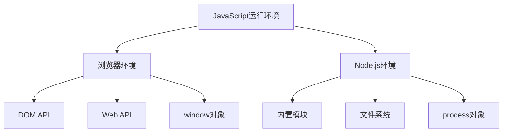
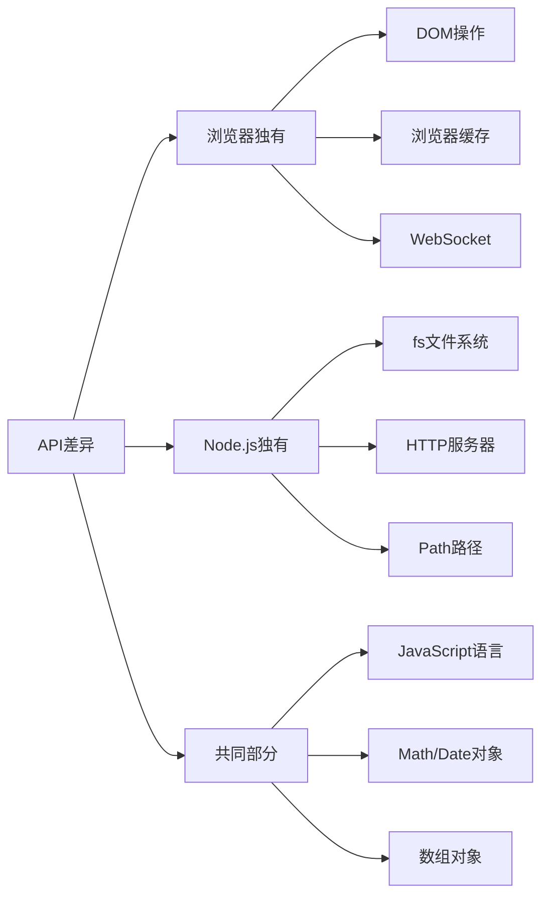

# JavaScript运行环境对比



## 📋 知识结构（金字塔模型）

### 🏗️ 基础层：认知（What）
**两种运行环境对比**

| 环境 | 执行位置 | 全局对象 | 主要用途 |
|------|----------|----------|----------|
| **浏览器** | 客户端 | `window` | 前端交互 |
| **Node.js** | 服务端 | `global` | 服务开发 |

### 🔍 理解层：机制（Why & How）

**API差异对比：**


**核心区别：**

| 特性 | 浏览器环境 | Node.js环境 |
|------|------------|-------------|
| **模块系统** | ES6 Modules | CommonJS + ES6 |
| **包管理** | CDN引入 | npm/yarn |
| **调试工具** | DevTools | debugger |
| **内存管理** | 自动GC | 手动控制 |
| **并发模型** | Web Workers | Cluster |

### 🚀 应用层：实践（Apply）

**实际开发中的差异：**

**1. DOM操作差异**
```javascript
// ❌ Node.js中无法使用
document.getElementById('app')

// ✅ Node.js中使用JSDOM模拟
const jsdom = require('jsdom');
const { JSDOM } = jsdom;
const dom = new JSDOM(`<!DOCTYPE html><p>Hello world</p>`);
dom.window.document.getElementById('app');
```

**2. 模块加载差异**
```javascript
// 浏览器：ES6 Modules
import fs from 'fs';  // ❌ 无法使用

// Node.js：CommonJS
const fs = require('fs');  // ✅ 正确用法
```

## 🧠 费曼学习法：能用简单的话解释

**简单类比：** 
- **浏览器环境** = 房子里的家具（DOM、CSS），只能在屋里用
- **Node.js环境** = 房子的管道系统（fs、http），管理房子运转

**关键理解：**
1. JavaScript是语言本身，环境提供API
2. 不同环境有不同的内置功能
3. Node.js补充了浏览器缺失的服务端能力

## 🎯 刻意练习要点

**必须掌握：**
- [ ] 理解global vs window对象差异
- [ ] 掌握CommonJS vs ES6 Modules差异
- [ ] 能够判断哪些API在哪个环境可用

**实践练习：**
```javascript
// 练习1：环境检测
if (typeof window !== 'undefined') {
    console.log('运行在浏览器');
} else if (typeof process !== 'undefined') {
    console.log('运行在Node.js');
}

// 练习2：跨环境兼容
const isBrowser = typeof window !== 'undefined';
const fetch = isBrowser ? window.fetch : require('node-fetch');
```

**关联学习：**
- → [[005-模块系统详解]] 深入模块机制
- → [[006-异步编程范式]] 异步编程差异
- → [[009-内置模块总览]] Node.js特有模块

## 💡 知识点跳转

**前置知识：** [[001-Node.js概述]] - Node.js基础概念
**后续深入：** [[003-V8引擎原理解析]] - 底层运行机制

---

*🔗 相关链接：[[001-Node.js概述]] | [[003-V8引擎原理解析]] | [[005-模块系统详解]]*
