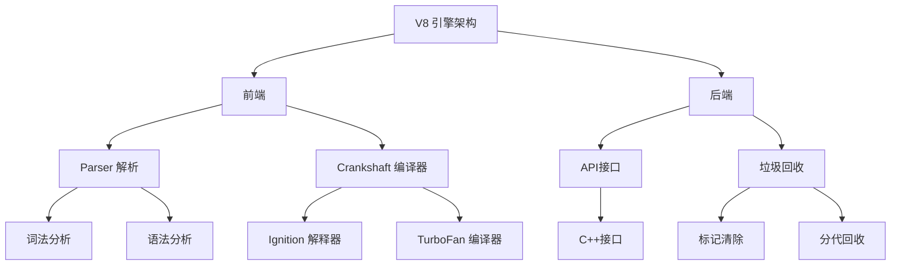
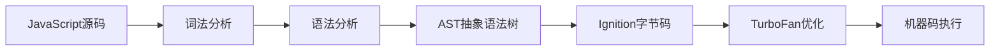

# V8引擎原理解析



## 📋 知识结构（金字塔模型）

### 🏗️ 基础层：认知（What）
**V8引擎是什么？**
- Google开发的高性能JavaScript引擎
- Chrome浏览器和Node.js的执行核心
- 将JavaScript编译为机器码执行

### 🔍 理解层：机制（Why & How）

**V8工作流程：**

| 阶段 | 组件 | 功能 | 优化目标 |
|------|------|------|----------|
| **解析** | Parser | 生成AST | 语法检查 |
| **编译** | Ignition | 字节码 | 快速启动 |
| **优化** | TurboFan | 机器码 | 性能优化 |
| **执行** | Runtime | 运行代码 | 稳定执行 |



**关键优化技术：**

| 优化技术 | 原理 | 作用 |
|----------|------|------|
| **即时编译(JIT)** | 运行时编译 | 热代码优化 |
| **内联缓存(IC)** | 类型缓存 | 快速属性访问 |
| **隐藏类** | 结构缓存 | 对象形状优化 |
| **压缩指针** | 内存优化 | 减少内存占用 |

### 🚀 应用层：实践（Apply）

**性能优化策略：**

**1. 内联缓存优化**
```javascript
// ✅ 好的做法：保持对象结构一致
function add(a, b) {
    return a.x + b.y;  // 相同属性访问路径
}

// ❌ 避免：动态改变对象结构
function bad(obj) {
    obj.newProp = 1;   // 破坏隐藏类
    return obj.value;
}
```

**2. 避免类型污染**
```javascript
// ✅ 好的做法：保持类型一致
function process(numbers) {
    let sum = 0;
    for (let i = 0; i < numbers.length; i++) {
        sum += numbers[i];  // 纯数字数组
    }
    return sum;
}

// ❌ 避免：混合类型
function bad(data) {
    return data.reduce((a, b) => a + b);  // 可能包含字符串
}
```

## 🧠 费曼学习法：能用简单的话解释

**核心机制：**
1. **解析阶段**：把JavaScript代码翻译成机器能理解的结构
2. **编译阶段**：先生成简单的字节码，运行时再优化为机器码
3. **优化阶段**：观察代码行为，对热代码进行专项优化
4. **执行阶段**：直接运行高效的机器码

**简化模型：**
```
JS源码 → AST树 → 字节码 → 机器码 → CPU执行
   ↓        ↓       ↓       ↓        ↓
  解析      编译     解释     优化     运行
```

## 🎯 刻意练习要点

**性能优化实践：**

**必须掌握的优化技巧：**
- [ ] 理解隐藏类的工作机制
- [ ] 掌握内联缓存的影响因素
- [ ] 学会识别和避免性能陷阱

**性能测试代码：**
```javascript
// 性能测试示例
console.time('string-concat');
let result = '';
for (let i = 0; i < 100000; i++) {
    result += i;  // 字符串拼接性能测试
}
console.timeEnd('string-concat');
```

**常见性能陷阱：**
```javascript
// 1. 动态属性添加
function createUser(name, age) {
    const user = { name };
    // ❌ 延迟属性赋值破坏优化
    setTimeout(() => user.age = age, 0);
    return user;
}

// ✅ 优化版本
function createUserOptimized(name, age) {
    return { name, age };  // 一次性创建完整结构
}

// 2. 类型混淆
function process(data) {
    return data.map(x => x * 2);  // 必须确保x都是数字
}
```

**关联学习：**
- → [[004-事件循环机制]] V8与事件循环的关系
- → [[030-Buffer内存管理]] 底层内存操作
- → [[023-性能优化深入]] 应用层性能优化

## 💡 知识点跳转

**前置知识：** [[001-Node.js概述]] - V8引擎基础介绍
**后续深入：** [[004-事件循环机制]] - V8参与的事件处理

---

*🔗 相关链接：[[001-Node.js概述]] | [[004-事件循环机制]] | [[030-Buffer内存管理]]*
