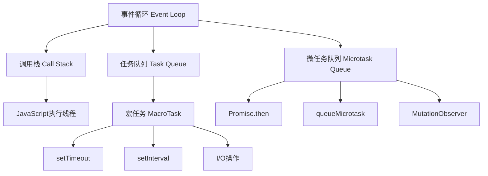
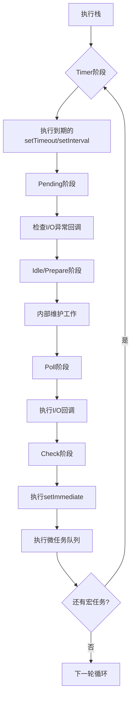

# 事件循环机制



## 📋 知识结构（金字塔模型）

### 🏗️ 基础层：认知（What）
**事件循环是什么？**
- Node.js单线程异步执行的核心机制
- 通过循环处理回调函数
- 实现非阻塞I/O的关键

### 🔍 理解层：机制（Why&How）

**事件循环六个阶段：**

| 阶段 | libuv调用 | 功能 | 示例 |
|------|-----------|------|------|
| **1.Timer** | uv_timer_t | 定时器回调 | setTimeout, setInterval |
| **2.Pending** | uv_pending_t | I/O错误回调 | 异常处理 |
| **3.Idle** | uv_idle_t | 空闲回调 | 内部处理 |
| **4.Prepare** | uv_prepare_t | 准备回调 | 内部处理 |
| **5.Poll** | uv_poll_t | I/O回调 | fs, net, http |
| **6.Check** | uv_check_t | 检查回调 | setImmediate |

**执行顺序图：**


**微任务 vs 宏任务：**

| 任务类型 | 队列 | 优先级 | 示例 | 执行时机 |
|----------|------|--------|------|----------|
| **宏任务** | Task Queue | 低 | setTimeout | 每个阶段后 |
| **微任务** | Microtask Queue | 高 | Promise.then | 每轮循环结束前 |

### 🚀 应用层：实践（Apply）

**经典面试题解答：**
```javascript
console.log('1');  // 同步代码

setTimeout(() => {
    console.log('2');  // 宏任务1：定时器阶段
}, 0);

Promise.resolve().then(() => {
    console.log('3');  // 微任务1：承诺立即resolve
});

setImmediate(() => {
    console.log('4');  // 宏任务2：检查阶段
});

console.log('5');  // 同步代码

// 输出顺序：1 -> 5 -> 3 -> 2 -> 4
// 原因：同步 > 微任务 > 宏任务
```

**实际应用模式：**

**1. 任务优先级控制**
```javascript
// ✅ 优先级控制示例
function processData() {
    return new Promise(resolve => {
        // 使用setImmediate确保在I/O前执行
        setImmediate(() => {
            // 计算密集型任务
            const result = heavyComputation();
            resolve(result);
        });
    });
}
```

**2. 避免事件循环阻塞**
```javascript
// ❌ 错误：阻塞事件循环
function badExample() {
    const end = Date.now() + 3000;
    while (Date.now() < end) {
        // 阻塞3秒，影响所有其他任务
    }
}

// ✅ 正确：使用setImmediate分片处理
function goodExample(data) {
    let index = 0;
    
    function processChunk() {
        const chunk = data.slice(index, index + 100);
        processChunkSync(chunk);
        index += 100;
        
        if (index < data.length) {
            setImmediate(processChunk);  // 让出控制权
        }
    }
    
    setImmediate(processChunk);
}
```

## 🧠 费曼学习法：能用简单的话解释

**生活类比：**
- **调用栈** = 厨房工作台（当前在做的菜）
- **任务队列** = 菜单（等待制作的菜）
- **微任务队列** = VIP优先菜单（重要客人的菜）
- **事件循环** = 厨师工作循环（做完一道菜就看菜单继续做）

**关键理解：**
1. JavaScript是单线程，但可以实现并发
2. 异步操作通过回调放在队列中等待
3. 微任务总是比宏任务先执行
4. 事件循环永不停止，除非程序退出

## 🎯 刻意练习要点

**必须掌握的要点：**
- [ ] 理解事件循环的6个阶段顺序
- [ ] 掌握微任务与宏任务的执行优先级
- [ ] 学会使用setImmediate优化性能

**练习题：**
```javascript
// 练习1：执行顺序
console.log('start');
setTimeout(() => console.log('timer'), 0);
Promise.resolve().then(() => console.log('promise'));
console.log('end');

// 练习2：复杂场景
setTimeout(() => console.log('timeout1'), 0);
setImmediate(() => console.log('immediate1'));

process.nextTick(() => console.log('nextTick'));

setTimeout(() => {
    Promise.resolve().then(() => console.log('promise in timeout'));
    setImmediate(() => console.log('immediate in timeout'));
}, 0);
```

**性能监控：**
```javascript
// 事件循环性能监控
const { performance } = require('perf_hooks');
const start = performance.now();

// 监控事件循环延迟
setImmediate(() => {
    const delay = performance.now() - start;
    console.log(`Event loop delay: ${delay}ms`);
});
```

**关联学习：**
- → [[006-异步编程范式]] 异步编程实践
- → [[009-内置模块总览]] process模块详解
- → [[028-libuv事件循环]] libuv底层机制

## 💡 知识点跳转

**前置知识：** [[003-V8引擎原理解析]] - V8引擎工作机制
**后续深入：** [[006-异步编程范式]] - 异步编程实践

---

*🔗 相关链接：[[003-V8引擎原理解析]] | [[006-异步编程范式]] | [[028-libuv事件循环]]*
