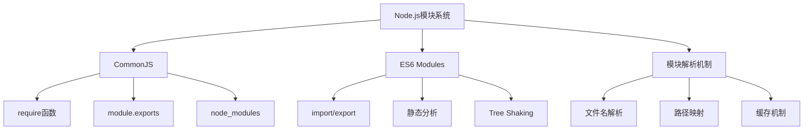
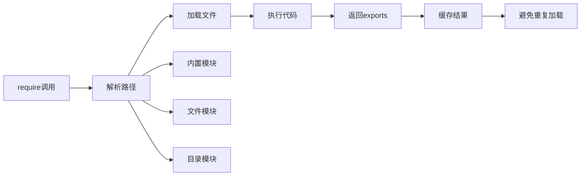

# 模块系统详解



## 📋 知识结构（金字塔模型）

### 🏗️ 基础层：认知（What）
**模块系统的作用：**
- 代码组织和重用
- 依赖管理
- 命名空间隔离
- 缓存优化

**Node.js支持的模块格式：**

| 格式 | 后缀 | 特点 | 使用场景 |
|------|------|------|----------|
| **CommonJS** | .js | 动态加载 | Node.js传统 |
| **ES6 Modules** | .mjs | 静态分析 | 现代标准 |
| **JSON** | .json | 配置数据 | 配置文件 |
| **C++插件** | .node | 原生模块 | 性能优化 |

### 🔍 理解层：机制（Why&How）

**CommonJS工作机制：**



**CommonJS vs ES6 Modules对比：**

| 特性 | CommonJS | ES6 Modules |
|------|-----------|-------------|
| **加载时机** | 运行时动态 | 编译时静态 |
| **绑定状态** | 值复制 | 引用绑定 |
| **顶层this** | module.exports | undefined |
| **Hoisting** | 不支持 | 支持 |
| **循环依赖** | 部分支持 | 静态分析 |

**模块加载优先级：**
```javascript
// 加载顺序示例
require('./module');     // 1. 相对路径（最高优先级）
require('../parent');   // 2. 相对路径上级
require('fs');           // 3. Node.js内置模块
require('lodash');       // 4. npm packages
require('/absolute');    // 5. 绝对路径
```

### 🚀 应用层：实践（实现）

**CommonJS实践：**

```javascript
// ✅ exports导出
exports.add = (a, b) => a + b;
exports.subtract = (a, b) => a - b;

// ✅ module.exports导出
module.exports = {
    calculate: (operation, a, b) => {
        switch(operation) {
            case 'add': return a + b;
            case 'sub': return a - b;
            default: throw new Error('Unknown operation');
        }
    }
};

// ✅ 混合导出（不推荐）
module.exports = Calculator;
exports.version = '1.0.0';  // 会被覆盖
```

**ES6 Modules实践：**

```javascript
// ✅ 命名导出
export const PI = 3.14159;
export function calculateArea(radius) {
    return PI * radius * radius;
}

// ✅ 默认导出
export default class Calculator {
    add(a, b) { return a + b; }
    subtract(a, b) { return a - b; }
}

// ✅ 混合导出
export { Calculator as default, PI, calculateArea };
```

**模块解析实例：**

```javascript
// utils/helpers.js
const capitalize = (str) => str.charAt(0).toUpperCase() + str.slice(1);

module.exports = {
    capitalize,
    // 或者: exports.capitalize = capitalize;
};

// app.js
const { capitalize } = require('./utils/helpers');
console.log(capitalize('hello'));  // Hello
```

**缓存机制演示：**
```javascript
// counter.js
let count = 0;
module.exports = {
    increment: () => ++count,
    getCount: () => count
};

// app.js
const counter1 = require('./counter');
const counter2 = require('./counter');  // 同一实例（缓存）

console.log(counter1.increment());  // 1
console.log(counter2.getCount());    // 1（共享状态）
```

## 🧠 费曼学习法：能用简单的话解释

**核心概念：**
1. **模块** = 一个独立的代码文件，可以导入导出功能
2. **require** = "请给我..." 的请求功能
3. **exports** = "我提供..." 的功能清单
4. **缓存** = 记住已经用过的模块，不重复加载

**生活类比：**
- **模块** = 工具箱，里面有各种工具
- **require** = 打开工具箱取工具
- **module.exports** = 工具箱里的工具清单
- **缓存** = 把用过的工具箱放在手边

## 🎯 刻意练习要点

**必须掌握的技能：**
- [ ] 理解require的解析机制
- [ ] 掌握exports的两种用法
- [ ] 学会处理循环依赖问题

**编程实践：**

**1. 模块封装练习**
```javascript
// 练习：创建通用数组工具模块
// arrayUtils.js
const arrayUtils = {
    // 数组去重
    unique: (arr) => [...new Set(arr)],
    
    // 数组分组
    groupBy: (arr, key) => {
        return arr.reduce((groups, item) => {
            (groups[item[key]] = groups[item[key]] || []).push(item);
            return groups;
        }, {});
    },
    
    // 数组交集
    intersection: (arr1, arr2) => {
        return arr1.filter(x => arr2.includes(x));
    }
};

module.exports = arrayUtils;
```

**2. 循环依赖处理**
```javascript
// moduleA.js
const moduleB = require('./moduleB');

module.exports = {
    name: 'Module A',
    greet: () => console.log(`Hello from ${moduleB.getName()}`)
};

// moduleB.js  
const moduleA = require('./moduleA');

module.exports = {
    name: 'Module B',
    getName: () => 'Module B',
    greet: () => console.log(`Hello from ${moduleA.name}`)
};
```

**性能优化：**
```javascript
// ❌ 避免：在循环中require
function badExample() {
    for (let i = 0; i < 1000; i++) {
        const fs = require('fs');  // 重复加载
        fs.writeFileSync(`file${i}.txt`, 'data');
    }
}

// ✅ 优化：提前require
function goodExample() {
    const fs = require('fs');  // 一次性加载
    
    for (let i = 0; i < 1000; i++) {
        fs.writeFileSync(`file${i}.txt`, 'data');
    }
}
```

**关联学习：**
- → [[011-包管理器深入]] 模块依赖管理
- → [[012-开发工具链]] 模块打包工具
- → [[013-模块打包策略]] 打包优化技术

## 💡 知识点跳转

**前置知识：** [[002-JavaScript运行环境对比]] - 环境差异
**后续深入：** [[011-包管理器深入]] - 包管理机制

---

*🔗 相关链接：[[002-JavaScript运行环境对比]] | [[011-包管理器深入]] | [[012-开发工具链]]*
