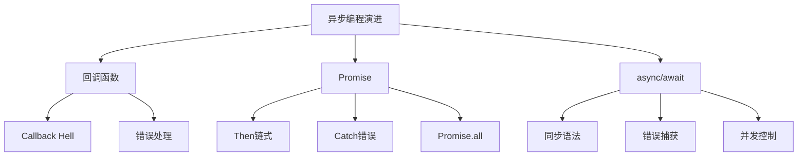
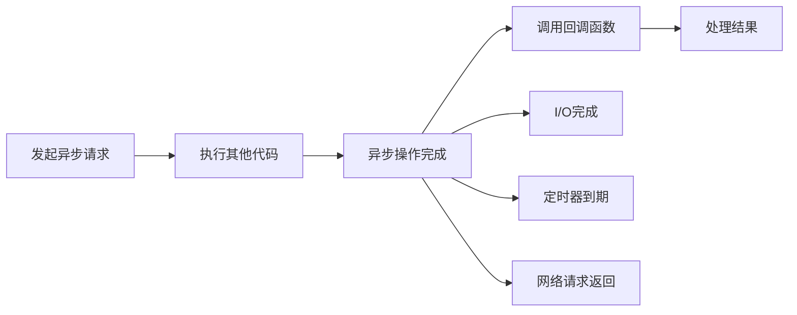

# 异步编程范式



## 📋 知识结构（金字塔模型）

### 🏗️ 基础层：认知（What）
**异步编程的演进历程**

| 阶段 | 技术 | 特点 | 问题 |
|------|------|------|------|
| **第一代** | 回调函数 | 基础异步 | 回调地狱 |
| **第二代** | Promise | 链式调用 | 链式嵌套 |
| **第三代** | async/await | 同步语法 | 误解并发 |

### 🔍 理解层：机制（Why&How）

**回调函数机制：**


**Promise状态转换：**

| 状态 | 描述 | 转换条件 | 不可逆 |
|------|------|----------|--------|
| **pending** | 等待中 | 初始状态 | - |
| **fulfilled** | 成功 | resolve() | ✓ |
| **rejected** | 失败 | reject() | ✓ |

**异步并发模式：**

| 模式 | 描述 | 适用场景 | 语法 |
|------|------|----------|------|
| **顺序执行** | 一个接一个 | 依赖关系 | await |
| **并发执行** | 同时进行 | 独立操作 | Promise.all |
| **竞速执行** | 最快者胜 | 超时处理 | Promise.race |
| **限制并发** | 控制数量 | 资源限制 | 并发库 |

### 🚀 应用层：实践（Apply）

**回调函数实践：**

```javascript
// ❌ 回调地狱示例
fs.readFile('file1.txt', (err1, data1) => {
    if (err1) throw err1;
    fs.readFile('file2.txt', (err2, data2) => {
        if (err2) throw err2;
        fs.writeFile('output.txt', data1 + data2, (err3) => {
            if (err3) throw err3;
            console.log('文件写入完成');
        });
    });
});

// ✅ Promise改写
const fs = require('fs').promises;

fs.readFile('file1.txt')
    .then(data1 => fs.readFile('file2.txt'))
    .then(data2 => {
        const combined = data1 + data2;
        return fs.writeFile('output.txt', combined);
    })
    .then(() => console.log('文件写入完成'))
    .catch(err => console.error('错误:', err));
```

**async/await最佳实践：**

```javascript
// ✅ 错误处理模式
async function fetchUserData(userId) {
    try {
        const user = await fetchUser(userId);
        const profile = await fetchProfile(user.id);
        const preferences = await fetchPreferences(user.id);
        
        return { user, profile, preferences };
    } catch (error) {
        console.error(`获取用户数据失败: ${error.message}`);
        throw error;  // 重新抛出以保持调用栈
    }
}

// ✅ 并发优化
async function fetchDataConcurrent() {
    const [users, posts, comments] = await Promise.all([
        fetchUsers(),
        fetchPosts(),
        fetchComments()
    ]);
    
    return { users, posts, comments };
}

// ✅ 超时控制
async function fetchWithTimeout(url, timeout = 5000) {
    const controller = new AbortController();
    const timeoutId = setTimeout(() => controller.abort(), timeout);
    
    try {
        const response = await fetch(url, { 
            signal: controller.signal 
        });
        clearTimeout(timeoutId);
        return response;
    } catch (error) {
        if (error.name === 'AbortError') {
            throw new Error('请求超时');
        }
        throw error;
    }
}
```

**高级并发模式：**

```javascript
// ✅ 并发限制
class ConcurrencyLimiter {
    constructor(limit) {
        this.limit = limit;
        this.running = 0;
        this.queue = [];
    }
    
    async execute(task) {
        return new Promise((resolve, reject) => {
            this.queue.push({ task, resolve, reject });
            this.tryNext();
        });
    }
    
    tryNext() {
        if (this.running >= this.limit || this.queue.length === 0) {
            return;
        }
        
        const { task, resolve, reject } = this.queue.shift();
        this.running++;
        
        task()
            .then(resolve)
            .catch(reject)
            .finally(() => {
                this.running--;
                this.tryNext();
            });
    }
}

// 使用示例
const limiter = new ConcurrencyLimiter(3);

const tasks = Array.from({ length: 10 }, (_, i) => 
    limiter.execute(async () => {
        await new Promise(resolve => setTimeout(resolve, 1000));
        return `任务 ${i + 1} 完成`;
    })
);

const results = await Promise.all(tasks);
console.log('所有任务完成:', results);
```

## 🧠 费曼学习法：能用简单的话解释

**异步编程核心思想：**
1. **回调函数** = 给任务一个"完成后的通知方式"
2. **Promise** = "保证"将来会给你结果
3. **async/await** = 用同步语法写异步代码

**生活类比：**
- **同步** = 排队买咖啡，必须等前一个人买完
- **异步** = 点咖啡后给个号码，可以去干别的事，咖啡好了会叫号
- **回调** = 咖啡师在咖啡上后按号码叫顾客
- **Promise** = 给顾客一张保证书，承诺会有咖啡

## 🎯 刻意练习要点

**必须掌握的技能：**
- [ ] 理解事件循环与异步的关系
- [ ] 掌握Promise的链式调用
- [ ] 熟练使用async/await语法
- [ ] 学会错误处理和并发控制

**编程练习：**

**1. 异步链式转换**
```javascript
// 练习：将回调改写为async/await
function fetchData(id, callback) {
    setTimeout(() => {
        callback(null, { id, name: `User ${id}` });
    }, 1000);
}

// 改写为Promise
function fetchDataPromise(id) {
    return new Promise((resolve, reject) => {
        setTimeout(() => {
            resolve({ id, name: `User ${id}` });
        }, 1000);
    });
}

// 使用async/await
async function processUsers(userIds) {
    const users = [];
    for (const id of userIds) {
        const user = await fetchDataPromise(id);
        users.push(user);
    }
    return users;
}
```

**2. 并发性能优化**
```javascript
// 练习：批量数据获取
async function fetchUsersData(userIds) {
    // 错误示例：顺序执行
    const users1 = [];
    for (const id of userIds) {
        const user = await fetchUser(id);
        users1.push(user);
    }
    
    // 正确示例：并发执行
    const promises = userIds.map(id => fetchUser(id));
    const users2 = await Promise.all(promises);
    
    return users2;
}
```

**性能测试：**
```javascript
// 性能对比测试
async function performanceTest() {
    const userIds = Array.from({ length: 100 }, (_, i) => i + 1);
    
    // Test 1: Sequential
    console.time('Sequential');
    await users.forEach(async id => await fetchUser(id));
    console.timeEnd('Sequential');
    
    // Test 2: Concurrent
    console.time('Concurrent');
    await Promise.all(fetchPromises);
    console.timeEnd('Concurrent');
}
```

**关联学习：**
- → [[004-事件循环机制]] 异步与事件循环的关系
- → [[008-网络编程基础]] 网络请求异步处理
- → [[009-内置模块总览]] 内置模块的异步API

## 💡 知识点跳转

**前置知识：** [[004-事件循环机制]] - 异步执行基础
**后续深入：** [[007-文件系统操作]] - 文件操作异步模式

---

*🔗 相关链接：[[004-事件循环机制]] | [[007-文件系统操作]] | [[008-网络编程基础]]*
