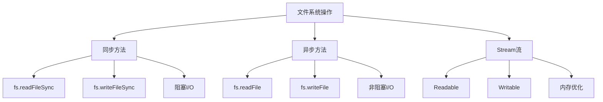
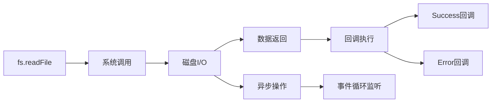

# 文件系统操作



## 📋 知识结构（金字塔模型）

### 🏗️ 基础层：认知（What）
**文件系统的作用：**
- 文件的读取和写入
- 目录操作和权限管理
- 文件监控和同步

**Node.js文件操作方式：**

| 操作类型 | 方法 | 特点 | 使用场景 |
|----------|------|------|----------|
| **同步读写** | Sync方法 | 阻塞执行 | 启动配置 |
| **异步读写** | 回调/Promise | 非阻塞 | 生产环境 |
| **流操作** | Stream | 内存友好 | 大文件处理 |
| **文件监控** | Watch API | 实时变化 | 热重载 |

### 🔍 理解层：机制（Why&How）

**文件读取机制：**



**Stream工作机制：**

| Stream类型 | 用途 | 方法 | 事件 |
|------------|------|------|------|
| **Readable** | 读取 | pipe(), read() | 'data', 'end' |
| **Writable** | 写入 | write(), end() | 'drain', 'finish' |
| **Duplex** | 双向 | read() + write() | 继承两者 |
| **Transform** | 转换 | _transform() | 中间处理 |

**文件权限机制：**

| 权限 | 数字 | 字符 | 含义 |
|------|------|------|------|
| **Read** | 4 | r | 读取权限 |
| **Write** | 2 | w | 写入权限 |
| **Execute** | 1 | x | 执行权限 |
| **All** | 7 | rwx | 全部权限 |

### 🚀 应用层：实践（Apply）

**基本文件操作：**

```javascript
const fs = require('fs').promises;

// ✅ 异步文件读取（推荐）
async function readConfigFile(filepath) {
  try {
    const data = await fs.readFile(filepath, 'utf8');
    return JSON.parse(data);
  } catch (error) {
    console.error(`读取配置文件失败: ${error.message}`);
    return null;
  }
}

// ✅ 异步文件写入
async function writeLogFile(filename, content) {
  const timestamp = new Date().toISOString();
  const logEntry = `[${timestamp}] ${content}\n`;
  
  try {
    await fs.appendFile(filename, logEntry);
    console.log('日志写入成功');
  } catch (error) {
    console.error(`日志写入失败: ${error.message}`);
  }
}
```

**Stream流处理：**

```javascript
const fs = require('fs');

// ✅ 大文件复制（内存友好）
function copyLargeFile(inputPath, outputPath) {
  return new Promise((resolve, reject) => {
    const readStream = fs.createReadStream(inputPath);
    const writeStream = fs.createWriteStream(outputPath);
    
    readStream
      .on('error', reject)
      .pipe(writeStream)
      .on('error', reject)
      .on('finish', () => {
        console.log('文件复制完成');
        resolve();
      });
  });
}

// ✅ 文件转换（Transform流）
const { Transform } = require('stream');

class UpperCaseTransform extends Transform {
  _transform(chunk, encoding, callback) {
    callback(null, chunk.toString().toUpperCase());
  }
}

function processFile(inputPath, outputPath) {
  const readStream = fs.createReadStream(inputPath, { encoding: 'utf8' });
  const writeStream = fs.createWriteStream(outputPath);
  const uppercaseTransform = new UpperCaseTransform();
  
  readStream
    .pipe(uppercaseTransform)
    .pipe(writeStream)
    .on('finish', () => console.log('文件转换完成'));
}
```

**目录操作实践：**

```javascript
// ✅ 递归创建目录
async function ensureDirectoryExists(dirPath) {
  try {
    await fs.mkdir(dirPath, { recursive: true });
    console.log('目录创建成功');
  } catch (error) {
    if (error.code !== 'EEXIST') {
      console.error(`目录创建失败: ${error.message}`);
    }
  }
}

// ✅ 批量文件操作
async function processDirectory(dirPath, operation) {
  try {
    const files = await fs.readdir(dirPath);
    const promises = files.map(file => 
      operation(path.join(dirPath, file))
    );
    await Promise.all(promises);
    console.log('批量操作完成');
  } catch (error) {
    console.error(`目录处理失败: ${error.message}`);
  }
}
```

**文件监控系统：**

```javascript
class FileWatcher {
  constructor(filePath, callback) {
    this.filePath = filePath;
    this.callback = callback;
    this.watcher = null;
  }
  
  start() {
    this.watcher = fs.watch(this.filePath, (eventType, filename) => {
      if (eventType === 'change') {
        console.log(`文件 ${filename} 发生变化`);
        this.callback(this.filePath);
      }
    });
    
    console.log(`开始监听文件: ${this.filePath}`);
  }
  
  stop() {
    if (this.watcher) {
      this.watcher.close();
      console.log('停止文件监听');
    }
  }
}

// 使用示例
const watcher = new FileWatcher('./config.json', async (filepath) => {
  console.log('配置文件已更新，重新加载...');
  // 重载配置逻辑
});
watcher.start();
```

## 🧠 费曼学习法：能用简单的话解释

**文件系统核心概念：**
1. **同步** = 排队取钱，必须等柜台处理完
2. **异步** = 网上银行转账，提交后可以做其他事
3. **Stream** = 水管输水，不用等整桶水装满再倒

**安全最佳实践：**
```javascript
// ✅ 路径安全处理
const path = require('path');

function safeFilePath(userInput) {
  // 规范路径，防止目录遍历攻击
  const safePath = path.join(__dirname, 'uploads', path.basename(userInput));
  
  // 确保路径在安全目录内
  if (!safePath.startsWith(__dirname)) {
    throw new Error('非法路径');
  }
  
  return safePath;
}

// ✅ 文件大小限制
function validateFileSize(fileSize, maxSize = 10 * 1024 * 1024) { // 10MB
  if (fileSize > maxSize) {
    throw new Error('文件过大');
  }
}
```

## 🎯 刻意练习要点

**必须掌握的技能：**
- [ ] 熟练使用异步文件操作方法
- [ ] 掌握Stream流的使用场景
- [ ] 学会文件权限和安全处理
- [ ] 理解文件监控的实际应用

**编程练习：**

**1. 文件管理工具**
```javascript
// 练习：实现简易文件管理器
class FileManager {
  static async copyFile(source, dest) {
    await fs.copyFile(source, dest);
    console.log(`文件复制: ${source} -> ${dest}`);
  }
  
  static async moveFile(source, dest) {
    await fs.rename(source, dest);
    console.log(`文件移动: ${source} -> ${dest}`);
  }
  
  static async getFileStats(filepath) {
    const stats = await fs.stat(filepath);
    return {
      size: stats.size,
      modifiedTime: stats.mtime,
      isDirectory: stats.isDirectory()
    };
  }
}
```

**2. 日志轮转系统**
```javascript
// 练习：实现自动日志轮转
class LogRotator {
  constructor(logDir, maxSize = 1024 * 1024) {
    this.logDir = logDir;
    this.maxSize = maxSize;
  }
  
  async checkAndRotate(logFile) {
    const stats = await fs.stat(logFile);
    if (stats.size > this.maxSize) {
      const timestamp = new Date().toISOString().replace(/[:.]/g, '-');
      const rotatedFile = path.join(this.logDir, `app.${timestamp}.log`);
      
      await fs.rename(logFile, rotatedFile);
      await fs.writeFile(logFile, '');
      
      console.log(`日志轮转成功: ${rotatedFile}`);
    }
  }
}
```

**性能优化：**

```javascript
// ✅ 文件处理性能优化
async function optimizeFileProcessing(filePaths) {
  // 使用Stream避免大文件内存问题
  const promises = filePaths.map(filePath => {
    return new Promise((resolve, reject) => {
      let lineCount = 0;
      fs.createReadStream(filePath, { encoding: 'utf8' })
        .on('data', chunk => {
          lineCount += (chunk.match(/\n/g) || []).length;
        })
        .on('end', () => resolve({ filePath, lineCount }))
        .on('error', reject);
    });
  });
  
  const results = await Promise.all(promises);
  return results;
}
```

**关联学习：**
- → [[006-异步编程范式]] 异步文件操作模式
- → [[009-内置模块总览]] fs模块详细API
- → [[029-Stream源码剖析]] Stream底层机制

## 💡 知识点跳转

**前置知识：** [[006-异步编程范式]] - 异步编程基础
**后续深入：** [[009-内置模块总览]] - fs模块详细API

---

*🔗 相关链接：[[006-异步编程范式]] | [[009-内置模块总览]] | [[029-Stream源码剖析]]*
