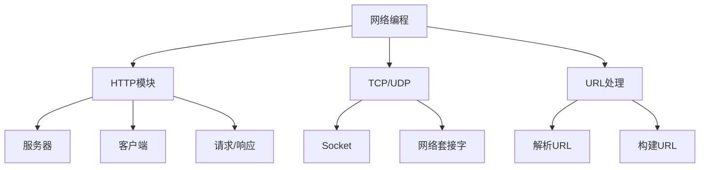
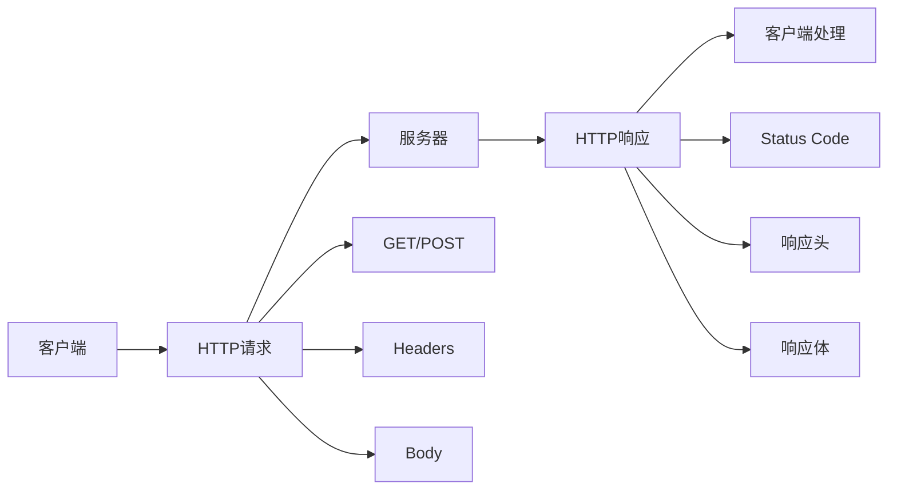

# 网络编程基础



## 📋 知识结构（金字塔模型）

### 🏗️ 基础层：认知（What）
**网络编程的核心概念**

| 协议 | 层级 | 特点 | 用途 |
|------|------|------|------|
| **HTTP** | 应用层 | 无状态、请求响应 | Web通信 |
| **HTTPS** | 安全传输 | HTTP + SSL/TLS | 安全Web通信 |
| **TCP** | 传输层 | 可靠连接 | 数据传输 |
| **UDP** | 传输层 | 无连接 | 实时通信 |

### 🔍 理解层：机制（Why&How）

**HTTP请求响应模型：**


**TCP vs UDP对比：**

| 特性 | TCP | UDP |
|------|-----|-----|
| **连接性** | 面向连接 | 无连接 |
| **可靠性** | 保证送达 | 尽力送达 |
| **顺序性** | 保持顺序 | 不保证顺序 |
| **开销** | 较高 | 较低 |
| **适用** | Web、邮件 | 视频、游戏 |

### 🚀 应用层：实践（Apply）

**HTTP服务器实现：**

```javascript
const http = require('http');

// ✅ 基础HTTP服务器
const server = http.createServer(async (req, res) => {
  const url = new URL(req.url, `http://${req.headers.host}`);
  const method = req.method;
  
  // 设置CORS头
  res.setHeader('Access-Control-Allow-Origin', '*');
  res.setHeader('Content-Type', 'application/json');
  
  try {
    switch (true) {
      case method === 'GET' && url.pathname === '/api/users':
        const users = await fetchUsers();
        res.statusCode = 200;
        res.end(JSON.stringify(users));
        break;
        
      case method === 'POST' && url.pathname === '/api/users':
        let body = '';
        req.on('data', chunk => body += chunk);
        req.on('end', async () => {
          const newUser = JSON.parse(body);
          const created = await createUser(newUser);
          res.statusCode = 201;
          res.end(JSON.stringify(created));
        });
        break;
        
      default:
        res.statusCode = 404;
        res.end(JSON.stringify({ error: 'Not Found' }));
    }
  } catch (err) {
    res.statusCode = 500;
    res.end(JSON.stringify({ error: err.message }));
  }
});

server.listen(3000, () => {
  console.log('HTTP服务器运行在端口3000');
});
```

**HTTP客户端实现：**

```javascript
const https = require('https');
const http = require('http');

// ✅ 通用HTTP客户端
class HttpClient {
  static request(options, postData = null) {
    return new Promise((resolve, reject) => {
      const isHttps = options.protocol === 'https:';
      const client = isHttps ? https : http;
      
      const req = client.request(options, (res) => {
        let data = '';
        
        res.on('data', chunk => data += chunk);
        res.on('end', () => {
          resolve({
            statusCode: res.statusCode,
            headers: res.headers,
            data: data
          });
        });
      });
      
      req.on('error', reject);
      
      if (postData) {
        req.write(postData);
      }
      
      req.end();
    });
  }
  
  static async get(url, options = {}) {
    const urlObj = new URL(url);
    const requestOptions = {
      hostname: urlObj.hostname,
      port: urlObj.port || (urlObj.protocol === 'https:' ? 443 : 80),
      path: urlObj.pathname + urlObj.search,
      method: 'GET',
      headers: {
        'User-Agent': 'Node.js HTTP Client',
        ...options.headers
      }
    };
    
    return HttpClient.request(requestOptions);
  }
  
  static async post(url, data, options = {}) {
    const urlObj = new URL(url);
    const postData = JSON.stringify(data);
    
    const requestOptions = {
      hostname: urlObj.hostname,
      port: urlObj.port || (urlObj.protocol === 'https:' ? 443 : 80),
      path: urlObj.pathname + urlObj.search,
      method: 'POST',
      headers: {
        'Content-Type': 'application/json',
        'Content-Length': Buffer.byteLength(postData),
        ...options.headers
      }
    };
    
    return HttpClient.request(requestOptions, postData);
  }
}
```

**URL处理实例：**

```javascript
const { URL } = require('url');

// ✅ URL解析和构建
class UrlHelper {
  static parseUrl(urlString) {
    try {
      const url = new URL(urlString);
      return {
        protocol: url.protocol,
        hostname: url.hostname,
        port: url.port,
        pathname: url.pathname,
        search: url.search,
        searchParams: Object.fromEntries(url.searchParams),
        hash: url.hash
      };
    } catch (err) {
      console.error('URL解析失败:', err.message);
      return null;
    }
  }
  
  static buildUrl(options) {
    const { protocol, hostname, port, pathname, params = {} } = options;
    const url = new URL(pathname, `${protocol}//${hostname}:${port}`);
    
    Object.entries(params).forEach(([key, value]) => {
      url.searchParams.set(key, value);
    });
    
    return url.toString();
  }
  
  // 验证URL格式
  static isValidUrl(urlString) {
    try {
      new URL(urlString);
      return true;
    } catch {
      return false;
    }
  }
}
```

**TCP Socket通信：**

```javascript
const net = require('net');

// ✅ TCP服务器
const tcpServer = net.createServer((socket) => {
  console.log('客户端连接:', socket.remoteAddress, socket.remotePort);
  
  socket.on('data', (data) => {
    console.log('收到数据:', data.toString());
    
    // 回显数据
    socket.write('Echo: ' + data);
  });
  
  socket.on('close', () => {
    console.log('客户端断开连接');
  });
  
  socket.on('error', (err) => {
    console.error('Socket错误:', err.message);
  });
});

const PORT = 8080;
tcpServer.listen(PORT, () => {
  console.log(`TCP服务器监听端口 ${PORT}`);
});

// ✅ TCP客户端
function createTcpClient(port = 8080) {
  const client = new net.Socket();
  
  client.connect(port, 'localhost', () => {
    console.log('连接到TCP服务器');
    client.write('Hello TCP Server!');
  });
  
  client.on('data', (data) => {
    console.log('服务器响应:', data.toString());
    client.destroy(); // 关闭连接
  });
  
  client.on('close', () => {
    console.log('连接已关闭');
  });
  
  client.on('error', (err) => {
    console.error('客户端错误:', err.message);
  });
  
  return client;
}
```

## 🧠 费曼学习法：能用简单的话解释

**网络编程核心思想：**
1. **HTTP** = 邮递员送信，有信封（Headers）和信件（Body）
2. **TCP** = 电话对话，必须是双方同时在线且对话有序
3. **UDP** = 广播通知，只管发送不管是否收到

**请求响应流程：**
```
客户端请求 → 服务器处理 → 服务器响应 → 客户端处理结果
     ↓              ↓              ↓             ↓
  建立连接        业务逻辑        生成响应      更新界面
```

**关键理解：**
- 网络通信是异步的，需要事件监听
- 数据可以是文本、二进制或JSON格式
- 错误处理是网络编程的重要部分

## 🎯 刻意练习要点

**必须掌握的技能：**
- [ ] 能够创建HTTP服务器和客户端
- [ ] 掌握URL处理和数据解析
- [ ] 理解请求/响应生命周期
- [ ] 学会错误处理和超时控制

**编程练习：**

**1. RESTful API实现**
```javascript
// 练习：实现简单的REST API
const api = {
  async getResource(id = null) {
    if (id) {
      // GET /api/resource/:id
      return await findById(id);
    } else {
      // GET /api/resource
      return await findAll();
    }
  },
  
  async createResource(data) {
    // POST /api/resource
    validateData(data);
    return await save(data);
  },
  
  async updateResource(id, data) {
    // PUT /api/resource/:id
    const existing = await findById(id);
    if (!existing) throw new Error('Resource not found');
    return await save({ ...existing, ...data });
  },
  
  async deleteResource(id) {
    // DELETE /api/resource/:id
    const existing = await findById(id);
    if (!existing) throw new Error('Resource not found');
    await remove(id);
    return { message: 'Resource deleted' };
  }
};
```

**2. 超时和重试机制**
```javascript
// 练习：实现带重试的HTTP请求
async function fetchWithRetry(url, options = {}, maxRetries = 3) {
  let lastError;
  
  for (let i = 0; i <= maxRetries; i++) {
    try {
      // 添加超时设置
      const timeoutOptions = {
        ...options,
        timeout: 5000 // 5秒超时
      };
      
      const response = await HttpClient.get(url, timeoutOptions);
      
      if (response.statusCode >= 200 && response.statusCode < 300) {
        return response;
      }
      
      throw new Error(`HTTP ${response.statusCode}`);
    } catch (error) {
      lastError = error;
      console.log(`重试 ${i + 1}/${maxRetries + 1}: ${error.message}`);
      
      if (i < maxRetries) {
        // 指数退避
        const delay = Math.pow(2, i) * 1000;
        await new Promise(resolve => setTimeout(resolve, delay));
      }
    }
  }
  
  throw lastError;
}
```

**性能优化：**
```javascript
// ✅ 连接池管理
class ConnectionPool {
  constructor(maxConnections = 10) {
    this.maxConnections = maxConnections;
    this.activeConnections = 0;
    this.waitingQueue = [];
  }
  
  async acquire() {
    if (this.activeConnections < this.maxConnections) {
      this.activeConnections++;
      return this.createConnection();
    } else {
      return new Promise((resolve) => {
        this.waitingQueue.push(resolve);
      });
    }
  }
  
  release(connection) {
    if (this.waitingQueue.length > 0) {
      const resolve = this.waitingQueue.shift();
      resolve(this.createConnection());
    } else {
      this.activeConnections--;
      connection.destroy();
    }
  }
}
```

**关联学习：**
- → [[015-Express核心机制]] HTTP服务器的框架
- → [[025-实时通信技术]] WebSocket和SSE
- → [[032-全栈博客系统]] 实际网络应用开发

## 💡 知识点跳转

**前置知识：** [[006-异步编程范式]] - 异步编程基础
**后续深入：** [[015-Express核心机制]] - HTTP框架核心机制

---

*🔗 相关链接：[[006-异步编程范式]] | [[015-Express核心机制]] | [[025-实时通信技术]]*
