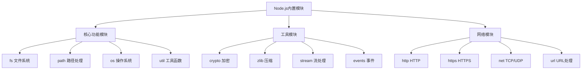
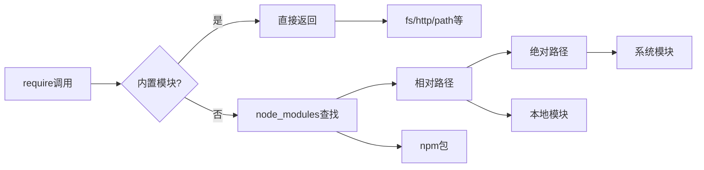

# 内置模块总览



## 📋 知识结构（金字塔模型）

### 🏗️ 基础层：认知（What）
**内置模块的分类和特点**

| 分类 | 数量 | 特点 | 加载方式 |
|------|------|------|----------|
| **核心模块** | 40+ | 无需安装 | require('module') |
| **C++模块** | 20+ | 性能优先 | 原生调用 |
| **工具模块** | 15+ | 功能丰富 | JavaScript实现 |
| **实验模块** | 10+ | 新功能 | require('module') |

### 🔍 理解层：机制（Why&How）

**模块优先级系统：**



**高频内置模块使用统计：**

| 模块 | 使用频率 | 主要用途 | 核心API |
|------|----------|----------|---------|
| **fs** | ★★★★★ | 文件操作 | readFile, writeFile |
| **path** | ★★★★★ | 路径处理 | join, resolve |
| **http** | ★★★★☆ | Web服务 | createServer |
| **util** | ★★★★☆ | 工具函数 | promisify |
| **events** | ★★★☆☆ | 事件处理 | EventEmitter |

### 🚀 应用层：实践（Apply）

**核心模块最佳实践：**

**1. fs文件系统模块**
```javascript
const fs = require('fs').promises;
const path = require('path');

// ✅ 安全的文件操作类
class FileService {
  constructor(baseDir) {
    this.baseDir = baseDir;
    this.safeBaseDir = path.resolve(baseDir);
  }
  
  async readTextFile(relativePath) {
    const safePath = this._getSafePath(relativePath);
    return await fs.readFile(safePath, 'utf8');
  }
  
  async writeTextFile(relativePath, content) {
    const safePath = this._getSafePath(relativePath);
    const dir = path.dirname(safePath);
    
    // 确保目录存在
    await fs.mkdir(dir, { recursive: true });
    await fs.writeFile(safePath, content, 'utf8');
  }
  
  _getSafePath(relativePath) {
    const fullPath = path.resolve(this.safeBaseDir, relativePath);
    
    // 安全检查：防止目录遍历攻击
    if (!fullPath.startsWith(this.safeBaseDir)) {
      throw new Error('非法路径访问');
    }
    
    return fullPath;
  }
}
```

**2. path路径处理模块**
```javascript
// ✅ 跨平台路径处理
class PathHelper {
  static normalize(filePath) {
    return path.normalize(filePath);
  }
  
  static resolve(...paths) {
    return path.resolve(...paths);
  }
  
  static getSafeFilename(filename) {
    // 移除不安全字符
    return filename.replace(/[<>:"/\\|?*]/g, '_');
  }
  
  static isSubPath(parent, child) {
    const relative = path.relative(parent, child);
    return !relative.startsWith('..') && !path.isAbsolute(relative);
  }
  
  static createDirectoryTree(dirPath) {
    const parts = dirPath.split(path.sep);
    let current = '';
    
    for (const part of parts) {
      current = path.join(current, part);
      if (!fs.existsSync(current)) {
        fs.mkdirSync(current);
      }
    }
  }
}
```

**3. util工具模块**
```javascript
const util = require('util');

// ✅ Promise化工具类
class Asyncify {
  static promisify(func) {
    return util.pformat(func);
  }
  
  static async toPromise(callbackFunction, ...args) {
    return new Promise((resolve, reject) => {
      callbackFunction(...args, (err, result) => {
        if (err) reject(err);
        else resolve(result);
      });
    });
  }
  
  static inspectDeep(obj, options = {}) {
    return util.inspect(obj, {
      depth: null,
      colors: true,
      showHidden: false,
      ...options
    });
  }
}

// ✅ 调试工具类  
class DebugHelper {
  static logObject(name, obj) {
    console.log(`\n${name}:`);
    console.log(util.inspect(obj, { 
      depth: 3, 
      colors: true 
    }));
  }
  
  static logError(error) {
    console.error('Error Stack:');
    console.error(error.stack);
    
    if (error.code) {
      console.error(`Error Code: ${error.code}`);
    }
    
    if (error.errno) {
      console.error(`System Errno: ${error.errno}`);
    }
  }
}
```

**4. crypto加密模块**
```javascript
const crypto = require('crypto');

// ✅ 安全加密工具类
class CryptoService {
  constructor(secretKey) {
    this.secretKey = Buffer.from(secretKey, 'utf8');
  }
  
  // 密码哈希
  async hashPassword(password, salt = null) {
    const actualSalt = salt || crypto.randomBytes(16);
    const hash = await crypto.scrypt(password, actualSalt, 64);
    
    return {
      hash: hash.toString('hex'),
      salt: actualSalt.toString('hex')
    };
  }
  
  // 验证密码
  async verifyPassword(password, hash, salt) {
    const testHash = await this.hashPassword(password, Buffer.from(salt, 'hex'));
    return testHash.hash === hash;
  }
  
  // 加密数据
  encrypt(text) {
    const iv = crypto.randomBytes(16);
    const cipher = crypto.createCipher('aes-256-gcm', this.secretKey);
    
    let encrypted = cipher.update(text, 'utf8', 'hex');
    encrypted += cipher.final('hex');
    
    const authTag = cipher.getAuthTag();
    
    return {
      iv: iv.toString('hex'),
      encrypted: encrypted,
      authTag: authTag.toString('hex')
    };
  }
  
  // 解密数据
  decrypt(encryptedData) {
    const decipher = crypto.createDecipher('aes-256-gcm', this.secretKey);
    
    decipher.setAuthTag(Buffer.from(encryptedData.authTag, 'hex'));
    
    let decrypted = decipher.update(encryptedData.encrypted, 'hex', 'utf8');
    decrypted += decipher.final('utf8');
    
    return decrypted;
  }
}
```

**5. os系统信息模块**
```javascript
const os = require('os');

// ✅ 系统监控类
class SystemMonitor {
  static getCpuInfo() {
    return {
      architecture: os.arch(),
      platform: os.platform(),
      release: os.release(),
      cpus: os.cpus().length,
      cpuModel: os.cpus()[0].model
    };
  }
  
  static getMemoryInfo() {
    return {
      total: os.totalmem(),
      free: os.freemem(),
      used: os.totalmem() - os.freemem(),
      usedPercent: ((os.totalmem() - os.freemem()) / os.totalmem() * 100).toFixed(2)
    };
  }
  
  static getNetworkInfo() {
    const interfaces = os.networkInterfaces();
    const result = {};
    
    for (const [name, addrs] of Object.entries(interfaces)) {
      result[name] = addrs.map(addr => ({
        address: addr.address,
        family: addr.family,
        internal: addr.internal
      }));
    }
    
    return result;
  }
  
  static getSystemUptime() {
    return {
      uptime: os.uptime(),
      uptimeFormatted: formatUptime(os.uptime())
    };
  }
}

function formatUptime(seconds) {
  const days = Math.floor(seconds / 86400);
  const hours = Math.floor((seconds % 86400) / 3600);
  const minutes = Math.floor((seconds % 3600) / 60);
  
  return `${days}天 ${hours}小时 ${minutes}分钟`;
}
```

## 🧠 费曼学习法：能用简单的话解释

**内置模块核心思想：**
1. **内置模块** = 手机的默认应用，拿来就用，不用下载
2. **模块系统** = 工具箱分类，每个工具都有自己的用途
3. **跨平台** = 同样的代码在不同系统都能工作

**使用原则：**
```javascript
// ✅ 好的做法
const path = require('path');              // 按需加载
const filename = path.join(dir, file);      // 跨平台路径

// ❌ 避免的做法
const nodeModules = 'node_modules';        // 硬编码路径
const winPath = 'C:\\Users\\...';          // 平台特定路径
```

## 🎯 刻意练习要点

**必须掌握的技能：**
- [ ] 熟练使用高频内置模块的API
- [ ] 理解模块间的关系和依赖
- [ ] 掌握跨平台兼容的处理方法
- [ ] 学会模块的性能优化和安全使用

**编程练习：**

**1. 模块使用统计工具**
```javascript
// 练习：分析项目中的模块使用
class ModuleAnalyzer {
  static analyzeProject(projectPath) {
    const fs = require('fs');
    const path = require('path');
    
    function scanDirectory(dir) {
      const files = fs.readdirSync(dir);
      const modules = new Set();
      
      files.forEach(file => {
        const filePath = path.join(dir, file);
        const stat = fs.statSync(filePath);
        
        if (stat.isDirectory() && file !== 'node_modules') {
          scanDirectory(filePath).forEach(mod => modules.add(mod));
        } else if (file.endsWith('.js')) {
          scanFile(filePath).forEach(mod => modules.add(mod));
        }
      });
      
      return modules;
    }
    
    function scanFile(filePath) {
      const content = fs.readFileSync(filePath, 'utf8');
      const modules = [];
      
      // 查找 require 语句
      const requireRegex = /require\(['"]([^'"]+)['"]\)/g;
      let match;
      
      while ((match = requireRegex.exec(content)) !== null) {
        const moduleName = match[1];
        
        // 跳过相对路径
        if (!moduleName.startsWith('.')) {
          modules.push(moduleName);
        }
      }
      
      return modules;
    }
    
    return scanDirectory(projectPath);
  }
}
```

**2. 性能监控工具**
```javascript
// 练习：监控内置模块使用性能
const { performance } = require('perf_hooks');

class ModuleProfiler {
  static async profileModule(moduleName, operation) {
    const start = performance.now();
    const end = performance.now();
    const duration = (end - start).toFixed(2);
    
    console.log(`${moduleName} 执行耗时: ${duration}ms`);
    return duration;
  }
  
  static monitorMemory() {
    const used = process.memoryUsage();
    const memoryInfo = {
      heapUsed: Math.round(used.heapUsed / 1024 / 1024) + ' MB',
      heapTotal: Math.round(used.heapTotal / 1024 / 1024) + ' MB',
      external: Math.round(used.external / 1024 / 1024) + ' MB',
      rss: Math.round(used.rss / 1024 / 1024) + ' MB'
    };
    
    console.table(memoryInfo);
    return memoryInfo;
  }
}

// 使用示例
setInterval(() => {
  ModuleProfiler.monitorMemory();
}, 5000);
```

**关联学习：**
- → [[007-文件系统操作]] fs模块详细应用
- → [[008-网络编程基础]] http/https/net模块详解
- → [[010-错误处理机制]] 内置模块的错误处理

## 💡 知识点跳转

**前置知识：** [[005-模块系统详解]] - 模块加载机制
**后续深入：** [[010-错误处理机制]] - 错误处理模式

---

*🔗 相关链接：[[005-模块系统详解]] | [[007-文件系统操作]] | [[010-错误处理机制]]*
