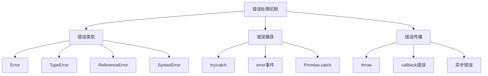
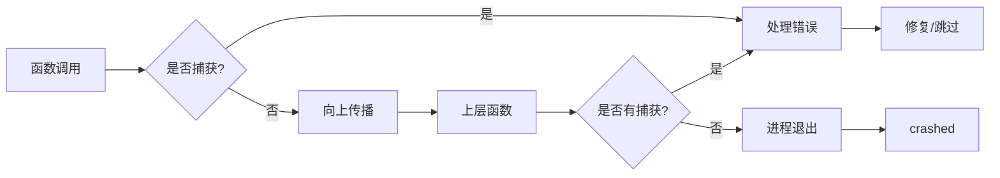

# 错误处理机制



## 📋 知识结构（金字塔模型）

### 🏗️ 基础层：认知（What）
**Node.js错误类型体系**

| 错误类型 | 分类 | 产生原因 | 处理方法 |
|----------|------|----------|----------|
| **Error** | 基础 | 通用错误 | 通用处理 |
| **TypeError** | 类型错误 | 类型不匹配 | 类型检查 |
| **ReferenceError** | 引用错误 | 未定义变量 | 声明检查 |
| **SyntaxError** | 语法错误 | 语法问题 | 语法修复 |
| **Runtime Error** | 运行时错误 | 执行异常 | 异常处理 |

### 🔍 理解层：机制（Why&How）

**错误传播机制：**



**异步错误处理对比：**

| 异步模式 | 错误处理方式 | 优势 | 劣势 |
|----------|-------------|------|------|
| **回调函数** | error-first | 简单直接 | 回调地狱 |
| **Promise** | catch() | 链式处理 | 可能丢失 |
| **async/await** | try/catch | 同步语法 | 需要包装 |

**错误处理最佳实践：**

| 场景 | 推荐方法 | 原因 | 示例 |
|------|----------|------|------|
| **同步代码** | try/catch | 直接捕获 | try { operation(); } |
| **Promise链** | catch() | 链式处理 | promise.then().catch() |
| **async函数** | try/catch | 同步语法 | try { await op(); } |
| **事件监听** | error事件 | 单独处理 | emitter.on('error') |

### 🚀 应用层：实践（Apply）

**错误处理工具类：**

```javascript
// ✅ 统一错误处理类
class ErrorHandler {
  constructor(logger) {
    this.logger = logger;
  }
  
  // 创建标准化错误
  static createError(type, message, errorCode, metadata = {}) {
    const error = new Error(message);
    error.type = type || 'Unknown';
    error.code = errorCode || 'UNKNOWN_ERROR';
    error.metadata = metadata;
    error.timestamp = new Date().toISOString();
    
    return error;
  }
  
  // 业务错误类型
  static ValidationError(message, field = null) {
    return ErrorHandler.createError('Validation', message, 'VALIDATION_ERROR', { field });
  }
  
  static NotFoundError(resource = 'Resource') {
    return ErrorHandler.createError('Not Found', `${resource} not found`, 'NOT_FOUND');
  }
  
  static PermissionError(action = 'Access') {
    return ErrorHandler.createError('Permission', `${action} denied`, 'PERMISSION_DENIED');
  }
  
  // 异步操作包装器
  static async wrapAsync(asyncFunction) {
    try {
      return await asyncFunction();
    } catch (error) {
      throw ErrorHandler.normalizeError(error);
    }
  }
  
  // 规范化错误对象
  static normalizeError(error) {
    if (error instanceof Error) {
      return error;
    }
    
    if (typeof error === 'string') {
      return ErrorHandler.createError('Unknown', error);
    }
    
    return ErrorHandler.createError('Unknown', 'An unexpected error occurred');
  }
}
```

**回调函数错误处理：**

```javascript
// ✅ 错误优先回调处理
function asyncOperation(data, callback) {
  // 输入验证
  if (!data) {
    const error = ErrorHandler.ValidationError('Data is required');
    return callback(error);
  }
  
  // 异步操作
  setImmediate(() => {
    try {
      // 可能的错误操作
      const result = processData(data);
      callback(null, result);
    } catch (err) {
      // 捕获同步错误
      callback(ErrorHandler.normalizeError(err));
    }
  });
}

// ✅ 使用Promise包装回调
function promisifyCallback(asyncFunction) {
  return function(...args) {
    return new Promise((resolve, reject) => {
      asyncFunction.call(this, ...args, (error, result) => {
        if (error) {
          reject(ErrorHandler.normalizeError(error));
        } else {
          resolve(result);
        }
      });
    });
  };
}
```

**Promise错误处理策略：**

```javascript
// ✅ Promise错误处理模式
class AsyncService {
  async processData(data) {
    try {
      // 验证数据
      this.validateData(data);
      
      // 并发处理
      const [result1, result2, result3] = await Promise.allSettled([
        this.stepOne(data),
        this.stepTwo(data),
        this.stepThree(data)
      ]);
      
      // 检查结果
      const errors = [result1, result2, result3]
        .filter(result => result.status === 'rejected')
        .map(result => result.reason);
      
      if (errors.length > 0) {
        console.warn('部分操作失败:', errors);
      }
      
      const successes = [result1, result2, result3]
        .filter(result => result.status === 'fulfilled')
        .map(result => result.value);
      
      return this.combineResults(successes);
      
    } catch (error) {
      // 错误分类处理
      if (error.type === 'Validation') {
        throw error; // 重新抛出验证错误
      }
      
      if (error.code === 'ECONNREFUSED') {
        throw ErrorHandler.createError('Network', 'Service unavailable', 'SERVICE_UNAVAILABLE');
      }
      
      // 记录未预期错误
      this.logger.error('Unexpected error:', error);
      throw ErrorHandler.createError('System', 'Internal server error', 'INTERNAL_ERROR');
    }
  }
  
  validateData(data) {
    if (!data || typeof data !== 'object') {
      throw ErrorHandler.ValidationError('Invalid data format');
    }
    
    if (!data.id || typeof data.id !== 'string') {
      throw ErrorHandler.ValidationError('Missing or invalid id field', 'id');
    }
  }
}
```

**全局错误处理：**

```javascript
// ✅ 应用程序级错误处理
class ApplicationErrorHandler {
  constructor(app) {
    this.app = app;
    this.setupErrorHandling();
  }
  
  setupErrorHandling() {
    // 捕获未处理的Promise拒绝
    process.on('unhandledRejection', (reason, promise) => {
      console.error('Unhandled Promise Rejection:', reason);
      this.logError('unhandledRejection', reason);
    });
    
    // 捕获未处理的异常
    process.on('uncaughtException', (error) => {
      console.error('Uncaught Exception:', error);
      this.logError('uncaughtException', error);
      
      // 优雅关闭
      this.shutdown();
    });
    
    // Express错误中间件
    this.app.use((error, req, res, next) => {
      this.handleExpressError(error, req, res, next);
    });
  }
  
  handleExpressError(error, req, res, next) {
    // 记录错误
    this.logError('express', error, { 
      url: req.url, 
      method: req.method,
      userAgent: req.get('User-Agent')
    });
    
    // 确定响应状态码
    const statusCode = this.getStatusCode(error);
    
    // 生产环境：显示简化错误信息
    const message = process.env.NODE_ENV === 'production' 
      ? 'Internal Server Error'
      : error.message;
    
    // 发送响应
    res.status(statusCode).json({
      error: message,
      code: error.code || 'UNKNOWN_ERROR',
      ...(process.env.NODE_ENV !== 'production' && {
        stack: error.stack,
        metadata: error.metadata
      })
    });
  }
  
  getStatusCode(error) {
    if (error.type === 'Validation') return 400;
    if (error.type === 'Not Found') return 404;
    if (error.type === 'Permission') return 403;
    if (error.type === 'Authentication') return 401;
    return 500;
  }
  
  logError(source, error, context = {}) {
    const logData = {
      timestamp: new Date().toISOString(),
      source,
      message: error.message,
      stack: error.stack,
      type: error.type,
      code: error.code,
      context
    };
    
    // 写入日志或发送到监控服务
    console.log('Logged Error:', JSON.stringify(logData, null, 2));
  }
  
  shutdown() {
    console.log('Shutting down gracefully...');
    
    // 关闭服务器连接
    if (this.app.server) {
      this.app.server.close(() => {
        console.log('Server connections closed');
        process.exit(1);
      });
    } else {
      process.exit(1);
    }
  }
}
```

## 🧠 费曼学习法：能用简单的话解释

**错误处理核心思想：**
1. **错误** = 程序的意外情况，需要被捕获和处理
2. **错误类型** = 不同的错误有不同的处理方式
3. **错误传播** = 错误会向上传递，直到被捕获

**错误处理原则：**
```javascript
// ✅ 好的错误处理
try {
  const result = await riskyOperation();
  return result;
} catch (error) {
  logger.error('操作失败:', error);
  throw new Error(`用户友好的错误信息: ${error.message}`);
}

// ❌ 避免的错误处理
riskyOperation().catch(error => {
  // 错误被吞掉，无法追踪
});
```

**关键理解：**
- 错误处理是程序稳定性的关键
- 不同类型的错误需要不同的处理策略
- 未处理的错误会导致程序崩溃

## 🎯 刻意练习要点

**必须掌握的技能：**
- [ ] 区分不同类型错误并采取相应处理
- [ ] 掌握异步代码的错误处理模式
- [ ] 学会创建用户友好的错误信息
- [ ] 理解错误监控和日志记录的重要性

**编程练习：**

**1. 健壮的Web API错误处理**
```javascript
// 练习：实现API错误处理中间件
function createErrorMiddleware() {
  return async (req, res, next) => {
    try {
      await next();
    } catch (error) {
      // 错误分类处理
      if (error.name === 'ValidationError') {
        return res.status(400).json({
          error: 'Validation failed',
          details: error.details || error.message
        });
      }
      
      if (error.name === 'UnauthorizedError') {
        return res.status(401).json({
          error: 'Authentication required'
        });
      }
      
      // 数据库错误
      if (error.code === 'ENTRY_NOT_FOUND') {
        return res.status(404).json({
          error: 'Resource not found'
        });
      }
      
      // 默认服务器错误
      console.error('API Error:', error);
      res.status(500).json({
        error: 'Internal server error'
      });
    }
  };
}
```

**2. 错误恢复机制**
```javascript
// 练习：实现带重试的错误处理
class RetryableOperation {
  constructor(operation, maxRetries = 3, backoff = 1000) {
    this.operation = operation;
    this.maxRetries = maxRetries;
    this.backoff = backoff;
  }
  
  async execute(...args) {
    let lastError;
    
    for (let attempt = 0; attempt <= this.maxRetries; attempt++) {
      try {
        return await this.operation(...args);
      } catch (error) {
        lastError = error;
        
        // 不可重试的错误
        if (this.isNonRetryableError(error)) {
          throw error;
        }
        
        if (attempt < this.maxRetries) {
          const delay = this.backoff * Math.pow(2, attempt);
          console.log(`Attempt ${attempt + 1} failed, retrying in ${delay}ms...`);
          await this.sleep(delay);
        }
      }
    }
    
    throw lastError;
  }
  
  isNonRetryableError(error) {
    const nonRetryableErrors = [
      'VALIDATION_ERROR',
      'PERMISSION_DENIED',
      'AUTHENTICATION_FAILED'
    ];
    
    return nonRetryableErrors.includes(error.code);
  }
  
  sleep(ms) {
    return new Promise(resolve => setTimeout(resolve, ms));
  }
}
```

**错误监控和告警：**
```javascript
// ✅ 错误监控服务
class ErrorMonitoringService {
  constructor(config) {
    this.config = config;
    this.errorCounts = new Map();
  }
  
  reportError(source, error, context = {}) {
    const errorKey = `${source}:${error.type}:${error.code}`;
    
    // 统计错误频率
    const count = this.errorCounts.get(errorKey) || 0;
    this.errorCounts.set(errorKey, count + 1);
    
    // 达到阈值时告警
    if (count >= this.config.threshold) {
      this.sendAlert(errorKey, error, context);
    }
    
    // 上报到监控服务
    this.sendToMonitoring({
      timestamp: new Date().toISOString(),
      source,
      error: {
        message: error.message,
        stack: error.stack,
        type: error.type,
        code: error.code
      },
      context,
      count: count + 1
    });
  }
  
  sendAlert(errorKey, error, context) {
    console.log(`🚨 ALERT: ${errorKey} error threshold exceeded!`);
    // 发送邮件、短信或Slack通知
  }
  
  sendToMonitoring(data) {
    // 发送到错误监控服务（如Sentry）
    console.log('Error reported to monitoring service:', data);
  }
}
```

**关联学习：**
- → [[006-异步编程范式]] 异步错误处理模式
- → [[015-Express核心机制]] Web框架错误处理
- → [[021-测试与质量保证]] 错误测试策略

## 💡 知识点跳转

**前置知识：** [[009-内置模块总览]] - 内置模块的使用
**后续深入：** [[015-Express核心机制]] - Express框架的错误处理

---

*🔗 相关链接：[[009-内置模块总览]] | [[015-Express核心机制]] | [[021-测试与质量保证]]*
