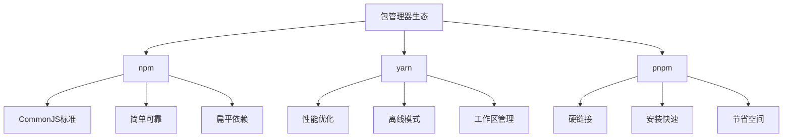
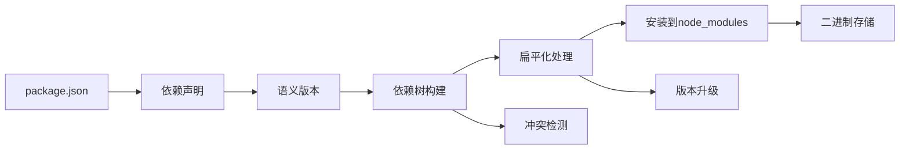
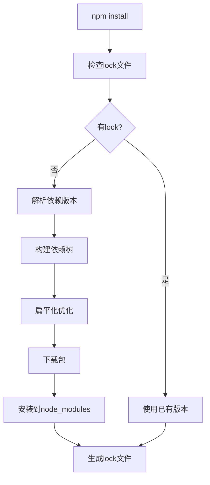

# 包管理器深入



## 📋 知识结构（金字塔模型）

### 🏗️ 基础层：认知（What）
**包管理器的核心功能**

| 功能 | 描述 | 重要性 | 实际用途 |
|------|------|--------|----------|
| **依赖管理** | 安装/卸载包 | ★★★★★ | 项目依赖 |
| **版本控制** | semver规范 | ★★★★★ | 兼容性管理 |
| **脚本执行** | 自定义命令 | ★★★★☆ | 构建流程 |
| **发布分享** | 包发布 | ★★★☆☆ | 代码分享 |

### 🔍 理解层：机制（Why&How）

**包管理器特性对比：**

| 特性 | npm | yarn | pnpm |
|------|-----|------|------|
| **速度** | 中等 | 快 | 最快 |
| **磁盘空间** | 大 | 中等 | 小 |
| **安全性** | 中等 | 高 | 最高 |
| **兼容性** | 最好 | 好 | 一般 |
| **学习成本** | 低 | 中等 | 高 |

**依赖解析机制：**



**依赖安装流程：**



### 🚀 应用层：实践（Apply）

**Package.json最佳实践：**

```json
{
  "name": "my-awesome-package",
  "version": "1.0.0",
  "description": "一个优秀的Node.js包",
  "main": "lib/index.js",
  "types": "lib/index.d.ts",
  "scripts": {
    "build": "tsc",
    "test": "jest",
    "test:watch": "jest --watch",
    "lint": "eslint src/**/*.ts",
    "lint:fix": "eslint src/**/*.ts --fix",
    "prepublishOnly": "npm run build && npm test"
  },
  "keywords": ["nodejs", "typescript", "javascript"],
  "author": "Your Name <your.email@example.com>",
  "license": "MIT",
  "repository": {
    "type": "git",
    "url": "https://github.com/username/repo.git"
  },
  "bugs": {
    "url": "https://github.com/username/repo/issues"
  },
  "homepage": "https://github.com/username/repo#readme",
  "engines": {
    "node": ">=14.0.0",
    "npm": ">=6.0.0"
  },
  "bundledDependencies": [],
  "peerDependencies": {
    "react": ">=16.8.0"
  },
  "peerDependenciesMeta": {
    "react": { "optional": false }
  },
  "publishConfig": {
    "registry": "https://registry.npmjs.org/"
  }
}
```

**依赖管理策略：**

```javascript
// ✅ 版本锁定策略
// package-lock.json 版本控制
{
  "lockfileVersion": 2,
  "requires": true,
  "packages": {
    "lodash": {
      "version": "4.17.21",
      "resolved": "https://registry.npmjs.org/lodash/-/lodash-4.17.21.tgz",
      "integrity": "sha512-v2kDEe57lecTulaDIuNTPy3Ry4gLGJ6Z1O3vE1krgXZNrsQ+LFTGHVxVjcXPs17LhbZUGedHvLdckYHoXqVfQg==",
      "dependencies": {}
    }
  }
}

// ✅ 依赖分类管理
const dependencyCategories = {
  // 生产依赖：运行时必需的包
  dependencies: {
    "express": "^4.18.0",
    "mongoose": "^6.3.0"
  },
  
  // 开发依赖：构建工具和测试框架
  devDependencies: {
    "typescript": "^4.7.0",
    "jest": "^28.1.0",
    "eslint": "^8.18.0"
  },
  
  // 对等依赖：宿主环境提供
  peerDependencies: {
    "react": "^18.0.0"
  },
  
  // 可选依赖：有则优化，无则正常
  optionalDependencies: {
    "redis": "^4.2.0"
  }
};
```

**工作区管理（Monorepo）：**

```json
// ✅ 根目录 package.json
{
  "name": "my-monorepo",
  "private": true,
  "workspaces": [
    "packages/*",
    "apps/*"
  ],
  "scripts": {
    "build": "npm run build --workspaces",
    "test": "npm run test --workspaces",
    "clean": "npm run clean --workspaces"
  }
}

// ✅ 子包 package.json
{
  "name": "@myorg/shared-utils",
  "version": "1.0.0",
  "main": "dist/index.js",
  "scripts": {
    "build": "tsc -p tsconfig.json",
    "test": "jest",
    "clean": "rm -rf dist"
  },
  "dependencies": {
    "lodash": "^4.17.21"
  }
}
```

**高级包管理操作：**

```javascript
// ✅ 依赖安全检查工具
class SecurityAuditor {
  static async audit(command = 'audit') {
    const { exec } = require('child_process');
    const { promisify } = require('util');
    const execAsync = promisify(exec);
    
    try {
      const { stdout, stderr } = await execAsync(`npm ${command}`);
      
      if (stderr) {
        console.warn('审计警告:', stderr);
      }
      
      return this.parseAuditOutput(stdout);
    } catch (error) {
      console.error('安全审计失败:', error.message);
      return null;
    }
  }
  
  static parseAuditOutput(output) {
    const vulnerabilities = [];
    
    // 解析审计输出
    const lines = output.split('\n');
    let inVulnerabilitySection = false;
    
    lines.forEach(line => {
      if (line.includes('found ')) {
        const match = line.match(/found (\d+) vulnerability/);
        if (match) {
          console.log(`发现 ${match[1]} 个安全漏洞`);
        }
      }
    });
    
    return vulnerabilities;
  }
}

// ✅ 版本更新管理
class VersionManager {
  static async checkOutdated(packageFiles = []) {
    const packages = packageFiles.length ? packageFiles : ['package.json'];
    
    for (const packageFile of packages) {
      console.log(`\n检查 ${packageFile}:`);
      
      try {
        const { execSync } = require('child_process');
        const output = execSync(`npm outdated --json`, { encoding: 'utf8' });
        
        const outdated = JSON.parse(output);
        this.displayOutdatedPackages(outdated);
      } catch (error) {
        console.log('没有过期的依赖');
      }
    }
  }
  
  static displayOutdatedPackages(outdated) {
    Object.entries(outdated || {}).forEach(([pkgName, pkgInfo]) => {
      console.log(`${pkgName}:`);
      console.log(`  当前版本: ${pkgInfo.current}`);
      console.log(`  期望版本: ${pkgInfo.wanted}`);
      console.log(`  最新版本: ${pkgInfo.latest}`);
      console.log(`  位置: ${pkgInfo.location}`);
    });
  }
}
```

**包发布管理：**

```javascript
// ✅ 自动化发布流程
class PackagePublisher {
  static async publishWithChecks(packagePath = './') {
    console.log('🚀 开始发布流程...');
    
    // 1. 检查Git状态
    await this.checkGitStatus();
    
    // 2. 运行测试
    await this.runTests();
    
    // 3. 构建项目
    await this.buildProject();
    
    // 4. 检查包大小
    await this.checkBundleSize();
    
    // 5. 发布包
    await this.publishPackage();
    
    console.log('✅ 发布完成!');
  }
  
  static async checkGitStatus() {
    const { execSync } = require('child_process');
    
    try {
      execSync('git diff --exit-code', { stdio: 'pipe' });
      console.log('✓ Git工作区干净');
    } catch {
      throw new Error('Git工作区有未提交的更改');
    }
  }
  
  static async runTests() {
    const { execSync } = require('child_process');
    
    try {
      execSync('npm test', { stdio: 'inherit' });
      console.log('✓ 所有测试通过');
    } catch {
      throw new Error('测试失败');
    }
  }
  
  static async buildProject() {
    const { execSync } = require('child_process');
    
    try {
      execSync('npm run build', { stdio: 'inherit' });
      console.log('✓ 构建成功');
    } catch {
      throw new Error('构建失败');
    }
  }
  
  static async checkBundleSize() {
    const fs = require('fs').promises;
    const path = require('path');
    
    const packageJsonPath = path.join(process.cwd(), 'package.json');
    const packageJson = JSON.parse(await fs.readFile(packageJsonPath, 'utf8'));
    
    // 检查主文件大小
    const mainFile = path.join(process.cwd(), packageJson.main || 'index.js');
    const stats = await fs.stat(mainFile);
    
    if (stats.size > 1024 * 1024) { // 1MB
      console.warn(`⚠️ 包大小 ${(stats.size / 1024 / 1024).toFixed(2)}MB 较大`);
    }
    
    console.log('✓ 包大小检查通过');
  }
  
  static async publishPackage() {
    const { execSync } = require('child_process');
    
    // 先尝试dry-run
    try {
      execSync('npm publish --dry-run', { stdio: 'pipe' });
      console.log('✓ Dry-run 检查通过');
    } catch {
      throw new Error('Dry-run 失败');
    }
    
    // 正式发布
    execSync('npm publish', { stdio: 'inherit' });
    console.log('✓ 包发布成功');
  }
}
```

## 🧠 费曼学习法：能用简单的话解释

**包管理器核心思想：**
1. **包管理器** = 书店和图书馆，帮你管理书籍（代码包）
2. **package.json** = 购物清单，记录需要什么
3. **版本管理** = 不同版本的书，可以有新版本但不一定适合

**版本号理解：**
```bash
"lodash": "^4.17.21"
# ^ 表示兼容主版本（4.x.x）
# ~ 表示兼容次版本（4.17.x）  
# 不指定表示精确版本
```

**依赖冲突解决：**
```bash
# npm会尝试解决冲突，但可能导致重复安装
npm ls                     # 查看依赖树
npm audit                  # 安全审计
npm update                 # 更新依赖
```

## 🎯 刻意练习要点

**必须掌握的技能：**
- [ ] 理解semver语义化版本规范
- [ ] 掌握package.json各字段含义
- [ ] 学会依赖冲突的解决策略
- [ ] 熟练使用包发布和管理流程

**编程练习：**

**1. 自定义包管理工具**
```javascript
// 练习：创建简易包管理器
class SimplePackageManager {
  constructor(packagePath = './package.json') {
    this.packagePath = packagePath;
    this.packageJson = null;
  }
  
  async loadPackage() {
    const fs = require('fs').promises;
    this.packageJson = JSON.parse(await fs.readFile(this.packagePath, 'utf8'));
  }
  
  async addDependency(packageName, version, options = {}) {
    await this.loadPackage();
    
    const targetSection = options.dev ? 'devDependencies' : 'dependencies';
    
    if (!this.packageJson[targetSection]) {
      this.packageJson[targetSection] = {};
    }
    
    this.packageJson[targetSection][packageName] = version;
    
    await this.savePackage();
    console.log(`✅ 添加依赖: ${packageName}@${version}`);
  }
  
  async removeDependency(packageName) {
    await this.loadPackage();
    
    // 从所有依赖分类中删除
    ['dependencies', 'devDependencies', 'peerDependencies'].forEach(section => {
      if (this.packageJson[section] && this.packageJson[section][packageName]) {
        delete this.packageJson[section][packageName];
        console.log(`🗑️ 从 ${section} 中删除: ${packageName}`);
      }
    });
    
    await this.savePackage();
  }
  
  async savePackage() {
    const fs = require('fs').promises;
    await fs.writeFile(this.packagePath, JSON.stringify(this.packageJson, null, 2));
  }
  
  async analyzeDependencies() {
    await this.loadPackage();
    
    const analysis = {
      totalDependencies: 0,
      byCategory: {},
      outdatedPackages: [],
      duplicatePackages: []
    };
    
    // 统计各分类依赖数量
    Object.keys(this.packageJson).forEach(key => {
      if (key.endsWith('Dependencies')) {
        const deps = this.packageJson[key];
        analysis.byCategory[key] = Object.keys(deps).length;
        analysis.totalDependencies += Object.keys(deps).length;
      }
    });
    
    return analysis;
  }
}
```

**2. 依赖分析工具**
```javascript
// 练习：创建依赖分析报告
class DependencyAnalyzer {
  static async generateReport(packagePath = './package.json') {
    const fs = require('fs').promises;
    const packageJson = JSON.parse(await fs.readFile(packagePath, 'utf8'));
    
    const report = {
      overview: this.generateOverview(packageJson),
      security: await this.checkSecurity(packageJson),
      performance: await this.analyzePerformance(packageJson),
      recommendations: this.generateRecommendations(packageJson)
    };
    
    return report;
  }
  
  static generateOverview(packageJson) {
    const totalDeps = Object.keys(packageJson.dependencies || {}).length +
                     Object.keys(packageJson.devDependencies || {}).length;
    
    return {
      projectName: packageJson.name,
      version: packageJson.version,
      totalDependencies: totalDeps,
      hasBuildScript: !!packageJson.scripts?.build,
      hasTestScript: !!packageJson.scripts?.test,
      license: packageJson.license,
      nodeVersion: packageJson.engines?.node
    };
  }
  
  static async checkSecurity(packageJson) {
    const { execSync } = require('child_process');
    
    try {
      const auditOutput = execSync('npm audit --json', { encoding: 'utf8' });
      const auditData = JSON.parse(auditOutput);
      
      return {
        vulnerable: auditData.vulnerabilities?.total || 0,
        severity: auditData.metadata?.vulnerabilities || {},
        needsUpdate: auditData.audit?.requires?.total || 0
      };
    } catch (error) {
      return { error: '安全检查失败', details: error.message };
    }
  }
  
  static generateRecommendations(packageJson) {
    const recommendations = [];
    
    // 检查常用优化建议
    if (!packageJson.description) {
      recommendations.push('添加包描述');
    }
    
    if (!packageJson.repository) {
      recommendations.push('添加仓库地址');
    }
    
    if (!packageJson.engines) {
      recommendations.push('指定Node.js版本要求');
    }
    
    if (!packageJson.scripts?.test) {
      recommendations.push('添加测试脚本');
    }
    
    return recommendations;
  }
}
```

**关联学习：**
- → [[012-开发工具链]] 开发工具与包管理
- → [[013-模块打包策略]] 打包和构建
- → [[020-项目架构最佳实践]] 项目结构优化

## 💡 知识点跳转

**前置知识：** [[005-模块系统详解]] - 模块加载机制
**后续深入：** [[012-开发工具链]] - 开发工具配置

---

*🔗 相关链接：[[005-模块系统详解]] | [[012-开发工具链]] | [[013-模块打包策略]]*
