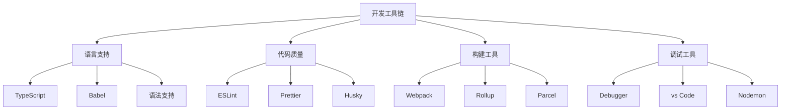
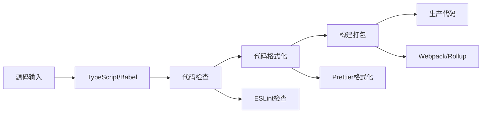

# 开发工具链



## 📋 知识结构（金字塔模型）

### 🏗️ 基础层：认知（What）
**开发工具链的核心构成**

| 工具类别 | 数量 | 作用 | 重要性 |
|----------|------|------|--------|
| **语言工具** | 5+ | 代码转换 | ★★★★★ |
| **代码质量** | 8+ | 规范检查 | ★★★★★ |
| **构建工具** | 6+ | 项目打包 | ★★★★☆ |
| **调试工具** | 5+ | 问题定位 | ★★★★☆ |

### 🔍 理解层：机制（Why&How）

**工具链工作流程：**



**TypeScript vs JavaScript对比：**

│ 特性 | JavaScript | TypeScript | 转换工具 |
|------|------------|------------|----------|
| **类型系统** | 动态类型 | 静态类型 | tsc编译器 |
| **开发体验** | 基础 | 高级提示 | VS Code |
| **错误检测** | 运行时 | 编译时 | 静态分析 |
| **生态支持** | 原生支持 | 类型定义 | @types/* |

### 🚀 应用层：实践（Apply）

**TypeScript配置最佳实践：**

```json
// ✅ tsconfig.json 配置
{
  "compilerOptions": {
    // 目标版本
    "target": "ES2020",
    "module": "CommonJS",
    "lib": ["ES2020"],
    
    // 输出配置
    "outDir": "./dist",
    "rootDir": "./src",
    "removeComments": true,
    "declaration": true,
    "sourceMap": true,
    
    // 严格检查
    "strict": true,
    "noImplicitAny": true,
    "strictNullChecks": true,
    "strictFunctionTypes": true,
    "strictBindCallApply": true,
    "strictPropertyInitialization": true,
    "noImplicitReturns": true,
    "noImplicitThis": true,
    
    // 模块解析
    "moduleResolution": "node",
    "baseUrl": "./",
    "paths": {
      "@/*": ["src/*"],
      "@/types/*": ["src/types/*"],
      "@/utils/*": ["src/utils/*"]
    },
    
    // 其他配置
    $"experimentalDecorators": true,
    $"emitDecoratorMetadata": true,
    "esModuleInterop": true,
    "allowSyntheticDefaultImports": true,
    "resolveJsonModule": true,
    "skipLibCheck": true
  },
  
  "include": [
    "src/**/*",
    "types/**/*"
  ],
  
  "exclude": [
    "node_modules",
    "dist",
    "**/*.test.ts",
    "**/*.spec.ts"
  ]
}
```

**代码质量工具集成：**

```javascript
// ✅ ESLint配置 (.eslintrc.js)
module.exports = {
  env: {
    node: true,
    es2021: true,
    jest: true
  },
  
  extends: [
    'eslint:recommended',
    '@typescript-eslint/recommended',
    'plugin:node/recommended',
    'prettier'
  ],
  
  plugins: [
    '@typescript-eslint',
    'node',
    'prettier'
  ],
  
  parserOptions: {
    ecmaVersion: 2021,
    sourceType: 'module',
    project: './tsconfig.json'
  },
  
  rules: {
    // TypeScript相关
    '@typescript-eslint/no-unused-vars': 'error',
    '@typescript-eslint/no-explicit-any': 'warn',
    '@typescript-eslint/explicit-function-return-type': 'off',
    
    // Node.js相关
    'node/no-missing-import': 'off',
    'node/no-unsupported-features/es-syntax': 'off',
    
    // 代码风格
    'prettier/prettier': 'error',
    'prefer-const': 'error',
    'no-var': 'error',
    'object-shorthand': 'error',
    'prefer-template': 'error',
    'prefer-arrow-callback': 'error',
    
    // 安全相关
    'no-eval': 'error',
    'no-implied-eval': 'error',
    'no-new-func': 'error'
  },
  
  overrides: [
    {
      files: ['**/*.test.ts', '**/*.spec.ts'],
      env: {
        jest: true
      },
      rules: {
        '@typescript-eslint/no-explicit-any': 'off'
      }
    }
  ]
};

// ✅ Prettier配置 (.prettierrc)
module.exports = {
  semi: true,
  trailingComma: 'es5',
  singleQuote: true,
  printWidth: 80,
  tabWidth: 2,
  useTabs: false,
  arrowParens: 'avoid',
  endOfLine: 'lf',
  quoteProps: 'as-needed',
  bracketSpacing: true,
  bracketSameLine: false,
  
  // 文件特定格式
  overrides: [
    {
      files: '*.json',
      options: { printWidth: 200 }
    },
    {
      files: '*.md',
      options: { proseWrap: 'always' }
    }
  ]
};
```

**构建工具配置：**

```javascript
// ✅ Webpack配置 (webpack.config.js)
const path = require('path');
const nodeExternals = require('webpack-node-externals');

module.exports = {
  mode: process.env.NODE_ENV === 'production' ? 'production' : 'development',
  
  target: 'node',
  
  entry: {
    app: './src/index.ts'
  },
  
  output: {
    filename: '[name].bundle.js',
    path: path.resolve(__dirname, 'dist'),
    clean: true,
    libraryTarget: 'commonjs2'
  },
  
  resolve: {
    extensions: ['.ts', '.js', '.json'],
    alias: {
      '@': path.resolve(__dirname, 'src'),
      '@/types': path.resolve(__dirname, 'src/types'),
      '@/utils': path.resolve(__dirname, 'src/utils')
    }
  },
  
  module: {
    rules: [
      {
        test: /\.ts$/,
        use: {
          loader: 'ts-loader',
          options: {
            transpileOnly: false,
            compilerOptions: {
              noEmit: false
            }
          }
        },
        exclude: /node_modules/
      },
      
      {
        test: /\.js$/,
        use: {
          loader: 'babel-loader',
          options: {
            presets, ['@babel/preset-env', {
              targets: {
                node: '14'
              }
            }]
          }
        },
        exclude: /node_modules/
      }
    ]
  },
  
  externals: [
    nodeExternals({
      allowlist: ['webpack/hot/poll?1000']
    })
  ],
  
  plugins: [
    new webpack.DefinePlugin({
      'process.env.NODE_ENV': JSON.stringify(process.env.NODE_ENV)
    })
  ],
  
  optimization: {
    minimize: process.env.NODE_ENV === 'production',
    splitChunks: {
      chunks: 'all',
      cacheGroups: {
        vendor: {
          test: /[\\/]node_modules[\\/]/,
          name: 'vendors',
          chunks: 'all'
        }
      }
    }
  },
  
  devtool: process.env.NODE_ENV === 'production' ? 
    'source-map' : 'eval-source-map'
};

// ✅ 开发服务器配置
const webpackConfig = require('./webpack.config.js');
const merge = require('webpack-merge');

module.exports = merge(webpackConfig, {
  mode: 'development',
  
  plugins: [
    new webpack.HotModuleReplacementPlugin()
  ],
  
  devServer: {
    contentBase: './dist',
    hot: true,
    port: 8080,
    proxy: [
      {
        context: ['/api'],
        target: 'http://localhost:3000',
        changeOrigin: true
      }
    ]
  }
});
```

**Git钩子自动化：**

```javascript
// ✅ Husky + lint-staged 配置
module.exports = {
  hooks: {
    'pre-commit': 'lint-staged',
    'pre-push': 'npm run test',
    'commit-msg': 'commitlint -E HUSKY_GIT_PARAMS'
  },
  
  'lint-staged': {
    'src/**/*.{ts,js}': [
      'eslint --fix',
      'prettier --write',
      'git add'
    ],
    'src/**/*.{json,md}': [
      'prettier --write',
      'git add'
    ],
    'src/**/*.ts': [
      'tsc --noEmit'
    ]
  }
};

// ✅ commitlint配置 (.commitlintrc.js)
module.exports = {
  extends: ['@commitlint/config-conventional'],
  
  rules: {
    'type-enum': [
      2,
      'always',
      [
        'feat',     // 新功能
        'fix',      // 修复bug
        'docs',     // 文档更新
        'style',    // 代码格式
        'refactor', // 重构
        'perf',     // 性能优化
        'test',     // 测试
        'chore',    // 构建/工具
        'ci',       // CI配置
        'build',    // 构建系统
        'revert'    // 回滚
      ]
    ],
    
    'subject-case': [2, 'never', ['pascal-case']],
    'subject-max-length': [2, 'always', 50],
    'body-max-line-length': [2, 'always', 100]
  }
};
```

## 🧠 费曼学习法：能用简单的话解释

**开发工具链核心思想：**
1. **TypeScript** = 给JavaScript加上类型检查的"安全帽"
2. **ESLint** = 代码的"语法老师"，检查错误和不规范
3. **Prettier** = 代码的"美发师"，统一格式和风格
4. **Webpack** = 代码的"打包员"，把所有文件整理成想要的格式

**工具选择原则：**
```javascript
// ✅ 选择合适的工具
const toolSelection = {
  // 语言增强：需要类型安全选TypeScript
  '需要类型检查': 'TypeScript',
  '快速原型': 'JavaScript + JSDoc',
  
  // 代码质量：团队合作必须用ESLint
  '团队开发': 'ESLint + Prettier',
  '个人项目': 'Prettier',
  
  // 构建工具：项目复杂度决定
  '简单项目': 'tsc直接编译',
  '复杂项目': 'Webpack/Rollup',
  '库项目': 'Rollup'
};
```

## 🎯 刻意练习要点

**必须掌握的技能：**
- [ ] 配置和使用TypeScript编译
- [ ] 设置ESLint和Prettier规则
- [ ] 掌握Webpack基本配置
- [ ] 搭建Git钩子和自动化流程

**编程练习：**

**1. TypeScript类型定义**
```typescript
// 练习：创建完整的类型系统
interface User {
  id: string;
  email: string;
  profile: UserProfile;
  createdAt: Date;
  updatedAt: Date;
}

interface UserProfile {
  firstName: string;
  lastName: string;
  avatar?: string;
  bio?: string;
  preferences: UserPreferences;
}

interface UserPreferences {
  theme: 'light' | 'dark';
  notifications: NotificationSettings;
  privacy: PrivacySettings;
}

interface NotificationSettings {
  email: boolean;
  push: boolean;
  sms: boolean;
}

interface PrivacySettings {
  profileVisibility: 'public' | 'friends' | 'private';
  showEmail: boolean;
  showActivity: boolean;
}

// Generic类型
interface ApiResponse<T> {
  success: boolean;
  data: T;
  error?: string;
  pagination?: PaginationInfo;
}

interface PaginationInfo {
  page: number;
  limit: number;
  total: number;
  hasNext: boolean;
  hasPrev: boolean;
}

// 泛型约束
interface UserService<T extends User> {
  create(userData: Omit<T, 'id' | 'createdAt' | 'updatedAt'>): Promise<T>;
  findById(id: string): Promise<T | null>;
  update(id: string, updates: Partial<T>): Promise<T>;
  delete(id: string): Promise<boolean>;
}
```

**2. 高级ESLint规则**
```javascript
// 练习：创建自定义ESLint规则
module.exports = {
  rules: {
    // 禁止使用console
    'no-console': process.env.NODE_ENV === 'production' ? 'error' : 'warn',
    
    // 要求使用const
    'prefer-const': 'error',
    
    // 禁止未使用的变量
    '@typescript-eslint/no-unused-vars': ['error', {
      argsIgnorePattern: '^_',
      varsIgnorePattern: '^_'
    }],
    
    // 函数复杂度假设
    'complexity': ['warn', 5],
    
    // 最大函数长度
    'max-lines-per-function': ['warn', 50],
    
    // 最大文件长度
    'max-lines': ['warn', 200],
    
    // 要求箭头函数
    'prefer-arrow-callback': 'error',
    
    // 禁止var
    'no-var': 'error',
    
    // 对象简写
    'object-shorthand': 'error',
    
    // 模板字符串
    'prefer-template': 'error'
  },
  
  // 针对测试文件的特殊规则
  overrides: [
    {
      files: ['**/*.test.ts', '**/*.spec.ts'],
      rules: {
        'no-console': 'off',
        '@typescript-eslint/no-explicit-any': 'off'
      }
    }
  ]
};
```

**性能监控：**
```javascript
// ✅ 构建性能监控
class BuildPerformanceMonitor {
  static measureBuild() {
    const startTime = Date.now();
    
    return {
      start: () => {
        console.log('🔨 开始构建...');
        return Date.now();
      },
      
      end: () => {
        const endTime = Date.now();
        const duration = endTime - startTime;
        console.log(`✅ 构建完成，耗时: ${duration}ms`);
        return duration;
      }
    };
  }
  
  static analyzeBundleStats(stats) {
    const bundleSize = stats.size || 0;
    const gzipSize = stats.gzipSize || 0;
    
    console.log('📊 Bundle分析:');
    console.log(`   原始大小: ${(bundleSize / 1024).toFixed(2)} KB`);
    console.log(`   压缩大小: ${(gzipSize / 1024).toFixed(2)} KB`);
    console.log(`   压缩率: ${((1 - gzipSize / bundleSize) * 100).toFixed(1)}%`);
    
    // Bundle大小警告
    if (bundleSize > 500 * 1024) { // 500KB
      console.warn('⚠️ Bundle大小较大，建议代码分割');
    }
    
    return { bundleSize, gzipSize };
  }
}
```

**关联学习：**
- → [[013-模块打包策略]] 打包工具的使用
- → [[015-Express核心机制]] 项目开发实践
- → [[020-项目架构最佳实践]] 项目工具链集成

## 💡 知识点跳转

**前置知识：** [[011-包管理器深入]] - 包管理基础
**后续深入：** [[013-模块打包策略]] - 模块打包技术

---

*🔗 相关链接：[[011-包管理器深入]] | [[013-模块打包策略]] | [[015-Express核心机制]]*
