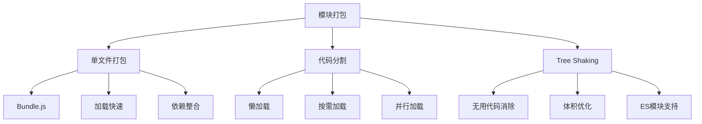
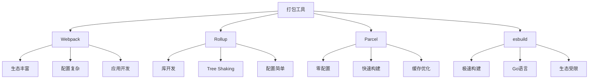

# 模块打包策略



## 📋 知识结构（金字塔模型）

### 🏗️ 基础层：认知（What）
**打包策略的核心思想**

| 策略 | 原理 | 优势 | 劣势 |
|------|------|------|------|
| **单文件打包** | 合并所有依赖 | 减少请求 | 首屏耗时长 |
| **代码分割** | 按需分离 | 加载优化 | 架构复杂 |
| **Tree Shaking** | 死代码消除 | 体积最小 | ES模块限制 |

### 🔍 理解层：机制（Why&How）

**打包工具特性对比：**



**代码分割策略类型：**

| 分割方式 | 分割依据 | 适用场景 | 实现方式 |
|----------|----------|----------|----------|
| **入口分割** | 入口文件 | 多页面应用 | entry配置 |
| **动态导入** | 代码边界 | SPA应用 | import() |
| **公共代码** | 共享模块 | 多入口项目 | CommonsChunk |
| **CSS分割** | 样式文件 | 大型项目 | CssExtractPlugin |

### 🚀 应用层：实践（Apply）

**Webpack代码分割配置：**

```javascript
// ✅ 高级代码分割配置
const path = require('path');
const { BundleAnalyzerPlugin } = require('webpack-bundle-analyzer');

module.exports = {
  mode: 'production',
  
  entry: {
    // 入口分割
    main: './src/index.ts',
    admin: './src/admin.ts'
  },
  
  output: {
    path: path.resolve(__dirname, 'dist'),
    
    // 使用chunkhash支持长期缓存
    filename: '[name].[contenthash].js',
    chunkFilename: '[name].[contenthash].chunk.js',
    
    // 公共路径配置
    publicPath: '/assets/',
    
    // 清理输出目录
    clean: {
      dry: false,
      keep: /\.git$/
    }
  },
  
  optimization: {
    splitChunks: {
      chunks: 'all',
      minSize: 20000,
      maxSize: 244000,
      
      // 缓存组配置
      cacheGroups: {
        // 第三方库分组
        vendor: {
          test: /[\\/]node_modules[\\/]/,
          name: 'vendors',
          chunks: 'all',
          priority: 10,
          reuseExistingChunk: true
        },
        
        // 公共代码分组
        common: {
          name: 'common',
          minChunks: 2,
          chunks: 'all',
          priority: 5,
          reuseExistingChunk: true
        },
        
        // 工具类分组
        utils: {
          test: /[\\/]src[\\/]utils[\\/]/,
          name: 'utils',
          chunks: 'all',
          priority: 7,
          reuseExistingChunk: true
        },
        
        // CSS样式分组
        styles: {
          name: 'styles',
          test: /\.(css|scss|sass)$/,
          chunks: 'all',
          enforce: true
        }
      }
    },
    
    // 运行时代码分离
    runtimeChunk: {
      name: 'runtime'
    },
    
    // Tree Shaking相关
    usedExports: true,
    sideEffects: false
  },
  
  plugins: [
    // Bundle分析
    new BundleAnalyzerPlugin({
      analyzerMode: 'static',
      openAnalyzer: false,
      reportFilename: 'bundle-report.html'
    })
  ],
  
  module: {
    rules: [
      {
        test: /\.(css|scss)$/,
        use: [
          MiniCssExtractPlugin.loader,
          'css-loader',
          'postcss-loader',
          'sass-loader'
        ]
      }
    ]
  }
};
```

**动态导入和懒加载：**

```javascript
// ✅ 路由级别的代码分割
class RouteCodeSplitting {
  // React路由懒加载
  static createLazyRoute(routePath) {
    const LazyComponent = React.lazy(() => {
      return import(`./pages/${routePath}`).catch(err => {
        console.error('页面加载失败:', err);
        // 降级到错误页面
        return import('./pages/Error');
      });
    });
    
    return React.createElement(Suspense, {
      fallback: React.createElement(LoadingSpinner)
    }, React.createElement(LazyComponent));
  }
  
  // Vue路由懒加载
  static createVueLazyRoute() {
    return [
      {
        path: '/home',
        component: () => import(/* webpackChunkName: "home" */ './pages/Home.vue')
      },
      {
        path: '/profile',
        component: () => import(/* webpackChunkName: "profile" */ './pages/Profile.vue')
      },
      {
        path: '/admin',
        component: () => import(/* webpackChunkName: "admin" */ './pages/Admin.vue')
      }
    ];
  }
  
  // Angular懒加载模块
  static createAngularLazyRoute() {
    return RouterModule.forRoot([
      {
        path: 'dashboard',
        loadChildren: () => import('./dashboard/dashboard.module').then(m => m.DashboardModule)
      },
      {
        path: 'users',
        loadChildren: () => import('./users/users.module').then(m => m.UsersModule)
      }
    ]);
  }
}

// ✅ 条件加载和预加载策略
class ConditionalLoader {
  // 按需加载工具库
  static async loadUtility(libraryName) {
    try {
      switch (libraryName) {
        case 'lodash':
          return await import(/* webpackChunkName: "lodash" */ 'lodash');
        case 'moment':
          return await import(/* webpackChunkName: "moment" */ 'moment');
        case 'chart':
          return await import(/* webpackChunkName: "chart" */ 'chart.js');
        default:
          throw new Error(`不支持的工具库: ${libraryName}`);
      }
    } catch (error) {
      console.error('工具库加载失败:', error);
      return null;
    }
  }
  
  // 预加载关键资源
  static prefetchCriticalResources() {
    const criticalResources = [
      '/assets/fonts/main.woff2',
      '/assets/images/logo.svg',
      '/assets/css/critical.css'
    ];
    
    criticalResources.forEach(resource => {
      const link = document.createElement('link');
      link.rel = 'prefetch';
      link.href = resource;
      document.head.appendChild(link);
    });
  }
  
  // 智能预加载
  static intelligentPrefetch() {
    // 基于用户行为的预加载
    const observer = new IntersectionObserver((entries) => {
      entries.forEach(entry => {
        if (entry.isIntersecting) {
          const componentPath = entry.target.dataset.component;
          if (componentPath) {
            import(`./components/${componentPath}`).catch(err => 
              console.error('预加载失败:', err)
            );
          }
        }
      });
    });
    
    // 观察即将进入视口的元素
    document.querySelectorAll('[data-component]').forEach(el => {
      observer.observe(el);
    });
  }
}
```

**Tree Shaking优化策略：**

```javascript
// ✅ ES模块Tree Shaking优化
// 好的做法：命名导出确保精确引用
export const utils = {
  debounce: (func, wait) => {
    let timeout;
    return function executedFunction(...args) {
      const later = () => {
        clearTimeout(timeout);
        func(...args);
      };
      clearTimeout(timeout);
      timeout = setTimeout(later, wait);
    };
  },
  
  throttle: (func, limit) => {
    let inThrottle;
    return function executedFunction(...args) {
      if (!inThrottle) {
        func.apply(this, args);
        inThrottle = true;
        setTimeout(() => inThrottle = false, limit);
      }
    };
  },
  
  formatDate: (date) => {
    return new Intl.DateTimeFormat('zh-CN').format(new Date(date));
  }
};

// ✅ 避免默认导出大对象
// ❌ 不好的做法
export default {
  debounce: () => {},
  throttle: () => {},
  formatDate: () => {}
};

// ✅ 好的做法：单独导出方法
export const debounce = (func, wait) => { /* ... */ };
export const throttle = (func, limit) => { /* ... */ };
export const formatDate = (date) => { /* ... */ };

// ✅ package.json配置支持Tree Shaking
const packageJsonConfig = {
  "sideEffects": [
    // 标记有副作用的文件
    "*.css",
    "*.scss",
    "./src/polyfills.js"
  ],
  
  // ES模块支持
  "module": "dist/index.esm.js",
  "main": "dist/index.js",
  
  // 提供更多入口点
  "exports": {
    ".": {
      "import": "./dist/index.esm.js",
      "require": "./dist/index.js"
    },
    "./utils": {
      "import": "./dist/utils.esm.js",
      "require": "./dist/utils.js"
    }
  }
};

// ✅ Webpack Tree Shaking配置
const treeShakingConfig = {
  optimization: {
    usedExports: true,
    sideEffects: false,
    
    // 更高级的Tree Shaking
    concatenateModules: true,
    
    // 模块合并
    minimize: true,
    minimizer: [
      new TerserPlugin({
        terserOptions: {
          compress: {
            drop_ console: true,
            drop_ debugger: true,
            pure_ funcs: ['console.log', 'console.info']
          }
        }
      })
    ]
  },
  
  resolve: {
    // 确保Tree Shaking工作
    conditionNames: ['import', 'require', 'default'],
    mainFields: ['module', 'main']
  }
};
```

**Bundle分析和监控：**

```javascript
// ✅ Bundle分析工具
class BundleAnalyzer {
  static analyzeBundle(stats) {
    const analysis = {
      totalSize: 0,
      totalChunks: 0,
      duplicateModules: 0,
      recommendations: []
    };
    
    const modules = {};
    
    stats.chunks.forEach(chunk => {
      analysis.totalChunks++;
      
      chunk.modules.forEach(module => {
        analysis.totalSize += module.size;
        
        const moduleId = module.identifier;
        if (modules[moduleId]) {
          modules[moduleId].count++;
          analysis.duplicateModules++;
        } else {
          modules[moduleId] = { size: module.size, count: 1 };
        }
      });
    });
    
    // 生成优化建议
    if (analysis.totalSize > 1000000) { // 1MB
      analysis.recommendations.push('Bundle较大，建议代码分割');
    }
    
    if (analysis.duplicateModules > 10) {
      analysis.recommendations.push('发现重复模块，检查Tree Shaking');
    }
    
    return analysis;
  }
  
  static generateChunkReport(chunks) {
    const report = chunks.map(chunk => ({
      name: chunk.names[0] || 'unnamed',
      size: chunk.size,
      modules: chunk.modules.length,
      reasons: chunk.reasons.map(r => r.moduleName)
    }));
    
    return report.sort((a, b) => b.size - a.size);
  }
}

// ✅ 构建性能监控
class BuildPerformanceMonitor {
  static trackBuildPerformance() {
    const startTime = Date.now();
    
    return {
      start: () => {
        console.log('🏗️ 开始构建...');
        return startTime;
      },
      
      intermediate: (stage) => {
        const currentTime = Date.now();
        const duration = currentTime - startTime;
        console.log(`⏱️ ${stage} 完成，耗时: ${duration}ms`);
        return currentTime;
      },
      
      finish: (stats) => {
        const endTime = Date.now();
        const totalDuration = endTime - startTime;
        
        console.log(`✅ 构建完成！`);
        console.log(`📊 总体统计:`);
        console.log(`   总耗时: ${totalDuration}ms`);
        console.log(`   文件数量: ${stats.compilation.chunks.length}`);
        console.log(`   总大小: ${(stats.compilation.assets['main.js']?.size || 0 / 1024).toFixed(2)} KB`);
        
        return totalDuration;
      }
    };
  }
}
```

## 🧠 费曼学习法：能用简单的话解释

**模块打包核心思想：**
1. **打包** = 把散装的代码文件装进一个"行李箱"(Bundle)
2. **代码分割** = 把大箱子分成几个小箱子，按需取用
3. **Tree Shaking** = 整理行李箱，扔掉不需要的衣服

**选择策略：**
```javascript
const selectionStrategy = {
  // 项目类型决定策略
  '应用开发': 'Webpack + 代码分割',
  '库开发': 'Rollup + Tree Shaking',
  '原型开发': 'Parcel + 零配置',
  '极速构建': 'esbuild + Rust速度'
};
```

## 🎯 刻意练习要点

**必须掌握的技能：**
- [ ] 配置Webpack代码分割
- [ ] 实现动态导入和懒加载
- [ ] 优化Tree Shaking效果
- [ ] 分析Bundle大小和性能

**编程练习：**

**1. 智能代码分割**
```javascript
// 练习：实现基于路由的智能代码分割
class IntelligentCodeSplitting {
  static createRouteBasedChunks(appRoutes) {
    const chunkGroups = new Map();
    
    // 按功能模块分组
    appRoutes.forEach(route => {
      const module = route.path.split('/')[1]; // 获取一级路径
      
      if (!chunkGroups.has(module)) {
        chunkGroups.set(module, []);
      }
      
      chunkGroups.get(module).push(route);
    });
    
    // 生成webpack配置
    return Array.from(chunkGroups.entries()).map(([moduleName, routes]) => ({
      name: `chunk-${moduleName}`,
      test: new RegExp(`\/${moduleName}\/`),
      filename: `chunks/${moduleName}/[name].chunk.js`,
      chunks: 'async',
      minSize: 10000,
      maxSize: 50000
    }));
  }
  
  static createFeatureBasedLoading() {
    return {
      // 用户信息页面
      'user-profile': () => import('./features/user/ProfilePage'),
      
      // 管理后台
      'admin-dashboard': () => import('./features/admin/Dashboard'),
      
      // 图表组件
      'charts': () => Promise.all([
        import('./features/charts/ChartConfig'),
        import('./features/charts/chart-utils')
      ]),
      
      // 编辑器
      'code-editor': () => import('./features/editor/CodeEditor')
    };
  }
}
```

**2. Tree Shaking优化**
```javascript
// 练习：优化库的Tree Shaking效果
// 重构前（Tree Shaking不友好）
class BadLibraryStructure {
  // ❌ 所有工具函数打包在一起
  static utils = {
    json: {
      parse: (str) => JSON.parse(str),
      stringify: (obj) => JSON.stringify(obj)
    },
    
    date: {
      format: (date) => new Intl.DateTimeFormat().format(date),
      parse: (str) => new Date(str)
    },
    
    string: {
      capitalize: (str) => str.charAt(0).toUpperCase() + str.slice(1),
      camelCase: (str) => str.replace(/-([a-z])/g, g => g[1].toUpperCase())
    }
  };
}

// 重构后（Tree Shaking友好）
// ✅ 扁平化导出
export const parseJson = (str) => JSON.parse(str);
export const stringifyJson = (obj) => JSON.stringify(obj);

export const formatDate = (date) => new Intl.DateTimeFormat().format(date);
export const parseDate = (str) => new Date(str);

export const capitalize = (str) => str.charAt(0).toUpperCase() + str.slice(1);
export const camelCase = (str) => str.replace(/-([a-z])/g, g => g[1].toUpperCase());

// ✅ 按功能分组的入口文件
export * from './utils/json';
export * from './utils/date';
export * from './utils/string';
```

**性能优化监控：**
```javascript
// ✅ 构建性能实时监控
class RealTimeBuildMonitor {
  constructor() {
    this.metrics = {
      buildStartTime: null,
      chunkBuildTimes: new Map(),
      moduleParseTimes: new Map(),
      totalBuildTime: 0
    };
  }
  
  trackBuild(chunkName, startTime) {
    this.metrics.chunkBuildTimes.set(chunkName, {
      start: startTime,
      end: null
    });
  }
  
  finishBuild(chunkName, endTime) {
    const chunkMetrics = this.metrics.chunkBuildTimes.get(chunkName);
    if (chunkMetrics) {
      chunkMetrics.end = endTime;
      chunkMetrics.duration = endTime - chunkMetrics.start;
    }
  }
  
  generatePerformanceReport() {
    const report = {
      totalBuildTime: this.metrics.totalBuildTime,
      chunkDetails: Array.from(this.metrics.chunkBuildTimes.entries())
        .map(([name, metrics]) => ({
          chunk: name,
          buildTime: metrics.duration,
          relativeTime: (metrics.duration / this.metrics.totalBuildTime * 100).toFixed(2) + '%'
        }))
        .sort((a, b) => b.buildTime - a.buildTime)
    };
    
    console.table(report);
    return report;
  }
}
```

**关联学习：**
- → [[014-环境变量管理]] 环境配置与构建
- → [[020-项目架构最佳实践]] 项目整体构建
- → [[032-全栈博客系统]] 实际打包应用

## 💡 知识点跳转

**前置知识：** [[012-开发工具链]] - 开发工具基础
**后续深入：** [[014-环境变量管理]] - 构建环境管理

---

*🔗 相关链接：[[012-开发工具链]] | [[014-环境变量管理]] | [[020-项目架构最佳实践]]*
