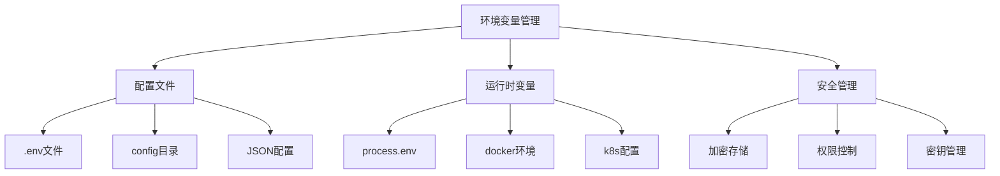
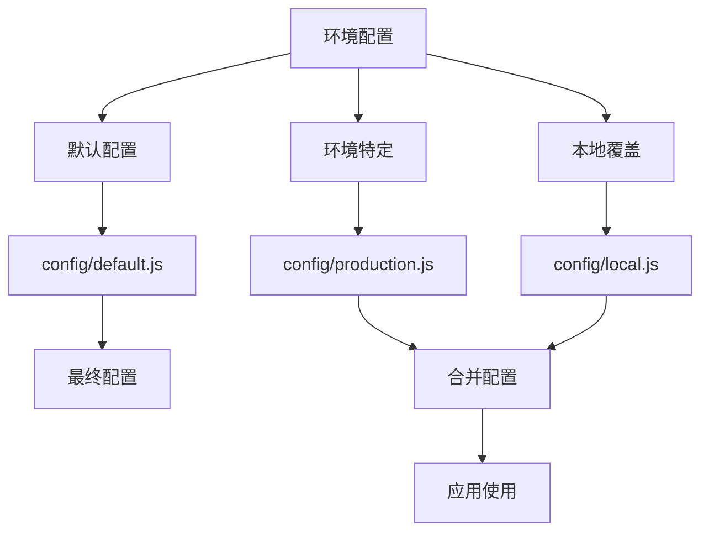

# 环境变量管理



## 📋 知识结构（金字塔模型）

### 🏗️ 基础层：认知（What）
**环境变量的作用域和类型**

| 环境 | 作用域 | 用途 | 示例 |
|------|--------|------|-- ---|
| **开发环境** | 本地开发 | 调试配置 | DEBUG=true |
| **测试环境** | CI/CD | 自动化测试 | TEST_DB_URL |
| **生产环境** | 线上服务 | 生产配置 | API_SECRET |
| **容器环境** | Docker/K8s | 容器配置 | REDIS_URL |

### 🔍 理解层：机制（Why&How）

**配置文件层级结构：**



**Node.js环境检测：**

| 检测方式 | 代码示例 | 可靠性 | 适用场景 |
|----------|----------|--------|----------|
| **NODE_ENV** | process.env.NODE_ENV | ★★★★☆ | 标准环境 |
| **自定义字段** | process.env.APP_ENV | ★★★★★ | 自定义环境 |
| **主机名匹配** | os.hostname() | ★★★☆☆ | 服务器区分 |
| **端口检测** | process.env.PORT | ★★☆☆☆ | 简单区分 |

### **应用层：实践（Apply）

**配置管理工具类：**

```javascript
const path = require('path');
const fs = require('fs').promises;
const os = require('os');

// ✅ 统一配置管理类
class ConfigManager {
  constructor(options = {}) {
    this.configDir = options.configDir || path.join(process.cwd(), 'config');
    this.env = this.detectEnvironment();
    this.config = {};
    this.cache = new Map();
  }
  
  // 环境检测
  detectEnvironment() {
    const nodeEnv = process.env.NODE_ENV;
    const appEnv = process.env.APP_ENV;
    
    // 优先级：APP_ENV > NODE_ENV > 主机检测
    if (appEnv) return appEnv;
    if (nodeEnv) return nodeEnv;
    
    // 基于主机名检测环境
    const hostname = os.hostname();
    if (hostname.includes('prod') || hostname.includes('production')) {
      return 'production';
    }
    if (hostname.includes('test') || hostname.includes('staging')) {
      return 'test';
    }
    
    return 'development';
  }
  
  // 加载配置文件
  async loadConfig() {
    try {
      // 1. 加载默认配置
      const defaultConfig = await this.loadConfigFile('default');
      
      // 2. 加载环境特定配置
      const envConfig = await this.loadConfigFile(this.env);
      
      // 3. 加载本地覆盖配置
      const localConfig = await this.loadConfigFile('local', true);
      
      // 4. 合并配置
      this.config = this.deepMerge(defaultConfig, envConfig, localConfig);
      
      // 5. 从环境变量覆盖
      this.applyEnvironmentOverrides();
      
      return this.config;
    } catch (error) {
      console.error('配置加载失败:', error.message);
      throw error;
    }
  }
  
  // 加载单个配置文件
  async loadConfigFile(configName, optional = false) {
    const configPath = path.join(this.configDir, `${configName}.js`);
    
    try {
      const configModule = require(configPath);
      
      // 支持导出的配置函数
      if (typeof configModule === 'function') {
        return configModule(this.env);
      }
      
      return configModule || {};
    } catch (error) {
      if (optional) {
        console.log(`可选配置文件 ${configName} 未找到，跳过`);
        return {};
      }
      throw new Error(`配置文件 ${configName} 加载失败: ${error.message}`);
    }
  }
  
  // 深度合并对象
  deepMerge(...objects) {
    const result = {};
    
    objects.forEach(obj => {
      Object.keys(obj).forEach(key => {
        if (obj[key] && typeof obj[key] === 'object' && !Array.isArray(obj[key])) {
          result[key] = this.deepMerge(result[key] || {}, obj[key]);
        } else {
          result[key] = obj[key];
        }
      });
    });
    
    return result;
  }
  
  // 应用环境变量覆盖
  applyEnvironmentOverrides() {
    // 数据库配置覆盖
    if (process.env.DATABASE_URL) {
      this.config.database.url = process.env.DATABASE_URL;
    }
    
    // Redis配置覆盖
    if (process.env.REDIS_URL) {
      this.config.redis.url = process.env.REDIS_URL;
    }
    
    // API密钥覆盖
    if (process.env.API_SECRET_KEY) {
      this.config.api.secretKey = process.env.API_SECRET_KEY;
    }
    
    // 服务器配置覆盖
    if (process.env.PORT) {
      this.config.server.port = parseInt(process.env.PORT, 10);
    }
    
    if (process.env.HOST) {
      this.config.server.host = process.env.HOST;
    }
  }
  
  // 获取配置项
  get(key, defaultValue = null) {
    const keys = key.split('.');
    let value = this.config;
    
    for (const k of keys) {
      if (value && typeof value === 'object' && k in value) {
        value = value[k];
      } else {
        return defaultValue;
      }
    }
    
    return value;
  }
  
  // 设置配置项
  set(key, value) {
    const keys = key.split('.');
    let current = this.config;
    
    for (let i = 0; i < keys.length - 1; i++) {
      const key = keys[i];
      if (!(key in current) || typeof current[key] !== 'object') {
        current[key] = {};
      }
      current = current[key];
    }
    
    current[keys[keys.length - 1]] = value;
  }
  
  // 验证必需配置
  validateRequiredConfig() {
    const required = [
      'database.url',
      'server.port',
      'api.secretKey'
    ];
    
    const missing = [];
    
    required.forEach(key => {
      if (!this.get(key)) {
        missing.push(key);
      }
    });
    
    if (missing.length > 0) {
      throw new Error(`缺少必需配置: ${missing.join(', ')}`);
    }
  }
  
  // 生成配置报告
  generateConfigReport() {
    const report = {
      environment: this.env,
      configFile: `${this.env}.js`,
      keyCount: this.countConfigKeys(this.config),
      sensitiveKeys: this.findSensitiveKeys(this.config),
      overrides: this.findEnvironmentOverrides()
    };
    
    return report;
  }
  
  countConfigKeys(obj, prefix = '') {
    let count = 0;
    Object.keys(obj).forEach(key => {
      const fullKey = prefix ? `${prefix}.${key}` : key;
      if (typeof obj[key] === 'object' && obj[key] !== null) {
        count += this.countConfigKeys(obj[key], fullKey);
      } else {
        count++;
      }
    });
    return count;
  }
  
  findSensitiveKeys(obj, prefix = '') {
    const sensitivePatterns = ['password', 'secret', 'key', 'token', 'auth'];
    const sensitiveKeys = [];
    
    Object.keys(obj).forEach(key => {
      const fullKey = prefix ? `${prefix}.${key}` : key;
      if (sensitivePatterns.some(pattern => key.toLowerCase().includes(pattern))) {
        sensitiveKeys.push(fullKey);
      }
      if (typeof obj[key] === 'object' && obj[key] !== null) {
        sensitiveKeys.push(...this.findSensitiveKeys(obj[key], fullKey));
      }
    });
    
    return sensitiveKeys;
  }
  
  findEnvironmentOverrides() {
    const overrides = [];
    const envVars = Object.keys(process.env);
    
    envVars.forEach(envVar => {
      if (envVar.startsWith('CONFIG_')) {
        const configKey = envVar.replace('CONFIG_', '').toLowerCase().replace(/_/g, '.');
        overrides.push(`${envVar} -> ${configKey}`);
      }
    });
    
    return overrides;
  }
}
```

**环境特定的配置文件：**

```javascript
// ✅ config/default.js - 默认配置
module.exports = {
  // 服务器配置
  server: {
    port: 3000,
    host: 'localhost',
    timeout: 30000,
    enableCors: true,
    corsOrigin: '*'
  },
  
  // 数据库配置
  database: {
    type: 'mongodb',
    url: 'mongodb://localhost:27017/myapp',
    options: {
      useNewUrlParser: true,
      useUnifiedTopology: true,
      maxPoolSize: 10,
      minPoolSize: 2
    }
  },
  
  // API配置
  api: {
    version: 'v1',
    secretKey: 'change-me-in-production',
    tokenExpiry: '24h',
    rateLimit: {
      windowMs: 15 * 60 * 1000, // 15分钟
      max: 100 // 最大请求数
    }
  },
  
  // 日志配置
  logging: {
    level: 'info',
    format: 'combined',
    directory: './logs',
    retention: '30d'
  },
  
  // 缓存配置
  cache: {
    ttl: 3600, // 1小时
    maxItems: 1000,
    strategy: 'lru'
  }
};

// ✅ config/development.js - 开发环境
module.exports = {
  server: {
    port: 3000,
    host: 'localhost'
  },
  
  database: {
    url: 'mongodb://localhost:27017/myapp_dev',
    options: {
      dbName: 'myapp_dev'
    }
  },
  
  api: {
    secretKey: 'dev-secret-key',
    tokenExpiry: '1h'
  },
  
  logging: {
    level: 'debug',
    format: 'dev'
  },
  
  cache: {
    ttl: 300, // 5分钟，方便开发调试
    maxItems: 100
  }
};

// ✅ config/test.js - 测试环境
module.exports = {
  server: {
    port: 3001,
    host: 'localhost'
  },
  
  database: {
    url: 'mongodb://localhost:27017/myapp_test',
    options: {
      dbName: 'myapp_test'
    }
  },
  
  api: {
    secretKey: 'test-secret-key',
    tokenExpiry: '30m'
  },
  
  logging: {
    level: 'warn',
    format: 'json'
  },
  
  cache: {
    ttl: 60, // 1分钟，测试时快速过期
    maxItems: 50,
    strategy: 'fifo'
  }
};

// ✅ config/production.js - 生产环境
module.exports = {
  server: {
    port: process.env.PORT || 8080,
    host: process.env.HOST || '0.0.0.0',
    timeout: 60000
  },
  
  database: {
    url: process.env.DATABASE_URL, // 必须通过环境变量提供
    options: {
      maxPoolSize: 50,
      minPoolSize: 10,
      serverSelectionTimeoutMS: 5000
    }
  },
  
  api: {
    secretKey: process.env.API_SECRET_KEY, // 必须通过环境变量提供
    tokenExpiry: '24h',
    rateLimit: {
      windowMs: 15 * 60 * 1000,
      max: 1000 // 生产环境更高的限制
    }
  },
  
  logging: {
    level: 'error',
    format: 'combined',
    directory: '/var/log/myapp',
    retention: '90d'
  },
  
  cache: {
    ttl: 7200, // 2小时
    maxItems: 10000,
    strategy: 'lfu'
  }
};

// ✅ 配置文件函数式写法
module.exports = (env) => {
  const baseConfig = require('./default');
  
  switch (env) {
    case 'development':
      return {
        ...baseConfig,
        ...require('./development'),
        // 开发环境特定逻辑
        hotReload: true,
        devtools: true
      };
      
    case 'production':
      return {
        ...baseConfig,
        ...require('./production'),
        // 处理生产环境特定逻辑
        monitoring: {
          enabled: true,
          endpoint: process.env.MONITORING_ENDPOINT
        }
      };
      
    default:
      return baseConfig;
  }
};
```

**敏感信息管理：**

```javascript
// ✅ 加密配置管理
const crypto = require('crypto');

class SecureConfigManager extends ConfigManager {
  constructor(encryptionKey, options = {}) {
    super(options);
    this.encryptionKey = encryptionKey || process.env.CONFIG_ENCRYPTION_KEY;
    this.encryptedFields = ['secretKey', 'password', 'apiKey', 'token'];
  }
  
  // 加密敏感配置
  encryptConfig(config) {
    const encrypted = { ...config };
    
    this.encryptedFields.forEach(field => {
      const value = this.get(field);
      if (value && !value.toString().startsWith('encrypted:')) {
        encrypted[field] = `encrypted:${this.encrypt(value)}`;
      }
    });
    
    return encrypted;
  }
  
  // 解密敏感配置
  decryptConfig(config) {
    const decrypted = { ...config };
    
    this.encryptedFields.forEach(field => {
      const value = decrypted[field];
      if (value && typeof value === 'string' && value.startsWith('encrypted:')) {
        try {
          decrypted[field] = this.decrypt(value.replace('encrypted:', ''));
        } catch (error) {
          console.error(`配置解密失败 (${field}):`, error.message);
        }
      }
    });
    
    return decrypted;
  }
  
  encrypt(text) {
    const iv = crypto.randomBytes(16);
    const cipher = crypto.createCipher('aes-256-gcm', this.encryptionKey);
    
    let encrypted = cipher.update(text, 'utf8', 'hex');
    encrypted += cipher.final('hex');
    
    const authTag = cipher.getAuthTag();
    
    return iv.toString('hex') + ':' + authTag.toString('hex') + ':' + encrypted;
  }
  
  decrypt(encryptedText) {
    const parts = encryptedText.split(':');
    const iv = Buffer.from(parts[0], 'hex');
    const authTag = Buffer.from(parts[1], 'hex');
    const encrypted = parts[2];
    
    const decipher = crypto.createDecipher('aes-256-gcm', this.encryptionKey);
    decipher.setAuthTag(authTag);
    
    let decrypted = decipher.update(encrypted, 'hex', 'utf8');
    decrypted += decipher.final('utf8');
    
    return decrypted;
  }
}

// ✅ Docker和K8s环境适配
class ContainerConfigManager extends ConfigManager {
  constructor(options = {}) {
    super(options);
    this.isContainer = this.detectContainer();
  }
  
  detectContainer() {
    return process.env.DOCKER_CONTAINER === 'true' || 
           process.env.KUBERNETES_SERVICE_HOST ||
           fs.existsSync('/.dockerenv');
  }
  
  loadContainerConfig() {
    if (this.isContainer) {
      // 容器环境特定配置
      this.set('server.host', '0.0.0.0');
      this.set('logging.format', 'json');
      
      // Kubernetes环境变量注入
      if (process.env.KUBERNETES_SERVICE_HOST) {
        this.set('servi ce.cluster', process.env.CLUSTER_NAME);
        this.set('service.namespace', process.env.NAMESPACE);
      }
      
      // Docker secrets
      const secretsDir = process.env.SECRETS_DIR || '/run/secrets';
      this.loadDockerSecrets(secretsDir);
    }
  }
  
  async loadDockerSecrets(secretsDir) {
    try {
      const secrets = await fs.readdir(secretsDir);
      
      for (const secret of secrets) {
        const secretPath = path.join(secretsDir, secret);
        const secretValue = await fs.readFile(secretPath, 'utf8');
        
        // 根据secret名称设置对应的配置项
        switch (secret.toLowerCase()) {
          case 'database_password':
            this.set('database.password', secretValue.trim());
            break;
          case 'api_secret_key':
            this.set('api.secretKey', secretValue.trim());
            break;
          case 'jwt_secret':
            this.set('auth.jwtSecret', secretValue.trim());
            break;
        }
      }
    } catch (error) {
      console.warn('加载Docker secrets失败:', error.message);
    }
  }
}
```

## 🧠 费曼学习法：能用简单的话解释

**环境变量管理核心思想：**
1. **环境变量** = 不同房间的开关和设置，每个房间有自己的配置
2. **配置文件** = 装修方案，描述房间应该如何布置
3. **敏感信息** = 钥匙和密码，要特别保管

**管理原则：**
```javascript
const managementPrinciples = {
  '配置分离': '代码和配置分离，便于维护',
  '环境隔离': '不同环境使用不同配置',
  '敏感信息': '密钥和密码通过环境变量提供',
  '默认安全': '生产环境优先考虑安全性'
};
```

## 🎯 刻意练习要点

**必须掌握的技能：**
- [ ] 配置文件的层级结构和合并策略
- [ ] 环境检测和配置切换机制
- [ ] 敏感信息的安全管理
- [ ] 容器环境配置适配

**编程练习：**

**1. 智能环境检测**
```javascript
// 练习：实现智能环境检测
class SmartEnvironmentDetector {
  static detectEnvironment() {
    const indicators = {
      nodeEnv: process.env.NODE_ENV,
      appEnv: process.env.APP_ENV,
      
      // 基于主机名检测
      hostname: os.hostname(),
      
      // 基于端口检测
      port: process.env.PORT,
      
      // 基于环境变量模式
      portPattern: /^8\d{3}$/.test(process.env.PORT),
      
      // 基于Docker/K8s信息
      inContainer: !!process.env.DOCKER_CONTAINER,
      kubernetesHost: !!process.env.KUBERNETES_SERVICE_HOST,
      
      // 基于路径检测
      configPath: process.env.NODE_CONFIG_DIR,
      
      // 基于进程参数
      debugMode: process.env.DEBUG,
      traceMode: process.env.TRACE
    };
    
    // 综合分析
    const environment = this.analyzeIndicators(indicators);
    
    console.log('🔍 环境检测结果:', environment);
    return environment;
  }
  
  static analyzeIndicators(indicators) {
    // 明确的显式指示器
    if (indicators.appEnv) return indicators.appEnv;
    if (indicators.nodeEnv) return indicators.nodeEnv;
    
    // 生产环境特征
    if (indicators.portPattern || 
        indicators.hostname.includes('prod') ||
        indicators.inContainer && !indicators.debugMode) {
      return 'production';
    }
    
    // 测试环境特征
    if (indicators.hostname.includes('test') || 
        indicators.hostname.includes('staging')) {
      return 'test';
    }
    
    // 开发环境特征
    if (indicators.debugMode || 
        indicators.traceMode ||
        indicators.configPath?.includes('development')) {
      return 'development';
    }
    
    // 默认回退
    return 'development';
  }
}
```

**2. 配置验证系统**
```javascript
// 练习：创建配置验证系统
class ConfigValidator {
  constructor(schema) {
    this.schema = schema;
  }
  
  validate(config) {
    const errors = [];
    
    Object.keys(this.schema).forEach(key => {
      const fieldSchema = this.schema[key];
      const fieldValue = config[key];
      
      const fieldErrors = this.validateField(key, fieldValue, fieldSchema);
      errors.push(...fieldErrors);
    });
    
    if (errors.length > 0) {
      throw new Error(`配置验证失败:\n${errors.join('\n')}`);
    }
    
    return true;
  }
  
  validateField(path, value, schema) {
    const errors = [];
    
    // 必需字段检查
    if (schema.required && (value === undefined || value === null)) {
      errors.push(`${path}: 必需字段缺失`);
      return errors;
    }
    
    // 类型检查
    if (value !== undefined && schema.type) {
      const isValidType = this.checkType(value, schema.type);
      if (!isValidType) {
        errors.push(`${path}: 类型错误，期望 ${schema.type}，实际 ${typeof value}`);
      }
    }
    
    // 枚举值检查
    if (value !== undefined && schema.enum) {
      if (!schema.enum.includes(value)) {
        errors.push(`${path}: 值不在允许的枚举中 ${schema.enum}`);
      }
    }
  
    // 数值范围检查
    if (value !== undefined && schema.min !== undefined) {
      if (Number(value) < schema.min) {
        errors.push(`${path}: 值小于最小值 ${schema.min}`);
      }
    }
    
    if (value !== undefined && schema.max !== undefined) {
      if (Number(value) > schema.max) {
        errors.push(`${path}: 值大于最大值 ${schema.max}`);
      }
    }
    
    // 模式匹配检查
    if (value !== undefined && schema.pattern) {
      const regex = new RegExp(schema.pattern);
      if (!regex.test(value)) {
        errors.push(`${path}: 值不匹配模式 ${schema.pattern}`);
      }
    }
    
    return errors;
  }
  
  checkType(value, expectedType) {
    const typeMap = {
      'string': 'string',
      'number': 'number',
      'boolean': 'boolean',
      'array': 'object',
      'object': 'object',
      'url': 'string',
      'email': 'string'
    };
    
    const actualType = typeof value;
    const mappedExpectedType = typeMap[expectedType];
    
    if (expectedType === 'array') {
      return Array.isArray(value);
    }
    
    if (expectedType === 'url' || expectedType === 'email') {
      return actualType === 'string';
    }
    
    return actualType === mappedExpectedType;
  }
}

// 配置模式定义
const configSchema = {
  'server.port': {
    type: 'number',
    required: true,
    min: 1000,
    max: 65535
  },
  
  'server.host': {
    type: 'string',
    required: true,
    pattern: '^[\\w.-]+$'
  },
  
  'database.url': {
    type: 'url',
    required: true,
    pattern: '^mongodb://'
  },
  
  'api.secretKey': {
    type: 'string',
    required: true,
    pattern: '^.{32,}$'
  },
  
  'logging.level': {
    type: 'string',
    required: true,
    enum: ['error', 'warn', 'info', 'debug', 'trace']
  }
};
```

**性能监控和调试：**
```javascript
// ✅ 配置性能监控
class ConfigPerformanceMonitor {
  static measureConfigLoadTime(configManager) {
    const startTime = performance.now();
    
    return {
      start: () => {
        console.log('⚙️ 开始加载配置...');
        return startTime;
      },
      
      end: () => {
        const endTime = performance.now();
        const duration = endTime - startTime;
        console.log(`✅ 配置加载完成，耗时: ${duration.toFixed(2)}ms`);
        return duration;
      }
    };
  }
  
  static analyzeConfigComplexity(config) {
    const analysis = {
      totalKeys: 0,
      nestedDepth: 0,
      arrayFields: 0,
      sensitiveFields: 0
    };
    
    function analyzeObject(obj, depth = 0) {
      analysis.nestedDepth = Math.max(analysis.nestedDepth, depth);
      
      Object.keys(obj).forEach(key => {
        analysis.totalKeys++;
        
        if (Array.isArray(obj[key])) {
          analysis.arrayFields++;
        } else if (typeof obj[key] === 'object' && obj[key] !== null) {
          analyzeObject(obj[key], depth + 1);
        }
        
        // 检查敏感字段
        const sensitivePatterns = ['password', 'secret', 'key', 'token'];
        if (sensitivePatterns.includes(key.toLowerCase())) {
          analysis.sensitiveFields++;
        }
      });
    }
    
    analyzeObject(config);
    
    console.log('📊 配置复杂度分析:');
    console.table(analysis);
    
    return analysis;
  }
}
```

**关联学习：**
- → [[013-模块打包策略]] 构建时的环境配置
- → [[015-Express核心机制]] Web应用的配置应用
- → [[022-部署与运维策略]] 生产环境配置管理

## 💡 知识点跳转

**前置知识：** [[013-模块打包策略]] - 构建工具配置
**后续深入：** [[015-Express核心机制]] - Express应用配置

---

*🔗 相关链接：[[013-模块打包策略]] | [[015-Express核心机制]] | [[022-部署与运维策略]]*
