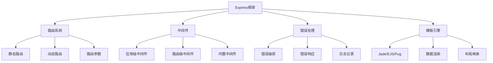
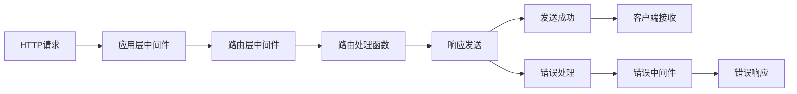

# Express核心机制



## 📋 知识结构（金字塔模型）

### 🏗️ 基础层：认知（What）
**Express框架的核心特性**

| 特性 | 描述 | 优势 | 应用场景 |
|------|------|------|----------|
| **路由系统** | URL到处理函数的映射 | 灵活性高 | REST API |
| **中间件** | 请求处理管道 | 模块化 | 功能扩展 |
| **静态文件** | 直接服务文件 | 性能好 | 前端资源 |
| **模板引擎** | 动态HTML生成 | 服务端渲染 | 传统Web |

### 🔍 理解层：机制（Why&How）

**Express请求处理流程：**



**中间件执行顺序：**

| 执行阶段 | 中间件类型 | 示例 | 作用 |
|----------|------------|------|------|
| **预处理** | 应用级 | app.use | 全局处理 |
| **路由前** | 路径特定 | router.use | 分组处理 |
| **路由中** | 路由级 | router.get | 特定路由 |
| **响应后** | 错误处理 | error handler | 异常处理 |

**路由匹配优先级：**

```mermaid
graph TD
    A[路由匹配] --> B[精确匹配]
    A --> C[参数匹配]
    A --> D[正则匹配]
    
    B --> B1[/users]
    C --> C2[/users/:id]
    D --> D3[/files/*.js]
    
    B1 --> E[第一个匹配]
    C2 --> E
    D3 --> E
```

### 🚀 应用层：实践（Apply）

**Express应用架构：**

```javascript
const express = require('express');
const cors = require('cors');
const helmet = require('helmet');
const compression = require('compression');
const morgan = require('morgan');

// ✅ Express应用最佳实践
class ExpressAppBuilder {
  constructor() {
    this.app = express();
    this.setupSecurity();
    this.setupMiddleware();
    this.setupRoutes();
    this.setupErrorHandling();
  }
  
  // 安全配置
  setupSecurity() {
    // Helmet设置安全头
    this.app.use(helmet({
      contentSecurityPolicy: {
        directives: {
          defaultSrc: ["'self'"],
          styleSrc: ["'self'", "'unsafe-inline'"],
          scriptSrc: ["'self'"],
          imgSrc: ["'self'", "data:", "https:"]
        }
      }
    }));
    
    // CORS配置
    this.app.use(cors({
      origin: process.env.ALLOWED_ORIGINS?.split(',') || ['http://localhost:3000'],
      credentials: true,
      methods: ['GET', 'POST', 'PUT', 'DELETE', 'PATCH'],
      allowedHeaders: ['Content-Type', 'Authorization']
    }));
  }
  
  // 基础中间件配置
  setupMiddleware() {
    // 压缩响应
    this.app.use(compression());
    
    // 日志记录
    this.app.use(morgan(process.env.NODE_ENV === 'production' ? 'combined' : 'dev'));
    
    // Body解析
    this.app.use(express.json({ limit: '10mb' }));
    this.app.use(express.urlencoded({ extended: true, limit: '10mb' }));
    
    // 静态文件服务
    this.app.use('/public', express.static(path.join(__dirname, 'public')));
    
    // 请求ID和计时
    this.app.use((req, res, next) => {
      req.id = require('crypto').randomUUID();
      req.startTime = Date.now();
      
      res.on('finish', () => {
        const duration、= Date.now() - req.startTime;
        console.log(`${req.method} ${req.url} - ${res.statusCode} (${duration}ms) [${req.id}]`);
      });
      
      next();
    });
  }
  
  // 路由配置
  setupRoutes() {
    // 健康检查
    this.app.get('/health', (req, res) => {
      res.json({
        status: 'OK',
        timestamp: new Date().toISOString(),
        uptime: process.uptime(),
        memory: process.memoryUsage(),
        version: process.env.npm_package_version
      });
    });
    
    // API路由
    this.app.use('/api/v1', require('./routes/api/v1'));
    
    // Web路由
    this.app.use('/', require('./routes/web'));
    
    // 404处理
    this.app.use('*', (req, res) => {
      res.status(404).json({
        error: 'Not Found',
        message: `路由 ${req.method} ${req.originalUrl} 不存在`,
        requestId: req.id
      });
    });
  }
  
  // 错误处理
  setupErrorHandling() {
    // 错误处理中间件
    this.app.use((error, req, res, next) => {
      console.error(`错误 [${req?.id}]:`, error);
      
      const statusCode = error.statusCode || error.status || 500;
      const message = process.env.NODE_ENV === 'production' 
        ? 'Internal Server Error'
        : error.message;
      
      res.status(statusCode).json({
        error: true,
        message,
        requestId: req?.id,
        ...(process.env.NODE_ENV !== 'production' && {
          stack: error.stack
        })
      });
    });
  }
  
  // 启动服务器
  start(port = 3000) {
    return new Promise((resolve, reject) => {
      try {
        const server = this.app.listen(port, () => {
          console.log(`🚀 Server running on port ${port}`);
          console.log(`📍 Environment: ${process.env.NODE_ENV}`);
          resolve(server);
        });
        
        // 优雅关闭
        process.on('SIGTERM', () => this.gracefulShutdown(server));
        process.on('SIGINT', () => this.gracefulShutdown(server));
        
      } catch (error) {
        reject(error);
      }
    });
  }
  
  // 优雅关闭
  gracefulShutdown(server) {
    console.log('🛑 开始优雅关闭...');
    
    server.close((err) => {
      if (err) {
        console.error('❌ 服务关闭错误:', err);
        process.exit(1);
      }
      
      console.log('✅ 服务已安全关闭');
      process.exit(0);
    });
    
    // 超时强制关闭
    setTimeout(() => {
      console.error('⚠️ 强制关闭服务');
      process.exit(1);
    }, 10000);
  }
}
```

**高级路由设计：**

```javascript
// ✅ 路由工厂模式
class RouteFactory {
  static createCRUDRoutes(model, controller) {
    const router = express.Router();
    
    // REST资源路由
    router.route('/')
      .get(controller.list.bind(controller))
      .post(RouteFactory.validateBody, controller.create.bind(controller));
    
    router.route('/:id')
      .get(RouteFactory.valid ateId, controller.getById.bind(controller))
      .put(
        RouteFactory.validateId,
        RouteFactory.validateBody,
        controller.update.bind(controller)
      )
      .patch(RouteFactory.validateId, controller.partialUpdate.bind(controller))
      .delete(RouteFactory.validateId, controller.delete.bind(controller));
    
    return router;
  }
  
  // 通用验证中间件
  static validateId(req, res, next) {
    const id = req.params.id;
    
    if (id && /^[a-f\d]{24}$/i.test(id)) {
      next();
    } else {
      res.status(400).json({
        error: 'Invalid ID format',
        message: 'ID must be a valid MongoDB ObjectId'
      });
    }
  }
  
  static validateBody(req, res, next) {
    if (!req.body || Object.keys(req.body).length === 0) {
      return res.status(400).json({
        error: 'Empty request body',
        message: 'Request body cannot be empty'
      });
    }
    
    next();
  }
  
  // 分页路由
  static createPaginatedRoute(controller, options = {}) {
    return async (req, res, next) => {
      try {
        const page = Math.max(1, parseInt(req.query.page) || 1);
        const limit = Math.min(100, parseInt(req.query.limit) || 10);
        const skip = (page - 1) * limit;
        
        // 排序
        const sortBy = req.query.sortBy || options.sortBy || 'createdAt';
        const sortOrder = req.query.sortOrder === 'asc' ? 1 : -1;
        const sort = { [sortBy]: sortOrder };
        
        // 过滤条件
        const filter = RouteFactory.buildFilter(req.query.filter, options.fields);
        
        // 字段选择
        const fields = req.query.fields ? req.query.fields.split(',') : options.select;
        
        const result = await controller.findPaginated({
          filter,
          sort,
          skip,
          limit,
          fields
        });
        
        res.json({
          data: result.data,
          pagination: {
            current: page,
            limit,
            total: result.total,
            pages: Math.ceil(result.total / limit),
            hasNext: page * limit < result.total,
            hasPrev: page > 1
          }
        });
      } catch (error) {
        next(error);
      }
    };
  }
  
  static buildFilter(filterString, allowedFields) {
    if (!filterString) return {};
    
    try {
      const filter = JSON.parse(filterString);
      
      // 安全检查：只允许特定字段过滤
      if (allowedFields) {
        const keys = Object.keys(filter);
        const invalidKeys = keys.filter(key => !allowedFields.includes(key));
        
        if (invalidKeys.length > 0) {
          throw new Error(`不允许过滤的字段: ${invalidKeys.join(', ')}`);
        }
      }
      
      return filter;
    } catch (error) {
      throw new Error(`过滤器格式错误: ${error.message}`);
    }
  }
  
  // 批量操作路由
  static createBatchRoute(controller) {
    return async (req, res, next) => {
      try {
        const operations = req.body.operations;
        
        if (!Array.isArray(operations)) {
          return res.status(400).json({
            error: 'Invalid request',
            message: 'operations must be an array'
          });
        }
        
        const results = await controller.batchProcess(operations);
        
        res.json({
          success: true,
          results,
          summary: {
            total: operations.length,
            successful: results.filter(r => r.success).length,
            failed: results.filter(r => !r.success).length
          }
        });
      } catch (error) {
        next(error);
      }
    };
  }
}
```

**控制器最佳实践：**

```javascript
// ✅ RESTful控制器基类
class BaseController {
  constructor(model, options = {}) {
    this.model = model;
    this.options = {
      populate: options.populate || [],
      select: options.select || '-__v',
      ...options
    };
  }
  
  // 列表查询
  async list(req, res, next) {
    try {
      const query = this.buildQuery(req.query);
      const options = this.buildOptions(req.query);
      
      const [data, count] = await Promise.all([
        this.model.find(query, this.options.select)
          .populate(this.options.populate)
          .sort(options.sort)
          .limit(options.limit)
          .skip(options.skip),
        this.model.countDocuments(query)
      ]);
      
      res.json({
        data,
        total: count,
        page: Math.ceil((options.skip / options.limit) + 1),
        limit: options.limit
      });
    } catch (error) {
      next(error);
    }
  }
  
  // 单个查询
  async getById(req, res, next) {
    try {
      const data = await this.model.findById(req.params.id)
        .populate(this.options.populate)
        .select(this.options.select);
      
      if (!data) {
        return res.status(404).json({
          error: 'Not Found',
          message: 'Resource not found'
        });
      }
      
      res.json({ data });
    } catch (error) {
      next(error);
    }
  }
  
  // 创建资源
  async create(req, res, next) {
    try {
      const data = await this.model.create(req.body);
      
      res.status(201).json({
        data,
        message: 'Resource created successfully'
      });
    } catch (error) {
      next(this.handleModelError(error));
    }
  }
  
  // 更新资源
  async update(req, res, next) {
    try {
      const data = await this.model.findByIdAndUpdate(
        req.params.id,
        req.body,
        { new: true, runValidators: true }
      ).populate(this.options.populate).select(this.options.select);
      
      if (!data) {
        return res.status(404).json({
          error: 'Not Found',
          message: 'Resource not found'
        });
      }
      
      res.json({
        data,
        message: 'Resource updated successfully'
      });
    } catch (error) {
      next(this.handleModelError(error));
    }
  }
  
  // 删除资源
  async delete(req, res, next) {
    try {
      const data = await this.model.findByIdAndDelete(req.params.id);
      
      if (!data) {
        return res.status(404).json({
          error: 'Not Found',
          message: 'Resource not found'
        });
      }
      
      res.status(204).end();
    } catch (error) {
      next(this.handleModelError(error));
    }
  }
  
  // 构建查询条件
  buildQuery(queryParams) {
    const query = {};
    
    // 文本搜索
    if (queryParams.search) {
      const searchRegex = new RegExp(queryParams.search, 'i');
      query.$or = this.getSearchableFields().map(field => ({
        [field]: searchRegex
      }));
    }
    
    // 日期范围
    if (queryParams.dateFrom) {
      query.createdAt = { ...query.createdAt, $gte: new Date(queryParams.dateFrom) };
    }
    if (queryParams.dateTo) {
      query.createdAt = { ...query.createdAt, $lte: new Date(queryParams.dateTo) };
    }
    
    return query;
  }
  
  // 构建查询选项
  buildOptions(queryParams) {
    const page = Math.max(1, parseInt(queryParams.page) || 1);
    const limit = Math.min(100, parseInt(queryParams.limit) || 10);
    const skip = (page - 1) * limit;
    
    // 排序
    const sortBy = queryParams.sortBy || 'createdAt';
    const sortOrder = queryParams.sortOrder === 'asc' ? 1 : -1;
    const sort = { [sortBy]: sortOrder };
    
    return { page, limit, skip, sort };
  }
  
  // 处理Model错误
  handleModelError(error) {
    if (error.name === 'ValidationError') {
      const validationError = new Error('Validation failed');
      validationError.statusCode = 400;
      validationError.details = Object.values(error.errors).map(err => ({
        field: err.path,
        message: err.message,
        value: err.value
      }));
      return validationError;
    }
    
    if (error.code === 11000) {
      const duplicateError = new Error('Duplicate resource');
      duplicateError.statusCode = 409;
      duplicateError.details = Object.keys(error.keyPattern);
      return duplicateError;
    }
    
    return error;
  }
  
  // 获取可搜索字段（子类重写）
  getSearchableFields() {
    return ['name', 'title', 'description'];
  }
}
```

**中间件开发模式：**

```javascript
// ✅ 中间件工厂模式
class MiddlewareFactory {
  // 认证中间件
  static createAuthMiddleware(options = {}) {
    return async (req, res, next) => {
      try {
        const token = req.headers.authorization?.replace('Bearer ', '');
        
        if (!token) {
          return res.status(401).json({
            error: 'Authentication required',
            message: 'Authorization header missing or invalid'
          });
        }
        
        const decoded = jwt.verify(token, options.secret || process.env.JWT_SECRET);
        req.user = await User.findById(decoded.userId);
        
        if (!req.user) {
          return res.status(401).json({
            error: 'Invalid token',
            message: 'User not found'
          });
        }
        
        next();
      } catch (error) {
        next(error);
      }
    };
  }
  
  // 权限中间件
  static createRoleMiddleware(requiredRoles) {
    return (req, res, next) => {
      if (!req.user) {
        return res.status(401).json({
          error: 'Authentication required'
        });
      }
      
      const hasRequiredRole = requiredRoles.includes(req.user.role);
      
      if (!hasRequiredRole) {
        return res.status(403).json({
          error: 'Insufficient permissions',
          message: `Required roles: ${requiredRoles.join(', ')}`
        });
      }
      
      next();
    };
  }
  
  // 请求限制中间件
  static createRateLimitMiddleware(options) {
    const { windowMs = 900000, max = 100, message } = options;
    
    const requests = new Map();
    
    return (req, res, next) => {
      const key = req.ip || req.connection.remoteAddress;
      const now = Date.now();
      
      // 清理过期记录
      if (requests.has(key)) {
        const userRequests = requests.get(key);
        const validRequests = userRequests.filter(time => now - time < windowMs);
        
        if (validRequests.length >= max) {
          return res.status(429).json({
            error: 'Too Many Requests',
            message: message || '请求过于频繁，请稍后重试'
          });
        }
        
        requests.set(key, [...validRequests, now]);
      } else {
        requests.set(key, [now]);
      }
      
      next();
    };
  }
  
  // API key验证中间件
  static createApiKeyMiddleware() {
    return async (req, res, next) => {
      try {
        const apiKey = req.headers['x-api-key'];
        
        if (!apiKey) {
          return res.status(401).json({
            error: 'API key required',
            message: 'x-api-key header is missing'
          });
        }
        
        const keyData = await ApiKey.findOne({ key: apiKey, active: true });
        
        if (!keyData) {
          return res.status(401).json({
            error: 'Invalid API key',
            message: 'Provided API key is invalid'
          });
        }
        
        // 检查使用限制
        if (keyData.requestsUsed >= keyData.requestsLimit) {
          return res.status(429).json({
            error: 'API key limit exceeded',
            message: 'API key request limit reached'
          });
        }
        
        req.apiKey = keyData;
        
        // 更新使用计数（异步）
        ApiKey.findOneAndUpdate(
          { key: apiKey },
          { $inc: { requestsUsed: 1 } }
        ).catch(err => console.error('API key计数更新失败:', err));
        
        next();
      } catch (error) {
        next(error);
      }
    };
  }
}
```

## 🧠 费曼学习法：能用简单的话解释

**Express核心思想：**
1. **Express** = Web开发的"工具箱"，提供常用工具
2. **中间件** = 快递分拣流水线，每个环节处理一个方面
3. **路由** = 电话转接，根据电话号码找到对应的人

**开发原则：**
```javascript
const developmentPrinciples = {
  '中间件优先': '功能模块化，便于测试和维护',
  '错误处理': '全局错误处理，统一错误格式',
  '安全第一': '认证、授权、输入验证不能少',
  '性能优化': '压缩、缓存、懒加载'
};
```

## 🎯 刻意练习要点

**必须掌握的技能：**
- [ ] 搭建完整的Express应用架构
- [ ] 设计和实现RESTful API
- [ ] 开发自定义中间件
- [ ] 处理各种错误和异常情况

**编程练习：**

**1. 实现一个完整的REST API**
```javascript
// 练习：创建用户管理API
class UserController extends BaseController {
  constructor() {
    super(User, {
      populate: [
        { path: 'profile', select: 'firstName lastName avatar' },
        { path: 'roles', select: 'name permissions' }
      ],
      select: '-password'
    });
  }
  
  // 自定义验证
  async create(req, res, next) {
    // 验证邮箱唯一性
    const existingUser = await User.findOne({ email: req.body.email });
    if (existingUser) {
      return res.status(409).json({
        error: 'Email already exists',
        message: 'A user with this email already exists'
      });
    }
    
    // 密码哈希
    req.body.password = await bcrypt.hash(req.body.password, 10);
    
    super.create(req, res, next);
  }
  
  // 用户登录
  async login(req, res, next) {
    try {
      const { email, password } = req.body;
      
      const user = await User.findOne({ email }).select('+password');
      if (!user || !await bcrypt.compare(password, user.password)) {
        return res.status(401).json({
          error: 'Invalid credentials',
          message: 'Email or password is incorrect'
        });
      }
      
      const token = jwt.sign(
        { userId: user._id },
        process.env.JWT_SECRET,
        { expiresIn: '24h' }
      );
      
      res.json({
        data: {
          user: await User.findById(user._id).populate('profile roles'),
          token
        },
        message: 'Login successful'
      });
    } catch (error) {
      next(error);
    }
  }
  
  getSearchableFields() {
    return ['email', 'username', 'firstName', 'lastName'];
  }
}
```

**2. 开发自定义中间件**
```javascript
// 练习：实现请求日志中间件
class RequestLoggerMiddleware {
  static create(config = {}) {
    const logger = winston.createLogger({
      level: config.level || 'info',
      format: winston.format.printf(info => {
        const { level, message, requestId, timestamp, ...meta } = info;
        return JSON.stringify({
          level,
          timestamp,
          requestId,
          message,
          ...meta
        });
      }),
      transports: [
        new winston.transports.File({
          filename: config.file || 'access.log'
        })
      ]
    });
    
    return (req, res, next) => {
      const startTime = Date.now();
      req.log = logger.child({ requestId: req.id });
      
      res.on('finish', () => {
        const duration = Date.now() - startTime;
        
        logger.info('HTTP Request', {
          requestId: req.id,
          method: req.method,
          url: req.url,
          statusCode: res.statusCode,
          duration,
          userAgent: req.get('User-Agent'),
          ip: req.ip,
          contentLength: res.get('Content-Length')
        });
      });
      
      next();
    };
  }
}
```

**性能测试和优化：**
```javascript
// ✅ Express应用性能测试
class ExpressPerformanceTest {
  static async runLoadTest(url, options = {}) {
    const { concurrent = 10, requests = 100, duration = 30 } = options;
    
    const results = {
      totalRequests: 0,
      successfulRequests: 0,
      failedRequests: 0,
      averageResponseTime: 0,
      minResponseTime: Infinity,
      maxResponseTime: 0,
      requestsPerSecond: 0
    };
    
    const startTime = Date.now();
    const responseTimes = [];
    
    // 发起并发请求
    const promises = [];
    for (let i = 0; i < concurrent; i++) {
      promises.push(this.makeRequests(url, requests / concurrent));
    }
    
    const allResults = await Promise.all(promises);
    
    // 汇总结果
    allResults.forEach(result => {
      results.totalRequests += result.total;
      results.successfulRequests += result.successful;
      results.failedRequests += result.failed;
      responseTimes.push(...result.responseTimes);
    });
    
    // 计算性能指标
    results.averageResponseTime = responseTimes.reduce((a, b) => a + b, 0) / responseTimes.length;
    results.minResponseTime = Math.min(...responseTimes);
    results.maxResponseTime = Math.max(...responseTimes);
    results.requestsPerSecond = results.totalRequests / ((Date.now() - startTime) / 1000);
    
    return results;
  }
  
  static async makeRequests(url, count) {
    const results = {
      total: 0,
      successful: 0,
      failed: 0,
      responseTimes: []
    };
    
    for (let i = 0; i < count; i++) {
      const startTime = Date.now();
      
      try {
        const response = await axios.get(url);
        const responseTime = Date.now() - startTime;
        
        results.total++;
        results.successful++;
        results.responseTimes.push(responseTime);
      } catch (error) {
        results.total++;
        results.failed++;
      }
      
      // 短暂延迟避免过载
      await new Promise(resolve => setTimeout(resolve, 10));
    }
    
    return results;
  }
}
```

**关联学习：**
- → [[016-Web应用架构设计]] Express应用的架构设计
- → [[017-数据库集成方案]] 数据库集成实践
- → [[018-身份验证与授权]] 安全认证系统

## 💡 知识点跳转

**前置知识：** [[008-网络编程基础]] - HTTP服务器基础
**后续深入：** [[016-Web应用架构设计]] - 应用架构设计

---

*🔗 相关链接：[[008-网络编程基础]] | [[016-Web应用架构设计]] | [[017-数据库集成方案]]*
